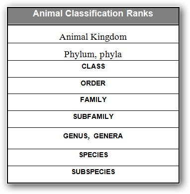

# Animals in the Bible

## License Information

Animals in the Bible © United Bible Societies, 2025. Adapted from: <cite>All Creatures Great and Small: Living Things in the Bible</cite>, by Edward R. Hope © 2005 United Bible Societies. This work is licensed under Creative Commons Attribution-ShareAlike 4.0 International (<a href="https://creativecommons.org/licenses/by-sa/4.0/">https://creativecommons.org/licenses/by-sa/4.0/</a>).

--------------------------------

## Introduction (id: FAUNA:0.1)

0\.1 Introduction
=================

* [1\. Animals, general](#FAUNA:1)
* [2\. Mammals](#FAUNA:2)
* [3\. Birds](#FAUNA:3)
* [4\. Snakes and lizards](#FAUNA:4)
* [5\. Fish, frogs, and mollusks](#FAUNA:5)
* [6\. Insects, spiders, and worms](#FAUNA:6)
* [7\. Mythical monsters](#FAUNA:7)

**The Ancient Environment**
---------------------------

Animals, birds, snakes, insects, and other creatures are mentioned very frequently in the Bible, especially in the poetic books of Job and Psalms, and in many of the prophets. This is to be expected, since the people of Israel lived in an environment that had not been modified to any great extent by man, and the hunters among them, hunting with their simple weapons, had not reduced animal populations significantly. A certain amount of woodland was cut down for human use or burnt to create grazing land, but this would not have been very extensive. For century after century the environment would have been left virtually in its natural state.

Even in their major cities the Hebrew people were surrounded by birds, lizards, and insects, and they did not need to venture very far afield before they were among wild animals. There were herds of gazelles and antelope grazing and browsing freely in the open plains, with deer and wild pigs in the more wooded areas. In the rockier mountain areas there were ibexes and wild mountain sheep. These city dwellers also had livestock of their own, feeding in the pastures around the city, cared for by family members or hired herdsmen. They would thus all have been very familiar with the habits and behavior of both the domestic and the wild creatures.

The land in those days had, and still has, a large number of bird species, some of which were resident, while others were migrants. Many species of bird from Central Asia and Europe fly to Africa at the beginning of the northern winter. In order to avoid flying long distances over the Mediterranean Sea or the Indian Ocean, they take a land route that passes over Israel. Thus there are literally millions of birds that pass over every year, going south between late September and early November, and returning north in March and April. There are probably more migrating birds passing over Israel than any other country on earth, since this is the only place in the world where three continents meet. Many of them stay for a few weeks in Israel, regaining their strength before they move on again. As a result they are well known to the local people. This would have been true also in biblical times.

**Identifying the Biblical Animals and Birds**
----------------------------------------------

Translating the Hebrew and Greek names of the animals and birds of the Bible is very difficult. There is doubt about the meaning of many of the animal names. Even greater doubt exists about the meaning of most bird names, as can be seen from a comparison of Bible translations. It is rare indeed that they will agree or that the same bird name will be translated the same way each time.

In the light of this problem, the author of this Handbook has tried to apply a uniform methodology for each section of the book. First, there has been a study of archaeological and other evidence, and a careful attempt has been made to ascertain which animals, birds, and other creatures are most likely to have been found in Egypt and the land of Israel in biblical times. Then, on the basis of the biblical contexts in which the creature’s name occurs, and in the light of what is known about the meaning of the verb root from which the name is derived, an attempt has been made to match the most likely creature with the given contexts.

The results of this method should not be taken as the last word on the subject but should be seen as either a) support for one or more existing translations, or b) yet another plausible option from which to choose.

In addition to the above problems, a further problem is that the English names for some of the birds differ from place to place. For example, the eagle known in books published in Britain, Israel, and East Africa as the short\-toed eagle is known as the black\-breasted snake\-eagle in books published in the U.S.A. and southern Africa. For this reason the scientific names are also given along with the popular names. Occasionally there are even alternate scientific names, and in these cases both are given. The scientific names are used universally in bird books, regardless of the language of publication.

Zoologists use a universally accepted system of classifying animals. This handbook makes frequent use of terms in this classification system. In some places, where scientific precision is not a factor, other terms such as “types” or “varieties” may appear. The following is a table of major classification categories, or ranks, in descending order of size. Ranks appearing in BOLD TYPEFACE are defined in the glossary.

**Translating the Words for the Biblical Creatures**
----------------------------------------------------

Translators are advised to obtain the best available field guides for the animals and birds of their area; from this they should try to find the nearest local equivalents. Even where these books are in English, French, Spanish, Portuguese, or German, the pictures, the descriptions, and the scientific names will help to identify the animals or birds, and then the vernacular name, if any, can be found. In some field guides in Africa, such as the excellent *Roberts’ Birds of Southern Africa*, an attempt has been made to provide some of the names in local languages. These vernacular names should be carefully checked on the basis of the pictures and descriptions, and the translators should find out what most people in the language community call the birds. It is likely that there are often regional differences in the vocabulary for birds.

Finding a local equivalent will in many cases be difficult for translators in the Americas, the Far East, and Australasia, especially for the birds, since most of the biblical birds are either found only in the lands of the Bible, or they migrate between Europe or Central Asia and Africa but are not found further afield. The translator will always have the following options:

1\. Translate the biblical word with the local word for the same creature.

2\. Translate the biblical word with the local word for the most similar local creature, paying attention to the special symbolic importance the biblical or local animal may have.

3\. Translate the word for a specific animal with a more generic word. Thus, for instance, where bears are not known, an expression like “a big fierce animal” with a footnote could substitute in some contexts.

4\. Translate the biblical word with a word borrowed from a well\-known trade or international language that refers to the biblical creature, and include a description of the creature in a glossary or short dictionary at the end of your Bible.

Of these options the first one is the best solution, but it will only be possible, of course, where the animal mentioned in the Bible is well known locally. Even in these cases, however, the translator needs to be careful, especially where the animal is referred to in the Bible in a figurative expression or metaphor. The significance in the biblical culture may be very different from its significance in the local culture. As an example, to the Hebrew writers the hyena signified death, ruin, and the desolation that results from being utterly defeated in war. But in some African cultures the hyena is associated with witches. In these cultures to say “Your land will become the dwelling place of hyenas” implies that your land will be taken over by witches. This is not the implication intended by a Hebrew writer using exactly the same expression.

Similarly, in many parts of Asia a dragon symbolizes good fortune and prosperity, but in the Bible it symbolizes evil and wickedness. In cases like these the translator will need to add a footnote to clarify the intended implication for the reader.

The second option is also often a good solution, provided that the local animal and the biblical animal share enough important similarities. Again the implications of using the substitute in figurative expressions should be carefully checked. It is important to avoid giving the wrong impression about the type of climate and landscape that existed in Israel in the choice of a local substitute. For instance, if “water buffalo” is substituted for “wild ox,” and “tiger” is substituted for “lion,” the reader automatically pictures Israel as a land of monsoon rain forest. It may be necessary in such cases to add a footnote indicating that the original text actually refers to different animals similar to those mentioned in the translation.

If the translator opts to use a generic expression where the original refers to a specific animal or bird (option 3\), care should again be taken to recreate the correct implications in cases where the animal is referred to in a figurative expression. This can often be done by adding an adjective or a descriptive phrase. For instance, where jackals are not known but dogs are, “wild dog” may be the best local equivalent, but it would not carry the right implication in many contexts. However, a phrase like “wild dog of doom” may recreate the intended implication. Such “additions” are entirely justified, since the implication is clearly intended in the original text.

In the case where borrowed words are used in the translation (option 4\), the word should always be explained in a glossary at the end of the Bible. Care should also be taken to spell the borrowed word in a way that readers will be able to pronounce easily. If readers stumble and hesitate when reading these borrowed words, this is an indication that the transliteration needs improving at this point.

**Special Features of this Handbook**
-------------------------------------

In spite of the importance of animals in the Bible, it is very confusing for many translators and Bible students to compare various Bible translations and discover that when it comes to the names of animals and birds, the versions hardly ever agree. For example, if the list of unclean birds in [LEV 11:13–LEV 11:19](https://ref.ly/Lev11:13-Lev11:19) is compared in different versions, it can be seen that what the Revised Standard Version (RSV (Revised Standard Version (1952))) calls an “ibis” the New English Bible (NEB (New English Bible (1970))) calls a “screech owl,” the Jerusalem Bible (JB (Jerusalem Bible (1966))) a “cormorant,” and the New International Version (NIV (New International Version (1984))) a “great owl.” In fact there are no two English versions in which the list is identical.

This all stems from the fact that many of the ancient Hebrew words for animals, birds, insects, and reptiles cannot be associated with a particular creature with any certainty. At best the commentators and translators can only make their best, educated guesses.

Even the scholars face problems. Many of them are experts in Hebrew and Greek, or in other ancient languages of the Middle East, but they have very little expertise when it comes to the study of animals, birds, and so forth. As a result, in some versions the text is made to refer to animals that never existed in Bible lands. Alternatively they may know all about the animals and birds of the region but have only a slight knowledge of biblical Hebrew and Greek.

This Handbook is designed to provide the Bible student with a better foundation on which to base interpretations of these problematic words. The zoological, linguistic, and archaeological facts have been studied in great detail (including all of the biblical contexts in which the words occur). The results of this study are summarized here, with an attempt to guide the student or translator to what we consider to be the most probable interpretation. Sometimes this involves not only the interpretation of a word for a particular animal, but also the interpretation of statements that are made about that animal in the Bible.

The book is divided into the following chapters:

Within each chapter the animals are arranged in alphabetical order according to their names. Separate treatment is given to each of the creatures, even to those mentioned only once. To make things as useful as possible for the student/translator, each entry is arranged identically. The heading of the entry is based on the English name or names for the creature that is suggested by the author. This may not be the same name that appears in the English Bible version that the student or translator is using. In cases where there does not seem to be an entry on the animal you wish to study, go to the index l of Animals, and you will find it listed there. Alternatively, you can turn to the index of Scripture References. If you then go to the page number given in the index, you will find some discussion about the creature you are looking for.

As a general rule, there is at least one Bible version and a group of scholars that support the author’s recommended translation, but in one or two cases the only support for the recommendation comes from some scholars but not from any current version of the English Bible. In all cases this is clearly indicated in the text.

We hope that this Handbook will prove to be both helpful and interesting to all who read it. At times it has been necessary to use language that is fairly technical, but an attempt has been made to include in parentheses the more common, but slightly less precise, expressions.

* **Associated Passages:** Leviticus 11:13; Leviticus 11:19

