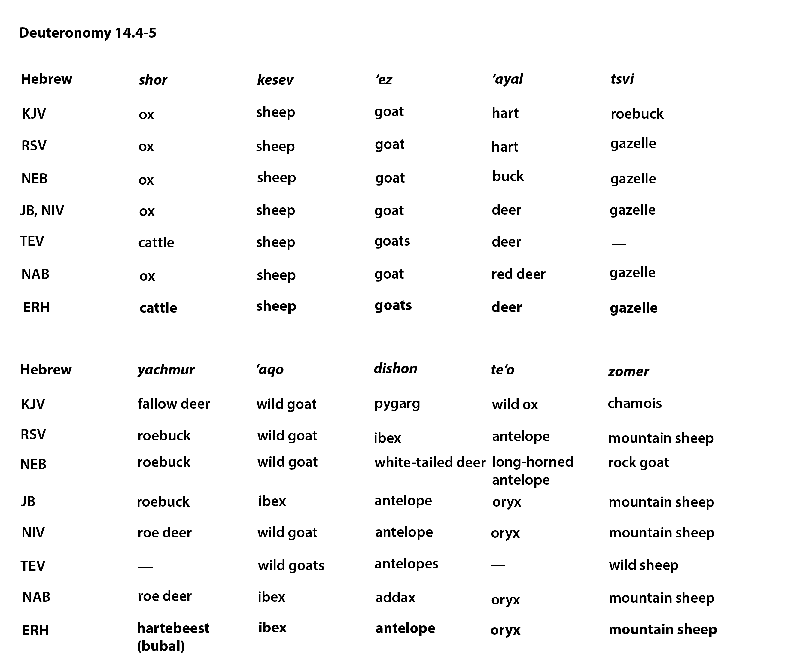

# Animals in the Bible

## License Information

Animals in the Bible © United Bible Societies, 2025. Adapted from: <cite>All Creatures Great and Small: Living Things in the Bible</cite>, by Edward R. Hope © 2005 United Bible Societies. This work is licensed under Creative Commons Attribution-ShareAlike 4.0 International (<a href="https://creativecommons.org/licenses/by-sa/4.0/">https://creativecommons.org/licenses/by-sa/4.0/</a>).

--------------------------------

## Clean animals (Deut 14:4–6) (id: FAUNA:2.1)

2\.1 Clean animals (Deut 14:4–6\)
=================================

In [DEU 14:4–DEU 14:6](https://ref.ly/Deut14:4-Deut14:6) there is a list of clean animals which contains three domestic animals, about which there is no difference of opinion, and seven other vegetation\-eating animals, about which there is considerable difference of opinion.

It seems useful, before trying to identify each, to try to deduce from the archeological evidence which animals of this type would have been familiar to the people of the period. It is certain that they would have known the gazelle, the oryx, the ibex, the fallow deer, and the mountain sheep, since all of these were found in the region. These animals can be related to the Hebrew words *tsvi, te’o, ’aqo, ’ayal*, and *zemer* respectively. That accounts for five of the seven. The remaining two are a problem.

Among the wild animals found in biblical lands from very early times which would certainly have been considered clean are the red hartebeest and an antelope of the kobus type. It seems likely that the problematic Hebrew word *yachmur* refers to one of these, probably the hartebeest. If this is correct, then it would seem that Solomon kept herds of red hartebeest in later times in Israel ([1KI 4:23](https://ref.ly/1Kgs4:23)). This type of herding of wild hartebeest was common in Mesopotamia and Egypt.

The other problematic Hebrew word, *dishon*, may refer to the kobus antelope, or to the addax antelope, which was another animal kept in herds in Egypt.

What is clear is that all “game animals” known to the Israelites — deer, antelopes, gazelles, wild goats, and wild sheep — were included in the list of clean animals. Retaining this fact in the translation is probably more important than establishing the identity of each of the Hebrew words.

**Deuteronomy 14\.4–5**
-----------------------

---

| Hebrew | *shor* | *kesev* | *‘ez* | *’ayal* | *tsvi* |
| --- | --- | --- | --- | --- | --- |
| KJV (King James Version (1611)) | ox | sheep | goat | hart | roebuck |
| RSV (Revised Standard Version (1952)) | ox | sheep | goat | hart | gazelle |
| NEB (New English Bible (1970)) | ox | sheep | goat | buck | gazelle |
| JB (Jerusalem Bible (1966)), NIV (New International Version (1984)) | ox | sheep | goat | deer | gazelle |
| TEV (Today's English Version (Good News Bible)) | cattle | sheep | goats | deer | —— |
| NAB (New American Bible (1970)) | ox | sheep | goat | red deer | gazelle |
| ERH (Edward R. Hope (Animals in the Bible)) | **cattle** | **sheep** | **goats** | **deer** | **gazelle** |
| Hebrew | *yachmur* | *’aqo* | *dishon* | *te’o* | *zomer* |
| KJV (King James Version (1611)) | fallow deer | wild goat | pygarg | wild ox | chamois |
| RSV (Revised Standard Version (1952)) | roebuck | wild goat | ibex | antelope | mountain sheep |
| NEB (New English Bible (1970)) | roebuck | wild goat | white\-tailed deer | long\-horned antelope | rock goat |
| JB (Jerusalem Bible (1966)) | roebuck | ibex | antelope | oryx | mountain sheep |
| NIV (New International Version (1984)) | roe deer | wild goat | antelope | oryx | mountain sheep |
| TEV (Today's English Version (Good News Bible)) | —— | wild goats | antelopes | —— | wild sheep |
| NAB (New American Bible (1970)) | roe deer | ibex | addax | oryx | mountain sheep |
| ERH (Edward R. Hope (Animals in the Bible)) | **hartebeest(bubal)** | **ibex** | **antelope** | **oryx** | **mountain sheep** |

---

* **Associated Passages:** Deuteronomy 14:4; Deuteronomy 14:6; 1 Kings 4:23

