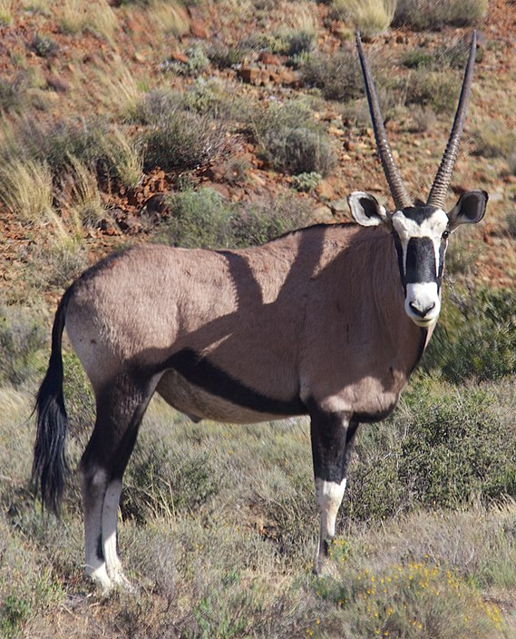
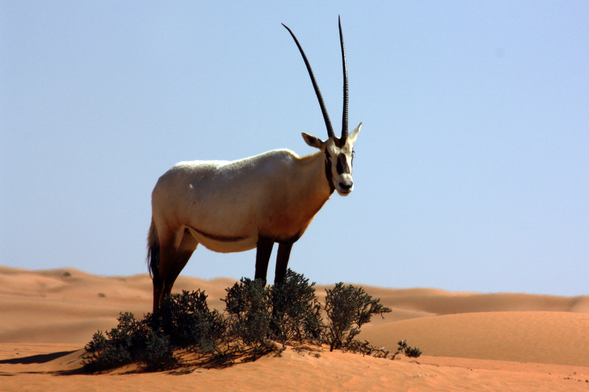

# Animals in the Bible

## License Information

Animals in the Bible © United Bible Societies, 2025. Adapted from: <cite>All Creatures Great and Small: Living Things in the Bible</cite>, by Edward R. Hope © 2005 United Bible Societies. This work is licensed under Creative Commons Attribution-ShareAlike 4.0 International (<a href="https://creativecommons.org/licenses/by-sa/4.0/">https://creativecommons.org/licenses/by-sa/4.0/</a>).

--------------------------------

## Oryx (id: FAUNA:2.29)

2\.29 Oryx
==========

References:
-----------

Hebrew תְּאוֹ (te’o)

[DEU 14:5](https://ref.ly/Deut14:5), [ISA 51:20](https://ref.ly/Isa51:20)

Discussion:
-----------

Most modern scholars are of the opinion that the Hebrew word *te’o* refers to the oryx. Oryx bones have been found in proximity to Israelite and Canaanite domestic and sacrificial sites that date over a very wide time span proof that the animal was fairly common and was considered to be acceptable to eat. Furthermore it is known that until the mid\-nineteenth century large numbers of oryx roamed the Negev in Palestine.

Description:
------------

The Arabian or Desert Oryx *Oryx leucoryx* is a medium\-sized antelope, about the size of a donkey. It is closely related to the African oryxes, such as the Gemsbok *Oryx gazella* of the Kalahari and Namib semideserts, the East African Oryx *Oryx beisa*, and the Scimitar\-horned Oryx *Oryx algazel* of the Sudan and Egypt. In many ways the oryx is also similar to, but smaller than, the Sable Antelope *Hippotragus niger* and the Roan Antelope *Hippotragus equinus*, both of which are found in South Africa, Zimbabwe, Zambia, and Angola.

The Arabian oryx, which was once plentiful in the land of Israel is now almost extinct and the only remaining specimens have been bred in semicaptivity and in captivity from one small breeding herd. This inbreeding and captivity have resulted in marked genetic deterioration so that today’s specimens are smaller and weaker than their ancestors and many have deformed horns. So although the specimens in photographs give us a rough idea of what the original Arabian oryx was like, these modern defects should be borne in mind.

Both males and females of the Arabian oryx have long slender horns that are usually over a meter (3 feet) long. The horns are almost straight and slope back from the animal’s head at about thirty degrees from the perpendicular. The adults are a light fawn color with dark brown markings on the face and on the lower part of both front and back legs. The belly is white.

In the wild oryxes are well able to defend themselves with their long horns and the African species are often able to drive off lions and other predators sometimes even killing their attackers. When wounded by hunters they are extremely dangerous. They are also very strong runners. They live in semi\-desert conditions and are very hardy.

Special significance or symbolism:
----------------------------------

The oryx was known for its strength (perhaps exaggerated since strength was associated with long horns) and bravery. Oryx horns are the longest horns known in the Middle East and North Africa and since horns were a symbol of power and strength this probably added to the association of the oryx with power. According to some Jewish scholars oryx horns were later used to make special *shofar* trumpets blown only at Passover. The oryx is listed among the clean animals.

Translation:
------------

In Africa and other areas where oryxes or sable and roan antelopes are known, the word for one of these animals could be used throughout. Elsewhere, a term, such as “long\-horned antelopes", could be used for *te’o*, or a transliteration of the Hebrew word might be considered, with a description given in a footnote or in the glossary.

* **Associated Passages:** Deuteronomy 14:5; Isaiah 51:20

