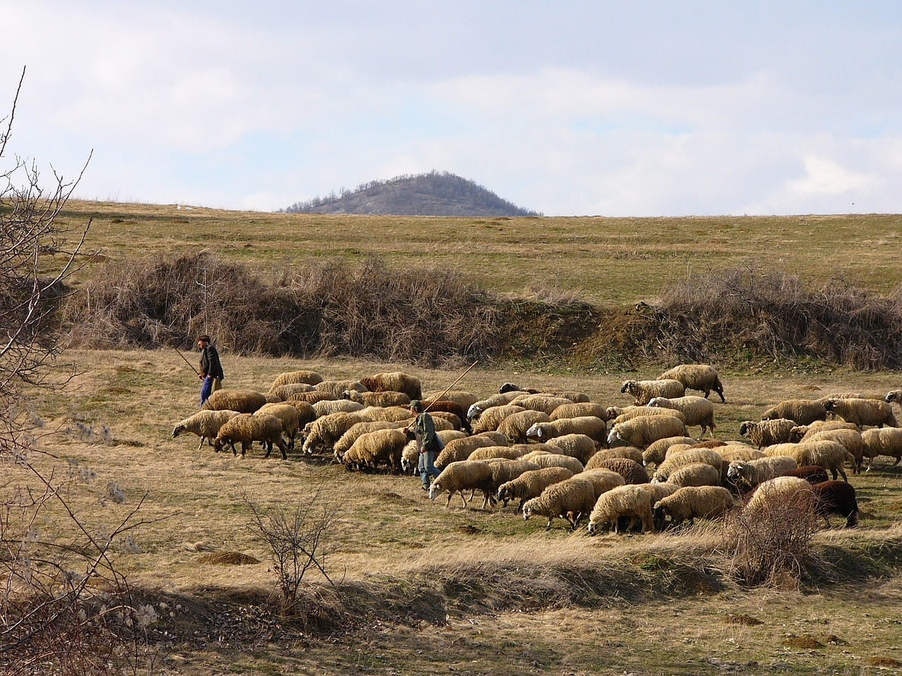

# Animals in the Bible

## License Information

Animals in the Bible © United Bible Societies, 2025. Adapted from: <cite>All Creatures Great and Small: Living Things in the Bible</cite>, by Edward R. Hope © 2005 United Bible Societies. This work is licensed under Creative Commons Attribution-ShareAlike 4.0 International (<a href="https://creativecommons.org/licenses/by-sa/4.0/">https://creativecommons.org/licenses/by-sa/4.0/</a>).

--------------------------------

## Sheep, lamb (id: FAUNA:2.31)

2\.31 Sheep, lamb
=================

References:
-----------

Hebrew אַיִל (’ayil)

[GEN 15:9](https://ref.ly/Gen15:9), [GEN 22:13](https://ref.ly/Gen22:13), [GEN 22:13](https://ref.ly/Gen22:13), [GEN 31:38](https://ref.ly/Gen31:38), [GEN 32:15](https://ref.ly/Gen32:15), [EXO 25:5](https://ref.ly/Exod25:5), [EXO 26:14](https://ref.ly/Exod26:14), [EXO 29:1](https://ref.ly/Exod29:1), [EXO 29:3](https://ref.ly/Exod29:3), [EXO 29:15](https://ref.ly/Exod29:15), [EXO 29:15](https://ref.ly/Exod29:15), [EXO 29:16](https://ref.ly/Exod29:16), [EXO 29:17](https://ref.ly/Exod29:17), [EXO 29:18](https://ref.ly/Exod29:18), [EXO 29:19](https://ref.ly/Exod29:19), [EXO 29:19](https://ref.ly/Exod29:19), [EXO 29:20](https://ref.ly/Exod29:20), [EXO 29:22](https://ref.ly/Exod29:22), [EXO 29:22](https://ref.ly/Exod29:22), [EXO 29:26](https://ref.ly/Exod29:26), [EXO 29:27](https://ref.ly/Exod29:27), [EXO 29:31](https://ref.ly/Exod29:31), [EXO 29:32](https://ref.ly/Exod29:32), [EXO 35:7](https://ref.ly/Exod35:7), [EXO 35:23](https://ref.ly/Exod35:23), [EXO 36:19](https://ref.ly/Exod36:19), [EXO 39:34](https://ref.ly/Exod39:34), [LEV 5:15](https://ref.ly/Lev5:15), [LEV 5:16](https://ref.ly/Lev5:16), [LEV 5:18](https://ref.ly/Lev5:18), [LEV 5:25](https://ref.ly/Lev5:25), [LEV 8:2](https://ref.ly/Lev8:2), [LEV 8:18](https://ref.ly/Lev8:18), [LEV 8:18](https://ref.ly/Lev8:18), [LEV 8:20](https://ref.ly/Lev8:20), [LEV 8:21](https://ref.ly/Lev8:21), [LEV 8:22](https://ref.ly/Lev8:22), [LEV 8:22](https://ref.ly/Lev8:22), [LEV 8:22](https://ref.ly/Lev8:22), [LEV 8:29](https://ref.ly/Lev8:29), [LEV 9:2](https://ref.ly/Lev9:2), [LEV 9:4](https://ref.ly/Lev9:4), [LEV 9:18](https://ref.ly/Lev9:18), [LEV 9:19](https://ref.ly/Lev9:19), [LEV 16:3](https://ref.ly/Lev16:3), [LEV 16:5](https://ref.ly/Lev16:5), [LEV 19:21](https://ref.ly/Lev19:21), [LEV 19:22](https://ref.ly/Lev19:22), [LEV 23:18](https://ref.ly/Lev23:18), [NUM 5:8](https://ref.ly/Num5:8), [NUM 6:14](https://ref.ly/Num6:14), [NUM 6:17](https://ref.ly/Num6:17), [NUM 6:19](https://ref.ly/Num6:19), [NUM 7:15](https://ref.ly/Num7:15), [NUM 7:17](https://ref.ly/Num7:17), [NUM 7:21](https://ref.ly/Num7:21), [NUM 7:23](https://ref.ly/Num7:23), [NUM 7:27](https://ref.ly/Num7:27), [NUM 7:29](https://ref.ly/Num7:29), [NUM 7:33](https://ref.ly/Num7:33), [NUM 7:35](https://ref.ly/Num7:35), [NUM 7:39](https://ref.ly/Num7:39), [NUM 7:41](https://ref.ly/Num7:41), [NUM 7:45](https://ref.ly/Num7:45), [NUM 7:47](https://ref.ly/Num7:47), [NUM 7:51](https://ref.ly/Num7:51), [NUM 7:53](https://ref.ly/Num7:53), [NUM 7:57](https://ref.ly/Num7:57), [NUM 7:59](https://ref.ly/Num7:59), [NUM 7:63](https://ref.ly/Num7:63), [NUM 7:65](https://ref.ly/Num7:65), [NUM 7:69](https://ref.ly/Num7:69), [NUM 7:71](https://ref.ly/Num7:71), [NUM 7:75](https://ref.ly/Num7:75), [NUM 7:77](https://ref.ly/Num7:77), [NUM 7:81](https://ref.ly/Num7:81), [NUM 7:83](https://ref.ly/Num7:83), [NUM 7:87](https://ref.ly/Num7:87), [NUM 7:88](https://ref.ly/Num7:88), [NUM 15:6](https://ref.ly/Num15:6), [NUM 15:11](https://ref.ly/Num15:11), [NUM 23:1](https://ref.ly/Num23:1), [NUM 23:2](https://ref.ly/Num23:2), [NUM 23:4](https://ref.ly/Num23:4), [NUM 23:14](https://ref.ly/Num23:14), [NUM 23:29](https://ref.ly/Num23:29), [NUM 23:30](https://ref.ly/Num23:30), [NUM 28:11](https://ref.ly/Num28:11), [NUM 28:12](https://ref.ly/Num28:12), [NUM 28:14](https://ref.ly/Num28:14), [NUM 28:19](https://ref.ly/Num28:19), [NUM 28:20](https://ref.ly/Num28:20), [NUM 28:27](https://ref.ly/Num28:27), [NUM 28:28](https://ref.ly/Num28:28), [NUM 29:2](https://ref.ly/Num29:2), [NUM 29:3](https://ref.ly/Num29:3), [NUM 29:8](https://ref.ly/Num29:8), [NUM 29:9](https://ref.ly/Num29:9), [NUM 29:13](https://ref.ly/Num29:13), [NUM 29:14](https://ref.ly/Num29:14), [NUM 29:14](https://ref.ly/Num29:14), [NUM 29:17](https://ref.ly/Num29:17), [NUM 29:18](https://ref.ly/Num29:18), [NUM 29:20](https://ref.ly/Num29:20), [NUM 29:21](https://ref.ly/Num29:21), [NUM 29:23](https://ref.ly/Num29:23), [NUM 29:24](https://ref.ly/Num29:24), [NUM 29:26](https://ref.ly/Num29:26), [NUM 29:27](https://ref.ly/Num29:27), [NUM 29:29](https://ref.ly/Num29:29), [NUM 29:30](https://ref.ly/Num29:30), [NUM 29:32](https://ref.ly/Num29:32), [NUM 29:33](https://ref.ly/Num29:33), [NUM 29:36](https://ref.ly/Num29:36), [NUM 29:37](https://ref.ly/Num29:37), [DEU 32:14](https://ref.ly/Deut32:14), [1SA 15:22](https://ref.ly/1Sam15:22), [2KI 3:4](https://ref.ly/2Kgs3:4), [1CH 15:26](https://ref.ly/1Chr15:26), [1CH 29:21](https://ref.ly/1Chr29:21), [2CH 13:9](https://ref.ly/2Chr13:9), [2CH 17:11](https://ref.ly/2Chr17:11), [2CH 29:21](https://ref.ly/2Chr29:21), [2CH 29:22](https://ref.ly/2Chr29:22), [2CH 29:32](https://ref.ly/2Chr29:32), [EZR 8:35](https://ref.ly/Ezra8:35), [EZR 10:19](https://ref.ly/Ezra10:19), [JOB 42:8](https://ref.ly/Job42:8), [PSA 66:15](https://ref.ly/Ps66:15), [PSA 114:4](https://ref.ly/Ps114:4), [PSA 114:6](https://ref.ly/Ps114:6), [ISA 1:11](https://ref.ly/Isa1:11), [ISA 34:6](https://ref.ly/Isa34:6), [ISA 60:7](https://ref.ly/Isa60:7), [JER 51:40](https://ref.ly/Jer51:40), [EZK 27:21](https://ref.ly/Ezek27:21), [EZK 34:17](https://ref.ly/Ezek34:17), [EZK 39:18](https://ref.ly/Ezek39:18), [EZK 43:23](https://ref.ly/Ezek43:23), [EZK 43:25](https://ref.ly/Ezek43:25), [EZK 45:23](https://ref.ly/Ezek45:23), [EZK 45:24](https://ref.ly/Ezek45:24), [EZK 46:4](https://ref.ly/Ezek46:4), [EZK 46:5](https://ref.ly/Ezek46:5), [EZK 46:6](https://ref.ly/Ezek46:6), [EZK 46:7](https://ref.ly/Ezek46:7), [EZK 46:11](https://ref.ly/Ezek46:11), [DAN 8:3](https://ref.ly/Dan8:3), [DAN 8:4](https://ref.ly/Dan8:4), [DAN 8:6](https://ref.ly/Dan8:6), [DAN 8:7](https://ref.ly/Dan8:7), [DAN 8:7](https://ref.ly/Dan8:7), [DAN 8:7](https://ref.ly/Dan8:7), [DAN 8:7](https://ref.ly/Dan8:7), [DAN 8:20](https://ref.ly/Dan8:20), [MIC 6:7](https://ref.ly/Mic6:7)

Aramaic אִמַּר (’imar)

[EZR 6:9](https://ref.ly/Ezra6:9), [EZR 6:17](https://ref.ly/Ezra6:17), [EZR 7:17](https://ref.ly/Ezra7:17)

Aramaic דְּכַר (dekar)

[EZR 6:9](https://ref.ly/Ezra6:9), [EZR 6:17](https://ref.ly/Ezra6:17), [EZR 7:17](https://ref.ly/Ezra7:17)

Hebrew טָלֶה (taleh)

[1SA 7:9](https://ref.ly/1Sam7:9), [ISA 40:11](https://ref.ly/Isa40:11), [ISA 65:25](https://ref.ly/Isa65:25)

Hebrew כֶּבֶשׂ, כַבְשָׂה, כִּבְשָׂה (keves, kavsah, kivsah)

[GEN 21:28](https://ref.ly/Gen21:28), [GEN 21:29](https://ref.ly/Gen21:29), [GEN 21:30](https://ref.ly/Gen21:30), [EXO 12:5](https://ref.ly/Exod12:5), [EXO 29:38](https://ref.ly/Exod29:38), [EXO 29:39](https://ref.ly/Exod29:39), [EXO 29:39](https://ref.ly/Exod29:39), [EXO 29:40](https://ref.ly/Exod29:40), [EXO 29:41](https://ref.ly/Exod29:41), [LEV 4:32](https://ref.ly/Lev4:32), [LEV 9:3](https://ref.ly/Lev9:3), [LEV 12:6](https://ref.ly/Lev12:6), [LEV 14:10](https://ref.ly/Lev14:10), [LEV 14:10](https://ref.ly/Lev14:10), [LEV 14:12](https://ref.ly/Lev14:12), [LEV 14:13](https://ref.ly/Lev14:13), [LEV 14:21](https://ref.ly/Lev14:21), [LEV 14:24](https://ref.ly/Lev14:24), [LEV 14:25](https://ref.ly/Lev14:25), [LEV 23:12](https://ref.ly/Lev23:12), [LEV 23:18](https://ref.ly/Lev23:18), [LEV 23:19](https://ref.ly/Lev23:19), [LEV 23:20](https://ref.ly/Lev23:20), [NUM 6:12](https://ref.ly/Num6:12), [NUM 6:14](https://ref.ly/Num6:14), [NUM 6:14](https://ref.ly/Num6:14), [NUM 7:15](https://ref.ly/Num7:15), [NUM 7:17](https://ref.ly/Num7:17), [NUM 7:21](https://ref.ly/Num7:21), [NUM 7:23](https://ref.ly/Num7:23), [NUM 7:27](https://ref.ly/Num7:27), [NUM 7:29](https://ref.ly/Num7:29), [NUM 7:33](https://ref.ly/Num7:33), [NUM 7:35](https://ref.ly/Num7:35), [NUM 7:39](https://ref.ly/Num7:39), [NUM 7:41](https://ref.ly/Num7:41), [NUM 7:45](https://ref.ly/Num7:45), [NUM 7:47](https://ref.ly/Num7:47), [NUM 7:51](https://ref.ly/Num7:51), [NUM 7:53](https://ref.ly/Num7:53), [NUM 7:57](https://ref.ly/Num7:57), [NUM 7:59](https://ref.ly/Num7:59), [NUM 7:63](https://ref.ly/Num7:63), [NUM 7:65](https://ref.ly/Num7:65), [NUM 7:69](https://ref.ly/Num7:69), [NUM 7:71](https://ref.ly/Num7:71), [NUM 7:75](https://ref.ly/Num7:75), [NUM 7:77](https://ref.ly/Num7:77), [NUM 7:81](https://ref.ly/Num7:81), [NUM 7:83](https://ref.ly/Num7:83), [NUM 7:87](https://ref.ly/Num7:87), [NUM 7:88](https://ref.ly/Num7:88), [NUM 15:5](https://ref.ly/Num15:5), [NUM 15:11](https://ref.ly/Num15:11), [NUM 28:3](https://ref.ly/Num28:3), [NUM 28:4](https://ref.ly/Num28:4), [NUM 28:4](https://ref.ly/Num28:4), [NUM 28:7](https://ref.ly/Num28:7), [NUM 28:8](https://ref.ly/Num28:8), [NUM 28:9](https://ref.ly/Num28:9), [NUM 28:11](https://ref.ly/Num28:11), [NUM 28:13](https://ref.ly/Num28:13), [NUM 28:14](https://ref.ly/Num28:14), [NUM 28:19](https://ref.ly/Num28:19), [NUM 28:21](https://ref.ly/Num28:21), [NUM 28:21](https://ref.ly/Num28:21), [NUM 28:27](https://ref.ly/Num28:27), [NUM 28:29](https://ref.ly/Num28:29), [NUM 28:29](https://ref.ly/Num28:29), [NUM 29:2](https://ref.ly/Num29:2), [NUM 29:4](https://ref.ly/Num29:4), [NUM 29:4](https://ref.ly/Num29:4), [NUM 29:8](https://ref.ly/Num29:8), [NUM 29:10](https://ref.ly/Num29:10), [NUM 29:10](https://ref.ly/Num29:10), [NUM 29:13](https://ref.ly/Num29:13), [NUM 29:15](https://ref.ly/Num29:15), [NUM 29:15](https://ref.ly/Num29:15), [NUM 29:17](https://ref.ly/Num29:17), [NUM 29:18](https://ref.ly/Num29:18), [NUM 29:20](https://ref.ly/Num29:20), [NUM 29:21](https://ref.ly/Num29:21), [NUM 29:23](https://ref.ly/Num29:23), [NUM 29:24](https://ref.ly/Num29:24), [NUM 29:26](https://ref.ly/Num29:26), [NUM 29:27](https://ref.ly/Num29:27), [NUM 29:29](https://ref.ly/Num29:29), [NUM 29:30](https://ref.ly/Num29:30), [NUM 29:32](https://ref.ly/Num29:32), [NUM 29:33](https://ref.ly/Num29:33), [NUM 29:36](https://ref.ly/Num29:36), [NUM 29:37](https://ref.ly/Num29:37), [2SA 12:3](https://ref.ly/2Sam12:3), [2SA 12:4](https://ref.ly/2Sam12:4), [2SA 12:6](https://ref.ly/2Sam12:6), [1CH 29:21](https://ref.ly/1Chr29:21), [2CH 29:21](https://ref.ly/2Chr29:21), [2CH 29:22](https://ref.ly/2Chr29:22), [2CH 29:32](https://ref.ly/2Chr29:32), [2CH 35:7](https://ref.ly/2Chr35:7), [EZR 8:35](https://ref.ly/Ezra8:35), [JOB 31:20](https://ref.ly/Job31:20), [PRO 27:26](https://ref.ly/Prov27:26), [ISA 1:11](https://ref.ly/Isa1:11), [ISA 5:17](https://ref.ly/Isa5:17), [ISA 11:6](https://ref.ly/Isa11:6), [JER 11:19](https://ref.ly/Jer11:19), [EZK 46:4](https://ref.ly/Ezek46:4), [EZK 46:5](https://ref.ly/Ezek46:5), [EZK 46:6](https://ref.ly/Ezek46:6), [EZK 46:7](https://ref.ly/Ezek46:7), [EZK 46:11](https://ref.ly/Ezek46:11), [EZK 46:13](https://ref.ly/Ezek46:13), [EZK 46:15](https://ref.ly/Ezek46:15), [HOS 4:16](https://ref.ly/Hos4:16)

Hebrew כֶּשֶׂב, כִּשְׂבָּה (kesev, kisvah)

[GEN 30:32](https://ref.ly/Gen30:32), [GEN 30:33](https://ref.ly/Gen30:33), [GEN 30:35](https://ref.ly/Gen30:35), [GEN 30:40](https://ref.ly/Gen30:40), [LEV 1:10](https://ref.ly/Lev1:10), [LEV 3:7](https://ref.ly/Lev3:7), [LEV 4:35](https://ref.ly/Lev4:35), [LEV 5:6](https://ref.ly/Lev5:6), [LEV 7:23](https://ref.ly/Lev7:23), [LEV 17:3](https://ref.ly/Lev17:3), [LEV 22:19](https://ref.ly/Lev22:19), [LEV 22:27](https://ref.ly/Lev22:27), [NUM 18:17](https://ref.ly/Num18:17), [DEU 14:4](https://ref.ly/Deut14:4)

Hebrew כַּר (kar)

[DEU 32:14](https://ref.ly/Deut32:14), [1SA 15:9](https://ref.ly/1Sam15:9), [2KI 3:4](https://ref.ly/2Kgs3:4), [PSA 37:20](https://ref.ly/Ps37:20), [ISA 16:1](https://ref.ly/Isa16:1), [ISA 34:6](https://ref.ly/Isa34:6), [JER 51:40](https://ref.ly/Jer51:40), [EZK 27:21](https://ref.ly/Ezek27:21), [EZK 39:18](https://ref.ly/Ezek39:18), [AMO 6:4](https://ref.ly/Amos6:4)

Hebrew רָחֵל (rachel)

[GEN 31:38](https://ref.ly/Gen31:38), [GEN 32:15](https://ref.ly/Gen32:15), [SNG 6:6](https://ref.ly/Song6:6), [ISA 53:7](https://ref.ly/Isa53:7)

Greek ἀμνός (amnos)

[JHN 1:29](https://ref.ly/Luke1:29), [JHN 1:36](https://ref.ly/Luke1:36), [ACT 8:32](https://ref.ly/John8:32), [1PE 1:19](https://ref.ly/Jas1:19), [WIS 19:9](https://ref.ly/EsthGr19:9), [SIR 13:17](https://ref.ly/Wis13:17), [ODA 14:17](https://ref.ly/AddPs14:17)

Greek ἀρήν (arēn)

[LUK 10:3](https://ref.ly/Mark10:3)

Greek ἀρνίον, ἀρνος (arnion, arnos)

[JHN 21:15](https://ref.ly/Luke21:15), [REV 5:6](https://ref.ly/Jude5:6), [REV 5:8](https://ref.ly/Jude5:8), [REV 5:12](https://ref.ly/Jude5:12), [REV 5:13](https://ref.ly/Jude5:13), [REV 6:1](https://ref.ly/Jude6:1), [REV 6:16](https://ref.ly/Jude6:16), [REV 7:9](https://ref.ly/Jude7:9), [REV 7:10](https://ref.ly/Jude7:10), [REV 7:14](https://ref.ly/Jude7:14), [REV 7:17](https://ref.ly/Jude7:17), [REV 12:11](https://ref.ly/Jude12:11), [REV 13:8](https://ref.ly/Jude13:8), [REV 13:11](https://ref.ly/Jude13:11), [REV 14:1](https://ref.ly/Jude14:1), [REV 14:4](https://ref.ly/Jude14:4), [REV 14:4](https://ref.ly/Jude14:4), [REV 14:10](https://ref.ly/Jude14:10), [REV 15:3](https://ref.ly/Jude15:3), [REV 17:14](https://ref.ly/Jude17:14), [REV 17:14](https://ref.ly/Jude17:14), [REV 19:7](https://ref.ly/Jude19:7), [REV 19:9](https://ref.ly/Jude19:9), [REV 21:9](https://ref.ly/Jude21:9), [REV 21:14](https://ref.ly/Jude21:14), [REV 21:22](https://ref.ly/Jude21:22), [REV 21:23](https://ref.ly/Jude21:23), [REV 21:27](https://ref.ly/Jude21:27), [REV 22:1](https://ref.ly/Jude22:1), [REV 22:3](https://ref.ly/Jude22:3), [SIR 46:16](https://ref.ly/Wis46:16), [SIR 47:3](https://ref.ly/Wis47:3), [1ES 1:7](https://ref.ly/4Macc1:7), [1ES 6:28](https://ref.ly/4Macc6:28), [1ES 7:7](https://ref.ly/4Macc7:7), [1ES 8:14](https://ref.ly/4Macc8:14), [1ES 8:63](https://ref.ly/4Macc8:63), [ODA 2:14](https://ref.ly/AddPs2:14), [ODA 7:39](https://ref.ly/AddPs7:39), [PSS 8:23](https://ref.ly/Odes8:23), [112 3:39](https://ref.ly/INVALID), [PSS 8:23](https://ref.ly/Odes8:23)

Greek κριός (krios)

[TOB 7:8](https://ref.ly/Rev7:8), [2MA 12:15](https://ref.ly/1Macc12:15), [1ES 6:28](https://ref.ly/4Macc6:28), [1ES 7:7](https://ref.ly/4Macc7:7), [1ES 8:14](https://ref.ly/4Macc8:14), [1ES 8:63](https://ref.ly/4Macc8:63), [1ES 9:20](https://ref.ly/4Macc9:20), [ODA 2:14](https://ref.ly/AddPs2:14), [ODA 7:39](https://ref.ly/AddPs7:39), [PSS 2:1](https://ref.ly/Odes2:1)

Greek μάνδρα (mandra)

[JDT 2:26](https://ref.ly/Tob2:26), [JDT 3:3](https://ref.ly/Tob3:3)

Greek πασχα (pascha)

[MRK 14:12](https://ref.ly/Matt14:12), [LUK 22:7](https://ref.ly/Mark22:7), [1CO 5:7](https://ref.ly/Rom5:7)

Greek πρόβατον (probaton)

[MAT 7:15](https://ref.ly/Matt7:15), [MAT 9:36](https://ref.ly/Matt9:36), [MAT 10:6](https://ref.ly/Matt10:6), [MAT 10:16](https://ref.ly/Matt10:16), [MAT 12:11](https://ref.ly/Matt12:11), [MAT 12:12](https://ref.ly/Matt12:12), [MAT 15:24](https://ref.ly/Matt15:24), [MAT 18:12](https://ref.ly/Matt18:12), [MAT 25:32](https://ref.ly/Matt25:32), [MAT 25:33](https://ref.ly/Matt25:33), [MAT 26:31](https://ref.ly/Matt26:31), [MRK 6:34](https://ref.ly/Matt6:34), [MRK 14:27](https://ref.ly/Matt14:27), [LUK 15:4](https://ref.ly/Mark15:4), [LUK 15:6](https://ref.ly/Mark15:6), [JHN 2:14](https://ref.ly/Luke2:14), [JHN 2:15](https://ref.ly/Luke2:15), [JHN 10:1](https://ref.ly/Luke10:1), [JHN 10:2](https://ref.ly/Luke10:2), [JHN 10:3](https://ref.ly/Luke10:3), [JHN 10:3](https://ref.ly/Luke10:3), [JHN 10:4](https://ref.ly/Luke10:4), [JHN 10:7](https://ref.ly/Luke10:7), [JHN 10:8](https://ref.ly/Luke10:8), [JHN 10:11](https://ref.ly/Luke10:11), [JHN 10:12](https://ref.ly/Luke10:12), [JHN 10:12](https://ref.ly/Luke10:12), [JHN 10:13](https://ref.ly/Luke10:13), [JHN 10:15](https://ref.ly/Luke10:15), [JHN 10:16](https://ref.ly/Luke10:16), [JHN 10:26](https://ref.ly/Luke10:26), [JHN 10:27](https://ref.ly/Luke10:27), [JHN 21:16](https://ref.ly/Luke21:16), [JHN 21:17](https://ref.ly/Luke21:17), [ACT 8:32](https://ref.ly/John8:32), [ROM 8:36](https://ref.ly/Acts8:36), [HEB 13:20](https://ref.ly/Phlm13:20), [1PE 2:25](https://ref.ly/Jas2:25), [REV 18:13](https://ref.ly/Jude18:13), [TOB 7:8](https://ref.ly/Rev7:8), [JDT 2:17](https://ref.ly/Tob2:17), [JDT 8:26](https://ref.ly/Tob8:26), [JDT 11:19](https://ref.ly/Tob11:19), [SIR 47:3](https://ref.ly/Wis47:3), [BEL 1:3](https://ref.ly/Sus1:3), [1ES 1:8](https://ref.ly/4Macc1:8), [1ES 1:9](https://ref.ly/4Macc1:9), [ODA 2:14](https://ref.ly/AddPs2:14), [ODA 4:17](https://ref.ly/AddPs4:17)

Greek πρωτότοκος (prototokos)

[TOB 5:14](https://ref.ly/Rev5:14), [WIS 18:13](https://ref.ly/EsthGr18:13), [4MA 15:18](https://ref.ly/3Macc15:18), [PSS 13:9](https://ref.ly/Odes13:9), [PSS 18:4](https://ref.ly/Odes18:4)

Latin grex

[2ES 5:18](https://ref.ly/1Esd5:18), [2ES 15:10](https://ref.ly/1Esd15:10)

Latin ovis

[2ES 5:26](https://ref.ly/1Esd5:26), [2ES 16:33](https://ref.ly/1Esd16:33)

Discussion:
-----------

Before the time of Abraham at least five breeds of sheep had already been developed in Mesopotamia. From mummified remains (that is, preserved dead bodies) and ancient art it is also known that at least two different breeds had reached Egypt by about 2000 B.C. Thus it is likely that the sheep mentioned in the Bible were of more than one breed.

The Hebrew word *kar* seems to be used of imported foreign sheep and may refer to a special breed but some scholars think it refers to a wether (castrated ram), since this word is never used in the context of sacrifice. This word is also used for a battering ram, that is, a heavy pole suspended on a rope, used in war for breaking down walls. *’Ayil* is the word for a ram or adult male sheep, *rachel* is a breeding ewe or female sheep, and *taleh* is a very young lamb, probably still unweaned. The remaining Hebrew words refer to sheep in general.

The Greek word *probaton* is the general word for sheep, or flocks that may include goats. *Krios* is the Greek word for a ram or male sheep. *Pascha* is a technical name for the Passover lamb exclusively, and the remaining Greek words all mean lamb. *Ovis* is the Latin word for sheep.

The early Hebrews were nomadic shepherds to whom sheep were the most important domestic animal. While goats eat almost any vegetation, sheep are much more selective about the grasses and plants they eat. This meant that suitable grazing for them was not always easy to find, and shepherds had to keep moving their flocks from place to place. This led to a nomadic lifestyle, with movable tents rather than houses being the normal household shelter. It was not until the occupation of Canaan after the Exodus that the lifestyle of the Israelites changed, and they became settled village\-dwelling farmers and fruit growers.

However, even then, most households owned sheep, and some family members would function as shepherds, often living away from home for fairly long periods.

Sheep in the Bible were a source of meat, milk, wool, hides, and horns, and it seems likely that various strains were bred selectively to enhance production of these commodities. Wool is mentioned in the Bible as early as the Mosaic Law, which forbade the weaving of cloth containing both wool and plant fibers. The shearing of sheep is mentioned even earlier, in [GEN 31:19](https://ref.ly/Gen31:19). Wool was in fact the most common and available fiber known to the people of Israel.

There was a very extensive wool trade in biblical times, stretching from Egypt to China. In the Middle East wool was cheaper than cotton or linen, which were the other common fibers. (Silk was known by the time of Solomon, but it was extremely expensive as it was produced in China and handled by numerous traders on its way west.) It would be a mistake to think of all wool at that time as being white, as [GEN 30:0](https://ref.ly/Gen30:0) indicates quite clearly that there were also dark colored sheep and sheep that had dark and light patches, probably varying combinations of black, white, and brown.

We can be fairly sure that one breed of sheep known to the Israelites was the Fat\-tailed Sheep *Ovis laticaudata* and that its fatty tail is referred to in [EXO 29:22](https://ref.ly/Exod29:22); [LEV 3:9](https://ref.ly/Lev3:9); [LEV 8:25](https://ref.ly/Lev8:25); [LEV 9:19](https://ref.ly/Lev9:19).

Rams’ horns had a variety of uses. Whole ram horns were used as drinking vessels, jars, and trumpets. But pieces of horn were used as handles for knives and other household implements, and for jewelry such as bracelets and beads. Needles too, and probably also arrow heads, were made from horn, as well as from bone and later from bronze and iron.

Sheep were also very important in Israelite religion. They were a very important element in the sacrificial system and in the traditional religious feasts, especially the Feast of Passover.

Description:
------------

Sheep and goats belong to the same general family. They differ in that sheep produce wool, which is a special type of soft hair, among the ordinary hairs on their bodies. A ram’s horns too differ in shape from a goat’s horns, those of a ram curling down in a tight spiral beside its face, with those of a goat curving more gently back towards its shoulders. The sheep of biblical times produced much shorter wool than is common with wool\-bearing breeds of today.

The fat\-tailed or broad\-tailed sheep is a smallish breed usually brown and white with a very broad tail. Like most other breeds of sheep in the Middle East it has large floppy ears.

Sheep are generally fairly timid animals, lacking the self\-confidence and adaptability of goats. While goats will spread out in their search for food and then regroup without much difficulty, sheep become very insecure when they are separated from other sheep and tend to stay bunched together. They thus require a lot of shepherding. In the Middle East the method of shepherding involves training the dominant ram to follow the shepherd. The remaining sheep then follow this dominant ram, which often wears a wooden clapper or a bell. As they feed, the sheep usually keep within earshot of this sound. It is likely that this method is centuries old. (For further comparison of sheep and goats, see [2\.16 Goat](#FAUNA:2.16).)

In most modern breeds only male sheep have horns, but in most ancient breeds female sheep had short horns too. This made separating sheep from goats in a single flock more difficult than it is today. See also the illustration in [2\.31\.1 Flock, herd](#FAUNA:2.31.1).

Special significance or symbolism:
----------------------------------

Of all animals the sheep was the most important for the Israelite nation. It had great religious, social, and economic importance.

In the Bible sheep are a common metaphor for the people of Israel and perhaps for people in general. Like sheep the people are seen as easily going astray ([PSA 119:176](https://ref.ly/Ps119:176); [ISA 53:6](https://ref.ly/Isa53:6); [JER 50:6](https://ref.ly/Jer50:6); [1PE 2:25](https://ref.ly/Jas2:25)), as being in need of guidance and protection ([1KI 22:17](https://ref.ly/1Kgs22:17); [2CH 18:16](https://ref.ly/2Chr18:16); [MAT 9:36](https://ref.ly/Matt9:36); [MRK 6:34](https://ref.ly/Matt6:34)), as being very defenseless ([ISA 52:7](https://ref.ly/Isa52:7)), and as being destined to an early death ([PSA 44:22](https://ref.ly/Ps44:22); [JER 12:3](https://ref.ly/Jer12:3); [ROM 8:36](https://ref.ly/Acts8:36)).

The metaphor of a lamb is used in the New Testament to refer to Christ, with an emphasis on his being a sacrifice for the sin of the world. This is especially the case in John’s gospel and Revelation. In the latter book the metaphor is introduced in a very striking way. In [REV 5:5](https://ref.ly/Jude5:5) as the writer is mourning the fact that no one can be found to open the scroll, he is comforted by one of the elders who tells him that “the Lion of the tribe of Judah” has triumphed and can thus open the scroll. Then the writer, expecting to see the Lion, sees instead a Lamb that looks as if it has been killed for sacrifice. The remainder of the book is then concerned with describing the triumph of this Lamb over the forces of evil.

In the gospels Jesus also refers to his disciples as “sheep” and “lambs” ([MAT 10:17](https://ref.ly/Matt10:17); [JHN 10:1](https://ref.ly/Luke10:1); [JHN 21:15](https://ref.ly/Luke21:15); [JHN 21:17](https://ref.ly/Luke21:17); [JHN 21:18](https://ref.ly/Luke21:18)).

The metaphor of the shepherd is extended to God himself who is the ultimate “Shepherd of Israel” ([PSA 23:1](https://ref.ly/Ps23:1); [PSA 80:1](https://ref.ly/Ps80:1)). Then those who are responsible for the nurture, guidance, ruling, and protection of Israel, be it kings, prophets, or priests, are also likened to shepherds ([ISA 56:11](https://ref.ly/Isa56:11); [JER 23:4](https://ref.ly/Jer23:4); [JER 49:19](https://ref.ly/Jer49:19); [EZK 34:2](https://ref.ly/Ezek34:2); [ZEC 10:2](https://ref.ly/Zech10:2)).

The Messiah is also called a shepherd ([ISA 40:11](https://ref.ly/Isa40:11)), and Jesus refers to himself as “the good shepherd” ([JHN 10:11](https://ref.ly/Luke10:11)). In [HEB 13:20](https://ref.ly/Phlm13:20) he is referred to as “the great shepherd of the sheep” and in [1PE 2:25](https://ref.ly/Jas2:25) he is called “the Shepherd and Guardian of your lives".

Translation:
------------

In languages that have a word for sheep, it is advisable to translate according to the meanings given under Discussion above. If possible, the feminine forms should be translated as “female lamb” or “female sheep". In languages in which sheep are not known, a word has usually been coined or borrowed by the time Bible translation begins, and this word should be used. It is not advisable to substitute another locally well\-known animal in this case, since doing so negates the ritual and symbolic importance that sheep had for the biblical cultures.

In translating [PSA 23:1](https://ref.ly/Ps23:1) it is extremely important to make sure that the phrase “my shepherd” preserves the relationship intended by the writer and reflects the psalmist’s theme that Yahweh is his benefactor, protector, and guide. There are really two metaphors involved in the opening verse\-the caring shepherd (God) and by clear implication, the dependent sheep (the psalmist). In many languages the literal phrase “my shepherd” depicts a wrong relationship, meaning something like “the one who looks after my sheep” or “the one I employ to watch my sheep.” In many African languages unwary translators have produced a rendering that means “The Chief is (nothing more than) my herdsman.” It is often necessary to restructure the whole verse as something like “I am a sheep, and the lord is my shepherd."

* **Associated Passages:** Genesis 15:9; Genesis 22:13; Genesis 31:38; Genesis 32:15; Exodus 25:5; Exodus 26:14; Exodus 29:1; Exodus 29:3; Exodus 29:15; Exodus 29:16; Exodus 29:17; Exodus 29:18; Exodus 29:19; Exodus 29:20; Exodus 29:22; Exodus 29:26; Exodus 29:27; Exodus 29:31; Exodus 29:32; Exodus 35:7; Exodus 35:23; Exodus 36:19; Exodus 39:34; Leviticus 5:15; Leviticus 5:16; Leviticus 5:18; Leviticus 5:25; Leviticus 8:2; Leviticus 8:18; Leviticus 8:20; Leviticus 8:21; Leviticus 8:22; Leviticus 8:29; Leviticus 9:2; Leviticus 9:4; Leviticus 9:18; Leviticus 9:19; Leviticus 16:3; Leviticus 16:5; Leviticus 19:21; Leviticus 19:22; Leviticus 23:18; Numbers 5:8; Numbers 6:14; Numbers 6:17; Numbers 6:19; Numbers 7:15; Numbers 7:17; Numbers 7:21; Numbers 7:23; Numbers 7:27; Numbers 7:29; Numbers 7:33; Numbers 7:35; Numbers 7:39; Numbers 7:41; Numbers 7:45; Numbers 7:47; Numbers 7:51; Numbers 7:53; Numbers 7:57; Numbers 7:59; Numbers 7:63; Numbers 7:65; Numbers 7:69; Numbers 7:71; Numbers 7:75; Numbers 7:77; Numbers 7:81; Numbers 7:83; Numbers 7:87; Numbers 7:88; Numbers 15:6; Numbers 15:11; Numbers 23:1; Numbers 23:2; Numbers 23:4; Numbers 23:14; Numbers 23:29; Numbers 23:30; Numbers 28:11; Numbers 28:12; Numbers 28:14; Numbers 28:19; Numbers 28:20; Numbers 28:27; Numbers 28:28; Numbers 29:2; Numbers 29:3; Numbers 29:8; Numbers 29:9; Numbers 29:13; Numbers 29:14; Numbers 29:17; Numbers 29:18; Numbers 29:20; Numbers 29:21; Numbers 29:23; Numbers 29:24; Numbers 29:26; Numbers 29:27; Numbers 29:29; Numbers 29:30; Numbers 29:32; Numbers 29:33; Numbers 29:36; Numbers 29:37; Deuteronomy 32:14; 1 Samuel 15:22; 2 Kings 3:4; 1 Chronicles 15:26; 1 Chronicles 29:21; 2 Chronicles 13:9; 2 Chronicles 17:11; 2 Chronicles 29:21; 2 Chronicles 29:22; 2 Chronicles 29:32; Ezra 8:35; Ezra 10:19; Job 42:8; Psalms 66:15; Psalms 114:4; Psalms 114:6; Isaiah 1:11; Isaiah 34:6; Isaiah 60:7; Jeremiah 51:40; Ezekiel 27:21; Ezekiel 34:17; Ezekiel 39:18; Ezekiel 43:23; Ezekiel 43:25; Ezekiel 45:23; Ezekiel 45:24; Ezekiel 46:4; Ezekiel 46:5; Ezekiel 46:6; Ezekiel 46:7; Ezekiel 46:11; Daniel 8:3; Daniel 8:4; Daniel 8:6; Daniel 8:7; Daniel 8:20; Micah 6:7; Ezra 6:9; Ezra 6:17; Ezra 7:17; 1 Samuel 7:9; Isaiah 40:11; Isaiah 65:25; Genesis 21:28; Genesis 21:29; Genesis 21:30; Exodus 12:5; Exodus 29:38; Exodus 29:39; Exodus 29:40; Exodus 29:41; Leviticus 4:32; Leviticus 9:3; Leviticus 12:6; Leviticus 14:10; Leviticus 14:12; Leviticus 14:13; Leviticus 14:21; Leviticus 14:24; Leviticus 14:25; Leviticus 23:12; Leviticus 23:19; Leviticus 23:20; Numbers 6:12; Numbers 15:5; Numbers 28:3; Numbers 28:4; Numbers 28:7; Numbers 28:8; Numbers 28:9; Numbers 28:13; Numbers 28:21; Numbers 28:29; Numbers 29:4; Numbers 29:10; Numbers 29:15; 2 Samuel 12:3; 2 Samuel 12:4; 2 Samuel 12:6; 2 Chronicles 35:7; Job 31:20; Proverbs 27:26; Isaiah 5:17; Isaiah 11:6; Jeremiah 11:19; Ezekiel 46:13; Ezekiel 46:15; Hosea 4:16; Genesis 30:32; Genesis 30:33; Genesis 30:35; Genesis 30:40; Leviticus 1:10; Leviticus 3:7; Leviticus 4:35; Leviticus 5:6; Leviticus 7:23; Leviticus 17:3; Leviticus 22:19; Leviticus 22:27; Numbers 18:17; Deuteronomy 14:4; 1 Samuel 15:9; Psalms 37:20; Isaiah 16:1; Amos 6:4; Song of Songs 6:6; Isaiah 53:7; John 1:29; John 1:36; Acts 8:32; 1 Peter 1:19; Wisdom of Solomon 19:9; Sirach 13:17; Odae/Odes 14:17; Luke 10:3; John 21:15; Revelation 5:6; Revelation 5:8; Revelation 5:12; Revelation 5:13; Revelation 6:1; Revelation 6:16; Revelation 7:9; Revelation 7:10; Revelation 7:14; Revelation 7:17; Revelation 12:11; Revelation 13:8; Revelation 13:11; Revelation 14:1; Revelation 14:4; Revelation 14:10; Revelation 15:3; Revelation 17:14; Revelation 19:7; Revelation 19:9; Revelation 21:9; Revelation 21:14; Revelation 21:22; Revelation 21:23; Revelation 21:27; Revelation 22:1; Revelation 22:3; Sirach 46:16; Sirach 47:3; 1 Esdras (Greek) 1:7; 1 Esdras (Greek) 6:28; 1 Esdras (Greek) 7:7; 1 Esdras (Greek) 8:14; 1 Esdras (Greek) 8:63; Odae/Odes 2:14; Odae/Odes 7:39; Psalms of Solomon 8:23; Tobit 7:8; 2 Maccabees 12:15; 1 Esdras (Greek) 9:20; Psalms of Solomon 2:1; Judith 2:26; Judith 3:3; Mark 14:12; Luke 22:7; 1 Corinthians 5:7; Matthew 7:15; Matthew 9:36; Matthew 10:6; Matthew 10:16; Matthew 12:11; Matthew 12:12; Matthew 15:24; Matthew 18:12; Matthew 25:32; Matthew 25:33; Matthew 26:31; Mark 6:34; Mark 14:27; Luke 15:4; Luke 15:6; John 2:14; John 2:15; John 10:1; John 10:2; John 10:3; John 10:4; John 10:7; John 10:8; John 10:11; John 10:12; John 10:13; John 10:15; John 10:16; John 10:26; John 10:27; John 21:16; John 21:17; Romans 8:36; Hebrews 13:20; 1 Peter 2:25; Revelation 18:13; Judith 2:17; Judith 8:26; Judith 11:19; Bel and the Dragon 1:3; 1 Esdras (Greek) 1:8; 1 Esdras (Greek) 1:9; Odae/Odes 4:17; Tobit 5:14; Wisdom of Solomon 18:13; 4 Maccabees 15:18; Psalms of Solomon 13:9; Psalms of Solomon 18:4; 2 Esdras (Latin) 5:18; 2 Esdras (Latin) 15:10; 2 Esdras (Latin) 5:26; 2 Esdras (Latin) 16:33; Genesis 31:19; Genesis 30:0; Leviticus 3:9; Leviticus 8:25; Psalms 119:176; Isaiah 53:6; Jeremiah 50:6; 1 Kings 22:17; 2 Chronicles 18:16; Isaiah 52:7; Psalms 44:22; Jeremiah 12:3; Revelation 5:5; Matthew 10:17; John 21:18; Psalms 23:1; Psalms 80:1; Isaiah 56:11; Jeremiah 23:4; Jeremiah 49:19; Ezekiel 34:2; Zechariah 10:2

