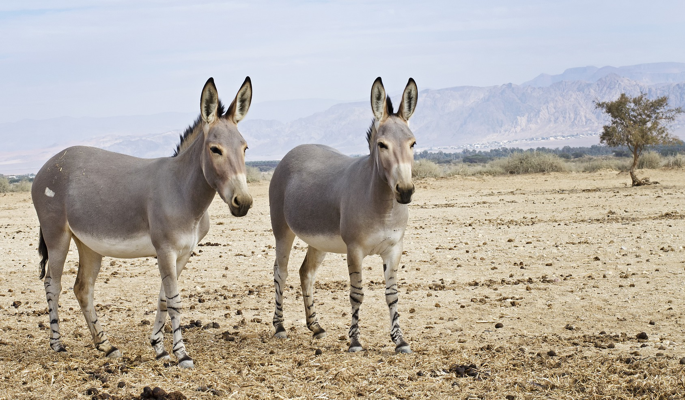
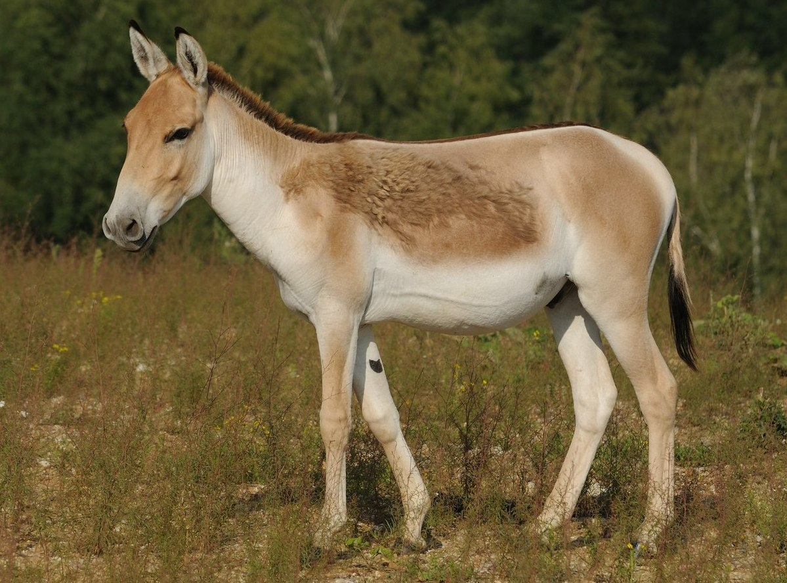

# Animals in the Bible

## License Information

Animals in the Bible © United Bible Societies, 2025. Adapted from: <cite>All Creatures Great and Small: Living Things in the Bible</cite>, by Edward R. Hope © 2005 United Bible Societies. This work is licensed under Creative Commons Attribution-ShareAlike 4.0 International (<a href="https://creativecommons.org/licenses/by-sa/4.0/">https://creativecommons.org/licenses/by-sa/4.0/</a>).

--------------------------------

## Wild ass (id: FAUNA:2.32)

2\.32 Wild ass
==============

References:
-----------

Hebrew עָרוֹד, עֲרָד (‘arod, ‘arad)

[JOB 39:5](https://ref.ly/Job39:5), [DAN 5:21](https://ref.ly/Dan5:21)

Hebrew פֶּרֶא (pere’)

[GEN 16:12](https://ref.ly/Gen16:12), [JOB 6:5](https://ref.ly/Job6:5), [JOB 11:12](https://ref.ly/Job11:12), [JOB 24:5](https://ref.ly/Job24:5), [JOB 39:5](https://ref.ly/Job39:5), [PSA 104:11](https://ref.ly/Ps104:11), [ISA 32:14](https://ref.ly/Isa32:14), [JER 2:24](https://ref.ly/Jer2:24), [JER 14:6](https://ref.ly/Jer14:6), [HOS 8:9](https://ref.ly/Hos8:9)

Greek ὄναγρος (onagros)

[SIR 13:19](https://ref.ly/Wis13:19)

Discussion:
-----------

Two species of wild ass were known by the Israelites, the Nubian Wild Ass *Asinus asinus africanus*, which lived on the African side of the Red Sea, and the Persian Wild Ass or Onager *Equus hemionus*, which was common in the land of Israel, Syria, and Mesopotamia. It seems likely that the Hebrew *‘arod* and the Aramaic *‘arad* refer to the Nubian wild ass, and the Hebrew *pere’* to the onager.

Both species of wild ass were hunted for their meat.

Description:
------------

The Nubian wild ass is probably the ancestor of virtually all domestic donkeys. It is a smallish, light brown donkey with a characteristic dark stripe down its spine and across its shoulders. It originally had stripes on the lower part of its forelegs. It has long ears and a tufted tail. It is still found in Ethiopia, Eritrea, and Somalia.

The onager, or Persian wild ass, is a larger animal, classified scientifically as a species of horse. It looks something like a mule. The scientific name *hemionus* means “half\-ass". It has smaller ears than a typical donkey. It is a fawn color but has a whitish chest and belly. It was evidently never fully domesticated, although one ancient Sumerian illustration shows onagers harnessed to a chariot. Onagers are still found in very small numbers in parts of Syria and Iraq and have been reintroduced into Israel.

Special significance or symbolism:
----------------------------------

The onager was a symbol of untameable wildness, and thus the metaphor “wild ass” was used to describe anyone with wild uncontrolled behavior.

Translation:
------------

In Africa the closest equivalent to the wild ass is the zebra, which is about the same size and belongs to the same animal family. Like the onager, the zebra has never been widely domesticated. Where the phrase “wild donkeys” would refer to domestic donkeys that have returned to living in a wild state ("feral donkeys"), a phrase meaning “wild horse” is a better choice, since feral donkeys are easily captured and domesticated, whereas feral horses are harder to domesticate. Languages that use the same word for horse and zebra may still have a problem.

The same word or expression can be used for both Hebrew words and for the Aramaic *‘arad*, since no distinction between the wild ass species is intended in the biblical text, except in [JOB 39:5](https://ref.ly/Job39:5). In this verse, the Hebrew *pere’* and *‘arod* are both used:

Who set the wild horse (*pere’*) free?

Who untied the ropes of the wild ass (*‘arod*)?

The parallelism can be preserved either by using a pronoun in the second line (Who untied its ropes?) or by using “zebra” or “wild horse” for *pere’* and “wild ass” for *‘arod*.

* **Associated Passages:** Job 39:5; Daniel 5:21; Genesis 16:12; Job 6:5; Job 11:12; Job 24:5; Psalms 104:11; Isaiah 32:14; Jeremiah 2:24; Jeremiah 14:6; Hosea 8:9; Sirach 13:19

