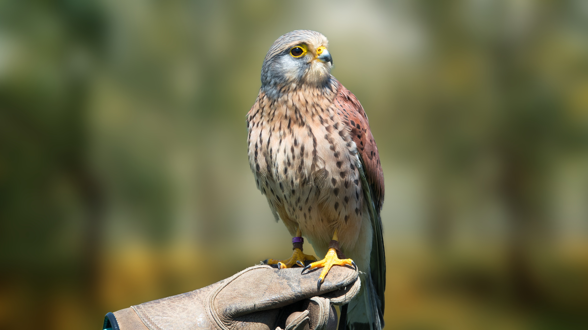
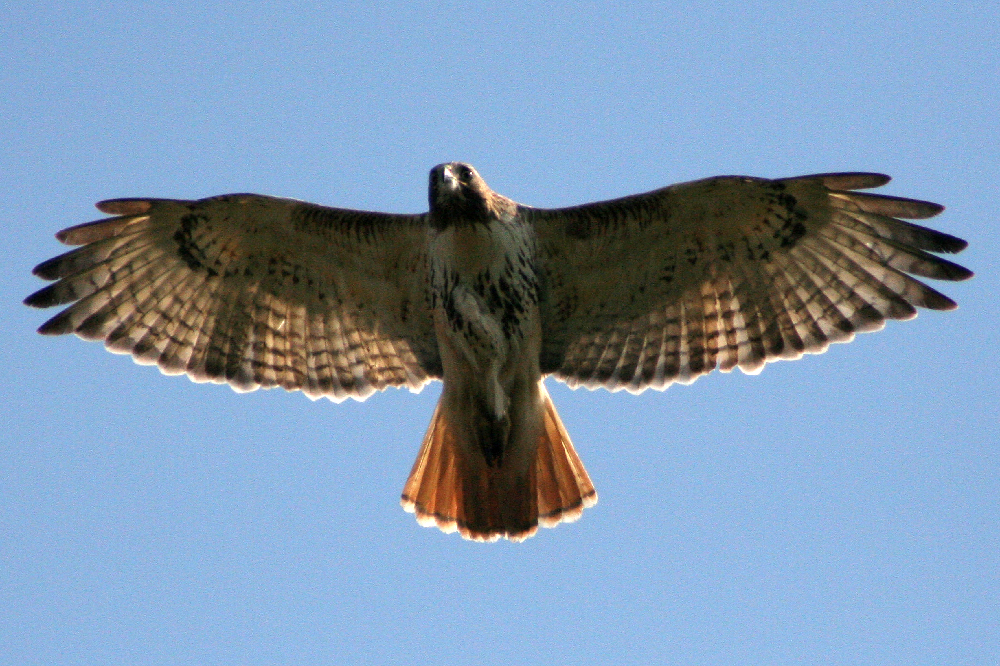

# Animals in the Bible

## License Information

Animals in the Bible © United Bible Societies, 2025. Adapted from: <cite>All Creatures Great and Small: Living Things in the Bible</cite>, by Edward R. Hope © 2005 United Bible Societies. This work is licensed under Creative Commons Attribution-ShareAlike 4.0 International (<a href="https://creativecommons.org/licenses/by-sa/4.0/">https://creativecommons.org/licenses/by-sa/4.0/</a>).

--------------------------------

## Hawk, falcon (id: FAUNA:3.10)

3\.10 Hawk, falcon
==================

References:
-----------

Hebrew אַיָּה (’ayah)

[LEV 11:14](https://ref.ly/Lev11:14), [DEU 14:13](https://ref.ly/Deut14:13), [JOB 28:7](https://ref.ly/Job28:7)

Hebrew נֵץ (nets)

[LEV 11:16](https://ref.ly/Lev11:16), [DEU 14:15](https://ref.ly/Deut14:15), [JOB 39:26](https://ref.ly/Job39:26)

Discussion:
-----------

The expression “all kinds of *’ayah* “ in [LEV 11:0](https://ref.ly/Lev11:0) indicates that the name refers to a similar grouping of birds. In this case the likelihood is that these are larger falcons and hawks, which probably also include the bigger harriers, kestrels, goshawks, and others. In Israel this would constitute over a dozen species, including the Marsh Harrier *Circus aeroginosus*, the Peregrine Falcon *Falco peregrinus*, the Lanner Falcon *Falco biarmicus*, and the Hobby Hawk *Falco subbuteo*, but it would probably not include the larger, slow flying kites.

From the position of the word *nets* in the lists of unclean birds, it seems likely that it was the smallest category of hawk, which probably included sparrow hawks such as the Levant Sparrow Hawk *Accipiter brevipes* and small falcons such as the Sooty Falcon *Falco concolor* and the Lesser Kestrel *Falco tinnunculus*. The reference in [JOB 39:26](https://ref.ly/Job39:26) to its migrating south would confirm this identification, as all of the small hawks mentioned above are migrants.

Description:
------------

The types of hawk indicated by *’ayah* are smaller than the eagles and kites. They typically are fast flying, but they can also hover. They fly fairly low, searching for prey, and when they find it, they swoop upwards as they turn back, then “stoop” very fast, with wings half\-folded. Their usual prey is rats, mice, and other birds. Kestrels typically hover directly over their prey and drop straight down. Falcons also chase other birds in flight and strike them with their talons as they overtake them.

The types of small hawk indicated by *nets* have long narrow wings and are fast flyers. Their prey is mainly small birds and mice, but they also catch flying insects.

Special significance or symbolism:
----------------------------------

They are listed as unclean birds. The falcon was the symbol of the Egyptian god Horus. The reference in [JOB 28:7](https://ref.ly/Job28:7) is to this bird’s keen eyesight.

Translation:
------------

Hawks, large and small falcons, and sparrow hawks are widely distributed around the world, and it should not be hard to find a local equivalent. A word for one of the larger local hawks or falcons can be used for *’ayah*, and a word for one of the smaller falcons or sparrow hawks can be used for *nets*. Phrases, such as “large falcon” or “large hawk” for *’ayah* and “small falcon” or “small hawk” for *nets*, are also acceptable.

* **Associated Passages:** Leviticus 11:14; Deuteronomy 14:13; Job 28:7; Leviticus 11:16; Deuteronomy 14:15; Job 39:26; Leviticus 11:0

