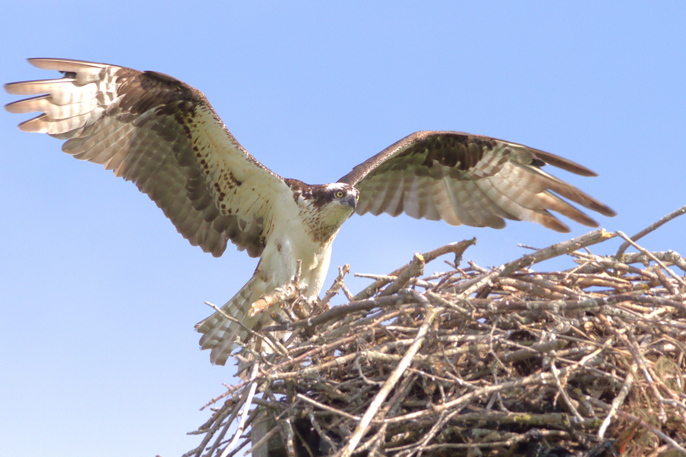

# Animals in the Bible

## License Information

Animals in the Bible © United Bible Societies, 2025. Adapted from: <cite>All Creatures Great and Small: Living Things in the Bible</cite>, by Edward R. Hope © 2005 United Bible Societies. This work is licensed under Creative Commons Attribution-ShareAlike 4.0 International (<a href="https://creativecommons.org/licenses/by-sa/4.0/">https://creativecommons.org/licenses/by-sa/4.0/</a>).

--------------------------------

## Osprey (id: FAUNA:3.15)

3\.15 Osprey
============

References:
-----------

Hebrew עָזְנִיָּה (‘ozniyah)

[LEV 11:13](https://ref.ly/Lev11:13), [DEU 14:12](https://ref.ly/Deut14:12)

Hebrew שָׁלָךְ (shalak)

[LEV 11:17](https://ref.ly/Lev11:17), [DEU 14:17](https://ref.ly/Deut14:17)

Discussion:
-----------

There is also considerable doubt about the meaning of the word *‘ozniyah*. Its meaning is basically derived from its position in the list of unclean birds, and this makes reference to a type of vulture more likely than the osprey. Since the Black Vulture *Aegypius monachus* is slightly smaller than the lappet\-faced vulture but slightly larger than the bearded vulture, this seems to be the most likely candidate. It probably represents a grouping of eagles and buzzards the same size as itself. In modern Hebrew *‘ozniyah* is the name for the lappet\-faced and black vultures. See the primary discussion at [3\.8 Eagle, vulture](#FAUNA:3.8)

Although the translation of *shalak* as cormorant has a tradition going back to the seventeenth century, there has always been considerable doubt about this translation. For one thing, the root of the Hebrew word *shalak* means “to throw or hurl", which would indicate that the bird with this name “throws” itself down onto its prey, something cormorants do not do. They swim low in the water and dive underwater to hunt their prey.

This led the late G. R. Driver to suggest the translation “fisher owl” and this has been followed in NEB (New English Bible (1970)) and REB (Revised English Bible (1989)). However, there are problems with this suggestion too. The fisher owl, or more correctly, the Brown Fish Owl *Scotopelia ceylonensis* is not likely to have been well known; its fishing habits would only have been seen by fishermen on moonlit nights, and that very rarely.

In modern Hebrew *shalak* is the name given to the Osprey *Pandion haliaetus*, a type of fishing eagle that plunges into the water from a height and catches fish in its claws. Some Israeli scholars have also suggested that it may have been the ancient name for the Smyrna Kingfisher *Halcyon smyrnensis* or the Gannet *Sula bassana*, both of which drop down from a height onto their prey, which they catch underwater in their beaks.

Since there is so much doubt about the identification of this bird, the translation “osprey” seems to have as much, if not more, justification than “cormorant". See also [3\.4 Cormorant](#FAUNA:3.4).

Description:
------------

The Osprey *Pandion haliaetus* is an eagle\-like bird that feeds on fish. It has a white head, chest, and belly, with a dark brown back and wings. It has a dark stripe from the edge of the beak through the eye to the back of the neck and a faint stripe on its chest. In flight it looks mainly white with dark brown wing tips. Faint bands of brown can be seen on the flight feathers and tail.

It is found on seacoasts and near lakes and large rivers. It spends most of its time perched on posts, logs, or rocks near the water and hunts periodically by flying slowly over the water. When it sees a fish, it hovers briefly, then dives with its wings raised nearly vertically. It often dives right under the water, then surfaces, shakes its wings, and takes off with the fish held in its talons. In Africa it is often robbed of its prey while it is flying by the larger, faster African fish eagle.

Special significance or symbolism:
----------------------------------

It is listed as an unclean bird.

Translation:
------------

The osprey is found almost worldwide, but is not very common in parts of Africa where the conspicuous African Fish Eagle *Haliaetus vocifer*, with its white head and tail and loud cry, is much better known. In these areas in Africa the name for this better known bird can be used. In languages where there is no word for the osprey, a phrase such as “fishing hawk” or “fishing eagle” can usually be used.

* **Associated Passages:** Leviticus 11:13; Deuteronomy 14:12; Leviticus 11:17; Deuteronomy 14:17

