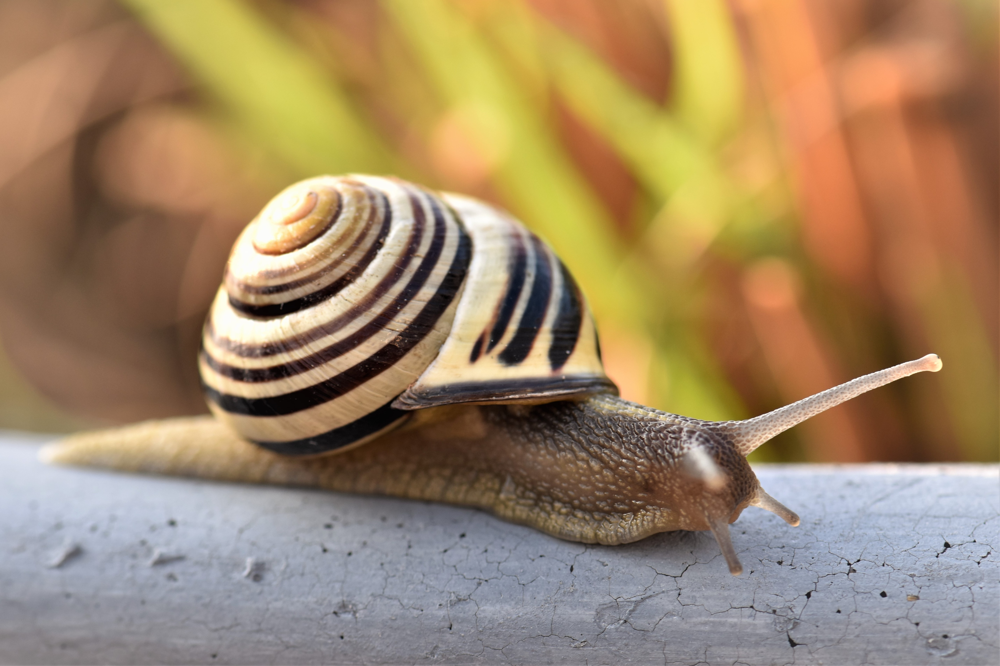

# Animals in the Bible

## License Information

Animals in the Bible © United Bible Societies, 2025. Adapted from: <cite>All Creatures Great and Small: Living Things in the Bible</cite>, by Edward R. Hope © 2005 United Bible Societies. This work is licensed under Creative Commons Attribution-ShareAlike 4.0 International (<a href="https://creativecommons.org/licenses/by-sa/4.0/">https://creativecommons.org/licenses/by-sa/4.0/</a>).

--------------------------------

## Snail (id: FAUNA:5.4)

5\.4 Snail
==========

References:
-----------

Hebrew שַׁבְּלוּל (shablul)

[PSA 58:9](https://ref.ly/Ps58:9)

Discussion:
-----------

There is a very long tradition interpreting this word as “snail". A few scholars, arguing from the fact that the expression “untimely birth” occurs in the parallel line, have argued that *shablul* means a miscarriage or an aborted fetus, but only NEB (New English Bible (1970)) and REB (Revised English Bible (1989)) have followed this suggestion.

Description:
------------

Snails are mollusks but many types live on land, usually in moist conditions. They normally have spiral shells, which they carry with them as they move. In Israel, where the predominant soil type has been formed from limestone, snails have very strong shells and are able to live even in desert conditions, provided they have somewhere to shelter from the extreme heat. Some species feed on other snails, but most are vegetarian. Part of their body, called the foot, extends out of the shell, and it is this that propels them with a wave\-like motion. Their head also extends out of the shell. As the snail moves it excretes a slime along which it travels, leaving behind it a slimy trail. Ancient Israelites seem to have believed that this was evidence that the snail melted as it moved along.

Slugs are a type of snail with no shell.

Translation:
------------

Snails or shell\-less slugs are common in most parts of the world, although they hibernate in some places. The single reference to snails should thus not be difficult to translate.

* **Associated Passages:** Psalms 58:9

