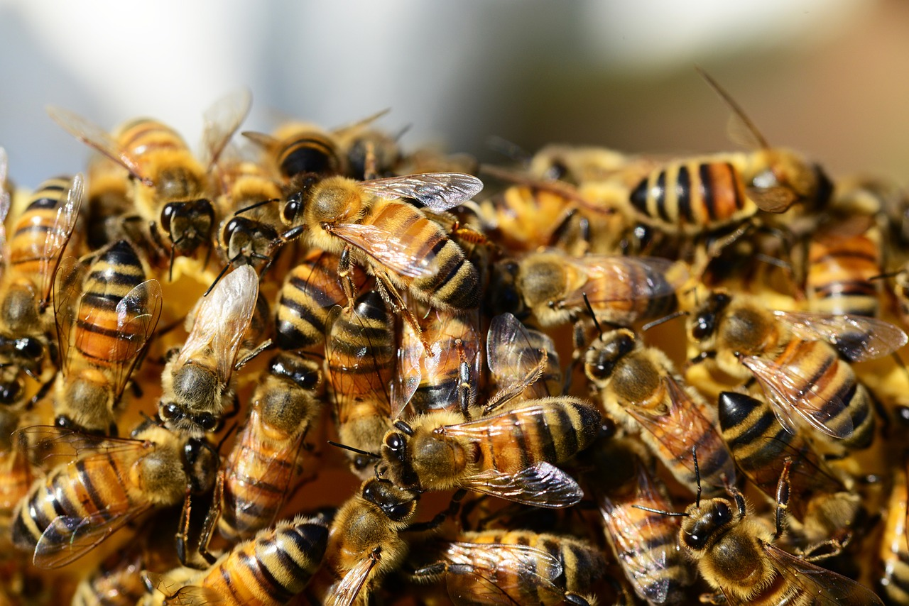

# Animals in the Bible

## License Information

Animals in the Bible © United Bible Societies, 2025. Adapted from: <cite>All Creatures Great and Small: Living Things in the Bible</cite>, by Edward R. Hope © 2005 United Bible Societies. This work is licensed under Creative Commons Attribution-ShareAlike 4.0 International (<a href="https://creativecommons.org/licenses/by-sa/4.0/">https://creativecommons.org/licenses/by-sa/4.0/</a>).

--------------------------------

## Bee (id: FAUNA:6.2)

6\.2 Bee
========

References:
-----------

Hebrew דְּבוֹרָה (devorah)

[DEU 1:44](https://ref.ly/Deut1:44), [JDG 14:8](https://ref.ly/Judg14:8), [PSA 118:12](https://ref.ly/Ps118:12), [ISA 7:18](https://ref.ly/Isa7:18)

Greek μέλισσα (melissa)

[SIR 11:3](https://ref.ly/Wis11:3), [4MA 14:19](https://ref.ly/3Macc14:19)

Discussion:
-----------

The species of bee found in Israel in biblical times was obviously a fierce strain, since most of the references are to it swarming around and attacking people. In fact it is likely that all bees were originally much fiercer than the fairly docile bees commonly kept in hives today(the result of breeding from selected queen bees. Most biblical references are to “wild bees", that is, bees in natural hives rather than in hives made by man. However, it is likely that bees were also kept in apiaries, since we know that the practice was common in Egypt, Greece, and Rome from very early times.

The Hebrew word for “honey", *devash*, is also used for syrup extracted from figs, dates, and grapes, or from certain types of palm tree. The phrase “a land flowing with milk and honey” refers to a land that is fertile and thus rich in pasture, fruit, and the grain and flowers from which bees make honey.

Description:
------------

The bee is a flying insect that collects nectar from flowers and converts it into honey. It lives in swarms made up of many thousands of bees. They make a hive in a hollow log, in spaces between rocks, in holes in the ground, in old termite nests, or other places. There the bees build combs made of wax. In the comb are small cells, and in the cells nearest the center of the hive the queen bee lays eggs, and young are raised, while the honey is stored in cells toward the outside. Bees are able to sting and do so when they feel that their hive is threatened. The smell of one bee’s sting makes the other bees in the hive aggressive.

Translation:
------------

Since bees are universal, translation usually does not present a problem. Where no generic term exists for bees in general, the specific name for a honey bee, or a bee that makes edible honey, should be used at [JDG 14:8](https://ref.ly/Judg14:8), but in all other references the word for a type of bee that swarms around and stings intruders should be used.

Note: The NEB (New English Bible (1970)) rendering of “They surround me like bees at the honey” is certainly mistaken. It is not bees swarming around honey, but bees swarming to attack, that is in focus.

* **Associated Passages:** Deuteronomy 1:44; Judges 14:8; Psalms 118:12; Isaiah 7:18; Sirach 11:3; 4 Maccabees 14:19

