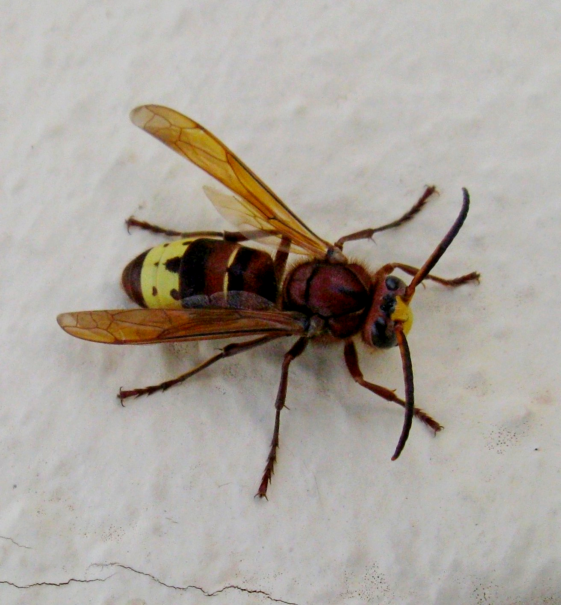
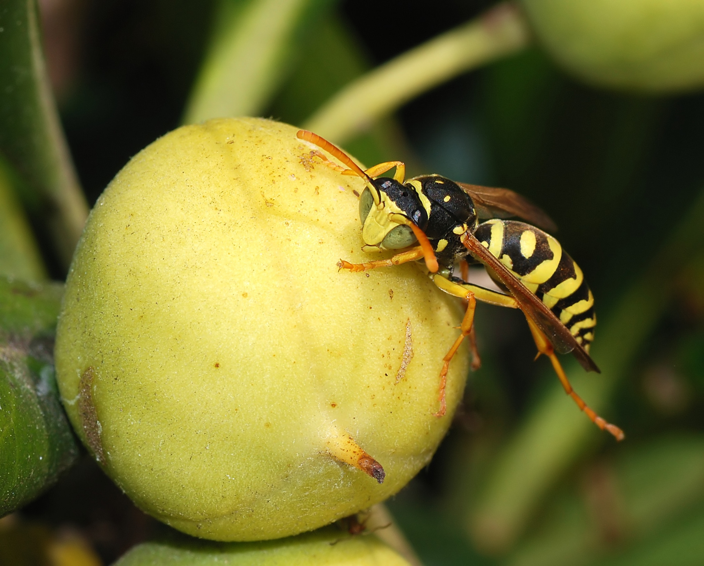

# Animals in the Bible

## License Information

Animals in the Bible © United Bible Societies, 2025. Adapted from: <cite>All Creatures Great and Small: Living Things in the Bible</cite>, by Edward R. Hope © 2005 United Bible Societies. This work is licensed under Creative Commons Attribution-ShareAlike 4.0 International (<a href="https://creativecommons.org/licenses/by-sa/4.0/">https://creativecommons.org/licenses/by-sa/4.0/</a>).

--------------------------------

## Hornet, wasp (id: FAUNA:6.7)

6\.7 Hornet, wasp
=================

References:
-----------

Hebrew צִרְעָה (tsir‘ah)

[EXO 23:28](https://ref.ly/Exod23:28), [DEU 7:20](https://ref.ly/Deut7:20), [JOS 24:12](https://ref.ly/Josh24:12)

Greek σφήξ (sfēx)

[WIS 12:8](https://ref.ly/EsthGr12:8)

Discussion:
-----------

There is little doubt among scholars that the Hebrew and Greek words refer to both hornets and wasps. The rendering of NEB (New English Bible (1970)) and REB (Revised English Bible (1989)), “panic", does not have much support, as the suggested derivation from the Arabic *dara‘a* is very debatable.

Description:
------------

Hornets and wasps are closely related species, with the hornets being larger than the wasps. Like bees they both belong to the zoological order *Hymenoptera*, which means that they have stiff, transparent, membrane\-like wings. The hornets are usually black or brown; some species have yellow bands. Wasps are often greenish and may also have yellow or light green bands. The larger hornets can be 30–40 millimeters (1–1\.5 inches) long.

Both hornets and wasps are characterized by having a long narrow waist between the thorax (chest) and the abdomen (stomach). All have a sting that, because of their large size, can be very painful, even dangerous. Unlike bees, hornets and wasps do not have a detachable sting and can sting repeatedly. They feed on insects, caterpillars, and spiders, and many types sting their prey and then deposit the paralyzed but still living insect or spider near the hornet’s eggs, as a readily available source of food for the larvae when they hatch from the eggs. Some species actually lay their eggs on the paralyzed victim.

The Oriental hornet *Vespa orientalis*, typically lives in nests that it digs underground. A nest contains multiple combs in which the colony lives. While nests are most commonly found under ground, some paper nests are constructed in protective hollows such as inside hollow trees. The Oriental hornets have a reddish\-brown color and have distinctive thick yellow bands on the abdomen and yellow patches on the head between the eyes. They communicate through sound vibrations and capture other insects such as grasshoppers, flies, honey bees, and vespids with which they feed the colony's brood. They will also collect other animal proteins for their young such as pieces of fresh or spoiled meat and fish. The adults eat carbohydrates such as nectar, honeydew, and fruits. The hornets are a primary pest to honey bees, attacking bee colonies to obtain honey and animal proteins. The sting of an Oriental hornet can be quite painful to humans and some humans are allergic to stings. The Oriental hornet looks similar to the European hornet (*Vespa crabro*) and should not be confused with the Asian giant hornet (*Vespa mandarinia*) of East Asia.

Special significance or symbolism:
----------------------------------

Hornets are a symbol in the Bible for a dangerous enemy or an attacking army.

Translation:
------------

Although hornets or wasps are found in most warm countries, some large dangerous\-looking hornets are relatively harmless. For instance, the black house hornet found all over Africa does not live in swarms but on its own. It makes mud nests on walls or under a roof. It is large and has a sting, but it is not aggressive and very seldom stings any person or animal. Thus care should be taken by translators to choose the name of a hornet that both lives in swarms and is dangerous. In cases where all local hornets or wasps are relatively harmless, a descriptive phrase meaning “warrior hornet", “war hornet", “army hornet", “death hornet” or something similar can be used.

* **Associated Passages:** Exodus 23:28; Deuteronomy 7:20; Joshua 24:12; Wisdom of Solomon 12:8

