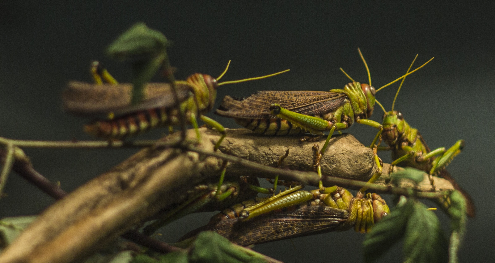

# Animals in the Bible

## License Information

Animals in the Bible © United Bible Societies, 2025. Adapted from: <cite>All Creatures Great and Small: Living Things in the Bible</cite>, by Edward R. Hope © 2005 United Bible Societies. This work is licensed under Creative Commons Attribution-ShareAlike 4.0 International (<a href="https://creativecommons.org/licenses/by-sa/4.0/">https://creativecommons.org/licenses/by-sa/4.0/</a>).

--------------------------------

## Locust, grasshopper, cricket (id: FAUNA:6.9)

6\.9 Locust, grasshopper, cricket
=================================

References:
-----------

Hebrew אַרְבֶּה (’arbeh)

[EXO 10:4](https://ref.ly/Exod10:4), [EXO 10:12](https://ref.ly/Exod10:12), [EXO 10:13](https://ref.ly/Exod10:13), [EXO 10:14](https://ref.ly/Exod10:14), [EXO 10:14](https://ref.ly/Exod10:14), [EXO 10:19](https://ref.ly/Exod10:19), [EXO 10:19](https://ref.ly/Exod10:19), [LEV 11:22](https://ref.ly/Lev11:22), [DEU 28:38](https://ref.ly/Deut28:38), [JDG 6:5](https://ref.ly/Judg6:5), [JDG 7:12](https://ref.ly/Judg7:12), [1KI 8:37](https://ref.ly/1Kgs8:37), [2CH 6:28](https://ref.ly/2Chr6:28), [JOB 39:20](https://ref.ly/Job39:20), [PSA 78:46](https://ref.ly/Ps78:46), [PSA 105:34](https://ref.ly/Ps105:34), [PSA 109:23](https://ref.ly/Ps109:23), [PRO 30:27](https://ref.ly/Prov30:27), [JER 46:23](https://ref.ly/Jer46:23), [JOL 1:4](https://ref.ly/Joel1:4), [JOL 1:4](https://ref.ly/Joel1:4), [JOL 2:25](https://ref.ly/Joel2:25), [NAM 3:15](https://ref.ly/Nah3:15), [NAM 3:17](https://ref.ly/Nah3:17)

Hebrew גֵּב, גּוֹב, גֹּבַי (gev, gov, govay)

[ISA 33:4](https://ref.ly/Isa33:4), [AMO 7:1](https://ref.ly/Amos7:1), [NAM 3:17](https://ref.ly/Nah3:17), [NAM 3:17](https://ref.ly/Nah3:17)

Hebrew גָּזָם (gazam)

[JOL 1:4](https://ref.ly/Joel1:4), [JOL 2:25](https://ref.ly/Joel2:25), [AMO 4:9](https://ref.ly/Amos4:9)

Hebrew חָגָב (chagav)

[LEV 11:22](https://ref.ly/Lev11:22), [NUM 13:33](https://ref.ly/Num13:33), [2CH 7:13](https://ref.ly/2Chr7:13), [ECC 12:5](https://ref.ly/Eccl12:5), [ISA 40:22](https://ref.ly/Isa40:22)

Hebrew חָסִיל (chasil)

[1KI 8:37](https://ref.ly/1Kgs8:37), [2CH 6:28](https://ref.ly/2Chr6:28), [PSA 78:46](https://ref.ly/Ps78:46), [ISA 33:4](https://ref.ly/Isa33:4), [JOL 1:4](https://ref.ly/Joel1:4), [JOL 2:25](https://ref.ly/Joel2:25)

Hebrew חַרְגֹּל (chargol)

[LEV 11:22](https://ref.ly/Lev11:22)

Hebrew יֶלֶק (yeleq)

[PSA 105:34](https://ref.ly/Ps105:34), [JER 51:14](https://ref.ly/Jer51:14), [JER 51:27](https://ref.ly/Jer51:27), [JOL 1:4](https://ref.ly/Joel1:4), [JOL 1:4](https://ref.ly/Joel1:4), [JOL 2:25](https://ref.ly/Joel2:25), [NAM 3:15](https://ref.ly/Nah3:15), [NAM 3:15](https://ref.ly/Nah3:15), [NAM 3:16](https://ref.ly/Nah3:16)

Hebrew סָלְעָם (sol‘am)

[LEV 11:22](https://ref.ly/Lev11:22)

Hebrew צְלָצַל (tselatsal)

[DEU 28:42](https://ref.ly/Deut28:42), [ISA 18:1](https://ref.ly/Isa18:1)

Greek ἀκρίς (akris)

[MAT 3:4](https://ref.ly/Matt3:4), [MRK 1:6](https://ref.ly/Matt1:6), [REV 9:3](https://ref.ly/Jude9:3), [REV 9:7](https://ref.ly/Jude9:7), [JDT 2:20](https://ref.ly/Tob2:20), [WIS 16:9](https://ref.ly/EsthGr16:9), [SIR 43:18](https://ref.ly/Wis43:18)

Latin locusta

[2ES 4:24](https://ref.ly/1Esd4:24)

Discussion:
-----------

The locust is the most important insect in the Bible, being mentioned many more times than any other insect. Although there are nine Hebrew words in the Bible which refer to locusts, the most common one is *’arbeh*. The equivalent in Greek is *akris*, and in Latin it is *locusta*. These words certainly refer to the locust rather than to the grasshopper. All locusts and grasshoppers belong to the family *Acrididae*, which is a family within the order *Orthoptera*, or “straight\-winged” insects. Many species are found in the land of Israel and Egypt, but the most important are the Migratory Locust *Locusta migratoria*, the Desert Locust *Schistocerca gregaria*, and the Moroccan Locust *Dociostaurus moroccanus*. All three species are an important local food and are probably all called *’arbeh* in the Bible.

Description:
------------

**Grasshoppers and locusts** are both six\-legged, winged insects that are characterized by the fact that their third pair of legs is elongated and adapted to hopping. The lower portion of these legs has a row of spikes that are used both for making sounds and as a means of defense. The front wings are narrow, straight, and stiff. When not being used to fly, they function as a cover for thin, membrane\-like hind wings, which are much larger and colored, and which are folded together like a Chinese fan. When the locust or grasshopper flies, it hops into the air spreading out its wings as it does so. It flies with a slight clattering sound, made by the stiff front wings striking each other.

Locusts differ from grasshoppers mainly in that they form swarms at certain periods and migrate to new areas, which they colonize. At other times they live either solitary or in small groups. Their reproduction rate varies with the climatic conditions. Eggs are laid in the soil in small packets, and hatching is related to the degree of humidity. In dry periods only a few hatch, but in periods of good rainfall they suddenly hatch out in exceptionally large numbers.

Unlike most other insects, locusts do not go through stages in which they exist as larvae or caterpillars. They emerge from the eggs as nymphs, which are simply tiny wingless locusts with undeveloped hopper legs. The nymphs, which can only crawl around, feed on green vegetation, consuming many times their own body weight each day. As they grow bigger and develop, they shed their skins. Their hopping legs develop before their wings, so that they pass through a stage when they can hop but not fly. At this stage, when they are referred to as “hoppers", they exist in less dense masses than as nymphs, having spread out a little, but since they are now eating even more than before, they can still cause considerable damage to crops. Once they develop into adults they can both hop and fly. If the climatic conditions are right and exceptionally large numbers have developed to this stage, they completely devastate the vegetation where they have been developing. When this happens they begin to congregate in preparation for swarming. In other words they come together and migrate as a group to greener pastures, flying together in large swarms. At this congregating stage, during the migration and immediately after it, they present a major threat to crops and other vegetation, on which they feed unceasingly.

A locust swarm may consist of billions of locusts. G.S. Cansdale quotes a report of a single swarm in 1889 that was estimated to cover 5,500 square kilometers (about 2,000 square miles). Certainly even in recent times swarms have been known large enough to blot out the sun like a large black cloud. The clattering of wings as the locusts approach is a sound hard to forget. Where the swarm lands, even temporarily, every green bush or clump of grass in sight is attacked by the locusts, and the sound of them munching on the leaves is clearly audible, sometimes for hours. Afterwards, hardly a single green leaf or blade of grass can be seen, and many bushes even have the bark eaten off, leaving them bare.

Against such enormous numbers ancient peoples felt absolutely helpless. There was no way they could stop the destruction. The lighting of grass fires helped only in a very small way. Ironically it is when locusts swarm like this that they can be easily caught in large numbers for eating. They are often caught in blankets, fishing nets, and baskets. The lower part of the hopping legs is snapped off, and they are cooked by toasting, grilling, frying, or broiling. In some places they are also eaten raw. When toasted and salted they taste a little like salted peanuts.

Some commentators have pointed out that the plague of locusts in Egypt probably provided the Israelites with food in the Arabian and Sinai deserts, since this is the usual migration route of locusts in that part of the world.

Following is a summary of the development cycle of the major locust species: Nymphs, which can only crawl, develop to a hopping stage; the hoppers develop wings and become adult locusts; if climatic conditions are right, these adults gather into swarms and migrate to new locations; the females lay eggs, and the whole cycle is repeated. There are thus four discernible phases: nymphs, hoppers, resident adults, and swarming or migrating adults. It is possible that *chasil* refers to the crawling nymph, *yeleq* to the juvenile hopper, *’arbeh* to the resident adult, and *gazam* to the swarming adult. However, this is far from proven, as the words seem to be used almost interchangeably when referring to locust plagues.

**Crickets and katydids**: Crickets are a wingless, nocturnal relative of the locusts and grasshoppers. They are usually black or brown, with shorter rounder bodies, and they shelter during the day under rocks or logs, or, in the case of the so\-called mole crickets, in holes that they dig. At night they make characteristic high\-pitched chirping sounds, which carry a surprisingly long way. Each species makes a slightly different sound. Like locusts and grasshoppers they feed on vegetation, usually leaves.

Katydids are similar to crickets but are usually green and have wings. They are active at night, when they make cricket\-like chirping sounds, but settle during the day underneath leaves in trees. Their wings are leaf\-shaped, and with their green color they have excellent camouflage. Some katydids eat other insects.

Both crickets and katydids have extremely long feelers.

Special significance or symbolism:
----------------------------------

Given their large numbers and swarming characteristics, it is small wonder that locusts were a symbol of a vast attacking army against which there was no defense. They were also a symbol of divine punishment.

In two of the five verses that contain the word *chagav*, the usage is figurative, denoting something small and insignificant (hence the TEV (Today's English Version (Good News Bible)) rendering “as tiny as ants” in [ISA 40:22](https://ref.ly/Isa40:22)).

The usage of *chagav* in [ECC 12:5](https://ref.ly/Eccl12:5), where the Hebrew text literally means “the grasshopper can only crawl” is problematic. Within this poetic section depicting old age, the reference is obviously to one of the signs of human aging. Commentators usually accept one of two possible interpretations: a) that this is a reference to the difficulty with which old people move, or b) that this is a joking reference to the loss of male sexual virility. If the first interpretation is accepted, “grasshopper” is a nickname for a lively person (who now can only move with difficulty), while in the second case the word would be a nickname for the male sexual organ.

Translation:
------------

The Migratory Locust *Locusta migratoria* is found in many parts of the world, except North America. In these areas it should be easy to find a local word. However, in some countries with high rainfall this and other species of locust do not swarm in the same way that they do in the Middle East and the drier parts of Africa. In these countries it may be necessary in some contexts to use a phrase such as “swarms of locusts” rather than simply “locusts". In areas where locusts are not known, a phrase like “large/giant grasshopper” can usually be substituted.

The Hebrew words *gev, gov* and *govay* are related to a verb meaning “to swarm” or “to gather together", and thus the reference is almost certainly to the locust.

The word *tselatsal* ([DEU 28:42](https://ref.ly/Deut28:42); [ISA 18:1](https://ref.ly/Isa18:1)) represents the sound of insects’ wings, and the reference is most likely to the sound made by a swarm of locusts. The English versions that have “whirring” or “buzzing” make some attempt at reflecting this, but “buzzing” is inadequate as a description of the sound such a swarm makes. “Clattering", “chirping", “whirring", or “fluttering” comes closest in English to representing the sound represented by the Hebrew word.

NEB (New English Bible (1970)) and REB (Revised English Bible (1989)) are alone in interpreting this word to refer to the “mole cricket", an insect that at worst creates a minor nuisance, not a plague of the proportions of a locust swarm. In [ISA 18:1](https://ref.ly/Isa18:1) both of these versions follow the Septuagint rather than the Masoretic Text, and translate “sailing ships".

Translations that represent a) locust swarms and b) the sound such swarms make are recommended. In English this would be something like “whirring locust swarms” in both the Deuteronomy and Isaiah passages. In many Bantu languages in Africa, and in other languages where ideophones occur which express the sound of thousands of whirring wings, such ideophones are a good equivalent. Elsewhere a noun phrase, modified by an adverbial expression similar to the English, can be used.

In most contexts the word *chagav* seems to mean “grasshopper", the exception being [2CH 7:13](https://ref.ly/2Chr7:13), where the reference is to locusts. In the two passages where the grasshopper symbolizes something small and insignificant ([NUM 13:33](https://ref.ly/Num13:33) and [ISA 40:22](https://ref.ly/Isa40:22)), it may not be possible to capture the right inference by translating literally. In such cases the translator is free to use some other insect that is symbolic of small size and insignificance in the local culture, such as “ant", “louse", “flea", and others. In cases where no insect name carries this symbolism, the name of an animal with the correct connotations can be used; for example, “mouse” or “squirrel".

In verses where only one Hebrew word for “locust” occurs, there is little problem, and the word for “grasshopper” or “locust” in the local language can be used. The following notes refer to cases where more than one of these words occur:

[LEV 11:22](https://ref.ly/Lev11:22): This text contains four clean insects. The two Hebrew words *sol‘am* and *chargol* occur only here, so it is very difficult to be precise about their meaning. The suggestions, therefore, have to be very tentative.

From the general rule given in this verse about the characteristics of clean insects, we can deduce that all four of the insects have specialized legs for hopping. This would suggest that locusts (*’arbeh*), grasshoppers (*chagav*), and crickets (probably *chargol*) would be included in the list, as various species of these three insects are commonly eaten in the Middle East, Africa, and parts of Asia. Since a fourth name occurs in the list, NIV (New International Version (1984)) translates *sol‘am* as “katydid", while NAB (New American Bible (1970)) translates *chargol* as “katydids” and *sol‘am* as “grasshoppers". The katydid is a nocturnal hopping insect similar to a grasshopper in many respects, but usually with green leaf\-shaped wings. However, katydids are usually solitary creatures, and not very easy to collect, and thus they are not commonly a food source. RSV (Revised Standard Version (1952)) and possibly TEV (Today's English Version (Good News Bible)) take *sol‘am* to be a type of locust, so that their lists contain two types of locust, plus grasshoppers and crickets.

NEB (New English Bible (1970)) and REB (Revised English Bible (1989)) opt rather for four different kinds of locust, which they refer to as the “great locust” (*’arbeh*), the “long\-headed locust” (*sol‘am*), the “green locust” (*chargol*), and the “desert locust” (*chagav*). These identifications are based on the supposed etymology of the words, that is, the ancient Semitic roots from which the Hebrew words are derived. However, etymology is a very dubious basis for ascribing meaning to words, and these particular derivations have little support in the scholarly world. NAB (New American Bible (1970)) translates *chagav* as “cricket".

All that can be said with certainty about the list of clean insects is that it most probably contains locusts, grasshoppers, and crickets. It is probably safest to translate the list as “all kinds of locusts, all kinds of grasshoppers, and all kinds of crickets,” and add this footnote: “In Hebrew there are four insects in the list. Some scholars suggest that these are four different types of locust."

[1KI 8:37](https://ref.ly/1Kgs8:37); [2CH 6:28](https://ref.ly/2Chr6:28): The Hebrew in these verses has both *’arbeh* and *chasil* in a list of calamities. The reference is probably to adult and juvenile locusts, so translations such as “locusts and grasshoppers", “large and small locusts” and “adult locusts and their children” are common.

[PSA 78:46](https://ref.ly/Ps78:46): In Hebrew this verse again contains both *’arbeh* and *chasil*, and the reference is again probably to adult and juvenile locusts. The following can therefore serve as a model:

He gave their \[newly sprouting] fields to the grasshoppers \[young locusts/small locusts]

And their \[mature] crops to the locusts \[adult locusts/large locusts].

[PSA 105:34](https://ref.ly/Ps105:34): This verse contains both *’arbeh* and *yeleq* with similar meaning to [PSA 78:46](https://ref.ly/Ps78:46):

He spoke, and locusts came,

young locusts/grasshoppers beyond number.

[ISA 33:4](https://ref.ly/Isa33:4): In this verse the two words for locust are *chasil* and *gev*, and the reference, as above, seems to be to juvenile and adult locusts:

Their belongings are plundered as if they were being stripped by grasshoppers \[young locusts],

And people swarm over their goods like (adult) locusts.

[JOL 1:4](https://ref.ly/Joel1:4); [JOL 2:25](https://ref.ly/Joel2:25): In each of these verses there are no less than four different words for locust: *gazam*, *’arbeh*, *yeleq*, and *chasil*. Most commentators accept that this refers to locusts in four different stages of development. These would presumably be the swarming adult locust, the resident adult locust, the wingless hopper, and the crawling nymph. However, as can be seen above, although *yeleq* and *chasil* are both used for juvenile locusts, it is impossible to say which refers to the nymph and which to the hopper.

The TEV (Today's English Version (Good News Bible)) rendering “what one swarm of locusts left, the next swarm devoured” conveys the general idea, but is technically inaccurate in that not all the Hebrew words necessarily refer to swarming locusts. A more precise translation would be:

What the swarming locusts left, the resident locusts ate;

What the resident locusts left, the young crawling locusts ate;

And what the young hopping locusts left, the young crawling locusts ate.

[NAM 3:15](https://ref.ly/Nah3:15); [NAM 3:16](https://ref.ly/Nah3:16); [NAM 3:17](https://ref.ly/Nah3:17): In the Hebrew poetry of this passage three words for locust are used in parallelisms: *’arbeh, yeleq* and *gov*. Regardless of the precise meaning of the words for the different types of officials, it is clear that the three words for locust are synonymous. They are a metaphor for a) large numbers, b) destructiveness, and c) transients (temporary visitors). In many languages there will not be more than one word for locust, if that. Therefore, to avoid the excessive repetition of the one word, slightly different phrases can be used. In the following model translation, there has been an attempt to reflect the structure of the poem, while using different phrases for the three words for locust:

15Even there the fire will eat you,

and the sword will cut you down.

It will eat you as grasshoppers eat a plant.

Multiply

like the grasshopper!

Multiply

like the locust!

16You increased the number of your traders \[troops],

until there are more than the stars in the sky.

The locust raids then flies away.

17Your officers \[princes] are like grasshoppers,

your diplomats like a swarm of locusts

gathering on stone walls

on a cold day.

The sun comes out,

and they fly away.

Where have they all gone?

No one knows.

There is general consensus that *gazam* refers to the adult locust, and *yeleq* and *chasil* to juvenile forms. However, a few scholars believe that different species of locusts are involved, rather than locusts at different stages of KJV (King James Version (1611)) ’s “palmerworm” and “cankerworm” in are alternative words for “caterpillar", which is almost certainly not a good translation for any of the Hebrew words.

Some commentators and a few versions have suggested that in the Greek text of [MAT 3:4](https://ref.ly/Matt3:4) and [MRK 1:6](https://ref.ly/Matt1:6) the word *akris* could be a wrongly written form of a word meaning “carob pods", a local food (see *Fauna and Flora of the Bible*, pages 103–104\). However, there is no manuscript evidence for such a change. As the text stands it makes perfect sense, since these locusts are eaten and enjoyed as food wherever they occur. Locusts and honey would in fact provide a reasonably good diet, containing protein, carbohydrates, vitamins, and trace elements.

* **Associated Passages:** Exodus 10:4; Exodus 10:12; Exodus 10:13; Exodus 10:14; Exodus 10:19; Leviticus 11:22; Deuteronomy 28:38; Judges 6:5; Judges 7:12; 1 Kings 8:37; 2 Chronicles 6:28; Job 39:20; Psalms 78:46; Psalms 105:34; Psalms 109:23; Proverbs 30:27; Jeremiah 46:23; Joel 1:4; Joel 2:25; Nahum 3:15; Nahum 3:17; Isaiah 33:4; Amos 7:1; Amos 4:9; Numbers 13:33; 2 Chronicles 7:13; Ecclesiastes 12:5; Isaiah 40:22; Jeremiah 51:14; Jeremiah 51:27; Nahum 3:16; Deuteronomy 28:42; Isaiah 18:1; Matthew 3:4; Mark 1:6; Revelation 9:3; Revelation 9:7; Judith 2:20; Wisdom of Solomon 16:9; Sirach 43:18; 2 Esdras (Latin) 4:24

