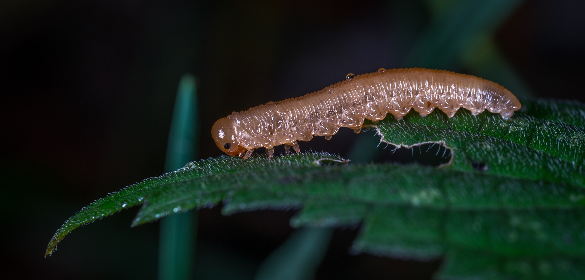

# Animals in the Bible

## License Information

Animals in the Bible © United Bible Societies, 2025. Adapted from: <cite>All Creatures Great and Small: Living Things in the Bible</cite>, by Edward R. Hope © 2005 United Bible Societies. This work is licensed under Creative Commons Attribution-ShareAlike 4.0 International (<a href="https://creativecommons.org/licenses/by-sa/4.0/">https://creativecommons.org/licenses/by-sa/4.0/</a>).

--------------------------------

## Moth (id: FAUNA:6.10)

6\.10 Moth
==========

References:
-----------

Hebrew עָשׁ (‘ash)

[JOB 4:19](https://ref.ly/Job4:19), [JOB 9:9](https://ref.ly/Job9:9), [JOB 13:28](https://ref.ly/Job13:28), [JOB 27:18](https://ref.ly/Job27:18), [PSA 39:12](https://ref.ly/Ps39:12), [ISA 50:9](https://ref.ly/Isa50:9), [ISA 51:8](https://ref.ly/Isa51:8), [HOS 5:12](https://ref.ly/Hos5:12)

Hebrew סָס (sas)

[ISA 51:8](https://ref.ly/Isa51:8)

Greek σής (sēs)

[MAT 6:19](https://ref.ly/Matt6:19), [MAT 6:20](https://ref.ly/Matt6:20), [LUK 12:33](https://ref.ly/Mark12:33), [SIR 42:13](https://ref.ly/Wis42:13)

Discussion:
-----------

There is general consensus that *‘ash* refers to a moth, and *sas* to its larva stage in the Hebrew Bible, and that *sēs* in the New Testament also refers to a moth. The moth referred to is always in contexts of destroyed or damaged clothing, so the reference is obviously to a moth that lays its eggs on human clothing. This limits the type of moth to one of the clothes moths of the *Tineidae* family, probably *Tineola biselliella*. Although the damage is blamed on the moth in the Bible, it is actually its larvae that cause the damage. It is possible that both moth and larva are meant when *‘ash* is used.

Description:
------------

Clothes moths are smallish brown or gray moths that lay eggs in clothing or other forms of cloth. The eggs hatch into very small caterpillars, which almost immediately begin to feed on the fibers. They make small silken cocoons from which only the heads protrude, and later finally emerge as moths.

Special significance or symbolism:
----------------------------------

Moths are symbols of decay, ruin, and slow destruction.

Translation:
------------

[JOB 4:19](https://ref.ly/Job4:19): Most versions follow the Hebrew in the last part of this verse, which means “they are as easily crushed as a moth is."

[JOB 27:18](https://ref.ly/Job27:18): In the first half of this verse most translations follow the Septuagint and the Syriac versions, which read “he builds his house like a spider’s web,” rather than the Hebrew “he builds his house like a moth.” However, if the moth pupa was also called *‘ash*, then the Hebrew text can be taken to mean “he builds his house like a moth’s cocoon,” which is basically the same poetic image as the Greek and Syriac versions.

[JAS 5:2](https://ref.ly/Heb5:2): A verb is used in this verse which means “eaten by moths” and which contains a derivative of the noun *sēs*.

* **Associated Passages:** Job 4:19; Job 9:9; Job 13:28; Job 27:18; Psalms 39:12; Isaiah 50:9; Isaiah 51:8; Hosea 5:12; Matthew 6:19; Matthew 6:20; Luke 12:33; Sirach 42:13; James 5:2

