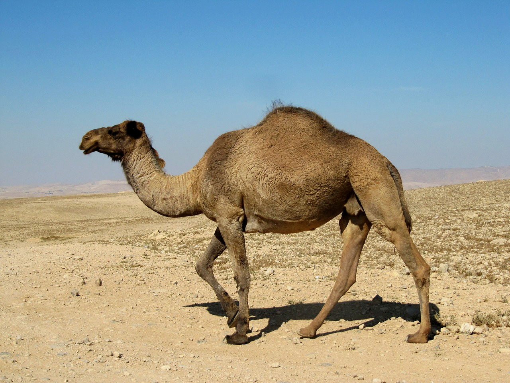

# Animals in the Bible

## License Information

Animals in the Bible © United Bible Societies, 2025. Adapted from: <cite>All Creatures Great and Small: Living Things in the Bible</cite>, by Edward R. Hope © 2005 United Bible Societies. This work is licensed under Creative Commons Attribution-ShareAlike 4.0 International (<a href="https://creativecommons.org/licenses/by-sa/4.0/">https://creativecommons.org/licenses/by-sa/4.0/</a>).

--------------------------------

## Camel, dromedary (id: FAUNA:2.8)

2\.8 Camel, dromedary
=====================

References:
-----------

Hebrew בֵּכֶר, בִּכְרָה (beker, bikrah)

[ISA 60:6](https://ref.ly/Isa60:6), [JER 2:23](https://ref.ly/Jer2:23)

Hebrew גָּמָל (gamal)

[GEN 12:16](https://ref.ly/Gen12:16), [GEN 24:10](https://ref.ly/Gen24:10), [GEN 24:10](https://ref.ly/Gen24:10), [GEN 24:11](https://ref.ly/Gen24:11), [GEN 24:14](https://ref.ly/Gen24:14), [GEN 24:19](https://ref.ly/Gen24:19), [GEN 24:20](https://ref.ly/Gen24:20), [GEN 24:22](https://ref.ly/Gen24:22), [GEN 24:30](https://ref.ly/Gen24:30), [GEN 24:31](https://ref.ly/Gen24:31), [GEN 24:32](https://ref.ly/Gen24:32), [GEN 24:32](https://ref.ly/Gen24:32), [GEN 24:35](https://ref.ly/Gen24:35), [GEN 24:44](https://ref.ly/Gen24:44), [GEN 24:46](https://ref.ly/Gen24:46), [GEN 24:46](https://ref.ly/Gen24:46), [GEN 24:61](https://ref.ly/Gen24:61), [GEN 24:63](https://ref.ly/Gen24:63), [GEN 24:64](https://ref.ly/Gen24:64), [GEN 30:43](https://ref.ly/Gen30:43), [GEN 31:17](https://ref.ly/Gen31:17), [GEN 31:34](https://ref.ly/Gen31:34), [GEN 32:8](https://ref.ly/Gen32:8), [GEN 32:16](https://ref.ly/Gen32:16), [GEN 37:25](https://ref.ly/Gen37:25), [EXO 9:3](https://ref.ly/Exod9:3), [LEV 11:4](https://ref.ly/Lev11:4), [DEU 14:7](https://ref.ly/Deut14:7), [JDG 6:5](https://ref.ly/Judg6:5), [JDG 7:12](https://ref.ly/Judg7:12), [JDG 8:21](https://ref.ly/Judg8:21), [JDG 8:26](https://ref.ly/Judg8:26), [1SA 15:3](https://ref.ly/1Sam15:3), [1SA 27:9](https://ref.ly/1Sam27:9), [1SA 30:17](https://ref.ly/1Sam30:17), [1KI 10:2](https://ref.ly/1Kgs10:2), [2KI 8:9](https://ref.ly/2Kgs8:9), [1CH 5:21](https://ref.ly/1Chr5:21), [1CH 12:41](https://ref.ly/1Chr12:41), [1CH 27:30](https://ref.ly/1Chr27:30), [2CH 9:1](https://ref.ly/2Chr9:1), [2CH 14:14](https://ref.ly/2Chr14:14), [EZR 2:67](https://ref.ly/Ezra2:67), [NEH 7:68](https://ref.ly/Neh7:68), [JOB 1:3](https://ref.ly/Job1:3), [JOB 1:17](https://ref.ly/Job1:17), [JOB 42:12](https://ref.ly/Job42:12), [ISA 21:7](https://ref.ly/Isa21:7), [ISA 30:6](https://ref.ly/Isa30:6), [ISA 60:6](https://ref.ly/Isa60:6), [JER 49:29](https://ref.ly/Jer49:29), [JER 49:32](https://ref.ly/Jer49:32), [EZK 25:5](https://ref.ly/Ezek25:5), [ZEC 14:15](https://ref.ly/Zech14:15)

Hebrew כִּרְכָּרָה (kirkarah)

[ISA 66:20](https://ref.ly/Isa66:20)

Greek κάμηλος (kamēlos)

[MAT 3:4](https://ref.ly/Matt3:4), [MAT 19:24](https://ref.ly/Matt19:24), [MAT 23:24](https://ref.ly/Matt23:24), [MRK 1:6](https://ref.ly/Mark1:6), [MRK 10:25](https://ref.ly/Mark10:25), [LUK 18:25](https://ref.ly/Luke18:25), [TOB 9:2](https://ref.ly/Tob9:2), [JDT 2:17](https://ref.ly/Jdt2:17), [1ES 5:42](https://ref.ly/1Esd5:42)

Latin camelus

[2ES 15:36](https://ref.ly/2Esd15:36)

Discussion:
-----------

*Dromedary (Pixabay)*

While there is no doubt about the identity of the animal referred to by the above Hebrew, Greek and Latin words there has been some difference of opinion among scholars about the reference to camels in [GEN 12:16](https://ref.ly/Gen12:16). Before 1960 it was thought that domestic camels were not in use in Egypt until around 1300 B.C. The evidence used in this argument was the fact that no hieroglyphs (pictures representing words) for camels or illustrations of camels seem to have been in use before that time.

However since then a limestone carving of a loaded camel and some line drawings scratched in stone have been found all dated by archeologists as coming from a period around 3000 B.C. Many camel bones from the period 1800–1600 B.C. have also been uncovered in ancient town sites and a camel hair cord dated about 2500 B.C. was found in Faiyum near Cairo. This new evidence has led scholars to conclude that domestic camels were indeed in use since about 3000 B.C. but that taboos associated with them may have been responsible for the fact that they were not depicted in hieroglyphs on commemorative stones or tomb decorations and that camel figurines were not made before 1550 B.C.

Whether or not these scholars are correct in their conclusions there is no doubt that the Hebrew text as we have it contains the word for “camel", and [GEN 12:16](https://ref.ly/Gen12:16) has to be translated accordingly.

*Bactrian camel (Pixabay)*

There were two types of camel known in Bible times the most common being the Arabian Dromedary *camelus dromedarius*, which was indigenous to the area. The two\-humped Bactrian Camel *camelus bactrianus* was also known and prized, but it was imported from Central Asia.

Description:
------------

Camels belong to the same family as the South American llama, vicuna, alpaca, and guanaco, but camels are much larger and have a big fatty hump on their backs. Bactrian camels may reach a height of about two meters (6\.5 feet), while dromedaries are even bigger. Dromedaries are a uniform light fawn color, while Bactrian camels are darker, especially in winter when they grow longer fur.

Camels do not have hooves but a large footpad with two broad toes ideally suited to walking on sand. In other ways too they are ideally suited to life in desert areas. They store excess food in their humps and this makes it possible for them to go a long time without eating. Special blood cells also enable them to go without water for long periods. They also have a very efficient digestive system and can extract the maximum amount of nutrition from apparently dry vegetation. This adaptation to harsh environments means that camels can make long journeys through dry areas which would be beyond the abilities of other types of pack animal such as donkeys. Camels were used for riding and for carrying heavy loads. They were also used to pull carts.

In winter the fur of camels thickens and grows longer and then when summer comes they shed their winter fur in large wads. These wads of camel hair are collected and twisted into cords and ropes or spun into thread which is then used for weaving coarse cloth. This cloth was usually used for making tents but it was sometimes used for making outer robes.

Camels’ milk was used as food and drink but their meat was considered unclean by the Israelites.

Special significance or symbolism:
----------------------------------

In spite of the fact that camels were considered to be unclean for food they were a symbol of wealth and commerce. People or nations with many camels were automatically viewed as commercially successful and wealthy as the possession of camels opened up the possibility of transporting goods long distances and engaging in trade.

Translation:
------------

In areas where camels are not known, the word is often transliterated from Hebrew or the dominant language of the area. However, in some languages descriptive names have been invented. In some South American languages names meaning “hump\-backed llama” or “big alpaca with a hump” have been used. Elsewhere expressions such as “hump\-backed horse” have been used. A fuller description should usually be included in a glossary or word list.

[GEN 32:15](https://ref.ly/Gen32:15): Here the reference is to female camels that are providing milk, and the expression is often translated as “thirty camels for milking", or “thirty mother camels giving milk".

[ISA 60:6](https://ref.ly/Isa60:6): Although the word *beker* is probably related to the Hebrew root *B\-K\-R* meaning “early” or “the first", the usage in [ISA 60:6](https://ref.ly/Isa60:6) seems not to place any special emphasis on the youth of the camels, but perhaps on their superior quality. The word is used to provide a qualifying synonym (a word having basically the same meaning) for “camel” in order to complete a poetic couplet. The English word “dromedary” has this same function in KJV (King James Version (1611)), NEB (New English Bible (1970)), and JB (Jerusalem Bible (1966)).

In languages that have two words for camel, in [ISA 60:6](https://ref.ly/Isa60:6) the usual word for camel can be used in the first part of the couplet and the lesser known word can be used for *beker* in the parallel line of the poem. However, in languages with only one word for camel, or in languages in which a borrowed or made\-up word is used, it is better to use the usual word for camel in the first line of the couplet and then use a suitable qualifying expression to complete the couplet; for example:

Camel caravans will cover the land,

The best camels from Midian and Ephah;

And from Sheba. … 

In [JER 2:23](https://ref.ly/Jer2:23) the context clearly indicates that *bikrah* refers to a female camel ready for mating, that is, “in heat". The word translated “wild” in TEV (Today's English Version (Good News Bible)) is better translated “berserk” (compare “frantic” in JB (Jerusalem Bible (1966))). The full expression can be translated as “You have gone berserk like a female camel in heat."

[ISA 66:20](https://ref.ly/Isa66:20): The word *kirkaroth* (singular, *kirkarah*), used only once in the Bible, seems to refer to camels used for riding rather than for carrying merchandise. In the context, which depicts people coming from distant foreign lands, the reference may be to Bactrian camels from Central Asia. In most languages the normal word for camel can be used in this verse. In languages that have different markers for pack animals and animals for riding, the word for camel in this verse can be marked as “camel for riding". Where Bactrian camels are known, the word for this type of camel can be used here.

[MAT 19:24](https://ref.ly/Matt19:24); [MAT 23:24](https://ref.ly/Matt23:24); [MRK 10:25](https://ref.ly/Mark10:25); [LUK 18:25](https://ref.ly/Luke18:25): In these passages the large size of the camel is contrasted with a small eye of a needle in the one case, and with a small mosquito in the other. In some languages where camels are not well known, translators have used the name of a better known large animal, such as “bull", “horse", or “elephant", in order to retain the impact of Jesus’ words for the local readers. In such cases it is necessary to use a footnote to the effect that the Greek text has “camel". Translators should avoid using the names of animals that were not known to the original audience, such as “moose” or “kangaroo", or words that would have had a negative connotation, such as “big pig".

* **Associated Passages:** Isaiah 60:6; Jeremiah 2:23; Genesis 12:16; Genesis 24:10; Genesis 24:11; Genesis 24:14; Genesis 24:19; Genesis 24:20; Genesis 24:22; Genesis 24:30; Genesis 24:31; Genesis 24:32; Genesis 24:35; Genesis 24:44; Genesis 24:46; Genesis 24:61; Genesis 24:63; Genesis 24:64; Genesis 30:43; Genesis 31:17; Genesis 31:34; Genesis 32:8; Genesis 32:16; Genesis 37:25; Exodus 9:3; Leviticus 11:4; Deuteronomy 14:7; Judges 6:5; Judges 7:12; Judges 8:21; Judges 8:26; 1 Samuel 15:3; 1 Samuel 27:9; 1 Samuel 30:17; 1 Kings 10:2; 2 Kings 8:9; 1 Chronicles 5:21; 1 Chronicles 12:41; 1 Chronicles 27:30; 2 Chronicles 9:1; 2 Chronicles 14:14; Ezra 2:67; Nehemiah 7:68; Job 1:3; Job 1:17; Job 42:12; Isaiah 21:7; Isaiah 30:6; Jeremiah 49:29; Jeremiah 49:32; Ezekiel 25:5; Zechariah 14:15; Isaiah 66:20; Matthew 3:4; Matthew 19:24; Matthew 23:24; Mark 1:6; Mark 10:25; Luke 18:25; Tobit 9:2; Judith 2:17; 1 Esdras (Greek) 5:42; 2 Esdras (Latin) 15:36; Genesis 32:15

