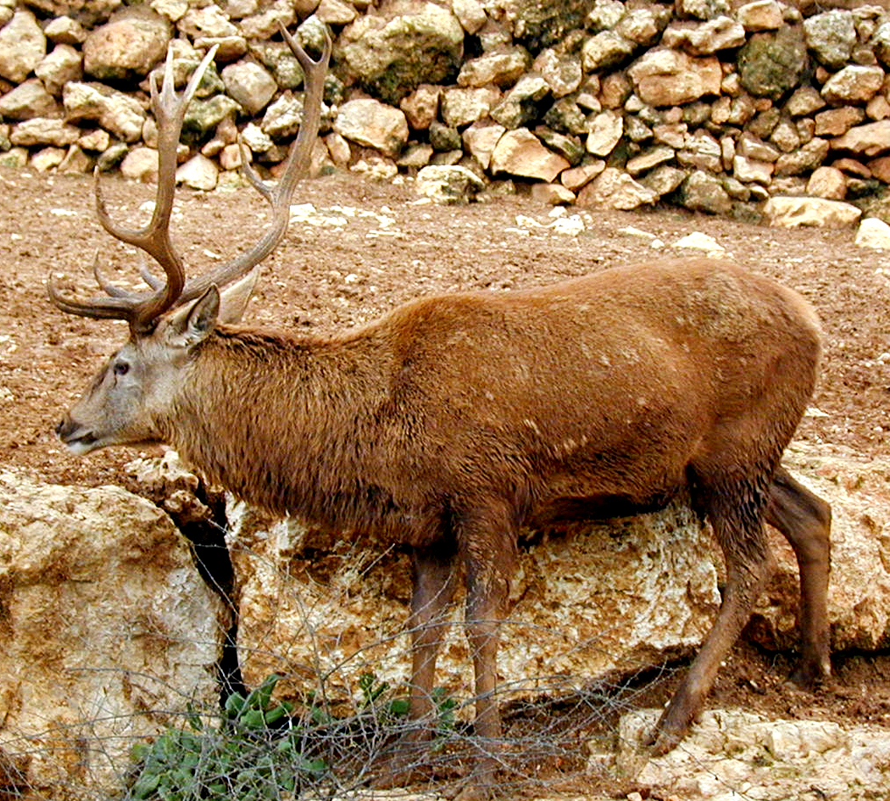

# Animals in the Bible

## License Information

Animals in the Bible © United Bible Societies, 2025. Adapted from: <cite>All Creatures Great and Small: Living Things in the Bible</cite>, by Edward R. Hope © 2005 United Bible Societies. This work is licensed under Creative Commons Attribution-ShareAlike 4.0 International (<a href="https://creativecommons.org/licenses/by-sa/4.0/">https://creativecommons.org/licenses/by-sa/4.0/</a>).

--------------------------------

## Deer (id: FAUNA:2.11)

2\.11 Deer
==========

References:
-----------

Hebrew אַיָּל (’ayal)

[DEU 12:15](https://ref.ly/Deut12:15), [DEU 12:22](https://ref.ly/Deut12:22), [DEU 14:5](https://ref.ly/Deut14:5), [DEU 15:22](https://ref.ly/Deut15:22), [1KI 5:3](https://ref.ly/1Kgs5:3), [PSA 42:2](https://ref.ly/Ps42:2), [SNG 2:9](https://ref.ly/Song2:9), [SNG 2:17](https://ref.ly/Song2:17), [SNG 8:14](https://ref.ly/Song8:14), [ISA 35:6](https://ref.ly/Isa35:6), [LAM 1:6](https://ref.ly/Lam1:6)

Hebrew אַיָּלָה, אַיֶּלֶת (’ayalah, ’ayelet)

[GEN 49:21](https://ref.ly/Gen49:21), [2SA 22:34](https://ref.ly/2Sam22:34), [JOB 39:1](https://ref.ly/Job39:1), [PSA 18:34](https://ref.ly/Ps18:34), [PSA 22:1](https://ref.ly/Ps22:1), [PSA 29:9](https://ref.ly/Ps29:9), [PRO 5:19](https://ref.ly/Prov5:19), [SNG 2:7](https://ref.ly/Song2:7), [SNG 3:5](https://ref.ly/Song3:5), [JER 14:5](https://ref.ly/Jer14:5), [HAB 3:19](https://ref.ly/Hab3:19)

For *yachmur* see [2\.7 Bubal hartebeest](#FAUNA:2.7).

Discussion:
-----------

*Red deer (© Ray Pritz (UBS))*

There were once three different types of deer (family *cervidae*) in Canaan the Fallow Deer *Dama dama*, the Red Deer *Cervus elaphus*, and the Roe Deer *Capreolus capreolus*. Of these the red deer disappeared very early before the time of the Exodus and the roe deer was confined to thick bush in remote valleys and so was probably seldom seen. Thus the fallow deer would have been the most common. It roamed wild and was also probably kept in deer parks in the days of King Solomon.

The Hebrew term *’ayal* was probably a general term for deer and for the male fallow deer in particular. *’Ayalah* and *’ayelet* are the female forms.

At the time when KJV (King James Version (1611)) was produced deer hunting was a very popular pastime and a number of specialized words were used to refer to deer in their different stages of development. Young male deer were called successively: knobbers \- brockets \- spayads \- staggards \- harts \- stags. The English word “hart” thus actually refers to a male red deer in its fifth year when a “royal” prong forms on its antler. The word “stag” refers to the male red deer (usually the dominant male of a herd) after its sixth year when a “crown” of three prongs forms at the very top of its antlers. “Hind” refers to the female red deer of three years and upward. “Buck” refers to the male fallow deer or the male roe deer and “doe” to the females of these. This usage is reflected in the KJV (King James Version (1611))RSV (Revised Standard Version (1952)) and NEB (New English Bible (1970)) versions.

In modern English outside of deer\-hunting circles most types of deer of either sex are called simply “deer” but if the sex is differentiated in most of the English\-speaking world “stag” is usually used for the male and “doe” for the female; however, in the U.S.A. the males are called “bucks.” Young deer are often called “fawns."

Description:
------------

Deer differ from antelopes in that the males drop their antlers (horns) every year, while antelopes do not. Most deer have horns that branch, that is, they have more than one point on each horn. Only male deer have antlers, whereas in many antelope species both the males and females produce horns.

*Fallow deer (© Eyal Bartov (Wikimedia Commons))*

Fallow deer are fairly large animals standing about a meter (3 feet) high at the shoulder. In summer they have a reddish fur with white spots and in the winter this coat becomes darker and the spots disappear. The bucks begin to grow antlers (branching horns) in the second year. This is at first a short unbranched prong. Each year the antlers are shed at the beginning of spring. In the third year branched antlers appear with two simple branches facing forward and the main branch growing upward. In subsequent years this main branch grows bigger flattens out and develops numerous sharp points along the edge. Eventually at the end of the fifth year each antler is double the width of the human hand in places and about 70 centimeters (2 feet) in length.

Mating takes place in autumn when the bucks utter hoarse bellowing roars. Does do not have horns. They are very graceful creatures.

Special significance or symbolism:
----------------------------------

The male deer in Scripture is associated with speed agility and strength although in Song of Songs it is also associated with sexual prowess (as is the word stag in English). The female deer is associated with surefootedness and the ability to produce abundant offspring (from their second year they produce at least one fawn a year).

Translation:
------------

Where deer are known, a generic word is the best choice. If no generic words exist but the fallow deer is known, the word for this deer should be chosen. In other parts of the world where deer are found, if a specific rather than a generic word has to be used, the word for a large type of deer is preferable, such as the sambar deer (of India, Burma, Thailand, and western China) or the elk of North America.

Since surefootedness is not associated with deer in some parts of the world, a phrase such as “surefooted as a deer” should be used in [2SA 22:34](https://ref.ly/2Sam22:34), [PSA 18:33](https://ref.ly/Ps18:33), and [HAB 3:19](https://ref.ly/Hab3:19) or a local animal known for its surefootedness could be substituted (see the discussion below).

In Africa, where the only deer are very small forest dwellers, it is better to use a term for an antelope that lives in herds, such as the impala, when there is a literal reference to deer. In passages where there is figurative usage, however, there is a little more leeway. In [PSA 42:1](https://ref.ly/Ps42:1) for instance it would be legitimate to use the word for a local large antelope known to need water regularly, such as the wildebeest or impala. Similarly in the passages referred to above, where “surefootedness on high places” is the theme, the word for a local cliff\-dwelling antelope such as the Klipspringer *Oreotragus oreotragus* or Chamois *Rupicapra rupicapra* would be legitimate. In all these cases a footnote could indicate that the Hebrew refers to a deer, although this is not strictly necessary. It is to be noted that in [PSA 42:1](https://ref.ly/Ps42:1), while the masculine form *’ayal* is used, the corresponding verb is feminine. Where a language distinguishes between genders, it is recommended that a word be used indicating a female animal.

In the Hebrew text of [GEN 49:21](https://ref.ly/Gen49:21) there are a number of problems. The combination of words used with the noun *’ayalah* is rather strange, since the sentence with the vowels of the Masoretic Text is literally “Naphtali is a female deer that has been sent/set free, which gives a beautiful word.” The verb “sent” is usually used of sending messengers, and the expression “a beautiful word” reinforces this possibility. The sentence could conceivably mean “Naphtali is like a deer sent out as a messenger to give beautiful news.” The point of comparison would be the speed of the deer, that is, it would describe Naphtali as a speedy messenger, which is rather strange. No major translation has ever adopted this interpretation.

Many translations have adopted the interpretation “Naphtali is a deer set free, which produces beautiful fawns” (compare RSV (Revised Standard Version (1952)), NIV (New International Version (1984)), TEV (Today's English Version (Good News Bible)), NAB (New American Bible (1970))), but this involves a very debatable emendation of the word meaning “word” or “utterance". The point of comparison would be enjoyment of freedom on the one hand and fertility on the other. It is likely that the Masoretic Hebrew text has been corrupted at some point, and that the Greek of the Septuagint represents an earlier form of the text: “Naphtali is a spreading terebinth tree that puts forth a lovely canopy” (compare NEB (New English Bible (1970)), REB (Revised English Bible (1989)), and footnotes in most other versions). This translation is based on a reading of *’elah* instead of *’ayalah*. The point of comparison for both metaphors would be prosperity and fertility. A similar problem exists in [PSA 29:9](https://ref.ly/Ps29:9), where the reading should probably be *’elah*, “terebinth tree", rather than *’ayalah*.

In parts of the world where neither deer nor antelope are found, borrowed terms may have to be used, but these should be described in a glossary.

* **Associated Passages:** Deuteronomy 12:15; Deuteronomy 12:22; Deuteronomy 14:5; Deuteronomy 15:22; 1 Kings 5:3; Psalms 42:2; Song of Songs 2:9; Song of Songs 2:17; Song of Songs 8:14; Isaiah 35:6; Lamentations 1:6; Genesis 49:21; 2 Samuel 22:34; Job 39:1; Psalms 18:34; Psalms 22:1; Psalms 29:9; Proverbs 5:19; Song of Songs 2:7; Song of Songs 3:5; Jeremiah 14:5; Habakkuk 3:19; Psalms 18:33; Psalms 42:1

