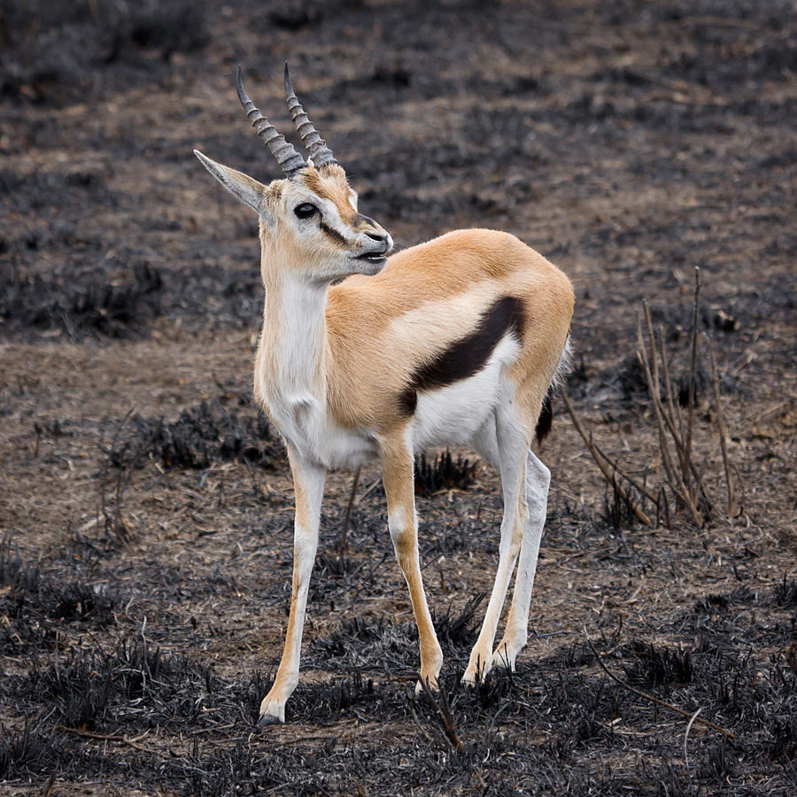

# Animals in the Bible

## License Information

Animals in the Bible © United Bible Societies, 2025. Adapted from: <cite>All Creatures Great and Small: Living Things in the Bible</cite>, by Edward R. Hope © 2005 United Bible Societies. This work is licensed under Creative Commons Attribution-ShareAlike 4.0 International (<a href="https://creativecommons.org/licenses/by-sa/4.0/">https://creativecommons.org/licenses/by-sa/4.0/</a>).

--------------------------------

## Gazelle (id: FAUNA:2.15)

2\.15 Gazelle
=============

References:
-----------

Hebrew צְבִי (tsvi)

[DEU 12:15](https://ref.ly/Deut12:15), [DEU 12:22](https://ref.ly/Deut12:22), [DEU 14:5](https://ref.ly/Deut14:5), [DEU 15:22](https://ref.ly/Deut15:22), [2SA 2:18](https://ref.ly/2Sam2:18), [1KI 5:3](https://ref.ly/1Kgs5:3), [PRO 6:5](https://ref.ly/Prov6:5), [SNG 2:9](https://ref.ly/Song2:9), [SNG 2:17](https://ref.ly/Song2:17), [SNG 8:14](https://ref.ly/Song8:14), [ISA 13:14](https://ref.ly/Isa13:14)

Hebrew צְבִיָּה (tsviyah)

[SNG 2:7](https://ref.ly/Song2:7), [SNG 3:5](https://ref.ly/Song3:5), [SNG 4:5](https://ref.ly/Song4:5), [SNG 7:4](https://ref.ly/Song7:4)

Greek δορκάς (dorkas)

[SIR 27:20](https://ref.ly/Sir27:20)

Discussion:
-----------

*Gazelle (© Ikiwaner (Wikimedia Commons))*

Both the Hebrew and Greek names are probably general terms for gazelle. At least two types of gazelle the Dorcas Gazelle *Gazella dorcas* and the Palestine or Arabian Gazelle *Gazella arabica* were found in the Middle East. They are still to be found in secluded areas. The gazelles pictured on the Ashurbanipal hunting panels are undoubtedly Impala *Aepyceros melampus* as can be seen from both the shape of the horns and the fact that the females are without horns. This would indicate that about 650 B.C. the impala was found as far east as Nineveh.

Description:
------------

Gazelles are small to medium sized plains antelopes, inhabiting savannah plains and semideserts. Both sexes have horns, except for the female impala, which is without horns. The horns of the gazelle species mentioned above are lyre\-shaped about 25–50 centimeters (10–20 inches) in length. Gazelles are reddish brown with almost white underparts. They are long\-legged and graceful and are expert jumpers. They live in small herds of up to about thirty. Females become sexually active at one year and bear young every year. This high rate of reproduction ensures their survival. They feed on both grass and the leaves of acacia and other bushes.

A breeding herd consists of one dominant breeding male and a group of females. The other males are chased from the herd when they become sexually active and they then form bachelor herds. These bachelor herds are the prime target for human and animal hunters since they provide a convenient source of meat while leaving the breeding cycle intact. In biblical times gazelles were trapped in nets or snares or were shot with bows and arrows.

Special significance or symbolism:
----------------------------------

The gazelle was seen as the cleanest of game animals since it met all the requirements of the Law concerning cloven hooves and cud\-chewing. It was also a symbol of speed grace and beauty (the Hebrew root means beauty) and of female sexuality and fertility.

Translation:
------------

*Impala (Pixabay)*

Where a language distinguishes between male and female animals, *tsvi* should be translated by the male form and *tsviyah* by the female form.

In East Africa where gazelles are well known, a generic word for gazelles or the specific word for one of the smaller gazelles, such as the Thompson’s Gazelle *Gazella thompsonii*, is suitable. Elsewhere in Africa where the impala is known, the word for this antelope can be used.

Elsewhere, the word for a small antelope or deer that lives in herds can be used for the references that are literal, and the word for some swift, graceful antelope or deer can be used in the contexts where speed, grace, or beauty are being symbolized. As usual, in areas where gazelles, antelopes, and deer are unknown, a transliteration from the dominant international language or from the Hebrew original can be used. In such cases a description should be given in the glossary.

* **Associated Passages:** Deuteronomy 12:15; Deuteronomy 12:22; Deuteronomy 14:5; Deuteronomy 15:22; 2 Samuel 2:18; 1 Kings 5:3; Proverbs 6:5; Song of Songs 2:9; Song of Songs 2:17; Song of Songs 8:14; Isaiah 13:14; Song of Songs 2:7; Song of Songs 3:5; Song of Songs 4:5; Song of Songs 7:4; Sirach 27:20

