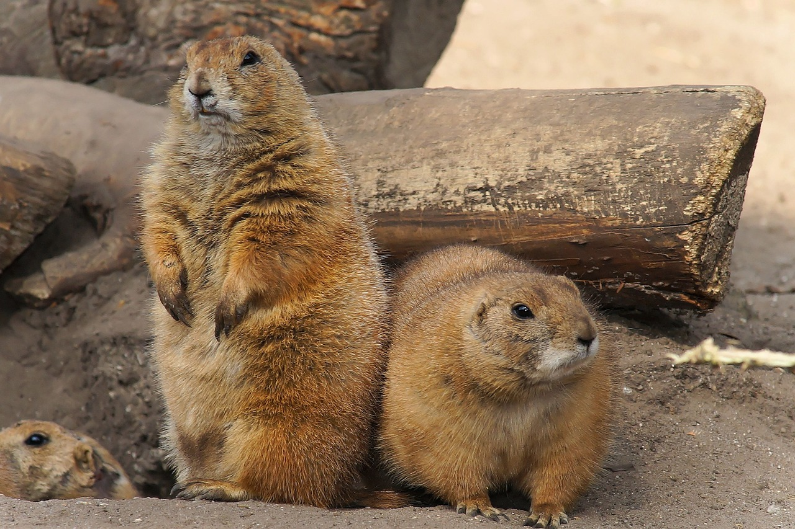

# Animals in the Bible

## License Information

Animals in the Bible © United Bible Societies, 2025. Adapted from: <cite>All Creatures Great and Small: Living Things in the Bible</cite>, by Edward R. Hope © 2005 United Bible Societies. This work is licensed under Creative Commons Attribution-ShareAlike 4.0 International (<a href="https://creativecommons.org/licenses/by-sa/4.0/">https://creativecommons.org/licenses/by-sa/4.0/</a>).

--------------------------------

## Mole rat (id: FAUNA:2.25)

2\.25 Mole rat
==============

Reference:"
-----------

Hebrew חֲפַרְפָּרָה (chafarparah)

[ISA 2:20](https://ref.ly/Isa2:20)

Discussion:
-----------

*Mole rat (© Bassem18 (Wikimedia Commons))*

This word occurs only once in the Hebrew Bible and it is very difficult to know what it refers to. In the Masoretic Text it is written as two words *lachpor perot* which seem to mean “to dig holes". But the ancient versions interpret the two words of the Masoretic Text to be a single word *lachafarparot* a noun phrase literally meaning to “the dig\-diggers” or “to the search\-searchers” so it is taken by them to mean “to the moles". The verb form *chafar* occurs more frequently in the Bible and means “to dig", “to search” or “to spy” ([JOS 2:2](https://ref.ly/Josh2:2); [JOS 2:3](https://ref.ly/Josh2:3)). The only place where the supposed noun form occurs is in [ISA 2:20](https://ref.ly/Isa2:20) where it is in parallel with a word meaning “bats". “Moles” and “bats” seems to be a strange pairing especially since the Israelites classified bats among the birds.

Besides “moles” other interpretations that have been made by commentators are “scavengers” (which both search and dig around in refuse) “woodborers” (a type of small beetle) and “woodpeckers".

Strictly speaking moles which feed on worms are not found in Israel. The closest equivalent there is the Syrian Mole Rat *Spalax leucodon ehrenbergi* which burrows underground like a mole but is a rodent feeding on roots and bulbs.

Some scholars and some versions translate the Hebrew word *choled* as “mole rat” or “mole", but see [2\.26 Mongoose, weasel](#FAUNA:2.26). KJV (King James Version (1611)) translates another Hebrew word *tinshemeth* as “mole", but see [4\.3 Chameleon](#FAUNA:4.3).

Description:
------------

*Prairie dogs (Pixabay)*

Syrian mole rats are gray rodents that grow to about twenty centimeters (8 inches) in length with very large teeth that protrude from the front of the mouth. They live almost entirely underground, digging their tunnels just below the ground surface with their large teeth and flat front paws. From time to time they eject surplus soil onto the surface of the ground, making small heaps, and thereby giving away their presence. They are blind, and live on roots.

Translation:
------------

Any translation of this word is guesswork. The translator is probably safest in following one of the well\-known English versions, even though they too are based on conjecture. In an attempt to make better sense in the context, any of the alternative suggestions made above may be followed, but a footnote should indicate that the meaning of the Hebrew word is uncertain.

If the interpretation mole rat is accepted, similar animals are found all over sandy parts of Africa, (belonging to the animal family known scientifically as *Bathyergomorpha*), and a name for one of the local varieties can easily be used. The Cane Rat *Thryonomys swinderianus* (known as the grass\-cutter in West Africa) is another possibility. In North America either the Pocket Gopher *Geomys bursarius* or the Prairie Dog *Cynomys ludovicianus* is probably the best local choice, while in India and Southeast Asia the Bamboo Rat *Rhizomys* is a local possibility. In South America one may use the local name for one of the Tuco\-tucos *Ctenomys*, Hutias *Geocapromys*, Viscachas *Lagostomus maximus*, or Guinea Pigs *Cavia porcellus*. Elsewhere it is possible to use a word for similar moles or rat\-like animals that burrow.

* **Associated Passages:** Isaiah 2:20; Joshua 2:2; Joshua 2:3

