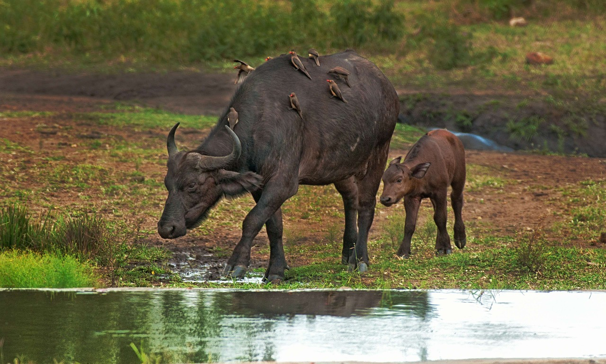
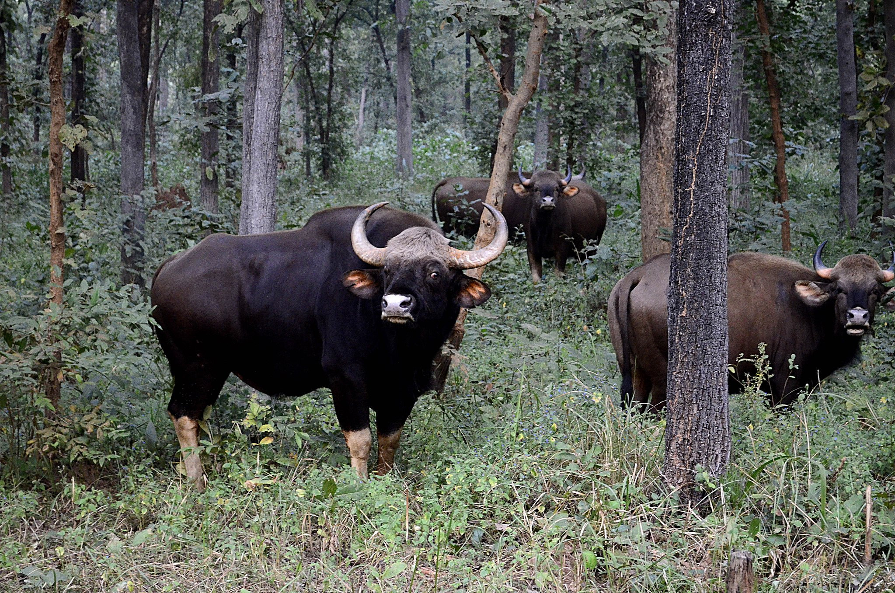

# Animals in the Bible

## License Information

Animals in the Bible © United Bible Societies, 2025. Adapted from: <cite>All Creatures Great and Small: Living Things in the Bible</cite>, by Edward R. Hope © 2005 United Bible Societies. This work is licensed under Creative Commons Attribution-ShareAlike 4.0 International (<a href="https://creativecommons.org/licenses/by-sa/4.0/">https://creativecommons.org/licenses/by-sa/4.0/</a>).

--------------------------------

## Wild ox (id: FAUNA:2.34)

2\.34 Wild ox
=============

References:
-----------

Hebrew רְאֵם (re’em)

[NUM 23:22](https://ref.ly/Num23:22), [NUM 24:8](https://ref.ly/Num24:8), [DEU 33:17](https://ref.ly/Deut33:17), [JOB 39:9](https://ref.ly/Job39:9), [JOB 39:10](https://ref.ly/Job39:10), [PSA 22:22](https://ref.ly/Ps22:22), [PSA 29:6](https://ref.ly/Ps29:6), [PSA 92:11](https://ref.ly/Ps92:11), [ISA 34:7](https://ref.ly/Isa34:7)

Discussion:
-----------

*Aurochs ((Source unknown))*

Since the beginning of the twentieth century *re’em* has been translated as “wild ox” in English versions, following the original suggestion made by Canon Tristram in the previous century. However, there are problems connected with this rendering. The usual justifications for this translation are a) that the Akkadian equivalent word *rimu* refers to the wild ox or Aurochs *Bos primigenius*, which was frequently hunted by Akkadian kings and b) that wild ox or aurochs fits the description of the wild untameable animal referred to in the Bible.

Both of these arguments have weaknesses from a zoological point of view and the linguistic argument is also debatable. Firstly, the aurochs hunted by the Akkadian kings was an animal found in high rainfall areas with forests. In historical times it was found only in the wooded areas of central and southeastern Europe Armenia (including the southern coastland of the Black Sea) and Mesopotamia. The only aurochs remains found in the land of Israel and the Arabian Peninsula date from the early Pleistocene Age. It is highly unlikely that this animal lived in Israel in biblical times.

Secondly, while the Akkadian *rimu* is usually translated as “wild ox", the Ugaritic *rum* has been translated by some scholars as “buffalo", and the Old Arabic *rim* is usually translated as “oryx". Both of these words are related to the Hebrew *re’em*. Some scholars have argued that the *re’em* is really the oryx.

Furthermore, while the wild aurochs was very large, dangerous, and strong, it was not really “untameable". Its dependence on water made it fairly easy to capture in nets and it was domesticated very early. It is the ancestor of all short\-horned European cattle. Ancient pictures carved in limestone found in the excavations at Kujunjik in Iraq show carts being pulled by cattle that look exactly the same as the aurochs pictured in hunting scenes from an earlier period.

An animal similar to the aurochs was hunted by early Egyptian kings but it had disappeared from Egypt as early as the reign of Rameses III (about 1190 B.C.), who hunted instead “wild ox” (probably the Cape buffalo) in forested areas of the Sudan, where there is no evidence that the aurochs ever lived. (A commemorative painting of one of these hunts clearly shows aurochs\-like animals being hunted from chariots, but this may be artistic license or a traditional stereotype\-the lions in similar paintings are certainly fanciful stereotypes.)

Among the many animal mummies found in Egypt there are a number of bubal or red hartebeest and Cape buffalo. Both of these animals fit the biblical description of “wild ox", and the hartebeest certainly lived in Arabia and the land of Israel.

The Septuagint translates *re’em* as *monokerōs* which literally means “one\-horned” (hence the KJV (King James Version (1611)) “unicorn") but is the ancient Greek word for rhinoceros. This translation needs to be taken seriously, because of its early date. The rhinoceros would have been an animal known to the Jews, since it was found in parts of Egypt. The ancient naturalist, Strabo of Amasia, who lived in the early part of the first century A.D., describes a rhinoceros that he saw in Egypt and refers to another naturalist of the time who had also described this animal. A variety of rhinoceros was found in Egypt, Sudan, and Ethiopia at the time of the Exodus, and a second variety was found in Mesopotamia.

At the time of the Exodus then, the aurochs would have been found in the forests of southeast Europe, the far north of Asia Minor, and Mesopotamia, but not in Egypt, Canaan, the Arabian Peninsula, Sinai, or Syria. However, the oryx and the bubal hartebeest would have been plentiful and well known, and the Cape buffalo and rhinoceros would have been known too, at least by hearsay.

There is another aspect of the question that needs to be kept in mind. Throughout human history large, prominent animals have had symbolic importance, even in societies that would never have seen the animal. Thus the lion has been important in Chinese and British culture for centuries, but there is no evidence that lions have ever lived in China or Britain. Thus the aurochs, while it may be a rather improbable interpretation, cannot be ruled out entirely.

Four things can be said for certain about the *re’em*. It was a wild, untameable animal, it had horns, it was very strong, and it was appropriate to contrast or compare it with domestic cattle and with lions.

Description:
------------

**Aurochs:** The Aurochs *Bos primigenius*, which is now extinct, was a very large animal, with prominent forward\-pointing horns. It looked very similar to the bulls used in Spain for bull\-fighting in modern times, but it was probably even larger. The bulls were dark brown or black, with a pale stripe down the spine, while the females were a lighter brown. The German zoos of Berlin, Munich, and Frankfurt have been fairly successful in genetic engineering experiments that have been aimed at reintroducing the aurochs’ original genetic characteristics, by selective breeding from domestic cattle that have the required characteristics. The resulting animals seem to resemble closely the original aurochs.

*Cape buffalo (Pixabay)*

**Cape Buffalo**: The Cape Buffalo *Syncerus caffer* is also a very large animal not as tall as the aurochs but heavier. It is found wherever there is adequate water supply all over sub\-Saharan Africa. It prefers thick bush or riverine forest in which to take cover during the day. It has very thick horns that emerge from a broad boss on its forehead then sweep sideways and down before curving sharply upward toward the head. The males have thicker horns than the females. The skin is covered in short hair that varies from black to gray or brown and is usually covered with dry mud so that the buffaloes look the same color as the local soil.

Cape buffaloes live in large herds often numbering over five hundred animals. They are extremely strong cunning and fearless and are probably the most dangerous animals in Africa. Although they have become accustomed to man in some protected areas they are unpredictable and easily provoked. Unlike the Asian water buffalo or carabao the Cape buffalo has never been domesticated.

*Black rhinoceros (Pixabay)*

**Rhinoceros**: The rhinoceros found in Mesopotamia in biblical times was a subvariety of the Great Indian Rhinoceros *Rhinoceros unicornis* while the variety found in Egypt and Sudan would have been the Hook\-lipped or Black Rhinoceros *Diceros bicornis*. The hook\-lipped rhinoceros weighs up to 2000 kilograms (4400 pounds) and is about 1\.7 meters (70 inches) tall at the shoulder. It has two horns above the nose, one behind the other, the front one growing over half a meter (20 inches) in length. They live in bushy country and feed on leaves and twigs. They are solitary animals with poor eyesight and are very aggressive. The great Indian rhinoceros was even larger and had a single horn.

**Bubal hartebeest**: See [2\.7 Bubal hartebeest](#FAUNA:2.7).

Special significance or symbolism:
----------------------------------

The *re’em* was a symbol of strength, wildness, and power.

Translation:
------------

Because of the uncertainty of identifying this animal, it is probably best to have an equivalent of “wild ox” or “wild bull” in the text and indicate in a footnote, each time the word is translated, that the word may mean “buffalo” and that the Septuagint has “rhinoceros".

A problem in many countries is that using a phrase like “wild ox” suggests that this is a domestic ox that has gone wild. For this reason, it may be better to use a local name for a large strong, horned animal.

*Gaurs (© Jenis patel (Wikimedia Commons))*

In Africa the obvious equivalent is the buffalo, and this choice is strengthened by the fact that *re’em* may even mean “buffalo".

*Bison (© katsrcool from Edmond (Wikimedia Commons))*

In the Indian subcontinent, Myanmar, Thailand, Malaysia, and western China, there is an animal (now nearly extinct) known as the Gaur *Bibos gaurus*. In Thailand it is called the *ngua\-kating*, and in Malaysia, the *seladang*. It is sometimes incorrectly referred to as the “wild water buffalo". This is a type of wild ox very similar to the aurochs. In the Himalayas and mountains of western China there is another smaller animal similar to a wild ox called the Takin *Budorcas taxicolor*. Another possibility in the Himalayas and Central Asia is an expression meaning “wild yak".

In North America the Bison or American Buffalo *Bison bison* is the closest equivalent. Another possible equivalent in some Arctic regions is the Musk Ox *Ovibos moschatus*.

Elsewhere a transliteration or a word borrowed from a locally dominant language is a possible solution.

* **Associated Passages:** Numbers 23:22; Numbers 24:8; Deuteronomy 33:17; Job 39:9; Job 39:10; Psalms 22:22; Psalms 29:6; Psalms 92:11; Isaiah 34:7

