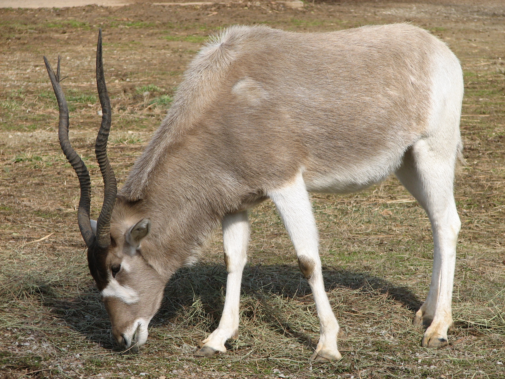

# Animals in the Bible

## License Information

Animals in the Bible © United Bible Societies, 2025. Adapted from: <cite>All Creatures Great and Small: Living Things in the Bible</cite>, by Edward R. Hope © 2005 United Bible Societies. This work is licensed under Creative Commons Attribution-ShareAlike 4.0 International (<a href="https://creativecommons.org/licenses/by-sa/4.0/">https://creativecommons.org/licenses/by-sa/4.0/</a>).

--------------------------------

## Mammals (id: FAUNA:2)

2 Mammals
=========

* [2\.1 Clean Animals (Deut 14:4–6\)](#FAUNA:2.1)
* [2\.2 Antelope](#FAUNA:2.2)
* [2\.3 Apes](#FAUNA:2.3)
* [2\.4 Ass, donkey](#FAUNA:2.4)
* [2\.5 Bat](#FAUNA:2.5)
* [2\.6 Bear](#FAUNA:2.6)
* [2\.7 Bubal hartebeest (roe deer)](#FAUNA:2.7)
* [2\.8 Camel, dromedary](#FAUNA:2.8)
* [2\.9 Cat](#FAUNA:2.9)
* [2\.10 Cattle, cow, ox, bull](#FAUNA:2.10)
* [2\.11 Deer](#FAUNA:2.11)
* [2\.12 Dog](#FAUNA:2.12)
* [2\.13 Dugong](#FAUNA:2.13)
* [2\.14 Elephant](#FAUNA:2.14)
* [2\.15 Gazelle](#FAUNA:2.15)
* [2\.16 Goat](#FAUNA:2.16)
* [2\.17 Hare](#FAUNA:2.17)
* [2\.18 Horse](#FAUNA:2.18)
* [2\.19 Hyena](#FAUNA:2.19)
* [2\.20 Hyrax, rock badger](#FAUNA:2.20)
* [2\.21 Ibex, wild goat, mountain goat](#FAUNA:2.21)
* [2\.22 Jackal, fox](#FAUNA:2.22)
* [2\.23 Leopard, cheetah](#FAUNA:2.23)
* [2\.24 Lion](#FAUNA:2.24)
* [2\.25 Mole rat](#FAUNA:2.25)
* [2\.26 Mongoose, weasel](#FAUNA:2.26)
* [2\.27 Mouse, rat](#FAUNA:2.27)
* [2\.28 Mule](#FAUNA:2.28)
* [2\.29 Oryx](#FAUNA:2.29)
* [2\.30 Pig](#FAUNA:2.30)
* [2\.31 Sheep, lamb](#FAUNA:2.31)
* [2\.32 Wild ass](#FAUNA:2.32)
* [2\.33 Wild boar](#FAUNA:2.33)
* [2\.34 Wild ox](#FAUNA:2.34)
* [2\.35 Wolf](#FAUNA:2.35)

## Clean animals (Deut 14:4–6) (id: FAUNA:2.1)

2\.1 Clean animals (Deut 14:4–6\)
=================================

In [DEU 14:4–DEU 14:6](https://ref.ly/Deut14:4-Deut14:6) there is a list of clean animals which contains three domestic animals, about which there is no difference of opinion, and seven other vegetation\-eating animals, about which there is considerable difference of opinion.

It seems useful, before trying to identify each, to try to deduce from the archeological evidence which animals of this type would have been familiar to the people of the period. It is certain that they would have known the gazelle, the oryx, the ibex, the fallow deer, and the mountain sheep, since all of these were found in the region. These animals can be related to the Hebrew words *tsvi, te’o, ’aqo, ’ayal*, and *zemer* respectively. That accounts for five of the seven. The remaining two are a problem.

Among the wild animals found in biblical lands from very early times which would certainly have been considered clean are the red hartebeest and an antelope of the kobus type. It seems likely that the problematic Hebrew word *yachmur* refers to one of these, probably the hartebeest. If this is correct, then it would seem that Solomon kept herds of red hartebeest in later times in Israel ([1KI 4:23](https://ref.ly/1Kgs4:23)). This type of herding of wild hartebeest was common in Mesopotamia and Egypt.

The other problematic Hebrew word, *dishon*, may refer to the kobus antelope, or to the addax antelope, which was another animal kept in herds in Egypt.

What is clear is that all “game animals” known to the Israelites — deer, antelopes, gazelles, wild goats, and wild sheep — were included in the list of clean animals. Retaining this fact in the translation is probably more important than establishing the identity of each of the Hebrew words.

**Deuteronomy 14\.4–5**
-----------------------

---

| Hebrew | *shor* | *kesev* | *‘ez* | *’ayal* | *tsvi* |
| --- | --- | --- | --- | --- | --- |
| KJV (King James Version (1611)) | ox | sheep | goat | hart | roebuck |
| RSV (Revised Standard Version (1952)) | ox | sheep | goat | hart | gazelle |
| NEB (New English Bible (1970)) | ox | sheep | goat | buck | gazelle |
| JB (Jerusalem Bible (1966)), NIV (New International Version (1984)) | ox | sheep | goat | deer | gazelle |
| TEV (Today's English Version (Good News Bible)) | cattle | sheep | goats | deer | —— |
| NAB (New American Bible (1970)) | ox | sheep | goat | red deer | gazelle |
| ERH (Edward R. Hope (Animals in the Bible)) | **cattle** | **sheep** | **goats** | **deer** | **gazelle** |
| Hebrew | *yachmur* | *’aqo* | *dishon* | *te’o* | *zomer* |
| KJV (King James Version (1611)) | fallow deer | wild goat | pygarg | wild ox | chamois |
| RSV (Revised Standard Version (1952)) | roebuck | wild goat | ibex | antelope | mountain sheep |
| NEB (New English Bible (1970)) | roebuck | wild goat | white\-tailed deer | long\-horned antelope | rock goat |
| JB (Jerusalem Bible (1966)) | roebuck | ibex | antelope | oryx | mountain sheep |
| NIV (New International Version (1984)) | roe deer | wild goat | antelope | oryx | mountain sheep |
| TEV (Today's English Version (Good News Bible)) | —— | wild goats | antelopes | —— | wild sheep |
| NAB (New American Bible (1970)) | roe deer | ibex | addax | oryx | mountain sheep |
| ERH (Edward R. Hope (Animals in the Bible)) | **hartebeest(bubal)** | **ibex** | **antelope** | **oryx** | **mountain sheep** |

---

* **Associated Passages:** Deuteronomy 14:4; Deuteronomy 14:6; 1 Kings 4:23

## Antelope (id: FAUNA:2.2)

2\.2 Antelope
=============

Reference:"
-----------

Hebrew דִּישׁוֹן (dishon)

[DEU 14:5](https://ref.ly/Deut14:5)

Discussion:
-----------

The Septuagint renders this word as *pugargos* (transliterated as “pygarg” by the King James Version \[KJV (King James Version (1611)) ]) which means “white rump.” This Greek name could refer to an antelope of the *Kobus* family which includes the Waterbuck, the Defassa Waterbuck *Kobus defassa* and the White\-eared Kob *Kobus megaceros* all of which have a white ring around their rump. The latter two species were well known in biblical times. Most types of gazelle also have a white rump.

However it has become almost a tradition to associate the name with another antelope *Addax nasomaculatus* which strangely enough does not have a white rump (compare New American Bible \[NAB (New American Bible (1970)) ]). The addax is a northwest African species and there is no firm evidence that it has ever existed in the wild anywhere east of Libya. There is a good possibility however that the addax was kept in herds by the Egyptians in a way similar to the way deer are kept in deer parks in Europe but for sacrificial purposes as well as for food. Solomon may also have kept them like this.

Many scholars relate the name *dishon* to the Hebrew, root d\-w\-sh which would make the name mean something like “plodder.” This would fit the addax which has large hooves for its size and moves generally at a rhythmic walk. Some scholars suggest with some supporting evidence that *dishon* is *Oryx leucoryx* the Arabian or White Oryx. Linguistic support for this identification comes from the Akkadian name for the oryx, *da\-as\-su*, the root of which is said to be close to the Hebrew root *d\-sh\-n*. However another Hebrew word *te’o* is also interpreted by zoologists as “oryx.” Since this word also occurs in the list of clean animals in this verse it is unlikely that the word *dishon* also means “oryx.” The choice seems to be between the addax and the kobus antelope neither having overwhelming support (see also [2\.7 Bubal hartebeest](#FAUNA:2.7)).

Description:
------------

The *Kobus* antelopes are fairly large, about 1\.3 meters (4 feet) at the shoulder, with fairly long fur. The males have horns what grow out at about forty\-five degrees from the horizontal at the base then curve upward and forward. The horns are often over half a meter (20 inches) in length. The waterbuck and defassa are gray to grayish fawn, while the kobs are reddish. They live in small herds (the kobs often in large herds) in the vicinity of rivers or swamps. They are grazers, eating grass and waterweeds.

The addax has spiral horns and broad hoofs and is a pale brown color in winter but almost white in summer. They are about the size of donkeys.

Special significance or symbolism:
----------------------------------

It is included in the list of clean animals.

Translation:
------------

. The list of clean animals in [DEU 14:5](https://ref.ly/Deut14:5) includes seven names. Today’s English Version (TEV (Today's English Version (Good News Bible))) has reduced this to four, “deer, wild sheep, wild goats, or antelopes.” These are cover terms that do not actually include all that is mentioned in the original. Gazelles, for example, are omitted. In settings where it is difficult to find seven names, this may be a solution.

In sub\-Saharan Africa where waterbuck, lechwe, defassa, or kobs are known, the name for one of these could be used. Antelope similar to the addax include the Greater and Lesser Kudu, *Strepsiceros strepsiceros* and *Strepsiceros imberbis*.

On the Indian sub\-continent the nearest equivalent would be the Nylghaie *Boselaphus tragocamelus*.

Elsewhere a phrase such as “white\-rumped antelope” or a transliteration could be used.

* **Associated Passages:** Deuteronomy 14:5

## Apes (id: FAUNA:2.3)

2\.3 Apes
=========

* [2\.3\.1 Baboon](#FAUNA:2.3.1)
* [2\.3\.2 Monkey](#FAUNA:2.3.2)

## Baboon (id: FAUNA:2.3.1)

2\.3\.1 Baboon
==============

References:
-----------

Hebrew קוֹף (qof)

[1KI 10:22](https://ref.ly/1Kgs10:22), [2CH 9:21](https://ref.ly/2Chr9:21)

Discussion:
-----------

In Africa Asia and Europe two of the primate families are the monkeys *Cercopithecidae* which have tails and the true apes *Pongidae* which have no tails. All of the evidence from ancient Egypt and the ancient Middle East indicates that monkeys and baboons were known but there is no reference at all in literature or art to apes without tails. Thus the English translation apes (which in the sixteenth and seventeenth centuries referred to any kind of non\-human primate) is probably not the best term in modern English despite the fact that all English translations use this word."

Bodenheimer identifies the Hebrew *qof* as a word and as a letter of the alphabet with the ancient Egyptian root *g\-f* and the hieroglyph *kafu* both of which refer to the baboon. Both *qof* and *kafu* are deemed by other scholars to be onomatopoeic (that is the name sounds like the noise the animal makes) as is the case with many animal names. Since the Yellow Baboon *Papio cynocephalus* the Anubis Baboon *Papio anubis doguerra* and the Sacred Hamadryas Baboon *Papio hamdryas* were all well known in the ancient Middle East the above identifications seem most reasonable.

Description:
------------

Baboons (various subspecies of the *papio* species) are large primates with long tails and doglike muzzles. Adults are often the size of a fairly large dog. Some large males develop a mane like a lion. They spend most of their time on the ground and eat a variety of roots, shoots, fruits, leaves, insects, and small reptiles. In some areas they hunt and eat small mammals such as mice, hares, or even juvenile gazelles. They live in troops of between thirty and eighty individuals, and the troop has a definite social structure, led by a dominant female. They are usually light brown, but older males sometimes turn gray.

Baboons or related species such as mandrills are found in rocky hill country in most parts of Africa except the Sahara and the northwest.

Translation:
------------

In Africa the local name for baboon, mandrill, or gelada (Ethiopia) would be a good equivalent. Elsewhere, where there are large local monkeys that spend a lot of time on the ground, the local name for this species may be a good choice. In southern, eastern, and southeastern Asia, the larger varieties of macaque or rhesus monkeys are similar to baboons in many ways. In South America a generic word for the larger howler monkeys would be suitable, or where there is no generic word, a specific word for one of the howlers can be used.

In places where none of the above are known, an expression meaning big monkeys could be used, or a transliteration of the word from the original Hebrew or dominant language of the area.

* **Associated Passages:** 1 Kings 10:22; 2 Chronicles 9:21

## Monkey (id: FAUNA:2.3.2)

2\.3\.2 Monkey
==============

References:
-----------

Hebrew תֻּכִּי (tuki)

[1KI 10:22](https://ref.ly/1Kgs10:22), [2CH 9:21](https://ref.ly/2Chr9:21)

Discussion:
-----------

The translation “peacocks” (KJV (King James Version (1611))RSV (Revised Standard Version (1952))) is almost certainly incorrect. The rest of the cargo on board Solomon’s ships is from East Africa (the ancient ivory objects discovered by archeologists in the land to date are all made from African ivory) while peacocks originate from India and Myanmar which used to be known as Burma.

If *qof* refers to the baboon then it is likely that *tuki* refers to one of the smaller long\-tailed monkeys of the *guenon* genus. The most common of these are the “green” and “blue” Vervet Monkeys *Cercopithecus aethiops* found throughout sub\-Saharan Africa, Sudan, and Ethiopia. In ancient times these monkeys being easy to capture were exported as pets all over the Middle East and Europe.

Description:
------------

Vervet monkeys are smallish, long\-tailed monkeys, which have gray fur with a greenish or bluish tinge. The skin on their eyelids and the genitals of the males is also greenish or bluish. Vervets are mainly vegetarian, eating fruit and young leaves with occasional insects and spiders. They spend most of their time in trees, but they also forage for grass seeds and fallen fruit on the ground. They live in family groups of up to about twenty individuals.

Translation:
------------

In most parts of Africa the generic local name for the guenon type of monkey or the specific name for the vervet monkey, *Cercopithecus mona* or *Erythrocebus patas*, would be a good choice. In Asia the generic name for the long\-tailed langurs or a specific name for one of the common langurs could be used, while in Latin America a generic name or a specific term for the smaller capuchin monkeys would be suitable. If there are limited choices, or only one word for monkey, then *tuki* can be translated “small monkey.” In places where monkeys are not known, a transliteration of *tuki* or the word in the dominant or trade language should be used.

The recommended interpretation of the Hebrew *veqofim vetukiyim* in both [1KI 10:22](https://ref.ly/1Kgs10:22) and [2CH 9:21](https://ref.ly/2Chr9:21) is thus “baboons and monkeys".

* **Associated Passages:** 1 Kings 10:22; 2 Chronicles 9:21

## Ass, donkey (id: FAUNA:2.4)

2\.4 Ass, donkey
================

References:
-----------

Hebrew אָתוֹן (‘athon)

[GEN 12:16](https://ref.ly/Gen12:16), [GEN 32:16](https://ref.ly/Gen32:16), [GEN 45:23](https://ref.ly/Gen45:23), [GEN 49:11](https://ref.ly/Gen49:11), [NUM 22:21](https://ref.ly/Num22:21), [NUM 22:22](https://ref.ly/Num22:22), [NUM 22:23](https://ref.ly/Num22:23), [NUM 22:23](https://ref.ly/Num22:23), [NUM 22:23](https://ref.ly/Num22:23), [NUM 22:25](https://ref.ly/Num22:25), [NUM 22:27](https://ref.ly/Num22:27), [NUM 22:27](https://ref.ly/Num22:27), [NUM 22:28](https://ref.ly/Num22:28), [NUM 22:29](https://ref.ly/Num22:29), [NUM 22:30](https://ref.ly/Num22:30), [NUM 22:30](https://ref.ly/Num22:30), [NUM 22:32](https://ref.ly/Num22:32), [NUM 22:33](https://ref.ly/Num22:33), [JDG 5:10](https://ref.ly/Judg5:10), [1SA 9:3](https://ref.ly/1Sam9:3), [1SA 9:3](https://ref.ly/1Sam9:3), [1SA 9:5](https://ref.ly/1Sam9:5), [1SA 9:20](https://ref.ly/1Sam9:20), [1SA 10:2](https://ref.ly/1Sam10:2), [1SA 10:2](https://ref.ly/1Sam10:2), [1SA 10:14](https://ref.ly/1Sam10:14), [1SA 10:16](https://ref.ly/1Sam10:16), [2KI 4:22](https://ref.ly/2Kgs4:22), [2KI 4:24](https://ref.ly/2Kgs4:24), [1CH 27:30](https://ref.ly/1Chr27:30), [JOB 1:3](https://ref.ly/Job1:3), [JOB 1:14](https://ref.ly/Job1:14), [JOB 42:12](https://ref.ly/Job42:12), [ZEC 9:9](https://ref.ly/Zech9:9)

Hebrew חֲמוֹר (chamor)

[GEN 12:16](https://ref.ly/Gen12:16), [GEN 22:3](https://ref.ly/Gen22:3), [GEN 22:5](https://ref.ly/Gen22:5), [GEN 24:35](https://ref.ly/Gen24:35), [GEN 30:43](https://ref.ly/Gen30:43), [GEN 32:6](https://ref.ly/Gen32:6), [GEN 34:28](https://ref.ly/Gen34:28), [GEN 36:24](https://ref.ly/Gen36:24), [GEN 42:26](https://ref.ly/Gen42:26), [GEN 42:27](https://ref.ly/Gen42:27), [GEN 43:18](https://ref.ly/Gen43:18), [GEN 43:24](https://ref.ly/Gen43:24), [GEN 44:3](https://ref.ly/Gen44:3), [GEN 44:13](https://ref.ly/Gen44:13), [GEN 45:23](https://ref.ly/Gen45:23), [GEN 47:17](https://ref.ly/Gen47:17), [GEN 49:14](https://ref.ly/Gen49:14), [EXO 4:20](https://ref.ly/Exod4:20), [EXO 9:3](https://ref.ly/Exod9:3), [EXO 13:13](https://ref.ly/Exod13:13), [EXO 20:17](https://ref.ly/Exod20:17), [EXO 21:33](https://ref.ly/Exod21:33), [EXO 22:3](https://ref.ly/Exod22:3), [EXO 22:8](https://ref.ly/Exod22:8), [EXO 22:9](https://ref.ly/Exod22:9), [EXO 23:4](https://ref.ly/Exod23:4), [EXO 23:5](https://ref.ly/Exod23:5), [EXO 23:12](https://ref.ly/Exod23:12), [EXO 34:20](https://ref.ly/Exod34:20), [NUM 16:15](https://ref.ly/Num16:15), [NUM 31:28](https://ref.ly/Num31:28), [NUM 31:30](https://ref.ly/Num31:30), [NUM 31:34](https://ref.ly/Num31:34), [NUM 31:39](https://ref.ly/Num31:39), [NUM 31:45](https://ref.ly/Num31:45), [DEU 5:14](https://ref.ly/Deut5:14), [DEU 5:21](https://ref.ly/Deut5:21), [DEU 22:3](https://ref.ly/Deut22:3), [DEU 22:4](https://ref.ly/Deut22:4), [DEU 22:10](https://ref.ly/Deut22:10), [DEU 28:31](https://ref.ly/Deut28:31), [JOS 6:21](https://ref.ly/Josh6:21), [JOS 7:24](https://ref.ly/Josh7:24), [JOS 9:4](https://ref.ly/Josh9:4), [JOS 15:18](https://ref.ly/Josh15:18), [JDG 1:14](https://ref.ly/Judg1:14), [JDG 6:4](https://ref.ly/Judg6:4), [JDG 15:15](https://ref.ly/Judg15:15), [JDG 15:16](https://ref.ly/Judg15:16), [JDG 15:16](https://ref.ly/Judg15:16), [JDG 19:3](https://ref.ly/Judg19:3), [JDG 19:10](https://ref.ly/Judg19:10), [JDG 19:19](https://ref.ly/Judg19:19), [JDG 19:21](https://ref.ly/Judg19:21), [JDG 19:28](https://ref.ly/Judg19:28), [1SA 8:16](https://ref.ly/1Sam8:16), [1SA 12:3](https://ref.ly/1Sam12:3), [1SA 15:3](https://ref.ly/1Sam15:3), [1SA 16:20](https://ref.ly/1Sam16:20), [1SA 22:19](https://ref.ly/1Sam22:19), [1SA 25:18](https://ref.ly/1Sam25:18), [1SA 25:20](https://ref.ly/1Sam25:20), [1SA 25:23](https://ref.ly/1Sam25:23), [1SA 25:42](https://ref.ly/1Sam25:42), [1SA 27:9](https://ref.ly/1Sam27:9), [2SA 16:1](https://ref.ly/2Sam16:1), [2SA 16:2](https://ref.ly/2Sam16:2), [2SA 17:23](https://ref.ly/2Sam17:23), [2SA 19:27](https://ref.ly/2Sam19:27), [1KI 2:40](https://ref.ly/1Kgs2:40), [1KI 13:13](https://ref.ly/1Kgs13:13), [1KI 13:13](https://ref.ly/1Kgs13:13), [1KI 13:23](https://ref.ly/1Kgs13:23), [1KI 13:24](https://ref.ly/1Kgs13:24), [1KI 13:27](https://ref.ly/1Kgs13:27), [1KI 13:28](https://ref.ly/1Kgs13:28), [1KI 13:28](https://ref.ly/1Kgs13:28), [1KI 13:29](https://ref.ly/1Kgs13:29), [2KI 6:25](https://ref.ly/2Kgs6:25), [2KI 7:7](https://ref.ly/2Kgs7:7), [2KI 7:10](https://ref.ly/2Kgs7:10), [1CH 5:21](https://ref.ly/1Chr5:21), [1CH 12:41](https://ref.ly/1Chr12:41), [2CH 28:15](https://ref.ly/2Chr28:15), [EZR 2:67](https://ref.ly/Ezra2:67), [NEH 7:68](https://ref.ly/Neh7:68), [NEH 13:15](https://ref.ly/Neh13:15), [JOB 24:3](https://ref.ly/Job24:3), [PRO 26:3](https://ref.ly/Prov26:3), [ISA 1:3](https://ref.ly/Isa1:3), [ISA 21:7](https://ref.ly/Isa21:7), [ISA 32:20](https://ref.ly/Isa32:20), [JER 22:19](https://ref.ly/Jer22:19), [EZK 23:20](https://ref.ly/Ezek23:20), [ZEC 9:9](https://ref.ly/Zech9:9), [ZEC 14:15](https://ref.ly/Zech14:15)

Hebrew עַיִר (‘ayir)

[GEN 32:16](https://ref.ly/Gen32:16), [JDG 10:4](https://ref.ly/Judg10:4), [JDG 10:4](https://ref.ly/Judg10:4), [JDG 12:14](https://ref.ly/Judg12:14), [JOB 11:12](https://ref.ly/Job11:12), [ISA 30:6](https://ref.ly/Isa30:6), [ISA 30:24](https://ref.ly/Isa30:24), [ZEC 9:9](https://ref.ly/Zech9:9)

Greek ὄνος (onos)

[MAT 21:2](https://ref.ly/Matt21:2), [MAT 21:5](https://ref.ly/Matt21:5), [MAT 21:7](https://ref.ly/Matt21:7), [LUK 13:15](https://ref.ly/Mark13:15), [JHN 12:15](https://ref.ly/Luke12:15), [JDT 2:17](https://ref.ly/Tob2:17), [SIR 33:25](https://ref.ly/Wis33:25)

Greek ὀνάριον (onarion)

[JHN 12:14](https://ref.ly/Luke12:14)

Greek πῶλος (pōlos)

[MAT 21:2](https://ref.ly/Matt21:2), [MAT 21:5](https://ref.ly/Matt21:5), [MAT 21:7](https://ref.ly/Matt21:7), [MRK 11:2](https://ref.ly/Matt11:2), [MRK 11:4](https://ref.ly/Matt11:4), [MRK 11:5](https://ref.ly/Matt11:5), [MRK 11:7](https://ref.ly/Matt11:7), [LUK 19:30](https://ref.ly/Mark19:30), [LUK 19:33](https://ref.ly/Mark19:33), [LUK 19:33](https://ref.ly/Mark19:33), [LUK 19:35](https://ref.ly/Mark19:35), [JHN 12:15](https://ref.ly/Luke12:15)

Greek ὑποζύγιον (hupozugion)

[MAT 21:5](https://ref.ly/Matt21:5), [2PE 2:16](https://ref.ly/1Pet2:16), [1ES 5:42](https://ref.ly/4Macc5:42)

Discussion:
-----------

These Hebrew and Greek words (with the exception of *pōlos* and *hupozugion* see discussion below) all definitely refer to the Domestic Donkey *equus asinus*. However the different words do have slight semantic differences among them.

*Chamor* and *onos* are the generic words for donkey while *’athon* (feminine gender) refers specifically to a saddle donkey or a donkey used for riding. A saddle donkey is usually a large strong female donkey the males are too difficult to control when they are near a female in heat. The Hebrew word is derived from a root that means “strong".

*‘Ayir* refers to the young male or jack donkey (probably with an emphasis on its liveliness and the difficulty in controlling it since the Hebrew root means something like “frisky").

*Onarion* means a young donkey of either sex. Some languages will have a special word for a young donkey. This will be appropriate for translating *onarion*

The word *hupozugion* often translated “donkey", actually indicates any beast of burden. Walter Bauer, the famous German New Testament scholar, has argued very convincingly that the animal referred to in [MAT 21:5](https://ref.ly/Matt21:5) in the expression *epi pōlon huion hupozugiou* is the foal of a horse not a donkey (1953:220–229\). In some languages it will be possible to express this in a way that does not designate a specific species of animal\`, as in “beast of burden” (NEB (New English Bible (1970))JB (Jerusalem Bible (1966)) Revised English Bible \[REB (Revised English Bible (1989)) ]). *pōlos* usually refers to a foal, that is a young horse, unless a word for donkey follows (see also [2\.32 Wild ass](#FAUNA:2.32)).

Description:
------------

Donkeys are domestic animals belonging to the same family as the horse, but they are smaller and have longer ears. The donkey bred and used in the Middle East is the domesticated Nubian or Somali Wild Ass *Equus Asinus africanus*. In its original wild state this was a gray ass with pale, whitish belly and dark rings on the lower part of the legs. It was domesticated in Egypt as early as 2500 B.C. In its domesticated version, as a result of interbreeding with donkeys from Europe and Persia, the donkey came to be a variety of colors from dark brown, through light brown to the original gray and occasionally white. The Hebrew *chamor* comes from a root meaning “reddish brown."

Donkeys are good pack animals being able to carry as much as the larger mule without the latter’s unpredictable moods. They also have great stamina and are easy to feed since they eat almost any available vegetation. Larger individual animals (usually females) are also often used for riding.

Donkeys were highly prized in biblical times especially females since they were suitable for packing and riding and had the potential for producing offspring. Donkeys were seen as man’s best friend in the animal kingdom. They were the common man’s means of transport and many ordinary families owned a donkey. They were used for plowing and for turning large millstones as well as a means of transport.

Today domestic donkeys are found all over savannah Africa the Middle East South and Central Asia Europe Latin America and Australia. They do not seem to be reared in rain forest or monsoon areas but they are nevertheless often known in these areas.

Special significance or symbolism:
----------------------------------

A donkey was considered to be a basic domestic requirement and thus the number of donkeys available was a means of measuring the relative prosperity of a society at any given time. While only powerful political or military people rode horses (which were usually owned by the state) the common people rode donkeys. This is the significance of the passage in [ZEC 9:9](https://ref.ly/Zech9:9): the victorious king would return to the city riding a donkey thus identifying himself as a common Israelite rather than a victorious warlord.

Translation:
------------

In the majority of languages there is a local or a borrowed word for donkey. This is the obvious choice. In areas of Southeast Asia, Papua New Guinea, West Africa, and other places, where donkeys are rare or unknown, the word from the dominant major language or trade language (for example, English, Spanish, French, Chinese, or Arabic) is often transliterated.

In most contexts *’athon* should be translated by the equivalent of “female” donkey, but in some contexts riding donkey is better.

*‘ayir* should be translated according to the specific context. In [GEN 32:15](https://ref.ly/Gen32:15) the translation should definitely be the equivalent of “male donkey", and probably also in [JDG 10:4](https://ref.ly/Judg10:4) and [JDG 12:14](https://ref.ly/Judg12:14). The significance of these latter passages is that female donkeys were the more normal choice of mount.

In [JOB 11:12](https://ref.ly/Job11:12) the emphasis is probably on the friskiness of the donkey, and the translation should be the equivalent of “He ties his young donkey to a grapevine, his frisky young ass to the best of the vines” (indicating a certain amount of irresponsibility, and perhaps extravagance).

In [JOB 11:12](https://ref.ly/Job11:12) and [ZEC 9:9](https://ref.ly/Zech9:9) the obvious emphasis is on the youth of the donkey, so the equivalent of “colt", “foal", “young donkey", and so on should be used.

The emphasis in [ISA 30:6](https://ref.ly/Isa30:6); [ISA 30:24](https://ref.ly/Isa30:24) is neutral, so the ordinary word for “donkey” is appropriate.

Supplementary notes
-------------------

The Greek phrase *mulos onikos* used for a millstone in [MAT 18:6](https://ref.ly/Matt18:6) and [MRK 9:42](https://ref.ly/Matt9:42) literally means “donkey millstone", that is, it refers to a large millstone turned by a donkey rather than to one turned by hand.

* **Associated Passages:** Genesis 12:16; Genesis 32:16; Genesis 45:23; Genesis 49:11; Numbers 22:21; Numbers 22:22; Numbers 22:23; Numbers 22:25; Numbers 22:27; Numbers 22:28; Numbers 22:29; Numbers 22:30; Numbers 22:32; Numbers 22:33; Judges 5:10; 1 Samuel 9:3; 1 Samuel 9:5; 1 Samuel 9:20; 1 Samuel 10:2; 1 Samuel 10:14; 1 Samuel 10:16; 2 Kings 4:22; 2 Kings 4:24; 1 Chronicles 27:30; Job 1:3; Job 1:14; Job 42:12; Zechariah 9:9; Genesis 22:3; Genesis 22:5; Genesis 24:35; Genesis 30:43; Genesis 32:6; Genesis 34:28; Genesis 36:24; Genesis 42:26; Genesis 42:27; Genesis 43:18; Genesis 43:24; Genesis 44:3; Genesis 44:13; Genesis 47:17; Genesis 49:14; Exodus 4:20; Exodus 9:3; Exodus 13:13; Exodus 20:17; Exodus 21:33; Exodus 22:3; Exodus 22:8; Exodus 22:9; Exodus 23:4; Exodus 23:5; Exodus 23:12; Exodus 34:20; Numbers 16:15; Numbers 31:28; Numbers 31:30; Numbers 31:34; Numbers 31:39; Numbers 31:45; Deuteronomy 5:14; Deuteronomy 5:21; Deuteronomy 22:3; Deuteronomy 22:4; Deuteronomy 22:10; Deuteronomy 28:31; Joshua 6:21; Joshua 7:24; Joshua 9:4; Joshua 15:18; Judges 1:14; Judges 6:4; Judges 15:15; Judges 15:16; Judges 19:3; Judges 19:10; Judges 19:19; Judges 19:21; Judges 19:28; 1 Samuel 8:16; 1 Samuel 12:3; 1 Samuel 15:3; 1 Samuel 16:20; 1 Samuel 22:19; 1 Samuel 25:18; 1 Samuel 25:20; 1 Samuel 25:23; 1 Samuel 25:42; 1 Samuel 27:9; 2 Samuel 16:1; 2 Samuel 16:2; 2 Samuel 17:23; 2 Samuel 19:27; 1 Kings 2:40; 1 Kings 13:13; 1 Kings 13:23; 1 Kings 13:24; 1 Kings 13:27; 1 Kings 13:28; 1 Kings 13:29; 2 Kings 6:25; 2 Kings 7:7; 2 Kings 7:10; 1 Chronicles 5:21; 1 Chronicles 12:41; 2 Chronicles 28:15; Ezra 2:67; Nehemiah 7:68; Nehemiah 13:15; Job 24:3; Proverbs 26:3; Isaiah 1:3; Isaiah 21:7; Isaiah 32:20; Jeremiah 22:19; Ezekiel 23:20; Zechariah 14:15; Judges 10:4; Judges 12:14; Job 11:12; Isaiah 30:6; Isaiah 30:24; Matthew 21:2; Matthew 21:5; Matthew 21:7; Luke 13:15; John 12:15; Judith 2:17; Sirach 33:25; John 12:14; Mark 11:2; Mark 11:4; Mark 11:5; Mark 11:7; Luke 19:30; Luke 19:33; Luke 19:35; 2 Peter 2:16; 1 Esdras (Greek) 5:42; Genesis 32:15; Matthew 18:6; Mark 9:42

## Bat (id: FAUNA:2.5)

2\.5 Bat
========

References:
-----------

Hebrew עֲטַלֵּף (‘atalef)

[LEV 11:19](https://ref.ly/Lev11:19), [DEU 14:18](https://ref.ly/Deut14:18), [ISA 2:20](https://ref.ly/Isa2:20)

Greek νυκτερίς (nukteris)

[LJE 1:21](https://ref.ly/Bar1:21)

Discussion:
-----------

The ancient Israelites, like many other peoples around the world, classified bats as birds since they fly. Bats are, however, mammals belonging to the order *chiroptera*. The Hebrew word is a generic term referring to any of the thirty\-two different species of bat found in Israel. Bats are found around the world in all areas except the tundra of the far north and Antarctica. The bats indigenous to the Holy Land are of two types, those that eat fruit and those that eat insects.

Description:
------------

Bats are the only mammals that can really fly (although some other mammals are able to glide from higher to lower places). They have fur, not feathers, and do not lay eggs, but give birth to their young. They have slender elongated forelegs and fingers that support a flap of skin joining their fingers to their toes, and this functions as a wing. They fly around at night and hang upside down from trees or overhanging rocks during the day. They have specially adapted ears and brains that enable them to gauge distance accurately by listening to the sounds they make echoing off objects in the vicinity.

Bats in Israel range in size from those about the size of mice to those about the size of large rats.

Special significance or symbolism:
----------------------------------

Both fruit\-eating and insect\-eating types are considered to be unclean in the Old Testament. Many of the types of bat found in Israel live in caves, tombs, unoccupied houses, and old ruins. They were thus associated with death, desolation, destruction, and witchcraft.

Translation:
------------

Since bats are found everywhere, it should not be hard to find a word for them. Words for bats that eat insects or fruit are suitable, but words for the vampire bats, fish\-eating bats, or bird\-eating bats of tropical Latin America should not be used. Since in many cultures bats are not associated with ruin and desolation, it may be necessary to use a phrase meaning something like “abandoned … to the bats” in [ISA 2:20](https://ref.ly/Isa2:20).

* **Associated Passages:** Leviticus 11:19; Deuteronomy 14:18; Isaiah 2:20; Letter of Jeremiah 1:21

## Bear (id: FAUNA:2.6)

2\.6 Bear
=========

References:
-----------

Hebrew דֹּב (dov)

[1SA 17:34](https://ref.ly/1Sam17:34), [1SA 17:36](https://ref.ly/1Sam17:36), [1SA 17:37](https://ref.ly/1Sam17:37), [2SA 17:8](https://ref.ly/2Sam17:8), [2KI 2:24](https://ref.ly/2Kgs2:24), [PRO 17:12](https://ref.ly/Prov17:12), [PRO 28:15](https://ref.ly/Prov28:15), [ISA 11:7](https://ref.ly/Isa11:7), [ISA 59:11](https://ref.ly/Isa59:11), [LAM 3:10](https://ref.ly/Lam3:10), [HOS 13:8](https://ref.ly/Hos13:8), [AMO 5:19](https://ref.ly/Amos5:19)

Greek ἄρκος (arkos)

[REV 13:2](https://ref.ly/Jude13:2), [WIS 11:17](https://ref.ly/EsthGr11:17), [SIR 25:17](https://ref.ly/Wis25:17), [SIR 47:3](https://ref.ly/Wis47:3), [112 7:5](https://ref.ly/INVALID)

Discussion:
-----------

The bear that was known in biblical times was the Syrian Brown Bear *Ursus arctos syriacus*. The same word in Hebrew refers to either male or female bears, and it is the gender of the associated words that will indicate the gender of the bear in a specific context (see below under Translation:).

Description:
------------

The Syrian brown bear is very large, similar to the North American Grizzly Bear *Ursus horribilis*, or the European Brown Bear *Ursus arctos*. It has a rather doglike face. It has thick fur, and walks on all fours, but may stand up on its back legs to get a better view. When it stands up like this it may be 2 meters (6 feet) or more tall. It may also weigh over two hundred kilos (440 pounds). Like many other bears Syrian brown bears accumulate fat by gorging themselves in the summer and autumn, and then they sleep through the winter in caves or holes they have dug under logs.

Although its basic food is roots, berries, wild fruit, mice, and lizards, occasionally a rogue bear might kill small livestock. Bears are not able to see very well, and this means that often a person gets quite close to a bear before either one sees the other. The bear is then likely to attack, striking out with its strong digging claws and perhaps biting. Female bears are very protective of their young.

Special significance or symbolism:
----------------------------------

In the Bible, bears and lions are often mentioned together, both being symbols of fierce strength and danger. The female bear in particular was viewed as dangerous, especially if she had young.

Translation:
------------

In [2SA 17:8](https://ref.ly/2Sam17:8), [2KI 2:24](https://ref.ly/2Kgs2:24), [PRO 17:12](https://ref.ly/Prov17:12) and [HOS 13:8](https://ref.ly/Hos13:8) the translation into languages which mark gender should indicate female bears, but elsewhere males can be assumed.

For translators in the Northern Hemisphere, finding a word for bear is not usually too difficult. The best choice is a generic word for “bear” rather than the specific word for a type of bear. If a specific word must be used, the word for the grizzly bear is suitable in North America, while in Europe and parts of Asia the European brown bear is the closest relative to the Syrian brown bear. In parts of mainland Asia where the brown bear is not known, the word for the Himalayan Black Bear *Selenarctos thibetanus* is the best choice. The word for the sloth bear of India and Ceylon, or for the sun and moon bears of Malaysia, Indo\-China, and Indonesia should be avoided, since these bears have small teeth and are not dangerous.

In the higher parts of South America the word for the Spectacled Bear *Tremarctos ornatus* can be used if this animal is known to the readers. For translators elsewhere in the Southern Hemisphere, the problem is more difficult, especially in areas where bears are not known. The use of the name for a local animal is seldom successful, since the more dangerous local animals are usually too different from bears. The only alternative is to transliterate the name from the dominant major or trade language of the area, or from the original biblical language, with a glossary item saying something like: “A bear is a large dangerous animal with big claws and teeth."

In some parts of central and southern Africa the name for the brown hyena is “mbere” or “bere", but even though the word sounds like “bear", two very different animals are involved. This word should not be used for “bear", since the hyena is associated with witchcraft, while the bear is not.

* **Associated Passages:** 1 Samuel 17:34; 1 Samuel 17:36; 1 Samuel 17:37; 2 Samuel 17:8; 2 Kings 2:24; Proverbs 17:12; Proverbs 28:15; Isaiah 11:7; Isaiah 59:11; Lamentations 3:10; Hosea 13:8; Amos 5:19; Revelation 13:2; Wisdom of Solomon 11:17; Sirach 25:17; Sirach 47:3

## Bubal hartebeest (roe deer) (id: FAUNA:2.7)

2\.7 Bubal hartebeest (roe deer)
================================

References:
-----------

Hebrew יַחְמוּר (yachmur)

[DEU 14:5](https://ref.ly/Deut14:5), [1KI 5:3](https://ref.ly/1Kgs5:3)

Discussion:
-----------

Although the majority of English versions (RSV (Revised Standard Version (1952))NEB (New English Bible (1970))JB (Jerusalem Bible (1966))NIV (New International Version (1984))REB (Revised English Bible (1989))NAB (New American Bible (1970))) have roebuck, which is the male form of roe deer many biblical zoologists reject this rendering. They argue that roe deer while being fairly common in biblical times live singly or in pairs for part of the year but not in herds they are extremely shy and difficult to hunt as they live in thick undergrowth and seldom leave it. They are rarely even seen in areas where they live. Thus the argument goes it would have been almost impossible for large numbers of roe deer to have been brought to Solomon’s table on a daily basis as recorded in [1KI 4:23](https://ref.ly/1Kgs4:23). However others argue that trapping roe deer would have been easy even though hunting was not.

The translation “fallow deer” (KJV (King James Version (1611))) is also rejected since it is almost universally accepted that the Hebrew *’ayal* is the word for the fallow deer, and this word occurs earlier in the list of Solomon’s provisions.

The consensus among the zoologists supports the translation “bubal hartebeest” which was well known and could easily have been kept in semi\-domesticated herds as were deer. In Egypt and to a lesser extent in Sinai the bubal hartebeest was depicted in murals and stone carvings and many mummified hartebeests have also been found in Egyptian sites. Both Canaanite and Israelite archeological sites have yielded hartebeest bones in fairly large quantities. They have even been found in close proximity to Canaanite altars suggesting that the Canaanites sacrificed them.

The Hebrew name *yachmur* is probably derived from a root *ch\-m\-r*, which means “red” and is the same root from which the Hebrew name for a donkey is derived. The bubal hartebeest is both red and remarkably like a horned donkey. It is also known as the red hartebeest. The word “hartebeest” is a word borrowed from Dutch and literally means “deer\-cow".

Interestingly, the Septuagint translates *yachmur* as *bubalos* “water buffalo", which was an animal well known to the Israelites. Water buffalo were domesticated in Babylonia and Syria and were found in the marshes of northern Israel around Lake Huleh. However this translation has no support among modern scholars. The name bubal in bubal hartebeest is derived from this same Greek word.

Description:
------------

Roe Deer *capreolus capreolus* are small deer, the adult males having short horns that have three prongs. Their fur is brownish in summer and gray in winter. They live singly or in pairs in the undergrowth of forests and thick woodland, never moving more than one or two meters (3–6 feet) from cover, even when feeding.

The Bubal or Red Hartebeest *alcelaphus buselaphus* is a large antelope about 1\.5 meters (5 feet) high at the shoulder. Both males and females have very long faces with a large lump on the head from which sprout short thick horns. These curve upward and forward for half their length and then angle sharply backwards. Hartebeests are reddish brown in color.

They are plains animals and graze in herds often among gazelles zebras or other antelope. Although they look slightly ungainly with their sloping backs hartebeests are very good runners and can sustain high speed for as much as 10 kilometers (6 miles) easily outrunning any other animal over this distance.

These animals were once found all over North Africa and the plains of the land of Israel where they were known as “wild cows” by Bedouin. In some Jewish versions of the Bible *yachmur* is translated as “wild cow". The bubal hartebeest has disappeared from those areas, but it is still found in the Kalahari semidesert in Botswana and in adjacent areas in Angola Namibia Zambia and Zimbabwe. Very similar hartebeests *alcelaphus lelwel* and *alcelaphus cokei* are also found in Chad, Sudan, Uganda, Kenya and Tanzania. In the latter two countries they are known by their Swahili name “*kongoni* “. Related animals are the Tiang or Topi *damaliscus korrigum* found in Cameroon Zaire Uganda and Kenya the Tsessebe *Damaliscus lunatus* of Zimbabwe and Mozambique; and the Cape Hartebeest *alcelaphus caama*, the Bontebok *damaliscus pygargus*, and the Blesbok *damaliscus albifrons* of South Africa.

Translation:
------------

a) If the interpretation “roe deer” is chosen, then the local name for this deer can be used, where roe deer are known. In areas where roe deer are not known, names for other similar small deer can be used, as for instance: India, Myanmar (Burma), and Southeast Asia: Muntjak or Barking Deer *muntiacus muntiacus*;

Latin America: Pampas Deer *blastocerus bezoarticus* of Brazil and Argentina.

In areas of Africa where deer are not known, the name of a small solitary antelope, such as one of the duikers, can be used:

West and Central Africa: Yellow\-backed Duiker or Bush Goat *cephalophus sylvicultrix*;

Eastern, Central, and Southern Africa: Common Grey Duiker *Sylviacapra grimmia*.

Elsewhere an expression such as “small deer” (in contrast to “large deer” for the fallow deer), or a transliteration, can be used.

b) If the choice is for red or bubal hartebeest the following possibilities exist: Botswana, Zambia, Zimbabwe: the local word for Red Hartebeest *alcelaphus buselaphus*;

East Africa: the Coke’s Hartebeest or Kongoni *alcelaphus cokei*;

Chad and Sudan: Lelwel Hartebeest *alcelaphus lelwel*;

Southern Africa: Cape Hartebeest *alcelaphus caama*, Tsessebe *damaliscus lunatus*, Bontebok *damaliscus pygargus*, or Blesbok *damaliscus albifrons*.

Elsewhere a name like “wild cow” can be used.

* **Associated Passages:** Deuteronomy 14:5; 1 Kings 5:3; 1 Kings 4:23

## Camel, dromedary (id: FAUNA:2.8)

2\.8 Camel, dromedary
=====================

References:
-----------

Hebrew בֵּכֶר, בִּכְרָה (beker, bikrah)

[ISA 60:6](https://ref.ly/Isa60:6), [JER 2:23](https://ref.ly/Jer2:23)

Hebrew גָּמָל (gamal)

[GEN 12:16](https://ref.ly/Gen12:16), [GEN 24:10](https://ref.ly/Gen24:10), [GEN 24:10](https://ref.ly/Gen24:10), [GEN 24:11](https://ref.ly/Gen24:11), [GEN 24:14](https://ref.ly/Gen24:14), [GEN 24:19](https://ref.ly/Gen24:19), [GEN 24:20](https://ref.ly/Gen24:20), [GEN 24:22](https://ref.ly/Gen24:22), [GEN 24:30](https://ref.ly/Gen24:30), [GEN 24:31](https://ref.ly/Gen24:31), [GEN 24:32](https://ref.ly/Gen24:32), [GEN 24:32](https://ref.ly/Gen24:32), [GEN 24:35](https://ref.ly/Gen24:35), [GEN 24:44](https://ref.ly/Gen24:44), [GEN 24:46](https://ref.ly/Gen24:46), [GEN 24:46](https://ref.ly/Gen24:46), [GEN 24:61](https://ref.ly/Gen24:61), [GEN 24:63](https://ref.ly/Gen24:63), [GEN 24:64](https://ref.ly/Gen24:64), [GEN 30:43](https://ref.ly/Gen30:43), [GEN 31:17](https://ref.ly/Gen31:17), [GEN 31:34](https://ref.ly/Gen31:34), [GEN 32:8](https://ref.ly/Gen32:8), [GEN 32:16](https://ref.ly/Gen32:16), [GEN 37:25](https://ref.ly/Gen37:25), [EXO 9:3](https://ref.ly/Exod9:3), [LEV 11:4](https://ref.ly/Lev11:4), [DEU 14:7](https://ref.ly/Deut14:7), [JDG 6:5](https://ref.ly/Judg6:5), [JDG 7:12](https://ref.ly/Judg7:12), [JDG 8:21](https://ref.ly/Judg8:21), [JDG 8:26](https://ref.ly/Judg8:26), [1SA 15:3](https://ref.ly/1Sam15:3), [1SA 27:9](https://ref.ly/1Sam27:9), [1SA 30:17](https://ref.ly/1Sam30:17), [1KI 10:2](https://ref.ly/1Kgs10:2), [2KI 8:9](https://ref.ly/2Kgs8:9), [1CH 5:21](https://ref.ly/1Chr5:21), [1CH 12:41](https://ref.ly/1Chr12:41), [1CH 27:30](https://ref.ly/1Chr27:30), [2CH 9:1](https://ref.ly/2Chr9:1), [2CH 14:14](https://ref.ly/2Chr14:14), [EZR 2:67](https://ref.ly/Ezra2:67), [NEH 7:68](https://ref.ly/Neh7:68), [JOB 1:3](https://ref.ly/Job1:3), [JOB 1:17](https://ref.ly/Job1:17), [JOB 42:12](https://ref.ly/Job42:12), [ISA 21:7](https://ref.ly/Isa21:7), [ISA 30:6](https://ref.ly/Isa30:6), [ISA 60:6](https://ref.ly/Isa60:6), [JER 49:29](https://ref.ly/Jer49:29), [JER 49:32](https://ref.ly/Jer49:32), [EZK 25:5](https://ref.ly/Ezek25:5), [ZEC 14:15](https://ref.ly/Zech14:15)

Hebrew כִּרְכָּרָה (kirkarah)

[ISA 66:20](https://ref.ly/Isa66:20)

Greek κάμηλος (kamēlos)

[MAT 3:4](https://ref.ly/Matt3:4), [MAT 19:24](https://ref.ly/Matt19:24), [MAT 23:24](https://ref.ly/Matt23:24), [MRK 1:6](https://ref.ly/Matt1:6), [MRK 10:25](https://ref.ly/Matt10:25), [LUK 18:25](https://ref.ly/Mark18:25), [TOB 9:2](https://ref.ly/Rev9:2), [JDT 2:17](https://ref.ly/Tob2:17), [1ES 5:42](https://ref.ly/4Macc5:42)

Latin camelus

[2ES 15:36](https://ref.ly/1Esd15:36)

Discussion:
-----------

While there is no doubt about the identity of the animal referred to by the above Hebrew, Greek and Latin words there has been some difference of opinion among scholars about the reference to camels in [GEN 12:16](https://ref.ly/Gen12:16). Before 1960 it was thought that domestic camels were not in use in Egypt until around 1300 B.C. The evidence used in this argument was the fact that no hieroglyphs (pictures representing words) for camels or illustrations of camels seem to have been in use before that time.

However since then a limestone carving of a loaded camel and some line drawings scratched in stone have been found all dated by archeologists as coming from a period around 3000 B.C. Many camel bones from the period 1800–1600 B.C. have also been uncovered in ancient town sites and a camel hair cord dated about 2500 B.C. was found in Faiyum near Cairo. This new evidence has led scholars to conclude that domestic camels were indeed in use since about 3000 B.C. but that taboos associated with them may have been responsible for the fact that they were not depicted in hieroglyphs on commemorative stones or tomb decorations and that camel figurines were not made before 1550 B.C.

Whether or not these scholars are correct in their conclusions there is no doubt that the Hebrew text as we have it contains the word for “camel", and [GEN 12:16](https://ref.ly/Gen12:16) has to be translated accordingly.

There were two types of camel known in Bible times the most common being the Arabian Dromedary *camelus dromedarius*, which was indigenous to the area. The two\-humped Bactrian Camel *camelus bactrianus* was also known and prized, but it was imported from Central Asia.

Description:
------------

Camels belong to the same family as the South American llama, vicuna, alpaca, and guanaco, but camels are much larger and have a big fatty hump on their backs. Bactrian camels may reach a height of about two meters (6\.5 feet), while dromedaries are even bigger. Dromedaries are a uniform light fawn color, while Bactrian camels are darker, especially in winter when they grow longer fur.

Camels do not have hooves but a large footpad with two broad toes ideally suited to walking on sand. In other ways too they are ideally suited to life in desert areas. They store excess food in their humps and this makes it possible for them to go a long time without eating. Special blood cells also enable them to go without water for long periods. They also have a very efficient digestive system and can extract the maximum amount of nutrition from apparently dry vegetation. This adaptation to harsh environments means that camels can make long journeys through dry areas which would be beyond the abilities of other types of pack animal such as donkeys. Camels were used for riding and for carrying heavy loads. They were also used to pull carts.

In winter the fur of camels thickens and grows longer and then when summer comes they shed their winter fur in large wads. These wads of camel hair are collected and twisted into cords and ropes or spun into thread which is then used for weaving coarse cloth. This cloth was usually used for making tents but it was sometimes used for making outer robes.

Camels’ milk was used as food and drink but their meat was considered unclean by the Israelites.

Special significance or symbolism:
----------------------------------

In spite of the fact that camels were considered to be unclean for food they were a symbol of wealth and commerce. People or nations with many camels were automatically viewed as commercially successful and wealthy as the possession of camels opened up the possibility of transporting goods long distances and engaging in trade.

Translation:
------------

In areas where camels are not known, the word is often transliterated from Hebrew or the dominant language of the area. However, in some languages descriptive names have been invented. In some South American languages names meaning “hump\-backed llama” or “big alpaca with a hump” have been used. Elsewhere expressions such as “hump\-backed horse” have been used. A fuller description should usually be included in a glossary or word list.

[GEN 32:15](https://ref.ly/Gen32:15): Here the reference is to female camels that are providing milk, and the expression is often translated as “thirty camels for milking", or “thirty mother camels giving milk".

[ISA 60:6](https://ref.ly/Isa60:6): Although the word *beker* is probably related to the Hebrew root *B\-K\-R* meaning “early” or “the first", the usage in [ISA 60:6](https://ref.ly/Isa60:6) seems not to place any special emphasis on the youth of the camels, but perhaps on their superior quality. The word is used to provide a qualifying synonym (a word having basically the same meaning) for “camel” in order to complete a poetic couplet. The English word “dromedary” has this same function in KJV (King James Version (1611)), NEB (New English Bible (1970)), and JB (Jerusalem Bible (1966)).

In languages that have two words for camel, in [ISA 60:6](https://ref.ly/Isa60:6) the usual word for camel can be used in the first part of the couplet and the lesser known word can be used for *beker* in the parallel line of the poem. However, in languages with only one word for camel, or in languages in which a borrowed or made\-up word is used, it is better to use the usual word for camel in the first line of the couplet and then use a suitable qualifying expression to complete the couplet; for example:

Camel caravans will cover the land,

The best camels from Midian and Ephah;

And from Sheba. … 

In [JER 2:23](https://ref.ly/Jer2:23) the context clearly indicates that *bikrah* refers to a female camel ready for mating, that is, “in heat". The word translated “wild” in TEV (Today's English Version (Good News Bible)) is better translated “berserk” (compare “frantic” in JB (Jerusalem Bible (1966))). The full expression can be translated as “You have gone berserk like a female camel in heat."

[ISA 66:20](https://ref.ly/Isa66:20): The word *kirkaroth* (singular, *kirkarah*), used only once in the Bible, seems to refer to camels used for riding rather than for carrying merchandise. In the context, which depicts people coming from distant foreign lands, the reference may be to Bactrian camels from Central Asia. In most languages the normal word for camel can be used in this verse. In languages that have different markers for pack animals and animals for riding, the word for camel in this verse can be marked as “camel for riding". Where Bactrian camels are known, the word for this type of camel can be used here.

[MAT 19:24](https://ref.ly/Matt19:24); [MAT 23:24](https://ref.ly/Matt23:24); [MRK 10:25](https://ref.ly/Matt10:25); [LUK 18:25](https://ref.ly/Mark18:25): In these passages the large size of the camel is contrasted with a small eye of a needle in the one case, and with a small mosquito in the other. In some languages where camels are not well known, translators have used the name of a better known large animal, such as “bull", “horse", or “elephant", in order to retain the impact of Jesus’ words for the local readers. In such cases it is necessary to use a footnote to the effect that the Greek text has “camel". Translators should avoid using the names of animals that were not known to the original audience, such as “moose” or “kangaroo", or words that would have had a negative connotation, such as “big pig".

* **Associated Passages:** Isaiah 60:6; Jeremiah 2:23; Genesis 12:16; Genesis 24:10; Genesis 24:11; Genesis 24:14; Genesis 24:19; Genesis 24:20; Genesis 24:22; Genesis 24:30; Genesis 24:31; Genesis 24:32; Genesis 24:35; Genesis 24:44; Genesis 24:46; Genesis 24:61; Genesis 24:63; Genesis 24:64; Genesis 30:43; Genesis 31:17; Genesis 31:34; Genesis 32:8; Genesis 32:16; Genesis 37:25; Exodus 9:3; Leviticus 11:4; Deuteronomy 14:7; Judges 6:5; Judges 7:12; Judges 8:21; Judges 8:26; 1 Samuel 15:3; 1 Samuel 27:9; 1 Samuel 30:17; 1 Kings 10:2; 2 Kings 8:9; 1 Chronicles 5:21; 1 Chronicles 12:41; 1 Chronicles 27:30; 2 Chronicles 9:1; 2 Chronicles 14:14; Ezra 2:67; Nehemiah 7:68; Job 1:3; Job 1:17; Job 42:12; Isaiah 21:7; Isaiah 30:6; Jeremiah 49:29; Jeremiah 49:32; Ezekiel 25:5; Zechariah 14:15; Isaiah 66:20; Matthew 3:4; Matthew 19:24; Matthew 23:24; Mark 1:6; Mark 10:25; Luke 18:25; Tobit 9:2; Judith 2:17; 1 Esdras (Greek) 5:42; 2 Esdras (Latin) 15:36; Genesis 32:15

## Cat (id: FAUNA:2.9)

2\.9 Cat
========

Reference:"
-----------

Greek αἴλουρος (ailouros)

[LJE 1:21](https://ref.ly/Bar1:21)

Discussion:
-----------

Cats were first domesticated in Egypt or Ethiopia about 1600 or 1700 B.C. and in China about the same time. It seems likely that in Africa the African Wild Cat *felis lybica* in its search for mice and rats began to inhabit granaries and was finally coaxed into people’s homes by feeding it scraps of meat. These earliest domestic cats were kept not simply as pets but for the control of the rodents. In Egypt the goddess Basht was given the cat as her symbol and she is usually depicted as having a cat’s head. Cats were also mummified and buried with important people. Basht was the divinity believed to inhabit and govern the region east of the Nile which is where the Israelites lived from the time of Joseph to the time of the Exodus. These associations of the cat with Basht probably explain why there is no mention of cats in the protocanonical books of the Bible and the only time cats are mentioned in the deuterocanonical books is in relation to Babylonian temples.

In the centuries following the domestication of the cat the domestic Libyan cat was adopted by neighboring nations and soon domestic cats were found as far away as India. Wherever the domestic cat was kept it interbred with local wild cats resulting in the many variants now found. The cat referred to in the Letter of Jeremiah ([LJE 1:21](https://ref.ly/Bar1:21)) may have been the African wild cat (which was found wild even far to the east of Babylonia) or another local wild cat such as the European Wild Cat *Felis sylvestris*. In ancient times wild cats were considered to be beneficial since they kept down the rat population and thus offered some protection for crops and granaries. As a result wild cats were probably common in towns and villages. However the cat referred to may have been a domestic cat probably *Felis libyca domestica*.

Description:
------------

The African wild cat in both its domesticated and wild forms is a fairly large yellowish gray tabby cat, with dark stripes radiating vertically down its sides from a dark central stripe along its backbone. Like all cats it has five toes on its forefeet and four toes on its hind feet and retractable claws. Its tail is ringed and is roughly half as long as its body.

Special significance or symbolism:
----------------------------------

As mentioned above the cat’s association with the Egyptian goddess Basht probably resulted in the cat being considered a ritually unclean animal.

Translation:
------------

Commentators are divided in their opinions about whether or not the cat referred to in the Letter of Jeremiah ([LJE 1:21](https://ref.ly/Bar1:21)) was a wild cat or a domesticated one. It is probably best to use the local word for an ordinary domestic cat. Even in parts of the world where there are no indigenous cats, they are now fairly well known, and it should not be hard to find the right word. In those languages where animals with skins of one color are differentiated from those with skins with marks on them, the word for a cat with markings should be used.

* **Associated Passages:** Letter of Jeremiah 1:21

## Cattle, cow, ox, bull (id: FAUNA:2.10)

2\.10 Cattle, cow, ox, bull
===========================

References:
-----------

Hebrew אַבִּיר (’abir)

[PSA 50:13](https://ref.ly/Ps50:13), [PSA 68:31](https://ref.ly/Ps68:31), [ISA 34:7](https://ref.ly/Isa34:7), [JER 50:11](https://ref.ly/Jer50:11)

Hebrew אַלּוּף, אֶלֶף (’aluf, ’elef)

[DEU 7:13](https://ref.ly/Deut7:13), [DEU 28:4](https://ref.ly/Deut28:4), [DEU 28:18](https://ref.ly/Deut28:18), [DEU 28:51](https://ref.ly/Deut28:51), [PSA 8:8](https://ref.ly/Ps8:8), [PSA 144:14](https://ref.ly/Ps144:14), [PRO 14:4](https://ref.ly/Prov14:4), [ISA 30:24](https://ref.ly/Isa30:24)

Hebrew בְּהֵמָה (behemah)

[NUM 32:26](https://ref.ly/Num32:26), [DEU 28:4](https://ref.ly/Deut28:4)

Hebrew בָּקָר (baqar)

[GEN 12:16](https://ref.ly/Gen12:16), [GEN 13:5](https://ref.ly/Gen13:5), [GEN 18:7](https://ref.ly/Gen18:7), [GEN 18:7](https://ref.ly/Gen18:7), [GEN 18:8](https://ref.ly/Gen18:8), [GEN 20:14](https://ref.ly/Gen20:14), [GEN 21:27](https://ref.ly/Gen21:27), [GEN 24:35](https://ref.ly/Gen24:35), [GEN 26:14](https://ref.ly/Gen26:14), [GEN 32:8](https://ref.ly/Gen32:8), [GEN 33:13](https://ref.ly/Gen33:13), [GEN 34:28](https://ref.ly/Gen34:28), [GEN 45:10](https://ref.ly/Gen45:10), [GEN 46:32](https://ref.ly/Gen46:32), [GEN 47:1](https://ref.ly/Gen47:1), [GEN 47:17](https://ref.ly/Gen47:17), [GEN 50:8](https://ref.ly/Gen50:8), [EXO 9:3](https://ref.ly/Exod9:3), [EXO 10:9](https://ref.ly/Exod10:9), [EXO 10:24](https://ref.ly/Exod10:24), [EXO 12:32](https://ref.ly/Exod12:32), [EXO 12:38](https://ref.ly/Exod12:38), [EXO 20:24](https://ref.ly/Exod20:24), [EXO 21:37](https://ref.ly/Exod21:37), [EXO 29:1](https://ref.ly/Exod29:1), [EXO 34:3](https://ref.ly/Exod34:3), [LEV 1:2](https://ref.ly/Lev1:2), [LEV 1:3](https://ref.ly/Lev1:3), [LEV 1:5](https://ref.ly/Lev1:5), [LEV 3:1](https://ref.ly/Lev3:1), [LEV 4:3](https://ref.ly/Lev4:3), [LEV 4:14](https://ref.ly/Lev4:14), [LEV 9:2](https://ref.ly/Lev9:2), [LEV 16:3](https://ref.ly/Lev16:3), [LEV 22:19](https://ref.ly/Lev22:19), [LEV 22:21](https://ref.ly/Lev22:21), [LEV 23:18](https://ref.ly/Lev23:18), [LEV 27:32](https://ref.ly/Lev27:32), [NUM 7:3](https://ref.ly/Num7:3), [NUM 7:6](https://ref.ly/Num7:6), [NUM 7:7](https://ref.ly/Num7:7), [NUM 7:8](https://ref.ly/Num7:8), [NUM 7:15](https://ref.ly/Num7:15), [NUM 7:17](https://ref.ly/Num7:17), [NUM 7:21](https://ref.ly/Num7:21), [NUM 7:23](https://ref.ly/Num7:23), [NUM 7:27](https://ref.ly/Num7:27), [NUM 7:29](https://ref.ly/Num7:29), [NUM 7:33](https://ref.ly/Num7:33), [NUM 7:35](https://ref.ly/Num7:35), [NUM 7:39](https://ref.ly/Num7:39), [NUM 7:41](https://ref.ly/Num7:41), [NUM 7:45](https://ref.ly/Num7:45), [NUM 7:47](https://ref.ly/Num7:47), [NUM 7:51](https://ref.ly/Num7:51), [NUM 7:53](https://ref.ly/Num7:53), [NUM 7:57](https://ref.ly/Num7:57), [NUM 7:59](https://ref.ly/Num7:59), [NUM 7:63](https://ref.ly/Num7:63), [NUM 7:65](https://ref.ly/Num7:65), [NUM 7:69](https://ref.ly/Num7:69), [NUM 7:71](https://ref.ly/Num7:71), [NUM 7:75](https://ref.ly/Num7:75), [NUM 7:77](https://ref.ly/Num7:77), [NUM 7:81](https://ref.ly/Num7:81), [NUM 7:83](https://ref.ly/Num7:83), [NUM 7:87](https://ref.ly/Num7:87), [NUM 7:88](https://ref.ly/Num7:88), [NUM 8:8](https://ref.ly/Num8:8), [NUM 8:8](https://ref.ly/Num8:8), [NUM 11:22](https://ref.ly/Num11:22), [NUM 15:3](https://ref.ly/Num15:3), [NUM 15:8](https://ref.ly/Num15:8), [NUM 15:9](https://ref.ly/Num15:9), [NUM 15:24](https://ref.ly/Num15:24), [NUM 22:40](https://ref.ly/Num22:40), [NUM 28:11](https://ref.ly/Num28:11), [NUM 28:19](https://ref.ly/Num28:19), [NUM 28:27](https://ref.ly/Num28:27), [NUM 29:2](https://ref.ly/Num29:2), [NUM 29:8](https://ref.ly/Num29:8), [NUM 29:13](https://ref.ly/Num29:13), [NUM 29:17](https://ref.ly/Num29:17), [NUM 31:28](https://ref.ly/Num31:28), [NUM 31:30](https://ref.ly/Num31:30), [NUM 31:33](https://ref.ly/Num31:33), [NUM 31:38](https://ref.ly/Num31:38), [NUM 31:44](https://ref.ly/Num31:44), [DEU 8:13](https://ref.ly/Deut8:13), [DEU 12:6](https://ref.ly/Deut12:6), [DEU 12:17](https://ref.ly/Deut12:17), [DEU 12:21](https://ref.ly/Deut12:21), [DEU 14:23](https://ref.ly/Deut14:23), [DEU 14:26](https://ref.ly/Deut14:26), [DEU 15:19](https://ref.ly/Deut15:19), [DEU 16:2](https://ref.ly/Deut16:2), [DEU 21:3](https://ref.ly/Deut21:3), [DEU 32:14](https://ref.ly/Deut32:14), [JDG 3:31](https://ref.ly/Judg3:31), [1SA 11:5](https://ref.ly/1Sam11:5), [1SA 11:7](https://ref.ly/1Sam11:7), [1SA 11:7](https://ref.ly/1Sam11:7), [1SA 14:32](https://ref.ly/1Sam14:32), [1SA 14:32](https://ref.ly/1Sam14:32), [1SA 15:9](https://ref.ly/1Sam15:9), [1SA 15:14](https://ref.ly/1Sam15:14), [1SA 15:15](https://ref.ly/1Sam15:15), [1SA 15:21](https://ref.ly/1Sam15:21), [1SA 16:2](https://ref.ly/1Sam16:2), [1SA 27:9](https://ref.ly/1Sam27:9), [1SA 30:20](https://ref.ly/1Sam30:20), [2SA 6:6](https://ref.ly/2Sam6:6), [2SA 12:2](https://ref.ly/2Sam12:2), [2SA 12:4](https://ref.ly/2Sam12:4), [2SA 17:29](https://ref.ly/2Sam17:29), [2SA 24:22](https://ref.ly/2Sam24:22), [2SA 24:22](https://ref.ly/2Sam24:22), [2SA 24:24](https://ref.ly/2Sam24:24), [1KI 1:9](https://ref.ly/1Kgs1:9), [1KI 5:3](https://ref.ly/1Kgs5:3), [1KI 5:3](https://ref.ly/1Kgs5:3), [1KI 7:25](https://ref.ly/1Kgs7:25), [1KI 7:29](https://ref.ly/1Kgs7:29), [1KI 7:29](https://ref.ly/1Kgs7:29), [1KI 7:44](https://ref.ly/1Kgs7:44), [1KI 8:5](https://ref.ly/1Kgs8:5), [1KI 8:63](https://ref.ly/1Kgs8:63), [1KI 19:20](https://ref.ly/1Kgs19:20), [1KI 19:21](https://ref.ly/1Kgs19:21), [1KI 19:21](https://ref.ly/1Kgs19:21), [2KI 5:26](https://ref.ly/2Kgs5:26), [2KI 16:17](https://ref.ly/2Kgs16:17), [1CH 12:41](https://ref.ly/1Chr12:41), [1CH 12:41](https://ref.ly/1Chr12:41), [1CH 13:9](https://ref.ly/1Chr13:9), [1CH 21:23](https://ref.ly/1Chr21:23), [1CH 27:29](https://ref.ly/1Chr27:29), [1CH 27:29](https://ref.ly/1Chr27:29), [2CH 4:3](https://ref.ly/2Chr4:3), [2CH 4:3](https://ref.ly/2Chr4:3), [2CH 4:4](https://ref.ly/2Chr4:4), [2CH 4:15](https://ref.ly/2Chr4:15), [2CH 5:6](https://ref.ly/2Chr5:6), [2CH 7:5](https://ref.ly/2Chr7:5), [2CH 13:9](https://ref.ly/2Chr13:9), [2CH 15:11](https://ref.ly/2Chr15:11), [2CH 18:2](https://ref.ly/2Chr18:2), [2CH 29:22](https://ref.ly/2Chr29:22), [2CH 29:32](https://ref.ly/2Chr29:32), [2CH 29:33](https://ref.ly/2Chr29:33), [2CH 31:6](https://ref.ly/2Chr31:6), [2CH 32:29](https://ref.ly/2Chr32:29), [2CH 35:7](https://ref.ly/2Chr35:7), [2CH 35:8](https://ref.ly/2Chr35:8), [2CH 35:9](https://ref.ly/2Chr35:9), [2CH 35:12](https://ref.ly/2Chr35:12), [NEH 10:37](https://ref.ly/Neh10:37), [JOB 1:3](https://ref.ly/Job1:3), [JOB 1:14](https://ref.ly/Job1:14), [JOB 40:15](https://ref.ly/Job40:15), [JOB 42:12](https://ref.ly/Job42:12), [PSA 66:15](https://ref.ly/Ps66:15), [ECC 2:7](https://ref.ly/Eccl2:7), [ISA 7:21](https://ref.ly/Isa7:21), [ISA 11:7](https://ref.ly/Isa11:7), [ISA 22:13](https://ref.ly/Isa22:13), [ISA 65:10](https://ref.ly/Isa65:10), [ISA 65:25](https://ref.ly/Isa65:25), [JER 3:24](https://ref.ly/Jer3:24), [JER 5:17](https://ref.ly/Jer5:17), [JER 31:12](https://ref.ly/Jer31:12), [JER 52:20](https://ref.ly/Jer52:20), [EZK 4:15](https://ref.ly/Ezek4:15), [EZK 43:19](https://ref.ly/Ezek43:19), [EZK 43:23](https://ref.ly/Ezek43:23), [EZK 43:25](https://ref.ly/Ezek43:25), [EZK 45:18](https://ref.ly/Ezek45:18), [EZK 46:6](https://ref.ly/Ezek46:6), [HOS 5:6](https://ref.ly/Hos5:6), [JOL 1:18](https://ref.ly/Joel1:18), [AMO 6:12](https://ref.ly/Amos6:12), [JON 3:7](https://ref.ly/Jonah3:7), [HAB 3:17](https://ref.ly/Hab3:17)

Hebrew מְרִיא (meri’)

[2SA 6:13](https://ref.ly/2Sam6:13), [1KI 1:9](https://ref.ly/1Kgs1:9), [1KI 1:19](https://ref.ly/1Kgs1:19), [1KI 1:25](https://ref.ly/1Kgs1:25), [ISA 1:11](https://ref.ly/Isa1:11), [ISA 11:6](https://ref.ly/Isa11:6), [EZK 39:18](https://ref.ly/Ezek39:18), [AMO 5:22](https://ref.ly/Amos5:22)

Hebrew עֵגֶל, עֶגְלה (‘egel, ‘eglah)

[GEN 15:9](https://ref.ly/Gen15:9), [EXO 32:4](https://ref.ly/Exod32:4), [EXO 32:8](https://ref.ly/Exod32:8), [EXO 32:19](https://ref.ly/Exod32:19), [EXO 32:20](https://ref.ly/Exod32:20), [EXO 32:24](https://ref.ly/Exod32:24), [EXO 32:35](https://ref.ly/Exod32:35), [LEV 9:2](https://ref.ly/Lev9:2), [LEV 9:3](https://ref.ly/Lev9:3), [LEV 9:8](https://ref.ly/Lev9:8), [DEU 9:16](https://ref.ly/Deut9:16), [DEU 9:21](https://ref.ly/Deut9:21), [DEU 21:3](https://ref.ly/Deut21:3), [DEU 21:4](https://ref.ly/Deut21:4), [DEU 21:6](https://ref.ly/Deut21:6), [JDG 14:18](https://ref.ly/Judg14:18), [1SA 16:2](https://ref.ly/1Sam16:2), [1SA 28:24](https://ref.ly/1Sam28:24), [1KI 12:28](https://ref.ly/1Kgs12:28), [1KI 12:32](https://ref.ly/1Kgs12:32), [2KI 10:29](https://ref.ly/2Kgs10:29), [2KI 17:16](https://ref.ly/2Kgs17:16), [2CH 11:15](https://ref.ly/2Chr11:15), [2CH 13:8](https://ref.ly/2Chr13:8), [NEH 9:18](https://ref.ly/Neh9:18), [PSA 29:6](https://ref.ly/Ps29:6), [PSA 68:31](https://ref.ly/Ps68:31), [PSA 106:19](https://ref.ly/Ps106:19), [ISA 7:21](https://ref.ly/Isa7:21), [ISA 11:6](https://ref.ly/Isa11:6), [ISA 27:10](https://ref.ly/Isa27:10), [JER 31:18](https://ref.ly/Jer31:18), [JER 34:18](https://ref.ly/Jer34:18), [JER 34:19](https://ref.ly/Jer34:19), [JER 46:20](https://ref.ly/Jer46:20), [JER 46:21](https://ref.ly/Jer46:21), [JER 50:11](https://ref.ly/Jer50:11), [EZK 1:7](https://ref.ly/Ezek1:7), [HOS 8:5](https://ref.ly/Hos8:5), [HOS 8:6](https://ref.ly/Hos8:6), [HOS 10:5](https://ref.ly/Hos10:5), [HOS 10:11](https://ref.ly/Hos10:11), [HOS 13:2](https://ref.ly/Hos13:2), [AMO 6:4](https://ref.ly/Amos6:4), [MIC 6:6](https://ref.ly/Mic6:6), [MAL 3:20](https://ref.ly/Mal3:20)

Hebrew פָּר, פָּרָה (par, parah)

[GEN 32:16](https://ref.ly/Gen32:16), [GEN 32:16](https://ref.ly/Gen32:16), [GEN 41:2](https://ref.ly/Gen41:2), [GEN 41:3](https://ref.ly/Gen41:3), [GEN 41:3](https://ref.ly/Gen41:3), [GEN 41:4](https://ref.ly/Gen41:4), [GEN 41:4](https://ref.ly/Gen41:4), [GEN 41:18](https://ref.ly/Gen41:18), [GEN 41:19](https://ref.ly/Gen41:19), [GEN 41:20](https://ref.ly/Gen41:20), [GEN 41:20](https://ref.ly/Gen41:20), [GEN 41:26](https://ref.ly/Gen41:26), [GEN 41:27](https://ref.ly/Gen41:27), [EXO 24:5](https://ref.ly/Exod24:5), [EXO 29:1](https://ref.ly/Exod29:1), [EXO 29:3](https://ref.ly/Exod29:3), [EXO 29:10](https://ref.ly/Exod29:10), [EXO 29:10](https://ref.ly/Exod29:10), [EXO 29:11](https://ref.ly/Exod29:11), [EXO 29:12](https://ref.ly/Exod29:12), [EXO 29:14](https://ref.ly/Exod29:14), [EXO 29:36](https://ref.ly/Exod29:36), [LEV 4:3](https://ref.ly/Lev4:3), [LEV 4:4](https://ref.ly/Lev4:4), [LEV 4:4](https://ref.ly/Lev4:4), [LEV 4:4](https://ref.ly/Lev4:4), [LEV 4:5](https://ref.ly/Lev4:5), [LEV 4:7](https://ref.ly/Lev4:7), [LEV 4:8](https://ref.ly/Lev4:8), [LEV 4:11](https://ref.ly/Lev4:11), [LEV 4:12](https://ref.ly/Lev4:12), [LEV 4:14](https://ref.ly/Lev4:14), [LEV 4:15](https://ref.ly/Lev4:15), [LEV 4:15](https://ref.ly/Lev4:15), [LEV 4:16](https://ref.ly/Lev4:16), [LEV 4:20](https://ref.ly/Lev4:20), [LEV 4:20](https://ref.ly/Lev4:20), [LEV 4:21](https://ref.ly/Lev4:21), [LEV 4:21](https://ref.ly/Lev4:21), [LEV 8:2](https://ref.ly/Lev8:2), [LEV 8:14](https://ref.ly/Lev8:14), [LEV 8:14](https://ref.ly/Lev8:14), [LEV 8:17](https://ref.ly/Lev8:17), [LEV 16:3](https://ref.ly/Lev16:3), [LEV 16:6](https://ref.ly/Lev16:6), [LEV 16:11](https://ref.ly/Lev16:11), [LEV 16:11](https://ref.ly/Lev16:11), [LEV 16:14](https://ref.ly/Lev16:14), [LEV 16:15](https://ref.ly/Lev16:15), [LEV 16:18](https://ref.ly/Lev16:18), [LEV 16:27](https://ref.ly/Lev16:27), [LEV 23:18](https://ref.ly/Lev23:18), [NUM 7:15](https://ref.ly/Num7:15), [NUM 7:21](https://ref.ly/Num7:21), [NUM 7:27](https://ref.ly/Num7:27), [NUM 7:33](https://ref.ly/Num7:33), [NUM 7:39](https://ref.ly/Num7:39), [NUM 7:45](https://ref.ly/Num7:45), [NUM 7:51](https://ref.ly/Num7:51), [NUM 7:57](https://ref.ly/Num7:57), [NUM 7:63](https://ref.ly/Num7:63), [NUM 7:69](https://ref.ly/Num7:69), [NUM 7:75](https://ref.ly/Num7:75), [NUM 7:81](https://ref.ly/Num7:81), [NUM 7:87](https://ref.ly/Num7:87), [NUM 7:88](https://ref.ly/Num7:88), [NUM 8:8](https://ref.ly/Num8:8), [NUM 8:8](https://ref.ly/Num8:8), [NUM 8:12](https://ref.ly/Num8:12), [NUM 15:24](https://ref.ly/Num15:24), [NUM 19:2](https://ref.ly/Num19:2), [NUM 19:5](https://ref.ly/Num19:5), [NUM 19:6](https://ref.ly/Num19:6), [NUM 19:9](https://ref.ly/Num19:9), [NUM 19:10](https://ref.ly/Num19:10), [NUM 23:1](https://ref.ly/Num23:1), [NUM 23:2](https://ref.ly/Num23:2), [NUM 23:4](https://ref.ly/Num23:4), [NUM 23:14](https://ref.ly/Num23:14), [NUM 23:29](https://ref.ly/Num23:29), [NUM 23:30](https://ref.ly/Num23:30), [NUM 28:11](https://ref.ly/Num28:11), [NUM 28:12](https://ref.ly/Num28:12), [NUM 28:14](https://ref.ly/Num28:14), [NUM 28:19](https://ref.ly/Num28:19), [NUM 28:20](https://ref.ly/Num28:20), [NUM 28:27](https://ref.ly/Num28:27), [NUM 28:28](https://ref.ly/Num28:28), [NUM 29:2](https://ref.ly/Num29:2), [NUM 29:3](https://ref.ly/Num29:3), [NUM 29:8](https://ref.ly/Num29:8), [NUM 29:9](https://ref.ly/Num29:9), [NUM 29:13](https://ref.ly/Num29:13), [NUM 29:14](https://ref.ly/Num29:14), [NUM 29:14](https://ref.ly/Num29:14), [NUM 29:17](https://ref.ly/Num29:17), [NUM 29:18](https://ref.ly/Num29:18), [NUM 29:20](https://ref.ly/Num29:20), [NUM 29:21](https://ref.ly/Num29:21), [NUM 29:23](https://ref.ly/Num29:23), [NUM 29:24](https://ref.ly/Num29:24), [NUM 29:26](https://ref.ly/Num29:26), [NUM 29:27](https://ref.ly/Num29:27), [NUM 29:29](https://ref.ly/Num29:29), [NUM 29:30](https://ref.ly/Num29:30), [NUM 29:32](https://ref.ly/Num29:32), [NUM 29:33](https://ref.ly/Num29:33), [NUM 29:36](https://ref.ly/Num29:36), [NUM 29:37](https://ref.ly/Num29:37), [JOS 18:23](https://ref.ly/Josh18:23), [JDG 6:25](https://ref.ly/Judg6:25), [JDG 6:25](https://ref.ly/Judg6:25), [JDG 6:26](https://ref.ly/Judg6:26), [JDG 6:28](https://ref.ly/Judg6:28), [1SA 1:24](https://ref.ly/1Sam1:24), [1SA 1:25](https://ref.ly/1Sam1:25), [1SA 6:7](https://ref.ly/1Sam6:7), [1SA 6:7](https://ref.ly/1Sam6:7), [1SA 6:10](https://ref.ly/1Sam6:10), [1SA 6:12](https://ref.ly/1Sam6:12), [1SA 6:14](https://ref.ly/1Sam6:14), [1KI 18:23](https://ref.ly/1Kgs18:23), [1KI 18:23](https://ref.ly/1Kgs18:23), [1KI 18:23](https://ref.ly/1Kgs18:23), [1KI 18:25](https://ref.ly/1Kgs18:25), [1KI 18:26](https://ref.ly/1Kgs18:26), [1KI 18:33](https://ref.ly/1Kgs18:33), [1CH 15:26](https://ref.ly/1Chr15:26), [1CH 29:21](https://ref.ly/1Chr29:21), [2CH 13:9](https://ref.ly/2Chr13:9), [2CH 29:21](https://ref.ly/2Chr29:21), [2CH 30:24](https://ref.ly/2Chr30:24), [2CH 30:24](https://ref.ly/2Chr30:24), [EZR 8:35](https://ref.ly/Ezra8:35), [JOB 21:10](https://ref.ly/Job21:10), [JOB 42:8](https://ref.ly/Job42:8), [PSA 22:13](https://ref.ly/Ps22:13), [PSA 50:9](https://ref.ly/Ps50:9), [PSA 51:21](https://ref.ly/Ps51:21), [PSA 69:32](https://ref.ly/Ps69:32), [ISA 1:11](https://ref.ly/Isa1:11), [ISA 11:7](https://ref.ly/Isa11:7), [ISA 34:7](https://ref.ly/Isa34:7), [JER 50:27](https://ref.ly/Jer50:27), [EZK 39:18](https://ref.ly/Ezek39:18), [EZK 43:19](https://ref.ly/Ezek43:19), [EZK 43:21](https://ref.ly/Ezek43:21), [EZK 43:22](https://ref.ly/Ezek43:22), [EZK 43:23](https://ref.ly/Ezek43:23), [EZK 43:25](https://ref.ly/Ezek43:25), [EZK 45:18](https://ref.ly/Ezek45:18), [EZK 45:22](https://ref.ly/Ezek45:22), [EZK 45:23](https://ref.ly/Ezek45:23), [EZK 45:24](https://ref.ly/Ezek45:24), [EZK 46:6](https://ref.ly/Ezek46:6), [EZK 46:7](https://ref.ly/Ezek46:7), [EZK 46:11](https://ref.ly/Ezek46:11), [HOS 4:16](https://ref.ly/Hos4:16), [HOS 14:3](https://ref.ly/Hos14:3), [AMO 4:1](https://ref.ly/Amos4:1)

Hebrew שׁוֹר (shor)

[GEN 32:6](https://ref.ly/Gen32:6), [GEN 49:6](https://ref.ly/Gen49:6), [EXO 20:17](https://ref.ly/Exod20:17), [EXO 21:28](https://ref.ly/Exod21:28), [EXO 21:28](https://ref.ly/Exod21:28), [EXO 21:28](https://ref.ly/Exod21:28), [EXO 21:29](https://ref.ly/Exod21:29), [EXO 21:29](https://ref.ly/Exod21:29), [EXO 21:32](https://ref.ly/Exod21:32), [EXO 21:32](https://ref.ly/Exod21:32), [EXO 21:33](https://ref.ly/Exod21:33), [EXO 21:35](https://ref.ly/Exod21:35), [EXO 21:35](https://ref.ly/Exod21:35), [EXO 21:35](https://ref.ly/Exod21:35), [EXO 21:36](https://ref.ly/Exod21:36), [EXO 21:36](https://ref.ly/Exod21:36), [EXO 21:36](https://ref.ly/Exod21:36), [EXO 21:37](https://ref.ly/Exod21:37), [EXO 21:37](https://ref.ly/Exod21:37), [EXO 22:3](https://ref.ly/Exod22:3), [EXO 22:8](https://ref.ly/Exod22:8), [EXO 22:9](https://ref.ly/Exod22:9), [EXO 22:29](https://ref.ly/Exod22:29), [EXO 23:4](https://ref.ly/Exod23:4), [EXO 23:12](https://ref.ly/Exod23:12), [EXO 34:19](https://ref.ly/Exod34:19), [LEV 4:10](https://ref.ly/Lev4:10), [LEV 7:23](https://ref.ly/Lev7:23), [LEV 9:4](https://ref.ly/Lev9:4), [LEV 9:18](https://ref.ly/Lev9:18), [LEV 9:19](https://ref.ly/Lev9:19), [LEV 17:3](https://ref.ly/Lev17:3), [LEV 22:23](https://ref.ly/Lev22:23), [LEV 22:27](https://ref.ly/Lev22:27), [LEV 22:28](https://ref.ly/Lev22:28), [LEV 27:26](https://ref.ly/Lev27:26), [NUM 7:3](https://ref.ly/Num7:3), [NUM 15:11](https://ref.ly/Num15:11), [NUM 18:17](https://ref.ly/Num18:17), [NUM 22:4](https://ref.ly/Num22:4), [DEU 5:14](https://ref.ly/Deut5:14), [DEU 5:21](https://ref.ly/Deut5:21), [DEU 14:4](https://ref.ly/Deut14:4), [DEU 15:19](https://ref.ly/Deut15:19), [DEU 17:1](https://ref.ly/Deut17:1), [DEU 18:3](https://ref.ly/Deut18:3), [DEU 22:1](https://ref.ly/Deut22:1), [DEU 22:4](https://ref.ly/Deut22:4), [DEU 22:10](https://ref.ly/Deut22:10), [DEU 25:4](https://ref.ly/Deut25:4), [DEU 28:31](https://ref.ly/Deut28:31), [DEU 33:17](https://ref.ly/Deut33:17), [JOS 6:21](https://ref.ly/Josh6:21), [JOS 7:24](https://ref.ly/Josh7:24), [JDG 6:4](https://ref.ly/Judg6:4), [JDG 6:25](https://ref.ly/Judg6:25), [1SA 12:3](https://ref.ly/1Sam12:3), [1SA 14:34](https://ref.ly/1Sam14:34), [1SA 14:34](https://ref.ly/1Sam14:34), [1SA 15:3](https://ref.ly/1Sam15:3), [1SA 22:19](https://ref.ly/1Sam22:19), [2SA 6:13](https://ref.ly/2Sam6:13), [1KI 1:19](https://ref.ly/1Kgs1:19), [1KI 1:25](https://ref.ly/1Kgs1:25), [NEH 5:18](https://ref.ly/Neh5:18), [JOB 6:5](https://ref.ly/Job6:5), [JOB 21:10](https://ref.ly/Job21:10), [JOB 24:3](https://ref.ly/Job24:3), [PSA 69:32](https://ref.ly/Ps69:32), [PSA 106:20](https://ref.ly/Ps106:20), [PRO 7:22](https://ref.ly/Prov7:22), [PRO 14:4](https://ref.ly/Prov14:4), [PRO 15:17](https://ref.ly/Prov15:17), [ISA 1:3](https://ref.ly/Isa1:3), [ISA 7:25](https://ref.ly/Isa7:25), [ISA 32:20](https://ref.ly/Isa32:20), [ISA 66:3](https://ref.ly/Isa66:3), [EZK 1:10](https://ref.ly/Ezek1:10), [HOS 12:12](https://ref.ly/Hos12:12)

Aramaic תּוֹר (tor)

[EZR 6:9](https://ref.ly/Ezra6:9), [EZR 6:17](https://ref.ly/Ezra6:17), [EZR 7:17](https://ref.ly/Ezra7:17), [DAN 4:22](https://ref.ly/Dan4:22), [DAN 4:29](https://ref.ly/Dan4:29), [DAN 4:30](https://ref.ly/Dan4:30), [DAN 5:21](https://ref.ly/Dan5:21)

Greek βοῦς (bous)

[LUK 13:15](https://ref.ly/Mark13:15), [LUK 14:5](https://ref.ly/Mark14:5), [LUK 14:19](https://ref.ly/Mark14:19), [JHN 2:14](https://ref.ly/Luke2:14), [JHN 2:15](https://ref.ly/Luke2:15), [1CO 9:9](https://ref.ly/Rom9:9), [1CO 9:9](https://ref.ly/Rom9:9), [1TI 5:18](https://ref.ly/2Thess5:18), [JDT 2:17](https://ref.ly/Tob2:17), [SIR 38:25](https://ref.ly/Wis38:25), [ODA 2:14](https://ref.ly/AddPs2:14), [ODA 4:17](https://ref.ly/AddPs4:17)

Greek δάμαλις (damalis)

[HEB 9:13](https://ref.ly/Phlm9:13), [TOB 1:5](https://ref.ly/Rev1:5), [SIR 38:26](https://ref.ly/Wis38:26)

Greek μόσχος (moschos)

[LUK 15:23](https://ref.ly/Mark15:23), [LUK 15:27](https://ref.ly/Mark15:27), [LUK 15:30](https://ref.ly/Mark15:30), [HEB 9:12](https://ref.ly/Phlm9:12), [HEB 9:19](https://ref.ly/Phlm9:19), [REV 4:7](https://ref.ly/Jude4:7), [1ES 1:7](https://ref.ly/4Macc1:7), [1ES 1:8](https://ref.ly/4Macc1:8), [1ES 1:9](https://ref.ly/4Macc1:9)

Greek σιτιστός (sitistos)

[MAT 22:4](https://ref.ly/Matt22:4)

Greek ταῦρος (tauros)

[MAT 22:4](https://ref.ly/Matt22:4), [ACT 14:13](https://ref.ly/John14:13), [HEB 9:13](https://ref.ly/Phlm9:13), [HEB 10:4](https://ref.ly/Phlm10:4), [SIR 6:2](https://ref.ly/Wis6:2), [SIR 38:25](https://ref.ly/Wis38:25), [1ES 6:28](https://ref.ly/4Macc6:28), [1ES 7:7](https://ref.ly/4Macc7:7), [1ES 8:14](https://ref.ly/4Macc8:14), [1ES 8:63](https://ref.ly/4Macc8:63), [ODA 2:14](https://ref.ly/AddPs2:14), [ODA 7:39](https://ref.ly/AddPs7:39), [112 3:39](https://ref.ly/INVALID)

Discussion:
-----------

Cattle herding and breeding among the Hebrews are first mentioned in [GEN 12:16](https://ref.ly/Gen12:16), when Abram is given cattle by the king of Egypt and brings them back to Canaan. From this time on cattle formed an important element in Hebrew life and culture, although ownership of cattle was limited to relatively wealthy people. The area of Gilead in particular, became known for the number and the quality of cattle there ([NUM 32:1](https://ref.ly/Num32:1); [NUM 32:4](https://ref.ly/Num32:4); [1CH 5:9](https://ref.ly/1Chr5:9)).

*English terminology*

For the sake of readers who are not mother tongue speakers of English it seems best to clarify the rather bewildering variety of collective terms for cattle. Even mother tongue speakers sometimes have difficulties with these.

**Cattle**: This word in modern English is a plural form but there is no singular or countable form of the word. So when referring to a specific number of animals of this kind one has either to use expressions such as “five head of cattle” or to specify the gender of the animals in expressions such as “four cows and one bull.” In an earlier form of English the word meant “possessions” then it came to mean “livestock” and finally in modern English it is a more specific word referring collectively to any domestic cow\-like animals whether they be cows, bulls, oxen, calves, bullocks, steers, or heifers.

**Cows and Bulls**: Although cows are strictly speaking adult female cattle the word in modern English is sometimes used to mean “cattle” without reference to gender especially when using numbers. Thus “400 cows” can mean “400 head of cattle.” TEV (Today's English Version (Good News Bible)) sometimes uses the word in this sense. The word for adult male cattle, “bulls", is never used with this more general meaning.

**Oxen**: In modern English this word refers to bulls that have been castrated in order to make them more docile so that they can be used as work animals. The effects of castration were discovered very soon after cattle were first domesticated and although the Jews were forbidden to castrate animals they seem to have obtained such animals from gentile neighbors or ignored the prohibition.

A more archaic usage of the English “oxen” has the general meaning of “cattle". This archaic usage is preserved in words such as “oxgoat", “oxtail", or “wild oxen", where the gender of the animals is not a component of the meaning. It is this archaic general sense in which most English versions use the word especially when quantifying. Thus in these versions “400 oxen” means “400 head of cattle” not “400 castrated bulls.” This is the reason why we find reference to oxen being sacrificed even though there is a specific prohibition against sacrificing animals that have been castrated.

**Steers**: These are castrated bulls that are raised for slaughtering not for work.

**Bullocks**: This word generally means young bulls but in some dialects of English such as Australian it can also mean the same as “oxen” or “steers", that is, castrated bulls.

**Heifers**: This is the word used for young cows that have not yet given birth to their first calf.

**Calves**: These are young cattle of either sex.

*Dairy products*

Cows, sheep and goats were all milked by the Israelites. However because of the climate in which they lived and the way in which milk was stored in goatskin bags the milk did not stay fresh very long. They probably drank sour milk as do most other nomadic herding societies. When sour milk is shaken lumps called “curds” separate from the rest of the milk which then becomes a thin and watery liquid called “whey". The curds can be eaten as they are and this is what is often translated as “butter” in English versions. It is not, however, what is normally called butter in the modern world. The curds can also be packed together salted and dried in flat cakes. This is what is referred to as “cheese” in most English versions. It did not keep as well as modern cheese which has a rind or skin to keep it fresh.

Description:
------------

By the time Abram moved into Canaan, several breeds of cattle had already been developed in Mesopotamia and Egypt. From bas\-reliefs and, in the latter country, from paintings in tombs dating to about 3000 B.C., we know that both long\-horn and short\-horn varieties and varieties with and without humps were known. There were already several different colors (brown, black, white) and many combinations of these, even at that early date.

Special significance or symbolism:
----------------------------------

Cattle were ritually clean animals suitable for sacrifice and a measure of wealth. In all of the lands surrounding Israel cattle especially bulls were associated at various times with gods and were worshiped. This was true of Egypt Mesopotamia and the Canaanite tribes. It was true too of other cultures from the Minoans in the west to the Hindus in the east. Thus as well as being a source of food and wealth for the Israelites and their sacrificial animals they were also a source of temptation.

Translation:
------------

*’Abir* literally means mighty one and is used of people, angels, God himself, and animals. When used of animals it may refer to war\-horses or to bulls. The context usually, but not always, gives the clue as to which sense is meant. The contexts in which bulls are meant unambiguously are [PSA 50:13](https://ref.ly/Ps50:13); [PSA 68:31](https://ref.ly/Ps68:31); and probably [JER 50:11](https://ref.ly/Jer50:11), although in the latter verse RSV (Revised Standard Version (1952)), TEV (Today's English Version (Good News Bible)), NIV (New International Version (1984)), and NAB (New American Bible (1970)) translate the word as “stallions". The parallelism is better retained by translating “grazing heifer in heat” and “bellowing bull” rather than “neighing stallion” in the second line.

[ISA 34:7](https://ref.ly/Isa34:7) is an interesting case. The NEB (New English Bible (1970)) and REB (Revised English Bible (1989)) rendering “bison” can be discounted. For one thing to translate like this turns a prophecy of doom into a prophecy about a hunting expedition, which is highly unlikely; but perhaps even more serious, there is no evidence at all that the European bison, also known as the Wisent *Bison bonasus*, was ever found anywhere near as far south as Edom.

The poetry in this verse plays on the fact that *’abir* can refer to people as well as to bulls. The poem speaks of a sacrifice being prepared by Yahweh, and then, by using an ambiguous expression for the sacrificial animals, the inference is that people, not animals, are to be killed. This is reflected well in the JB (Jerusalem Bible (1966)) and TEV (Today's English Version (Good News Bible)) translations. The poetic verse means something like:

Like wild oxen, they themselves will fall dead,

Like sacrificial bulls (parim), their mighty men.

*’aluf, ’elef*: These words are probably related to the root *’a\-l\-f\-*, to teach or train. Thus ’aluf/’elef indicates tame or domesticated animals. A general word for “cattle” is recommended.

*Behemah* usually means “animal", “domestic animal", or “livestock". In the passages listed above, it should be translated “cattle". See also [1 Animals, general](#FAUNA:1).

*Baqar* is the most general word for “cattle". In its widest usage it basically means “herds” and may include sheep and goats, but always includes cattle. Often it means only cattle and is used in contrast to sheep and goats. In some contexts, where *baqar* are referred to as having given birth, it is clear that only cows are meant.

In translating *baqar* translators should first determine whether the context refers to livestock in general, or to cattle specifically, and translate accordingly. Generally when an English translation has “herds” without specifying which animals are meant, the meaning of *baqar* is “livestock” or “domestic animals” in general. If the reference is to cattle, use a general word. In languages where there are many words for cattle, depending on gender, age, color, breed, and other things, the most all\-inclusive word for cattle should be used, except when a specific context indicates otherwise, such as [LEV 22:19](https://ref.ly/Lev22:19), where bulls are obviously meant.

*Meri’* refers to a stall\-fed animal, usually a calf, that is reserved for sacrifice. It is best translated “stall\-fed calf", “fattened calf", or “choice calf.” The NEB (New English Bible (1970)) and REB (Revised English Bible (1989)) translation “buffalo", comes from a comparison with similar words in other Semitic languages which might mean “buffalo,” but this is not widely accepted by commentators since similar words in related languages often have different meanings. For instance the English “deer” and the German “Tier” are related, but have different meanings (the German word means “animal"). In [ISA 11:6](https://ref.ly/Isa11:6) the Masoretic Text includes “and a fatted calf” but the Septuagint and the Vulgate follow a different text, and thus most modern versions do not include this phrase.

*‘egel* and *‘eglah* indicate male and female calves (heifers) respectively. These words are also used for the images of calves worshiped by the Canaanites. NEB (New English Bible (1970)), NIV (New International Version (1984)), and REB (Revised English Bible (1989)) make this clear in the book of Hosea by translating the words as “calf\-gods” and “calf\-idols". Most such contexts are self\-evident, but [HOS 10:5](https://ref.ly/Hos10:5) is one reference to calf\-idols which most versions do not adequately identify. See, however, the New Century Version (NCV (New Century Version)) with the “calf\-shaped idol". CEV (Contemporary English Version) renders “idols” and adds a footnote: “The Hebrew text has ‘calves,’ referring to the idols made in the shape of calves.

*Par* refers specifically to young bulls reserved for sacrifice. Some commentators deduce that these are firstborn bulls; others believe that the bulls were especially fattened. This latter position is reflected in the JB (Jerusalem Bible (1966)) translation of [JDG 6:25](https://ref.ly/Judg6:25). It is likely that both positions are correct. The age of the sacrificial bull varied from one year to three years and older, so the translation “calf” is a little misleading. *Par* is best translated by a phrase meaning “sacrificial bull” the first time it appears in a paragraph, and then simply bull thereafter in the paragraph.

*parah* is the feminine form of *par* and refers specifically to young cows specially fattened and reserved for sacrifice. The translation heifer is unwarranted, since in many contexts *parah* is used for a cow that has a calf. *parah*, then, is best translated simply as cow, but in [AMO 4:1](https://ref.ly/Amos4:1) fat cows is warranted. In [HOS 4:16](https://ref.ly/Hos4:16) *parah* is used in a simile for stubbornness. This is possibly a reference to the fact that a cow that has been stall\-fed for all of its life would be reluctant to move very far from its stall. It would thus probably be difficult to move when the time came to make the journey to Jerusalem for its sacrifice. TEV (Today's English Version (Good News Bible)) uses “mule” in this verse, since this is the animal that is famed for stubbornness in English culture. If cows are not considered to be stubborn animals in the translator’s culture, a similar substitution can be made, if the substituted animal is one likely to have been known by the people of Bible times. It is not advisable to use a word like water buffalo since this brings with it the inference that Israel was an area of heavy rainfall.

*shor* is a general word for individual cattle. They may be male, female, or both (as NIV (New International Version (1984)) sometimes indicates in a footnote when translating the word as “ox"), and only the context can indicate which gender is meant. *shor* presents a problem to English translators because English has no countable equivalent. We have to use forms that specify the gender. The most common translation of this word in English is “ox", but this is in the archaic sense of “head of cattle” and does not indicate the gender of the animal, nor whether or not it has been castrated. Some modern versions use “cow” in this same genderless sense. In other languages where there is a word for individual cows, oxen, or bulls without reference to gender, this word should be used for *shor*. If, as in English, gender has to be specified, the context can usually guide in the choice. In cases where the gender is not determined by the context, a general plural word for cattle can be used.

*Tor* is the general Aramaic word for cattle. In English the problem of quantifying results in “young bulls” being used in the Ezra passages, and “ox” in the Daniel passages. In Ezra the meaning is cattle for sacrifices, while in Daniel the reference is to cattle generally.

*Bous* is the usual Greek word for cattle, male or female. In translation a general word that may refer to a bull or a cow is the best equivalent. In John the animals driven from the Temple definitely were not “oxen” in the technical meaning of castrated bulls.

[MAT 22:4](https://ref.ly/Matt22:4): The word *sitistos* indicates stall\-fed cattle that are being fattened for slaughter.

*Tauros* is the usual word for “bull". English versions vary between “ox” and “bull", but there really is no difference in meaning between the various contexts in the New Testament. It is recommended that translators use a word meaning “bull” throughout. Bulls were used for feasting and sacrifice ([MAT 22:4](https://ref.ly/Matt22:4); [HEB 9:13](https://ref.ly/Phlm9:13); [HEB 10:4](https://ref.ly/Phlm10:4)). The Greeks associated bulls (not oxen) with the gods ([ACT 14:13](https://ref.ly/John14:13)).

*Moschos* is the word for a male calf or bull\-calf. In [ACT 7:41](https://ref.ly/John7:41) a verb derived from *moschos*, meaning “make a bull\-calf", is used.

[HEB 9:13](https://ref.ly/Phlm9:13): A word or phrase for a female calf (heifer) is the best equivalent. For “wild ox” see [2\.34 Wild ox](#FAUNA:2.34).

* **Associated Passages:** Psalms 50:13; Psalms 68:31; Isaiah 34:7; Jeremiah 50:11; Deuteronomy 7:13; Deuteronomy 28:4; Deuteronomy 28:18; Deuteronomy 28:51; Psalms 8:8; Psalms 144:14; Proverbs 14:4; Isaiah 30:24; Numbers 32:26; Genesis 12:16; Genesis 13:5; Genesis 18:7; Genesis 18:8; Genesis 20:14; Genesis 21:27; Genesis 24:35; Genesis 26:14; Genesis 32:8; Genesis 33:13; Genesis 34:28; Genesis 45:10; Genesis 46:32; Genesis 47:1; Genesis 47:17; Genesis 50:8; Exodus 9:3; Exodus 10:9; Exodus 10:24; Exodus 12:32; Exodus 12:38; Exodus 20:24; Exodus 21:37; Exodus 29:1; Exodus 34:3; Leviticus 1:2; Leviticus 1:3; Leviticus 1:5; Leviticus 3:1; Leviticus 4:3; Leviticus 4:14; Leviticus 9:2; Leviticus 16:3; Leviticus 22:19; Leviticus 22:21; Leviticus 23:18; Leviticus 27:32; Numbers 7:3; Numbers 7:6; Numbers 7:7; Numbers 7:8; Numbers 7:15; Numbers 7:17; Numbers 7:21; Numbers 7:23; Numbers 7:27; Numbers 7:29; Numbers 7:33; Numbers 7:35; Numbers 7:39; Numbers 7:41; Numbers 7:45; Numbers 7:47; Numbers 7:51; Numbers 7:53; Numbers 7:57; Numbers 7:59; Numbers 7:63; Numbers 7:65; Numbers 7:69; Numbers 7:71; Numbers 7:75; Numbers 7:77; Numbers 7:81; Numbers 7:83; Numbers 7:87; Numbers 7:88; Numbers 8:8; Numbers 11:22; Numbers 15:3; Numbers 15:8; Numbers 15:9; Numbers 15:24; Numbers 22:40; Numbers 28:11; Numbers 28:19; Numbers 28:27; Numbers 29:2; Numbers 29:8; Numbers 29:13; Numbers 29:17; Numbers 31:28; Numbers 31:30; Numbers 31:33; Numbers 31:38; Numbers 31:44; Deuteronomy 8:13; Deuteronomy 12:6; Deuteronomy 12:17; Deuteronomy 12:21; Deuteronomy 14:23; Deuteronomy 14:26; Deuteronomy 15:19; Deuteronomy 16:2; Deuteronomy 21:3; Deuteronomy 32:14; Judges 3:31; 1 Samuel 11:5; 1 Samuel 11:7; 1 Samuel 14:32; 1 Samuel 15:9; 1 Samuel 15:14; 1 Samuel 15:15; 1 Samuel 15:21; 1 Samuel 16:2; 1 Samuel 27:9; 1 Samuel 30:20; 2 Samuel 6:6; 2 Samuel 12:2; 2 Samuel 12:4; 2 Samuel 17:29; 2 Samuel 24:22; 2 Samuel 24:24; 1 Kings 1:9; 1 Kings 5:3; 1 Kings 7:25; 1 Kings 7:29; 1 Kings 7:44; 1 Kings 8:5; 1 Kings 8:63; 1 Kings 19:20; 1 Kings 19:21; 2 Kings 5:26; 2 Kings 16:17; 1 Chronicles 12:41; 1 Chronicles 13:9; 1 Chronicles 21:23; 1 Chronicles 27:29; 2 Chronicles 4:3; 2 Chronicles 4:4; 2 Chronicles 4:15; 2 Chronicles 5:6; 2 Chronicles 7:5; 2 Chronicles 13:9; 2 Chronicles 15:11; 2 Chronicles 18:2; 2 Chronicles 29:22; 2 Chronicles 29:32; 2 Chronicles 29:33; 2 Chronicles 31:6; 2 Chronicles 32:29; 2 Chronicles 35:7; 2 Chronicles 35:8; 2 Chronicles 35:9; 2 Chronicles 35:12; Nehemiah 10:37; Job 1:3; Job 1:14; Job 40:15; Job 42:12; Psalms 66:15; Ecclesiastes 2:7; Isaiah 7:21; Isaiah 11:7; Isaiah 22:13; Isaiah 65:10; Isaiah 65:25; Jeremiah 3:24; Jeremiah 5:17; Jeremiah 31:12; Jeremiah 52:20; Ezekiel 4:15; Ezekiel 43:19; Ezekiel 43:23; Ezekiel 43:25; Ezekiel 45:18; Ezekiel 46:6; Hosea 5:6; Joel 1:18; Amos 6:12; Jonah 3:7; Habakkuk 3:17; 2 Samuel 6:13; 1 Kings 1:19; 1 Kings 1:25; Isaiah 1:11; Isaiah 11:6; Ezekiel 39:18; Amos 5:22; Genesis 15:9; Exodus 32:4; Exodus 32:8; Exodus 32:19; Exodus 32:20; Exodus 32:24; Exodus 32:35; Leviticus 9:3; Leviticus 9:8; Deuteronomy 9:16; Deuteronomy 9:21; Deuteronomy 21:4; Deuteronomy 21:6; Judges 14:18; 1 Samuel 28:24; 1 Kings 12:28; 1 Kings 12:32; 2 Kings 10:29; 2 Kings 17:16; 2 Chronicles 11:15; 2 Chronicles 13:8; Nehemiah 9:18; Psalms 29:6; Psalms 106:19; Isaiah 27:10; Jeremiah 31:18; Jeremiah 34:18; Jeremiah 34:19; Jeremiah 46:20; Jeremiah 46:21; Ezekiel 1:7; Hosea 8:5; Hosea 8:6; Hosea 10:5; Hosea 10:11; Hosea 13:2; Amos 6:4; Micah 6:6; Malachi 3:20; Genesis 32:16; Genesis 41:2; Genesis 41:3; Genesis 41:4; Genesis 41:18; Genesis 41:19; Genesis 41:20; Genesis 41:26; Genesis 41:27; Exodus 24:5; Exodus 29:3; Exodus 29:10; Exodus 29:11; Exodus 29:12; Exodus 29:14; Exodus 29:36; Leviticus 4:4; Leviticus 4:5; Leviticus 4:7; Leviticus 4:8; Leviticus 4:11; Leviticus 4:12; Leviticus 4:15; Leviticus 4:16; Leviticus 4:20; Leviticus 4:21; Leviticus 8:2; Leviticus 8:14; Leviticus 8:17; Leviticus 16:6; Leviticus 16:11; Leviticus 16:14; Leviticus 16:15; Leviticus 16:18; Leviticus 16:27; Numbers 8:12; Numbers 19:2; Numbers 19:5; Numbers 19:6; Numbers 19:9; Numbers 19:10; Numbers 23:1; Numbers 23:2; Numbers 23:4; Numbers 23:14; Numbers 23:29; Numbers 23:30; Numbers 28:12; Numbers 28:14; Numbers 28:20; Numbers 28:28; Numbers 29:3; Numbers 29:9; Numbers 29:14; Numbers 29:18; Numbers 29:20; Numbers 29:21; Numbers 29:23; Numbers 29:24; Numbers 29:26; Numbers 29:27; Numbers 29:29; Numbers 29:30; Numbers 29:32; Numbers 29:33; Numbers 29:36; Numbers 29:37; Joshua 18:23; Judges 6:25; Judges 6:26; Judges 6:28; 1 Samuel 1:24; 1 Samuel 1:25; 1 Samuel 6:7; 1 Samuel 6:10; 1 Samuel 6:12; 1 Samuel 6:14; 1 Kings 18:23; 1 Kings 18:25; 1 Kings 18:26; 1 Kings 18:33; 1 Chronicles 15:26; 1 Chronicles 29:21; 2 Chronicles 29:21; 2 Chronicles 30:24; Ezra 8:35; Job 21:10; Job 42:8; Psalms 22:13; Psalms 50:9; Psalms 51:21; Psalms 69:32; Jeremiah 50:27; Ezekiel 43:21; Ezekiel 43:22; Ezekiel 45:22; Ezekiel 45:23; Ezekiel 45:24; Ezekiel 46:7; Ezekiel 46:11; Hosea 4:16; Hosea 14:3; Amos 4:1; Genesis 32:6; Genesis 49:6; Exodus 20:17; Exodus 21:28; Exodus 21:29; Exodus 21:32; Exodus 21:33; Exodus 21:35; Exodus 21:36; Exodus 22:3; Exodus 22:8; Exodus 22:9; Exodus 22:29; Exodus 23:4; Exodus 23:12; Exodus 34:19; Leviticus 4:10; Leviticus 7:23; Leviticus 9:4; Leviticus 9:18; Leviticus 9:19; Leviticus 17:3; Leviticus 22:23; Leviticus 22:27; Leviticus 22:28; Leviticus 27:26; Numbers 15:11; Numbers 18:17; Numbers 22:4; Deuteronomy 5:14; Deuteronomy 5:21; Deuteronomy 14:4; Deuteronomy 17:1; Deuteronomy 18:3; Deuteronomy 22:1; Deuteronomy 22:4; Deuteronomy 22:10; Deuteronomy 25:4; Deuteronomy 28:31; Deuteronomy 33:17; Joshua 6:21; Joshua 7:24; Judges 6:4; 1 Samuel 12:3; 1 Samuel 14:34; 1 Samuel 15:3; 1 Samuel 22:19; Nehemiah 5:18; Job 6:5; Job 24:3; Psalms 106:20; Proverbs 7:22; Proverbs 15:17; Isaiah 1:3; Isaiah 7:25; Isaiah 32:20; Isaiah 66:3; Ezekiel 1:10; Hosea 12:12; Ezra 6:9; Ezra 6:17; Ezra 7:17; Daniel 4:22; Daniel 4:29; Daniel 4:30; Daniel 5:21; Luke 13:15; Luke 14:5; Luke 14:19; John 2:14; John 2:15; 1 Corinthians 9:9; 1 Timothy 5:18; Judith 2:17; Sirach 38:25; Odae/Odes 2:14; Odae/Odes 4:17; Hebrews 9:13; Tobit 1:5; Sirach 38:26; Luke 15:23; Luke 15:27; Luke 15:30; Hebrews 9:12; Hebrews 9:19; Revelation 4:7; 1 Esdras (Greek) 1:7; 1 Esdras (Greek) 1:8; 1 Esdras (Greek) 1:9; Matthew 22:4; Acts 14:13; Hebrews 10:4; Sirach 6:2; 1 Esdras (Greek) 6:28; 1 Esdras (Greek) 7:7; 1 Esdras (Greek) 8:14; 1 Esdras (Greek) 8:63; Odae/Odes 7:39; Numbers 32:1; Numbers 32:4; 1 Chronicles 5:9; Acts 7:41

## Deer (id: FAUNA:2.11)

2\.11 Deer
==========

References:
-----------

Hebrew אַיָּל (’ayal)

[DEU 12:15](https://ref.ly/Deut12:15), [DEU 12:22](https://ref.ly/Deut12:22), [DEU 14:5](https://ref.ly/Deut14:5), [DEU 15:22](https://ref.ly/Deut15:22), [1KI 5:3](https://ref.ly/1Kgs5:3), [PSA 42:2](https://ref.ly/Ps42:2), [SNG 2:9](https://ref.ly/Song2:9), [SNG 2:17](https://ref.ly/Song2:17), [SNG 8:14](https://ref.ly/Song8:14), [ISA 35:6](https://ref.ly/Isa35:6), [LAM 1:6](https://ref.ly/Lam1:6)

Hebrew אַיָּלָה, אַיֶּלֶת (’ayalah, ’ayelet)

[GEN 49:21](https://ref.ly/Gen49:21), [2SA 22:34](https://ref.ly/2Sam22:34), [JOB 39:1](https://ref.ly/Job39:1), [PSA 18:34](https://ref.ly/Ps18:34), [PSA 22:1](https://ref.ly/Ps22:1), [PSA 29:9](https://ref.ly/Ps29:9), [PRO 5:19](https://ref.ly/Prov5:19), [SNG 2:7](https://ref.ly/Song2:7), [SNG 3:5](https://ref.ly/Song3:5), [JER 14:5](https://ref.ly/Jer14:5), [HAB 3:19](https://ref.ly/Hab3:19)

For *yachmur* see [2\.7 Bubal hartebeest](#FAUNA:2.7).

Discussion:
-----------

There were once three different types of deer (family *cervidae*) in Canaan the Fallow Deer *Dama dama*, the Red Deer *Cervus elaphus*, and the Roe Deer *Capreolus capreolus*. Of these the red deer disappeared very early before the time of the Exodus and the roe deer was confined to thick bush in remote valleys and so was probably seldom seen. Thus the fallow deer would have been the most common. It roamed wild and was also probably kept in deer parks in the days of King Solomon.

The Hebrew term *’ayal* was probably a general term for deer and for the male fallow deer in particular. *’Ayalah* and *’ayelet* are the female forms.

At the time when KJV (King James Version (1611)) was produced deer hunting was a very popular pastime and a number of specialized words were used to refer to deer in their different stages of development. Young male deer were called successively: knobbers \- brockets \- spayads \- staggards \- harts \- stags. The English word “hart” thus actually refers to a male red deer in its fifth year when a “royal” prong forms on its antler. The word “stag” refers to the male red deer (usually the dominant male of a herd) after its sixth year when a “crown” of three prongs forms at the very top of its antlers. “Hind” refers to the female red deer of three years and upward. “Buck” refers to the male fallow deer or the male roe deer and “doe” to the females of these. This usage is reflected in the KJV (King James Version (1611))RSV (Revised Standard Version (1952)) and NEB (New English Bible (1970)) versions.

In modern English outside of deer\-hunting circles most types of deer of either sex are called simply “deer” but if the sex is differentiated in most of the English\-speaking world “stag” is usually used for the male and “doe” for the female; however, in the U.S.A. the males are called “bucks.” Young deer are often called “fawns."

Description:
------------

Deer differ from antelopes in that the males drop their antlers (horns) every year, while antelopes do not. Most deer have horns that branch, that is, they have more than one point on each horn. Only male deer have antlers, whereas in many antelope species both the males and females produce horns.

Fallow deer are fairly large animals standing about a meter (3 feet) high at the shoulder. In summer they have a reddish fur with white spots and in the winter this coat becomes darker and the spots disappear. The bucks begin to grow antlers (branching horns) in the second year. This is at first a short unbranched prong. Each year the antlers are shed at the beginning of spring. In the third year branched antlers appear with two simple branches facing forward and the main branch growing upward. In subsequent years this main branch grows bigger flattens out and develops numerous sharp points along the edge. Eventually at the end of the fifth year each antler is double the width of the human hand in places and about 70 centimeters (2 feet) in length.

Mating takes place in autumn when the bucks utter hoarse bellowing roars. Does do not have horns. They are very graceful creatures.

Special significance or symbolism:
----------------------------------

The male deer in Scripture is associated with speed agility and strength although in Song of Songs it is also associated with sexual prowess (as is the word stag in English). The female deer is associated with surefootedness and the ability to produce abundant offspring (from their second year they produce at least one fawn a year).

Translation:
------------

Where deer are known, a generic word is the best choice. If no generic words exist but the fallow deer is known, the word for this deer should be chosen. In other parts of the world where deer are found, if a specific rather than a generic word has to be used, the word for a large type of deer is preferable, such as the sambar deer (of India, Burma, Thailand, and western China) or the elk of North America.

Since surefootedness is not associated with deer in some parts of the world, a phrase such as “surefooted as a deer” should be used in [2SA 22:34](https://ref.ly/2Sam22:34), [PSA 18:33](https://ref.ly/Ps18:33), and [HAB 3:19](https://ref.ly/Hab3:19) or a local animal known for its surefootedness could be substituted (see the discussion below).

In Africa, where the only deer are very small forest dwellers, it is better to use a term for an antelope that lives in herds, such as the impala, when there is a literal reference to deer. In passages where there is figurative usage, however, there is a little more leeway. In [PSA 42:1](https://ref.ly/Ps42:1) for instance it would be legitimate to use the word for a local large antelope known to need water regularly, such as the wildebeest or impala. Similarly in the passages referred to above, where “surefootedness on high places” is the theme, the word for a local cliff\-dwelling antelope such as the Klipspringer *Oreotragus oreotragus* or Chamois *Rupicapra rupicapra* would be legitimate. In all these cases a footnote could indicate that the Hebrew refers to a deer, although this is not strictly necessary. It is to be noted that in [PSA 42:1](https://ref.ly/Ps42:1), while the masculine form *’ayal* is used, the corresponding verb is feminine. Where a language distinguishes between genders, it is recommended that a word be used indicating a female animal.

In the Hebrew text of [GEN 49:21](https://ref.ly/Gen49:21) there are a number of problems. The combination of words used with the noun *’ayalah* is rather strange, since the sentence with the vowels of the Masoretic Text is literally “Naphtali is a female deer that has been sent/set free, which gives a beautiful word.” The verb “sent” is usually used of sending messengers, and the expression “a beautiful word” reinforces this possibility. The sentence could conceivably mean “Naphtali is like a deer sent out as a messenger to give beautiful news.” The point of comparison would be the speed of the deer, that is, it would describe Naphtali as a speedy messenger, which is rather strange. No major translation has ever adopted this interpretation.

Many translations have adopted the interpretation “Naphtali is a deer set free, which produces beautiful fawns” (compare RSV (Revised Standard Version (1952)), NIV (New International Version (1984)), TEV (Today's English Version (Good News Bible)), NAB (New American Bible (1970))), but this involves a very debatable emendation of the word meaning “word” or “utterance". The point of comparison would be enjoyment of freedom on the one hand and fertility on the other. It is likely that the Masoretic Hebrew text has been corrupted at some point, and that the Greek of the Septuagint represents an earlier form of the text: “Naphtali is a spreading terebinth tree that puts forth a lovely canopy” (compare NEB (New English Bible (1970)), REB (Revised English Bible (1989)), and footnotes in most other versions). This translation is based on a reading of *’elah* instead of *’ayalah*. The point of comparison for both metaphors would be prosperity and fertility. A similar problem exists in [PSA 29:9](https://ref.ly/Ps29:9), where the reading should probably be *’elah*, “terebinth tree", rather than *’ayalah*.

In parts of the world where neither deer nor antelope are found, borrowed terms may have to be used, but these should be described in a glossary.

* **Associated Passages:** Deuteronomy 12:15; Deuteronomy 12:22; Deuteronomy 14:5; Deuteronomy 15:22; 1 Kings 5:3; Psalms 42:2; Song of Songs 2:9; Song of Songs 2:17; Song of Songs 8:14; Isaiah 35:6; Lamentations 1:6; Genesis 49:21; 2 Samuel 22:34; Job 39:1; Psalms 18:34; Psalms 22:1; Psalms 29:9; Proverbs 5:19; Song of Songs 2:7; Song of Songs 3:5; Jeremiah 14:5; Habakkuk 3:19; Psalms 18:33; Psalms 42:1

## Dog (id: FAUNA:2.12)

2\.12 Dog
=========

References:
-----------

Hebrew כֶּלֶב (kelev)

[EXO 11:7](https://ref.ly/Exod11:7), [EXO 22:30](https://ref.ly/Exod22:30), [DEU 23:19](https://ref.ly/Deut23:19), [JDG 7:5](https://ref.ly/Judg7:5), [1SA 17:43](https://ref.ly/1Sam17:43), [1SA 24:15](https://ref.ly/1Sam24:15), [2SA 3:8](https://ref.ly/2Sam3:8), [2SA 9:8](https://ref.ly/2Sam9:8), [2SA 16:9](https://ref.ly/2Sam16:9), [1KI 14:11](https://ref.ly/1Kgs14:11), [1KI 16:4](https://ref.ly/1Kgs16:4), [1KI 21:19](https://ref.ly/1Kgs21:19), [1KI 21:19](https://ref.ly/1Kgs21:19), [1KI 21:23](https://ref.ly/1Kgs21:23), [1KI 21:24](https://ref.ly/1Kgs21:24), [1KI 22:38](https://ref.ly/1Kgs22:38), [2KI 8:13](https://ref.ly/2Kgs8:13), [2KI 9:10](https://ref.ly/2Kgs9:10), [2KI 9:36](https://ref.ly/2Kgs9:36), [JOB 30:1](https://ref.ly/Job30:1), [PSA 22:17](https://ref.ly/Ps22:17), [PSA 22:21](https://ref.ly/Ps22:21), [PSA 59:7](https://ref.ly/Ps59:7), [PSA 59:15](https://ref.ly/Ps59:15), [PSA 68:24](https://ref.ly/Ps68:24), [PRO 26:11](https://ref.ly/Prov26:11), [PRO 26:17](https://ref.ly/Prov26:17), [ECC 9:4](https://ref.ly/Eccl9:4), [ISA 56:10](https://ref.ly/Isa56:10), [ISA 56:11](https://ref.ly/Isa56:11), [ISA 66:3](https://ref.ly/Isa66:3), [JER 15:3](https://ref.ly/Jer15:3)

Greek κύων (kuōn)

[MAT 7:6](https://ref.ly/Matt7:6), [LUK 16:21](https://ref.ly/Mark16:21), [PHP 3:2](https://ref.ly/Eph3:2), [2PE 2:22](https://ref.ly/1Pet2:22), [REV 22:15](https://ref.ly/Jude22:15), [TOB 5:17](https://ref.ly/Rev5:17), [TOB 11:4](https://ref.ly/Rev11:4), [JDT 11:19](https://ref.ly/Tob11:19), [SIR 13:18](https://ref.ly/Wis13:18)

Greek κυνάριον (kunarion)

[MAT 15:26](https://ref.ly/Matt15:26), [MAT 15:27](https://ref.ly/Matt15:27), [MRK 7:27](https://ref.ly/Matt7:27), [MRK 7:28](https://ref.ly/Matt7:28)

Discussion and description:
---------------------------

Dogs were domesticated very early and were used for hunting and as watchdogs in the ancient world. In Egypt as early as 4000 B.C. people made pottery images that indicate that sleek fast hunting dogs were bred which looked like the modern greyhound. From Babylonian sculpture we know that around 2500 B.C. large hunting dogs that looked like the modern bull\-mastiff were kept by people in the Mesopotamian civilizations.

Among the Jews however while dogs were kept mainly as watch\-dogs they were held in contempt and left to feed themselves by scavenging. This habit of scavenging and the fact that dogs were possibly associated with some Egyptian gods meant that dogs were seen as very unclean animals by the Jews. The dog found in Jewish settlements in Bible times was probably the pariah dog *Canis familiaris putiatini* which looked something like a small light brown Alsatian or German shepherd. This type of dog in its wild and domesticated forms is found all over the Middle East and on the mainland coasts of South and Southeast Asia (where it is known as the crab\-eating dog). The Australian dingo is also very similar.

Small pet dogs were kept in homes in the Greek and Roman civilizations by gentiles but not by Jews. This is probably the type of dog referred to by the Greek word *kunarion* in [MAT 15:26](https://ref.ly/Matt15:26) and [MRK 7:27](https://ref.ly/Matt7:27).

Special significance or symbolism:
----------------------------------

As mentioned above dogs were held in contempt as unclean. To call someone a dog was therefore very derogatory and to refer to someone as a “dead dog” was even more so. Israelites viewed dogs as second only to pigs as unclean animals. Dogs as scavengers around the villages ate anything from household refuse to animal carcasses and human excreta. They even ate human corpses that lay unburied after battles. Furthermore the dog was possibly one of the symbols of the Egyptian god Anubis (although many modern scholars believe the symbol to be the jackal).

With all of the above in mind it is understandable that dying and then being eaten by unclean dogs was seen as the worst of all possible fates.

In the first century A.D. gentiles were considered to be unclean and were referred to by Jews in a derogatory way as “dogs.” There is therefore strong irony in the expression in [PHP 3:2](https://ref.ly/Eph3:2) where Judaizing Christians are referred to as dogs.

One additional connotation associated with dogs in the Bible is sexual perversion and promiscuity a connotation probably arising from the fact that sexually aroused male dogs do not always differentiate between sexes as they seek to mate and the fact that dogs of both sexes mate repeatedly with different partners.

Translation:
------------

In [EXO 11:7](https://ref.ly/Exod11:7) the literal expression “Not a dog shall move its tongue” means that not a single dog will bark or growl, and the expression should be so translated.

In [DEU 23:18](https://ref.ly/Deut23:18) male prostitutes associated with Canaanite temples are called “dogs", and in [REV 22:15](https://ref.ly/Jude22:15) sexual perverts or promiscuous people seem to be meant by the expression. In both these verses a literal translation will miss the point, so it is better to use terms such as “male temple prostitutes” in the first case and “people with uncontrolled sexual behavior” in the second.

In [2SA 3:8](https://ref.ly/2Sam3:8) the expression “a dog’s head of Judah” is taken by some commentators as a reference to the sacred dog\-mask worn by an Egyptian priest of the god Anubis, and thus to mean something like “a man of Judah in disguise", that is, “a spy from Judah". Other commentators take it to refer to the promiscuity associated with dogs, and thus to mean something like “a lusting man from Judah". In the context either is possible, and it is probable that both connotations are present and that the phrase means “a lusting spy from Judah".

[JOB 30:1](https://ref.ly/Job30:1): “Dogs of my flock” refers to watchdogs that helped guard sheep.

[ISA 66:3](https://ref.ly/Isa66:3): The clause “He who sacrifices a lamb is like him who breaks a dog’s neck” should be understood as meaning that because of the disobedience of the people mentioned in verse 4, even if they offer an acceptable sacrifice such as a lamb, it is the same as offering the most unacceptable and unclean of sacrifices. The “breaking of a dog’s neck” is an unacceptable sacrifice on two counts: the dog is an unclean animal, and breaking its neck is the wrong way to kill any sacrifice, since the blood then remains in the carcass and defiles it according to Jewish law.

In [PHP 3:2](https://ref.ly/Eph3:2) it is almost impossible to capture the irony of referring to Christians who are overly concerned with ritual purity and circumcision as **dogs**. If dogs in the receptor culture are not viewed as especially unclean, then an expression such as “dirty dogs” should be used.

* **Associated Passages:** Exodus 11:7; Exodus 22:30; Deuteronomy 23:19; Judges 7:5; 1 Samuel 17:43; 1 Samuel 24:15; 2 Samuel 3:8; 2 Samuel 9:8; 2 Samuel 16:9; 1 Kings 14:11; 1 Kings 16:4; 1 Kings 21:19; 1 Kings 21:23; 1 Kings 21:24; 1 Kings 22:38; 2 Kings 8:13; 2 Kings 9:10; 2 Kings 9:36; Job 30:1; Psalms 22:17; Psalms 22:21; Psalms 59:7; Psalms 59:15; Psalms 68:24; Proverbs 26:11; Proverbs 26:17; Ecclesiastes 9:4; Isaiah 56:10; Isaiah 56:11; Isaiah 66:3; Jeremiah 15:3; Matthew 7:6; Luke 16:21; Philippians 3:2; 2 Peter 2:22; Revelation 22:15; Tobit 5:17; Tobit 11:4; Judith 11:19; Sirach 13:18; Matthew 15:26; Matthew 15:27; Mark 7:27; Mark 7:28; Deuteronomy 23:18

## Dugong (id: FAUNA:2.13)

2\.13 Dugong
============

References:
-----------

Hebrew תַּחַשׁ (tachash)

[EXO 25:5](https://ref.ly/Exod25:5), [EXO 26:14](https://ref.ly/Exod26:14), [EXO 35:7](https://ref.ly/Exod35:7), [EXO 35:23](https://ref.ly/Exod35:23), [EXO 36:19](https://ref.ly/Exod36:19), [EXO 39:34](https://ref.ly/Exod39:34), [NUM 4:6](https://ref.ly/Num4:6), [NUM 4:8](https://ref.ly/Num4:8), [NUM 4:10](https://ref.ly/Num4:10), [NUM 4:11](https://ref.ly/Num4:11), [NUM 4:12](https://ref.ly/Num4:12), [NUM 4:14](https://ref.ly/Num4:14), [NUM 4:25](https://ref.ly/Num4:25), [EZK 16:10](https://ref.ly/Ezek16:10)

Discussion:
-----------

This animal is only mentioned in Scripture with regard to the leather made from its skin. It is clear that its hide made very good leather. The KJV (King James Version (1611)) “badger” and RSV (Revised Standard Version (1952)) “goat” are almost certainly mistranslations. NEB (New English Bible (1970)) ’s “porpoise” has more support since an Arabic word very similar to the Hebrew refers to the porpoise or dolphin. However catching sufficient porpoises to make a covering for the tabernacle would have been problematic for the Israelites since these animals live entirely in the sea while the Israelites were not a seagoing nation.

However, some local Bedouin tribes that live near the sea have for centuries made sandals and other articles from the skins of an animal called dugong and many modern scholars interpret *tachash* as referring to this animal. NIV (New International Version (1984)) and NEB (New English Bible (1970)) (margin) have “sea cow". The dugong, which swims slowly and feeds on underwater weeds near the shore, is fairly easy to catch in nets.

Description:
------------

The Dugong (*Dugong dugong*) is a large animal about 3 meters (10 feet) long, which lives in the sea, usually in small herds of twelve to fifteen animals. They swim slowly and feed in fairly shallow water on underwater weeds near mouths of rivers. They sometimes even move a short distance up the river. They need to come to the surface every few minutes to breathe, and they sometimes come out of the water to lie on rocks or sandbanks.

Although they have flippers rather than legs and a tail that looks like that of a large fish dugongs are mammals. They have soft fur. They do not lay eggs but give birth to babies and feed them on milk from their breasts. They are found in fairly large numbers even today in the Gulf of Aqaba and the Red Sea and are also found along the tropical coasts of East Africa, South Asia, Madagascar, Malaysia, Indonesia, Papua New Guinea, Australia and the Solomon Islands. They have also been reported in Taiwan.

Dugongs are distantly related to seals. They are pale gray in color and the male has small tusks in its upper jaw. They are harmless and unsuspicious animals and are easy to catch. Dugong skins are fairly thick soft and long\-wearing and make high quality leather. The fur is usually left on the leather.

Three very similar animals are the Senegal Manatee *Trichechus senegalensis*, which is found in West Africa, the Caribbean Manatee *Trichechus manatus*, which is found on the coasts and in the lagoons of the Caribbean islands and Florida, and the South American Manatee *Trichechus inunguis*, which is found in the Amazon and Orinoco rivers.

Translation:
------------

Where dugongs and manatees are known, the best choice will be the word for one of the three mentioned in the previous paragraph. In areas where they are not known, the word for the seal can be used. Where seals are also not known, a more general expression such as “good soft leather” or “furs” is better than trying to name the animal. It is the skin rather than the animal that is in focus in all cases.

* **Associated Passages:** Exodus 25:5; Exodus 26:14; Exodus 35:7; Exodus 35:23; Exodus 36:19; Exodus 39:34; Numbers 4:6; Numbers 4:8; Numbers 4:10; Numbers 4:11; Numbers 4:12; Numbers 4:14; Numbers 4:25; Ezekiel 16:10

## Elephant (id: FAUNA:2.14)

2\.14 Elephant
==============

References:
-----------

Greek ἐλέφας (elephas)

[1MA 1:17](https://ref.ly/Bel1:17), [1MA 3:34](https://ref.ly/Bel3:34), [1MA 6:30](https://ref.ly/Bel6:30), [1MA 6:34](https://ref.ly/Bel6:34), [1MA 6:35](https://ref.ly/Bel6:35), [1MA 6:46](https://ref.ly/Bel6:46), [1MA 8:6](https://ref.ly/Bel8:6), [2MA 11:4](https://ref.ly/1Macc11:4), [2MA 13:2](https://ref.ly/1Macc13:2), [2MA 13:15](https://ref.ly/1Macc13:15), [3MA 5:1](https://ref.ly/2Macc5:1), [3MA 5:2](https://ref.ly/2Macc5:2), [3MA 5:10](https://ref.ly/2Macc5:10), [3MA 5:20](https://ref.ly/2Macc5:20), [3MA 5:38](https://ref.ly/2Macc5:38), [3MA 5:48](https://ref.ly/2Macc5:48)

Greek ἐλεφαντάρχης (elephantarchēs)

[2MA 14:12](https://ref.ly/1Macc14:12), [3MA 5:4](https://ref.ly/2Macc5:4), [3MA 5:45](https://ref.ly/2Macc5:45)

Greek θηρίον (thērion)

[1MA 6:35](https://ref.ly/Bel6:35), [1MA 6:35](https://ref.ly/Bel6:35), [1MA 6:36](https://ref.ly/Bel6:36), [1MA 6:37](https://ref.ly/Bel6:37), [1MA 6:43](https://ref.ly/Bel6:43), [1MA 6:43](https://ref.ly/Bel6:43), [1MA 11:56](https://ref.ly/Bel11:56), [2MA 5:27](https://ref.ly/1Macc5:27), [2MA 9:15](https://ref.ly/1Macc9:15), [2MA 10:6](https://ref.ly/1Macc10:6), [2MA 15:20](https://ref.ly/1Macc15:20), [2MA 15:21](https://ref.ly/1Macc15:21)

Hebrew שֵׁן (‎shēn)

[1KI 10:18](https://ref.ly/1Kgs10:18), [1KI 22:39](https://ref.ly/1Kgs22:39), [2CH 9:17](https://ref.ly/2Chr9:17), [PSA 45:9](https://ref.ly/Ps45:9), [SNG 5:14](https://ref.ly/Song5:14), [SNG 7:5](https://ref.ly/Song7:5), [EZK 27:6](https://ref.ly/Ezek27:6), [EZK 27:15](https://ref.ly/Ezek27:15), [AMO 3:15](https://ref.ly/Amos3:15), [AMO 6:4](https://ref.ly/Amos6:4)

Hebrew שֶׁנְהַבִּים (shenhabbîm‎)

[1KI 10:22](https://ref.ly/1Kgs10:22), [2CH 9:21](https://ref.ly/2Chr9:21)

Discussion:
-----------

Although the first definite reference to elephants in the Bible is in the Greek deuterocanonical book of 1 Maccabees, ivory (literally “tooth") is mentioned first in the time of Solomon. By this date there were already ivory trade routes from the Sudan down the Nile and by sea from where Djibouti is now on the African Red Sea coast to where Eilat is now on the Gulf of Aqaba. Some of the ivory may have been made from the teeth of the hippopotamus but two references, [1KI 10:22](https://ref.ly/1Kgs10:22) and [2CH 9:21](https://ref.ly/2Chr9:21), specifically refer to elephant ivory (literally “elephant’s tooth"). Ivory was probably known even much earlier than this since ornaments dating from around 2300 B.C. have been found in Palestine.

The Indian Elephant *Elephas maximus* was domesticated and trained for use in war very early well before the second millennium B.C. When Alexander the Great extended his empire into India in the fourth century B.C. he obtained war elephants to incorporate into his army. The idea of using elephants in war then spread to the Middle East. There was a smaller variety of this elephant found in Syria and Mesopotamia. By the third century B.C. domestic Indian elephants had been introduced into Egypt. Ptolemy II is reported to have had ninety\-six elephants, four to a chariot, and later that same century when Ptolemy IV defeated the Seleucid king of Syria, Antiochus III, he is reported to have captured Syrians’ elephants. However, the Seleucid kings continued to use war elephants, and the next king, Epiphanes, attacked Egypt with elephants. He and his son then used them in their campaign against the Jews. According to 1Maccabees each elephant with thirty\-two soldiers mounted on it, besides the Indian handler went into battle ahead of one thousand Syrian soldiers and five hundred horsemen. One of Maccabeus’ brothers was able to kill the largest elephant by getting under it and stabbing it, but he was himself killed when the elephant fell on him. At a later time probably because the Indian elephants were difficult to obtain the African Elephant *Loxodonta africana* was tamed for use in war. Coins show that the elephants used by the Roman Emperor Hadrian to cross the Alps were African probably brought from North Africa. See also [7\.1 Behemoth](#FAUNA:7.1).

*Elephas* is the word most commonly used in the deuterocanonical books although *elephantarchēs* which means commander of an elephant squadron is used in [2MA 14:12](https://ref.ly/1Macc14:12) and [3MA 5:4](https://ref.ly/2Macc5:4); [3MA 5:45](https://ref.ly/2Macc5:45), and *thērion* which means “monster” is used in [2MA 15:20](https://ref.ly/1Macc15:20); [2MA 15:21](https://ref.ly/1Macc15:21).

Description:
------------

Elephants are the largest land animals on earth, the males of the Indian species being about 3 meters (10 feet) in height and weighing almost 4,000 kilograms (8,800 pounds). The African species is about half a meter (20 inches) higher and weighs up to 6,000 kilograms (13,200 pounds). The elephant’s trunk is basically an elongated nose, but it has muscles that make it a very useful feature. With it the elephant can not only smell but can pull down branches to eat, pick berries off bushes, draw up water to squirt into its mouth or over its body, and can use it as a weapon. On either side of the trunk the males grow long tusks that are often over 2 meters (6 feet) in length. These are used for digging up roots, gouging bark off trees, and lifting logs. These tusks are made of ivory. Elephants have large ears, which they use to fan themselves.

They are a dark gray color and have no fur. Their body looks almost hairless but in fact they are covered with bristly hairs. They feed on vegetation such as leaves roots shoots bark and fruit.

Special significance or symbolism:
----------------------------------

The elephant is the biggest and strongest animal.

Translation:
------------

There are local words for elephant in most African, Middle Eastern, and Asian languages, and many international languages use a word derived from the Greek name *elephas*. In some areas even though there are no elephants, the fossilized bones of mammoths, the ancient relative of the elephant, are known, and this local name is used for modern elephants too. In most other areas the word for elephant is a word that is borrowed from the dominant language of the area. Where this language is English, Spanish, French, Portuguese, German, or Dutch, the word is similar to *elephant, elefant, elefantos*, or *olifant*.

* **Associated Passages:** 1 Maccabees 1:17; 1 Maccabees 3:34; 1 Maccabees 6:30; 1 Maccabees 6:34; 1 Maccabees 6:35; 1 Maccabees 6:46; 1 Maccabees 8:6; 2 Maccabees 11:4; 2 Maccabees 13:2; 2 Maccabees 13:15; 3 Maccabees 5:1; 3 Maccabees 5:2; 3 Maccabees 5:10; 3 Maccabees 5:20; 3 Maccabees 5:38; 3 Maccabees 5:48; 2 Maccabees 14:12; 3 Maccabees 5:4; 3 Maccabees 5:45; 1 Maccabees 6:36; 1 Maccabees 6:37; 1 Maccabees 6:43; 1 Maccabees 11:56; 2 Maccabees 5:27; 2 Maccabees 9:15; 2 Maccabees 10:6; 2 Maccabees 15:20; 2 Maccabees 15:21; 1 Kings 10:18; 1 Kings 22:39; 2 Chronicles 9:17; Psalms 45:9; Song of Songs 5:14; Song of Songs 7:5; Ezekiel 27:6; Ezekiel 27:15; Amos 3:15; Amos 6:4; 1 Kings 10:22; 2 Chronicles 9:21

## Gazelle (id: FAUNA:2.15)

2\.15 Gazelle
=============

References:
-----------

Hebrew צְבִי (tsvi)

[DEU 12:15](https://ref.ly/Deut12:15), [DEU 12:22](https://ref.ly/Deut12:22), [DEU 14:5](https://ref.ly/Deut14:5), [DEU 15:22](https://ref.ly/Deut15:22), [2SA 2:18](https://ref.ly/2Sam2:18), [1KI 5:3](https://ref.ly/1Kgs5:3), [PRO 6:5](https://ref.ly/Prov6:5), [SNG 2:9](https://ref.ly/Song2:9), [SNG 2:17](https://ref.ly/Song2:17), [SNG 8:14](https://ref.ly/Song8:14), [ISA 13:14](https://ref.ly/Isa13:14)

Hebrew צְבִיָּה (tsviyah)

[SNG 2:7](https://ref.ly/Song2:7), [SNG 3:5](https://ref.ly/Song3:5), [SNG 4:5](https://ref.ly/Song4:5), [SNG 7:4](https://ref.ly/Song7:4)

Greek δορκάς (dorkas)

[SIR 27:20](https://ref.ly/Wis27:20)

Discussion:
-----------

Both the Hebrew and Greek names are probably general terms for gazelle. At least two types of gazelle the Dorcas Gazelle *Gazella dorcas* and the Palestine or Arabian Gazelle *Gazella arabica* were found in the Middle East. They are still to be found in secluded areas. The gazelles pictured on the Ashurbanipal hunting panels are undoubtedly Impala *Aepyceros melampus* as can be seen from both the shape of the horns and the fact that the females are without horns. This would indicate that about 650 B.C. the impala was found as far east as Nineveh.

Description:
------------

Gazelles are small to medium sized plains antelopes, inhabiting savannah plains and semideserts. Both sexes have horns, except for the female impala, which is without horns. The horns of the gazelle species mentioned above are lyre\-shaped about 25–50 centimeters (10–20 inches) in length. Gazelles are reddish brown with almost white underparts. They are long\-legged and graceful and are expert jumpers. They live in small herds of up to about thirty. Females become sexually active at one year and bear young every year. This high rate of reproduction ensures their survival. They feed on both grass and the leaves of acacia and other bushes.

A breeding herd consists of one dominant breeding male and a group of females. The other males are chased from the herd when they become sexually active and they then form bachelor herds. These bachelor herds are the prime target for human and animal hunters since they provide a convenient source of meat while leaving the breeding cycle intact. In biblical times gazelles were trapped in nets or snares or were shot with bows and arrows.

Special significance or symbolism:
----------------------------------

The gazelle was seen as the cleanest of game animals since it met all the requirements of the Law concerning cloven hooves and cud\-chewing. It was also a symbol of speed grace and beauty (the Hebrew root means beauty) and of female sexuality and fertility.

Translation:
------------

Where a language distinguishes between male and female animals, *tsvi* should be translated by the male form and *tsviyah* by the female form.

In East Africa where gazelles are well known, a generic word for gazelles or the specific word for one of the smaller gazelles, such as the Thompson’s Gazelle *Gazella thompsonii*, is suitable. Elsewhere in Africa where the impala is known, the word for this antelope can be used.

Elsewhere, the word for a small antelope or deer that lives in herds can be used for the references that are literal, and the word for some swift, graceful antelope or deer can be used in the contexts where speed, grace, or beauty are being symbolized. As usual, in areas where gazelles, antelopes, and deer are unknown, a transliteration from the dominant international language or from the Hebrew original can be used. In such cases a description should be given in the glossary.

* **Associated Passages:** Deuteronomy 12:15; Deuteronomy 12:22; Deuteronomy 14:5; Deuteronomy 15:22; 2 Samuel 2:18; 1 Kings 5:3; Proverbs 6:5; Song of Songs 2:9; Song of Songs 2:17; Song of Songs 8:14; Isaiah 13:14; Song of Songs 2:7; Song of Songs 3:5; Song of Songs 4:5; Song of Songs 7:4; Sirach 27:20

## Goat (id: FAUNA:2.16)

2\.16 Goat
==========

References:
-----------

Hebrew עֵז (‘ez)

[GEN 15:9](https://ref.ly/Gen15:9), [GEN 27:9](https://ref.ly/Gen27:9), [GEN 27:16](https://ref.ly/Gen27:16), [GEN 30:32](https://ref.ly/Gen30:32), [GEN 30:33](https://ref.ly/Gen30:33), [GEN 30:35](https://ref.ly/Gen30:35), [GEN 31:38](https://ref.ly/Gen31:38), [GEN 32:15](https://ref.ly/Gen32:15), [GEN 37:31](https://ref.ly/Gen37:31), [GEN 38:17](https://ref.ly/Gen38:17), [GEN 38:20](https://ref.ly/Gen38:20), [EXO 12:5](https://ref.ly/Exod12:5), [LEV 1:10](https://ref.ly/Lev1:10), [LEV 3:12](https://ref.ly/Lev3:12), [LEV 4:23](https://ref.ly/Lev4:23), [LEV 4:28](https://ref.ly/Lev4:28), [LEV 5:6](https://ref.ly/Lev5:6), [LEV 7:23](https://ref.ly/Lev7:23), [LEV 9:3](https://ref.ly/Lev9:3), [LEV 16:5](https://ref.ly/Lev16:5), [LEV 17:3](https://ref.ly/Lev17:3), [LEV 22:19](https://ref.ly/Lev22:19), [LEV 22:27](https://ref.ly/Lev22:27), [LEV 23:19](https://ref.ly/Lev23:19), [NUM 7:16](https://ref.ly/Num7:16), [NUM 7:22](https://ref.ly/Num7:22), [NUM 7:28](https://ref.ly/Num7:28), [NUM 7:34](https://ref.ly/Num7:34), [NUM 7:40](https://ref.ly/Num7:40), [NUM 7:46](https://ref.ly/Num7:46), [NUM 7:52](https://ref.ly/Num7:52), [NUM 7:58](https://ref.ly/Num7:58), [NUM 7:64](https://ref.ly/Num7:64), [NUM 7:70](https://ref.ly/Num7:70), [NUM 7:76](https://ref.ly/Num7:76), [NUM 7:82](https://ref.ly/Num7:82), [NUM 7:87](https://ref.ly/Num7:87), [NUM 15:11](https://ref.ly/Num15:11), [NUM 15:24](https://ref.ly/Num15:24), [NUM 15:27](https://ref.ly/Num15:27), [NUM 18:17](https://ref.ly/Num18:17), [NUM 28:15](https://ref.ly/Num28:15), [NUM 28:30](https://ref.ly/Num28:30), [NUM 29:5](https://ref.ly/Num29:5), [NUM 29:11](https://ref.ly/Num29:11), [NUM 29:16](https://ref.ly/Num29:16), [NUM 29:19](https://ref.ly/Num29:19), [NUM 29:25](https://ref.ly/Num29:25), [DEU 14:4](https://ref.ly/Deut14:4), [JDG 6:19](https://ref.ly/Judg6:19), [JDG 13:15](https://ref.ly/Judg13:15), [JDG 13:19](https://ref.ly/Judg13:19), [JDG 15:1](https://ref.ly/Judg15:1), [1SA 16:20](https://ref.ly/1Sam16:20), [1SA 19:13](https://ref.ly/1Sam19:13), [1SA 19:16](https://ref.ly/1Sam19:16), [1SA 25:2](https://ref.ly/1Sam25:2), [1KI 20:27](https://ref.ly/1Kgs20:27), [2CH 29:21](https://ref.ly/2Chr29:21), [2CH 35:7](https://ref.ly/2Chr35:7), [PRO 27:27](https://ref.ly/Prov27:27), [SNG 4:1](https://ref.ly/Song4:1), [SNG 6:5](https://ref.ly/Song6:5), [EZK 43:22](https://ref.ly/Ezek43:22), [EZK 45:23](https://ref.ly/Ezek45:23), [DAN 8:5](https://ref.ly/Dan8:5), [DAN 8:8](https://ref.ly/Dan8:8)

Hebrew עַתּוּד (‘atud)

[GEN 31:10](https://ref.ly/Gen31:10), [GEN 31:12](https://ref.ly/Gen31:12), [NUM 7:17](https://ref.ly/Num7:17), [NUM 7:23](https://ref.ly/Num7:23), [NUM 7:29](https://ref.ly/Num7:29), [NUM 7:35](https://ref.ly/Num7:35), [NUM 7:41](https://ref.ly/Num7:41), [NUM 7:47](https://ref.ly/Num7:47), [NUM 7:53](https://ref.ly/Num7:53), [NUM 7:59](https://ref.ly/Num7:59), [NUM 7:65](https://ref.ly/Num7:65), [NUM 7:71](https://ref.ly/Num7:71), [NUM 7:77](https://ref.ly/Num7:77), [NUM 7:83](https://ref.ly/Num7:83), [NUM 7:88](https://ref.ly/Num7:88), [DEU 32:14](https://ref.ly/Deut32:14), [PSA 50:9](https://ref.ly/Ps50:9), [PSA 50:13](https://ref.ly/Ps50:13), [PSA 66:15](https://ref.ly/Ps66:15), [PRO 27:26](https://ref.ly/Prov27:26), [ISA 1:11](https://ref.ly/Isa1:11), [ISA 34:6](https://ref.ly/Isa34:6), [JER 50:8](https://ref.ly/Jer50:8), [JER 51:40](https://ref.ly/Jer51:40), [EZK 27:21](https://ref.ly/Ezek27:21), [EZK 34:17](https://ref.ly/Ezek34:17), [EZK 39:18](https://ref.ly/Ezek39:18)

Hebrew צָפִיר (tsafir)

[2CH 29:21](https://ref.ly/2Chr29:21), [EZR 8:35](https://ref.ly/Ezra8:35), [DAN 8:5](https://ref.ly/Dan8:5), [DAN 8:5](https://ref.ly/Dan8:5), [DAN 8:8](https://ref.ly/Dan8:8), [DAN 8:21](https://ref.ly/Dan8:21)

Hebrew שָׂעִיר (sa‘ir)

[GEN 37:31](https://ref.ly/Gen37:31), [LEV 4:23](https://ref.ly/Lev4:23), [LEV 4:24](https://ref.ly/Lev4:24), [LEV 9:3](https://ref.ly/Lev9:3), [LEV 9:15](https://ref.ly/Lev9:15), [LEV 10:16](https://ref.ly/Lev10:16), [LEV 16:5](https://ref.ly/Lev16:5), [LEV 16:7](https://ref.ly/Lev16:7), [LEV 16:8](https://ref.ly/Lev16:8), [LEV 16:9](https://ref.ly/Lev16:9), [LEV 16:10](https://ref.ly/Lev16:10), [LEV 16:15](https://ref.ly/Lev16:15), [LEV 16:18](https://ref.ly/Lev16:18), [LEV 16:20](https://ref.ly/Lev16:20), [LEV 16:21](https://ref.ly/Lev16:21), [LEV 16:22](https://ref.ly/Lev16:22), [LEV 16:26](https://ref.ly/Lev16:26), [LEV 16:27](https://ref.ly/Lev16:27), [LEV 23:19](https://ref.ly/Lev23:19), [NUM 7:16](https://ref.ly/Num7:16), [NUM 7:22](https://ref.ly/Num7:22), [NUM 7:28](https://ref.ly/Num7:28), [NUM 7:34](https://ref.ly/Num7:34), [NUM 7:40](https://ref.ly/Num7:40), [NUM 7:46](https://ref.ly/Num7:46), [NUM 7:52](https://ref.ly/Num7:52), [NUM 7:58](https://ref.ly/Num7:58), [NUM 7:64](https://ref.ly/Num7:64), [NUM 7:70](https://ref.ly/Num7:70), [NUM 7:76](https://ref.ly/Num7:76), [NUM 7:82](https://ref.ly/Num7:82), [NUM 7:87](https://ref.ly/Num7:87), [NUM 15:24](https://ref.ly/Num15:24), [NUM 28:15](https://ref.ly/Num28:15), [NUM 28:22](https://ref.ly/Num28:22), [NUM 28:30](https://ref.ly/Num28:30), [NUM 29:5](https://ref.ly/Num29:5), [NUM 29:11](https://ref.ly/Num29:11), [NUM 29:16](https://ref.ly/Num29:16), [NUM 29:19](https://ref.ly/Num29:19), [NUM 29:22](https://ref.ly/Num29:22), [NUM 29:25](https://ref.ly/Num29:25), [NUM 29:28](https://ref.ly/Num29:28), [NUM 29:31](https://ref.ly/Num29:31), [NUM 29:34](https://ref.ly/Num29:34), [NUM 29:38](https://ref.ly/Num29:38), [2CH 29:23](https://ref.ly/2Chr29:23), [EZK 43:22](https://ref.ly/Ezek43:22), [EZK 43:25](https://ref.ly/Ezek43:25), [EZK 45:23](https://ref.ly/Ezek45:23), [DAN 8:21](https://ref.ly/Dan8:21)

Hebrew שְׂעִירָה (se‘irah)

[LEV 4:28](https://ref.ly/Lev4:28), [LEV 5:6](https://ref.ly/Lev5:6)

Hebrew תַּיִשׁ (tayish)

[GEN 30:35](https://ref.ly/Gen30:35), [GEN 32:15](https://ref.ly/Gen32:15), [2CH 17:11](https://ref.ly/2Chr17:11), [PRO 30:31](https://ref.ly/Prov30:31)

Greek αἴγειος (aigeios)

[HEB 11:37](https://ref.ly/Phlm11:37)

Greek αἴξ (aix)

[JDT 2:17](https://ref.ly/Tob2:17), [112 8:5](https://ref.ly/INVALID), [112 8:8](https://ref.ly/INVALID), [112 8:21](https://ref.ly/INVALID)

Greek τράγος (tragos)

[HEB 9:12](https://ref.ly/Phlm9:12), [HEB 9:13](https://ref.ly/Phlm9:13), [HEB 9:19](https://ref.ly/Phlm9:19), [HEB 10:4](https://ref.ly/Phlm10:4), [1ES 8:63](https://ref.ly/4Macc8:63)

Greek χίμαρος (chimaros)

[1ES 7:8](https://ref.ly/4Macc7:8)

Discussion:
-----------

*‘Ez* and *tragos* are the common words for “goat” used generally in non\-ritual expressions. *‘Ez* is usually a feminine form and since adult male goats were not often eaten it often has the connotation of a goat raised for meat or milk.

*‘Atud* refers to the dominant male goat in a flock. By extension it was also used to refer to a human leader.

*Tsafir* is an Aramaic or late Hebrew word appearing in Scripture in which were among the last books to be added to the Old Testament canon. It refers to the male goat, possibly to a castrated male.

*Sa‘ir* is used mostly in Leviticus and refers to goats as sacrificial animals. It literally means “hairy one” and may refer to the type of goat bred for its hair (see description below). *Sa‘ir* refers to a male goat with *se‘irah* being the feminine form.

*Tayish* is a word meaning “the one that butts” and is used to refer to male goats.

*Aigeios* is a Greek word for the type of goat bred for its long hair. The word *aix* may also have had this meaning.

Description:
------------

Goats are fairly small animals with hooves. They were domesticated very early in the Middle East. Both longhaired and shorthaired breeds were known, the former being raised for its hair, and the latter for its milk, meat, and skin. The shorthaired type was probably the Nubian Goat *Capra hircus mambrica*, a floppy\-eared breed with black and white, or brown and white, patches. The longhaired breed was also floppy\-eared, of the Angora type, *Capra hircus angorensis*. It was usually black with long silky fur.

Three passages in the Bible seem to liken this hair to human hair: [SNG 4:1](https://ref.ly/Song4:1), [SNG 6:5](https://ref.ly/Song6:5), and [1SA 19:13](https://ref.ly/1Sam19:13).

Goats were very important to the early Israelites. Like sheep they were a source of meat, milk, hides, hair, and horns. They prefer to browse on leaves and shoots rather than graze and thus do not compete with sheep for the grass in fact they can survive on desert shrubs even where there is no grass. They are excellent survivors of drought or desert conditions.

Goats were herded together with sheep although sheep were more numerous. Goats were actually quite helpful to the shepherds. While sheep are very dependent on each other lacking in self\-confidence and thus tending to bunch together closely goats move about confidently in scattered groups following the general lead of a dominant male. When sheep and goats are herded together the goats feed on the shrubs on the slopes or edges of the valleys while the sheep keep to the grass on the more level areas. The goats scatter and the sheep follow their lead and thus graze in a more scattered pattern when with goats with all benefiting from the less dense grazing.

The goats also have a better sense of direction and since the sheep follow the goats there is less likelihood of sheep getting lost. At dusk the goats will automatically start heading for their home behind their leader and the sheep follow them making the task easier for the shepherd.

The meat of adult male goats has a strong flavor and smell and is usually avoided. However killing female goats is not a good policy as they are the reproducers. So even in Bible times young goats (kids) usually male were killed for food. It is also possible that castrated male goats were kept for butchering.

Goat hair was used to make tents and warm coats and for stuffing pillows and saddles.

The floppy\-eared goats of the Middle East are not as easy to differentiate from sheep as other types of goat may be. Hence separating sheep from goats had to be done carefully.

See also [2\.31 Sheep, lamb](#FAUNA:2.31).

Special significance or symbolism:
----------------------------------

While goats were a good source of food and clothing material in ancient Middle Eastern folk religions they were also associated with demons. In three passages especially this association is prominent. Two of them are discussed below. The third is [LEV 16:5–LEV 16:28](https://ref.ly/Lev16:5-Lev16:28), where the goat chosen by lot as being “for Azazel” is sent away into the desert. Azazel was the name of the goat\-demon of the wilderness. He is not being worshiped in this passage but the sins of Israel are being sent to him.

The Hebrew word *‘atud* which refers to the dominant male leader of a flock of goats was also used for a human leader in much the same way as “shepherd".

Translation:
------------

In languages where goats are unknown, a borrowed word or a transliterated form is usually used. Elsewhere the normal word for goat should be used. When both *‘ez* and another word for goat appear in the same context, *‘ez* should be translated as “female goat". Similarly when both *sa‘ir* and another word for goat appear in the same context, *sa‘ir* should be translated as male goat.

Except for the Jeremiah and Zechariah passages mentioned below, *‘atud* should be translated as “large male goat", “lead\-goat", or “stud\-goat".

[LEV 17:7](https://ref.ly/Lev17:7): The verse is referring to the heathen sacrifice of animals to goat\-demons, rather than to goats. The use of “satyr” in some English translations is unfortunate, as this term reflects Greek beliefs from a much later period of history. The term goat\-demon is to be preferred.

[2CH 11:15](https://ref.ly/2Chr11:15): In this verse the wording is literally “priests for the high places and for the goats and for the calves which he had made.” It is clear that the “goats” were man\-made, as were the shrines and the calves. In other words the meaning is “priests to serve the hill\-shrines and the idols of goats and calves which he had made."

[ISA 13:21](https://ref.ly/Isa13:21); [ISA 34:14](https://ref.ly/Isa34:14): In both these passages the other animals mentioned are all wild animals associated with desolate or ruined towns. It seems likely that in such towns there would be surviving goats living like wild animals in the absence of human shepherds. What is literally “goats” in these passages should probably be translated “feral goats” or “wild goats". In some languages expressions for such animals include “rubbish goats", “goats turned wild", “bush goats", or “forest goats".

[JER 51:40](https://ref.ly/Jer51:40) and [ZEC 10:3](https://ref.ly/Zech10:3): In these verses, where *‘atud* occurs, it should be translated as “leader of the flock” or something similar.

In all other passages the regular word for goat can be used.

* **Associated Passages:** Genesis 15:9; Genesis 27:9; Genesis 27:16; Genesis 30:32; Genesis 30:33; Genesis 30:35; Genesis 31:38; Genesis 32:15; Genesis 37:31; Genesis 38:17; Genesis 38:20; Exodus 12:5; Leviticus 1:10; Leviticus 3:12; Leviticus 4:23; Leviticus 4:28; Leviticus 5:6; Leviticus 7:23; Leviticus 9:3; Leviticus 16:5; Leviticus 17:3; Leviticus 22:19; Leviticus 22:27; Leviticus 23:19; Numbers 7:16; Numbers 7:22; Numbers 7:28; Numbers 7:34; Numbers 7:40; Numbers 7:46; Numbers 7:52; Numbers 7:58; Numbers 7:64; Numbers 7:70; Numbers 7:76; Numbers 7:82; Numbers 7:87; Numbers 15:11; Numbers 15:24; Numbers 15:27; Numbers 18:17; Numbers 28:15; Numbers 28:30; Numbers 29:5; Numbers 29:11; Numbers 29:16; Numbers 29:19; Numbers 29:25; Deuteronomy 14:4; Judges 6:19; Judges 13:15; Judges 13:19; Judges 15:1; 1 Samuel 16:20; 1 Samuel 19:13; 1 Samuel 19:16; 1 Samuel 25:2; 1 Kings 20:27; 2 Chronicles 29:21; 2 Chronicles 35:7; Proverbs 27:27; Song of Songs 4:1; Song of Songs 6:5; Ezekiel 43:22; Ezekiel 45:23; Daniel 8:5; Daniel 8:8; Genesis 31:10; Genesis 31:12; Numbers 7:17; Numbers 7:23; Numbers 7:29; Numbers 7:35; Numbers 7:41; Numbers 7:47; Numbers 7:53; Numbers 7:59; Numbers 7:65; Numbers 7:71; Numbers 7:77; Numbers 7:83; Numbers 7:88; Deuteronomy 32:14; Psalms 50:9; Psalms 50:13; Psalms 66:15; Proverbs 27:26; Isaiah 1:11; Isaiah 34:6; Jeremiah 50:8; Jeremiah 51:40; Ezekiel 27:21; Ezekiel 34:17; Ezekiel 39:18; Ezra 8:35; Daniel 8:21; Leviticus 4:24; Leviticus 9:15; Leviticus 10:16; Leviticus 16:7; Leviticus 16:8; Leviticus 16:9; Leviticus 16:10; Leviticus 16:15; Leviticus 16:18; Leviticus 16:20; Leviticus 16:21; Leviticus 16:22; Leviticus 16:26; Leviticus 16:27; Numbers 28:22; Numbers 29:22; Numbers 29:28; Numbers 29:31; Numbers 29:34; Numbers 29:38; 2 Chronicles 29:23; Ezekiel 43:25; 2 Chronicles 17:11; Proverbs 30:31; Hebrews 11:37; Judith 2:17; Hebrews 9:12; Hebrews 9:13; Hebrews 9:19; Hebrews 10:4; 1 Esdras (Greek) 8:63; 1 Esdras (Greek) 7:8; Leviticus 16:28; Leviticus 17:7; 2 Chronicles 11:15; Isaiah 13:21; Isaiah 34:14; Zechariah 10:3

## Young goat, kid (id: FAUNA:2.16.1)

2\.16\.1 Young goat, kid
========================

References:
-----------

Hebrew גְּדִי, גְּדִיָּה (gedi, gediyah)

[GEN 27:9](https://ref.ly/Gen27:9), [GEN 27:16](https://ref.ly/Gen27:16), [GEN 38:17](https://ref.ly/Gen38:17), [GEN 38:20](https://ref.ly/Gen38:20), [GEN 38:23](https://ref.ly/Gen38:23), [EXO 23:19](https://ref.ly/Exod23:19), [EXO 34:26](https://ref.ly/Exod34:26), [DEU 14:21](https://ref.ly/Deut14:21), [JDG 6:19](https://ref.ly/Judg6:19), [JDG 13:15](https://ref.ly/Judg13:15), [JDG 13:19](https://ref.ly/Judg13:19), [JDG 14:6](https://ref.ly/Judg14:6), [JDG 15:1](https://ref.ly/Judg15:1), [1SA 10:3](https://ref.ly/1Sam10:3), [1SA 16:20](https://ref.ly/1Sam16:20), [SNG 1:8](https://ref.ly/Song1:8), [ISA 11:6](https://ref.ly/Isa11:6)

Greek ἔριφος, ἐρίφιον (erifos, erifion)

[MAT 25:32](https://ref.ly/Matt25:32), [MAT 25:33](https://ref.ly/Matt25:33), [LUK 15:29](https://ref.ly/Mark15:29), [TOB 2:13](https://ref.ly/Rev2:13), [TOB 2:12](https://ref.ly/Rev2:12), [SIR 47:3](https://ref.ly/Wis47:3), [1ES 1:7](https://ref.ly/4Macc1:7)

Discussion:
-----------

While fattened calves were usually killed for special feasts fattened kids were butchered regularly to supply meat for ordinary household meals. Kids of both male and female sexes were used for this purpose since the meat of male goats only acquired its strong smell when the goats became sexually active.

Translation:
------------

In Hebrew the word *gedi* is often used together with other words for goats, such as *‘ez*, in expressions like *gedi ‘izim*, literally “a kid of goats” This longer expression means exactly the same as the single word *gedi*. In all cases a specific word or a phrase for a young goat or baby goat can be used. See the illustration in the previous entry.

* **Associated Passages:** Genesis 27:9; Genesis 27:16; Genesis 38:17; Genesis 38:20; Genesis 38:23; Exodus 23:19; Exodus 34:26; Deuteronomy 14:21; Judges 6:19; Judges 13:15; Judges 13:19; Judges 14:6; Judges 15:1; 1 Samuel 10:3; 1 Samuel 16:20; Song of Songs 1:8; Isaiah 11:6; Matthew 25:32; Matthew 25:33; Luke 15:29; Tobit 2:13; Tobit 2:12; Sirach 47:3; 1 Esdras (Greek) 1:7

## Hare (id: FAUNA:2.17)

2\.17 Hare
==========

References:
-----------

Hebrew אַרְנֶבֶת (’arnevet)

[LEV 11:6](https://ref.ly/Lev11:6), [DEU 14:7](https://ref.ly/Deut14:7)

Discussion:
-----------

Hares and rabbits both belong to the same zoological family of *Leporidae*. In the land of Israel and Egypt there are several species of hare, the most common being a subspecies of the European Brown Hare, *Lepus europaeus*, the Arabian Hare *Lepus arabicus*, and the African Hare, *Lepus capensis*. Hares and rabbits were classified as rodents until the 1950s along with mice rats and squirrels. They are now classified as “lagomorphs” since true rodents have enamel only on the front side of their long front teeth (incisors) while hares and rabbits have enamel on both sides.

Hares are found naturally in virtually every part of the world except Australasia where the European Rabbit *Oryctolagus cumiculus* was introduced. The main obvious differences between hares and rabbits are a) rabbits live in burrows they make themselves while hares do not although they may temporarily occupy holes made by other animals and b) rabbits live in family groups while hares are mainly solitary.

In the Law of Moses hares are forbidden food because “they chew the cud but do not have cloven hooves.” In fact hares do not chew cud but they certainly often look as if they are doing so. Among some species of hare there is a phenomenon called “refection” which has a result something like the chewing of cud in that it involves chewing the same food twice. Among these hares two different types of dropping are produced. One type consisting of partially digested food is eaten by the hares. Some writers have suggested that this is what is referred to by the biblical expression “chewing the cud". However this phenomenon has not been seen among Middle Eastern hares.

The prohibition is strictly a religious or ritual one as hares are an important food in many countries. There is nothing particularly “unclean” about hares. Their habits are certainly no less clean than those of goats.

Description:
------------

Hares are smallish, light brown animals about half a meter (20 inches) long, with long ears and short fluffy tails. They have long hind legs and are good jumpers. They hide during the day and come out to feed on vegetation at night.

Translation:
------------

Since hares and rabbits are found all over the world, there is usually no difficulty in finding a suitable local word. In the United States and Canada, where both rabbits and hares are found, if a specific word has to be chosen rather than a general one, the jack rabbit, or the snowshoe rabbit, would be a better choice than the cottontail rabbit, since both of the former are actually hares.

* **Associated Passages:** Leviticus 11:6; Deuteronomy 14:7

## Horse (id: FAUNA:2.18)

2\.18 Horse
===========

References:
-----------

Hebrew סוּס, סוּסָה (sus, susah)

[GEN 47:17](https://ref.ly/Gen47:17), [GEN 49:17](https://ref.ly/Gen49:17), [EXO 9:3](https://ref.ly/Exod9:3), [EXO 14:9](https://ref.ly/Exod14:9), [EXO 14:23](https://ref.ly/Exod14:23), [EXO 15:1](https://ref.ly/Exod15:1), [EXO 15:19](https://ref.ly/Exod15:19), [EXO 15:21](https://ref.ly/Exod15:21), [DEU 11:4](https://ref.ly/Deut11:4), [DEU 17:16](https://ref.ly/Deut17:16), [DEU 20:1](https://ref.ly/Deut20:1), [JOS 11:4](https://ref.ly/Josh11:4), [JOS 11:6](https://ref.ly/Josh11:6), [JOS 11:9](https://ref.ly/Josh11:9), [JDG 5:22](https://ref.ly/Judg5:22), [2SA 15:1](https://ref.ly/2Sam15:1), [1KI 5:6](https://ref.ly/1Kgs5:6), [1KI 5:8](https://ref.ly/1Kgs5:8), [1KI 10:25](https://ref.ly/1Kgs10:25), [1KI 10:28](https://ref.ly/1Kgs10:28), [1KI 10:29](https://ref.ly/1Kgs10:29), [1KI 18:5](https://ref.ly/1Kgs18:5), [1KI 20:1](https://ref.ly/1Kgs20:1), [1KI 20:20](https://ref.ly/1Kgs20:20), [1KI 20:21](https://ref.ly/1Kgs20:21), [1KI 20:25](https://ref.ly/1Kgs20:25), [1KI 22:4](https://ref.ly/1Kgs22:4), [2KI 2:11](https://ref.ly/2Kgs2:11), [2KI 3:7](https://ref.ly/2Kgs3:7), [2KI 5:9](https://ref.ly/2Kgs5:9), [2KI 6:14](https://ref.ly/2Kgs6:14), [2KI 6:15](https://ref.ly/2Kgs6:15), [2KI 6:17](https://ref.ly/2Kgs6:17), [2KI 7:6](https://ref.ly/2Kgs7:6), [2KI 7:7](https://ref.ly/2Kgs7:7), [2KI 7:10](https://ref.ly/2Kgs7:10), [2KI 7:13](https://ref.ly/2Kgs7:13), [2KI 7:14](https://ref.ly/2Kgs7:14), [2KI 9:33](https://ref.ly/2Kgs9:33), [2KI 10:2](https://ref.ly/2Kgs10:2), [2KI 11:16](https://ref.ly/2Kgs11:16), [2KI 14:20](https://ref.ly/2Kgs14:20), [2KI 18:23](https://ref.ly/2Kgs18:23), [2KI 23:11](https://ref.ly/2Kgs23:11), [2CH 1:16](https://ref.ly/2Chr1:16), [2CH 1:17](https://ref.ly/2Chr1:17), [2CH 9:24](https://ref.ly/2Chr9:24), [2CH 9:25](https://ref.ly/2Chr9:25), [2CH 9:28](https://ref.ly/2Chr9:28), [2CH 23:15](https://ref.ly/2Chr23:15), [2CH 25:28](https://ref.ly/2Chr25:28), [EZR 2:66](https://ref.ly/Ezra2:66), [NEH 3:28](https://ref.ly/Neh3:28), [EST 6:8](https://ref.ly/Esth6:8), [EST 6:9](https://ref.ly/Esth6:9), [EST 6:10](https://ref.ly/Esth6:10), [EST 6:11](https://ref.ly/Esth6:11), [EST 8:10](https://ref.ly/Esth8:10), [JOB 39:18](https://ref.ly/Job39:18), [JOB 39:19](https://ref.ly/Job39:19), [PSA 20:8](https://ref.ly/Ps20:8), [PSA 32:9](https://ref.ly/Ps32:9), [PSA 33:17](https://ref.ly/Ps33:17), [PSA 76:7](https://ref.ly/Ps76:7), [PSA 147:10](https://ref.ly/Ps147:10), [PRO 21:31](https://ref.ly/Prov21:31), [PRO 26:3](https://ref.ly/Prov26:3), [ECC 10:7](https://ref.ly/Eccl10:7), [SNG 1:9](https://ref.ly/Song1:9), [ISA 2:7](https://ref.ly/Isa2:7), [ISA 5:28](https://ref.ly/Isa5:28), [ISA 30:16](https://ref.ly/Isa30:16), [ISA 31:1](https://ref.ly/Isa31:1), [ISA 31:3](https://ref.ly/Isa31:3), [ISA 36:8](https://ref.ly/Isa36:8), [ISA 43:17](https://ref.ly/Isa43:17), [ISA 63:13](https://ref.ly/Isa63:13), [ISA 66:20](https://ref.ly/Isa66:20), [JER 4:13](https://ref.ly/Jer4:13), [JER 5:8](https://ref.ly/Jer5:8), [JER 6:23](https://ref.ly/Jer6:23), [JER 8:6](https://ref.ly/Jer8:6), [JER 8:16](https://ref.ly/Jer8:16), [JER 12:5](https://ref.ly/Jer12:5), [JER 17:25](https://ref.ly/Jer17:25), [JER 22:4](https://ref.ly/Jer22:4), [JER 31:40](https://ref.ly/Jer31:40), [JER 46:4](https://ref.ly/Jer46:4), [JER 46:9](https://ref.ly/Jer46:9), [JER 50:37](https://ref.ly/Jer50:37), [JER 50:42](https://ref.ly/Jer50:42), [JER 51:21](https://ref.ly/Jer51:21), [JER 51:27](https://ref.ly/Jer51:27), [EZK 17:15](https://ref.ly/Ezek17:15), [EZK 23:6](https://ref.ly/Ezek23:6), [EZK 23:12](https://ref.ly/Ezek23:12), [EZK 23:20](https://ref.ly/Ezek23:20), [EZK 23:23](https://ref.ly/Ezek23:23), [EZK 26:7](https://ref.ly/Ezek26:7), [EZK 26:10](https://ref.ly/Ezek26:10), [EZK 26:11](https://ref.ly/Ezek26:11), [EZK 27:14](https://ref.ly/Ezek27:14), [EZK 38:4](https://ref.ly/Ezek38:4), [EZK 38:15](https://ref.ly/Ezek38:15), [EZK 39:20](https://ref.ly/Ezek39:20), [HOS 1:7](https://ref.ly/Hos1:7), [HOS 14:4](https://ref.ly/Hos14:4), [JOL 2:4](https://ref.ly/Joel2:4), [AMO 2:15](https://ref.ly/Amos2:15), [AMO 4:10](https://ref.ly/Amos4:10), [AMO 6:12](https://ref.ly/Amos6:12), [MIC 5:9](https://ref.ly/Mic5:9), [NAM 3:2](https://ref.ly/Nah3:2), [HAB 1:8](https://ref.ly/Hab1:8), [HAB 3:8](https://ref.ly/Hab3:8), [HAB 3:15](https://ref.ly/Hab3:15), [HAG 2:22](https://ref.ly/Hag2:22), [ZEC 1:8](https://ref.ly/Zech1:8), [ZEC 6:2](https://ref.ly/Zech6:2), [ZEC 6:3](https://ref.ly/Zech6:3), [ZEC 6:6](https://ref.ly/Zech6:6), [ZEC 9:10](https://ref.ly/Zech9:10), [ZEC 10:3](https://ref.ly/Zech10:3), [ZEC 10:5](https://ref.ly/Zech10:5), [ZEC 12:4](https://ref.ly/Zech12:4), [ZEC 14:15](https://ref.ly/Zech14:15), [ZEC 14:20](https://ref.ly/Zech14:20)

Hebrew פָּרָשׁ (parash)

[1KI 5:6](https://ref.ly/1Kgs5:6), [2CH 9:25](https://ref.ly/2Chr9:25)

Hebrew רֶכֶשׁ (rekesh)

[1KI 5:8](https://ref.ly/1Kgs5:8), [EST 8:10](https://ref.ly/Esth8:10), [EST 8:14](https://ref.ly/Esth8:14), [MIC 1:13](https://ref.ly/Mic1:13)

Greek ἵππος (hippos)

[JAS 3:3](https://ref.ly/Heb3:3), [REV 6:2](https://ref.ly/Jude6:2), [REV 6:4](https://ref.ly/Jude6:4), [REV 6:5](https://ref.ly/Jude6:5), [REV 6:8](https://ref.ly/Jude6:8), [REV 9:7](https://ref.ly/Jude9:7), [REV 9:9](https://ref.ly/Jude9:9), [REV 9:17](https://ref.ly/Jude9:17), [REV 9:17](https://ref.ly/Jude9:17), [REV 9:19](https://ref.ly/Jude9:19), [REV 14:20](https://ref.ly/Jude14:20), [REV 18:13](https://ref.ly/Jude18:13), [REV 19:11](https://ref.ly/Jude19:11), [REV 19:14](https://ref.ly/Jude19:14), [REV 19:18](https://ref.ly/Jude19:18), [REV 19:19](https://ref.ly/Jude19:19), [REV 19:21](https://ref.ly/Jude19:21), [JDT 1:13](https://ref.ly/Tob1:13), [JDT 2:5](https://ref.ly/Tob2:5), [JDT 6:3](https://ref.ly/Tob6:3), [JDT 7:6](https://ref.ly/Tob7:6), [JDT 9:7](https://ref.ly/Tob9:7), [JDT 16:3](https://ref.ly/Tob16:3), [ESG 6:8](https://ref.ly/Jdt6:8), [ESG 6:9](https://ref.ly/Jdt6:9), [ESG 6:11](https://ref.ly/Jdt6:11), [ESG 6:11](https://ref.ly/Jdt6:11), [WIS 19:9](https://ref.ly/EsthGr19:9), [SIR 30:8](https://ref.ly/Wis30:8), [SIR 33:6](https://ref.ly/Wis33:6), [SIR 48:9](https://ref.ly/Wis48:9), [1MA 3:39](https://ref.ly/Bel3:39), [1MA 4:1](https://ref.ly/Bel4:1), [1MA 4:7](https://ref.ly/Bel4:7), [1MA 4:28](https://ref.ly/Bel4:28), [1MA 4:31](https://ref.ly/Bel4:31), [1MA 6:35](https://ref.ly/Bel6:35), [1MA 6:38](https://ref.ly/Bel6:38), [1MA 8:6](https://ref.ly/Bel8:6), [1MA 9:4](https://ref.ly/Bel9:4), [1MA 9:11](https://ref.ly/Bel9:11), [1MA 10:73](https://ref.ly/Bel10:73), [1MA 10:77](https://ref.ly/Bel10:77), [1MA 10:77](https://ref.ly/Bel10:77), [1MA 10:79](https://ref.ly/Bel10:79), [1MA 10:81](https://ref.ly/Bel10:81), [1MA 10:82](https://ref.ly/Bel10:82), [1MA 10:83](https://ref.ly/Bel10:83), [1MA 12:49](https://ref.ly/Bel12:49), [1MA 13:22](https://ref.ly/Bel13:22), [1MA 15:13](https://ref.ly/Bel15:13), [1MA 16:7](https://ref.ly/Bel16:7), [2MA 3:25](https://ref.ly/1Macc3:25), [2MA 5:3](https://ref.ly/1Macc5:3), [2MA 10:24](https://ref.ly/1Macc10:24), [2MA 10:29](https://ref.ly/1Macc10:29), [2MA 11:2](https://ref.ly/1Macc11:2), [2MA 15:20](https://ref.ly/1Macc15:20), [1ES 2:4](https://ref.ly/4Macc2:4), [1ES 2:6](https://ref.ly/4Macc2:6), [1ES 2:25](https://ref.ly/4Macc2:25), [1ES 5:42](https://ref.ly/4Macc5:42), [ODA 1:1](https://ref.ly/AddPs1:1), [ODA 1:19](https://ref.ly/AddPs1:19), [ODA 4:8](https://ref.ly/AddPs4:8), [ODA 4:15](https://ref.ly/AddPs4:15), [PSS 16:4](https://ref.ly/Odes16:4), [PSS 17:33](https://ref.ly/Odes17:33)

Latin equus

Discussion:
-----------

Horses belong to an animal family that includes donkeys and zebras. They were first domesticated in the central Asian and Mongolian grasslands, the original home of the eastern wild horse, sometime before 2000 B.C. (The European wild horse was domesticated considerably later.) By 1700 B.C. horses had been imported into Canaan and Egypt. The fact that horses were imported made them very expensive, and for centuries horses were only owned by kings and wealthy local chiefs. Their military potential was soon recognized, and armies that were equipped with war chariots and had soldiers on horseback had an enormous advantage over those that did not. Horses gave armies a mobility they had never had before, and completely changed battle tactics.

In more recent times, horses have been carried abroad by European colonists and introduced to virtually every country on earth. The so\-called “wild horses” of Spain, France, the Americas, and Australia are actually domesticated horses that have returned to their wild state.

Joseph, in [GEN 47:17](https://ref.ly/Gen47:17) (the first mention of horses in the Bible), used the widespread famine and Egypt’s store of grain as an opportunity to obtain horses for the Pharaoh. He thus weakened the neighboring tribes, while giving Pharaoh’s army better military capability. It is ironic that these horses were later used against Israelites under Moses.

The Canaanites also had horses and chariots, but in [DEU 17:16](https://ref.ly/Deut17:16) the people of Israel were prohibited from acquiring horses, as this was seen as weakening their reliance on God. Militarily they were thus at a considerable disadvantage in their wars against the Canaanite tribes. They counteracted this disadvantage by concentrating on fighting in the hill country, or occasionally in swampy land ([JDG 4:7](https://ref.ly/Judg4:7); [JDG 5:19](https://ref.ly/Judg5:19); [JDG 5:20](https://ref.ly/Judg5:20); [JDG 5:21](https://ref.ly/Judg5:21)), where chariots were useless. They cut the hamstring tendon at the back of the hind legs on captured horses, rendering them useless to both Canaanites and themselves ([JOS 11:9](https://ref.ly/Josh11:9)). Even so, [JDG 1:19](https://ref.ly/Judg1:19) states that “Judah drove out the inhabitants of the mountains, but could not drive out the inhabitants of the valleys because they had iron chariots” (NIV (New International Version (1984)); compare also TEV (Today's English Version (Good News Bible)) and REB (Revised English Bible (1989))).

Joshua, Saul, and David seem to have heeded the warning not to acquire horses. However, David finally gave in to the temptation, and in [2SA 8:4](https://ref.ly/2Sam8:4) we read that although he hamstrung most of the captured horses, he kept a hundred for himself. The advantage that he gained was later turned against him when two of his sons, Absalom ([2SA 15:1](https://ref.ly/2Sam15:1)) and Adonijah ([1KI 1:5](https://ref.ly/1Kgs1:5)), equipped themselves with horses from David’s stables in preparation for their revolts against him.

However, it was Solomon who made horses and chariots a major component of the Israelite army. He imported horses from Egypt and Cilicia at a cost of 150 shekels each, and he received horses as part of the annual tax paid to him by smaller states. He eventually collected 12,000 horses, which were stabled in a number of towns ([1KI 10:26](https://ref.ly/1Kgs10:26) ff.).

Description:
------------

Most horses in Bible times were probably very different from today’s riding or workhorses. They were smaller, with shorter heads and thicker necks, and probably had fairly thick hair in winter. They would have been similar in appearance to the Przewalski’s horses *Equus caballus przewalskii*, which can be seen in some zoo parks.

Special significance or symbolism:
----------------------------------

In the Bible the horse is symbolic of military might, and the hardness and durability of its hooves are especially referred to. Horses also acquired some religious significance and were associated with the sun, which was said to ride across the sky in a chariot. Some of the idolatrous kings of Judah apparently made images of horses dedicated to the sun ([2KI 23:11](https://ref.ly/2Kgs23:11)) and placed them in the Temple, from where they were removed by Josiah.

Translation:
------------

Since horses have been exported to almost every country in the world, there is usually no problem in finding a word, even though it may be borrowed from a dominant language of the region. It is best to make a gender distinction between male and female horses in [SNG 1:9](https://ref.ly/Song1:9) (female) and, if the less likely exegesis “stallion” is followed, in [JER 50:11](https://ref.ly/Jer50:11) (male). Stallions neigh and fight each other to establish which is dominant, especially when they are in the presence of mares. This is what is possibly referred to in the Jeremiah passage.

The word *’abir* literally means “mighty ones” and possibly could be a reference to exceptionally big, strong stallion war\-horses, of the kind called “chargers” or “steeds” in archaic English. In many languages it will be best translated by a phrase meaning something like “fierce horse", or with a more figurative phrase such as “warrior horse” or “chief horse". In [JER 50:11](https://ref.ly/Jer50:11) the fact that this is a male horse is important, since this verse refers to the uncontrollable nature of stallions, especially when in the presence of female horses and other stallions.

*sus* and *hippos* are the general words for horse in the Old and New Testaments respectively. In the Old Testament the feminine form *susah* occurs once, in [SNG 1:9](https://ref.ly/Song1:9). See also [3\.23 Swift, swallow](#FAUNA:3.23) for discussion of another meaning for *sus*.

The word *parash*, which occurs over fifty times, normally refers to a war\-horse and its rider as a single military unit, a mounted trooper. In the plural it usually means cavalry or a mounted battalion. (A similar usage is to be found in some of the deuterocanonical references to *hippos*, which is also the word used in the Septuagint to translate *parash*.) NAB (New American Bible (1970)) and NIV (New International Version (1984)) (the latter in footnotes) take it to mean “charioteers". This word is best translated as “soldiers on horses” in most passages, with the exception of [1KI 4:26](https://ref.ly/1Kgs4:26) and [2CH 9:25](https://ref.ly/2Chr9:25), where cavalry horses seem to be referred to, without reference to the riders. In these two passages there is a difference in numbers. In the Hebrew text [1KI 4:26](https://ref.ly/1Kgs4:26) refers to 40,000 stables, and [2CH 9:25](https://ref.ly/2Chr9:25) to 4,000 stables. In the Septuagint both passages have 4,000\. There are a number of possible interpretations.

[1KI 4:26](https://ref.ly/1Kgs4:26): The rendering of NAB (New American Bible (1970)) (similarly JB (Jerusalem Bible (1966))), “Solomon had four thousand stalls for twelve thousand chariot horses,” involves an inconsistent translation of *parash*, which is not, and cannot be, translated as “chariot horse” in the parallel passage in [2CH 9:25](https://ref.ly/2Chr9:25). It appears that this unusual translation in turn is the result of opting for the figure four thousand. If the forty thousand of the Hebrew text were accepted, there would then be forty thousand stalls for chariot horses, but only twelve thousand horses!

NIV (New International Version (1984)) tries to avoid this pitfall with “Solomon had four thousand stalls for chariot horses, and twelve thousand horses.” However, this actually also equates *parash* with “chariot horse", which it does not and cannot do in [1CH 9:25](https://ref.ly/1Chr9:25).

RSV (Revised Standard Version (1952)) has “Solomon also had forty thousand stalls of horses for his chariots, and twelve thousand horsemen.” This translation of *parash* is consistent, but it ignores the difference in context. The narrator would then be counting stables and horsemen in the same phrase, which is highly unlikely.

The majority of commentaries and the Hebrew Old Testament Text Project (HOTTP (Hebrew Old Testament Text Project (UBS))) accept the Hebrew text (forty thousand) as the better text for this verse. This is reflected by TEV (Today's English Version (Good News Bible)) ’s “Solomon had forty thousand stalls for his chariot horses and twelve thousand cavalry horses” (compare NEB (New English Bible (1970)), REB (Revised English Bible (1989))).

Since *parash* refers in different contexts to (a) war\-horses and their riders, (b) only the riders, or (c) only the war\-horses, this translation as cavalry horses is consistent. An option would be “war\-horses” or “horses for war". The Hebrew text seems, on the surface, to give forty thousand as the number of stables, but it is possible that the writer intended to indicate the number of horses stabled there.

The NIV (New International Version (1984)) footnote, “charioteers", for *parash* has very little support.

[1CH 9:25](https://ref.ly/1Chr9:25): The generally accepted exegesis of this verse is “Solomon had four thousand outbuildings for his chariots and horses, and had twelve thousand cavalry horses” (compare TEV (Today's English Version (Good News Bible)), NEB (New English Bible (1970)), REB (Revised English Bible (1989))). This rendering accepts an inconsistency between [1KI 4:26](https://ref.ly/1Kgs4:26) and [1CH 9:25](https://ref.ly/1Chr9:25).

A solution, which is defensible, and which avoids the inconsistency, is to follow the NEB (New English Bible (1970)) and REB (Revised English Bible (1989)) rendering for [1KI 4:26](https://ref.ly/1Kgs4:26) “stables for forty thousand chariot horses,” and the TEV (Today's English Version (Good News Bible)) rendering of [2CH 9:25](https://ref.ly/2Chr9:25) “four thousand stalls,” since it is possible to house forty thousand horses in four thousand stables. However, this solution would involve translating two very similar Hebrew phrases in two different ways.

The word *rekesh* is best translated as “fast horse", or “best horse". [EST 8:10](https://ref.ly/Esth8:10); [EST 8:14](https://ref.ly/Esth8:14) indicate that this word refers to a horse that was selectively bred and apparently particularly swift, and so especially suited to carrying messengers. There are scholars who trace the modern Arabian breed of horse back to the ancient *rekesh*.

[MIC 1:13](https://ref.ly/Mic1:13): The context in this verse is one of haste, and the writer is calling on the people of Lachish to hitch to their chariots their fastest horses, perhaps usually reserved for the nobility to ride.

* **Associated Passages:** Genesis 47:17; Genesis 49:17; Exodus 9:3; Exodus 14:9; Exodus 14:23; Exodus 15:1; Exodus 15:19; Exodus 15:21; Deuteronomy 11:4; Deuteronomy 17:16; Deuteronomy 20:1; Joshua 11:4; Joshua 11:6; Joshua 11:9; Judges 5:22; 2 Samuel 15:1; 1 Kings 5:6; 1 Kings 5:8; 1 Kings 10:25; 1 Kings 10:28; 1 Kings 10:29; 1 Kings 18:5; 1 Kings 20:1; 1 Kings 20:20; 1 Kings 20:21; 1 Kings 20:25; 1 Kings 22:4; 2 Kings 2:11; 2 Kings 3:7; 2 Kings 5:9; 2 Kings 6:14; 2 Kings 6:15; 2 Kings 6:17; 2 Kings 7:6; 2 Kings 7:7; 2 Kings 7:10; 2 Kings 7:13; 2 Kings 7:14; 2 Kings 9:33; 2 Kings 10:2; 2 Kings 11:16; 2 Kings 14:20; 2 Kings 18:23; 2 Kings 23:11; 2 Chronicles 1:16; 2 Chronicles 1:17; 2 Chronicles 9:24; 2 Chronicles 9:25; 2 Chronicles 9:28; 2 Chronicles 23:15; 2 Chronicles 25:28; Ezra 2:66; Nehemiah 3:28; Esther 6:8; Esther 6:9; Esther 6:10; Esther 6:11; Esther 8:10; Job 39:18; Job 39:19; Psalms 20:8; Psalms 32:9; Psalms 33:17; Psalms 76:7; Psalms 147:10; Proverbs 21:31; Proverbs 26:3; Ecclesiastes 10:7; Song of Songs 1:9; Isaiah 2:7; Isaiah 5:28; Isaiah 30:16; Isaiah 31:1; Isaiah 31:3; Isaiah 36:8; Isaiah 43:17; Isaiah 63:13; Isaiah 66:20; Jeremiah 4:13; Jeremiah 5:8; Jeremiah 6:23; Jeremiah 8:6; Jeremiah 8:16; Jeremiah 12:5; Jeremiah 17:25; Jeremiah 22:4; Jeremiah 31:40; Jeremiah 46:4; Jeremiah 46:9; Jeremiah 50:37; Jeremiah 50:42; Jeremiah 51:21; Jeremiah 51:27; Ezekiel 17:15; Ezekiel 23:6; Ezekiel 23:12; Ezekiel 23:20; Ezekiel 23:23; Ezekiel 26:7; Ezekiel 26:10; Ezekiel 26:11; Ezekiel 27:14; Ezekiel 38:4; Ezekiel 38:15; Ezekiel 39:20; Hosea 1:7; Hosea 14:4; Joel 2:4; Amos 2:15; Amos 4:10; Amos 6:12; Micah 5:9; Nahum 3:2; Habakkuk 1:8; Habakkuk 3:8; Habakkuk 3:15; Haggai 2:22; Zechariah 1:8; Zechariah 6:2; Zechariah 6:3; Zechariah 6:6; Zechariah 9:10; Zechariah 10:3; Zechariah 10:5; Zechariah 12:4; Zechariah 14:15; Zechariah 14:20; Esther 8:14; Micah 1:13; James 3:3; Revelation 6:2; Revelation 6:4; Revelation 6:5; Revelation 6:8; Revelation 9:7; Revelation 9:9; Revelation 9:17; Revelation 9:19; Revelation 14:20; Revelation 18:13; Revelation 19:11; Revelation 19:14; Revelation 19:18; Revelation 19:19; Revelation 19:21; Judith 1:13; Judith 2:5; Judith 6:3; Judith 7:6; Judith 9:7; Judith 16:3; Esther Greek 6:8; Esther Greek 6:9; Esther Greek 6:11; Wisdom of Solomon 19:9; Sirach 30:8; Sirach 33:6; Sirach 48:9; 1 Maccabees 3:39; 1 Maccabees 4:1; 1 Maccabees 4:7; 1 Maccabees 4:28; 1 Maccabees 4:31; 1 Maccabees 6:35; 1 Maccabees 6:38; 1 Maccabees 8:6; 1 Maccabees 9:4; 1 Maccabees 9:11; 1 Maccabees 10:73; 1 Maccabees 10:77; 1 Maccabees 10:79; 1 Maccabees 10:81; 1 Maccabees 10:82; 1 Maccabees 10:83; 1 Maccabees 12:49; 1 Maccabees 13:22; 1 Maccabees 15:13; 1 Maccabees 16:7; 2 Maccabees 3:25; 2 Maccabees 5:3; 2 Maccabees 10:24; 2 Maccabees 10:29; 2 Maccabees 11:2; 2 Maccabees 15:20; 1 Esdras (Greek) 2:4; 1 Esdras (Greek) 2:6; 1 Esdras (Greek) 2:25; 1 Esdras (Greek) 5:42; Odae/Odes 1:1; Odae/Odes 1:19; Odae/Odes 4:8; Odae/Odes 4:15; Psalms of Solomon 16:4; Psalms of Solomon 17:33; Judges 4:7; Judges 5:19; Judges 5:20; Judges 5:21; Judges 1:19; 2 Samuel 8:4; 1 Kings 1:5; 1 Kings 10:26; Jeremiah 50:11; 1 Kings 4:26; 1 Chronicles 9:25

## Hyena (id: FAUNA:2.19)

2\.19 Hyena
===========

References:
-----------

Hebrew צָבוּעַ (tsavu‘a)

[1SA 13:18](https://ref.ly/1Sam13:18), [JER 12:9](https://ref.ly/Jer12:9)

Hebrew צִי (tsiyim)

[PSA 72:9](https://ref.ly/Ps72:9), [PSA 74:14](https://ref.ly/Ps74:14), [ISA 13:21](https://ref.ly/Isa13:21), [ISA 23:13](https://ref.ly/Isa23:13), [ISA 34:14](https://ref.ly/Isa34:14), [JER 50:39](https://ref.ly/Jer50:39)

Greek ὕαινα (huaina)

[SIR 13:18](https://ref.ly/Wis13:18)

Discussion:
-----------

The word *tsavu‘a* occurs only twice in the Bible one of them being in the phrase *‘ayit tsavu‘a* ([JER 12:9](https://ref.ly/Jer12:9)). The word *‘ayit* is usually taken to mean a screamer and in [GEN 15:11](https://ref.ly/Gen15:11) it is obviously a bird hence the interpretation “bird of prey” (see [3\.8 Eagle vulture](#FAUNA:3.8)). *tsavu‘a* is taken to mean “speckled blotched". Thus the “speckled screamer” is taken by some scholars to mean “speckled bird of prey” (RSV (Revised Standard Version (1952))NIV (New International Version (1984))) and by others to mean “hyena” (REB (Revised English Bible (1989))NEB (New English Bible (1970))). However, there are also scholars who relate *‘ayit* to a different Hebrew root that means “to attack greedily” and take *‘ayit* to mean “prey” or even “carrion". These latter scholars interpret *‘ayit tsavu‘a* to mean “prey for hyenas” or “carrion for hyenas” (compare NAB (New American Bible (1970)), New Revised Standard Version). It is recommended that this exegesis be followed. Another possible rendering of the phrase could even be a place of scavenging hyenas.

There is considerable doubt about the meaning of the Hebrew word *tsiyim* and different translations have marmots, wild animals, wild cats, desert animals and even sharks and dolphins. It is clear that the word refers to a specific dangerous wild animal (possibly which lives in the desert) often associated with destruction and with jackals. Although not mentioned at all in the English versions there are many scholars zoologists among them who interpret this word as referring to the hyena.

The uncertainty surrounding the word relates to the fact that nobody is sure what other Hebrew words *tsiyim* is related to. Some relate it to a word for “desert", thus “desert creature". This interpretation does not exclude the hyena and in fact since the references seem to be to a specific animal rather than to desert animals in general the contexts would all fit “hyena” well. The trend among scholars today is to associate it with a word that disappeared early from Hebrew meaning “to wail or yelp". The fairly obvious conclusion from this would be that the word means “the wailer", that is the hyena.

The translations “shark", “dolphin” and “marmot” can be dismissed as very doubtful, especially “marmot", which is an animal that lives in high mountain environments and has never lived in the land of Israel.

The Striped Hyena *Hyaena hyaena* has been a very well\-known and common animal in the Middle East since time immemorial. One would expect to find references to it in the Bible.

Description:
------------

Hyenas emerge at night from holes and hollows under logs. They are best known as scavengers. They eat carcasses and bones of all kinds and forage in refuse dumps around cities, towns, and villages. However, they also hunt and are opportunistic, killing young goats, sheep, and baby gazelles. They often occupy abandoned houses or tombs.

Their weird calls at night vary from loud whoops and howls when they mark territory and contact family members to moans when they chase away rival scavengers and to yelps and wails when they are frightened away by humans or other predators.

The striped hyena is also found in northeast Africa the Arabian Peninsula and India. Like all hyena species it looks like a big dog with a large head. Its front legs are longer than its back legs and it has a stiff upright mane that stretches from between its ears all the way down its back to the end of its tail. It is a brownish gray color with dark indistinct stripes that become spots and blotches on its neck.

Special significance or symbolism:
----------------------------------

Since we cannot be one hundred percent sure that *tsiyim* refers to hyenas neither can we be sure of the connotations of the word. However from what is known about hyenas and their significance to other Semitic peoples we can draw some conclusions. As scavengers that eat carcasses hyenas thrive in times of famine or war. They are thus associated with both types of catastrophe. Their weird noises at night are often associated with demons and stories abound of ghosts that return in the form of hyenas. And finally probably because they are known to eat human corpses that have not been properly buried most people view them with repugnance. Anywhere in the Middle East to call someone a hyena is a terrible insult.

Translation:
------------

A different, but very similar species of hyena, the Spotted Hyena *Crocuta crocuta*, is found throughout eastern, central, and southern Africa. Another species, the Brown Hyena *Hyaena brunnea*, is found in southwestern Africa. In these areas, therefore, a word for hyena will be easy to find. In most Bantu languages in these areas, the word for hyena is related either to *fisi* (*fitsi, pisi*, and other forms) or to *bere* (*mbere, mvere*, and other forms).

In areas where some kind of wild scavenging dog or wolf is known, the name for this animal can be used. Elsewhere one may use a phrase like “wild dog” or a transliteration and give a fuller description in the glossary or word list.

The place called “Valley of *Tsevo‘im* in [1SA 13:18](https://ref.ly/1Sam13:18) means “The Valley of Hyenas", and can either be translated as such, or the name can be transliterated from Hebrew.

[PSA 72:9](https://ref.ly/Ps72:9): In this difficult verse the word *tsiyim* is used as a parallel to a word meaning “enemies". Thus, if “hyenas” was intended, it was as a metaphor for “enemies". The verse would then mean something like “His enemies \[those hyenas] will bow before him; his foes will lick the dust.” Others, however, taking *tsiyim* to mean “desert creatures", understand this to be a metaphorical reference to desert tribes and interpret the text to mean “Desert tribes will bow before him; his enemies will lick the dust.” It is entirely possible that a word play was intended and that both meanings are included: “Desert tribes \[those hyenas] will bow before him. … "

[PSA 74:14](https://ref.ly/Ps74:14): A literal translation of the Hebrew would be:

You crushed the heads of Leviathan,

And gave him as food to people, to *tsiyim*.

Most English translations render this as:

You crushed the heads of Leviathan,

And gave his carcass to desert creatures to eat.

However, very old Jewish traditions, which have this verse as their basis, tell how God will kill the monster Leviathan and then hold a feast for his people, with Abraham as the host. There will be so much meat from this huge animal that even after all the people are fed, they will have to throw away vast amounts of meat, which the hyenas will eat. This would indicate that from ancient times there have been people who have interpreted the repetition of the Hebrew prepositional phrase (see literal translation above) to mean “to \[his] people and to hyenas."

[ISA 13:21](https://ref.ly/Isa13:21); [ISA 13:22](https://ref.ly/Isa13:22): In these verses there are four words for howling wild animals that inhabit deserted buildings: *tsiyim, ’ochim, ’iyim, tanim*. All except *tsiyim* probably mean “jackals"; however, to maintain the parallelism of the Hebrew poem, it is better to translate both *tsiyim* and *’iyim* as “hyenas":

Wailing hyenas will settle there;

Howling jackals will fill their houses … 

. … . … . … . … .

Hyenas will wail in their fortresses,

And jackals howl in their luxurious palaces.

[ISA 34:14](https://ref.ly/Isa34:14): This verse probably should be interpreted as “Hyenas will meet with jackals. … "

[JER 50:39](https://ref.ly/Jer50:39): This probably should be interpreted as “Hyenas and jackals will live there. … "

* **Associated Passages:** 1 Samuel 13:18; Jeremiah 12:9; Psalms 72:9; Psalms 74:14; Isaiah 13:21; Isaiah 23:13; Isaiah 34:14; Jeremiah 50:39; Sirach 13:18; Genesis 15:11; Isaiah 13:22

## Hyrax, rock badger (id: FAUNA:2.20)

2\.20 Hyrax, rock badger
========================

References:
-----------

Hebrew שָׁפָן (shafan)

[LEV 11:5](https://ref.ly/Lev11:5), [DEU 14:7](https://ref.ly/Deut14:7), [PSA 104:18](https://ref.ly/Ps104:18), [PRO 30:26](https://ref.ly/Prov30:26)

Discussion:
-----------

Coney: The seventeenth century English word “coney” was the common word at that time for the rabbit, “rabbit” being used at that time only for the baby rabbit. In later English “rabbit” came to be used for the adults as well. “Coney” then dropped out of use except among fur traders. However it is certain that the Hebrew word *shafan* does not mean “rabbit” so the KJV (King James Version (1611)) translation “coney” was incorrect. In the nineteenth century, Bible readers perhaps not being sure what a “coney” was, came to identify the “coney” with the Syrian hyrax, probably as the result of hearing preachers describe the animal. To these readers then “coney” acquired a new meaning that it had nowhere else. The NIV (New International Version (1984)) use of “coney” is thus both archaic and incorrect.

**Badger**: Two types of badger live in the land of Israel. The more common is *Meles meles* and the second is the ratel or Honey Badger *Mellivora capensis*. The ratel eats anything from small mammals to lizards, insects, snails, fruit, honey and any dead animal or bird. But the animal referred to in [LEV 11:5](https://ref.ly/Lev11:5) and [DEU 14:7](https://ref.ly/Deut14:7) eats only vegetation and in [PSA 104:18](https://ref.ly/Ps104:18) and [PRO 30:26](https://ref.ly/Prov30:26) it is associated with rocks as its natural habitat. *Shafan* therefore cannot be the badger or the ratel. Thus those versions using “badger” are likewise incorrect.

**Rock badger**: Mystery surrounds the name “rock badger". There was no known animal popularly called a “rock badger” prior to the release of the Brown, Driver, and Briggs translation of Gesenius’ Hebrew Lexicon in 1906\. In this lexicon apparently for the first time, “rock badger” appears as the translation of the Hebrew *shafan*. It is unclear why they coined this new word in preference to the more common “rock rabbit", but it was probably the result of translating the Cape Dutch *klip dassie* ("little rock badger") too literally. However “rock badger” has been used by most English translators ever since. Both “coney” and “rock badger” are, however, not only basically meaningless to most readers but are also incorrect.

The animal referred to by the Hebrew word *shafan* is undoubtedly the Syrian Rock Hyrax *Procavia capensis syriaca*. This identification was first made by Canon Tristram in 1867 and has been confirmed many times since. It is a very common animal in the Middle East and Africa eats only vegetation and lives among the rocks.

In southern and eastern Africa other subspecies of the Hyrax *Procavia capensis* and the Yellow\-spotted Hyrax *Heterohyrax brucei* are sometimes called “rock rabbit", but are more usually called by the Afrikaans name “dassie".

Description:
------------

Hyraxes are found only in the Middle East and Africa. They are the size of small rabbits, but there the similarity ends. Hyraxes are unique in many ways. They have small round ears, no visible tail, and short legs. They look a bit like giant guinea pigs or cane rats, but they are not really rodents. They live mainly on leaves and herbs. The structure of their jaws, teeth, and feet and the size of their prehistoric ancestors link them to the rhinoceros and elephant.

Two of their top front teeth develop into small tusks which sometimes protrude from the side of their mouth. They have four toes on their front feet and three on the back feet. These toes do not have claws but each has a small hoof\-like nail. The soles of their feet are perpetually clammy, being lubricated by a special gland. This enables them to run up almost vertical rock faces and climb trees with ease. In the middle of their back they have another large gland covered with an oval patch of hairs of a different color. These hairs can be raised as an alarm signal.

For such small mammals hyraxes have a very long gestation period of seven months. They live in fairly large family groups and since they are unable to regulate their body temperature by perspiring they huddle together in cavities under rocks when the weather is cold and lie stretched out in breezy locations in the shade of the rocks or trees when it is hot. They are thus only active and visible when the temperature is neither very hot nor cold.

They are quite vocal creatures, communicating by a variety of grunts, whistle\-like alarm squeals, and territory\-marking barks.

The Syrian rock hyrax is a fawny gray color with a yellowish back patch. Today they are easily seen in the wadis of the Judean Desert and in many parts of Galilee. They are also found in the Sinai, Arabian Peninsula, Syria and Lebanon.

In [LEV 11:5](https://ref.ly/Lev11:5) and [DEU 14:7](https://ref.ly/Deut14:7) hyraxes are said to “chew the cud". This is not factually correct but they often look as if they are chewing endlessly. The reasons for them being declared “unclean” are strictly religious. As vegetation eaters they are no more a health hazard than for example goats or sheep. They actually spend a lot of time cleaning themselves.

Special significance or symbolism:
----------------------------------

Apart from being viewed as “unclean” animals there is one additional significance associated with the hyrax. Being virtually defenseless and easy prey for hawks, leopards, and human beings, the hyrax in [PRO 3:26](https://ref.ly/Prov3:26) symbolizes a combination of defenselessness and wisdom. It is defenseless but wise enough to seek the protection of the rocks which in turn are symbolic of the timeless protective stability of God."

Translation:
------------

Hyraxes are distributed over a wide area of eastern, western, central, and southern Africa. It is thus not usually difficult to find a word for hyrax in this region. In many eastern and southeastern Bantu languages the word for hyrax is *mbira, mbila, mpila*, or some similar derivative. It is usually classified in these languages as a type of rat.

Outside of the Middle East and Africa, however, it is difficult to find a word that will be both accurate and well known. Phrases such as “cliff rabbits” or “rock rabbits” are sometimes acceptable, but the best solution is probably to transliterate either the Hebrew word *shafan* or the scientific general name “hyrax", and to include a fuller description in a footnote or in a glossary.

In the passages in Leviticus and Deuteronomy the translator is obliged to translate the writer’s view that the hyrax is a cud\-chewing animal, even though this may not be factually correct.

* **Associated Passages:** Leviticus 11:5; Deuteronomy 14:7; Psalms 104:18; Proverbs 30:26; Proverbs 3:26

## Ibex, wild goat, mountain goat (id: FAUNA:2.21)

2\.21 Ibex, wild goat, mountain goat
====================================

References:
-----------

Hebrew אַקּוֹ (’aqo)

[DEU 14:5](https://ref.ly/Deut14:5)

Hebrew יָעֵל, יַעֲלָה (ya‘el, ya‘alah)

[1SA 24:3](https://ref.ly/1Sam24:3), [JOB 39:1](https://ref.ly/Job39:1), [PSA 104:18](https://ref.ly/Ps104:18), [PRO 5:19](https://ref.ly/Prov5:19)

Discussion:
-----------

The wild goat found in the land of Israel is the Nubian Ibex *Capra ibex nubiana*. It has existed in the mountains of this region from time immemorial and until fairly recently it was a very common animal. It was and to some degree still is found in the mountainous parts of Israel the Sinai Peninsula Arabia and Egypt. A closely related species *Capra walie* is found in Ethiopia and Eritrea.

However the ibex is the only type of wild goat now found in Israel. One other type once lived there but disappeared in the Stone Age long before the time of Abraham. Both *ya‘el* and *’aqo* are the Hebrew names for this animal. Thus versions such as the RSV (Revised Standard Version (1952))NIV (New International Version (1984))NEB (New English Bible (1970)) and REB (Revised English Bible (1989)) which include two types of wild goat in the list of clean animals in [DEU 14:5](https://ref.ly/Deut14:5) are probably not correct.

For a fuller discussion see [2\.1 Clean animals](#FAUNA:2.1).

Description:
------------

The Nubian ibex is a fairly large wild goat, with adults being about ninety centimeters (3 feet) high at the shoulder. It is a grayish color for most of the year but turns browner in winter. Males have thick long horns over 130 centimeters (4 feet) in length which curve backwards in a semicircle. The horns of the females are much slimmer and shorter, reaching a length of only about 40 centimeters (15 inches). Only the last few centimeters of the horns are smooth, the rest being ringed with ridges. These ibexes live in small herds in the mountains and prefer cliffs and crags, where they live off the bushes that grow on the ledges. Ibex meat is moister and more tender than that of gazelle or deer, and they have been a favorite game animal for many centuries.

The “Wild Goat Rocks” mentioned in [1SA 24:2](https://ref.ly/1Sam24:2) is probably the rocky area around the pools and streams of Nahal Arugot near En Gedi. The area has been declared a nature reserve, and the ibexes and other indigenous animals are protected there. The name En Gedi itself, which means “Oasis of the Kid” or “Spring of the Kid", probably refers to a young ibex.

Special significance or symbolism:
----------------------------------

The ibex is closely associated with remote high mountains and in both Hebrew and Arabic culture it became viewed as the most remote of all animals (compare [JOB 39:1](https://ref.ly/Job39:1)). This is probably the reason why so many English translations render *ya‘el* as “mountain goat". Although not referred to in the Bible ibexes are also known for their surefootedness on rocky ledges.

However to both of the abovementioned cultures the female ibex was a symbol of grace and beauty grace being associated with the perfect balance with which ibexes stand walk and jump on the cliff faces and beauty probably being associated with their large human\-like eyes. In English and many other cultures this poses a problem in [PRO 5:19](https://ref.ly/Prov5:19), because in these cultures goats are not positive symbols of beauty. In some Tibeto\-Burman cultures the wild serow goat is viewed as the ugliest of all animals. In these languages to refer to a woman as a “wild goat” would be an insult. This is the reason why the English versions have “doe” rather than “wild goat".

Translation:
------------

Indigenous wild goats are found in the following areas of the world:

Southeast Europe, Asia Minor, Pakistan \- True Wild Goat \- *Capra hircus*

Southwest Europe \- Pyrenees Ibex \- *Capra pyrenaica*

Alpine Europe \- Alpine Ibex, Steinbok \- *Capra ibex*

Egypt, Middle East \- Nubian Ibex \- *Capra ibex nubiana*

Ethiopia, Eritrea \- Abyssinian Ibex \- *Capra walie*

Central Asia, Siberia \- Himalayan Ibex \- *Capra sibirica*

Afghanistan, Kashmir \- Markhor \- *Capra falconeri*

Nepal, North India \- Himalayan Tahr \- *Hemitragus jemlahicus*

South India \- Nilgiri Tahr \- *Hemitragus hylocrius*

Himalayas, China, Korea \- Goral \- *Nemorhaedus*

Himalayas, West China \- Takin \- *Budorcas taxicolor*

Northeast India, Burma, Thailand, Malaysia, Laos, China, Taiwan, Japan \- Serow Goat \- *Capricornis indica*

North America \- Rocky Mountain Goat \- *Oreamnos americanus*

In sub\-Saharan Africa there are no true wild goats. The closest equivalent animal is a small cliff\-dwelling antelope, the Klipspringer *Oreotragus oreotragus*. The local name of this common, well\-known animal has been used to translate *ya‘el* and *’aqo* in many African translations.

In the remaining countries where no indigenous wild goats are found, or where specific words for such do not exist, a phrase equivalent to wild goat or wild mountain goat is usually used. The latter expression is probably the better choice, because in West Africa particularly bush goat is the word for the duiker, a small antelope not associated with mountains.

[PRO 5:19](https://ref.ly/Prov5:19): This verse occurs in the middle of a series of proverbs dealing with the value of sexual restraint and faithfulness within marriage. The writer/editor exhorts his readers to find sexual fulfillment with their wives alone. A wife is then referred to as “a lovable \[or attractive] deer, a graceful ibex."

Discussion:
-----------

As mentioned above in the subsection of this section, there are many cultures in which to call a woman a “wild goat” would be an insult rather than a compliment. Where this is the case, a more suitable animal metaphor should be found which denotes gracefulness and can function as the parallel expression for “deer".

[DEU 14:4](https://ref.ly/Deut14:4); [DEU 14:5](https://ref.ly/Deut14:5): The use of two words for wild goat in this list of clean animals should be avoided. However, it is advisable to translate *’aqo* (that is, the seventh name in the list) as “ibex” or “wild goat".

* **Associated Passages:** Deuteronomy 14:5; 1 Samuel 24:3; Job 39:1; Psalms 104:18; Proverbs 5:19; 1 Samuel 24:2; Deuteronomy 14:4

## Jackal, fox (id: FAUNA:2.22)

2\.22 Jackal, fox
=================

References:
-----------

Hebrew אֹחַ (’ochim)

[ISA 13:21](https://ref.ly/Isa13:21)

Hebrew אִי (’iy)

[ISA 13:22](https://ref.ly/Isa13:22), [ISA 34:14](https://ref.ly/Isa34:14), [JER 50:39](https://ref.ly/Jer50:39)

Hebrew שׁוּעָל (shu‘al)

[JDG 15:4](https://ref.ly/Judg15:4), [NEH 3:35](https://ref.ly/Neh3:35), [PSA 63:11](https://ref.ly/Ps63:11), [SNG 2:15](https://ref.ly/Song2:15), [SNG 2:15](https://ref.ly/Song2:15), [LAM 5:18](https://ref.ly/Lam5:18), [EZK 13:4](https://ref.ly/Ezek13:4)

Hebrew תַּן (tan)

[NEH 2:13](https://ref.ly/Neh2:13), [JOB 30:29](https://ref.ly/Job30:29), [PSA 44:20](https://ref.ly/Ps44:20), [ISA 13:22](https://ref.ly/Isa13:22), [ISA 34:13](https://ref.ly/Isa34:13), [ISA 35:7](https://ref.ly/Isa35:7), [ISA 43:20](https://ref.ly/Isa43:20), [JER 9:10](https://ref.ly/Jer9:10), [JER 10:22](https://ref.ly/Jer10:22), [JER 14:6](https://ref.ly/Jer14:6), [JER 49:33](https://ref.ly/Jer49:33), [JER 51:37](https://ref.ly/Jer51:37), [LAM 4:3](https://ref.ly/Lam4:3), [LAM 4:3](https://ref.ly/Lam4:3), [MIC 1:8](https://ref.ly/Mic1:8), [MAL 1:3](https://ref.ly/Mal1:3)

Greek ἀλώπηξ (alōpēx)

[MAT 8:20](https://ref.ly/Matt8:20), [LUK 9:58](https://ref.ly/Mark9:58), [LUK 13:32](https://ref.ly/Mark13:32)

Discussion:
-----------

In biblical times and even today there are three species of fox found in Israel and one type of jackal. An additional type of fox was found in Egypt. In the Bible the Hebrew word *shu‘al* and its Greek equivalent *alōpēx* refer to any of these animals. These are members of the same animal family which includes the wolf and the dog. The word “jackal” was borrowed from the Arabic *jakal* which is from the same Semitic root as the Hebrew word *shu‘al*. In the days of KJV (King James Version (1611)) the word “jackal” had not yet been introduced into the English language and so in that version “fox” is used throughout for *shu‘al*.

Modern scholars are almost unanimous in agreeing that the word *’iyim* (plural of *’iy*) is derived from a root meaning “to howl” and that it refers to howling jackals in particular. The word usually occurs in conjunction with the word *tsiyim* ("hyenas") which is derived from a root meaning “to wail". The pair together could justifiably be interpreted as “wild animals wailing and howling.” This is usually taken to refer to hyenas and jackals.

The context will usually indicate which animal is being referred to in a particular passage. It is possible that the fox was known as the small *shu‘al* and the jackal as the large one.

In early Hebrew the plural form *tanin* from *tan* meant a type of snake. This usage is found in [EXO 7:9](https://ref.ly/Exod7:9); [EXO 7:10](https://ref.ly/Exod7:10); [EXO 7:12](https://ref.ly/Exod7:12); [DEU 32:33](https://ref.ly/Deut32:33); [PSA 91:13](https://ref.ly/Ps91:13). The same word was the name of a mythical monster or sea serpent. This usage occurs in [GEN 1:21](https://ref.ly/Gen1:21); [JOB 7:12](https://ref.ly/Job7:12); [PSA 74:13](https://ref.ly/Ps74:13); [PSA 148:7](https://ref.ly/Ps148:7); [ISA 27:1](https://ref.ly/Isa27:1); [ISA 51:9](https://ref.ly/Isa51:9); [JER 51:34](https://ref.ly/Jer51:34); [EZK 29:3](https://ref.ly/Ezek29:3); [EZK 32:2](https://ref.ly/Ezek32:2). However, it is well accepted now that, in later Hebrew, *tan* is a poetic name for the jackal. It derives from a stem meaning to recite, or lament. In the passages where snakes or the monster *tanin* is referred to the context usually indicates that it cannot refer to jackals. These passages are discussed further in [4\.9 Snake](#FAUNA:4.9) and [7\.2 Dragon, sea monster](#FAUNA:7.2).

Description:
------------

**Fox**: All foxes look like small, longhaired dogs with pointed noses. The Red Fox *Vulpes vulpes* (also *Vulpes flavescens*) is now very common all over Europe, North Africa, the Middle East, Central Asia, China, Japan, North America, and Australasia, having been introduced into the latter two continents to be hunted on horseback with packs of dogs. The red fox is a smallish animal, about 1 meter (3 feet) from nose to tip of the tail. It is usually reddish with white underparts and a bushy tail. Red foxes feed mainly on mice and rats but also eat chickens, game birds, and fallen fruit. They may occasionally eat carrion (dead animals), but are not scavengers in the usual sense of the word.

The Desert Fox *Vulpes ruppelli* and the Egyptian Fox *Vulpes nilotica* are slightly smaller and yellowish brown, but they are otherwise very similar to the red fox. The Fennec *Vulpes zerda* is a very small fox with large ears. It is now found in the Middle East and Egypt and was probably found in Israel also in earlier times. It feeds on insects and mice.

Foxes live in pairs, singly or in small family groups when they have young. During the day they live in holes in the ground usually dug by some other animal and come out at night to feed. When chased by dogs they are very clever at escaping, often doubling back on their tracks and then jumping sideways and heading in a new direction, thus confusing the scent trail. They also run up streams and thus avoid laying a scent trail altogether.

**Jackal**: The jackal found in Israel is the Golden or Oriental Jackal *Canis aureus*. It is also sometimes referred to as the Indian jackal. This animal is larger than the fox. It is yellowish brown with black tips to the long fur on its back.

Jackals eat almost anything and are great opportunists moving very fast with clever tactics when they have to. They have been known to steal bread from people’s houses and baby animals even from dangerous wild pigs. They are scavengers, eating household rubbish as well as carrion, especially the remains of carcasses killed by lions, but they also eat beetles and birds’ eggs and kill small mammals game birds and domestic chickens and ducks.

In some of the literature there is reference to the fact that jackals live in packs. This is not strictly correct. They live in pairs or small family groups but they may associate temporarily in larger groups when many pairs are attracted to the same burrows, carrion, refuse dumps, or potential prey. In these larger temporary groups they may cooperate and act together like a pack.

Jackals live in burrows made by other animals or in abandoned human houses or shelters and emerge to feed at night. They yap, howl, and wail at great length at the entrance to their burrow, especially on moonlit nights, with one pair triggering a response from neighboring pairs.

Special significance or symbolism:
----------------------------------

Both foxes and jackals are extremely intelligent animals, and their quick\-witted, crafty opportunism is legendary in the Middle East, Africa, and Europe. The fables of Aesop, a North African philosopher and storyteller, which feature the crafty fox, date from about the time of Daniel. The fox also figures in Greek and Roman fables. Similar fables about opportunistic jackals have been widespread in Africa and the Middle East for centuries.

In ancient Arabic literature and in the Talmud and Midrash the word “lion” stands for a truly great and powerful person. In contrast “jackal” is used to designate an insignificant but self\-important person. Since this figurative usage of “lion” (or “lioness") is also common in the Bible there is a strong probability that the term “jackal” or “fox” used as a metaphor in the Bible for a person carries the connotation of self\-important insignificance.

However the main symbolism associated with the jackal in the Bible is related to its habit of living among ruins and feeding on carcasses. To say that a certain place would become the dwelling place of jackals meant that the place would become deserted and lie in ruins, as the result of war. The jackal was thus a symbol of death and desolation as well as insignificance and opportunistic craftiness.

Translation:
------------

In areas where jackals are known, but not foxes, the word for jackal can be used for both. Similarly, if foxes are known but not jackals, the one word will suffice. In areas where neither foxes nor jackals are found, there may be related animals such as the Coyote *Canis latrans* or various types of wild dog or small wolf. In those few areas where even these are not found, one may use an expression such as “wild dog” or a transliteration.

[ISA 13:21](https://ref.ly/Isa13:21); [ISA 13:22](https://ref.ly/Isa13:22): In this verse there are four words for howling wild animals that inhabit deserted buildings: *tsiyim, ’ochim, ’iyim, tanim*. All except *tsiyim* probably mean “jackal"; however, to maintain the parallelism of the Hebrew poem, it is better to translate both *tsiyim* and *’iyim* as “hyenas". These verses will then be translated as:

Wailing hyenas will settle there,

Howling jackals will fill their houses.

. … . … . … . … 

Hyenas will wail in their fortresses,

And jackals howl in their luxurious palaces.

The word *’ochim* occurs only here in the Bible. It is derived from a Hebrew word meaning “to howl". The NEB (New English Bible (1970)) and REB (Revised English Bible (1989)) rendering “porcupines” is very questionable. “Owls” is a possibility, but “jackals” fits the context better, as it then preserves the parallelism of “jackals” and “hyenas".

*Shu‘al*:

[JDG 15:4](https://ref.ly/Judg15:4): Since jackals are easier to trap because they are more easily attracted to baits of meat, most modern translations interpret *shu‘al* as jackal in this passage.

[NEH 4:3](https://ref.ly/Neh4:3): Since the fox is smaller and lighter than the jackal, fox is the preferred interpretation here. The meaning is thus something like “Even if a little fox were to climb on these walls they would collapse.” Where foxes or jackals are not known, an expression for a small dog could be used in this context.

[PSA 63:10](https://ref.ly/Ps63:10): Since the reference is to the enemy soldiers dying in battle and becoming carrion (that is, lying unburied), the interpretation of *shu‘al* should be “jackals". TEV (Today's English Version (Good News Bible)) ’s “wolves” does not fit the context, since wolves are not noted as carrion eaters.

Special significance or symbolism:
----------------------------------

[SNG 2:15](https://ref.ly/Song2:15): This verse is very difficult to interpret. While foxes may occasionally eat fallen grapes, or grapes low down on a vine, they cannot accurately be described as “ruiners of vineyards". It seems more likely that what is in focus is the fact that for Israelites jackals symbolize ruin (see note above on ). The verse would then mean something like: “Catch the jackals for us \-(those little jackals that symbolize ruin for our vineyards. For our vineyards are thriving."

[LAM 5:18](https://ref.ly/Lam5:18); [EZK 13:4](https://ref.ly/Ezek13:4): In these verses, where the context is one of ruin and desolation, “jackals” is the better interpretation.

*Tan*:

[JOB 30:29](https://ref.ly/Job30:29): The interpretation should be “jackals are my brothers,” that is, both the jackals and I live in ruins.

[PSA 44:19](https://ref.ly/Ps44:19): There are three possible interpretations for the first line of this text:

a) Interpret *tanim* as “sea monster” and translate as do NEB (New English Bible (1970)) and REB (Revised English Bible (1989)): “You crushed us as you did the sea serpent \[or, sea monster]."

b) Interpret “wailings” or “laments", as NAB (New American Bible (1970)) does, and translate as “You crushed us in a place of misery” \[literally, “in laments"].

c) Interpret *tanim* as “jackals", as TEV (Today's English Version (Good News Bible)) and NIV (New International Version (1984)) do, and translate as “You crushed us \[disappointed us], and we became a place of jackals,” “you left us helpless among the jackals,” or “you crushed us and left us as ruins inhabited by jackals."

Interpretation c) reflects the later usage of the word.

In all other occurrences of *tan*, “jackal” fits the context best.

[JER 51:34](https://ref.ly/Jer51:34): Although many English versions translate *tan* in this verse as “dragon” or “serpent", it seems likely that “jackal” is better; jackals often swallow their food in a great hurry without chewing properly, and then vomit it later when they are under cover and eat it a second time more slowly.

[LUK 13:32](https://ref.ly/Mark13:32): In this verse, where *alōpēx* is used figuratively, it is more important to retain the inference associated with the word than to signify the exact animal. The word is slightly insulting, and the main exegetical decision to be made here is whether Jesus is using the term with the Greek connotation of “crafty opportunist” or with the Semitic connotation of “insignificant but self\-important person.” Either would fit the context. If the former is in focus, Jesus is inferring that even though Herod Antipas is a crafty opportunist, his plans are known. If the latter sense is intended, as seems more likely, then Jesus is inferring that Herod does not have the power to stop him doing what he has to do. Some commentators have argued that both inferences are intended since both the Greek and Hebrew metaphors would have been known.

If the Greek inference is decided upon, then the word *alōpēx* could be translated “crafty fox” or “crafty jackal". If the Semitic inference is preferred, the word could be translated “insignificant jackal". In either case the word for a local animal that symbolizes crafty opportunism (for example, baboon) or self\-important insignificance (for example, rabbit) can be used in the text, with a footnote to indicate that the original word means fox or jackal.

* **Associated Passages:** Isaiah 13:21; Isaiah 13:22; Isaiah 34:14; Jeremiah 50:39; Judges 15:4; Nehemiah 3:35; Psalms 63:11; Song of Songs 2:15; Lamentations 5:18; Ezekiel 13:4; Nehemiah 2:13; Job 30:29; Psalms 44:20; Isaiah 34:13; Isaiah 35:7; Isaiah 43:20; Jeremiah 9:10; Jeremiah 10:22; Jeremiah 14:6; Jeremiah 49:33; Jeremiah 51:37; Lamentations 4:3; Micah 1:8; Malachi 1:3; Matthew 8:20; Luke 9:58; Luke 13:32; Exodus 7:9; Exodus 7:10; Exodus 7:12; Deuteronomy 32:33; Psalms 91:13; Genesis 1:21; Job 7:12; Psalms 74:13; Psalms 148:7; Isaiah 27:1; Isaiah 51:9; Jeremiah 51:34; Ezekiel 29:3; Ezekiel 32:2; Nehemiah 4:3; Psalms 63:10; Psalms 44:19

## Leopard, cheetah (id: FAUNA:2.23)

2\.23 Leopard, cheetah
======================

References:
-----------

Hebrew נָמֵר (namer)

[SNG 4:8](https://ref.ly/Song4:8), [ISA 11:6](https://ref.ly/Isa11:6), [JER 5:6](https://ref.ly/Jer5:6), [JER 13:23](https://ref.ly/Jer13:23), [HOS 13:7](https://ref.ly/Hos13:7), [HAB 1:8](https://ref.ly/Hab1:8)

Hebrew נְמַר (nemar)

[DAN 7:6](https://ref.ly/Dan7:6)

Greek πάρδαλις (pardalis)

[REV 13:2](https://ref.ly/Jude13:2), [SIR 28:23](https://ref.ly/Wis28:23), [112 7:6](https://ref.ly/INVALID)

Discussion:
-----------

Both leopards *Panthera pardus* and Cheetahs *Acinonyx jubatus* were fairly common in Israel until the twentieth century. Leopards lived both in the mountains and in the thick undergrowth found in many wadis and along the Jordan Valley. A very few still live in the Negev and in the wadis along the Dead Sea. Cheetahs lived in the semi\-desert plains of Egypt the land of Israel Arabia and Syria. They were trained and used in hunting in both the Middle East and Egypt hundreds of years before Christ. They have now been hunted to extinction in these areas.

In the Old Testament it is likely that the one Hebrew word *namer* and the Aramaic word *nemar* were used for both animals. The Greek word *pardalis* means leopard.

Description:
------------

Leopards are the most widely distributed of all the great cats. They are found throughout tropical mainland Asia and Africa. They are about 2 meters (6 feet) in length and are a yellowish brown color with black spots arranged in rosettes all over the body and tail. These spots make it very easy for a leopard to blend in with patches of shade and sunlight in or under bushes and trees. They are extremely agile, and this agility and their natural camouflage are used to the full in their hunting methods. They stalk gazelles, antelope, or deer (occasionally goats or sheep) until they are within ten or fifteen meters (30–50 feet) or less. They then break cover and leap onto their prey. They have a slightly different strategy when hunting monkeys and baboons. They drive them to the extreme ends of branches by climbing after them, and when the monkey or baboon finally drops from the tree, the leopard leaps after it and catches it on the ground.

Once a leopard has killed an animal, it carries it into a tree or onto a high rock to eat, possibly to get away from hyenas. Once a leopard has satisfied its appetite, if there is still meat left on the carcass, it will leave the carcass in the fork of a branch and return to feed again later. The exception to this is when a female has cubs. She will then carry the kill to her cubs in a lair under rocks or a log, but she will still carry any leftover meat into a tree to store in the branches. Unlike lions and cheetahs, leopards do not chase their prey over long distances.

Leopards live and hunt alone, coming together only at mating time. Cubs stay with their mothers only until they can hunt on their own; they are usually completely on their own by the time they are one year old. A female leopard with cubs is very protective and extremely dangerous.

Occasionally a leopard will be born completely black (the so\-called black panther). This is simply an ordinary leopard with a slight genetic abnormality known as melanism.

Cheetahs or hunting leopards as they are sometimes called are also spotted but are slightly smaller and have longer legs than leopards. They also have a vertical stripe across each eye. Unlike most other members of the cat family cheetahs cannot retract their claws. They are found throughout sub\-Saharan Africa but their numbers are greatly reduced now. A few remain in South Asia where they were once plentiful.

Cheetahs live in small family groups and hunt together. They are extremely fast and rely on this speed in their hunting. They live in open grassland on plains and apart from the grass and low bushes there is often not much cover for them to use in stalking. They stalk their prey to within about fifty meters (55 yards) and then break cover and with a tremendous turn of speed chase the prey and attempt to catch it by the throat.

Special significance or symbolism:
----------------------------------

Leopards are often paired with lions in the biblical text and are thus a symbol of violent danger. In [HAB 1:8](https://ref.ly/Hab1:8), however, the *namer* is a symbol of speed. This would fit the cheetah rather than the leopard so the NEB (New English Bible (1970)) rendering “hunting\-leopards” is well justified.

Translation:
------------

In areas where both leopards and cheetahs are known, the word for cheetah is probably the best choice in [HAB 1:8](https://ref.ly/Hab1:8). Where leopards are not known, the word for jaguar, bobcat, puma, mountain lion, or tiger can be used. Elsewhere, a borrowed word or a transliteration will need to be used, taking the Hebrew or the dominant local language as the basis.

* **Associated Passages:** Song of Songs 4:8; Isaiah 11:6; Jeremiah 5:6; Jeremiah 13:23; Hosea 13:7; Habakkuk 1:8; Daniel 7:6; Revelation 13:2; Sirach 28:23

## Lion (id: FAUNA:2.24)

2\.24 Lion
==========

References:
-----------

Hebrew אֲרִי, אַרְיֵה (’ari, ’aryeh)

[GEN 49:9](https://ref.ly/Gen49:9), [GEN 49:9](https://ref.ly/Gen49:9), [NUM 23:24](https://ref.ly/Num23:24), [NUM 24:9](https://ref.ly/Num24:9), [DEU 33:22](https://ref.ly/Deut33:22), [JDG 14:5](https://ref.ly/Judg14:5), [JDG 14:8](https://ref.ly/Judg14:8), [JDG 14:8](https://ref.ly/Judg14:8), [JDG 14:9](https://ref.ly/Judg14:9), [JDG 14:18](https://ref.ly/Judg14:18), [1SA 17:34](https://ref.ly/1Sam17:34), [1SA 17:36](https://ref.ly/1Sam17:36), [1SA 17:37](https://ref.ly/1Sam17:37), [2SA 1:23](https://ref.ly/2Sam1:23), [2SA 17:10](https://ref.ly/2Sam17:10), [2SA 23:20](https://ref.ly/2Sam23:20), [2SA 23:20](https://ref.ly/2Sam23:20), [1KI 7:29](https://ref.ly/1Kgs7:29), [1KI 7:29](https://ref.ly/1Kgs7:29), [1KI 7:36](https://ref.ly/1Kgs7:36), [1KI 10:19](https://ref.ly/1Kgs10:19), [1KI 10:20](https://ref.ly/1Kgs10:20), [1KI 13:24](https://ref.ly/1Kgs13:24), [1KI 13:24](https://ref.ly/1Kgs13:24), [1KI 13:25](https://ref.ly/1Kgs13:25), [1KI 13:26](https://ref.ly/1Kgs13:26), [1KI 13:28](https://ref.ly/1Kgs13:28), [1KI 13:28](https://ref.ly/1Kgs13:28), [1KI 20:36](https://ref.ly/1Kgs20:36), [1KI 20:36](https://ref.ly/1Kgs20:36), [2KI 17:25](https://ref.ly/2Kgs17:25), [2KI 17:26](https://ref.ly/2Kgs17:26), [1CH 11:22](https://ref.ly/1Chr11:22), [1CH 12:9](https://ref.ly/1Chr12:9), [2CH 9:18](https://ref.ly/2Chr9:18), [2CH 9:19](https://ref.ly/2Chr9:19), [JOB 4:10](https://ref.ly/Job4:10), [PSA 7:3](https://ref.ly/Ps7:3), [PSA 10:9](https://ref.ly/Ps10:9), [PSA 17:12](https://ref.ly/Ps17:12), [PSA 22:14](https://ref.ly/Ps22:14), [PSA 22:17](https://ref.ly/Ps22:17), [PSA 22:22](https://ref.ly/Ps22:22), [PRO 22:13](https://ref.ly/Prov22:13), [PRO 26:13](https://ref.ly/Prov26:13), [PRO 28:15](https://ref.ly/Prov28:15), [ECC 9:4](https://ref.ly/Eccl9:4), [SNG 4:8](https://ref.ly/Song4:8), [ISA 11:7](https://ref.ly/Isa11:7), [ISA 15:9](https://ref.ly/Isa15:9), [ISA 21:8](https://ref.ly/Isa21:8), [ISA 31:4](https://ref.ly/Isa31:4), [ISA 35:9](https://ref.ly/Isa35:9), [ISA 38:13](https://ref.ly/Isa38:13), [ISA 65:25](https://ref.ly/Isa65:25), [JER 2:30](https://ref.ly/Jer2:30), [JER 4:7](https://ref.ly/Jer4:7), [JER 5:6](https://ref.ly/Jer5:6), [JER 12:8](https://ref.ly/Jer12:8), [JER 49:19](https://ref.ly/Jer49:19), [JER 50:17](https://ref.ly/Jer50:17), [JER 50:44](https://ref.ly/Jer50:44), [JER 51:38](https://ref.ly/Jer51:38), [LAM 3:10](https://ref.ly/Lam3:10), [LAM 3:10](https://ref.ly/Lam3:10), [EZK 1:10](https://ref.ly/Ezek1:10), [EZK 10:14](https://ref.ly/Ezek10:14), [EZK 19:2](https://ref.ly/Ezek19:2), [EZK 19:6](https://ref.ly/Ezek19:6), [EZK 22:25](https://ref.ly/Ezek22:25), [HOS 11:10](https://ref.ly/Hos11:10), [JOL 1:6](https://ref.ly/Joel1:6), [AMO 3:4](https://ref.ly/Amos3:4), [AMO 3:8](https://ref.ly/Amos3:8), [AMO 3:12](https://ref.ly/Amos3:12), [AMO 5:19](https://ref.ly/Amos5:19), [MIC 5:7](https://ref.ly/Mic5:7), [NAM 2:12](https://ref.ly/Nah2:12), [NAM 2:12](https://ref.ly/Nah2:12), [NAM 2:12](https://ref.ly/Nah2:12), [NAM 2:13](https://ref.ly/Nah2:13), [ZEP 3:3](https://ref.ly/Zeph3:3)

Hebrew שַׁחַץ (beney shachats)

[JOB 28:8](https://ref.ly/Job28:8)

Hebrew כְּפִיר (kefir)

[JDG 14:5](https://ref.ly/Judg14:5), [JOB 4:10](https://ref.ly/Job4:10), [JOB 38:39](https://ref.ly/Job38:39), [PSA 17:12](https://ref.ly/Ps17:12), [PSA 34:11](https://ref.ly/Ps34:11), [PSA 35:17](https://ref.ly/Ps35:17), [PSA 58:7](https://ref.ly/Ps58:7), [PSA 91:13](https://ref.ly/Ps91:13), [PSA 104:21](https://ref.ly/Ps104:21), [PRO 19:12](https://ref.ly/Prov19:12), [PRO 20:2](https://ref.ly/Prov20:2), [PRO 28:1](https://ref.ly/Prov28:1), [ISA 5:29](https://ref.ly/Isa5:29), [ISA 11:6](https://ref.ly/Isa11:6), [ISA 31:4](https://ref.ly/Isa31:4), [JER 2:15](https://ref.ly/Jer2:15), [JER 25:38](https://ref.ly/Jer25:38), [JER 51:38](https://ref.ly/Jer51:38), [EZK 19:2](https://ref.ly/Ezek19:2), [EZK 19:3](https://ref.ly/Ezek19:3), [EZK 19:5](https://ref.ly/Ezek19:5), [EZK 19:6](https://ref.ly/Ezek19:6), [EZK 32:2](https://ref.ly/Ezek32:2), [EZK 38:13](https://ref.ly/Ezek38:13), [EZK 41:19](https://ref.ly/Ezek41:19), [HOS 5:14](https://ref.ly/Hos5:14), [AMO 3:4](https://ref.ly/Amos3:4), [MIC 5:7](https://ref.ly/Mic5:7), [NAM 2:12](https://ref.ly/Nah2:12), [NAM 2:14](https://ref.ly/Nah2:14), [ZEC 11:3](https://ref.ly/Zech11:3)

Hebrew לָבִיא, לְבִיָּה (laviy’, leviyah)

[GEN 49:9](https://ref.ly/Gen49:9), [NUM 23:24](https://ref.ly/Num23:24), [NUM 24:9](https://ref.ly/Num24:9), [DEU 33:20](https://ref.ly/Deut33:20), [JOB 4:11](https://ref.ly/Job4:11), [JOB 38:39](https://ref.ly/Job38:39), [PSA 57:5](https://ref.ly/Ps57:5), [ISA 5:29](https://ref.ly/Isa5:29), [ISA 30:6](https://ref.ly/Isa30:6), [EZK 19:2](https://ref.ly/Ezek19:2), [HOS 13:8](https://ref.ly/Hos13:8), [JOL 1:6](https://ref.ly/Joel1:6), [NAM 2:12](https://ref.ly/Nah2:12), [NAM 2:13](https://ref.ly/Nah2:13)

Hebrew לַיִשׁ (layish)

[JOB 4:11](https://ref.ly/Job4:11), [PRO 30:30](https://ref.ly/Prov30:30), [ISA 30:6](https://ref.ly/Isa30:6)

Hebrew שַׁחַל (shachal)

[JOB 4:10](https://ref.ly/Job4:10), [JOB 10:16](https://ref.ly/Job10:16), [JOB 28:8](https://ref.ly/Job28:8), [PSA 91:13](https://ref.ly/Ps91:13), [PRO 26:13](https://ref.ly/Prov26:13), [HOS 5:14](https://ref.ly/Hos5:14), [HOS 13:7](https://ref.ly/Hos13:7)

Greek λέων (leōn)

[2TI 4:17](https://ref.ly/1Tim4:17), [HEB 11:33](https://ref.ly/Phlm11:33), [1PE 5:8](https://ref.ly/Jas5:8), [REV 4:7](https://ref.ly/Jude4:7), [REV 5:5](https://ref.ly/Jude5:5), [REV 9:8](https://ref.ly/Jude9:8), [REV 9:17](https://ref.ly/Jude9:17), [REV 10:3](https://ref.ly/Jude10:3), [REV 13:2](https://ref.ly/Jude13:2), [ESG 4:17](https://ref.ly/Jdt4:17), [WIS 11:17](https://ref.ly/EsthGr11:17), [SIR 4:30](https://ref.ly/Wis4:30), [SIR 13:19](https://ref.ly/Wis13:19), [SIR 21:2](https://ref.ly/Wis21:2), [SIR 25:16](https://ref.ly/Wis25:16), [SIR 27:10](https://ref.ly/Wis27:10), [SIR 27:28](https://ref.ly/Wis27:28), [SIR 28:23](https://ref.ly/Wis28:23), [SIR 47:3](https://ref.ly/Wis47:3), [BEL 1:31](https://ref.ly/Sus1:31), [BEL 1:34](https://ref.ly/Sus1:34), [1MA 2:60](https://ref.ly/Bel2:60), [1MA 3:4](https://ref.ly/Bel3:4), [3MA 6:7](https://ref.ly/2Macc6:7), [4MA 16:3](https://ref.ly/3Macc16:3), [4MA 16:21](https://ref.ly/3Macc16:21), [4MA 18:13](https://ref.ly/3Macc18:13), [1ES 4:24](https://ref.ly/4Macc4:24), [ODA 11:13](https://ref.ly/AddPs11:13)

Greek λεοντηδόν (leontēdon)

[2MA 11:11](https://ref.ly/1Macc11:11)

Greek σκύμνος (skumnos)

[1MA 3:4](https://ref.ly/Bel3:4)

Latin leo

[2ES 11:37](https://ref.ly/1Esd11:37), [2ES 12:1](https://ref.ly/1Esd12:1), [2ES 16:6](https://ref.ly/1Esd16:6)

The word *’ari’el* in [2SA 23:20](https://ref.ly/2Sam23:20) and [1CH 11:22](https://ref.ly/1Chr11:22) literally means “lion of God” or “mighty lion", but it is an idiom denoting a human hero or mighty warrior, not a lion.

In some reference books, the Hebrew *gur* is also listed as a name for lion (cub). However, most scholars now believe that this word refers to the young of any carnivorous animal; it should only be taken as “lion cub” when one of the words for lion occurs as well, or when the context clearly indicates that a lion cub is meant, as for instance in cases of parallelism.

Discussion:
-----------

Among the English versions there seems to be a great deal of confusion and inconsistency in the translation of the various Hebrew words. This is due in large part to the fact that the English translators and the commentators who have guided them have had many mistaken ideas about lions and their behavior. To take [AMO 3:4](https://ref.ly/Amos3:4) as an example, Smalley and de Waard, commenting on this verse and echoing Hughell Fosbroke and many others, claim: “The lion’s roar in the first picture is the ferocious roar with which the lion attacks an animal he is going to kill and eat. When someone hears this roar, he knows that the lion has found his victim. In the second picture, however, it is the lion’s contented growl when he has dragged the food to his den."

However, lions do not roar as they attack their prey, (in fact they kill very silently as a rule), and lions do not normally live in dens. Moreover, they do not growl contentedly when eating. Instead they growl and snarl at the other lions in the pride who are trying to share the meal.

In case there are readers who react by thinking that it is unlikely that unsophisticated ancient peoples would have known these details, it should be pointed out that unsophisticated people all over Africa, who live in areas where there are lions, are very familiar with lion behavior, and it is highly likely that the Jewish writers were too. The problem would seem to lie with the mistaken presuppositions of western biblical scholars, rather than those of the Jewish writers. Later in this section evidence will be given that the biblical writers were very familiar with lion behavior.

In a similar vein, it is likely that the many Hebrew words for lions each have a slightly different meaning from one another. A closer study of lions and their behavior may help to define these meanings.

In biblical times lions were found all over the Middle East, in Mesopotamia, in Egypt, and in the area of Sudan and Ethiopia called Cush.

The Greek word *leōn* and the Latin *leo* are general words for lion, while the Greek *leontēdon* means something like “fierce lion".

Description:
------------

In order to dispel many of the wrong presuppositions about lions that are current among biblical scholars, the description of this animal will be more detailed and extensive than for other animals in this book.

Lions *Panthera leo* are the largest of the great cats, often being about 2\.8 meters (9 feet) from nose to tip of tail, standing as high as 1 meter (3 feet 3 inches) at the shoulder. However, the difference in size between lions and Bengal Tigers *Panthera tigris* is minimal. An adult lion is at least half a meter (20 inches) longer than a Leopard *Panthera pardus* and weighs twice as much, often reaching 250 kilograms (550 pounds) in weight; it is about 30 centimeters (1 foot) longer and 100 kilograms (220 pounds) heavier than a Jaguar *Panthera onca* or Mountain Lion (Puma) *Puma concolor*. Lions are a pale yellowish brown, but at birth they have spots that usually disappear gradually as they grow. Around the neck and shoulders of adult males grows a mane that is darker than the rest of their fur. Some even have black manes. Females and young males do not have manes and look very similar to each other.

**Social behavior**: Lions live in family groups called “prides", which are made up of a dominant male lion (often called “the pride male"), plus a group of adult and sub adult females and young males. Males may leave the pride, and occasionally one or two females may go off with a wandering male, but normally the females continue in the pride and develop very close bonds with one another that last a lifetime. The dominant male will often make ritual attacks on the younger males of the pride, who roll over in submission rather than fight.

However, adult males from within and outside the pride challenge the dominant male and one another when a female is in season and will try to mate with her. This results in serious fights. If the dominant male is defeated from within the pride, he leaves the pride to wander alone, but the remainder of the pride remains intact. If a male from outside the pride takes over from the pride male, he usually chases away the other males, which then wander singly or in small groups of three or four. These wandering males will try to take over other prides or steal females from them. Ousted pride males, since they are alone and have no help in hunting, are often hungry, thin, undernourished, and dangerous.

About two or three days before a pregnant female is about to give birth to cubs, she digs a temporary den under a rock or fallen log and visits it with one or two of the other females. After she gives birth in the den, one of the other females will bring her meat from a kill. This enables the mother to remain with her newborn cubs continuously for the first week or two of their lives. The mother lioness moves the newborn cubs to a new den every three or four days. When the cubs are about two weeks old, the mother carries the cubs to where the other pride members are, and the pride makes their acquaintance by licking them. Thereafter the cubs belong to the pride and suckle on any lactating lioness that happens to be near.

Until they are old enough to hunt, cubs hide in thickets while the pride hunters do their work. At a later stage they accompany the hunting lions, but watch the killing from the sidelines. Finally the mother will help them kill small animals, until they are able to kill efficiently. Then they join the pride hunts.

A pride lives together in the same territory. Bushes and tree trunks are marked by spraying a liquid from a gland next to the anus. This marked territory is defended against intruding lions. The pride will come together at feeding time and remain together after a feed, but will scatter across the territory prior to hunting.

**Vocal behavior**: Lions utter a variety of sounds, and this should be borne in mind when translating Scripture passages that refer to the noises lions make. The Hebrew words are usually not very specific, but the context will indicate the type of noise intended.

Roaring is the loudest of the lion sounds and is usually produced by the males. It is believed to be territory\-marking behavior and a means of maintaining pride solidarity. It is usually done before hunting begins and also functions to help the pride locate the positions of scattered members. This is important for hunting. Roaring consists of a long, very loud moaning sound followed by shorter rhythmic panting moans, which are repeated as many as twenty times, while becoming softer and softer. No two lions roar in exactly the same way, and they can be identified from their roars. Roaring is also a means by which wandering male lions make known their availability as potential mates. Hungry lions roar more frequently than well\-fed ones, and this is an indication of how hungry they are.

Growling is a warning sound. It is a very deep rumbling repeated with each breath. It is intended to chase away strange lions or other potential enemies, such as leopards, hyenas, or humans. When a lion or lioness growls, it usually advances towards its enemy. If growling does not have the desired effect, it is replaced with snarling, which is similar to growling but is more intense and is produced with exposed teeth, the body in a low crouch, and ears laid back flat. This behavior is usually the prelude to an attack. When the attack is actually made on an enemy, a deep trembling moan is uttered, and the ensuing fight takes place with a lot of loud snarling and growling.

When lions are feeding together on one carcass, there is usually a lot of growling, snarling, and snapping among the feeding lions.

Other types of sound made by lions are:

woofing sounds when pride members meet after two or three days’ absence from each other. This sound is also used to call cubs from their hiding places;

\- drawn out yawning moans by females in heat and by both lions and lionesses when mating;

\- grunting sounds when chasing prey toward other lions waiting in ambush;

\- contented loud purring, much as cats do.

**Hunting and feeding behavior**: After lions have fed well, they rest and relax together for two or three days. Towards the end of this time some of the pride members will begin to move away from the others in the direction of places where prey animals are likely to be grazing. Then, before they begin to hunt, they signal their locations by roaring on and off for an hour or two. They then fall silent and begin to hunt in earnest. Hunting usually takes one of two forms. If there is good cover near the prey, two or three lionesses and young males will stalk the prey using the cover. When they get close enough, one or two will break cover and charge at the prey, while the others maneuver to cut off any escape.

If the terrain is more open, the lionesses and young males will take up ambush positions downwind of the prey animals. Adult males then move fairly openly into upwind positions. They then run toward the prey uttering loud grunts with each breath. With either method, at the first charge the lions try to disable the animal by seizing a leg or by biting the spine. Once they have slowed down the prey, one lion will seize the animal by the throat and suffocate it. Thus death is usually fairly slow and drawn out. If the animal is large, the kill takes a considerable amount of energy, and the lions rest, usually standing, before they begin to feed.

Single wandering male lions are at a great disadvantage in hunting and often go hungry. They thus roar more frequently than pride lions. They often begin to kill domestic animals and sometimes humans.

Among the lions present at the time of the kill, there is a type of seniority, with age being important. The most senior lion or lioness present will begin to feed, and this will be a signal for the others to join in. If the kill is large, they feed in relative silence, but if the prey is small, there is a lot of snarling, growling, and snapping. Whenever a dominant pride male arrives, however, the feeding lions withdraw and leave him to feed alone. A dominant male will sometimes allow an immature cub to feed with him but no mature lions. The pride members will only resume feeding when the dominant male is satisfied. Dominant males are very seldom involved in the chase or the kill. At most they make the charge that drives the prey towards lionesses and young males in ambush.

Special significance or symbolism:
----------------------------------

In the Bible the lion is a symbol of danger and destruction, often being paired with the bear. The lion is also a symbol of great political power and regal majesty.

Translation:
------------

Before discussing specific passages in detail, it is useful first to try and identify the various Hebrew words with likely lion types.

If we examine the verbs and adjectives with which the Hebrew nouns co\-occur, we find the following:

*’Ari*: This, the most frequently used word for lion, is associated with a very wide range of verbs in the Bible, including crouching in ambush, leaping, growling, roaring, killing, destroying, tearing prey to pieces, breaking bones, attacking, breaking from cover, scattering sheep, trampling, and standing on prey. The adjectives used with this noun include strong, destructive, brave, and hungry.

From this evidence we can see that *’ari* or its feminine form *’aryeh* is the general word for lion or lioness.

*’Aryeh*: Although this is a feminine form, in English versions it is invariably translated as “lion", because this form usually occurs in the Hebrew phrase *gur ’aryeh*, which is literally “a cub of lioness", but which is more naturally translated as “lion cub” in English.

*Beney shachats*: This expression, which literally means “sons of pride", occurs only once, in a poetic passage ([JOB 28:8](https://ref.ly/Job28:8)) as the parallel of “lion” (*shachal*). Probably, besides having similar sounds, the two expressions both refer to lions. Only KJV (King James Version (1611)) reflects this in the translation.

*Kefir*: The verbs associated with this noun include kill, prowl, hunt, snarl, attack, break cover, tear prey to pieces, roar, and growl. The only adjective associated with the noun is “angry". Translators often render this as “young lion". [EZK 19:1–EZK 19:9](https://ref.ly/Ezek19:1-Ezek19:9) seems to support an identification of *kefir* with a young male lion that is an efficient killer (see the discussion of this passage below).

*Laviy’*: The verbs associated with this noun are growling, devouring, lying down, crouching, and raising cubs. The only descriptive phrase that co\-occurs is big teeth. The usual JB (Jerusalem Bible (1966)) rendering of this word as “lioness” seems well founded.

*Layish*: This noun occurs only three times. The verb phrase that co\-occurs is “ dying from lack of prey". The adjectives that co\-occur are “stately in its walk", and “strong". The evidence would fit an interpretation such as “lion in its prime time” or “mighty lion". The reference would seem to be to a dominant male lion or “pride male". Versions that render this word as “old lion” in some contexts (RSV (Revised Standard Version (1952)), JB (Jerusalem Bible (1966)), NAB (New American Bible (1970))), seem to be slightly misleading.

*Shachal*: The verbs that co\-occur are roaring, hunting, and tearing prey to pieces. Some scholars, using evidence from Assyrian and classical Arabic, believe that this Hebrew word is derived from an older Semitic root meaning “to roar” or “to produce a call". All available evidence would seem to allow for the interpretation of *shachal* as “male lion". It may possibly be a word for a wandering male lion rather than a male that is a member of a pride.

In some English versions of Maccabees the Greek word *skumnos* is incorrectly translated as “cub” or “whelp". The context refers to this creature roaring, which lion cubs do not do. The word seems rather to refer to a virile young adult lion. It is better translated as lion in its prime compare TEV (Today's English Version (Good News Bible)) “like a ferocious lion."

In areas where lions are completely unknown, it is better to borrow a word from a dominant language or from Hebrew or Greek, rather than to try and find a local equivalent. This is because the biblical references to the behavior of lions are fairly specific, and if a word for a local animal is used, it will not fit the behavior mentioned in the text. This is especially so because the lion is the only great cat (apart from the cheetah) that lives and hunts in large family groups.

Some attempt should be made to maintain the slight differences in meaning of the various Hebrew words for lions, when the context requires this. This can often be done by using short, natural\-sounding descriptive phrases. Often, however, in contexts where only one of the Hebrew words for lion is used, there is no need to maintain a difference, and a simple word for lion or lioness will suffice.

The most common Hebrew phrases used for the sounds lions make are *sha’ag*, *(natan) qol*, *naham*. When *sha’ag* is used in contexts of human vocal behavior, it indicates cries of pain or distress. In contexts of animal vocal behavior, however, it can signal pain and distress but can also be an aggressive sound and can be translated “bellow, roar, moan, snarl, growl” or sometimes “bark". A similar Arabic word usually refers to the lowing of cattle or the bleating of goats. For lions English translators have consistently chosen “roar", because of their mistaken preconception that a lion’s “roar” is an aggressive sound. In most contexts it is best interpreted as “growl” or “snarl".

(*Natan*) *qol*, on the other hand, is a more general expression and can mean any sort of vocalization, from calling, to groaning or singing. English translators of [AMO 3:4](https://ref.ly/Amos3:4) have chosen “growl” (TEV (Today's English Version (Good News Bible)), REB (Revised English Bible (1989)), NIV (New International Version (1984))) and “cry out” (RSV (Revised Standard Version (1952))). In this text this word is the parallel of *sha’ag*, so the reason for these interpretations is plain. However, a neutral translation, such as “make a sound", would be equally valid. Of all the Hebrew expressions for lion sounds, this is the one most likely to mean roar, especially in contexts where the noun *shachal* occurs for “lion", as for example in [JOB 4:10](https://ref.ly/Job4:10).

*Naham* means to moan in sorrow or pain when used of humans and is usually translated as to growl when used of animals.

**Lion habitats and the meaning of *ma‘on* in the context of lions**: Generally the word *ma‘on* means dwelling place, hiding place, or refuge. In one or two places it refers to a military refuge or fortress. When used of animals, it can mean “lair” (as for jackals), “hiding place", “territory", or simply “place where the animals are found". The choice in translating this Hebrew word has been either “lair” or “den” in all English translations. This choice again seems to be related to the misconceptions about the behavior of lions. Lions do not usually live in dens or lairs, and it is better to translate *ma‘on* as “territory” or “place where lions live". See the discussion below for [AMO 3:4](https://ref.ly/Amos3:4).

[GEN 49:8](https://ref.ly/Gen49:8); [GEN 49:10](https://ref.ly/Gen49:10): The major problems in interpreting this passage relate to the meaning of the verb *‘alah*. TEV, REB, and NIV interpret ‘alah in verse 9 as “return” (TEV (Today's English Version (Good News Bible)) even has “return to his den"). However, the more usual meaning of the Hebrew verb is “to rise up", and in this context this makes perfect sense. As mentioned above, when a lion has killed its prey, the lion usually stands up, panting, and rests in this position for some minutes before crouching down again to start feeding.

[JOB 4:10](https://ref.ly/Job4:10); [JOB 4:11](https://ref.ly/Job4:11): In this passage there is clearly a logical link between the fact that the teeth of the efficient killers (*kefirim*) are broken and the fact that the dominant male (*layish*) is dying because no kills have been made. Most English translations translate *taref* as “prey", which infers that the problem is a lack of animals to hunt. It would be better to translate this word as “kills", that is, animals that have been killed.

[PSA 22:13](https://ref.ly/Ps22:13): The Hebrew of this passage indicates clearly that the growling or snarling and the tearing at prey are directed at the writer.

[JER 51:38](https://ref.ly/Jer51:38); [JER 51:39](https://ref.ly/Jer51:39): The English translations that take *kefir* to mean “young lions” misrepresent slightly the picture portrayed in this verse. Rather than being the immature roar of young lions, the text refers to the frightening roar of hungry hunting lions.

[EZK 19:1](https://ref.ly/Ezek19:1); [EZK 19:9](https://ref.ly/Ezek19:9): In this passage the picture of a lioness training her cubs to become efficient killers is clearly presented. This gives us a good indication of the meaning of *kefir*.

[HOS 11:10](https://ref.ly/Hos11:10): The picture here is of a lion roaring and the other members of the pride coming in response. The picture given in TEV (Today's English Version (Good News Bible)) of God roaring at his enemies is not justified.

[AMO 3:4](https://ref.ly/Amos3:4): A choice has to be made about the type of vocalizing the lion is doing, and why. If, as the existing text seems to require, the presupposition is that the lion has caught its prey, then the translation of *sha’ag* and *natan qol* will involve appropriate choices. “Snarl” and “growl” seem to be legitimate. These fit the context, match real lion behavior, and are still valid translations of the Hebrew roots.

Next, it is necessary to make a suitable choice for *ma‘on*. “The place where it hides” would be quite appropriate, paralleling “bush” in the first line of the couplet.

The two words for lion in this verse are *’aryeh* and *kefir*. The first should be rendered “lioness” and the second “lion” or “killer lion".

*A Translator’s Handbook on the Book of Amos* can thus be rephrased: “The snarling in the first line and the growling in the second both refer to the warning sounds lions make when feeding together."

Figure 13 in the Amos Handbook gives an analysis in which the relationship of this verse to the argument is seen as being the theme “Disaster", presumably that which has befallen the prey. However, if the lion is consistently seen as the symbol of God, then one would expect [AMO 3:4](https://ref.ly/Amos3:4) to be seen as inferring that God is “roaring” (to use the Handbook’s interpretation) because a disaster has already befallen the nation of Israel, just as a “lion roars because it has caught its prey". Yet in the corresponding element of the chiasmus, [AMO 3:8](https://ref.ly/Amos3:8) a, the analysis in the Handbook identifies the disaster as being in the future, since the “roar” is interpreted as a warning. The analysis is thus not cohesive at these points.

If, however, the growling and snarling (rather than roaring) refer to the aggressive behavior of feeding lions toward each other and toward other predators and scavengers, their behavior would be more closely related to warning than to destroying. This shows better cohesion between [AMO 3:4](https://ref.ly/Amos3:4) and [AMO 3:8](https://ref.ly/Amos3:8) a. If *sha’ag* in [AMO 3:8](https://ref.ly/Amos3:8) a is also translated “snarl", the warning effect is greatly heightened.

The labels on the Handbook’s chiastic structure would now be:

A Harmony

B Warning signs

C Disaster

D Confusion

C' Disaster

B' Warning signs

A' Harmony

Interestingly enough this alternate translation does not change the basic arguments as identified by the Handbook, but strengthens them.

[MIC 2:11](https://ref.ly/Mic2:11); [MIC 2:12](https://ref.ly/Mic2:12): The major problems of interpretation in this verse, have been the word *kefir*, usually translated here as “cubs", and the words *ma‘on*, *mir‘eh*, and *chor*, usually translated as “den", “lair", and “cave".

In RSV, NEB, and REB, the presupposition is that lions live in dens, to which they carry their prey, and that the male lion in the passage tears up a carcass to feed to the lionesses and cubs. TEV (Today's English Version (Good News Bible)) shares this presupposition but adds the idea that lion cubs are fed in the den. But, as we have seen, lions do not live in dens, and male lions do not tear up carcasses to feed cubs. And they certainly do not feed lionesses; they usually compete with them for the meat.

A better interpretation is to take *kefir* in the same way as in the previous passages, that is, as killer lion. *Ma‘on* seems to mean “dwelling place, territory” in this context. *Mir‘eh* is interpreted in NIV (New International Version (1984)) and TEV (Today's English Version (Good News Bible)) as “feeding place", which fits the context well. This leaves *chor*, which functions here as a parallel expression to *me‘onot* “territories". *Chor* normally means “hole” or “cave” and can be taken to refer to the temporary dens where suckling lionesses are fed by other lionesses.

* **Associated Passages:** Genesis 49:9; Numbers 23:24; Numbers 24:9; Deuteronomy 33:22; Judges 14:5; Judges 14:8; Judges 14:9; Judges 14:18; 1 Samuel 17:34; 1 Samuel 17:36; 1 Samuel 17:37; 2 Samuel 1:23; 2 Samuel 17:10; 2 Samuel 23:20; 1 Kings 7:29; 1 Kings 7:36; 1 Kings 10:19; 1 Kings 10:20; 1 Kings 13:24; 1 Kings 13:25; 1 Kings 13:26; 1 Kings 13:28; 1 Kings 20:36; 2 Kings 17:25; 2 Kings 17:26; 1 Chronicles 11:22; 1 Chronicles 12:9; 2 Chronicles 9:18; 2 Chronicles 9:19; Job 4:10; Psalms 7:3; Psalms 10:9; Psalms 17:12; Psalms 22:14; Psalms 22:17; Psalms 22:22; Proverbs 22:13; Proverbs 26:13; Proverbs 28:15; Ecclesiastes 9:4; Song of Songs 4:8; Isaiah 11:7; Isaiah 15:9; Isaiah 21:8; Isaiah 31:4; Isaiah 35:9; Isaiah 38:13; Isaiah 65:25; Jeremiah 2:30; Jeremiah 4:7; Jeremiah 5:6; Jeremiah 12:8; Jeremiah 49:19; Jeremiah 50:17; Jeremiah 50:44; Jeremiah 51:38; Lamentations 3:10; Ezekiel 1:10; Ezekiel 10:14; Ezekiel 19:2; Ezekiel 19:6; Ezekiel 22:25; Hosea 11:10; Joel 1:6; Amos 3:4; Amos 3:8; Amos 3:12; Amos 5:19; Micah 5:7; Nahum 2:12; Nahum 2:13; Zephaniah 3:3; Job 28:8; Job 38:39; Psalms 34:11; Psalms 35:17; Psalms 58:7; Psalms 91:13; Psalms 104:21; Proverbs 19:12; Proverbs 20:2; Proverbs 28:1; Isaiah 5:29; Isaiah 11:6; Jeremiah 2:15; Jeremiah 25:38; Ezekiel 19:3; Ezekiel 19:5; Ezekiel 32:2; Ezekiel 38:13; Ezekiel 41:19; Hosea 5:14; Nahum 2:14; Zechariah 11:3; Deuteronomy 33:20; Job 4:11; Psalms 57:5; Isaiah 30:6; Hosea 13:8; Proverbs 30:30; Job 10:16; Hosea 13:7; 2 Timothy 4:17; Hebrews 11:33; 1 Peter 5:8; Revelation 4:7; Revelation 5:5; Revelation 9:8; Revelation 9:17; Revelation 10:3; Revelation 13:2; Esther Greek 4:17; Wisdom of Solomon 11:17; Sirach 4:30; Sirach 13:19; Sirach 21:2; Sirach 25:16; Sirach 27:10; Sirach 27:28; Sirach 28:23; Sirach 47:3; Bel and the Dragon 1:31; Bel and the Dragon 1:34; 1 Maccabees 2:60; 1 Maccabees 3:4; 3 Maccabees 6:7; 4 Maccabees 16:3; 4 Maccabees 16:21; 4 Maccabees 18:13; 1 Esdras (Greek) 4:24; Odae/Odes 11:13; 2 Maccabees 11:11; 2 Esdras (Latin) 11:37; 2 Esdras (Latin) 12:1; 2 Esdras (Latin) 16:6; Ezekiel 19:1; Ezekiel 19:9; Genesis 49:8; Genesis 49:10; Psalms 22:13; Jeremiah 51:39; Micah 2:11; Micah 2:12

## Mole rat (id: FAUNA:2.25)

2\.25 Mole rat
==============

Reference:"
-----------

Hebrew חֲפַרְפָּרָה (chafarparah)

[ISA 2:20](https://ref.ly/Isa2:20)

Discussion:
-----------

This word occurs only once in the Hebrew Bible and it is very difficult to know what it refers to. In the Masoretic Text it is written as two words *lachpor perot* which seem to mean “to dig holes". But the ancient versions interpret the two words of the Masoretic Text to be a single word *lachafarparot* a noun phrase literally meaning to “the dig\-diggers” or “to the search\-searchers” so it is taken by them to mean “to the moles". The verb form *chafar* occurs more frequently in the Bible and means “to dig", “to search” or “to spy” ([JOS 2:2](https://ref.ly/Josh2:2); [JOS 2:3](https://ref.ly/Josh2:3)). The only place where the supposed noun form occurs is in [ISA 2:20](https://ref.ly/Isa2:20) where it is in parallel with a word meaning “bats". “Moles” and “bats” seems to be a strange pairing especially since the Israelites classified bats among the birds.

Besides “moles” other interpretations that have been made by commentators are “scavengers” (which both search and dig around in refuse) “woodborers” (a type of small beetle) and “woodpeckers".

Strictly speaking moles which feed on worms are not found in Israel. The closest equivalent there is the Syrian Mole Rat *Spalax leucodon ehrenbergi* which burrows underground like a mole but is a rodent feeding on roots and bulbs.

Some scholars and some versions translate the Hebrew word *choled* as “mole rat” or “mole", but see [2\.26 Mongoose, weasel](#FAUNA:2.26). KJV (King James Version (1611)) translates another Hebrew word *tinshemeth* as “mole", but see [4\.3 Chameleon](#FAUNA:4.3).

Description:
------------

Syrian mole rats are gray rodents that grow to about twenty centimeters (8 inches) in length with very large teeth that protrude from the front of the mouth. They live almost entirely underground, digging their tunnels just below the ground surface with their large teeth and flat front paws. From time to time they eject surplus soil onto the surface of the ground, making small heaps, and thereby giving away their presence. They are blind, and live on roots.

Translation:
------------

Any translation of this word is guesswork. The translator is probably safest in following one of the well\-known English versions, even though they too are based on conjecture. In an attempt to make better sense in the context, any of the alternative suggestions made above may be followed, but a footnote should indicate that the meaning of the Hebrew word is uncertain.

If the interpretation mole rat is accepted, similar animals are found all over sandy parts of Africa, (belonging to the animal family known scientifically as *Bathyergomorpha*), and a name for one of the local varieties can easily be used. The Cane Rat *Thryonomys swinderianus* (known as the grass\-cutter in West Africa) is another possibility. In North America either the Pocket Gopher *Geomys bursarius* or the Prairie Dog *Cynomys ludovicianus* is probably the best local choice, while in India and Southeast Asia the Bamboo Rat *Rhizomys* is a local possibility. In South America one may use the local name for one of the Tuco\-tucos *Ctenomys*, Hutias *Geocapromys*, Viscachas *Lagostomus maximus*, or Guinea Pigs *Cavia porcellus*. Elsewhere it is possible to use a word for similar moles or rat\-like animals that burrow.

* **Associated Passages:** Isaiah 2:20; Joshua 2:2; Joshua 2:3

## Mongoose, weasel (id: FAUNA:2.26)

2\.26 Mongoose, weasel
======================

Reference:"
-----------

Hebrew חֹלֶד (choled)

[LEV 11:29](https://ref.ly/Lev11:29)

Discussion:
-----------

There is considerable disagreement about the meaning of the word *choled*. The root of the word may be a form related to a verb meaning “to dig". Those who accept this translate *choled* as either “mole” (which is not indigenous to the land of Israel) “mole rat” or “rat". However there is another more likely Semitic root for the word which means “to creep", or “wriggle". Those who accept this latter derivation translate *choled* as “weasel".

The true Weasel *Mustela nivalis* was found in Israel and Jordan perhaps as late as the nineteenth century. However a much more common animal is the weasel\-like Egyptian Mongoose *Herpestes ichneumon* an animal that was sacred to the ancient Egyptians and associated with the moon goddess. Another weasel\-like animal reported in Israel is the Marbled Polecat *Vormela peregusna*. Any of these three animals could be the *choled* of the Bible. A majority of zoologists support the mongoose its association with Egyptian religion would also make it a likely candidate.

Description:
------------

**Weasels** are small carnivorous animals with long bodies and short legs, a little larger than a big rat. They eat mice, small birds, frogs, and birds’ eggs. They are reddish brown with white underparts. They move very fast and are constantly moving. They seem to glide over the ground. They are small enough to fit into large mouse holes. They are active in the day and the night.

The Egyptian mongoose is larger than the weasel about eighty centimeters (2\.5 feet) from nose to tail tip. It also has a long body and short legs. It is gray all over with a black tip to its tail. It lives in reed beds and thick undergrowth and eats mice, rats, lizards, snakes, chickens, birds, insects and eggs, hunting both day and night.

The **marbled polecat** is fairly common in Israel today. It is smaller than the Egyptian mongoose but bigger than the weasel. The lower half of its head and body is black with a white patch on its chest. Its back has patches of brown on a yellowish brown background. Its diet is similar to that of the Egyptian mongoose but it hunts only at night. When threatened it squirts at its enemy a very obnoxious fluid from a gland near its anus. This fluid has a very bad smell that is difficult to get rid of.

Special significance or symbolism:
----------------------------------

This animal is in the list of unclean animals in Leviticus.

Translation:
------------

In Asia one of the Asiatic mongooses or civets is the closest equivalent. In North and Central America one of the local weasels or skunks, and in Africa one of the larger mongooses or polecats are the obvious choices. In Australasia the Native Cat *Dasyurus quoll* or *Dasyurops maculatus*, or the Tasmanian Devil *Sarcophilus harrisii* would be reasonable equivalents. Elsewhere, a term like “rat\-eater” or a transliteration will have to be used.

* **Associated Passages:** Leviticus 11:29

## Mouse, rat (id: FAUNA:2.27)

2\.27 Mouse, rat
================

References:
-----------

Hebrew עַכְבָּר (‘akbar)

[LEV 11:29](https://ref.ly/Lev11:29), [1SA 6:4](https://ref.ly/1Sam6:4), [1SA 6:5](https://ref.ly/1Sam6:5), [1SA 6:11](https://ref.ly/1Sam6:11), [1SA 6:18](https://ref.ly/1Sam6:18), [ISA 66:17](https://ref.ly/Isa66:17)

Discussion:
-----------

The Hebrew word *‘akbar* is a very general one including all of the small rodents. The word thus includes house mice, field mice, voles, dormice, jerboas, jirds, gerbils (sand or desert rats), black rats, brown rats, hamsters, and others. The Canaanites hunted and ate the larger rodents such as jerboas and gerbils (which are not rats at all, in spite of their nickname “sand rats"), and so do many of the desert tribes today in the Middle East.

Description:
------------

It would not be possible to describe here all the various rodents covered by the Hebrew word *‘akbar*. The descriptions will thus be limited to rats, voles, jerboas, and gerbils. House mice and field mice are too well known all over the world to warrant description.

**Rats** are larger than mice (25–30 centimeters \[1 foot] long including tail) but otherwise look very much like them. Both the Black Rat *Rattus rattus* and the Brown Rat *Rattus norvegicus* vary in color from black to grayish brown with the brown rat having a slightly shorter snout. The black rat is host to a certain type of flea that is a carrier of the dreaded bubonic plague. Although zoologists in the 1960’s believed that *Rattus rattus* originated in Asia remains of this rat have been found in Israel dating from prehistoric times. The Brown Norwegian Rat only arrived in the land in the 1930’s.

**Levant Vole***Microtus socialis guentheri*: Voles differ from small mice only in the shape of their cheek teeth so to most people they look just like mice. They are small grayish brown and have pale bellies. They feed on grass stalks and the stalks of grains such as wheat and barley. They are active day and night for about two or three hours at a time eating their own body weight and more each day. They also produce up to sixteen litters a year with up to twelve babies in a litter. Thus in a good season when there is plenty of food and cover in which to hide from predators their population explodes and this vast increase in numbers poses a very serious threat to crops. Of all mice these are the most destructive.

**Lesser Jerboa***Jaculus jaculus*: The scientific name means “jumper". Jerboas are slightly larger than most mice and have very long hind legs and very short front legs. They hop like kangaroos and are even known (erroneously) as “kangaroo rats". They have a long tail with a tuft at the end and this is used for balance when they hop. They live in desert and semidesert areas and are the color of sand. They are active only at night and have large eyes and ears to compensate for this. They feed on seeds and can go without water for long periods.

**Palestinian Gerbil***Gerbillus andersoni allenbyi*: Gerbils are very similar to jerboas but are smaller. When alarmed they can move very fast covering up to 3 meters (10 feet) with each leap. Although called “sand rats” or “desert rats", they are actually not rats at all in the strict sense of the word.

Special significance or symbolism:
----------------------------------

In [LEV 11:29](https://ref.ly/Lev11:29) the *‘akbar* is listed as an unclean animal. It is not clear and has often been debated by rabbinic scholars whether all “mice” are included in the ban, or only some species. Jerboas, gerbils, and hamsters are a common food among Middle Eastern desert tribes and are not classified as “mice” today.

Translation:
------------

: The major exegetical choice to be made by the translator is whether the ban is on all types of small rodents or only on some. Commentators are divided on the issue. NEB (New English Bible (1970)), JB (Jerusalem Bible (1966)), NIV (New International Version (1984)), and REB (Revised English Bible (1989)) all take the prohibition to apply to specific species: rats (JB (Jerusalem Bible (1966)) and NIV (New International Version (1984))) or jerboas (NEB (New English Bible (1970)) and REB (Revised English Bible (1989))). “Rats” is an understandable choice, since rats, especially the black rat, are known to be carriers of disease. TEV (Today's English Version (Good News Bible)) takes the view that all species are included in the ban and has “rats, mice". KJV (King James Version (1611)), RSV (Revised Standard Version (1952)), and NAB (New American Bible (1970)) have “mouse", probably with a wide rather than a restricted meaning.

[1SA 5:6](https://ref.ly/1Sam5:6): There is a textual problem in this verse. In the Masoretic Text there is only one plague mentioned, namely “tumors". KJV (King James Version (1611)), RSV (Revised Standard Version (1952)), JB (Jerusalem Bible (1966)), NIV (New International Version (1984)), and TEV (Today's English Version (Good News Bible)) follow this reading. In the Septuagint and the Vulgate two plagues are mentioned, “tumors", and “rats/mice". Some scholars accept this as the better reading, since the difference can be explained as a line of the Hebrew text omitted by a scribe when making a copy. (This is quite a common error.) This is the reading accepted by NEB (New English Bible (1970)), REB (Revised English Bible (1989)), and NAB (New American Bible (1970)). This reading also explains why two plagues are referred to in the next chapter. Even if only one plague remains in the text, it is interpreted by the majority of commentaries as bubonic plague, which is associated with the black rat.

If the Septuagint reading is accepted, two possible interpretations exist. If the two plagues are taken as being associated closely, that is, that the tumors were linked to the rats and the plague was bubonic plague, then the translation rats is the proper one here and in [1SA 6:0](https://ref.ly/1Sam6:0). (In TEV (Today's English Version (Good News Bible)) the plague in chapter 6 is identified as bubonic plague in a footnote, but *‘akbarim* is surprisingly translated as “mice"!) If, however, the “mice” are not taken as associated with the tumors, then it is possible that the second plague was a sudden increase in the population of destructive voles.

[ISA 66:17](https://ref.ly/Isa66:17): The same word should be used in this verse as in [LEV 11:29](https://ref.ly/Lev11:29).

* **Associated Passages:** Leviticus 11:29; 1 Samuel 6:4; 1 Samuel 6:5; 1 Samuel 6:11; 1 Samuel 6:18; Isaiah 66:17; 1 Samuel 5:6; 1 Samuel 6:0

## Mule (id: FAUNA:2.28)

2\.28 Mule
==========

References:
-----------

Hebrew פֶּרֶד (pered)

[2SA 13:29](https://ref.ly/2Sam13:29), [2SA 18:9](https://ref.ly/2Sam18:9), [2SA 18:9](https://ref.ly/2Sam18:9), [2SA 18:9](https://ref.ly/2Sam18:9), [1KI 10:25](https://ref.ly/1Kgs10:25), [1KI 18:5](https://ref.ly/1Kgs18:5), [2KI 5:17](https://ref.ly/2Kgs5:17), [1CH 12:41](https://ref.ly/1Chr12:41), [2CH 9:24](https://ref.ly/2Chr9:24), [EZR 2:66](https://ref.ly/Ezra2:66), [PSA 32:9](https://ref.ly/Ps32:9), [ISA 66:20](https://ref.ly/Isa66:20), [EZK 27:14](https://ref.ly/Ezek27:14), [ZEC 14:15](https://ref.ly/Zech14:15)

Hebrew פִּרְדָּה (pirdah)

[1KI 1:33](https://ref.ly/1Kgs1:33), [1KI 1:38](https://ref.ly/1Kgs1:38), [1KI 1:44](https://ref.ly/1Kgs1:44)

Greek ἡμίονος (hēmionos)

[JDT 2:17](https://ref.ly/Tob2:17), [JDT 15:11](https://ref.ly/Tob15:11), [1ES 5:42](https://ref.ly/4Macc5:42)

Discussion:
-----------

The word *pirdah* refers to the female mule while *pered* can refer to either the male or the female. In biblical times mules were used for riding and as pack animals while horses were mainly used to pull military chariots. They appear to have been introduced into Canaan much later than horses. Mules are not mentioned in the Bible until the time of David while horses are mentioned in the Joseph story and in [DEU 17:16](https://ref.ly/Deut17:16) where the king is forbidden to acquire them. Technically the owning of mules was not prohibited although the breeding of them would have fallen under the prohibition of [LEV 19:19](https://ref.ly/Lev19:19), which forbade the cross\-breeding of animals. The Israelites thus seem to have relied on mules imported from neighboring countries.

Description:
------------

The mule is not an animal found naturally anywhere, but is the result of people breeding male donkeys with female horses. It is also possible to breed male horses with female donkeys, but the offspring, technically called “hinnies", not “mules", are usually smaller than mules. Mules are bigger and stronger than donkeys and are much more resistant to disease than either horses or donkeys. They are usually dark brown with bigger ears than the parent horse.

Although there are male and female mules they are infertile and not able to breed. This makes the stronger males much easier to handle than stallions.

Special significance or symbolism:
----------------------------------

Although the mule in English is associated with stubbornness this is not usually the case in other cultures since mules are very easy to handle if treated properly. In [PSA 32:9](https://ref.ly/Ps32:9) the mule is linked to the horse as both being animals that lack sufficient understanding and need to be guided in the right direction.

Translation:
------------

Even in languages of societies that know mules, they are often referred to as “horse\-donkeys", or “donkey\-horses". This seems to be a good translation solution even in languages that have no word for mule.

* **Associated Passages:** 2 Samuel 13:29; 2 Samuel 18:9; 1 Kings 10:25; 1 Kings 18:5; 2 Kings 5:17; 1 Chronicles 12:41; 2 Chronicles 9:24; Ezra 2:66; Psalms 32:9; Isaiah 66:20; Ezekiel 27:14; Zechariah 14:15; 1 Kings 1:33; 1 Kings 1:38; 1 Kings 1:44; Judith 2:17; Judith 15:11; 1 Esdras (Greek) 5:42; Deuteronomy 17:16; Leviticus 19:19

## Oryx (id: FAUNA:2.29)

2\.29 Oryx
==========

References:
-----------

Hebrew תְּאוֹ (te’o)

[DEU 14:5](https://ref.ly/Deut14:5), [ISA 51:20](https://ref.ly/Isa51:20)

Discussion:
-----------

Most modern scholars are of the opinion that the Hebrew word *te’o* refers to the oryx. Oryx bones have been found in proximity to Israelite and Canaanite domestic and sacrificial sites that date over a very wide time span proof that the animal was fairly common and was considered to be acceptable to eat. Furthermore it is known that until the mid\-nineteenth century large numbers of oryx roamed the Negev in Palestine.

Description:
------------

The Arabian or Desert Oryx *Oryx leucoryx* is a medium\-sized antelope, about the size of a donkey. It is closely related to the African oryxes, such as the Gemsbok *Oryx gazella* of the Kalahari and Namib semideserts, the East African Oryx *Oryx beisa*, and the Scimitar\-horned Oryx *Oryx algazel* of the Sudan and Egypt. In many ways the oryx is also similar to, but smaller than, the Sable Antelope *Hippotragus niger* and the Roan Antelope *Hippotragus equinus*, both of which are found in South Africa, Zimbabwe, Zambia, and Angola.

The Arabian oryx, which was once plentiful in the land of Israel is now almost extinct and the only remaining specimens have been bred in semicaptivity and in captivity from one small breeding herd. This inbreeding and captivity have resulted in marked genetic deterioration so that today’s specimens are smaller and weaker than their ancestors and many have deformed horns. So although the specimens in photographs give us a rough idea of what the original Arabian oryx was like, these modern defects should be borne in mind.

Both males and females of the Arabian oryx have long slender horns that are usually over a meter (3 feet) long. The horns are almost straight and slope back from the animal’s head at about thirty degrees from the perpendicular. The adults are a light fawn color with dark brown markings on the face and on the lower part of both front and back legs. The belly is white.

In the wild oryxes are well able to defend themselves with their long horns and the African species are often able to drive off lions and other predators sometimes even killing their attackers. When wounded by hunters they are extremely dangerous. They are also very strong runners. They live in semi\-desert conditions and are very hardy.

Special significance or symbolism:
----------------------------------

The oryx was known for its strength (perhaps exaggerated since strength was associated with long horns) and bravery. Oryx horns are the longest horns known in the Middle East and North Africa and since horns were a symbol of power and strength this probably added to the association of the oryx with power. According to some Jewish scholars oryx horns were later used to make special *shofar* trumpets blown only at Passover. The oryx is listed among the clean animals.

Translation:
------------

In Africa and other areas where oryxes or sable and roan antelopes are known, the word for one of these animals could be used throughout. Elsewhere, a term, such as “long\-horned antelopes", could be used for *te’o*, or a transliteration of the Hebrew word might be considered, with a description given in a footnote or in the glossary.

* **Associated Passages:** Deuteronomy 14:5; Isaiah 51:20

## Pig (id: FAUNA:2.30)

2\.30 Pig
=========

References:
-----------

Hebrew חֲזִיר (chazir)

[LEV 11:7](https://ref.ly/Lev11:7), [DEU 14:8](https://ref.ly/Deut14:8), [PRO 11:22](https://ref.ly/Prov11:22), [ISA 65:4](https://ref.ly/Isa65:4), [ISA 66:3](https://ref.ly/Isa66:3), [ISA 66:17](https://ref.ly/Isa66:17)

Greek χοῖρος (choiros)

[MAT 7:6](https://ref.ly/Matt7:6), [MAT 8:30](https://ref.ly/Matt8:30), [MAT 8:31](https://ref.ly/Matt8:31), [MAT 8:32](https://ref.ly/Matt8:32), [MRK 5:11](https://ref.ly/Matt5:11), [MRK 5:12](https://ref.ly/Matt5:12), [MRK 5:13](https://ref.ly/Matt5:13), [MRK 5:16](https://ref.ly/Matt5:16), [LUK 8:32](https://ref.ly/Mark8:32), [LUK 8:33](https://ref.ly/Mark8:33), [LUK 15:15](https://ref.ly/Mark15:15), [LUK 15:16](https://ref.ly/Mark15:16)

Greek ὕειος (hueios)

[1MA 1:47](https://ref.ly/Bel1:47), [2MA 6:18](https://ref.ly/1Macc6:18), [2MA 7:1](https://ref.ly/1Macc7:1), [4MA 5:2](https://ref.ly/3Macc5:2), [4MA 5:6](https://ref.ly/3Macc5:6), [4MA 6:15](https://ref.ly/3Macc6:15)

Greek ὗς (hus)

[2PE 2:22](https://ref.ly/1Pet2:22)

Discussion:
-----------

The word *chazir* is used for domestic and wild pigs. The domesticated pig was known in Egypt around 2500 B.C. and was probably domesticated in Canaan about that time too. Domestication of wild pigs seems to have coincided everywhere with the development of agriculture. Wild pigs were probably penned in large enclosures and fed scraps, thus keeping them away from planted fields. Later on, when full domestication had taken place, it was more usual for pigs to be herded rather than kept in pens. Pigs eat almost anything and herding did away with the necessity to feed them. It soon was noticed that the rooting activity of the pigs rid areas of tree roots and shrubs and promoted the growth of grass for grazing. So early swineherds herded the pigs into areas where future grazing was wanted, away from planted fields. Jews who kept pigs may not have done so with the idea of eating their meat, which was unclean, but to promote grazing grass and to sell the pigs to neighboring tribes.

Wild pigs, in the form of the European Boar *Sus scrofus*, were once abundant in Israel, especially in the Jordan Valley. Even now since neither Jews nor Moslems eat the meat of wild pigs, and thus do not hunt them, they can still be found in the Jordan Valley and in many other areas where there is both water and thick undergrowth.

The Greek words *choiros* and *hueios* mean “pig” or “pig meat". The word *hus* means a female pig or sow.

Description:
------------

The domesticated pigs of biblical times looked much more like wild pigs than the modern breeds of pig. They would have been brown or gray in color and fairly hairy. The young pigs probably had horizontal stripes.

Special significance or symbolism:
----------------------------------

Of all animals the pig was considered the most unclean.

Translation:
------------

In languages that differentiate between wild and domestic pigs, in [PSA 80:13](https://ref.ly/Ps80:13) the word for a wild pig should be used. In [2PE 2:22](https://ref.ly/1Pet2:22), although the Greek specifies a female pig, the gender of the pig is not really important in the proverb. Many translations have simply “pig".

The Hebrew expression “wild animals of the reeds” in [PSA 68:30](https://ref.ly/Ps68:30) is probably a reference to wild pigs and may be translated “wild pigs in the reeds".

* **Associated Passages:** Leviticus 11:7; Deuteronomy 14:8; Proverbs 11:22; Isaiah 65:4; Isaiah 66:3; Isaiah 66:17; Matthew 7:6; Matthew 8:30; Matthew 8:31; Matthew 8:32; Mark 5:11; Mark 5:12; Mark 5:13; Mark 5:16; Luke 8:32; Luke 8:33; Luke 15:15; Luke 15:16; 1 Maccabees 1:47; 2 Maccabees 6:18; 2 Maccabees 7:1; 4 Maccabees 5:2; 4 Maccabees 5:6; 4 Maccabees 6:15; 2 Peter 2:22; Psalms 80:13; Psalms 68:30

## Sheep, lamb (id: FAUNA:2.31)

2\.31 Sheep, lamb
=================

References:
-----------

Hebrew אַיִל (’ayil)

[GEN 15:9](https://ref.ly/Gen15:9), [GEN 22:13](https://ref.ly/Gen22:13), [GEN 22:13](https://ref.ly/Gen22:13), [GEN 31:38](https://ref.ly/Gen31:38), [GEN 32:15](https://ref.ly/Gen32:15), [EXO 25:5](https://ref.ly/Exod25:5), [EXO 26:14](https://ref.ly/Exod26:14), [EXO 29:1](https://ref.ly/Exod29:1), [EXO 29:3](https://ref.ly/Exod29:3), [EXO 29:15](https://ref.ly/Exod29:15), [EXO 29:15](https://ref.ly/Exod29:15), [EXO 29:16](https://ref.ly/Exod29:16), [EXO 29:17](https://ref.ly/Exod29:17), [EXO 29:18](https://ref.ly/Exod29:18), [EXO 29:19](https://ref.ly/Exod29:19), [EXO 29:19](https://ref.ly/Exod29:19), [EXO 29:20](https://ref.ly/Exod29:20), [EXO 29:22](https://ref.ly/Exod29:22), [EXO 29:22](https://ref.ly/Exod29:22), [EXO 29:26](https://ref.ly/Exod29:26), [EXO 29:27](https://ref.ly/Exod29:27), [EXO 29:31](https://ref.ly/Exod29:31), [EXO 29:32](https://ref.ly/Exod29:32), [EXO 35:7](https://ref.ly/Exod35:7), [EXO 35:23](https://ref.ly/Exod35:23), [EXO 36:19](https://ref.ly/Exod36:19), [EXO 39:34](https://ref.ly/Exod39:34), [LEV 5:15](https://ref.ly/Lev5:15), [LEV 5:16](https://ref.ly/Lev5:16), [LEV 5:18](https://ref.ly/Lev5:18), [LEV 5:25](https://ref.ly/Lev5:25), [LEV 8:2](https://ref.ly/Lev8:2), [LEV 8:18](https://ref.ly/Lev8:18), [LEV 8:18](https://ref.ly/Lev8:18), [LEV 8:20](https://ref.ly/Lev8:20), [LEV 8:21](https://ref.ly/Lev8:21), [LEV 8:22](https://ref.ly/Lev8:22), [LEV 8:22](https://ref.ly/Lev8:22), [LEV 8:22](https://ref.ly/Lev8:22), [LEV 8:29](https://ref.ly/Lev8:29), [LEV 9:2](https://ref.ly/Lev9:2), [LEV 9:4](https://ref.ly/Lev9:4), [LEV 9:18](https://ref.ly/Lev9:18), [LEV 9:19](https://ref.ly/Lev9:19), [LEV 16:3](https://ref.ly/Lev16:3), [LEV 16:5](https://ref.ly/Lev16:5), [LEV 19:21](https://ref.ly/Lev19:21), [LEV 19:22](https://ref.ly/Lev19:22), [LEV 23:18](https://ref.ly/Lev23:18), [NUM 5:8](https://ref.ly/Num5:8), [NUM 6:14](https://ref.ly/Num6:14), [NUM 6:17](https://ref.ly/Num6:17), [NUM 6:19](https://ref.ly/Num6:19), [NUM 7:15](https://ref.ly/Num7:15), [NUM 7:17](https://ref.ly/Num7:17), [NUM 7:21](https://ref.ly/Num7:21), [NUM 7:23](https://ref.ly/Num7:23), [NUM 7:27](https://ref.ly/Num7:27), [NUM 7:29](https://ref.ly/Num7:29), [NUM 7:33](https://ref.ly/Num7:33), [NUM 7:35](https://ref.ly/Num7:35), [NUM 7:39](https://ref.ly/Num7:39), [NUM 7:41](https://ref.ly/Num7:41), [NUM 7:45](https://ref.ly/Num7:45), [NUM 7:47](https://ref.ly/Num7:47), [NUM 7:51](https://ref.ly/Num7:51), [NUM 7:53](https://ref.ly/Num7:53), [NUM 7:57](https://ref.ly/Num7:57), [NUM 7:59](https://ref.ly/Num7:59), [NUM 7:63](https://ref.ly/Num7:63), [NUM 7:65](https://ref.ly/Num7:65), [NUM 7:69](https://ref.ly/Num7:69), [NUM 7:71](https://ref.ly/Num7:71), [NUM 7:75](https://ref.ly/Num7:75), [NUM 7:77](https://ref.ly/Num7:77), [NUM 7:81](https://ref.ly/Num7:81), [NUM 7:83](https://ref.ly/Num7:83), [NUM 7:87](https://ref.ly/Num7:87), [NUM 7:88](https://ref.ly/Num7:88), [NUM 15:6](https://ref.ly/Num15:6), [NUM 15:11](https://ref.ly/Num15:11), [NUM 23:1](https://ref.ly/Num23:1), [NUM 23:2](https://ref.ly/Num23:2), [NUM 23:4](https://ref.ly/Num23:4), [NUM 23:14](https://ref.ly/Num23:14), [NUM 23:29](https://ref.ly/Num23:29), [NUM 23:30](https://ref.ly/Num23:30), [NUM 28:11](https://ref.ly/Num28:11), [NUM 28:12](https://ref.ly/Num28:12), [NUM 28:14](https://ref.ly/Num28:14), [NUM 28:19](https://ref.ly/Num28:19), [NUM 28:20](https://ref.ly/Num28:20), [NUM 28:27](https://ref.ly/Num28:27), [NUM 28:28](https://ref.ly/Num28:28), [NUM 29:2](https://ref.ly/Num29:2), [NUM 29:3](https://ref.ly/Num29:3), [NUM 29:8](https://ref.ly/Num29:8), [NUM 29:9](https://ref.ly/Num29:9), [NUM 29:13](https://ref.ly/Num29:13), [NUM 29:14](https://ref.ly/Num29:14), [NUM 29:14](https://ref.ly/Num29:14), [NUM 29:17](https://ref.ly/Num29:17), [NUM 29:18](https://ref.ly/Num29:18), [NUM 29:20](https://ref.ly/Num29:20), [NUM 29:21](https://ref.ly/Num29:21), [NUM 29:23](https://ref.ly/Num29:23), [NUM 29:24](https://ref.ly/Num29:24), [NUM 29:26](https://ref.ly/Num29:26), [NUM 29:27](https://ref.ly/Num29:27), [NUM 29:29](https://ref.ly/Num29:29), [NUM 29:30](https://ref.ly/Num29:30), [NUM 29:32](https://ref.ly/Num29:32), [NUM 29:33](https://ref.ly/Num29:33), [NUM 29:36](https://ref.ly/Num29:36), [NUM 29:37](https://ref.ly/Num29:37), [DEU 32:14](https://ref.ly/Deut32:14), [1SA 15:22](https://ref.ly/1Sam15:22), [2KI 3:4](https://ref.ly/2Kgs3:4), [1CH 15:26](https://ref.ly/1Chr15:26), [1CH 29:21](https://ref.ly/1Chr29:21), [2CH 13:9](https://ref.ly/2Chr13:9), [2CH 17:11](https://ref.ly/2Chr17:11), [2CH 29:21](https://ref.ly/2Chr29:21), [2CH 29:22](https://ref.ly/2Chr29:22), [2CH 29:32](https://ref.ly/2Chr29:32), [EZR 8:35](https://ref.ly/Ezra8:35), [EZR 10:19](https://ref.ly/Ezra10:19), [JOB 42:8](https://ref.ly/Job42:8), [PSA 66:15](https://ref.ly/Ps66:15), [PSA 114:4](https://ref.ly/Ps114:4), [PSA 114:6](https://ref.ly/Ps114:6), [ISA 1:11](https://ref.ly/Isa1:11), [ISA 34:6](https://ref.ly/Isa34:6), [ISA 60:7](https://ref.ly/Isa60:7), [JER 51:40](https://ref.ly/Jer51:40), [EZK 27:21](https://ref.ly/Ezek27:21), [EZK 34:17](https://ref.ly/Ezek34:17), [EZK 39:18](https://ref.ly/Ezek39:18), [EZK 43:23](https://ref.ly/Ezek43:23), [EZK 43:25](https://ref.ly/Ezek43:25), [EZK 45:23](https://ref.ly/Ezek45:23), [EZK 45:24](https://ref.ly/Ezek45:24), [EZK 46:4](https://ref.ly/Ezek46:4), [EZK 46:5](https://ref.ly/Ezek46:5), [EZK 46:6](https://ref.ly/Ezek46:6), [EZK 46:7](https://ref.ly/Ezek46:7), [EZK 46:11](https://ref.ly/Ezek46:11), [DAN 8:3](https://ref.ly/Dan8:3), [DAN 8:4](https://ref.ly/Dan8:4), [DAN 8:6](https://ref.ly/Dan8:6), [DAN 8:7](https://ref.ly/Dan8:7), [DAN 8:7](https://ref.ly/Dan8:7), [DAN 8:7](https://ref.ly/Dan8:7), [DAN 8:7](https://ref.ly/Dan8:7), [DAN 8:20](https://ref.ly/Dan8:20), [MIC 6:7](https://ref.ly/Mic6:7)

Aramaic אִמַּר (’imar)

[EZR 6:9](https://ref.ly/Ezra6:9), [EZR 6:17](https://ref.ly/Ezra6:17), [EZR 7:17](https://ref.ly/Ezra7:17)

Aramaic דְּכַר (dekar)

[EZR 6:9](https://ref.ly/Ezra6:9), [EZR 6:17](https://ref.ly/Ezra6:17), [EZR 7:17](https://ref.ly/Ezra7:17)

Hebrew טָלֶה (taleh)

[1SA 7:9](https://ref.ly/1Sam7:9), [ISA 40:11](https://ref.ly/Isa40:11), [ISA 65:25](https://ref.ly/Isa65:25)

Hebrew כֶּבֶשׂ, כַבְשָׂה, כִּבְשָׂה (keves, kavsah, kivsah)

[GEN 21:28](https://ref.ly/Gen21:28), [GEN 21:29](https://ref.ly/Gen21:29), [GEN 21:30](https://ref.ly/Gen21:30), [EXO 12:5](https://ref.ly/Exod12:5), [EXO 29:38](https://ref.ly/Exod29:38), [EXO 29:39](https://ref.ly/Exod29:39), [EXO 29:39](https://ref.ly/Exod29:39), [EXO 29:40](https://ref.ly/Exod29:40), [EXO 29:41](https://ref.ly/Exod29:41), [LEV 4:32](https://ref.ly/Lev4:32), [LEV 9:3](https://ref.ly/Lev9:3), [LEV 12:6](https://ref.ly/Lev12:6), [LEV 14:10](https://ref.ly/Lev14:10), [LEV 14:10](https://ref.ly/Lev14:10), [LEV 14:12](https://ref.ly/Lev14:12), [LEV 14:13](https://ref.ly/Lev14:13), [LEV 14:21](https://ref.ly/Lev14:21), [LEV 14:24](https://ref.ly/Lev14:24), [LEV 14:25](https://ref.ly/Lev14:25), [LEV 23:12](https://ref.ly/Lev23:12), [LEV 23:18](https://ref.ly/Lev23:18), [LEV 23:19](https://ref.ly/Lev23:19), [LEV 23:20](https://ref.ly/Lev23:20), [NUM 6:12](https://ref.ly/Num6:12), [NUM 6:14](https://ref.ly/Num6:14), [NUM 6:14](https://ref.ly/Num6:14), [NUM 7:15](https://ref.ly/Num7:15), [NUM 7:17](https://ref.ly/Num7:17), [NUM 7:21](https://ref.ly/Num7:21), [NUM 7:23](https://ref.ly/Num7:23), [NUM 7:27](https://ref.ly/Num7:27), [NUM 7:29](https://ref.ly/Num7:29), [NUM 7:33](https://ref.ly/Num7:33), [NUM 7:35](https://ref.ly/Num7:35), [NUM 7:39](https://ref.ly/Num7:39), [NUM 7:41](https://ref.ly/Num7:41), [NUM 7:45](https://ref.ly/Num7:45), [NUM 7:47](https://ref.ly/Num7:47), [NUM 7:51](https://ref.ly/Num7:51), [NUM 7:53](https://ref.ly/Num7:53), [NUM 7:57](https://ref.ly/Num7:57), [NUM 7:59](https://ref.ly/Num7:59), [NUM 7:63](https://ref.ly/Num7:63), [NUM 7:65](https://ref.ly/Num7:65), [NUM 7:69](https://ref.ly/Num7:69), [NUM 7:71](https://ref.ly/Num7:71), [NUM 7:75](https://ref.ly/Num7:75), [NUM 7:77](https://ref.ly/Num7:77), [NUM 7:81](https://ref.ly/Num7:81), [NUM 7:83](https://ref.ly/Num7:83), [NUM 7:87](https://ref.ly/Num7:87), [NUM 7:88](https://ref.ly/Num7:88), [NUM 15:5](https://ref.ly/Num15:5), [NUM 15:11](https://ref.ly/Num15:11), [NUM 28:3](https://ref.ly/Num28:3), [NUM 28:4](https://ref.ly/Num28:4), [NUM 28:4](https://ref.ly/Num28:4), [NUM 28:7](https://ref.ly/Num28:7), [NUM 28:8](https://ref.ly/Num28:8), [NUM 28:9](https://ref.ly/Num28:9), [NUM 28:11](https://ref.ly/Num28:11), [NUM 28:13](https://ref.ly/Num28:13), [NUM 28:14](https://ref.ly/Num28:14), [NUM 28:19](https://ref.ly/Num28:19), [NUM 28:21](https://ref.ly/Num28:21), [NUM 28:21](https://ref.ly/Num28:21), [NUM 28:27](https://ref.ly/Num28:27), [NUM 28:29](https://ref.ly/Num28:29), [NUM 28:29](https://ref.ly/Num28:29), [NUM 29:2](https://ref.ly/Num29:2), [NUM 29:4](https://ref.ly/Num29:4), [NUM 29:4](https://ref.ly/Num29:4), [NUM 29:8](https://ref.ly/Num29:8), [NUM 29:10](https://ref.ly/Num29:10), [NUM 29:10](https://ref.ly/Num29:10), [NUM 29:13](https://ref.ly/Num29:13), [NUM 29:15](https://ref.ly/Num29:15), [NUM 29:15](https://ref.ly/Num29:15), [NUM 29:17](https://ref.ly/Num29:17), [NUM 29:18](https://ref.ly/Num29:18), [NUM 29:20](https://ref.ly/Num29:20), [NUM 29:21](https://ref.ly/Num29:21), [NUM 29:23](https://ref.ly/Num29:23), [NUM 29:24](https://ref.ly/Num29:24), [NUM 29:26](https://ref.ly/Num29:26), [NUM 29:27](https://ref.ly/Num29:27), [NUM 29:29](https://ref.ly/Num29:29), [NUM 29:30](https://ref.ly/Num29:30), [NUM 29:32](https://ref.ly/Num29:32), [NUM 29:33](https://ref.ly/Num29:33), [NUM 29:36](https://ref.ly/Num29:36), [NUM 29:37](https://ref.ly/Num29:37), [2SA 12:3](https://ref.ly/2Sam12:3), [2SA 12:4](https://ref.ly/2Sam12:4), [2SA 12:6](https://ref.ly/2Sam12:6), [1CH 29:21](https://ref.ly/1Chr29:21), [2CH 29:21](https://ref.ly/2Chr29:21), [2CH 29:22](https://ref.ly/2Chr29:22), [2CH 29:32](https://ref.ly/2Chr29:32), [2CH 35:7](https://ref.ly/2Chr35:7), [EZR 8:35](https://ref.ly/Ezra8:35), [JOB 31:20](https://ref.ly/Job31:20), [PRO 27:26](https://ref.ly/Prov27:26), [ISA 1:11](https://ref.ly/Isa1:11), [ISA 5:17](https://ref.ly/Isa5:17), [ISA 11:6](https://ref.ly/Isa11:6), [JER 11:19](https://ref.ly/Jer11:19), [EZK 46:4](https://ref.ly/Ezek46:4), [EZK 46:5](https://ref.ly/Ezek46:5), [EZK 46:6](https://ref.ly/Ezek46:6), [EZK 46:7](https://ref.ly/Ezek46:7), [EZK 46:11](https://ref.ly/Ezek46:11), [EZK 46:13](https://ref.ly/Ezek46:13), [EZK 46:15](https://ref.ly/Ezek46:15), [HOS 4:16](https://ref.ly/Hos4:16)

Hebrew כֶּשֶׂב, כִּשְׂבָּה (kesev, kisvah)

[GEN 30:32](https://ref.ly/Gen30:32), [GEN 30:33](https://ref.ly/Gen30:33), [GEN 30:35](https://ref.ly/Gen30:35), [GEN 30:40](https://ref.ly/Gen30:40), [LEV 1:10](https://ref.ly/Lev1:10), [LEV 3:7](https://ref.ly/Lev3:7), [LEV 4:35](https://ref.ly/Lev4:35), [LEV 5:6](https://ref.ly/Lev5:6), [LEV 7:23](https://ref.ly/Lev7:23), [LEV 17:3](https://ref.ly/Lev17:3), [LEV 22:19](https://ref.ly/Lev22:19), [LEV 22:27](https://ref.ly/Lev22:27), [NUM 18:17](https://ref.ly/Num18:17), [DEU 14:4](https://ref.ly/Deut14:4)

Hebrew כַּר (kar)

[DEU 32:14](https://ref.ly/Deut32:14), [1SA 15:9](https://ref.ly/1Sam15:9), [2KI 3:4](https://ref.ly/2Kgs3:4), [PSA 37:20](https://ref.ly/Ps37:20), [ISA 16:1](https://ref.ly/Isa16:1), [ISA 34:6](https://ref.ly/Isa34:6), [JER 51:40](https://ref.ly/Jer51:40), [EZK 27:21](https://ref.ly/Ezek27:21), [EZK 39:18](https://ref.ly/Ezek39:18), [AMO 6:4](https://ref.ly/Amos6:4)

Hebrew רָחֵל (rachel)

[GEN 31:38](https://ref.ly/Gen31:38), [GEN 32:15](https://ref.ly/Gen32:15), [SNG 6:6](https://ref.ly/Song6:6), [ISA 53:7](https://ref.ly/Isa53:7)

Greek ἀμνός (amnos)

[JHN 1:29](https://ref.ly/Luke1:29), [JHN 1:36](https://ref.ly/Luke1:36), [ACT 8:32](https://ref.ly/John8:32), [1PE 1:19](https://ref.ly/Jas1:19), [WIS 19:9](https://ref.ly/EsthGr19:9), [SIR 13:17](https://ref.ly/Wis13:17), [ODA 14:17](https://ref.ly/AddPs14:17)

Greek ἀρήν (arēn)

[LUK 10:3](https://ref.ly/Mark10:3)

Greek ἀρνίον, ἀρνος (arnion, arnos)

[JHN 21:15](https://ref.ly/Luke21:15), [REV 5:6](https://ref.ly/Jude5:6), [REV 5:8](https://ref.ly/Jude5:8), [REV 5:12](https://ref.ly/Jude5:12), [REV 5:13](https://ref.ly/Jude5:13), [REV 6:1](https://ref.ly/Jude6:1), [REV 6:16](https://ref.ly/Jude6:16), [REV 7:9](https://ref.ly/Jude7:9), [REV 7:10](https://ref.ly/Jude7:10), [REV 7:14](https://ref.ly/Jude7:14), [REV 7:17](https://ref.ly/Jude7:17), [REV 12:11](https://ref.ly/Jude12:11), [REV 13:8](https://ref.ly/Jude13:8), [REV 13:11](https://ref.ly/Jude13:11), [REV 14:1](https://ref.ly/Jude14:1), [REV 14:4](https://ref.ly/Jude14:4), [REV 14:4](https://ref.ly/Jude14:4), [REV 14:10](https://ref.ly/Jude14:10), [REV 15:3](https://ref.ly/Jude15:3), [REV 17:14](https://ref.ly/Jude17:14), [REV 17:14](https://ref.ly/Jude17:14), [REV 19:7](https://ref.ly/Jude19:7), [REV 19:9](https://ref.ly/Jude19:9), [REV 21:9](https://ref.ly/Jude21:9), [REV 21:14](https://ref.ly/Jude21:14), [REV 21:22](https://ref.ly/Jude21:22), [REV 21:23](https://ref.ly/Jude21:23), [REV 21:27](https://ref.ly/Jude21:27), [REV 22:1](https://ref.ly/Jude22:1), [REV 22:3](https://ref.ly/Jude22:3), [SIR 46:16](https://ref.ly/Wis46:16), [SIR 47:3](https://ref.ly/Wis47:3), [1ES 1:7](https://ref.ly/4Macc1:7), [1ES 6:28](https://ref.ly/4Macc6:28), [1ES 7:7](https://ref.ly/4Macc7:7), [1ES 8:14](https://ref.ly/4Macc8:14), [1ES 8:63](https://ref.ly/4Macc8:63), [ODA 2:14](https://ref.ly/AddPs2:14), [ODA 7:39](https://ref.ly/AddPs7:39), [PSS 8:23](https://ref.ly/Odes8:23), [112 3:39](https://ref.ly/INVALID), [PSS 8:23](https://ref.ly/Odes8:23)

Greek κριός (krios)

[TOB 7:8](https://ref.ly/Rev7:8), [2MA 12:15](https://ref.ly/1Macc12:15), [1ES 6:28](https://ref.ly/4Macc6:28), [1ES 7:7](https://ref.ly/4Macc7:7), [1ES 8:14](https://ref.ly/4Macc8:14), [1ES 8:63](https://ref.ly/4Macc8:63), [1ES 9:20](https://ref.ly/4Macc9:20), [ODA 2:14](https://ref.ly/AddPs2:14), [ODA 7:39](https://ref.ly/AddPs7:39), [PSS 2:1](https://ref.ly/Odes2:1)

Greek μάνδρα (mandra)

[JDT 2:26](https://ref.ly/Tob2:26), [JDT 3:3](https://ref.ly/Tob3:3)

Greek πασχα (pascha)

[MRK 14:12](https://ref.ly/Matt14:12), [LUK 22:7](https://ref.ly/Mark22:7), [1CO 5:7](https://ref.ly/Rom5:7)

Greek πρόβατον (probaton)

[MAT 7:15](https://ref.ly/Matt7:15), [MAT 9:36](https://ref.ly/Matt9:36), [MAT 10:6](https://ref.ly/Matt10:6), [MAT 10:16](https://ref.ly/Matt10:16), [MAT 12:11](https://ref.ly/Matt12:11), [MAT 12:12](https://ref.ly/Matt12:12), [MAT 15:24](https://ref.ly/Matt15:24), [MAT 18:12](https://ref.ly/Matt18:12), [MAT 25:32](https://ref.ly/Matt25:32), [MAT 25:33](https://ref.ly/Matt25:33), [MAT 26:31](https://ref.ly/Matt26:31), [MRK 6:34](https://ref.ly/Matt6:34), [MRK 14:27](https://ref.ly/Matt14:27), [LUK 15:4](https://ref.ly/Mark15:4), [LUK 15:6](https://ref.ly/Mark15:6), [JHN 2:14](https://ref.ly/Luke2:14), [JHN 2:15](https://ref.ly/Luke2:15), [JHN 10:1](https://ref.ly/Luke10:1), [JHN 10:2](https://ref.ly/Luke10:2), [JHN 10:3](https://ref.ly/Luke10:3), [JHN 10:3](https://ref.ly/Luke10:3), [JHN 10:4](https://ref.ly/Luke10:4), [JHN 10:7](https://ref.ly/Luke10:7), [JHN 10:8](https://ref.ly/Luke10:8), [JHN 10:11](https://ref.ly/Luke10:11), [JHN 10:12](https://ref.ly/Luke10:12), [JHN 10:12](https://ref.ly/Luke10:12), [JHN 10:13](https://ref.ly/Luke10:13), [JHN 10:15](https://ref.ly/Luke10:15), [JHN 10:16](https://ref.ly/Luke10:16), [JHN 10:26](https://ref.ly/Luke10:26), [JHN 10:27](https://ref.ly/Luke10:27), [JHN 21:16](https://ref.ly/Luke21:16), [JHN 21:17](https://ref.ly/Luke21:17), [ACT 8:32](https://ref.ly/John8:32), [ROM 8:36](https://ref.ly/Acts8:36), [HEB 13:20](https://ref.ly/Phlm13:20), [1PE 2:25](https://ref.ly/Jas2:25), [REV 18:13](https://ref.ly/Jude18:13), [TOB 7:8](https://ref.ly/Rev7:8), [JDT 2:17](https://ref.ly/Tob2:17), [JDT 8:26](https://ref.ly/Tob8:26), [JDT 11:19](https://ref.ly/Tob11:19), [SIR 47:3](https://ref.ly/Wis47:3), [BEL 1:3](https://ref.ly/Sus1:3), [1ES 1:8](https://ref.ly/4Macc1:8), [1ES 1:9](https://ref.ly/4Macc1:9), [ODA 2:14](https://ref.ly/AddPs2:14), [ODA 4:17](https://ref.ly/AddPs4:17)

Greek πρωτότοκος (prototokos)

[TOB 5:14](https://ref.ly/Rev5:14), [WIS 18:13](https://ref.ly/EsthGr18:13), [4MA 15:18](https://ref.ly/3Macc15:18), [PSS 13:9](https://ref.ly/Odes13:9), [PSS 18:4](https://ref.ly/Odes18:4)

Latin grex

[2ES 5:18](https://ref.ly/1Esd5:18), [2ES 15:10](https://ref.ly/1Esd15:10)

Latin ovis

[2ES 5:26](https://ref.ly/1Esd5:26), [2ES 16:33](https://ref.ly/1Esd16:33)

Discussion:
-----------

Before the time of Abraham at least five breeds of sheep had already been developed in Mesopotamia. From mummified remains (that is, preserved dead bodies) and ancient art it is also known that at least two different breeds had reached Egypt by about 2000 B.C. Thus it is likely that the sheep mentioned in the Bible were of more than one breed.

The Hebrew word *kar* seems to be used of imported foreign sheep and may refer to a special breed but some scholars think it refers to a wether (castrated ram), since this word is never used in the context of sacrifice. This word is also used for a battering ram, that is, a heavy pole suspended on a rope, used in war for breaking down walls. *’Ayil* is the word for a ram or adult male sheep, *rachel* is a breeding ewe or female sheep, and *taleh* is a very young lamb, probably still unweaned. The remaining Hebrew words refer to sheep in general.

The Greek word *probaton* is the general word for sheep, or flocks that may include goats. *Krios* is the Greek word for a ram or male sheep. *Pascha* is a technical name for the Passover lamb exclusively, and the remaining Greek words all mean lamb. *Ovis* is the Latin word for sheep.

The early Hebrews were nomadic shepherds to whom sheep were the most important domestic animal. While goats eat almost any vegetation, sheep are much more selective about the grasses and plants they eat. This meant that suitable grazing for them was not always easy to find, and shepherds had to keep moving their flocks from place to place. This led to a nomadic lifestyle, with movable tents rather than houses being the normal household shelter. It was not until the occupation of Canaan after the Exodus that the lifestyle of the Israelites changed, and they became settled village\-dwelling farmers and fruit growers.

However, even then, most households owned sheep, and some family members would function as shepherds, often living away from home for fairly long periods.

Sheep in the Bible were a source of meat, milk, wool, hides, and horns, and it seems likely that various strains were bred selectively to enhance production of these commodities. Wool is mentioned in the Bible as early as the Mosaic Law, which forbade the weaving of cloth containing both wool and plant fibers. The shearing of sheep is mentioned even earlier, in [GEN 31:19](https://ref.ly/Gen31:19). Wool was in fact the most common and available fiber known to the people of Israel.

There was a very extensive wool trade in biblical times, stretching from Egypt to China. In the Middle East wool was cheaper than cotton or linen, which were the other common fibers. (Silk was known by the time of Solomon, but it was extremely expensive as it was produced in China and handled by numerous traders on its way west.) It would be a mistake to think of all wool at that time as being white, as [GEN 30:0](https://ref.ly/Gen30:0) indicates quite clearly that there were also dark colored sheep and sheep that had dark and light patches, probably varying combinations of black, white, and brown.

We can be fairly sure that one breed of sheep known to the Israelites was the Fat\-tailed Sheep *Ovis laticaudata* and that its fatty tail is referred to in [EXO 29:22](https://ref.ly/Exod29:22); [LEV 3:9](https://ref.ly/Lev3:9); [LEV 8:25](https://ref.ly/Lev8:25); [LEV 9:19](https://ref.ly/Lev9:19).

Rams’ horns had a variety of uses. Whole ram horns were used as drinking vessels, jars, and trumpets. But pieces of horn were used as handles for knives and other household implements, and for jewelry such as bracelets and beads. Needles too, and probably also arrow heads, were made from horn, as well as from bone and later from bronze and iron.

Sheep were also very important in Israelite religion. They were a very important element in the sacrificial system and in the traditional religious feasts, especially the Feast of Passover.

Description:
------------

Sheep and goats belong to the same general family. They differ in that sheep produce wool, which is a special type of soft hair, among the ordinary hairs on their bodies. A ram’s horns too differ in shape from a goat’s horns, those of a ram curling down in a tight spiral beside its face, with those of a goat curving more gently back towards its shoulders. The sheep of biblical times produced much shorter wool than is common with wool\-bearing breeds of today.

The fat\-tailed or broad\-tailed sheep is a smallish breed usually brown and white with a very broad tail. Like most other breeds of sheep in the Middle East it has large floppy ears.

Sheep are generally fairly timid animals, lacking the self\-confidence and adaptability of goats. While goats will spread out in their search for food and then regroup without much difficulty, sheep become very insecure when they are separated from other sheep and tend to stay bunched together. They thus require a lot of shepherding. In the Middle East the method of shepherding involves training the dominant ram to follow the shepherd. The remaining sheep then follow this dominant ram, which often wears a wooden clapper or a bell. As they feed, the sheep usually keep within earshot of this sound. It is likely that this method is centuries old. (For further comparison of sheep and goats, see [2\.16 Goat](#FAUNA:2.16).)

In most modern breeds only male sheep have horns, but in most ancient breeds female sheep had short horns too. This made separating sheep from goats in a single flock more difficult than it is today. See also the illustration in [2\.31\.1 Flock, herd](#FAUNA:2.31.1).

Special significance or symbolism:
----------------------------------

Of all animals the sheep was the most important for the Israelite nation. It had great religious, social, and economic importance.

In the Bible sheep are a common metaphor for the people of Israel and perhaps for people in general. Like sheep the people are seen as easily going astray ([PSA 119:176](https://ref.ly/Ps119:176); [ISA 53:6](https://ref.ly/Isa53:6); [JER 50:6](https://ref.ly/Jer50:6); [1PE 2:25](https://ref.ly/Jas2:25)), as being in need of guidance and protection ([1KI 22:17](https://ref.ly/1Kgs22:17); [2CH 18:16](https://ref.ly/2Chr18:16); [MAT 9:36](https://ref.ly/Matt9:36); [MRK 6:34](https://ref.ly/Matt6:34)), as being very defenseless ([ISA 52:7](https://ref.ly/Isa52:7)), and as being destined to an early death ([PSA 44:22](https://ref.ly/Ps44:22); [JER 12:3](https://ref.ly/Jer12:3); [ROM 8:36](https://ref.ly/Acts8:36)).

The metaphor of a lamb is used in the New Testament to refer to Christ, with an emphasis on his being a sacrifice for the sin of the world. This is especially the case in John’s gospel and Revelation. In the latter book the metaphor is introduced in a very striking way. In [REV 5:5](https://ref.ly/Jude5:5) as the writer is mourning the fact that no one can be found to open the scroll, he is comforted by one of the elders who tells him that “the Lion of the tribe of Judah” has triumphed and can thus open the scroll. Then the writer, expecting to see the Lion, sees instead a Lamb that looks as if it has been killed for sacrifice. The remainder of the book is then concerned with describing the triumph of this Lamb over the forces of evil.

In the gospels Jesus also refers to his disciples as “sheep” and “lambs” ([MAT 10:17](https://ref.ly/Matt10:17); [JHN 10:1](https://ref.ly/Luke10:1); [JHN 21:15](https://ref.ly/Luke21:15); [JHN 21:17](https://ref.ly/Luke21:17); [JHN 21:18](https://ref.ly/Luke21:18)).

The metaphor of the shepherd is extended to God himself who is the ultimate “Shepherd of Israel” ([PSA 23:1](https://ref.ly/Ps23:1); [PSA 80:1](https://ref.ly/Ps80:1)). Then those who are responsible for the nurture, guidance, ruling, and protection of Israel, be it kings, prophets, or priests, are also likened to shepherds ([ISA 56:11](https://ref.ly/Isa56:11); [JER 23:4](https://ref.ly/Jer23:4); [JER 49:19](https://ref.ly/Jer49:19); [EZK 34:2](https://ref.ly/Ezek34:2); [ZEC 10:2](https://ref.ly/Zech10:2)).

The Messiah is also called a shepherd ([ISA 40:11](https://ref.ly/Isa40:11)), and Jesus refers to himself as “the good shepherd” ([JHN 10:11](https://ref.ly/Luke10:11)). In [HEB 13:20](https://ref.ly/Phlm13:20) he is referred to as “the great shepherd of the sheep” and in [1PE 2:25](https://ref.ly/Jas2:25) he is called “the Shepherd and Guardian of your lives".

Translation:
------------

In languages that have a word for sheep, it is advisable to translate according to the meanings given under Discussion above. If possible, the feminine forms should be translated as “female lamb” or “female sheep". In languages in which sheep are not known, a word has usually been coined or borrowed by the time Bible translation begins, and this word should be used. It is not advisable to substitute another locally well\-known animal in this case, since doing so negates the ritual and symbolic importance that sheep had for the biblical cultures.

In translating [PSA 23:1](https://ref.ly/Ps23:1) it is extremely important to make sure that the phrase “my shepherd” preserves the relationship intended by the writer and reflects the psalmist’s theme that Yahweh is his benefactor, protector, and guide. There are really two metaphors involved in the opening verse\-the caring shepherd (God) and by clear implication, the dependent sheep (the psalmist). In many languages the literal phrase “my shepherd” depicts a wrong relationship, meaning something like “the one who looks after my sheep” or “the one I employ to watch my sheep.” In many African languages unwary translators have produced a rendering that means “The Chief is (nothing more than) my herdsman.” It is often necessary to restructure the whole verse as something like “I am a sheep, and the lord is my shepherd."

* **Associated Passages:** Genesis 15:9; Genesis 22:13; Genesis 31:38; Genesis 32:15; Exodus 25:5; Exodus 26:14; Exodus 29:1; Exodus 29:3; Exodus 29:15; Exodus 29:16; Exodus 29:17; Exodus 29:18; Exodus 29:19; Exodus 29:20; Exodus 29:22; Exodus 29:26; Exodus 29:27; Exodus 29:31; Exodus 29:32; Exodus 35:7; Exodus 35:23; Exodus 36:19; Exodus 39:34; Leviticus 5:15; Leviticus 5:16; Leviticus 5:18; Leviticus 5:25; Leviticus 8:2; Leviticus 8:18; Leviticus 8:20; Leviticus 8:21; Leviticus 8:22; Leviticus 8:29; Leviticus 9:2; Leviticus 9:4; Leviticus 9:18; Leviticus 9:19; Leviticus 16:3; Leviticus 16:5; Leviticus 19:21; Leviticus 19:22; Leviticus 23:18; Numbers 5:8; Numbers 6:14; Numbers 6:17; Numbers 6:19; Numbers 7:15; Numbers 7:17; Numbers 7:21; Numbers 7:23; Numbers 7:27; Numbers 7:29; Numbers 7:33; Numbers 7:35; Numbers 7:39; Numbers 7:41; Numbers 7:45; Numbers 7:47; Numbers 7:51; Numbers 7:53; Numbers 7:57; Numbers 7:59; Numbers 7:63; Numbers 7:65; Numbers 7:69; Numbers 7:71; Numbers 7:75; Numbers 7:77; Numbers 7:81; Numbers 7:83; Numbers 7:87; Numbers 7:88; Numbers 15:6; Numbers 15:11; Numbers 23:1; Numbers 23:2; Numbers 23:4; Numbers 23:14; Numbers 23:29; Numbers 23:30; Numbers 28:11; Numbers 28:12; Numbers 28:14; Numbers 28:19; Numbers 28:20; Numbers 28:27; Numbers 28:28; Numbers 29:2; Numbers 29:3; Numbers 29:8; Numbers 29:9; Numbers 29:13; Numbers 29:14; Numbers 29:17; Numbers 29:18; Numbers 29:20; Numbers 29:21; Numbers 29:23; Numbers 29:24; Numbers 29:26; Numbers 29:27; Numbers 29:29; Numbers 29:30; Numbers 29:32; Numbers 29:33; Numbers 29:36; Numbers 29:37; Deuteronomy 32:14; 1 Samuel 15:22; 2 Kings 3:4; 1 Chronicles 15:26; 1 Chronicles 29:21; 2 Chronicles 13:9; 2 Chronicles 17:11; 2 Chronicles 29:21; 2 Chronicles 29:22; 2 Chronicles 29:32; Ezra 8:35; Ezra 10:19; Job 42:8; Psalms 66:15; Psalms 114:4; Psalms 114:6; Isaiah 1:11; Isaiah 34:6; Isaiah 60:7; Jeremiah 51:40; Ezekiel 27:21; Ezekiel 34:17; Ezekiel 39:18; Ezekiel 43:23; Ezekiel 43:25; Ezekiel 45:23; Ezekiel 45:24; Ezekiel 46:4; Ezekiel 46:5; Ezekiel 46:6; Ezekiel 46:7; Ezekiel 46:11; Daniel 8:3; Daniel 8:4; Daniel 8:6; Daniel 8:7; Daniel 8:20; Micah 6:7; Ezra 6:9; Ezra 6:17; Ezra 7:17; 1 Samuel 7:9; Isaiah 40:11; Isaiah 65:25; Genesis 21:28; Genesis 21:29; Genesis 21:30; Exodus 12:5; Exodus 29:38; Exodus 29:39; Exodus 29:40; Exodus 29:41; Leviticus 4:32; Leviticus 9:3; Leviticus 12:6; Leviticus 14:10; Leviticus 14:12; Leviticus 14:13; Leviticus 14:21; Leviticus 14:24; Leviticus 14:25; Leviticus 23:12; Leviticus 23:19; Leviticus 23:20; Numbers 6:12; Numbers 15:5; Numbers 28:3; Numbers 28:4; Numbers 28:7; Numbers 28:8; Numbers 28:9; Numbers 28:13; Numbers 28:21; Numbers 28:29; Numbers 29:4; Numbers 29:10; Numbers 29:15; 2 Samuel 12:3; 2 Samuel 12:4; 2 Samuel 12:6; 2 Chronicles 35:7; Job 31:20; Proverbs 27:26; Isaiah 5:17; Isaiah 11:6; Jeremiah 11:19; Ezekiel 46:13; Ezekiel 46:15; Hosea 4:16; Genesis 30:32; Genesis 30:33; Genesis 30:35; Genesis 30:40; Leviticus 1:10; Leviticus 3:7; Leviticus 4:35; Leviticus 5:6; Leviticus 7:23; Leviticus 17:3; Leviticus 22:19; Leviticus 22:27; Numbers 18:17; Deuteronomy 14:4; 1 Samuel 15:9; Psalms 37:20; Isaiah 16:1; Amos 6:4; Song of Songs 6:6; Isaiah 53:7; John 1:29; John 1:36; Acts 8:32; 1 Peter 1:19; Wisdom of Solomon 19:9; Sirach 13:17; Odae/Odes 14:17; Luke 10:3; John 21:15; Revelation 5:6; Revelation 5:8; Revelation 5:12; Revelation 5:13; Revelation 6:1; Revelation 6:16; Revelation 7:9; Revelation 7:10; Revelation 7:14; Revelation 7:17; Revelation 12:11; Revelation 13:8; Revelation 13:11; Revelation 14:1; Revelation 14:4; Revelation 14:10; Revelation 15:3; Revelation 17:14; Revelation 19:7; Revelation 19:9; Revelation 21:9; Revelation 21:14; Revelation 21:22; Revelation 21:23; Revelation 21:27; Revelation 22:1; Revelation 22:3; Sirach 46:16; Sirach 47:3; 1 Esdras (Greek) 1:7; 1 Esdras (Greek) 6:28; 1 Esdras (Greek) 7:7; 1 Esdras (Greek) 8:14; 1 Esdras (Greek) 8:63; Odae/Odes 2:14; Odae/Odes 7:39; Psalms of Solomon 8:23; Tobit 7:8; 2 Maccabees 12:15; 1 Esdras (Greek) 9:20; Psalms of Solomon 2:1; Judith 2:26; Judith 3:3; Mark 14:12; Luke 22:7; 1 Corinthians 5:7; Matthew 7:15; Matthew 9:36; Matthew 10:6; Matthew 10:16; Matthew 12:11; Matthew 12:12; Matthew 15:24; Matthew 18:12; Matthew 25:32; Matthew 25:33; Matthew 26:31; Mark 6:34; Mark 14:27; Luke 15:4; Luke 15:6; John 2:14; John 2:15; John 10:1; John 10:2; John 10:3; John 10:4; John 10:7; John 10:8; John 10:11; John 10:12; John 10:13; John 10:15; John 10:16; John 10:26; John 10:27; John 21:16; John 21:17; Romans 8:36; Hebrews 13:20; 1 Peter 2:25; Revelation 18:13; Judith 2:17; Judith 8:26; Judith 11:19; Bel and the Dragon 1:3; 1 Esdras (Greek) 1:8; 1 Esdras (Greek) 1:9; Odae/Odes 4:17; Tobit 5:14; Wisdom of Solomon 18:13; 4 Maccabees 15:18; Psalms of Solomon 13:9; Psalms of Solomon 18:4; 2 Esdras (Latin) 5:18; 2 Esdras (Latin) 15:10; 2 Esdras (Latin) 5:26; 2 Esdras (Latin) 16:33; Genesis 31:19; Genesis 30:0; Leviticus 3:9; Leviticus 8:25; Psalms 119:176; Isaiah 53:6; Jeremiah 50:6; 1 Kings 22:17; 2 Chronicles 18:16; Isaiah 52:7; Psalms 44:22; Jeremiah 12:3; Revelation 5:5; Matthew 10:17; John 21:18; Psalms 23:1; Psalms 80:1; Isaiah 56:11; Jeremiah 23:4; Jeremiah 49:19; Ezekiel 34:2; Zechariah 10:2

## Flock, herd (id: FAUNA:2.31.1)

2\.31\.1 Flock, herd
====================

References:
-----------

Hebrew מַרְעִית (mar‘it)

[JER 10:21](https://ref.ly/Jer10:21)

Hebrew עֵדֶר (‘eder)

[GEN 29:2](https://ref.ly/Gen29:2), [GEN 29:3](https://ref.ly/Gen29:3), [GEN 29:8](https://ref.ly/Gen29:8), [GEN 30:40](https://ref.ly/Gen30:40), [GEN 32:17](https://ref.ly/Gen32:17), [GEN 32:20](https://ref.ly/Gen32:20), [JDG 5:16](https://ref.ly/Judg5:16), [1SA 17:34](https://ref.ly/1Sam17:34), [2CH 32:28](https://ref.ly/2Chr32:28), [JOB 24:2](https://ref.ly/Job24:2), [PSA 78:52](https://ref.ly/Ps78:52), [PRO 27:23](https://ref.ly/Prov27:23), [SNG 1:7](https://ref.ly/Song1:7), [SNG 4:1](https://ref.ly/Song4:1), [SNG 4:2](https://ref.ly/Song4:2), [SNG 6:5](https://ref.ly/Song6:5), [SNG 6:6](https://ref.ly/Song6:6), [ISA 17:2](https://ref.ly/Isa17:2), [ISA 32:14](https://ref.ly/Isa32:14), [ISA 40:11](https://ref.ly/Isa40:11), [JER 6:3](https://ref.ly/Jer6:3), [JER 13:17](https://ref.ly/Jer13:17), [JER 13:20](https://ref.ly/Jer13:20), [JER 31:10](https://ref.ly/Jer31:10), [JER 31:24](https://ref.ly/Jer31:24), [JER 51:23](https://ref.ly/Jer51:23), [EZK 34:12](https://ref.ly/Ezek34:12), [JOL 1:18](https://ref.ly/Joel1:18), [MIC 2:12](https://ref.ly/Mic2:12), [MIC 4:8](https://ref.ly/Mic4:8), [MIC 5:7](https://ref.ly/Mic5:7), [ZEP 2:14](https://ref.ly/Zeph2:14), [ZEC 10:3](https://ref.ly/Zech10:3), [MAL 1:14](https://ref.ly/Mal1:14)

Hebrew צֹאן (ts’on)

[GEN 4:2](https://ref.ly/Gen4:2), [GEN 4:4](https://ref.ly/Gen4:4), [GEN 12:16](https://ref.ly/Gen12:16), [GEN 13:5](https://ref.ly/Gen13:5), [GEN 20:14](https://ref.ly/Gen20:14), [GEN 21:27](https://ref.ly/Gen21:27), [GEN 21:28](https://ref.ly/Gen21:28), [GEN 24:35](https://ref.ly/Gen24:35), [GEN 26:14](https://ref.ly/Gen26:14), [GEN 27:9](https://ref.ly/Gen27:9), [GEN 29:2](https://ref.ly/Gen29:2), [GEN 29:3](https://ref.ly/Gen29:3), [GEN 29:6](https://ref.ly/Gen29:6), [GEN 29:7](https://ref.ly/Gen29:7), [GEN 29:8](https://ref.ly/Gen29:8), [GEN 29:9](https://ref.ly/Gen29:9), [GEN 29:10](https://ref.ly/Gen29:10), [GEN 29:10](https://ref.ly/Gen29:10), [GEN 30:31](https://ref.ly/Gen30:31), [GEN 30:32](https://ref.ly/Gen30:32), [GEN 30:36](https://ref.ly/Gen30:36), [GEN 30:38](https://ref.ly/Gen30:38), [GEN 30:38](https://ref.ly/Gen30:38), [GEN 30:39](https://ref.ly/Gen30:39), [GEN 30:39](https://ref.ly/Gen30:39), [GEN 30:40](https://ref.ly/Gen30:40), [GEN 30:40](https://ref.ly/Gen30:40), [GEN 30:40](https://ref.ly/Gen30:40), [GEN 30:41](https://ref.ly/Gen30:41), [GEN 30:41](https://ref.ly/Gen30:41), [GEN 30:42](https://ref.ly/Gen30:42), [GEN 30:43](https://ref.ly/Gen30:43), [GEN 31:4](https://ref.ly/Gen31:4), [GEN 31:8](https://ref.ly/Gen31:8), [GEN 31:8](https://ref.ly/Gen31:8), [GEN 31:10](https://ref.ly/Gen31:10), [GEN 31:10](https://ref.ly/Gen31:10), [GEN 31:12](https://ref.ly/Gen31:12), [GEN 31:19](https://ref.ly/Gen31:19), [GEN 31:38](https://ref.ly/Gen31:38), [GEN 31:41](https://ref.ly/Gen31:41), [GEN 31:43](https://ref.ly/Gen31:43), [GEN 31:43](https://ref.ly/Gen31:43), [GEN 32:6](https://ref.ly/Gen32:6), [GEN 32:8](https://ref.ly/Gen32:8), [GEN 33:13](https://ref.ly/Gen33:13), [GEN 33:13](https://ref.ly/Gen33:13), [GEN 34:28](https://ref.ly/Gen34:28), [GEN 37:2](https://ref.ly/Gen37:2), [GEN 37:12](https://ref.ly/Gen37:12), [GEN 37:14](https://ref.ly/Gen37:14), [GEN 38:12](https://ref.ly/Gen38:12), [GEN 38:13](https://ref.ly/Gen38:13), [GEN 38:17](https://ref.ly/Gen38:17), [GEN 45:10](https://ref.ly/Gen45:10), [GEN 46:32](https://ref.ly/Gen46:32), [GEN 46:32](https://ref.ly/Gen46:32), [GEN 46:34](https://ref.ly/Gen46:34), [GEN 47:1](https://ref.ly/Gen47:1), [GEN 47:3](https://ref.ly/Gen47:3), [GEN 47:4](https://ref.ly/Gen47:4), [GEN 47:17](https://ref.ly/Gen47:17), [GEN 50:8](https://ref.ly/Gen50:8), [EXO 2:16](https://ref.ly/Exod2:16), [EXO 2:17](https://ref.ly/Exod2:17), [EXO 2:19](https://ref.ly/Exod2:19), [EXO 3:1](https://ref.ly/Exod3:1), [EXO 3:1](https://ref.ly/Exod3:1), [EXO 9:3](https://ref.ly/Exod9:3), [EXO 10:9](https://ref.ly/Exod10:9), [EXO 10:24](https://ref.ly/Exod10:24), [EXO 12:21](https://ref.ly/Exod12:21), [EXO 12:32](https://ref.ly/Exod12:32), [EXO 12:38](https://ref.ly/Exod12:38), [EXO 20:24](https://ref.ly/Exod20:24), [EXO 21:37](https://ref.ly/Exod21:37), [EXO 22:29](https://ref.ly/Exod22:29), [EXO 34:3](https://ref.ly/Exod34:3), [LEV 1:2](https://ref.ly/Lev1:2), [LEV 1:10](https://ref.ly/Lev1:10), [LEV 3:6](https://ref.ly/Lev3:6), [LEV 5:6](https://ref.ly/Lev5:6), [LEV 5:15](https://ref.ly/Lev5:15), [LEV 5:18](https://ref.ly/Lev5:18), [LEV 5:25](https://ref.ly/Lev5:25), [LEV 22:21](https://ref.ly/Lev22:21), [LEV 27:32](https://ref.ly/Lev27:32), [NUM 11:22](https://ref.ly/Num11:22), [NUM 15:3](https://ref.ly/Num15:3), [NUM 22:40](https://ref.ly/Num22:40), [NUM 27:17](https://ref.ly/Num27:17), [NUM 31:28](https://ref.ly/Num31:28), [NUM 31:30](https://ref.ly/Num31:30), [NUM 31:32](https://ref.ly/Num31:32), [NUM 31:36](https://ref.ly/Num31:36), [NUM 31:37](https://ref.ly/Num31:37), [NUM 31:43](https://ref.ly/Num31:43), [NUM 32:16](https://ref.ly/Num32:16), [NUM 32:36](https://ref.ly/Num32:36), [DEU 7:13](https://ref.ly/Deut7:13), [DEU 8:13](https://ref.ly/Deut8:13), [DEU 12:6](https://ref.ly/Deut12:6), [DEU 12:17](https://ref.ly/Deut12:17), [DEU 12:21](https://ref.ly/Deut12:21), [DEU 14:23](https://ref.ly/Deut14:23), [DEU 14:26](https://ref.ly/Deut14:26), [DEU 15:14](https://ref.ly/Deut15:14), [DEU 15:19](https://ref.ly/Deut15:19), [DEU 15:19](https://ref.ly/Deut15:19), [DEU 16:2](https://ref.ly/Deut16:2), [DEU 18:4](https://ref.ly/Deut18:4), [DEU 28:4](https://ref.ly/Deut28:4), [DEU 28:18](https://ref.ly/Deut28:18), [DEU 28:31](https://ref.ly/Deut28:31), [DEU 28:51](https://ref.ly/Deut28:51), [DEU 32:14](https://ref.ly/Deut32:14), [JOS 7:24](https://ref.ly/Josh7:24), [1SA 8:17](https://ref.ly/1Sam8:17), [1SA 14:32](https://ref.ly/1Sam14:32), [1SA 15:9](https://ref.ly/1Sam15:9), [1SA 15:14](https://ref.ly/1Sam15:14), [1SA 15:15](https://ref.ly/1Sam15:15), [1SA 15:21](https://ref.ly/1Sam15:21), [1SA 16:11](https://ref.ly/1Sam16:11), [1SA 16:19](https://ref.ly/1Sam16:19), [1SA 17:15](https://ref.ly/1Sam17:15), [1SA 17:20](https://ref.ly/1Sam17:20), [1SA 17:28](https://ref.ly/1Sam17:28), [1SA 17:34](https://ref.ly/1Sam17:34), [1SA 24:4](https://ref.ly/1Sam24:4), [1SA 25:2](https://ref.ly/1Sam25:2), [1SA 25:2](https://ref.ly/1Sam25:2), [1SA 25:4](https://ref.ly/1Sam25:4), [1SA 25:16](https://ref.ly/1Sam25:16), [1SA 25:18](https://ref.ly/1Sam25:18), [1SA 27:9](https://ref.ly/1Sam27:9), [1SA 30:20](https://ref.ly/1Sam30:20), [2SA 7:8](https://ref.ly/2Sam7:8), [2SA 12:2](https://ref.ly/2Sam12:2), [2SA 12:4](https://ref.ly/2Sam12:4), [2SA 17:29](https://ref.ly/2Sam17:29), [2SA 24:17](https://ref.ly/2Sam24:17), [1KI 1:9](https://ref.ly/1Kgs1:9), [1KI 1:19](https://ref.ly/1Kgs1:19), [1KI 1:25](https://ref.ly/1Kgs1:25), [1KI 5:3](https://ref.ly/1Kgs5:3), [1KI 8:5](https://ref.ly/1Kgs8:5), [1KI 8:63](https://ref.ly/1Kgs8:63), [1KI 22:17](https://ref.ly/1Kgs22:17), [2KI 5:26](https://ref.ly/2Kgs5:26), [1CH 4:39](https://ref.ly/1Chr4:39), [1CH 4:41](https://ref.ly/1Chr4:41), [1CH 5:21](https://ref.ly/1Chr5:21), [1CH 12:41](https://ref.ly/1Chr12:41), [1CH 17:7](https://ref.ly/1Chr17:7), [1CH 21:17](https://ref.ly/1Chr21:17), [1CH 27:31](https://ref.ly/1Chr27:31), [2CH 5:6](https://ref.ly/2Chr5:6), [2CH 7:5](https://ref.ly/2Chr7:5), [2CH 14:14](https://ref.ly/2Chr14:14), [2CH 15:11](https://ref.ly/2Chr15:11), [2CH 17:11](https://ref.ly/2Chr17:11), [2CH 18:2](https://ref.ly/2Chr18:2), [2CH 18:16](https://ref.ly/2Chr18:16), [2CH 29:33](https://ref.ly/2Chr29:33), [2CH 30:24](https://ref.ly/2Chr30:24), [2CH 30:24](https://ref.ly/2Chr30:24), [2CH 31:6](https://ref.ly/2Chr31:6), [2CH 32:29](https://ref.ly/2Chr32:29), [2CH 35:7](https://ref.ly/2Chr35:7), [EZR 10:19](https://ref.ly/Ezra10:19), [NEH 3:1](https://ref.ly/Neh3:1), [NEH 3:32](https://ref.ly/Neh3:32), [NEH 5:18](https://ref.ly/Neh5:18), [NEH 10:37](https://ref.ly/Neh10:37), [NEH 12:39](https://ref.ly/Neh12:39), [JOB 1:3](https://ref.ly/Job1:3), [JOB 1:16](https://ref.ly/Job1:16), [JOB 21:11](https://ref.ly/Job21:11), [JOB 30:1](https://ref.ly/Job30:1), [JOB 42:12](https://ref.ly/Job42:12), [PSA 44:12](https://ref.ly/Ps44:12), [PSA 44:23](https://ref.ly/Ps44:23), [PSA 49:15](https://ref.ly/Ps49:15), [PSA 65:14](https://ref.ly/Ps65:14), [PSA 74:1](https://ref.ly/Ps74:1), [PSA 77:21](https://ref.ly/Ps77:21), [PSA 78:52](https://ref.ly/Ps78:52), [PSA 78:70](https://ref.ly/Ps78:70), [PSA 79:13](https://ref.ly/Ps79:13), [PSA 80:2](https://ref.ly/Ps80:2), [PSA 95:7](https://ref.ly/Ps95:7), [PSA 100:3](https://ref.ly/Ps100:3), [PSA 107:41](https://ref.ly/Ps107:41), [PSA 114:4](https://ref.ly/Ps114:4), [PSA 114:6](https://ref.ly/Ps114:6), [PSA 144:13](https://ref.ly/Ps144:13), [PRO 27:23](https://ref.ly/Prov27:23), [ECC 2:7](https://ref.ly/Eccl2:7), [SNG 1:8](https://ref.ly/Song1:8), [ISA 7:21](https://ref.ly/Isa7:21), [ISA 13:14](https://ref.ly/Isa13:14), [ISA 22:13](https://ref.ly/Isa22:13), [ISA 53:6](https://ref.ly/Isa53:6), [ISA 60:7](https://ref.ly/Isa60:7), [ISA 61:5](https://ref.ly/Isa61:5), [ISA 63:11](https://ref.ly/Isa63:11), [ISA 65:10](https://ref.ly/Isa65:10), [JER 3:24](https://ref.ly/Jer3:24), [JER 5:17](https://ref.ly/Jer5:17), [JER 12:3](https://ref.ly/Jer12:3), [JER 13:20](https://ref.ly/Jer13:20), [JER 23:1](https://ref.ly/Jer23:1), [JER 23:2](https://ref.ly/Jer23:2), [JER 23:3](https://ref.ly/Jer23:3), [JER 25:34](https://ref.ly/Jer25:34), [JER 25:35](https://ref.ly/Jer25:35), [JER 25:36](https://ref.ly/Jer25:36), [JER 31:12](https://ref.ly/Jer31:12), [JER 33:12](https://ref.ly/Jer33:12), [JER 33:13](https://ref.ly/Jer33:13), [JER 49:20](https://ref.ly/Jer49:20), [JER 49:29](https://ref.ly/Jer49:29), [JER 50:6](https://ref.ly/Jer50:6), [JER 50:8](https://ref.ly/Jer50:8), [JER 50:45](https://ref.ly/Jer50:45), [EZK 24:5](https://ref.ly/Ezek24:5), [EZK 25:5](https://ref.ly/Ezek25:5), [EZK 34:2](https://ref.ly/Ezek34:2), [EZK 34:3](https://ref.ly/Ezek34:3), [EZK 34:6](https://ref.ly/Ezek34:6), [EZK 34:6](https://ref.ly/Ezek34:6), [EZK 34:8](https://ref.ly/Ezek34:8), [EZK 34:8](https://ref.ly/Ezek34:8), [EZK 34:8](https://ref.ly/Ezek34:8), [EZK 34:8](https://ref.ly/Ezek34:8), [EZK 34:10](https://ref.ly/Ezek34:10), [EZK 34:10](https://ref.ly/Ezek34:10), [EZK 34:10](https://ref.ly/Ezek34:10), [EZK 34:11](https://ref.ly/Ezek34:11), [EZK 34:12](https://ref.ly/Ezek34:12), [EZK 34:12](https://ref.ly/Ezek34:12), [EZK 34:15](https://ref.ly/Ezek34:15), [EZK 34:17](https://ref.ly/Ezek34:17), [EZK 34:19](https://ref.ly/Ezek34:19), [EZK 34:22](https://ref.ly/Ezek34:22), [EZK 34:31](https://ref.ly/Ezek34:31), [EZK 34:31](https://ref.ly/Ezek34:31), [EZK 36:37](https://ref.ly/Ezek36:37), [EZK 36:38](https://ref.ly/Ezek36:38), [EZK 36:38](https://ref.ly/Ezek36:38), [EZK 36:38](https://ref.ly/Ezek36:38), [EZK 43:23](https://ref.ly/Ezek43:23), [EZK 43:25](https://ref.ly/Ezek43:25), [EZK 45:15](https://ref.ly/Ezek45:15), [HOS 5:6](https://ref.ly/Hos5:6), [JOL 1:18](https://ref.ly/Joel1:18), [AMO 6:4](https://ref.ly/Amos6:4), [AMO 7:15](https://ref.ly/Amos7:15), [JON 3:7](https://ref.ly/Jonah3:7), [MIC 2:12](https://ref.ly/Mic2:12), [MIC 5:7](https://ref.ly/Mic5:7), [MIC 7:14](https://ref.ly/Mic7:14), [HAB 3:17](https://ref.ly/Hab3:17), [ZEP 2:6](https://ref.ly/Zeph2:6), [ZEC 9:16](https://ref.ly/Zech9:16), [ZEC 10:2](https://ref.ly/Zech10:2), [ZEC 11:4](https://ref.ly/Zech11:4), [ZEC 11:7](https://ref.ly/Zech11:7), [ZEC 11:7](https://ref.ly/Zech11:7), [ZEC 11:7](https://ref.ly/Zech11:7), [ZEC 11:11](https://ref.ly/Zech11:11), [ZEC 11:17](https://ref.ly/Zech11:17), [ZEC 13:7](https://ref.ly/Zech13:7)

Hebrew שֶׂה (seh)

[GEN 22:7](https://ref.ly/Gen22:7), [GEN 22:8](https://ref.ly/Gen22:8), [GEN 30:32](https://ref.ly/Gen30:32), [EXO 12:3](https://ref.ly/Exod12:3), [EXO 12:4](https://ref.ly/Exod12:4), [EXO 12:5](https://ref.ly/Exod12:5), [EXO 13:13](https://ref.ly/Exod13:13), [EXO 21:37](https://ref.ly/Exod21:37), [EXO 22:3](https://ref.ly/Exod22:3), [EXO 22:8](https://ref.ly/Exod22:8), [EXO 22:9](https://ref.ly/Exod22:9), [EXO 34:19](https://ref.ly/Exod34:19), [EXO 34:20](https://ref.ly/Exod34:20), [LEV 5:7](https://ref.ly/Lev5:7), [LEV 12:8](https://ref.ly/Lev12:8), [LEV 22:23](https://ref.ly/Lev22:23), [LEV 22:28](https://ref.ly/Lev22:28), [LEV 27:26](https://ref.ly/Lev27:26), [NUM 15:11](https://ref.ly/Num15:11), [DEU 14:4](https://ref.ly/Deut14:4), [DEU 17:1](https://ref.ly/Deut17:1), [DEU 18:3](https://ref.ly/Deut18:3), [DEU 22:1](https://ref.ly/Deut22:1), [JOS 6:21](https://ref.ly/Josh6:21), [JDG 6:4](https://ref.ly/Judg6:4), [1SA 14:34](https://ref.ly/1Sam14:34), [1SA 15:3](https://ref.ly/1Sam15:3), [1SA 17:34](https://ref.ly/1Sam17:34), [1SA 22:19](https://ref.ly/1Sam22:19), [PSA 119:176](https://ref.ly/Ps119:176), [ISA 7:25](https://ref.ly/Isa7:25), [ISA 43:23](https://ref.ly/Isa43:23), [ISA 53:7](https://ref.ly/Isa53:7), [ISA 66:3](https://ref.ly/Isa66:3), [JER 50:17](https://ref.ly/Jer50:17), [EZK 34:17](https://ref.ly/Ezek34:17), [EZK 34:20](https://ref.ly/Ezek34:20), [EZK 34:22](https://ref.ly/Ezek34:22), [EZK 45:15](https://ref.ly/Ezek45:15)

Greek ποίμνη (poimnē)

[MAT 26:31](https://ref.ly/Matt26:31), [LUK 2:8](https://ref.ly/Mark2:8), [JHN 10:16](https://ref.ly/Luke10:16), [1CO 9:7](https://ref.ly/Rom9:7), [1CO 9:7](https://ref.ly/Rom9:7)

Greek ποίμνιον (poimnion)

[LUK 12:32](https://ref.ly/Mark12:32), [ACT 20:28](https://ref.ly/John20:28), [ACT 20:29](https://ref.ly/John20:29), [1PE 5:2](https://ref.ly/Jas5:2), [1PE 5:3](https://ref.ly/Jas5:3), [JDT 2:27](https://ref.ly/Tob2:27), [JDT 3:3](https://ref.ly/Tob3:3), [SIR 18:13](https://ref.ly/Wis18:13), [BAR 4:26](https://ref.ly/Sir4:26), [PSS 17:40](https://ref.ly/Odes17:40)

Discussion:
-----------

To people in Bible times sheep were the basic domestic animals. A poor person may not have owned any cattle or goats but would generally have had sheep. In Nathan’s parable in [2SA 12:3–2SA 12:6](https://ref.ly/2Sam12:3-2Sam12:6) the poverty of the one person is emphasized by the fact that he had only one lamb.

A wealthy person, on the other hand might own so many animals of different kinds that the herd would be divided up into flocks, each of which had its own herding personnel. In the search for grazing and water, the different flocks, all belonging to one person, would be scattered in different areas. In biblical Hebrew a combination of flocks of domestic animals can be referred to by the inclusive word *‘eder*. This word usually includes sheep, but it can also include goats, cattle, donkeys, and possibly even camels. Within a person’s *‘eder* sheep would have been the most numerous. If a writer wanted to be more specific, the groups of domestic animals within the *‘eder* could be referred to with words meaning flocks, cattle, donkeys, and camels.

This “flock” within an *‘eder* was called in Hebrew *ts’on*. This word always included sheep but could include goats too. Within the *ts’on* sheep would outnumber goats.

A *ts’on* consisted of individual animals called *seh*. While this word usually denotes sheep it can refer to goats too. In some contexts some English versions translate this word as “animal". For instance in [EXO 12:5](https://ref.ly/Exod12:5) the Hebrew text is best translated as “It must be an animal (*seh*) without defect, a one year old male; you may choose it either from your sheep or from your goats."

Translation:
------------

The text itself will often indicate the kinds of animal being referred to. In these contexts the translation is not usually difficult. However, when *‘eder* is used without indication of what animals are intended, in many languages it is best to translate this word by a phrase meaning “herds of domestic animals” or “herds of animals which people raise".

Similarly with *ts’on*, the context often indicates whether sheep or goats are being referred to. However, where this word occurs without further clarification, it is best translated as “flocks of sheep and goats".

The translation of *seh* is not quite so straightforward. In some contexts it is best rendered “one animal", in others “one sheep or goat", and in others “a sheep". In languages in which there are different noun classes or classifiers for large and small animals, the appropriate one for an animal the size of a sheep or goat should be used when translating *seh* as “animal".

* **Associated Passages:** Jeremiah 10:21; Genesis 29:2; Genesis 29:3; Genesis 29:8; Genesis 30:40; Genesis 32:17; Genesis 32:20; Judges 5:16; 1 Samuel 17:34; 2 Chronicles 32:28; Job 24:2; Psalms 78:52; Proverbs 27:23; Song of Songs 1:7; Song of Songs 4:1; Song of Songs 4:2; Song of Songs 6:5; Song of Songs 6:6; Isaiah 17:2; Isaiah 32:14; Isaiah 40:11; Jeremiah 6:3; Jeremiah 13:17; Jeremiah 13:20; Jeremiah 31:10; Jeremiah 31:24; Jeremiah 51:23; Ezekiel 34:12; Joel 1:18; Micah 2:12; Micah 4:8; Micah 5:7; Zephaniah 2:14; Zechariah 10:3; Malachi 1:14; Genesis 4:2; Genesis 4:4; Genesis 12:16; Genesis 13:5; Genesis 20:14; Genesis 21:27; Genesis 21:28; Genesis 24:35; Genesis 26:14; Genesis 27:9; Genesis 29:6; Genesis 29:7; Genesis 29:9; Genesis 29:10; Genesis 30:31; Genesis 30:32; Genesis 30:36; Genesis 30:38; Genesis 30:39; Genesis 30:41; Genesis 30:42; Genesis 30:43; Genesis 31:4; Genesis 31:8; Genesis 31:10; Genesis 31:12; Genesis 31:19; Genesis 31:38; Genesis 31:41; Genesis 31:43; Genesis 32:6; Genesis 32:8; Genesis 33:13; Genesis 34:28; Genesis 37:2; Genesis 37:12; Genesis 37:14; Genesis 38:12; Genesis 38:13; Genesis 38:17; Genesis 45:10; Genesis 46:32; Genesis 46:34; Genesis 47:1; Genesis 47:3; Genesis 47:4; Genesis 47:17; Genesis 50:8; Exodus 2:16; Exodus 2:17; Exodus 2:19; Exodus 3:1; Exodus 9:3; Exodus 10:9; Exodus 10:24; Exodus 12:21; Exodus 12:32; Exodus 12:38; Exodus 20:24; Exodus 21:37; Exodus 22:29; Exodus 34:3; Leviticus 1:2; Leviticus 1:10; Leviticus 3:6; Leviticus 5:6; Leviticus 5:15; Leviticus 5:18; Leviticus 5:25; Leviticus 22:21; Leviticus 27:32; Numbers 11:22; Numbers 15:3; Numbers 22:40; Numbers 27:17; Numbers 31:28; Numbers 31:30; Numbers 31:32; Numbers 31:36; Numbers 31:37; Numbers 31:43; Numbers 32:16; Numbers 32:36; Deuteronomy 7:13; Deuteronomy 8:13; Deuteronomy 12:6; Deuteronomy 12:17; Deuteronomy 12:21; Deuteronomy 14:23; Deuteronomy 14:26; Deuteronomy 15:14; Deuteronomy 15:19; Deuteronomy 16:2; Deuteronomy 18:4; Deuteronomy 28:4; Deuteronomy 28:18; Deuteronomy 28:31; Deuteronomy 28:51; Deuteronomy 32:14; Joshua 7:24; 1 Samuel 8:17; 1 Samuel 14:32; 1 Samuel 15:9; 1 Samuel 15:14; 1 Samuel 15:15; 1 Samuel 15:21; 1 Samuel 16:11; 1 Samuel 16:19; 1 Samuel 17:15; 1 Samuel 17:20; 1 Samuel 17:28; 1 Samuel 24:4; 1 Samuel 25:2; 1 Samuel 25:4; 1 Samuel 25:16; 1 Samuel 25:18; 1 Samuel 27:9; 1 Samuel 30:20; 2 Samuel 7:8; 2 Samuel 12:2; 2 Samuel 12:4; 2 Samuel 17:29; 2 Samuel 24:17; 1 Kings 1:9; 1 Kings 1:19; 1 Kings 1:25; 1 Kings 5:3; 1 Kings 8:5; 1 Kings 8:63; 1 Kings 22:17; 2 Kings 5:26; 1 Chronicles 4:39; 1 Chronicles 4:41; 1 Chronicles 5:21; 1 Chronicles 12:41; 1 Chronicles 17:7; 1 Chronicles 21:17; 1 Chronicles 27:31; 2 Chronicles 5:6; 2 Chronicles 7:5; 2 Chronicles 14:14; 2 Chronicles 15:11; 2 Chronicles 17:11; 2 Chronicles 18:2; 2 Chronicles 18:16; 2 Chronicles 29:33; 2 Chronicles 30:24; 2 Chronicles 31:6; 2 Chronicles 32:29; 2 Chronicles 35:7; Ezra 10:19; Nehemiah 3:1; Nehemiah 3:32; Nehemiah 5:18; Nehemiah 10:37; Nehemiah 12:39; Job 1:3; Job 1:16; Job 21:11; Job 30:1; Job 42:12; Psalms 44:12; Psalms 44:23; Psalms 49:15; Psalms 65:14; Psalms 74:1; Psalms 77:21; Psalms 78:70; Psalms 79:13; Psalms 80:2; Psalms 95:7; Psalms 100:3; Psalms 107:41; Psalms 114:4; Psalms 114:6; Psalms 144:13; Ecclesiastes 2:7; Song of Songs 1:8; Isaiah 7:21; Isaiah 13:14; Isaiah 22:13; Isaiah 53:6; Isaiah 60:7; Isaiah 61:5; Isaiah 63:11; Isaiah 65:10; Jeremiah 3:24; Jeremiah 5:17; Jeremiah 12:3; Jeremiah 23:1; Jeremiah 23:2; Jeremiah 23:3; Jeremiah 25:34; Jeremiah 25:35; Jeremiah 25:36; Jeremiah 31:12; Jeremiah 33:12; Jeremiah 33:13; Jeremiah 49:20; Jeremiah 49:29; Jeremiah 50:6; Jeremiah 50:8; Jeremiah 50:45; Ezekiel 24:5; Ezekiel 25:5; Ezekiel 34:2; Ezekiel 34:3; Ezekiel 34:6; Ezekiel 34:8; Ezekiel 34:10; Ezekiel 34:11; Ezekiel 34:15; Ezekiel 34:17; Ezekiel 34:19; Ezekiel 34:22; Ezekiel 34:31; Ezekiel 36:37; Ezekiel 36:38; Ezekiel 43:23; Ezekiel 43:25; Ezekiel 45:15; Hosea 5:6; Amos 6:4; Amos 7:15; Jonah 3:7; Micah 7:14; Habakkuk 3:17; Zephaniah 2:6; Zechariah 9:16; Zechariah 10:2; Zechariah 11:4; Zechariah 11:7; Zechariah 11:11; Zechariah 11:17; Zechariah 13:7; Genesis 22:7; Genesis 22:8; Exodus 12:3; Exodus 12:4; Exodus 12:5; Exodus 13:13; Exodus 22:3; Exodus 22:8; Exodus 22:9; Exodus 34:19; Exodus 34:20; Leviticus 5:7; Leviticus 12:8; Leviticus 22:23; Leviticus 22:28; Leviticus 27:26; Numbers 15:11; Deuteronomy 14:4; Deuteronomy 17:1; Deuteronomy 18:3; Deuteronomy 22:1; Joshua 6:21; Judges 6:4; 1 Samuel 14:34; 1 Samuel 15:3; 1 Samuel 22:19; Psalms 119:176; Isaiah 7:25; Isaiah 43:23; Isaiah 53:7; Isaiah 66:3; Jeremiah 50:17; Ezekiel 34:20; Matthew 26:31; Luke 2:8; John 10:16; 1 Corinthians 9:7; Luke 12:32; Acts 20:28; Acts 20:29; 1 Peter 5:2; 1 Peter 5:3; Judith 2:27; Judith 3:3; Sirach 18:13; Baruch 4:26; Psalms of Solomon 17:40; 2 Samuel 12:3; 2 Samuel 12:6

## Wild ass (id: FAUNA:2.32)

2\.32 Wild ass
==============

References:
-----------

Hebrew עָרוֹד, עֲרָד (‘arod, ‘arad)

[JOB 39:5](https://ref.ly/Job39:5), [DAN 5:21](https://ref.ly/Dan5:21)

Hebrew פֶּרֶא (pere’)

[GEN 16:12](https://ref.ly/Gen16:12), [JOB 6:5](https://ref.ly/Job6:5), [JOB 11:12](https://ref.ly/Job11:12), [JOB 24:5](https://ref.ly/Job24:5), [JOB 39:5](https://ref.ly/Job39:5), [PSA 104:11](https://ref.ly/Ps104:11), [ISA 32:14](https://ref.ly/Isa32:14), [JER 2:24](https://ref.ly/Jer2:24), [JER 14:6](https://ref.ly/Jer14:6), [HOS 8:9](https://ref.ly/Hos8:9)

Greek ὄναγρος (onagros)

[SIR 13:19](https://ref.ly/Wis13:19)

Discussion:
-----------

Two species of wild ass were known by the Israelites, the Nubian Wild Ass *Asinus asinus africanus*, which lived on the African side of the Red Sea, and the Persian Wild Ass or Onager *Equus hemionus*, which was common in the land of Israel, Syria, and Mesopotamia. It seems likely that the Hebrew *‘arod* and the Aramaic *‘arad* refer to the Nubian wild ass, and the Hebrew *pere’* to the onager.

Both species of wild ass were hunted for their meat.

Description:
------------

The Nubian wild ass is probably the ancestor of virtually all domestic donkeys. It is a smallish, light brown donkey with a characteristic dark stripe down its spine and across its shoulders. It originally had stripes on the lower part of its forelegs. It has long ears and a tufted tail. It is still found in Ethiopia, Eritrea, and Somalia.

The onager, or Persian wild ass, is a larger animal, classified scientifically as a species of horse. It looks something like a mule. The scientific name *hemionus* means “half\-ass". It has smaller ears than a typical donkey. It is a fawn color but has a whitish chest and belly. It was evidently never fully domesticated, although one ancient Sumerian illustration shows onagers harnessed to a chariot. Onagers are still found in very small numbers in parts of Syria and Iraq and have been reintroduced into Israel.

Special significance or symbolism:
----------------------------------

The onager was a symbol of untameable wildness, and thus the metaphor “wild ass” was used to describe anyone with wild uncontrolled behavior.

Translation:
------------

In Africa the closest equivalent to the wild ass is the zebra, which is about the same size and belongs to the same animal family. Like the onager, the zebra has never been widely domesticated. Where the phrase “wild donkeys” would refer to domestic donkeys that have returned to living in a wild state ("feral donkeys"), a phrase meaning “wild horse” is a better choice, since feral donkeys are easily captured and domesticated, whereas feral horses are harder to domesticate. Languages that use the same word for horse and zebra may still have a problem.

The same word or expression can be used for both Hebrew words and for the Aramaic *‘arad*, since no distinction between the wild ass species is intended in the biblical text, except in [JOB 39:5](https://ref.ly/Job39:5). In this verse, the Hebrew *pere’* and *‘arod* are both used:

Who set the wild horse (*pere’*) free?

Who untied the ropes of the wild ass (*‘arod*)?

The parallelism can be preserved either by using a pronoun in the second line (Who untied its ropes?) or by using “zebra” or “wild horse” for *pere’* and “wild ass” for *‘arod*.

* **Associated Passages:** Job 39:5; Daniel 5:21; Genesis 16:12; Job 6:5; Job 11:12; Job 24:5; Psalms 104:11; Isaiah 32:14; Jeremiah 2:24; Jeremiah 14:6; Hosea 8:9; Sirach 13:19

## Wild boar (id: FAUNA:2.33)

2\.33 Wild boar
===============

References:
-----------

Hebrew חֲזִיר (chazir)

[PSA 80:14](https://ref.ly/Ps80:14)

Latin aper

[2ES 15:30](https://ref.ly/1Esd15:30)

Some manuscripts of [2ES 15:30](https://ref.ly/1Esd15:30) do not contain the phrase “like wild boars."

Discussion:
-----------

There is general agreement about the meaning of the Latin word *aper*. The animal referred to is the European Wild Boar *Sus scrofa*, which was once plentiful in forested areas of Europe and the Middle East from the Atlantic Coast to as far east as the Tian Shan Range in China.

Description:
------------

Although wild boars are the ancestors of domestic pigs, they are much more active and robust animals. They are taller, almost a meter (3 feet) at the shoulder, and much more hairy all over. Their underside is covered in hairs longer than those on the rest of their body. Their color varies from gray to black. Adult males have short tusks that are used both for digging and for protection. They have flat mobile snouts that are also used for digging. The piglets, up to twelve in a litter, are covered with dark stripes and spots running from head to tail. The adults are extremely protective of the younger animals and are fearlessly aggressive. This makes them very dangerous animals. Wild boars are omnivorous, eating mainly roots, but also eating grass, leaves, insects, and small animals and birds. They need to live close to water, as they rely on the cooling effects of wallowing in mud to regulate their body temperature. In Israel they were found in the Huleh swamps, and even now they can be found in the Jordan Valley and in some remote wadis.

Special significance or symbolism:
----------------------------------

Like domestic pigs wild boars are considered by Jews to be unclean. They are also associated with ferocity and aggressiveness. In Egypt Assyria Babylonia and later in Persia Greece and Rome the boar’s head was a common symbol of military might.

Translation:
------------

Wild pigs similar to *Sus scrofa* are found in Africa and Asia. They include the Giant Forest Hog *Hylochoerus meinertzerhageni* of the equatorial regions of Africa; the Bush Pig *Potamochaerus porcus*, found in the savannah areas of sub\-Saharan Africa; and the Crested Wild Boar (Soor) *Sus cristatus*, found on the Indian subcontinent, and in Myanmar, Thailand, Laos, and southwestern China. All of these share the aggressive nature of the wild boar.

In Indonesia and some Philippine islands the nearest equivalent is the Babirusa *Babyrousa babyrussa*. However, since this animal is not nearly as large or as fierce as the wild boar, translations in these areas should probably use an expression meaning “big, fierce babirusa".

In the southern United States, Mexico, and adjacent areas of Latin America as far south as southern Brazil and Paraguay, the closest equivalent to the wild boar is the animal known as the collared peccary, javelina, or Musk Hog *Tayassu angulatus*. This animal is not as large or as fierce as the wild boar, so a more descriptive expression such as “big, fierce peccary” might be the best way of translating the word.

While [PSA 80:13](https://ref.ly/Ps80:13) has the word *chazir*, normally translated “pig", the context makes it clear that this is a wild animal, and “wild boar” is the better translation.

* **Associated Passages:** Psalms 80:14; 2 Esdras (Latin) 15:30; Psalms 80:13

## Wild ox (id: FAUNA:2.34)

2\.34 Wild ox
=============

References:
-----------

Hebrew רְאֵם (re’em)

[NUM 23:22](https://ref.ly/Num23:22), [NUM 24:8](https://ref.ly/Num24:8), [DEU 33:17](https://ref.ly/Deut33:17), [JOB 39:9](https://ref.ly/Job39:9), [JOB 39:10](https://ref.ly/Job39:10), [PSA 22:22](https://ref.ly/Ps22:22), [PSA 29:6](https://ref.ly/Ps29:6), [PSA 92:11](https://ref.ly/Ps92:11), [ISA 34:7](https://ref.ly/Isa34:7)

Discussion:
-----------

Since the beginning of the twentieth century *re’em* has been translated as “wild ox” in English versions, following the original suggestion made by Canon Tristram in the previous century. However, there are problems connected with this rendering. The usual justifications for this translation are a) that the Akkadian equivalent word *rimu* refers to the wild ox or Aurochs *Bos primigenius*, which was frequently hunted by Akkadian kings and b) that wild ox or aurochs fits the description of the wild untameable animal referred to in the Bible.

Both of these arguments have weaknesses from a zoological point of view and the linguistic argument is also debatable. Firstly, the aurochs hunted by the Akkadian kings was an animal found in high rainfall areas with forests. In historical times it was found only in the wooded areas of central and southeastern Europe Armenia (including the southern coastland of the Black Sea) and Mesopotamia. The only aurochs remains found in the land of Israel and the Arabian Peninsula date from the early Pleistocene Age. It is highly unlikely that this animal lived in Israel in biblical times.

Secondly, while the Akkadian *rimu* is usually translated as “wild ox", the Ugaritic *rum* has been translated by some scholars as “buffalo", and the Old Arabic *rim* is usually translated as “oryx". Both of these words are related to the Hebrew *re’em*. Some scholars have argued that the *re’em* is really the oryx.

Furthermore, while the wild aurochs was very large, dangerous, and strong, it was not really “untameable". Its dependence on water made it fairly easy to capture in nets and it was domesticated very early. It is the ancestor of all short\-horned European cattle. Ancient pictures carved in limestone found in the excavations at Kujunjik in Iraq show carts being pulled by cattle that look exactly the same as the aurochs pictured in hunting scenes from an earlier period.

An animal similar to the aurochs was hunted by early Egyptian kings but it had disappeared from Egypt as early as the reign of Rameses III (about 1190 B.C.), who hunted instead “wild ox” (probably the Cape buffalo) in forested areas of the Sudan, where there is no evidence that the aurochs ever lived. (A commemorative painting of one of these hunts clearly shows aurochs\-like animals being hunted from chariots, but this may be artistic license or a traditional stereotype\-the lions in similar paintings are certainly fanciful stereotypes.)

Among the many animal mummies found in Egypt there are a number of bubal or red hartebeest and Cape buffalo. Both of these animals fit the biblical description of “wild ox", and the hartebeest certainly lived in Arabia and the land of Israel.

The Septuagint translates *re’em* as *monokerōs* which literally means “one\-horned” (hence the KJV (King James Version (1611)) “unicorn") but is the ancient Greek word for rhinoceros. This translation needs to be taken seriously, because of its early date. The rhinoceros would have been an animal known to the Jews, since it was found in parts of Egypt. The ancient naturalist, Strabo of Amasia, who lived in the early part of the first century A.D., describes a rhinoceros that he saw in Egypt and refers to another naturalist of the time who had also described this animal. A variety of rhinoceros was found in Egypt, Sudan, and Ethiopia at the time of the Exodus, and a second variety was found in Mesopotamia.

At the time of the Exodus then, the aurochs would have been found in the forests of southeast Europe, the far north of Asia Minor, and Mesopotamia, but not in Egypt, Canaan, the Arabian Peninsula, Sinai, or Syria. However, the oryx and the bubal hartebeest would have been plentiful and well known, and the Cape buffalo and rhinoceros would have been known too, at least by hearsay.

There is another aspect of the question that needs to be kept in mind. Throughout human history large, prominent animals have had symbolic importance, even in societies that would never have seen the animal. Thus the lion has been important in Chinese and British culture for centuries, but there is no evidence that lions have ever lived in China or Britain. Thus the aurochs, while it may be a rather improbable interpretation, cannot be ruled out entirely.

Four things can be said for certain about the *re’em*. It was a wild, untameable animal, it had horns, it was very strong, and it was appropriate to contrast or compare it with domestic cattle and with lions.

Description:
------------

**Aurochs:** The Aurochs *Bos primigenius*, which is now extinct, was a very large animal, with prominent forward\-pointing horns. It looked very similar to the bulls used in Spain for bull\-fighting in modern times, but it was probably even larger. The bulls were dark brown or black, with a pale stripe down the spine, while the females were a lighter brown. The German zoos of Berlin, Munich, and Frankfurt have been fairly successful in genetic engineering experiments that have been aimed at reintroducing the aurochs’ original genetic characteristics, by selective breeding from domestic cattle that have the required characteristics. The resulting animals seem to resemble closely the original aurochs.

**Cape Buffalo**: The Cape Buffalo *Syncerus caffer* is also a very large animal not as tall as the aurochs but heavier. It is found wherever there is adequate water supply all over sub\-Saharan Africa. It prefers thick bush or riverine forest in which to take cover during the day. It has very thick horns that emerge from a broad boss on its forehead then sweep sideways and down before curving sharply upward toward the head. The males have thicker horns than the females. The skin is covered in short hair that varies from black to gray or brown and is usually covered with dry mud so that the buffaloes look the same color as the local soil.

Cape buffaloes live in large herds often numbering over five hundred animals. They are extremely strong cunning and fearless and are probably the most dangerous animals in Africa. Although they have become accustomed to man in some protected areas they are unpredictable and easily provoked. Unlike the Asian water buffalo or carabao the Cape buffalo has never been domesticated.

**Rhinoceros**: The rhinoceros found in Mesopotamia in biblical times was a subvariety of the Great Indian Rhinoceros *Rhinoceros unicornis* while the variety found in Egypt and Sudan would have been the Hook\-lipped or Black Rhinoceros *Diceros bicornis*. The hook\-lipped rhinoceros weighs up to 2000 kilograms (4400 pounds) and is about 1\.7 meters (70 inches) tall at the shoulder. It has two horns above the nose, one behind the other, the front one growing over half a meter (20 inches) in length. They live in bushy country and feed on leaves and twigs. They are solitary animals with poor eyesight and are very aggressive. The great Indian rhinoceros was even larger and had a single horn.

**Bubal hartebeest**: See [2\.7 Bubal hartebeest](#FAUNA:2.7).

Special significance or symbolism:
----------------------------------

The *re’em* was a symbol of strength, wildness, and power.

Translation:
------------

Because of the uncertainty of identifying this animal, it is probably best to have an equivalent of “wild ox” or “wild bull” in the text and indicate in a footnote, each time the word is translated, that the word may mean “buffalo” and that the Septuagint has “rhinoceros".

A problem in many countries is that using a phrase like “wild ox” suggests that this is a domestic ox that has gone wild. For this reason, it may be better to use a local name for a large strong, horned animal.

In Africa the obvious equivalent is the buffalo, and this choice is strengthened by the fact that *re’em* may even mean “buffalo".

In the Indian subcontinent, Myanmar, Thailand, Malaysia, and western China, there is an animal (now nearly extinct) known as the Gaur *Bibos gaurus*. In Thailand it is called the *ngua\-kating*, and in Malaysia, the *seladang*. It is sometimes incorrectly referred to as the “wild water buffalo". This is a type of wild ox very similar to the aurochs. In the Himalayas and mountains of western China there is another smaller animal similar to a wild ox called the Takin *Budorcas taxicolor*. Another possibility in the Himalayas and Central Asia is an expression meaning “wild yak".

In North America the Bison or American Buffalo *Bison bison* is the closest equivalent. Another possible equivalent in some Arctic regions is the Musk Ox *Ovibos moschatus*.

Elsewhere a transliteration or a word borrowed from a locally dominant language is a possible solution.

* **Associated Passages:** Numbers 23:22; Numbers 24:8; Deuteronomy 33:17; Job 39:9; Job 39:10; Psalms 22:22; Psalms 29:6; Psalms 92:11; Isaiah 34:7

## Wolf (id: FAUNA:2.35)

2\.35 Wolf
==========

References:
-----------

Hebrew זְאֵב (ze’ev)

[GEN 49:27](https://ref.ly/Gen49:27), [ISA 11:6](https://ref.ly/Isa11:6), [ISA 65:25](https://ref.ly/Isa65:25), [JER 5:6](https://ref.ly/Jer5:6), [EZK 22:27](https://ref.ly/Ezek22:27), [HAB 1:8](https://ref.ly/Hab1:8), [ZEP 3:3](https://ref.ly/Zeph3:3)

Greek λύκος (lukos)

[MAT 7:15](https://ref.ly/Matt7:15), [MAT 10:16](https://ref.ly/Matt10:16), [LUK 10:3](https://ref.ly/Mark10:3), [JHN 10:12](https://ref.ly/Luke10:12), [ACT 20:29](https://ref.ly/John20:29), [SIR 13:17](https://ref.ly/Wis13:17)

Latin lupus

[2ES 5:18](https://ref.ly/1Esd5:18)

Discussion:
-----------

There is no problem in identifying the Hebrew word with the Wolf *Canis lupus*, which was a common wild animal all over the land of Israel in the biblical period. Today it is almost extinct in Israel, but small numbers still exist in Lebanon, Syria, Iraq, and Iran. The Greek and Latin words are general words for the wolf, including European species as well as the Syrian one.

Description:
------------

The wolf is the ancestor of the German shepherd dog, and all similar breeds. The Syrian wolf, however, unlike the European and North American breeds, does not have long thick fur. It is a light brown color with a typical long face, and it is about the size of the German shepherd dog. It looks similar to the jackal, but is much bigger. This type of wolf lived singly, in pairs, or occasionally in a small family group of three or four animals; but sometimes, when prey was scarce, neighboring wolves would come together temporarily to hunt in cooperation with each other. The varieties in North America and Europe, on the other hand, come together in packs in the winter and stay together until well into the spring.

In biblical times the Syrian wolf took hares, small gazelle, and partridges as its main prey, but it was also a constant threat to sheep and goats. Only extremely rarely would it attack a human being. It was nowhere near as dangerous to humans as the lion or the bear. On the other hand, the Syrian wolf was not afraid of humans, and once it had killed a sheep, it would fiercely protect its kill. A group of men was required if it was to be chased away. It was extremely clever at avoiding traps that had been set for it. It hunted at night and located other wolves early in the evening by howling loudly.

These wolves did not stay in one area but roamed constantly. Shepherds could thus never be confident that there were no wolves nearby. They could appear unexpectedly at any time, even in the villages where they were often mistaken for dogs.

Special significance or symbolism:
----------------------------------

To the biblical writers the wolf was a symbol of roaming, opportunistic, dangerous, fierce, and clever banditry. To refer to a person as a wolf would in some contexts indicate that he was a roaming, clever bandit, and in other contexts that he was a clever, dangerous opportunist. This latter usage usually referred to someone using a position of leadership for his own benefit at the expense of other people.

Translation:
------------

In Africa there are no wolves, but the Spotted Hyena *Crocula crocuta*, the Brown Hyena *Hyaena brunnea*, or the African Painted Hunting Dog *Lycaon pictus* are the local equivalents used in many translations. A problem with using these terms for the Syrian wolf is that these African animals may have a symbolic significance for the local readers which is very different from that intended by the biblical writers. For instance, the spotted hyena is associated with witchcraft in some societies. In cases where the local significance is sufficiently different, a footnote should be used to provide a guide to the readers.

In Argentina and Brazil the beautiful Maned Wolf *Chrysocyon jubatus* is a good local equivalent, or the Portuguese or Spanish words for wolf can be used. The coyote is another possible equivalent.

In India and in Central and Southeast Asia, the Indian (or red) wild dog, also known as the Dhole *Cuon alpinus*, is likewise a good local equivalent for the wolf.

In areas where there are no animals equivalent to wolves, a phrase like “large wild dog” can be used, or a word may be borrowed from the dominant language of the area.

[GEN 49:27](https://ref.ly/Gen49:27): Three of the attributes of the wolf are associated with the tribe of Benjamin here. The first is the word often translated by the archaic English word “ravening". This word literally means “tearing prey apart", and so RSV (Revised Standard Version (1952)) ’s “ravenous", which in modern English means simply “very hungry", is very weak. TEV (Today's English Version (Good News Bible)) ’s “vicious” is much better. The second attribute is “devouring the prey", which focuses on greed, and the third is “snatches a share” (REB (Revised English Bible (1989))) which emphasizes the opportunism. Since wolves hunt at night, the “snatching” occurs before the “devouring", although the order is reversed in the Hebrew poetry. In many languages it is better style to use wording that retains the proper sequence. The translation should thus convey the meaning of the following:

Benjamin is a wolf that viciously tears its prey apart;

In the evening he snatches away his share,

In the morning he is still eating greedily.

In [JDG 7:25](https://ref.ly/Judg7:25); [JDG 8:3](https://ref.ly/Judg8:3); [PSA 83:11](https://ref.ly/Ps83:11) the word *ze’ev* is a proper name, possibly of a desert bandit chief.

[JER 5:6](https://ref.ly/Jer5:6); [HAB 1:8](https://ref.ly/Hab1:8); [ZEP 3:3](https://ref.ly/Zeph3:3): KJV (King James Version (1611)) ’s “evening wolves” is better read “wolves from the desert” or “wolves from the plain". The Hebrew is taken by many scholars to mean “wolves of the Aravah". The Aravah is the name of the broad rift valley that runs south from the Dead Sea almost to the Gulf of Aqaba, but the word can also mean a desert plain.

[MAT 7:17](https://ref.ly/Matt7:17): The well\-known expression in English “wolves in sheep’s clothing” has been a problem for many translators, since sheep do not wear clothes. The meaning is obviously “wolves disguised as sheep", “wolves trying to look like sheep", or “wolves pretending to be sheep".

[ACT 20:29](https://ref.ly/John20:29): In this verse Paul is speaking metaphorically. The “fierce wolves” are unscrupulous and opportunistic people who will use their leadership positions in the congregation for their own gain, without thought for the congregation’s own welfare.

* **Associated Passages:** Genesis 49:27; Isaiah 11:6; Isaiah 65:25; Jeremiah 5:6; Ezekiel 22:27; Habakkuk 1:8; Zephaniah 3:3; Matthew 7:15; Matthew 10:16; Luke 10:3; John 10:12; Acts 20:29; Sirach 13:17; 2 Esdras (Latin) 5:18; Judges 7:25; Judges 8:3; Psalms 83:11; Matthew 7:17

