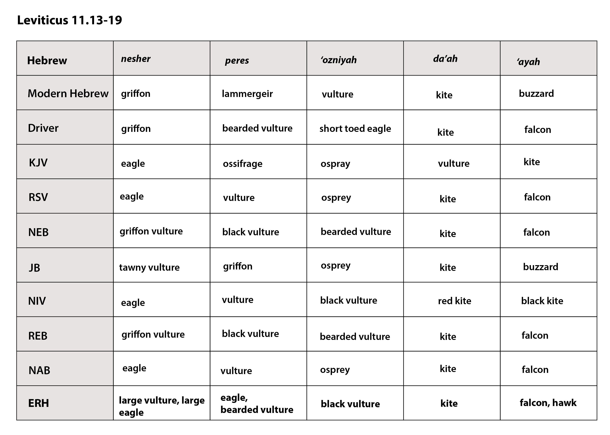
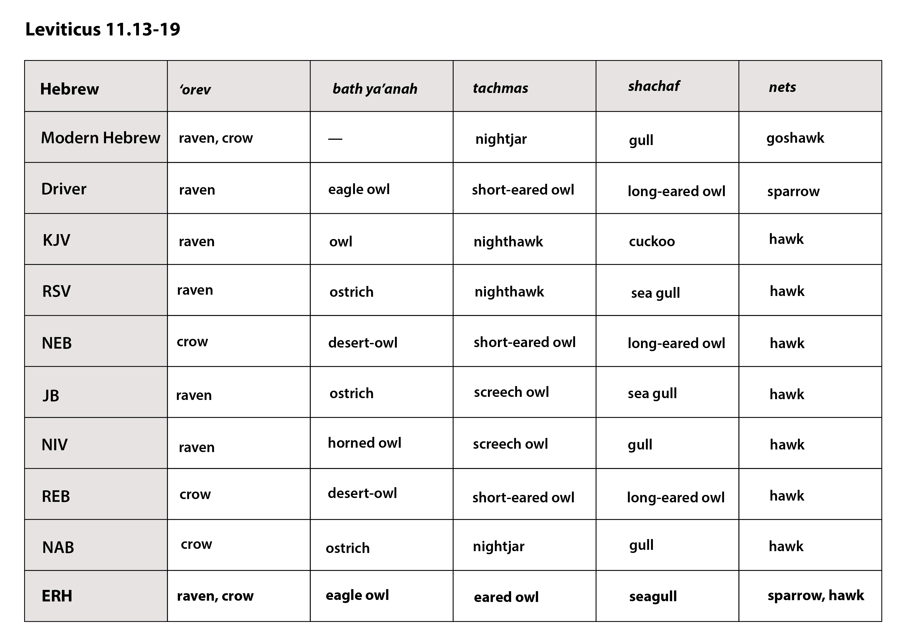
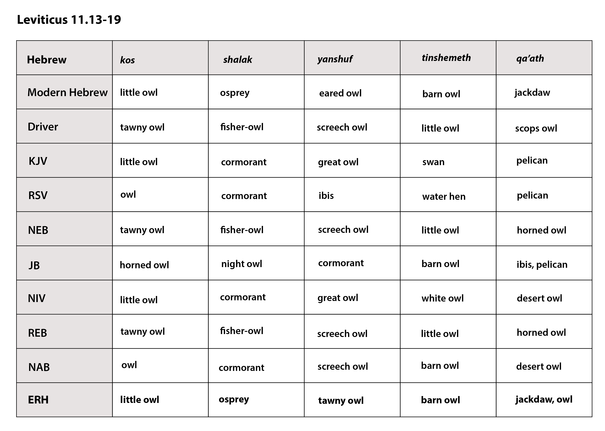
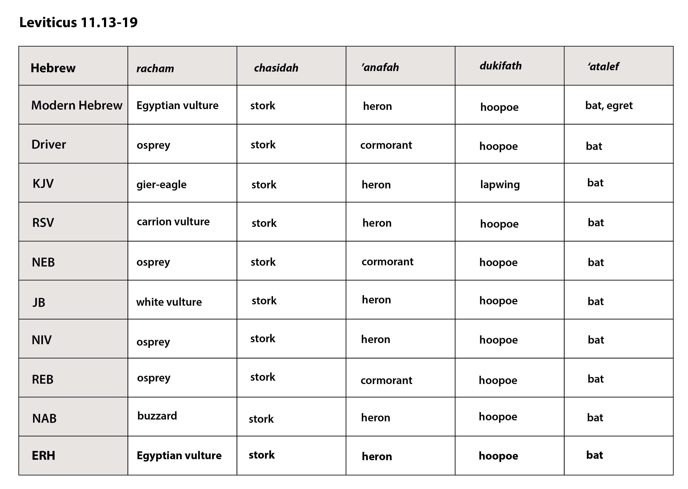
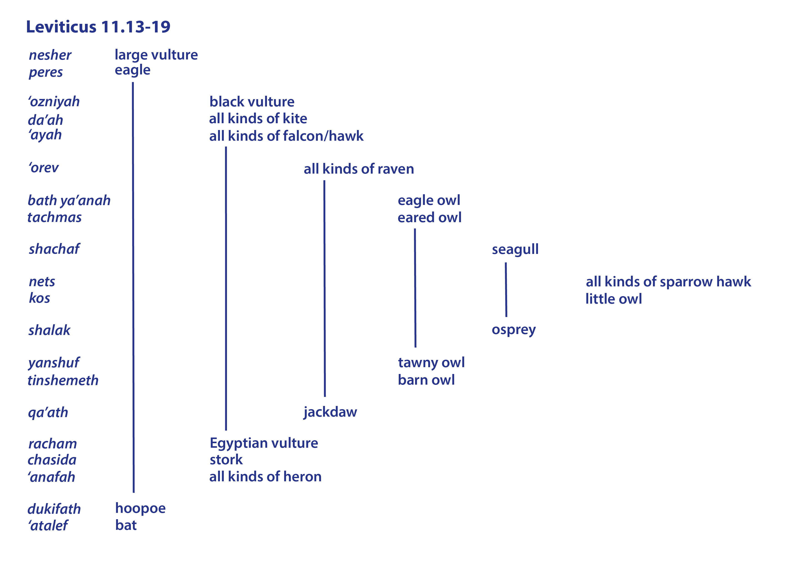
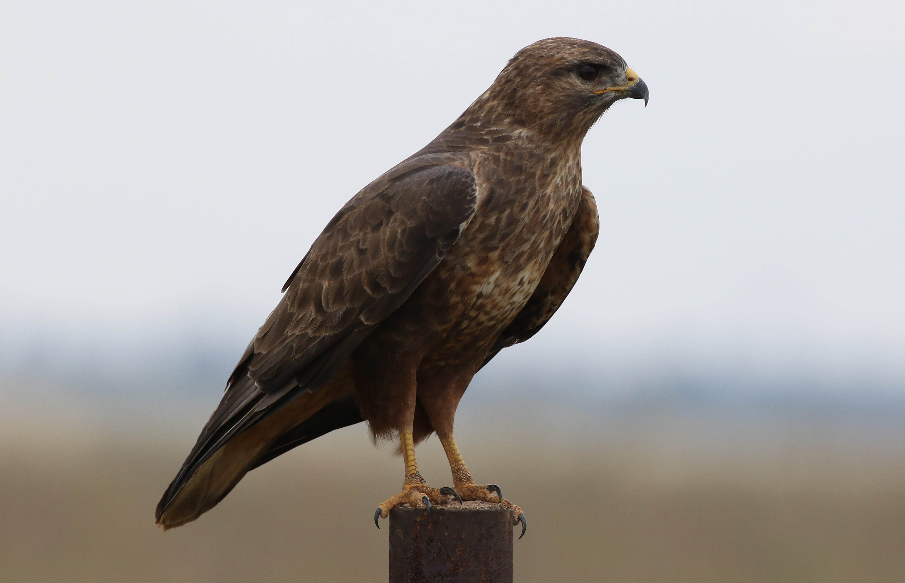
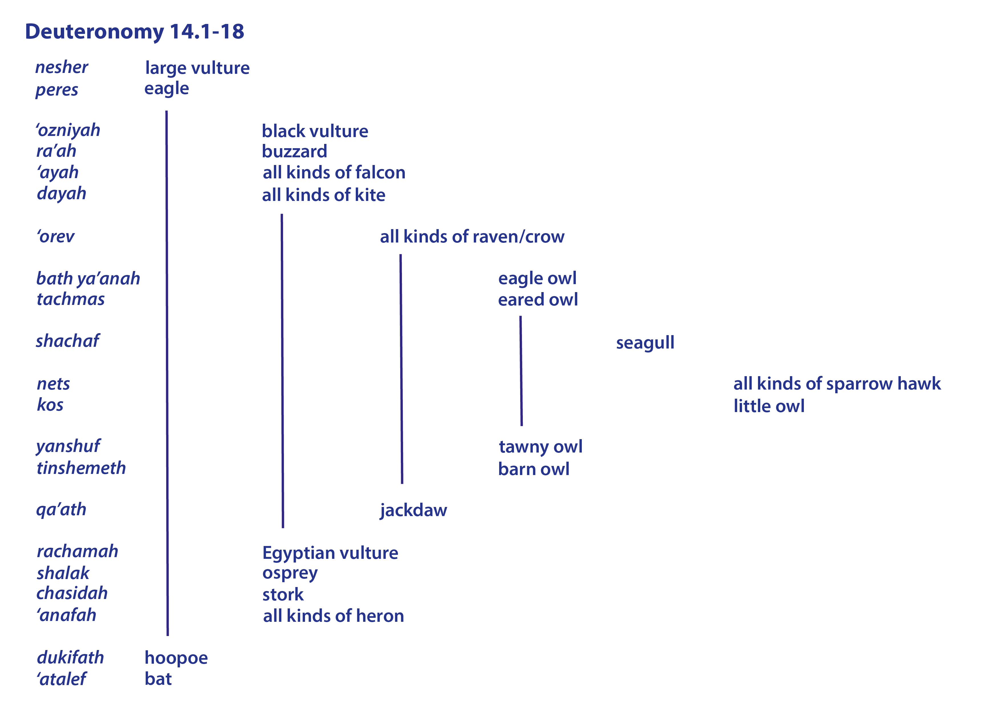

# Animals in the Bible

## License Information

Animals in the Bible © United Bible Societies, 2025. Adapted from: <cite>All Creatures Great and Small: Living Things in the Bible</cite>, by Edward R. Hope © 2005 United Bible Societies. This work is licensed under Creative Commons Attribution-ShareAlike 4.0 International (<a href="https://creativecommons.org/licenses/by-sa/4.0/">https://creativecommons.org/licenses/by-sa/4.0/</a>).

--------------------------------

## Birds, clean and unclean (id: FAUNA:3.2)

3\.2 Birds, clean and unclean
=============================

The basic principle in classifying animals and birds as clean or unclean was that if they ate unclean food they were themselves unclean. In cases of doubt about what they ate, they were also unclean. Thus a bird was unclean if it ate blood or meat with blood in it, garbage, unclean water creatures, or unclean insects. In addition, any bird that was associated with Egyptian or Canaanite gods, or that seemed somehow “unnatural” was also unclean.

Thus in the list of unclean birds we would expect to find eagles, vultures, and all other birds of prey such as buzzards, falcons, and hawks, scavengers like crows, kites, and seagulls, owls, storks, herons, and kingfishers, especially those that eat frogs, lizards, and snakes. Since the ibis was associated with Egyptian deities and eats worms and tadpoles, we would expect it too to be classified as unclean. Owls would be doubly unclean since they too were associated with an Egyptian god. Furthermore, knowing that ancient Israelites believed that bats, although classified as birds, were the unnatural offspring of a bird and a rat, we could expect bats also to be unclean.

However, we would not expect seed\-eating or vegetarian birds to be considered unclean unless they were associated with heathen gods.

Unfortunately, in the biblical lists, there are many Hebrew words that are of very debatable meaning. Apart from a few, we are dealing only with probable rather than certain meanings. The following charts compare the lists in the various versions, omitting the TEV (Today's English Version (Good News Bible)) which summarizes the twenty Hebrew words with fifteen in English. The first line in each chart gives the meaning of the word in modern Hebrew. The last line in each chart (ERH) represents the author’s own suggestion, based on a comparison of the English versions, ornithological checklists, commentaries, and other literature that discusses the linguistic derivation of the bird names. The merits of each suggestion are discussed in detail in the sections relating to the individual birds in the author’s suggested list.

In making decisions about the identity of these birds, one important factor that has been a guide is the organization of the list. The lists were obviously given to be memorized, and it is likely that they were arranged in a way that would help memorization. G. R. Driver used a similar method in his studies of these lists and was guided by what he believed was a descending order of size, so that bigger birds were mentioned before smaller ones within each general family. He decided that the three parts of the list were made up of fifteen land birds, three water birds, and two miscellaneous birds. Thus when facing a choice, he would opt for a bird smaller than the previous birds in that section of the list. However, the results of his method are sometimes very debatable, particularly as they presuppose that rather small differences between different types of owl would have been common knowledge.

The list suggested below is equally plausible in terms of the ornithology of the area, and it automatically results in a well organized list with a structure of a type found frequently in Hebrew literature, known as an “envelope."

Charts demonstrating the structures are given below the lists, and a discussion follows the charts.

---

**Leviticus 11\.13–19**

| Hebrew | *nesher* | *peres* | *‘ozniyah* | *da’ah* | *’ayah* |
| --- | --- | --- | --- | --- | --- |
| Modern Hebrew | griffon | lammergeir | vulture | kite | buzzard |
| Driver | griffon | bearded vulture | short toed eagle | kite | falcon |
| KJV (King James Version (1611)) | eagle | ossifrage | osprey | vulture | kite |
| RSV (Revised Standard Version (1952)) | eagle | vulture | osprey | kite | falcon |
| NEB (New English Bible (1970)) | griffon vulture | black vulture | bearded vulture | kite | falcon |
| JB (Jerusalem Bible (1966)) | tawny vulture | griffon | osprey | kite | buzzard |
| NIV (New International Version (1984)) | eagle | vulture | black vulture | red kite | black kite |
| REB (Revised English Bible (1989)) | griffon vulture | black vulture | bearded vulture | kite | falcon |
| NAB (New American Bible (1970)) | eagle | vulture | black vulture | bearded vulture | kite | falcon |
| ERH (Edward R. Hope (Animals in the Bible)) | **large vulture, large eagle** | **eagle, bearded vulture** | **black vulture** | **kite** | **falcon, hawk** |

---

| Hebrew | *‘orev* | *bath ya‘anah* | *tachmas* | *shachaf* | *’nets* |
| --- | --- | --- | --- | --- | --- |
| Modern Hebrew | raven, crow | —— | nightjar | gull | goshawk |
| Driver | raven | eagle owl | short\-eared owl | long\-eared owl | sparrow hawk |
| KJV (King James Version (1611)) | raven | owl | nighthawk | cuckoo | hawk |
| RSV (Revised Standard Version (1952)) | raven | ostrich | nighthawk | sea gull | hawk |
| NEB (New English Bible (1970)) | crow | desert\-owl | short\-eared owl | long\-eared owl | hawk |
| JB (Jerusalem Bible (1966)) | raven | ostrich | screech owl | sea gull | hawk |
| NIV (New International Version (1984)) | raven | horned owl | screech owl | gull | hawk |
| REB (Revised English Bible (1989)) | crow | desert\-owl | short\-eared owl | long\-eared owl | hawk |
| NAB (New American Bible (1970)) | crow | ostrich | nightjar | gull | hawk |
| ERH (Edward R. Hope (Animals in the Bible)) | **raven, crow** | **eagle owl** | **eared owle** | **seagull** | **sparrow, hawk** |

---

| Hebrew | *kos* | *shalak* | *‘anshuf* | *tinshemeth* | *qa’ath* |
| --- | --- | --- | --- | --- | --- |
| Modern Hebrew | little owl | osprey | eared owl | barn owl | jackdaw |
| Driver | tawny owl | fisher owl | screech owl | little owl | scops owl |
| KJV (King James Version (1611)) | little owl | cormorant | great owl | swan | pelican |
| RSV (Revised Standard Version (1952)) | owl | cormorant | ibis | water hen | pelican |
| NEB (New English Bible (1970)) | tawny owl | fisher\-owl | screech owl | little owl | horned owl |
| JB (Jerusalem Bible (1966)) | horned owl | night owl | cormorant | barn owl | ibis, pelican |
| NIV (New International Version (1984)) | little owl | cormorant | great owl | white owl | desert owl |
| REB (Revised English Bible (1989)) | tawny owl | fisher\-owl | screech owl | little owl | horned owl |
| NAB (New American Bible (1970)) | owl | cormorant | screech owl | barn owl | desert owl |
| ERH (Edward R. Hope (Animals in the Bible)) | **little owl** | **osprey** | **tawny owl** | **barn owl** | **jackdaw, owl** |

---

| Hebrew | *racham* | *chasidah* | *’anafah* | *dukifath* | *‘atalef* |
| --- | --- | --- | --- | --- | --- |
| Modern Hebrew | Egyptian vulture | stork | heron | hoopoe | bat, egret |
| Driver | osprey | stork | cormorant | hoopoe | bat |
| KJV (King James Version (1611)) | gier\-eagle | stork | heron | lapwing | bat |
| RSV (Revised Standard Version (1952)) | carrion vulture | stork | heron | hoopoe | bat |
| NEB (New English Bible (1970)) | osprey | stork | cormorant | hoopoe | bat |
| JB (Jerusalem Bible (1966)) | white vulture | stork | heron | hoopoe | bat |
| NIV (New International Version (1984)) | osprey | stork | heron | hoopoe | bat |
| REB (Revised English Bible (1989)) | osprey | stork | cormorant | hoopoe | bat |
| NAB (New American Bible (1970)) | buzzrad | stork | heron | hoopoe | bat |
| ERH (Edward R. Hope (Animals in the Bible)) | **Egyptian vulture** | **stork** | **heron** | **hoopoe** | **bat** |

---

As mentioned above, the list we are suggesting has the “envelope” arrangement that is so common in Hebrew texts, probably as an aid to memorization. In an envelope structure, the ideas are introduced in a sequence up to a midpoint, and then similar ideas are introduced in reverse order. At each point, there is some similarity between the corresponding items on both sides of the midpoint. The following charts show the structures:

Each name in the list probably refers to a particular bird as representing a group of similar birds. The list begins with the two largest birds of prey, vultures and eagles. Then follows a group of three birds of prey, each of which is smaller than the previous bird on the list—the smaller bearded vulture, the kite, and all kinds of falcon or hawk. Then comes all kinds of raven or crow in a group on its own, marking a transition in the list from the birds of prey to owls.

The next group consists of two owls, with the largest owl of all, the eagle owl first, followed by the slightly smaller eared owl. Then follows the seagull, in a group on its own, marking a transition to the midpoint.

The midpoint is formed by a group of two, all kinds of (sparrow) hawk and the little owl. These represent the smallest birds of prey and the smallest owls.

Then comes the osprey on its own, paired with the seagull in the envelope structure of the list, marking a transition back to a group of two more owls, the tawny owl and the barn owl. This group corresponds to the previous group of two owls. This time, however, the smaller is mentioned first, as one would expect on this side of the midpoint.

Then comes the jackdaw (or pelican or some other owl) on its own, corresponding to the crow on its own. If the modern Hebrew *qa’ak* (jackdaw) is accepted as the equivalent of the biblical *qa’at*, (since the name is representative of the sound the bird makes, this is a strong argument), rather than “pelican” or “owl,” the correspondence to “crow” is even more marked. This pairing is also seen in [ISA 34:11](https://ref.ly/Isa34:11) and [ZEP 2:14](https://ref.ly/Zeph2:14). The “jackdaw” marks a transition to waterside birds, just as the crow also marked a transition.

The waterside birds are in a group of three, corresponding to the three birds of prey mentioned above. Again, the smallest is mentioned first. While the Egyptian vulture is a bird of prey, it can be found scavenging on beaches, eating eggs of many of the waterside birds. It has a beak that resembles the beaks of many large seabirds, such as the albatross, shearwater, skua, and booby. Its posture when standing is also very similar to a gull’s, and from a distance it looks just like a large gull. It possibly represents all black\-and\-white waterside birds, since *racham* seems to be derived from a root meaning “black and white."

All kinds of heron probably represents all large waterside birds with big beaks, including the ibis and the cormorant, since the word *’anafah* seems to be derived from a root meaning “nose."

The final group of two is a miscellaneous group consisting of the hoopoe and the bat, which is classified here as a bird.

The inclusion of the ostrich in the list in some versions is highly unlikely, since ostriches are vegetarian and classified as clean. Their disappearance from Palestine is directly attributable to the fact that they were hunted and trapped for food.

*Steppe buzzard (Wikimedia Commons) (© Derek Keats)*

[DEU 14:11–DEU 14:18](https://ref.ly/Deut14:11-Deut14:18): This list in the Hebrew Bible is basically the same as the list in Leviticus, with the addition of one extra bird called *ra’ah* and two slightly different spellings (*da’ah* becomes *dayah*, and *racham* becomes *rachamah*). This addition is treated as a scribal error in NEB (New English Bible (1970)), JB (Jerusalem Bible (1966)), NAB (New American Bible (1970)), and REB (Revised English Bible (1989)), since in Hebrew *ra’ah* and *da’ah* look so much alike that it would be easy to read one for the other. KJV (King James Version (1611)) translates ra’ah as “glede,” RSV (Revised Standard Version (1952)) as “buzzard,” and NIV (New International Version (1984)) as “falcon."

In the Hebrew text the list in Deuteronomy has a different arrangement from the list in Leviticus; the reason for the difference seems to be the additional bird. It is here located in the first group of medium\-sized birds of prey, increasing the number of birds in the group from three to four. This group of four is matched by four birds in the corresponding group of waterside birds. The word for osprey *shalak* is here located within the group of waterside birds. The pattern of the list, however, is not as symmetrical as the Leviticus list, since there is now no word balancing the word for seagull. Finally, the order of the words for kite and falcon is reversed, as can be seen from the following chart:

If we accept the majority opinion that *ra’ah* is a scribal error, and thus omit it from the list, then it would seem to be best also to return the list to its original structure as found in Leviticus, as is done in some major translations. If we keep *ra’ah*, then we can only guess at the meaning of the word from its position in the list, and “buzzard” would seem to be a reasonable guess.

Translation:
------------

In parts of the world where there are local equivalents for most of the birds on the list, as in many parts of Africa, it is recommended that the translators try to find an equivalent for each of the birds. Elsewhere it is better to try and find more general expressions that would include all of the birds on the list. This is what has been attempted in the TEV (Today's English Version (Good News Bible)). Thus a general list such as the following would be acceptable where there are insufficient equivalents:

"All kinds of large and small vultures, eagles, hawks, kites, and crows; all kinds of large and small owls; all kinds of large and small herons; all other kinds of bird which eat unclean things; and all bats."

* **Associated Passages:** Isaiah 34:11; Zephaniah 2:14; Deuteronomy 14:11; Deuteronomy 14:18

