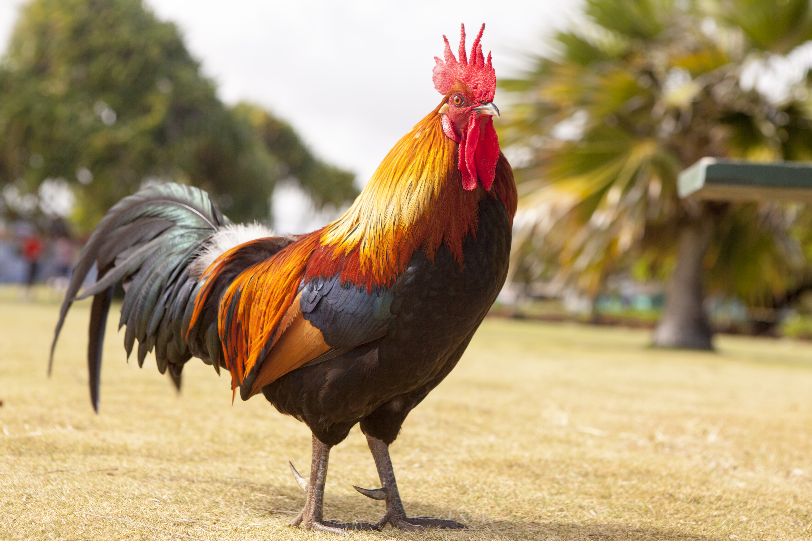

# Animals in the Bible

## License Information

Animals in the Bible © United Bible Societies, 2025. Adapted from: <cite>All Creatures Great and Small: Living Things in the Bible</cite>, by Edward R. Hope © 2005 United Bible Societies. This work is licensed under Creative Commons Attribution-ShareAlike 4.0 International (<a href="https://creativecommons.org/licenses/by-sa/4.0/">https://creativecommons.org/licenses/by-sa/4.0/</a>).

--------------------------------

## Chicken, rooster, hen (id: FAUNA:3.3)

3\.3 Chicken, rooster, hen
==========================

References:
-----------

Hebrew זַרְזִיר (zarzir)

[PRO 30:31](https://ref.ly/Prov30:31)

Hebrew שֶׂכְוִי (sekwi)

[JOB 38:36](https://ref.ly/Job38:36)

Greek ἀλεκτρυών (alektruōn)

[3MA 5:23](https://ref.ly/3Macc5:23)

Greek ἀλέκτωρ (alektōr)

[MAT 26:34](https://ref.ly/Matt26:34), [MAT 26:74](https://ref.ly/Matt26:74), [MAT 26:75](https://ref.ly/Matt26:75), [MRK 14:30](https://ref.ly/Mark14:30), [MRK 14:68](https://ref.ly/Mark14:68), [MRK 14:72](https://ref.ly/Mark14:72), [MRK 14:72](https://ref.ly/Mark14:72), [LUK 22:34](https://ref.ly/Luke22:34), [LUK 22:60](https://ref.ly/Luke22:60), [LUK 22:61](https://ref.ly/Luke22:61), [JHN 13:38](https://ref.ly/John13:38), [JHN 18:27](https://ref.ly/John18:27)

Greek νοσσίον, νοσσιά (nossion, nossia)

[MAT 23:37](https://ref.ly/Matt23:37), [LUK 13:34](https://ref.ly/Luke13:34)

Greek ὄρνις (ornis)

[MAT 23:37](https://ref.ly/Matt23:37), [LUK 13:34](https://ref.ly/Luke13:34)

Latin gallina

[2ES 1:30](https://ref.ly/2Esd1:30)

Discussion:
-----------

There is considerable doubt about the meaning of the word *sekwi*. However, the rendering “cock” or “rooster” has support from the Vulgate and one of the Targums, as well as the majority of commentaries. In the context of [JOB 38:36](https://ref.ly/Job38:36) the reference seems to be to the way in which the ibis is able to announce the flooding of the Nile, and the rooster is able to announce the coming of the dawn (compare JB (Jerusalem Bible (1966)) and TEV (Today's English Version (Good News Bible))). Both of these abilities are mentioned quite often in Egyptian literature.

The word *zarzir* is probably related to a word meaning “narrow waisted,” but most commentaries and translations interpret this as a reference to the rooster.

The Greek word *ornis* and the Latin word *gallina* mean “hen,” and the Greek words *nossia* and *nossion* mean “chick,” that is, a baby fowl.

All modern domestic fowls are descended from the jungle fowl of India, Southeast Asia, and China. These were domesticated very early in the history of that region, almost as soon as the farming of rice and other grains began. According to the Talmud, it was forbidden to keep domestic poultry in Jerusalem, but there is evidence from ancient Hebrew seals that chickens were known in the land as early as 600 B.C. The reference to the cock crowing on the night of the crucifixion would indicate that chickens were kept near, if not in, Jerusalem.

Description:
------------

*Rooster (Pixabay)*

Ancient domestic fowls would still have looked very much like the Jungle Fowl *Gallus gallus* from which they were descended. Jungle fowl roosters are dark, brownish red, with orange\-red neck hackles, a smallish red comb on the top of their heads, and red lappets on each side under the beak. They have a white spot on their backs near the base of their long glossy black and green tails. The hens are a lighter brownish red, have no white spot or long tail, and have a smaller comb on their heads. See also [3\.9 Goose](#FAUNA:3.9).

Special significance or symbolism:
----------------------------------

Domestic fowl had connotations of fertility to the Egyptians and Persians. This seems to have been adopted later in Judaism, since it became the practice to carry a cock and a hen in front of the bride and groom at a wedding. However, their significance in the Bible seems related to the fact that cocks crow very early in the morning, thus announcing the coming dawn before humans are aware of it.

Translation:
------------

Domestic fowl have now spread around the world and are well\-known, apart from some areas of the tundra region.

The words *sekwi*, *zarzir*, *alektruōn*, and *alektōr* are probably best translated as “rooster,” *ornis* (in the passages listed above, but not elsewhere) as “hen,” and *nossion* and *nossia* as “chickens.” In some languages where roosters and hens are not normally differentiated, it may not be necessary to do so in the gospel passages, since the verb “crow” will usually be sufficient context to make the meaning clear. However, in the Job and Proverbs passages it may still be necessary in some languages to say something like “male chicken."

* **Associated Passages:** Proverbs 30:31; Job 38:36; 3 Maccabees 5:23; Matthew 26:34; Matthew 26:74; Matthew 26:75; Mark 14:30; Mark 14:68; Mark 14:72; Luke 22:34; Luke 22:60; Luke 22:61; John 13:38; John 18:27; Matthew 23:37; Luke 13:34; 2 Esdras (Latin) 1:30

