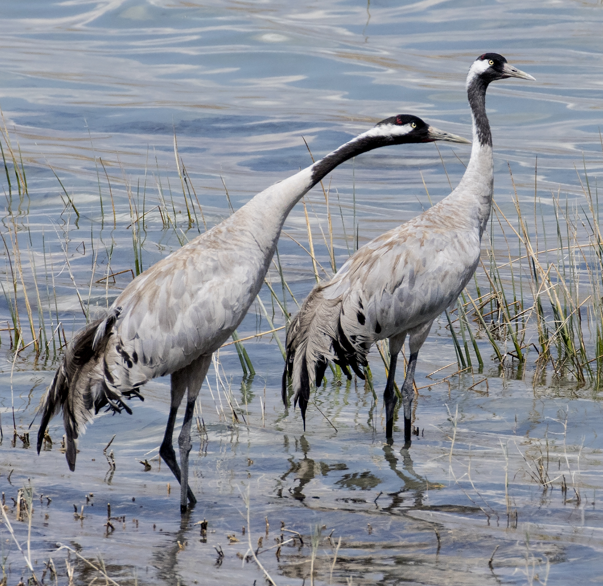

# Animals in the Bible

## License Information

Animals in the Bible © United Bible Societies, 2025. Adapted from: <cite>All Creatures Great and Small: Living Things in the Bible</cite>, by Edward R. Hope © 2005 United Bible Societies. This work is licensed under Creative Commons Attribution-ShareAlike 4.0 International (<a href="https://creativecommons.org/licenses/by-sa/4.0/">https://creativecommons.org/licenses/by-sa/4.0/</a>).

--------------------------------

## Crane (id: FAUNA:3.5)

3\.5 Crane
==========

References:
-----------

Hebrew עָגוּר (‘agur)

[ISA 38:14](https://ref.ly/Isa38:14), [JER 8:7](https://ref.ly/Jer8:7)

Discussion:
-----------

*Cranes (© Zeynel Cebeci (Wikimedia Commons))*

The occurrence of this word in [ISA 38:14](https://ref.ly/Isa38:14) is problematic, where it appears in the phrase *sus ‘agur*, which looks like a head noun followed by a qualifying noun, so it is the name of a single bird (a type of swift) rather than of two. The phrase is thus translated as “swallow” by NEB (New English Bible (1970)), JB (Jerusalem Bible (1966)), REB (Revised English Bible (1989)), and NAB (New American Bible (1970)), but as two birds by KJV (King James Version (1611)), RSV (Revised Standard Version (1952)), and NIV (New International Version (1984)). (The KJV (King James Version (1611)) translators seem to have reversed the order of the two birds, giving “crane or a swallow".) In [JER 8:7](https://ref.ly/Jer8:7), however, all versions treat the word as a common noun, although interpreting it differently.

The interpretation in Jeremiah of *‘agur* as “crane” has quite good support. For one thing the crane is one of the most obvious of the migrating birds passing over Israel, and thousands can be seen passing noisily overhead each year as they move from Europe and Asia to Africa for the summer and return again in March. They stay in Israel only for a few days and then move on. Second, the translation “crane” neatly preserves the structure and the images of the Hebrew poem. The structure here is what is referred to as a chiasmus. In this chiasmus four items are mentioned, with the first and last forming one pair and the middle two forming another: stork, dove, swift, crane. This is a common feature of Hebrew poetry. Here “stork” and “crane” are paired, and since both are passing migrants and both have long necks and legs and are about the same size, the pairing is well motivated. Third, but perhaps less important, *‘agur* is the modern Hebrew word for crane. Some Hebrew scholars relate the word to the verb *ga‘ar*, “to cry", a reference to the noisy call of the crane.

The translations “thrush” (NIV (New International Version (1984)), TEV (Today's English Version (Good News Bible))) and “wryneck” (NEB (New English Bible (1970)), REB (Revised English Bible (1989))) result in a very poor poetic structure for the verse. Furthermore, while both of these small birds are migrants, their arrival in Israel is hardly noticeable, since they arrive in ones and twos and not in flocks. The wryneck is a passing migrant that stays only a short time in Israel. Even though some have argued that the song of the song thrush would be sufficient to announce its arrival, it should be borne in mind that this thrush sings mostly in spring, but it arrives in Israel at the end of autumn.

Description:
------------

Cranes are large long\-legged, long\-necked birds, which are best known for their dancing displays. At breeding time especially, but at other times too, a small group of cranes will start “dancing” together, bobbing up and down, jumping into the air, and turning around. The crane mentioned in [JER 8:7](https://ref.ly/Jer8:7) is most likely the Eurasian or Common Crane *Grus grus*. This is a large gray bird with a trace of red on the top of its head, and whitish cheeks. It has a wingspan of over two meters (6 feet), a long neck, and long bare legs. It behaves very much like a stork, spending most of its time walking on the ground in search of frogs, lizards, grasshoppers, and other insects.

The Song Thrush *Turdus philomelos* is a light brown bird with a speckled chest. Like most other thrushes, it spends a lot of time on the ground searching for insects and ants. It is solitary or lives in pairs. It has a very beautiful, complicated song made up of a combination of clear whistling notes, trilled notes, and chirps. It lives in wooded areas.

The Wryneck *Jinx torquilla* is a bird similar in appearance to a small woodpecker. It has a mottled coloring with a reddish chest. It feeds on ants and spends most of its time searching for them on the ground or on the branches and trunks of trees. It lives in woods and orchards.

Special significance or symbolism:
----------------------------------

It is one of the birds noted in the Bible for its migrating habits.

Translation:
------------

It is better to translate *sus ‘agur* in [ISA 38:14](https://ref.ly/Isa38:14) as one bird only, namely the swift. See [3\.23 Swallow, swift](#FAUNA:3.23).

Cranes are found worldwide except in South America, New Zealand, and small island localities. In most parts of the world then, it will not be difficult to find a word for one of the local cranes. However, in most parts of the world the local cranes are not migrating birds, but permanently resident. In these cases it may be good to have a footnote indicating that in Israel cranes migrate in large numbers over the land in spring and autumn, moving from Europe and Asia to Africa and back again. Alternatively, in places where two types of migrating stork are known, as in many parts of central, eastern, and southern Africa, the name of one type can be used to translate *‘agur* in [JER 8:7](https://ref.ly/Jer8:7).

African cranes include the Blue Crane *Anthropoides paradisea*, the Wattled Crane *Grus carunculata*, and the Crested Crane (also called the Crowned Crane) *Balearica regulorum*. Australian cranes include the Brolga *Grus rubicunda* and the Sarus Crane *Grus antigone*.

Among the Asian cranes is the red\-headed Siberian crane, which nests in Siberia and migrates to Iran, Pakistan, India, and China.

In Egypt, Sudan, Ethiopia, and southeastern Europe, it should be possible to find a local word for the Common Crane *Grus grus.*

Elsewhere the best solution is a word for crane borrowed from English, Spanish, or Portuguese, or a transliteration of the scientific name *Grus*.

Thrushes too are found worldwide, except in New Zealand and Oceania. It should not be difficult to find a local equivalent if the interpretation *thrush* is followed. Elsewhere a borrowed word or transliteration can be used.

The translation of “wryneck” is more problematic. There are only two species of wryneck, one found in southeastern Europe which migrates to Egypt and one found in some parts of western, eastern, and southern Africa. It is not a very common bird. The translation “crane” would be preferable from a translational as well as an exegetical point of view.

* **Associated Passages:** Isaiah 38:14; Jeremiah 8:7

