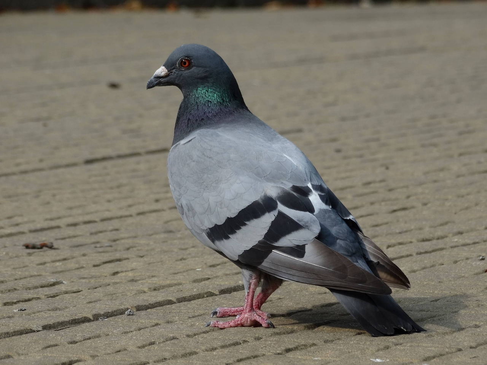

# Animals in the Bible

## License Information

Animals in the Bible © United Bible Societies, 2025. Adapted from: <cite>All Creatures Great and Small: Living Things in the Bible</cite>, by Edward R. Hope © 2005 United Bible Societies. This work is licensed under Creative Commons Attribution-ShareAlike 4.0 International (<a href="https://creativecommons.org/licenses/by-sa/4.0/">https://creativecommons.org/licenses/by-sa/4.0/</a>).

--------------------------------

## Dove, pigeon (id: FAUNA:3.7)

3\.7 Dove, pigeon
=================

References:
-----------

Hebrew יוֹנָה (yonah)

[GEN 8:8](https://ref.ly/Gen8:8), [GEN 8:9](https://ref.ly/Gen8:9), [GEN 8:10](https://ref.ly/Gen8:10), [GEN 8:11](https://ref.ly/Gen8:11), [GEN 8:12](https://ref.ly/Gen8:12), [LEV 1:14](https://ref.ly/Lev1:14), [LEV 5:7](https://ref.ly/Lev5:7), [LEV 5:11](https://ref.ly/Lev5:11), [LEV 12:6](https://ref.ly/Lev12:6), [LEV 12:8](https://ref.ly/Lev12:8), [LEV 14:22](https://ref.ly/Lev14:22), [LEV 14:30](https://ref.ly/Lev14:30), [LEV 15:14](https://ref.ly/Lev15:14), [LEV 15:29](https://ref.ly/Lev15:29), [NUM 6:10](https://ref.ly/Num6:10), [2KI 6:25](https://ref.ly/2Kgs6:25), [PSA 55:7](https://ref.ly/Ps55:7), [PSA 56:1](https://ref.ly/Ps56:1), [PSA 68:14](https://ref.ly/Ps68:14), [SNG 1:15](https://ref.ly/Song1:15), [SNG 2:14](https://ref.ly/Song2:14), [SNG 4:1](https://ref.ly/Song4:1), [SNG 5:2](https://ref.ly/Song5:2), [SNG 5:12](https://ref.ly/Song5:12), [SNG 6:9](https://ref.ly/Song6:9), [ISA 38:14](https://ref.ly/Isa38:14), [ISA 59:11](https://ref.ly/Isa59:11), [ISA 60:8](https://ref.ly/Isa60:8), [JER 48:28](https://ref.ly/Jer48:28), [EZK 7:16](https://ref.ly/Ezek7:16), [HOS 7:11](https://ref.ly/Hos7:11), [HOS 11:11](https://ref.ly/Hos11:11), [NAM 2:8](https://ref.ly/Nah2:8)

Hebrew תּוֹר (tor)

[GEN 15:9](https://ref.ly/Gen15:9), [LEV 1:14](https://ref.ly/Lev1:14), [LEV 5:7](https://ref.ly/Lev5:7), [LEV 5:11](https://ref.ly/Lev5:11), [LEV 12:6](https://ref.ly/Lev12:6), [LEV 12:8](https://ref.ly/Lev12:8), [LEV 14:22](https://ref.ly/Lev14:22), [LEV 14:30](https://ref.ly/Lev14:30), [LEV 15:14](https://ref.ly/Lev15:14), [LEV 15:29](https://ref.ly/Lev15:29), [NUM 6:10](https://ref.ly/Num6:10), [PSA 74:19](https://ref.ly/Ps74:19), [SNG 2:12](https://ref.ly/Song2:12), [JER 8:7](https://ref.ly/Jer8:7)

Greek περιστερά (peristera)

[MAT 3:16](https://ref.ly/Matt3:16), [MAT 10:16](https://ref.ly/Matt10:16), [MAT 21:12](https://ref.ly/Matt21:12), [MRK 1:10](https://ref.ly/Mark1:10), [MRK 11:15](https://ref.ly/Mark11:15), [LUK 2:24](https://ref.ly/Luke2:24), [LUK 3:22](https://ref.ly/Luke3:22), [JHN 1:32](https://ref.ly/John1:32), [JHN 2:14](https://ref.ly/John2:14), [JHN 2:16](https://ref.ly/John2:16)

Greek τρυγών (trugōn)

[LUK 2:24](https://ref.ly/Luke2:24)

Latin columba

[2ES 2:15](https://ref.ly/2Esd2:15), [2ES 5:26](https://ref.ly/2Esd5:26)

Discussion:
-----------

In the fifteenth century the English word “pigeon” meant a young dove, the word “dove” being reserved for the adult birds. In modern English the words are used almost interchangeably. As a general rule, “pigeon” is used for domesticated forms of these birds, and for the larger variety of wild forms, while “dove” is used mainly for wild varieties. However, there are many exceptions to this general rule. For instance, shelters built for domestic pigeons are called “dovecotes", and pies made from wild doves are called “pigeon pies".

Pigeons and doves are both included in a bird family known scientifically as the *Colombidae*, consisting of well over two hundred species. In Israel and the Middle East are found the true *Colombidae*, which are easily distinguished from the genus *Stretopelia*, that is, the turtle doves.

The most common of the true *Colombidae* in the Middle East is most certainly the Asiatic Rock Dove *Columba livia*. This bird was first domesticated around 4500 B.C. in Mesopotamia. By 2500 B.C. it was kept as a domestic bird in Egypt, and by 1200 B.C. there is evidence that its homing abilities were already well known. It is this bird that is the ancestor of the domestic homing pigeons that people keep, some of which have escaped, returned to the wild, and now populate city streets all over the world. The ledges of modern buildings are a good substitute for the rock ledges that were its original nesting sites. It is likely that the Canaanites and the Israelites also kept these birds for both food and sacrifice. It is this bird that is called *yonah* in the Hebrew Bible and peristera in the Greek New Testament.

There are also three types of turtledove found in the land of Israel, two of which are resident species; the third is a migrant that arrives in spring and spends the summer in Israel. This migrant, the true Turtle Dove *Streptopelia turtur*, and one of the species now resident, the Collared Dove *Streptopelia decaocto*, are what the Bible writers called *tor* in Hebrew and *trugōn* in Greek. (Both the Hebrew and Greek names are based on the sound the turtledove makes.)

In biblical Hebrew the word *gozal* generally refers to a nestling of any bird species. In [GEN 15:9](https://ref.ly/Gen15:9) it obviously refers specifically to a young pigeon. Nestling rock pigeons were collected from the rock ledges. Pigeons and doves were kept in cages and dovecotes, and wild ones were trapped in nets. This enabled the Jews to have a handy stock of birds for sacrificial purposes.

Description:
------------

The rock pigeon is a blue\-gray color with a pinkish sheen to the neck feathers. It has a black tip on its tail. Its call is a repeated moaning *oom* (the Hebrew name *yonah* is related to a verb meaning “to moan") or a rapid cooing *coo\-ROO\-coo\-coo*, usually repeated two or three times. The call is uttered with the beak closed, into the chest. The male’s sexual display starts with flying wing claps, and then when it lands next to the female, it begins bowing and turning with chest puffed and tail spread.

This type of pigeon lives in large colonies, and when a group is in flight, they maneuver as a single unit, often gliding short distances together with their wings held in a V shape.

The turtledove is a smaller blue\-gray bird with a pinkish chest. It arrives in Israel in April, and its rhythmic call *yoo\-ROO\-coo, yoo\-ROO\-coo, yoo\-ROO\-coo*, repeated for two or three minutes at a time on sunny days, can be heard all over.

Doves are seed eaters, and this fact may be significant in the Flood narrative. The raven, a carrion eater, does not return to the ark, since food is available. The dove returns at first, and when it finally stays away, this is an indication that seeds of some sort are once again available to it, and the earth is again dry.

Special significance or symbolism:
----------------------------------

As seed\-eaters, doves and pigeons are ritually clean birds for Jews. Their swift flight means that they are symbolic of speed in some biblical contexts, especially in Psalms. The fact that these birds court, mate, and nest repeatedly throughout the year resulted in their being a symbol of affection, sexuality, and fertility in the ancient Egyptian, Canaanite, and Hebrew cultures. This symbolism is important in the Song of Solomon.

A very ancient belief that the dove has no bile and is therefore devoid of anger led to its becoming a symbol of peace and gentleness. (In actual fact doves and pigeons are aggressive, often attacking other birds, especially at food sources.)

The name *yonah* for the pigeon and dove is associated with moaning and groaning in pain or sorrow. This is often the symbolism in prophetic poetry.

Translation:
------------

Pigeons and doves are found worldwide, except in some snow\-bound regions and on some remote islands. Almost everywhere they live there is more than one species, and in almost all locations the domestic pigeon is one of these species. As a general rule, the word for the smaller wild dove should be used wherever possible, but in those contexts where both pigeons and doves are mentioned in connection with sacrifices, the word for the domestic pigeon can be used as well as the one for the wild dove.

In [2KI 6:25](https://ref.ly/2Kgs6:25) there is a Hebrew expression that literally means “dove’s dung". This seems to be a reference to some kind of food that is eaten only in emergencies. Suggestions about what this may refer to have varied from “chickpeas” (which do look somewhat like a dove’s droppings) to “locust\-beans” (NEB (New English Bible (1970)), REB (Revised English Bible (1989))), “wild onions” (JB (Jerusalem Bible (1966)), TEV (Today's English Version (Good News Bible)) footnote, NAB (New American Bible (1970))), and the roots of certain wild flowers. In view of the lack of certainty, it is probably best to translate it literally as “dove’s dung” and include the footnote, “This is probably some kind of wild food eaten only in emergencies."

* **Associated Passages:** Genesis 8:8; Genesis 8:9; Genesis 8:10; Genesis 8:11; Genesis 8:12; Leviticus 1:14; Leviticus 5:7; Leviticus 5:11; Leviticus 12:6; Leviticus 12:8; Leviticus 14:22; Leviticus 14:30; Leviticus 15:14; Leviticus 15:29; Numbers 6:10; 2 Kings 6:25; Psalms 55:7; Psalms 56:1; Psalms 68:14; Song of Songs 1:15; Song of Songs 2:14; Song of Songs 4:1; Song of Songs 5:2; Song of Songs 5:12; Song of Songs 6:9; Isaiah 38:14; Isaiah 59:11; Isaiah 60:8; Jeremiah 48:28; Ezekiel 7:16; Hosea 7:11; Hosea 11:11; Nahum 2:8; Genesis 15:9; Psalms 74:19; Song of Songs 2:12; Jeremiah 8:7; Matthew 3:16; Matthew 10:16; Matthew 21:12; Mark 1:10; Mark 11:15; Luke 2:24; Luke 3:22; John 1:32; John 2:14; John 2:16; 2 Esdras (Latin) 2:15; 2 Esdras (Latin) 5:26

