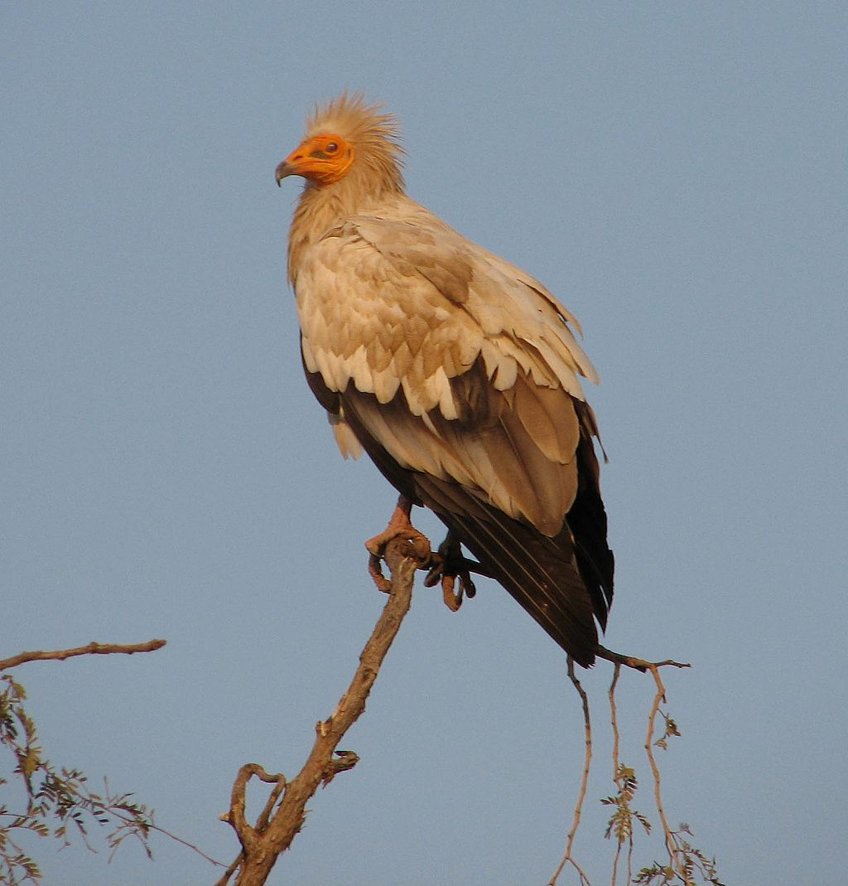

# Animals in the Bible

## License Information

Animals in the Bible © United Bible Societies, 2025. Adapted from: <cite>All Creatures Great and Small: Living Things in the Bible</cite>, by Edward R. Hope © 2005 United Bible Societies. This work is licensed under Creative Commons Attribution-ShareAlike 4.0 International (<a href="https://creativecommons.org/licenses/by-sa/4.0/">https://creativecommons.org/licenses/by-sa/4.0/</a>).

--------------------------------

## Eagle, vulture (id: FAUNA:3.8)

3\.8 Eagle, vulture
===================

References:
-----------

Hebrew נֶשֶׁר (nesher)

[EXO 19:4](https://ref.ly/Exod19:4), [LEV 11:13](https://ref.ly/Lev11:13), [DEU 14:12](https://ref.ly/Deut14:12), [DEU 28:49](https://ref.ly/Deut28:49), [DEU 32:11](https://ref.ly/Deut32:11), [2SA 1:23](https://ref.ly/2Sam1:23), [JOB 9:26](https://ref.ly/Job9:26), [JOB 39:27](https://ref.ly/Job39:27), [PSA 103:5](https://ref.ly/Ps103:5), [PRO 23:5](https://ref.ly/Prov23:5), [PRO 30:17](https://ref.ly/Prov30:17), [PRO 30:19](https://ref.ly/Prov30:19), [ISA 40:31](https://ref.ly/Isa40:31), [JER 4:13](https://ref.ly/Jer4:13), [JER 48:40](https://ref.ly/Jer48:40), [JER 49:16](https://ref.ly/Jer49:16), [JER 49:22](https://ref.ly/Jer49:22), [LAM 4:19](https://ref.ly/Lam4:19), [EZK 1:10](https://ref.ly/Ezek1:10), [EZK 10:14](https://ref.ly/Ezek10:14), [EZK 17:3](https://ref.ly/Ezek17:3), [EZK 17:7](https://ref.ly/Ezek17:7), [HOS 8:1](https://ref.ly/Hos8:1), [OBA 1:4](https://ref.ly/Obad1:4), [MIC 1:16](https://ref.ly/Mic1:16), [HAB 1:8](https://ref.ly/Hab1:8)

Hebrew עָזְנִיָּה (‘ozniyah)

[LEV 11:13](https://ref.ly/Lev11:13), [DEU 14:12](https://ref.ly/Deut14:12)

Hebrew עַיִט (‘ayit)

[GEN 15:11](https://ref.ly/Gen15:11), [JOB 28:7](https://ref.ly/Job28:7), [ISA 18:6](https://ref.ly/Isa18:6), [ISA 18:6](https://ref.ly/Isa18:6), [ISA 46:11](https://ref.ly/Isa46:11), [JER 12:9](https://ref.ly/Jer12:9), [JER 12:9](https://ref.ly/Jer12:9), [EZK 39:4](https://ref.ly/Ezek39:4)

Hebrew פֶּרֶס (peres)

[LEV 11:13](https://ref.ly/Lev11:13), [DEU 14:12](https://ref.ly/Deut14:12)

Hebrew רָחָם, רָחָמָה (racham, rachamah)

[LEV 11:18](https://ref.ly/Lev11:18), [DEU 14:17](https://ref.ly/Deut14:17)

Greek ἀετός (aetos)

[MAT 24:28](https://ref.ly/Matt24:28), [LUK 17:37](https://ref.ly/Luke17:37), [REV 4:7](https://ref.ly/Rev4:7), [REV 8:13](https://ref.ly/Rev8:13), [REV 12:14](https://ref.ly/Rev12:14)

Latin aquila

[2ES 11:1](https://ref.ly/2Esd11:1), [2ES 14:17](https://ref.ly/2Esd14:17)

Discussion:
-----------

Vultures and eagles were much more common in the ancient world than they are today. In fact since the end of World War II in 1945 the world’s population of vultures and eagles has been reduced by over sixty percent. This is due mainly to a) calcium deficiencies as a result of eating animals in which there were high concentrations of the insecticide DDT, b) eating poisoned rats, and c) the reduction in the amount of carrion due to both the disappearance of wild animals since the invention of the modern rifle, and the modern garbage disposal systems.

*Nesher*: As is the case with many Hebrew bird names, the word *nesher* refers both to one particular bird and to a general class of birds. It seems likely that nesher refers specifically to the largest of the local birds of prey, namely the Griffon Vulture *Gyps fulvus*, but since this word also refers to large birds of prey, it also has a general reference to all or any of them. Thus this category of large birds probably also includes the Lappet\-faced Vulture *Torgos tracheliotus negevensis*, (now fairly uncommon, but previously very numerous), the Golden Eagle *Aquila chrysaetos*, the Imperial Eagle *Aquila heliaca*, the Steppe Eagle *Aquila nipalensis*, and possibly the Black or Verreaux’s Eagle *Aquila verreauxii*. The last mentioned bird has only been breeding in modern Israel in the last thirty\-five years, but some ornithologists believe that it may have lived there in ancient times, since it is associated closely with the hyrax, its favorite prey. It is not mentioned by Canon Tristram.

*‘Ozniyah*: There is considerable doubt about the meaning of this word. Its meaning is basically derived from its position in the list of unclean birds, and this makes a type of vulture more likely than the osprey. Since the Black Vulture *Aegypius monachus* is slightly smaller than the lappet\-faced vulture and the bearded vulture, this seems to be the most likely candidate. It probably represents eagles and buzzards of the same size as itself, that is, some of the eagles mentioned above. In modern Hebrew *‘ozniyah* is the name for the lappet\-faced and black vultures.

*‘Ayit*: There is general agreement that the word *‘ayit* in the Bible is a word that includes in its meaning both eagles and vultures. However, it probably does not include smaller birds of prey, such as the hawk, sparrow hawk, or smaller falcons. In the contexts in which it occurs it is clear that carrion\-eating birds of prey are meant, rather than all birds of prey. Therefore the English expression “birds of prey” is too inclusive, but the term “carrion birds", used in some passages in JB (Jerusalem Bible (1966)) and NIV (New International Version (1984)), is probably more correct.

The word *‘ayit* is usually taken to be derived from a Hebrew root meaning “to scream", hence “the screamer", and is obviously a bird in [GEN 15:11](https://ref.ly/Gen15:11) and other passages. However, there are also scholars who relate *‘ayit* to a different Hebrew root meaning “to attack greedily".

In seventeenth century English, the word “fowls” was used for large or adult birds, and “birds” was used for smaller birds or chicks. The verb “to raven” meant to tear meat off a carcass, so the KJV (King James Version (1611)) expression “ravenous birds"([JER 12:9](https://ref.ly/Jer12:9); [EZK 39:4](https://ref.ly/Ezek39:4)) did not mean “hungry birds” but rather “birds that tear meat off carcasses".

*Peres*, a word derived from a Hebrew root meaning “to tear apart” or “to break", probably refers to the Bearded Vulture or Lammergeir *Gypaëtus barbatus*, which looks much like an eagle. It probably represents a grouping of eagles and vultures slightly smaller than those mentioned above under nesher and would include the Black\-breasted Snake Eagle (also called the Short\-toed Eagle or the Black\-chested Harrier Eagle) *Circaetus gallicus* (alternatively *Circaetus pectoralus*) and the Booted Eagle *Hieraaetus pennatus*, as well as one or two others.

*Egyptian vulture (© michael clarke stuff (Wikimedia Commons))*

*Racham* refers to something that is black and white. The position of the name in the list of unclean birds would indicate that it is a waterside bird. This narrows the choice to two possibilities, the Egyptian Vulture *Neophron percnopterus* and the Osprey *Pandion haliatus*. In modern Hebrew *racham* is the name for the Egyptian vulture, and this seems to be the bird intended by the JB (Jerusalem Bible (1966)) translation “white vulture". KJV (King James Version (1611)) ’s “geir\-eagle” is an old word for vulture.

The Egyptian vulture is smaller than the other vultures mentioned above. It has long, untidy, light orange\-brown feathers on its neck and head, with a bare yellow face and yellow beak that is longer and less hooked than most vultures. The rest of the body and wings are white with black wing tips. In flight the body and the front half of the wings are white, with the wing tips and the back half of the wings black.

While this vulture does eat carrion, it is usually the scraps dropped by larger vultures, since its beak is not strong enough to tear skin and meat easily. It usually scavenges scraps on beaches or rubbish dumps and eats the eggs of ground\-nesting waterside birds such as plovers, sandpipers, curlews, and others, which it breaks by knocking them with a large stone.

*Aetos*: This is the usual Greek word for any kind of eagle.

*Aquila*: This is the usual Latin word for any kind of eagle.

Description:
------------

True eagles have feathers on the lower part of their legs, but vultures, snake\-eagles, hawks, and others usually have no such feathers. Vultures have slightly longer beaks and longer necks than eagles, and their heads and necks are usually either bald or have sparse down covering them rather than proper feathers.

*Griffon vulture (Pixabay)*

**Griffon vulture**: This is the largest of the *Gyps* vultures, having a wingspan of about 2\.5 meters (8 feet), and weighing up to 10 kilograms (22 pounds). It has a thick hooked black beak. Its head and neck are covered in fine down, and it always looks as though it is frowning. It has a tuft of feathers on its back between its shoulders. The head, neck, and chest are gray and fawn, and its back is dark brown with darker feathers on the edges of its wings. When it is soaring, its body and the leading edges of its wings appear light brown with a broad dark band on the trailing edge of the wings. Like all true vultures, it has featherless legs.

Griffons live in fairly large groups and roost and nest together on high rock ledges, and, like most other vultures of large size, they have to wait until mid\-morning when there is warm air rising up from the ground before they can fly. They then soar in spirals, going higher and higher.

They have very specialized eyes that enable them to see great distances. A proverb quoted in the Talmud says, “A vulture in Babylon sees a carcass in Israel.” They keep watch to find any dead or dying animals, and at the same time they keep track of other vultures flying nearby. They soar fairly slowly, without beating their wings. As soon as one stops spiraling and heads toward its prey, it gathers speed quickly in a shallow dive, still not beating its wings, but often reaching high speeds. The Hebrew name *nesher* may reflect the swishing sound made by its wings when it is flying this fast. Other vultures will notice this movement and will start to follow.

In African countries where both griffon and lappet\-faced vultures live, griffons usually arrive at a carcass in fairly large numbers, with the lappet\-faced vultures arriving in pairs. Often a dead cow will attract twenty griffons or more and perhaps four lappet\-faced vultures. It is likely that this ratio was the case in ancient Israel too.

The griffons attack the stomach and other soft parts of the carcass and thrust their heads deep into the body to eat the liver and other soft organs before starting on the softer meat, eating “from the inside out.” They eat very quickly and can consume a kilogram (2 pounds) of meat in about two minutes. After gorging themselves it is difficult for them to fly, and they need to run and hop along the ground before getting airborne. If there is no obvious danger, they prefer to remain on the ground or to perch on logs or in nearby trees after eating.

*Lappet\-faced vulture (© Yathin sk (Wikimedia Commons))*

**Lappet\-faced vulture**: This vulture is almost as big as the griffon in terms of height and wingspan but has a lighter build. They live singly or in pairs in the Negev and roost and nest in the tops of flat\-topped trees such as acacias. The lappet\-faced vulture has a yellowish beak, which is thicker and stronger than that of the griffon, and this enables it to eat skin, sinews, and tough meat. The head, face, and neck are covered with bare red skin. The head and neck have thick wrinkles. The rest of the body is dark brown or black with white thighs and shoulders. When they are soaring they appear to be uniformly black except for a thin white streak on the leading edge of the wings, with the white thighs (usually referred to by bird watchers as their “white pants") clearly visible.

At a carcass they feed “from the outside in,” tearing the skin and eating it before starting on the meat. Lappet\-faced vultures are very aggressive and dominate the griffons at a carcass they are sharing. Although carrion is their main food, they also sometimes kill their own prey, mainly small mammals such as young gazelles or hares.

**Black vulture**: The black vulture, as its name suggests, is black all over apart from the bare head and neck, which are a bluish gray. When viewed from below it appears completely black.

**Large eagles**: The golden, imperial, and Verreaux’s eagles mentioned above are all very large and have a wingspan of at least 2 meters (6 feet). They are not mainly scavengers, but may occasionally join vultures at a carcass. Generally their prey is small mammals, such as baby gazelles, lambs, hyraxes, hares, and young ibexes, as well as occasional game birds such as partridges and doves.

*Bearded vulture (© Hswaton (Wikimedia Commons))*

**Bearded vulture**: Also known as the lammergeir, this bird is unique among vultures, as it has feathered legs like an eagle. It is smaller than the vultures mentioned above. Its head, neck, and body are an orange\-brown, and it has a black stripe running from the back of its head, through its eye to the beak, where it ends in a short bristly black beard on both sides of the beak. Its back and wings are dark brown. In flight it is easily recognized by its coloring and its large diamond shaped tail. It usually feeds when other vultures have eaten, and it has the unique habit of carrying bones high into the air and then dropping them onto a large rock to break them so that it can eat the marrow and the bone fragments. It will use the same rock for this purpose for many years. This habit led the KJV (King James Version (1611)) translators to coin the word “ossifrage” from Latin, meaning “bone breaker". See also [3\.2 Birds, clean and unclean](#FAUNA:3.2) and [3\.15 Osprey](#FAUNA:3.15).

Special significance or symbolism:
----------------------------------

Both eagles and vultures are associated with large size and great strength. Especially important is their ability to fly great distances at high speed, without even beating their wings. Both Egyptian and Assyrian deities had the eagle or vulture as their symbol, and this, as well as their diet of meat, meant that these birds were “unclean” to the Jews. The famous mummy of Tutankhamen, the young Egyptian king, was found with a large collar made of gold and colored glass adorning his neck and shoulders, in the form of a flying vulture representing the goddess Nekhbet. The eagle in Scripture is also a symbol of protection, and in Deuteronomy the eagle is a metaphor for God.

As carrion\-eating birds of prey, eagles and vultures symbolized death in battle, in which the corpses were not buried. They are listed among the unclean birds.

The vulture or eagle was a symbol of healthy, long life. In actual fact these birds can live for a great many years. One fairly reliable report from Austria refers to an eagle kept in captivity for 104 years. Some scholars relate the Hebrew association of long life and the eagle to the ancient Arabian myth about the phoenix, usually portrayed as some sort of eagle, which flew to the sun every five hundred years, was consumed by the sun’s fire, and emerged reborn from its own ashes.

By the time of the New Testament the eagle, besides the symbolism mentioned above, had also become a symbol of the power of the Roman Empire.

Translation:
------------

The context will usually indicate whether vultures or eagles are intended by the author. When there is reference to speed and swooping down on the prey, the eagle is intended, but when there is reference to eating dead bodies, the vulture is intended. When the text speaks of flying high or nesting in safety on high cliffs, either eagles or vultures fit the context.

Three linguistic situations are possible: a) Languages in which the same word is used for both vultures and eagles (for example, Lisu, Lahu, and other Tibeto\-Burman languages). Here there is no need to differentiate between them, except where both Hebrew words appear together. b) Languages in which there are no generic words for vultures or eagles, but each individual subspecies has its own name (as with many southeastern Bantu languages). In these cases it is best to choose the biggest vulture or eagle for *nesher* and a slightly smaller one for *peres*. c) Languages in which there are two generic words, one for vultures and another for eagles (as is the case in English). Here the context will determine the choice.

Care should be taken in those contexts where the nest is referred to as high on a cliff face, since some species of vulture and eagle nest in trees. In these cases a cliff\-nesting alternative should be chosen, even if it is a smaller bird of prey.

*‘Ozniyah* is probably a word for the black vulture or a type of medium\-sized eagle. An expression meaning “small vulture” is probably the best equivalent.

Another name for an eagle or vulture of similar size as the black vulture can be used in the lists of unclean birds for *‘ozniyah*, or it can be included, along with *peres*, in a general expression covering both fairly large vultures and eagles.

*‘Ayit* In languages that do not have a single word including both eagles and vultures, but where both types of bird are found, such as in Africa and the Middle East, it is better to use a simple phrase meaning “eagles and vultures.” A phrase such as “scavenging birds of prey,” or simply “vultures,” could also be used.

True vultures are not found in the Americas or Australasia, but a word for “buzzards,” or, in the case of the Americas, “condors” can substitute for “vultures.” Elsewhere a phrase such as “eagles that eat dead things” or a borrowed word can be used.

[JER 12:9](https://ref.ly/Jer12:9): The phrase *‘ayit tsavu‘a* in this verse is taken by some scholars to mean “speckled bird of prey.” Others take *tsavu‘a* to mean “hyena” and (taking *‘ayit* to be derived from a root meaning “attack greedily") they interpret *‘ayit tsavu‘a* to mean either “greedy/scavenging hyenas,” “prey for hyenas,” or “carrion for hyenas.” These latter interpretations make better sense in the context than “speckled bird of prey.” See [2\.19 Hyena](#FAUNA:2.19).

Translators may at times need to keep local cultural conditioning in mind. In some cultures vultures and eagles carry very different associations in popular thought, the one being considered nasty, dirty, and generally negative, while the other is a symbol of power and nobility. While the latter symbolism is found in Scripture, it is usually associated with the *nesher*, which most commonly indicates the vulture rather than the eagle. So, for example, one might translate as “I carried you on the wings of vultures” (see the discussion below). However, this would evoke a wrong response from most Western readers. Where such symbolism exists and where the context allows, it will be preferable to render “eagle".

*Peres*: The bearded vulture is found in the mountainous regions of southern Europe, Central and South Asia, and eastern and southern Africa. The medium\-sized short\-toed eagle is found throughout Eastern Europe, the Middle East, and Africa. The booted eagle is found all over Europe, Asia, and Africa. Elsewhere, the name for a medium\-sized vulture or eagle can be used to translate *peres*.

In Africa there are many vultures closely related to the griffon vulture, and the lappet\-faced vulture is common in most areas of the African continent. The African griffons include the White\-backed Vulture *Gyps africanus* (alternately *Gyps bengalensis*), which nests in trees, the Cape Vulture *Gyps coprotheres*, and Ruppell’s Vulture *Gyps ruppelli*. The local word for any of these would be a good equivalent in contexts where the text refers to vultures.

Griffons are also found in central and eastern Europe and on the Indian sub\-continent. The condors of Latin America and California would be local equivalents. The Wedge\-tailed Eagle *Aquila audax* of Australia would be an equivalent there.

Golden and imperial eagles are found in most of western Europe as well as Israel.

African equivalents of the golden and imperial eagles would be the Black or Verreaux’s Eagle *Aquila verreauxii* and the Martial Eagle *Polemaetus bellicosus*.

The Steppe Eagle *Aquila nipalensis migrates* across Israel to as far south as the northern parts of South Africa. It is also found in eastern Europe, Kazakhstan, Central Asia, and South Asia.

In North America the Bald Eagle *Haliaeetus leucocephalus* would be an equivalent in some contexts of the Hebrew *nesher*.

[EXO 19:4](https://ref.ly/Exod19:4): The expression “I carried you on eagles’ wings” (NIV (New International Version (1984))) involves a metaphor that has been taken literally by readers in many languages. However, the text does not mean that eagles carried the Israelites to Sinai. Rather the metaphor refers to God’s protection, speed, and power and means “I brought you here as if I had been a flying eagle carrying you."

Some commentaries have quoted an often repeated but unsubstantiated statement to the effect that the Israelites believed that eagles carry their young on their wings. Some commentaries have even claimed that naturalists have actually seen eagles doing this. There is no independent evidence for this belief apart from two biblical passages of which this is one, and none of the naturalists who have specialized in the observation of eagles has ever reported this kind of behavior. These commentaries have actually misinterpreted the Hebrew idiom “on wings,” which does not mean “on the upper surface of the wings” but rather “in flight."

[DEU 28:49](https://ref.ly/Deut28:49): Since the context indicates that the *nesher* in this verse is attacking the disobedient nation of Israel rather than devouring the dead nation, the word should be interpreted as a large eagle (RSV (Revised Standard Version (1952)), JB (Jerusalem Bible (1966)), NIV (New International Version (1984)), TEV (Today's English Version (Good News Bible)), NAB (New American Bible (1970))) rather than as a vulture (NEB (New English Bible (1970)), REB (Revised English Bible (1989))).

[DEU 32:10](https://ref.ly/Deut32:10); [DEU 32:11](https://ref.ly/Deut32:11); [DEU 32:12](https://ref.ly/Deut32:12): There are a number of problems in verse 11\. In the Hebrew poem verses 10 and 11 are closely linked, so that the main thought of verse 10 is continued in verse 11\. In verse 10 the last three verbs are “shielded or, encircled, cared for, guarded.” In this context the translation of verse 11 as “stirs up its nest” (RSV (Revised Standard Version (1952)), NIV (New International Version (1984))) is not likely. “Watches over its nest” (NEB (New English Bible (1970)), JB (Jerusalem Bible (1966)), REB (Revised English Bible (1989))) is a better exegesis, but this verb is often translated elsewhere as encourage so “encourages its nestlings” is entirely possible (see NAB (New American Bible (1970))).

All of the English versions misrepresent how an eagle teaches its young to fly, probably because they accept the hypothetical myth mentioned above, namely that eagles carry their young on their wings.

What actually happens is that young eagles are shown by their parents how to set their wings by spreading them when the wind blows, while holding on to the side of the nest. Eventually when the young eagles have mastered this, they let go and ride the wind out of the nest. At this stage the parent eagles are usually nearby, circling overhead.

The Hebrew text, if the myth hypothesis is rejected, is actually open to a very different interpretation that is in accordance with what really happens. This interpretation has some scholarly support, but has not yet been mentioned in any commentary or translation. It involves interpreting the last verb in verse 11 as meaning “lifts himself up” rather than “is lifted up.” The following model gives this interpretation:

10He found him in a desert land,

in a barren howling waste.

He circled around him, cared for him,

guarded him like the apple of his eye.

11Like an eagle encouraging its nestling,

hovering over its offspring,

spreading its wings, instructing him,

until he rises up on his strong wings,

12Yahweh alone guided Israel,

with no foreign god at his side.

In verse 11 there are two words for “wing", the second of which is a poetic word derived from a Hebrew root meaning “mighty".

[DAN 4:33](https://ref.ly/Dan4:33): The reference here to Nebuchadnezzar’s hair growing “as long as an eagle’s feathers” may seem a strange one, since the eagles indigenous to the land of Israel have rather neat\-looking heads, and the large vultures have either short bristles on their heads or are bald. The comparison may be to the small Egyptian vulture, which has very untidy long feathers on its head and neck, or perhaps to the Long\-crested Eagle *Lophaetus occipitalis*, which is very common all over eastern and southern Africa, as far north as Ethiopia and Sudan.

In those parts of Africa where the Egyptian vulture or the long\-crested eagle are known, the name for either one would fit this context well. Elsewhere an expression such as “his hair grew as long as an eagle’s feathers” is probably the best alternative.

[MIC 1:16](https://ref.ly/Mic1:16): The reference is probably to the bald lappet\-faced vulture.

* **Associated Passages:** Exodus 19:4; Leviticus 11:13; Deuteronomy 14:12; Deuteronomy 28:49; Deuteronomy 32:11; 2 Samuel 1:23; Job 9:26; Job 39:27; Psalms 103:5; Proverbs 23:5; Proverbs 30:17; Proverbs 30:19; Isaiah 40:31; Jeremiah 4:13; Jeremiah 48:40; Jeremiah 49:16; Jeremiah 49:22; Lamentations 4:19; Ezekiel 1:10; Ezekiel 10:14; Ezekiel 17:3; Ezekiel 17:7; Hosea 8:1; Obadiah 1:4; Micah 1:16; Habakkuk 1:8; Genesis 15:11; Job 28:7; Isaiah 18:6; Isaiah 46:11; Jeremiah 12:9; Ezekiel 39:4; Leviticus 11:18; Deuteronomy 14:17; Matthew 24:28; Luke 17:37; Revelation 4:7; Revelation 8:13; Revelation 12:14; 2 Esdras (Latin) 11:1; 2 Esdras (Latin) 14:17; Deuteronomy 32:10; Deuteronomy 32:12; Daniel 4:33

