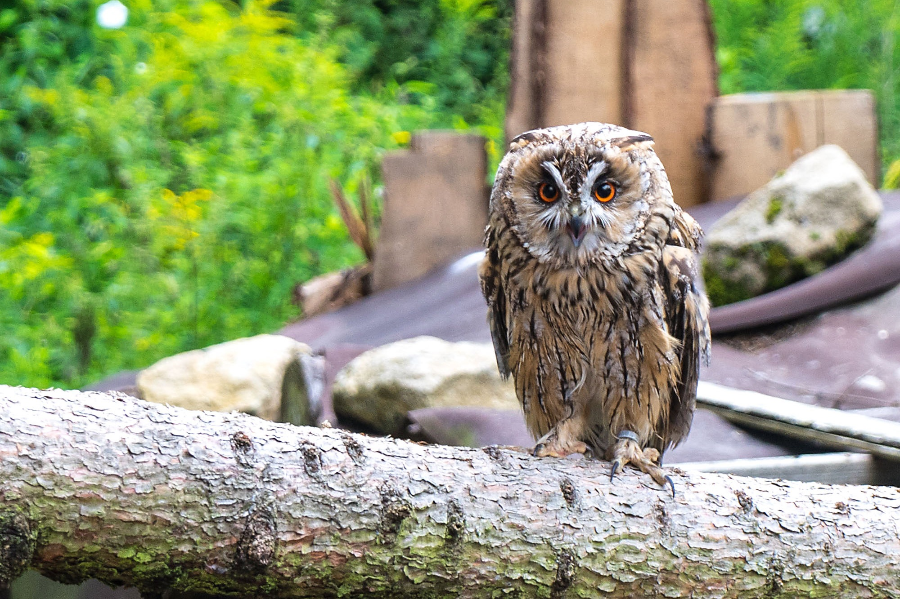
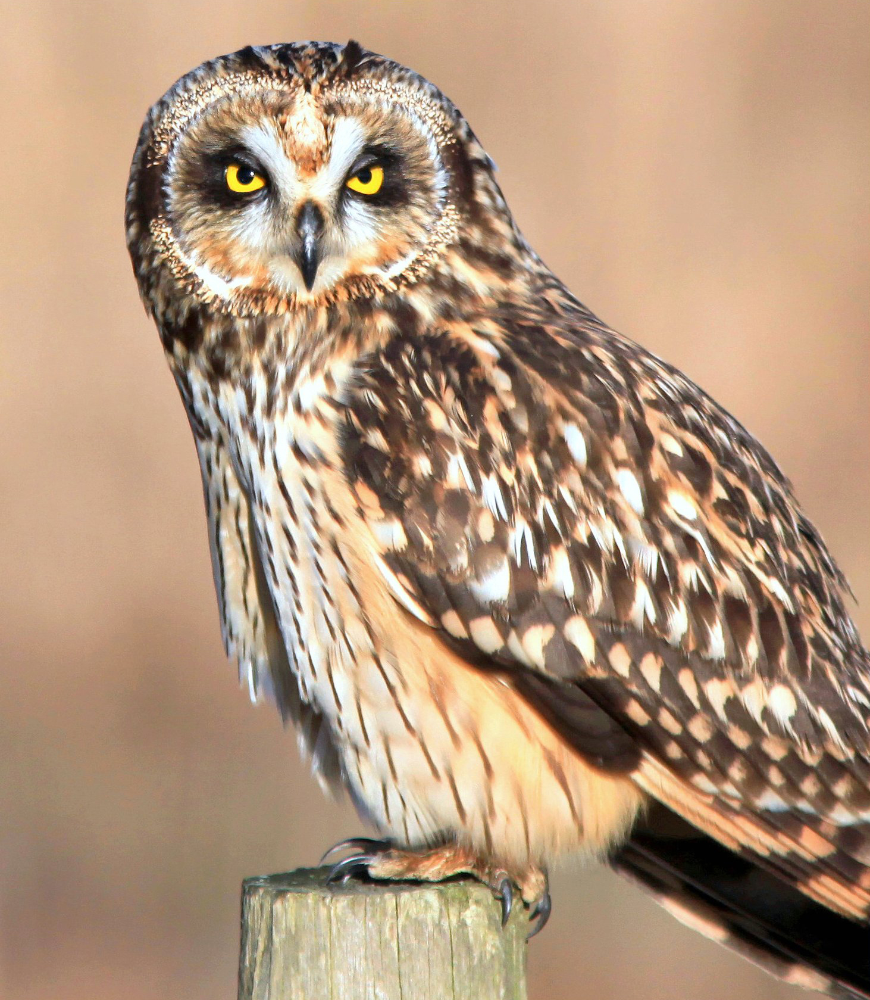
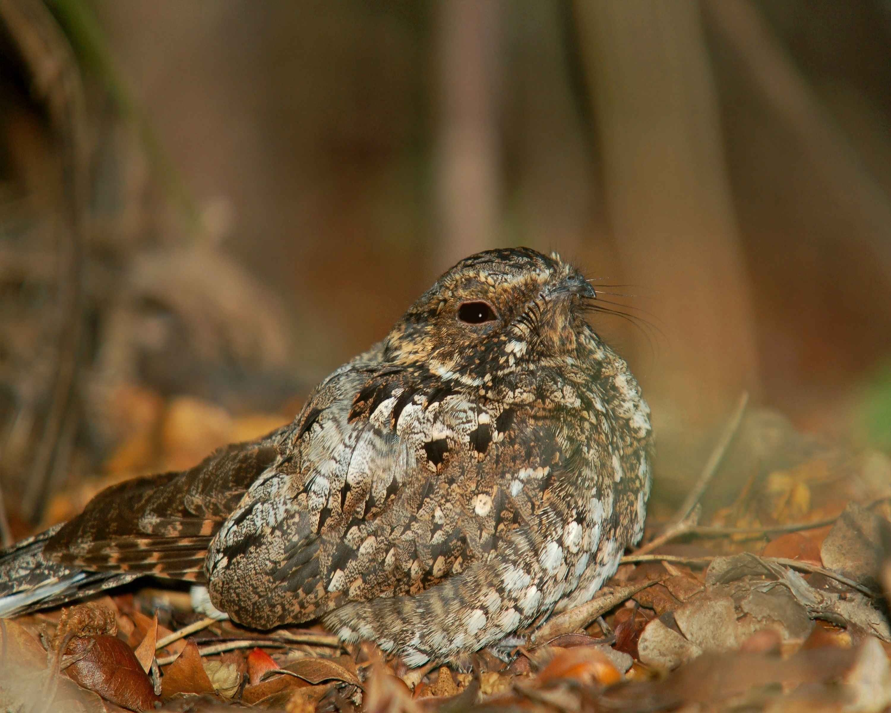

# Animals in the Bible

## License Information

Animals in the Bible © United Bible Societies, 2025. Adapted from: <cite>All Creatures Great and Small: Living Things in the Bible</cite>, by Edward R. Hope © 2005 United Bible Societies. This work is licensed under Creative Commons Attribution-ShareAlike 4.0 International (<a href="https://creativecommons.org/licenses/by-sa/4.0/">https://creativecommons.org/licenses/by-sa/4.0/</a>).

--------------------------------

## Owl (id: FAUNA:3.17)

3\.17 Owl
=========

Discussion:
-----------

Owls are found worldwide except in the Antarctic and on some islands. They are active at night and are characterized by flat faces and short hooked beaks that they can open very wide. They swallow their prey whole and later regurgitate the undigested parts as small balls. They also have the ability to turn their heads more than 180 degrees.

There are two basic owl families, both of which are found in the land of Israel. One family is the *Tytonidae*, which are the Barn and Grass Owls. They have heart\-shaped whitish faces, usually outlined by a dark line, and small dark eyes. The other family is the *Strigidae*, the typical owls. This family contains a large variety of species, all of which have large eyes that may vary in color from light brown through orange to yellow. This family includes the eared or horned owls, the fairly rare fishing owls, and owls that vary in size from the midget scops owl (less than 20 centimeters \[8 inches]) through to the giant eagle owl (over 70 centimeters \[28 inches]).

Eight species of owl are fairly common in the land of Israel. Most are very seldom seen by humans, but they are quite well known by their different and distinct calls. In biblical times the nights would have been much quieter than in most modern places, and the strange night sounds probably would have interested people, causing some speculation about what was making the sound. The different owls would thus probably have had different names even if people had never seen them. In fact it is unlikely that they would have been able to associate most of the calls with the owls that were seen. (Remember, there were no flashlights then.) What follows are the discussion of eight different Hebrew words used in the Bible for owls. See also [3\.2 Birds, clean and unclean](#FAUNA:3.2) and [3\.13 Jackdaw](#FAUNA:3.13).

## Bath ya‘anah (id: FAUNA:3.17.1)

3\.17\.1 Bath ya‘anah
=====================

References:
-----------

Hebrew בַּת יַעֲנָה (bath ya‘anah)

[LEV 11:16](https://ref.ly/Lev11:16), [DEU 14:15](https://ref.ly/Deut14:15), [JOB 30:29](https://ref.ly/Job30:29), [ISA 13:21](https://ref.ly/Isa13:21), [ISA 34:13](https://ref.ly/Isa34:13), [ISA 43:20](https://ref.ly/Isa43:20), [JER 50:39](https://ref.ly/Jer50:39), [MIC 1:8](https://ref.ly/Mic1:8)

Discussion:
-----------

*Eagle owl (A Different Perspective (Pixabay))*

Some scholars have linked *bath ya‘anah* with the word *ya‘en*, which is the ostrich. In view of the contexts in which the word occurs, however, it does not seem that this is a likely interpretation. In the biblical contexts it can be seen that the *bath ya‘anah* is linked with jackals, deserted ruins, and wailing sounds. It also seems to be reliant on water (compare [ISA 43:20](https://ref.ly/Isa43:20)). None of these are contexts into which the ostrich would fit easily. Furthermore, while it is easy to see the reason why certain birds are listed as unclean, from their diet or association with foreign deities, it is not easy to see why ostriches would be included in the list. They are basically vegetarian, like domestic fowls. The only possible reason would be that since they cannot fly, they were considered somehow “unnatural,” as was the bat.

Other scholars have derived the name from an Arabic word meaning “desert,” and still others from an Aramaic word meaning “greedy.” Driver in *Hasting’s Dictionary of the Bible* suggests that it refers to the eagle owl, and from its position in the list of unclean birds this seems a distinct possibility. (See [3\.2 Birds, clean and unclean](#FAUNA:3.2).) The “desert\-owl” of NEB (New English Bible (1970)) and REB (Revised English Bible (1989)) is not a distinct species but a general word for owls that live away from towns.

Description:
------------

Eagle owls are the giants in the owl family. The European Eagle Owl *Bubo bubo* is the largest owl in the Middle East, standing over 75 centimeters (30 inches) tall. The corresponding owl in the land of Israel is a pale fawn color, spotted, has ear tufts, and is best known by its loud, deep hooting at night. It roosts by day in deep shade in acacia trees, caves, tombs, and ruined buildings. It feeds on small mammals, including hares, baby gazelles, lambs, rats and mice, and large roosting birds, especially wild and domestic ducks. It is sometimes seen when it is roosting during the day, or when disturbed in a cave or old tomb, but it is seldom seen at night, except in modern times when it is sometimes seen on roads late at night.

Special significance or symbolism:
----------------------------------

In the Bible this owl is associated with death, mourning, and ruin, as well as being listed as an unclean bird.

Translation:
------------

Eagle owls of one species or another are found in southern and eastern Europe and throughout Africa and South and Southeast Asia. Large owls of a slightly different kind are found in Australasia. The two most common African eagle owls are the Spotted Eagle Owl *Bubo africanus* and the Giant Eagle Owl *Bubo lacteus* (known as Verreaux’s eagle owl in East Africa). The Asian Eagle Owl *Bubo indicus* is found in hilly wooded or forested country away from towns. The largest Australian owl is the Great Scrub Owl *Ninox strenua*. A word for any of these owls, or a phrase meaning “giant owl", would be a close local equivalent to use in the lists of unclean birds. In other contexts, a phrase such as “large owls” would be sufficient.

* **Associated Passages:** Leviticus 11:16; Deuteronomy 14:15; Job 30:29; Isaiah 13:21; Isaiah 34:13; Isaiah 43:20; Jeremiah 50:39; Micah 1:8

## Yanshuf (id: FAUNA:3.17.2)

3\.17\.2 Yanshuf
================

References:
-----------

Hebrew יַנְשׁוֹף (Yanshuf)

[LEV 11:17](https://ref.ly/Lev11:17), [DEU 14:16](https://ref.ly/Deut14:16), [ISA 34:11](https://ref.ly/Isa34:11)

Discussion:
-----------

*Eared owl (Pixabay)*

As with most of the owls, there is no complete agreement among the versions. It would appear at first that “screech owl” has strong support as the translation of *yanshuf*. However, this is misleading. The next Hebrew name on the list of unclean birds in [LEV 11:18](https://ref.ly/Lev11:18) and [DEU 13:16](https://ref.ly/Deut13:16) is *tinshemeth*, which NIV (New International Version (1984)) renders “white owl” and NAB (New American Bible (1970)) “barn owl". In fact both white owl and barn owl are simply alternate names for the screech owl, which these two versions have included earlier in the list. They have thus actually listed the same owl twice. Among Jewish scholars the translation of *tinshemet* as barn owl has a long history, and in modern Hebrew this is the name of the barn owl. (See further discussion of *tinshemet* at [3\.17\.8 Tinshemet](#FAUNA:3.17.8)). Thus it seems best to translate *yanshuf* in some other way.

There are two likely candidates. For translators who have translated the word *tachmas* earlier in the list as “eared owl", *yanshuf* can be translated as “tawny owl". For those who decided to follow modern Hebrew usage and translate *tachmas* as “nightjar", it would be good to translate *yanshuf* as “eared owl", which also follows modern Hebrew usage.

Description:
------------

The Tawny Owl *Strix aluco* is a fairly rare bird in Israel, but where it is present, its call is unmistakable. The male calls with a series of hoots “HOO\-hoo\-hoo, hoo\-HOO\-hoo", and the female replies with a higher pitched single hoot “HOO". Its eyes are outlined with pale circles, so that it looks as though it is wearing spectacles. As its name indicates, it is a mottled gray\-brown color. It prefers wooded areas or orchards and roosts close to the trunk of a tree.

Special significance or symbolism:
----------------------------------

It is listed as an unclean bird.

Translation:
------------

Owls very similar to the tawny owl, which belongs to the same family as Wood Owls *Strigidae*, are found in many places in the world. In sub\-Saharan Africa the Wood Owl *Strix woodfordii* is very similar to the tawny owl, while in Australasia the Boobook Owl *Ninox novaseelandiae* is a good equivalent. Elsewhere the word for a medium\-sized wood owl, or a phrase meaning “tawny\-colored owl” can be used.

* **Associated Passages:** Leviticus 11:17; Deuteronomy 14:16; Isaiah 34:11; Leviticus 11:18; Deuteronomy 13:16

## Kos (id: FAUNA:3.17.3)

3\.17\.3 Kos
============

References:
-----------

Hebrew כּוֹס (kos)

[LEV 11:17](https://ref.ly/Lev11:17), [DEU 14:16](https://ref.ly/Deut14:16), [PSA 102:7](https://ref.ly/Ps102:7)

Discussion:
-----------

*Little owl (Pixabay)*

Traditionally *kos* has been translated as “little owl", and this is the meaning in modern Hebrew. The case for this translation is probably the strongest, even though not conclusive. If we accept this identification, the lists of unclean birds has a rather neat structure with this the smallest of the owls being paired with *nets*, the smallest of the birds of prey.

Description:
------------

The Little Owl *Athene noctua* is, as its name suggests, a small owl, which feeds at night mainly on insects and nestlings. It is about 25 centimeters (10 inches) in length and has a short tail. It does not have ear tufts. It nests in holes in banks or termite hills. It is often seen in the daytime, usually being chased by a group of small birds.

Special significance or symbolism:
----------------------------------

It is listed as an unclean bird.

Translation:
------------

The little owl is found in southeastern Europe, the Middle East, and northeast Africa. Elsewhere one may use the name of a small species of owl or the phrase “little owl".

* **Associated Passages:** Leviticus 11:17; Deuteronomy 14:16; Psalms 102:7

## Lilith (id: FAUNA:3.17.4)

3\.17\.4 Lilith
===============

Reference:"
-----------

Hebrew לִילִית (lilith)

[ISA 34:14](https://ref.ly/Isa34:14)

Discussion:
-----------

Some commentators associate this word with a female demon referred to in Babylonian legends, hence the renderings of RSV (Revised Standard Version (1952)), JB (Jerusalem Bible (1966)), TEV (Today's English Version (Good News Bible)), and NAB (New American Bible (1970)). However, even if this is accepted, it is likely that this demon was also associated with some type of night bird. In many Middle Eastern cultures, demons and monsters have been identified with owls, probably as the result of their strange sounds at night.

In modern Hebrew *lilith* is the name of the tawny owl. Some Bedouin say that the trilled call of another owl, the Scops Owl *Otus scops* (one of the most common owls in Israel), is the hooting of a female demon quietly rejoicing that she has found prey. The root of this name is similar to the Hebrew word for “night” but is actually a Babylonian word. It is also similar to the way some modern Palestinians describe the sound of hooting.

Description:
------------

The tawny owl is described above at [3\.17\.2 yanshuf](#FAUNA:3.17.2). The scops owl is a tiny eared owl that is a mottled gray in color. By day it perches close to the trunk of a tree, where its mottled coloring blends in with the tree bark, making the owl look like the stump of a broken branch. It has a soft, trilled call.

Special significance or symbolism:
----------------------------------

It is associated with doom, destruction, and demons.

Translation:
------------

An expression, such as “owl demon” or “owl witch", is probably the best solution. In sub\-Saharan Africa, where the scops owl is well known, the local name plus a word for demon or witch can be used.

* **Associated Passages:** Isaiah 34:14

## Qipod (id: FAUNA:3.17.5)

3\.17\.5 Qipod
==============

References:
-----------

Hebrew קִפֹּד (qipod)

[ISA 14:23](https://ref.ly/Isa14:23), [ISA 34:11](https://ref.ly/Isa34:11), [ZEP 2:14](https://ref.ly/Zeph2:14)

Discussion:
-----------

The RSV (Revised Standard Version (1952)) translation “hedgehog” or “porcupine” is highly unlikely, since the other creatures mentioned together in the same passages are all birds. From the contexts of the three verses in which this word occurs, it seems to have been a bird associated with marshland, with the desert, and with ruins. The translations “bittern” and “heron” fit the marshland context, but not the wasteland context associated with Edom. The “bittern” is even less likely in [ZEP 2:14](https://ref.ly/Zeph2:14), where this bird is said to build its nest on the top of the city’s pillars. Bitterns nest in thick grass or reeds, almost on the ground. (The Hebrew text of this verse, however, is very problematic.) The “bustard” of NEB (New English Bible (1970)) and REB (Revised English Bible (1989)), following Driver, fits only the wasteland context of Edom but not the other contexts. Bustards are birds of the semi desert, which nest on the ground.

More recent suggestions have been that this bird is actually the Spoonbill *Platalea leucorodia*, called *kapan* in modern Hebrew (which might be a form of *qipod*), or that it might be the jackdaw, since in two of the occurrences of the word, the raven is mentioned in the same sentence. The spoonbill would not fit the wasteland contexts, and this suggestion has very little acceptance at present. The jackdaw would fit all contexts, but it is more likely that the word *qa’ath* refers to this bird.

This leaves us with the possibility of some type of owl, which would fit all contexts and has the support of most commentators. Confident identification of this bird is, however, impossible.

Description:
------------

See the descriptions of owls in [3\.17](#FAUNA:3.17) above.

Special significance or symbolism:
----------------------------------

It is associated with doom and destruction.

Translation:
------------

In most cases a general word for owl is probably the best choice. The translation of [ZEP 2:14](https://ref.ly/Zeph2:14) would thus begin as follows: “Flocks will lie down there, with all kinds of wild animals. Jackdaws and owls will nest on the capitals of the pillars. … "

* **Associated Passages:** Isaiah 14:23; Isaiah 34:11; Zephaniah 2:14

## Qipoz (id: FAUNA:3.17.6)

3\.17\.6 Qipoz
==============

Reference:"
-----------

Hebrew קִפּוֹז (qipoz)

[ISA 34:15](https://ref.ly/Isa34:15)

Discussion:
-----------

JB (Jerusalem Bible (1966)) ’s “viper” is the result of taking this word to mean “arrowsnake", a type of viper. However, in the Hebrew poetry this word is in parallel with “kite", making it much more likely that this word refers to a bird of prey of some kind. This also rules out the likelihood that “sand partridge” is correct. Some kind of owl certainly fits the context. It seems likely that *qipoz* and *qipod* are two forms of the same word.

Description:
------------

See the descriptions of owls in [3\.17 Owl](#FAUNA:3.17).

Special significance or symbolism:
----------------------------------

It is associated with doom and destruction.

Translation:
------------

See suggestions at [3\.17\.5 Qipod](#FAUNA:3.17.5).

* **Associated Passages:** Isaiah 34:15

## Tachmas (id: FAUNA:3.17.7)

3\.17\.7 Tachmas
================

References:
-----------

Hebrew תַּחְמָס (tachmas)

[LEV 11:16](https://ref.ly/Lev11:16), [DEU 14:15](https://ref.ly/Deut14:15)

Discussion:
-----------

*Short\-eared owl (© nigel from vancouver, Canada (Wikimedia Commons))*

From the variety of translations in the English versions it is evident that there is no consensus on the meaning of this word, apart from the fact that it is a bird that is active at night.

If the bird is one of the types of owl, we can assume from its position in the list of unclean birds that it is between the eagle owl and the little owl in size. In other words it would be one of the medium\-sized owls.

There are four possible candidates: the Short\-eared Owl *Asio flammeus*, the Long\-eared Owl *Asio otus*, the Barn Owl *Tyto alba* (also called the screech owl or the white owl), and the Tawny Owl *Strix aluco* (also called the wood owl). It is not likely that the Israelites would have been familiar with the long\-eared owl, which is a silent passing migrant that keeps to forested areas. If they were aware of its existence, they would not have been aware of the difference between the long\-eared and the more common short\-eared owls; even modern day bird watchers equipped with flashlights and binoculars have a hard time differentiating them. It is likely that if the Israelites had a name for these owls it was one name, not two. This reduces the possible interpretations of *tachmas* to three, and of these the short\-eared owl is the most likely.

*Nightjar roosting on the ground (Pixabay)*

However, the NAB (New American Bible (1970)) rendering “nightjar” cannot be discounted. This is also the bird referred to in KJV (King James Version (1611)) and RSV (Revised Standard Version (1952)) as the “nighthawk". In modern Hebrew the nightjar is called *tachmas* while the eared owls are called *yanshuf* (see the discussion of this name in [3\.17\.2 Yanshuf](#FAUNA:3.17.2) above).

Description:
------------

The short\-eared owl, like many other owls of the *Asio* family, is a medium\-sized brown owl with a paler face and ear tufts that are not very prominent. It makes a strange sound like an animal or a person snoring. It lives in grassland and semi desert regions.

*Nightjar (© Levashkin (Wikimedia Commons))*

Nightjars are night\-flying birds that feed on flying insects. They have short beaks that they can open very wide. During the day they roost on the ground or on thick branches. They lie very still and are well camouflaged, so they are seldom seen. However, their presence in an area is known from their calls at night. The two most common nightjars in the land of Israel are the Nubian Nightjar *Caprimulgus nubicus* and the European Nightjar *Caprimulgus europaeus*. These birds are about 15 centimeters (6 inches) long and are a speckled brown. They are often heard at night, especially in the breeding season. Their call consists of four two\-syllable sounds uttered without pause, all on the same note, with the first and last double syllable quieter than the rest, described as *tuka\-TUKA\-TUKA\-tuka*.

Special significance or symbolism:
----------------------------------

It is listed as an unclean bird.

Translation:
------------

Short\-eared owls are found all over the Mediterranean area, while similar eared owls, such as the African Marsh Owl *Asio capensis*, are found all through Africa. In these areas it may not be difficult to find a very close equivalent. Elsewhere the name of a medium\-sized local owl can be used, or a phrase meaning eared owl can be used.

The European nightjar is found all over Europe and Africa. Many other types of nightjar are found in Africa, Asia, and Australasia, and if it is decided to interpret *tachmas* as “nightjar", the word for a local member of this species can usually be found.

* **Associated Passages:** Leviticus 11:16; Deuteronomy 14:15

## Tinshemeth (id: FAUNA:3.17.8)

3\.17\.8 Tinshemeth
===================

References:
-----------

Hebrew תִּנְשֶׁמֶת (tinshemeth)

[LEV 11:18](https://ref.ly/Lev11:18), [DEU 14:16](https://ref.ly/Deut14:16)

Discussion:
-----------

*Barn owl (Pixabay)*

As mentioned above, the terms barn owl, screech owl, and white owl are alternative names for the same owl. There is a long tradition among both Jewish and Christian scholars of translating *tinshemeth* as “barn owl” (NAB (New American Bible (1970)), also NIV (New International Version (1984)) with “white owl"). NEB (New English Bible (1970)) and REB (Revised English Bible (1989)) follow Driver’s suggestion “little owl", but this does not have as wide support among scholars as “barn owl,” which is also the modern Hebrew meaning of *tinshemeth*. The KJV (King James Version (1611)) and RSV (Revised Standard Version (1952)) renderings of “swan” and “water hen” respectively can be disregarded. Swans are extremely rare in the land of Israel, and “water hen” is too vague a term to be useful.

The word *tinshemeth* actually occurs three times in the Bible. Twice the word probably refers to the barn owl, but the third occurrence is a reference to a type of lizard or chameleon. (See [4\.3 Chameleon](#FAUNA:4.3).)

Description:
------------

The Barn Owl *Tyto alba* is one of the most widely distributed owls in the world, being common virtually everywhere but the Arctic and Antarctic regions and remote islands. It is a very pale color, light fawn or gray on the wings and back, and almost white on the chest and under the wings. It has small eyes, a large head for its size, and a very striking heart\-shaped white facial disk outlined in brown. This facial disk consists of short bristle\-like feathers that help the owl to sense very small sounds. Barn owls often roost in barns, deserted houses, caves, and tombs. They utter a variety of strange sounds, varying from the well\-known drawn\-out trembling screech, to various hissing, chirruping, and snoring sounds. The females are larger and more vocal than the males. These owls live mainly on rats, mice, and other small nocturnal creatures.

Special significance or symbolism:
----------------------------------

It is listed as an unclean bird and was associated with tombs and death.

Translation:
------------

This is one owl for which finding a local equivalent should not present any major problem. Failing all else, the phrase “white\-faced owl” can be used, although strictly speaking, there is another smaller owl, not closely related to the barn owl, that has this English name.

* **Associated Passages:** Leviticus 11:18; Deuteronomy 14:16

