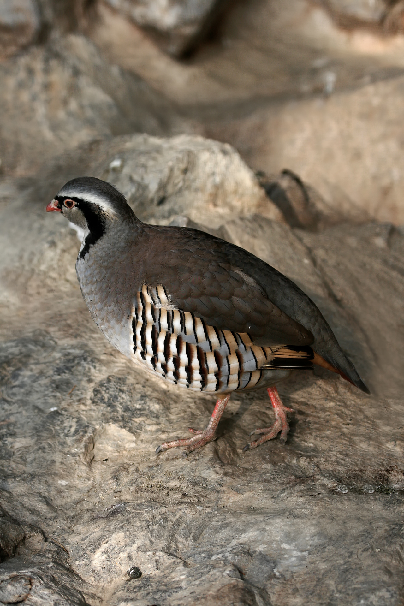

# Animals in the Bible

## License Information

Animals in the Bible © United Bible Societies, 2025. Adapted from: <cite>All Creatures Great and Small: Living Things in the Bible</cite>, by Edward R. Hope © 2005 United Bible Societies. This work is licensed under Creative Commons Attribution-ShareAlike 4.0 International (<a href="https://creativecommons.org/licenses/by-sa/4.0/">https://creativecommons.org/licenses/by-sa/4.0/</a>).

--------------------------------

## Partridge (id: FAUNA:3.18)

3\.18 Partridge
===============

References:
-----------

Hebrew קֹרֵא (qore’)

[1SA 26:20](https://ref.ly/1Sam26:20), [JER 17:11](https://ref.ly/Jer17:11)

Greek κάρταλλος (kartallos)

[SIR 11:30](https://ref.ly/Sir11:30)

Discussion:
-----------

*Rock partridge (chukar) (© Richard Bartz (Wikimedia Commons))*

Partridges have been hunted and trapped for millennia. In the land of Israel there are three common types of partridge which are still found today: the Rock Partridge *Alectoris graeca* (also known in the Middle East as the Chukar *Alectoris chukar*), the Black Francolin *Francolinus francolinus*, and the Sand Partridge *Ammoperdix heyi*. In modern Hebrew the sand partridge is still called *qore’*, but in biblical times all three types of partridge were probably referred to by this name. The name means “the caller", a reference to the ringing crowing of the males, typically while standing on top of a rock.

Partridges were hunted with stones, slings, and throwing sticks, and were also caught in snares. In [1SA 26:20](https://ref.ly/1Sam26:20) David likens himself to a partridge being hunted. This is a very apt simile, since he had been moving from one refuge to another, just as a partridge flies short distances from cover to cover when being chased. He had also been hiding in the same rocky hills that partridges inhabit near En Gedi.

In [SIR 11:30](https://ref.ly/Sir11:30) there is reference to “a decoy partridge in a cage". This refers to a practice still common in many parts of the world. A male partridge is captured and the caged bird is left in an area where it is known there are partridges, or it is taken from the cage and tethered to a bush by its leg. Grain is scattered around and slip noose snares are set. Toward sundown the captive partridge begins to call, and this attracts other partridges, which begin to feed on the grain and are snared. See also *The Works of Their Hands*, [1\.4\.3 Cage](#REALIA:1.4.3)

Partridge eggs were also an important part of the ancient diet, and many Bedouin tribes still collect these eggs regularly. Up until the twentieth century partridges of all three types were abundant throughout Palestine. Today they still exist but in much smaller numbers.

Description:
------------

The three partridges mentioned above live in slightly different habitats. The rock partridge, as its name suggests, frequents rocky hill terrain. It is found all over Israel, where it makes good use of the broken terrain to remain hidden. The black francolin prefers denser vegetation in wadis or river valleys. The presence of both these partridges is usually known from their calls rather than from actual sightings of the birds. The sand partridge frequents the Judean Desert and can still be seen coming to drink at pools in wadis along the Dead Sea.

All three types of partridge, in spite of their different markings and the fact that the sand partridge is smaller than the other two, are typical of the partridge family. They live in small flocks called coveys, lay a great many eggs, and prefer to run when in danger, flying only when necessary. Even when they take flight they fly for only a short distance before dropping back to the ground. They also have the ability to squat absolutely still, almost in a trance. With their natural camouflage this ability usually means that the birds will not be seen even by someone passing very near them.

The rock partridge is about 35 centimeters (14 inches) in length and has striking white cheeks with a black band running from its brow, through its eyes, down its neck, and curving around its breast. It also has striking black and chestnut stripes on its flanks. Its back and wings are gray. The beak and legs are red. Both sexes look alike.

The black francolin is about the same size but has a slightly shorter tail. The male has a black breast and flanks. The female is a speckled brown.

The sand partridge is the color of the local sand and is about half the size of the other two types.

Special significance or symbolism:
----------------------------------

See the notes in the Translation subsection below.

Translation:
------------

Partridges or their close relatives the button quails and pheasants are found all over the world, and finding a local equivalent should not prove difficult. In Asia the Bamboo Partridge *Alectoris orientalis* is found from Pakistan to China and down through Southeast Asia. In Australia the Brown Quail *Coturnix australis* and the Stubble Quail *Coturnix pectoralis* are probably the closest equivalents, rather than the mallee fowl or the scrub fowl, which are mound builders, a very specialized type of bird.

In Africa any of the francolins are a good equivalent. They are found all over Africa.

[JER 17:11](https://ref.ly/Jer17:11): There are a number of problems connected with the exegesis of the first half of this verse, as can be seen from the following English versions:

"Like a partridge that gathers into its nest eggs which it has not laid” (NEB (New English Bible (1970)));

"As the partridge sitteth on eggs and hatcheth them not” (KJV (King James Version (1611)));

"Like a partridge that hatches eggs it did not lay” (NIV (New International Version (1984)); compare JB (Jerusalem Bible (1966)), REB (Revised English Bible (1989)), TEV (Today's English Version (Good News Bible)));

"Like the partridge that gathers a brood which she did not hatch” (RSV (Revised Standard Version (1952)); compare NAB (New American Bible (1970))).

In trying to arrive at a well\-motivated interpretation of this verse, two Hebrew words are crucial: *dagar* and *yalad*.

*Dagar* is a word found only twice in the Bible, here in [JER 17:11](https://ref.ly/Jer17:11) and in [ISA 34:15](https://ref.ly/Isa34:15). Since the word is not a common one, it is only the contexts of these two verses that provide clues to its meaning. It is the Isaiah passage that gives the most contextual clues, but even there, there are some words with very obscure meaning. Most commentaries and translations agree about the first two verbs but about little else in the verse. If we transliterate rather than translate the disputed Hebrew words in , a fairly literal translation of the first half of the verse reads:

There a *qipoz* will nest, will lay eggs, will break open, and *dagrah* under her shadow.

All English versions translate *bak‘ah* ("break open") as “hatch them", and this leads some to translate *dagrah* as “gather her brood". However, it should be noted that this interpretation involves a change of implied object from “eggs” to “chicks” or “brood".

If the translation of *dagar* were done consistently, one would expect that the Jeremiah passage would be translated:

a) As a partridge cares for/gathers chicks it did not hatch. … 

Only RSV (Revised Standard Version (1952)), NAB (New American Bible (1970)), and NEB (New English Bible (1970)) in fact do this. In place of this most of the others have:

b) Like a partridge that sits on eggs ("hatches” in NIV (New International Version (1984)), TEV (Today's English Version (Good News Bible)), and JB (Jerusalem Bible (1966))) it did not lay. … 

Most versions thus translate *dagar* in two different ways even though the contexts of both passages seem very similar.

The Hebrew word *yalad* is a much more common word, and in other contexts it means “give birth to” or “bring forth". [JER 17:11](https://ref.ly/Jer17:11) is the only place where this verb is used with a bird. This would seem to indicate two possible translations of the verb in this verse. The first is “lay eggs". This is what leads to interpretation b) above and to the two very different interpretations being given for *dagar* in what are basically identical contexts. However, the noun form *yeled*, when used of birds, does not refer to their eggs but to their chicks (compare [JOB 38:41](https://ref.ly/Job38:41)), and this would justify the second possible translation, namely “to hatch chicks".

Interpretation b) is supported by Jewish Midrashic traditions and by most commentaries and Bible dictionaries. These sources usually contain a reference to “a popular but incorrect belief that partridges steal eggs from other birds.” However, in the course of the research for this Handbook, this assumption was found to be very dubious. Many scholars now question its validity. The major problem with the traditional interpretation is that the only supporting evidence for the “popular but erroneous belief” is this one possible translation of [JER 17:11](https://ref.ly/Jer17:11). The argument is thus circular: [JER 17:11](https://ref.ly/Jer17:11) must be interpreted in the light of a myth; the source for the myth is [JER 17:11](https://ref.ly/Jer17:11).

In trying to provide some hypothetical basis for the “popular but erroneous belief,” reference is made to the fact that most partridges indigenous to the land lay twelve or more eggs in a clutch, and this might have led to the belief that partridges collect eggs from each other. However, as mentioned above, there is no independent evidence at all for such a belief. Partridges and their eggs were, and are, a regular and important food source, and it is hard to believe that the ancient prophets did not know where the eggs came from.

There are three possible alternative interpretations of [JER 17:11](https://ref.ly/Jer17:11), none of which corresponds to interpretation b) above.

The first alternative results from an interpretation of *dagar* as meaning “to sit in a broody state while incubating eggs.” This is the meaning given as a gloss in Abraham Even\-Shoshan’s *A New Concordance of the Old Testament*. *Yalad* is taken to mean “lay eggs". The verse can then be translated:

c) “Like a partridge that sits brooding but has not laid eggs ...."

This could then be taken as a reference to the habit partridges have of sitting motionless in the shade, or as one of their means of defence. In situations of danger from eagles or hawks, they make use of their fantastic camouflage and sit absolutely still for long periods in what is almost a state of trance. When sitting like this one can approach to within a few feet of the bird. The point of the simile would be that the man who has become rich by unjust means is like a partridge that only *appears* to be productive. No commentator that I know of has raised this possible interpretation, probably because it is difficult to relate to the last half of the verse, which is literally “they will leave him half\-way through his life."

In [ISA 34:15](https://ref.ly/Isa34:15) the last phrase would then be translated as “sits brooding in the shade.” (In response to the suggestion that the Hebrew should be altered to read *betseyha* “her eggs” instead of *betsilah* “in/under her shade", it has been pointed out by many scholars that the sequence of verbs which then results is improbable. The existing text yields “makes a nest ... lays ... hatches ... sits brooding her eggs.")

The second possible alternative interpretation follows the same understanding of *dagar*, but *yalad* is taken to mean “hatch chicks":

d) “Like a partridge that sits brooding on eggs but does not get to hatch them ...."

This would refer to the fact that a large percentage of the numerous eggs that a partridge lays were, and are, collected by people or stolen by other animals such as jackals and mongooses, birds such as crows, or monitor lizards. It is interesting that Canon Tristram mentions finding a partridge nest containing twenty\-eight eggs, and that a particular Bedouin camp he was associated with collected over eight hundred partridge eggs in a single breeding season. The collecting of eggs is mentioned in [ISA 10:14](https://ref.ly/Isa10:14), and it is likely that partridge eggs were the most common and easiest to find.

Rendering d) is the interpretation adopted by KJV (King James Version (1611)). The point of the comparison would then seem to be that getting rich by dishonest means is as futile as a partridge laying eggs that others steal. The inference seems to be that ill\-gotten wealth will be taken away, either by the authorities or perhaps by God. This is the interpretation preferred by a growing number of scholars. It relates fairly well to the last half of the verse.

The third possible alternative interpretation is that followed by RSV (Revised Standard Version (1952)) and NAB (New American Bible (1970)). It involves interpreting *dagar* as “to gather or mother chicks like a hen does", and *yalad* as “to hatch chicks":

e) “Like a partridge that gathers chicks it did not hatch ...."

The reference would then be to the fact that in a flock or covey of rock partridges the hens do not differentiate between their own chicks and the other chicks in the flock. (This is not true of some of the other partridge species). Rock partridge hens can be seen caring for as many as fifty chicks at a time. As the chicks grow, their ties with the hens weaken considerably, and when the expanding flock divides up into smaller flocks the offspring often move away. Thus the imagery in [JER 17:11](https://ref.ly/Jer17:11) is carried by this interpretation right through the whole verse, and the clause “they will leave him halfway through his life” is very pertinent.

[ISA 34:15](https://ref.ly/Isa34:15) can then be interpreted consistently as “There the *qipoz* will make her nest, lay eggs, hatch them, and gather her chicks under her protecting shade.” Of the options e) seems to be the best, suiting the contexts and resulting in a consistent translation of the two occurrences of *dagar*. However, a footnote explaining the behavior of rock partridge hens seems necessary in order to convey the inference.

In [JDG 15:19](https://ref.ly/Judg15:19) the place name En\-Haqore \[Hakkore] should be taken to mean “Well of the Caller” rather than “Well of the Partridge", since the name commemorates Samson’s calling to God for help.

* **Associated Passages:** 1 Samuel 26:20; Jeremiah 17:11; Sirach 11:30; Isaiah 34:15; Job 38:41; Isaiah 10:14; Judges 15:19

