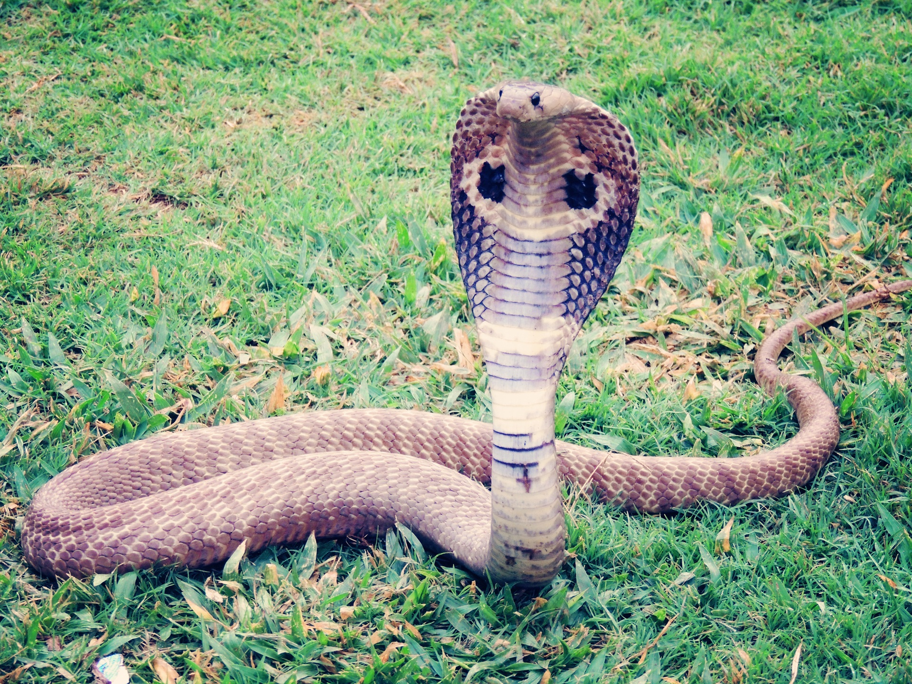

# Animals in the Bible

## License Information

Animals in the Bible © United Bible Societies, 2025. Adapted from: <cite>All Creatures Great and Small: Living Things in the Bible</cite>, by Edward R. Hope © 2005 United Bible Societies. This work is licensed under Creative Commons Attribution-ShareAlike 4.0 International (<a href="https://creativecommons.org/licenses/by-sa/4.0/">https://creativecommons.org/licenses/by-sa/4.0/</a>).

--------------------------------

## Cobra (id: FAUNA:4.4)

4\.4 Cobra
==========

References:
-----------

Hebrew פֶּתֶן (pethen)

[DEU 32:33](https://ref.ly/Deut32:33), [JOB 20:14](https://ref.ly/Job20:14), [JOB 20:16](https://ref.ly/Job20:16), [PSA 58:5](https://ref.ly/Ps58:5), [PSA 91:13](https://ref.ly/Ps91:13), [ISA 11:8](https://ref.ly/Isa11:8)

Hebrew צֶפַע, צִפְעוֹנִי (tsefa‘, tsif‘oni)

[PRO 23:32](https://ref.ly/Prov23:32), [ISA 11:8](https://ref.ly/Isa11:8), [ISA 14:29](https://ref.ly/Isa14:29), [ISA 59:5](https://ref.ly/Isa59:5), [JER 8:17](https://ref.ly/Jer8:17)

Greek ἀσπίς (aspis)

[ROM 3:13](https://ref.ly/Rom3:13)

Discussion:
-----------

There is general agreement among modern scholars that the word *pethen* refers to the cobra, since the word is closely associated with snake charming, which requires a snake that can raise the front part of its body vertically, something a viper cannot do. The words *tsif‘oni* and *tsefa‘* are also probably references to a type of cobra. This can be well supported by the contexts in which the word occurs, in which reference is made to the fact that it lives in holes and lays eggs. These contexts would rule out any of the vipers.

There is some evidence that *pethen* was the earlier name for the cobra, and *tsefa‘* and *tsif‘oni* were later names. Something similar is the case with English, where “cobra” has been in use only for the last one hundred years, and previously “asp” was used.

"Adder” is used as the name for some of the subspecies of viper and is probably not the best word to translate these three Hebrew words.

Description:
------------

Cobras are characterized by their ability to spread the ribs in their neck area, so as to form a broad flat profile called the hood. This makes the snake look much thicker than it really is. Cobras also have short fixed fangs in the front of their mouths. The cobra that is found in the land of Israel is the Desert Cobra or Walter Innes’s snake (*Walterinnesia aegyptia*), while the cobra found in Egypt is the Egyptian Cobra *Naja haje*. The cobra is a large snake, reaching 2 meters (6 feet) in length, and about 50 millimeters (2 inches) in diameter. It is dark brown with a yellowish underside. In some areas where it is found it has broad yellowish bands, which give it its alternative English name, banded cobra. When it rears up and spreads its hood, the hood has a yellowish background, but displays a broad dark brown horizontal stripe.

Its bite is very poisonous, and it takes quick effect, acting on the nervous system. The cobra feeds on mice, gerbils, birds, bird’s eggs, lizards, frogs, and other snakes. It hunts by following scent trails, which it senses with its tongue. When within range of its prey, it raises its head slowly vertically, and suddenly strikes at the unsuspecting victim. It lives mainly in grassland and where the vegetation is fairly thick. It takes cover in rat holes, holes in eroded banks, hollow trees, under logs, and among exposed roots. It may lay its eggs in any of these sheltered places. In cold weather it coils itself up to preserve its body heat.

Special significance or symbolism:
----------------------------------

The cobra, besides being a symbol of lurking danger, was also closely associated with Egypt. In some poetic passages, therefore, it is a metaphor for the enemies of Israel, Egypt in particular.

Translation:
------------

The Egyptian cobra is found all over Africa, and a local word should not be difficult to find. In South and Southeast Asia a word for the King Cobra *Naja hannah* or one of the other cobras would be a good equivalent. In areas where these cobras are symbols of good luck and the presence of a deity, the Hebrew symbolism might need to be explained in a footnote. In other parts of the world, if cobras are unknown, the name of a local long poisonous snake of a type different from vipers and adders is a possible choice.

In passages where snakes are referred to as “stinging", it is not necessary to use a verb meaning literally “to sting". This is just the Hebrew way of referring to the bite of a snake. As mentioned in the introduction to this chapter, in many languages the verb used for a snake’s bite is different from the one used to refer to the bite of something else, such as a dog.

[ISA 14:29](https://ref.ly/Isa14:29): This verse is poetic and contains a reference to sticks becoming snakes, and snakes producing even more dangerous ones. A literal translation is “Do not rejoice, all you Philistines, that the rod of striking is broken. From the snake root will spring forth a cobra; its fruit will be a flying viper". The expression “snake root” is a play on words and refers to the “root” of the broken stick and to the snake as the “root” or origin of the cobra. The verse can be restated as:

Do not rejoice, all you Philistines,

That the rod that struck you is broken.

The broken end is a snake.

The snake will produce a cobra,

It will produce a poisonous flying viper.

See [4\.10 Viper](#FAUNA:4.10) for note on “flying” viper.

* **Associated Passages:** Deuteronomy 32:33; Job 20:14; Job 20:16; Psalms 58:5; Psalms 91:13; Isaiah 11:8; Proverbs 23:32; Isaiah 14:29; Isaiah 59:5; Jeremiah 8:17; Romans 3:13

