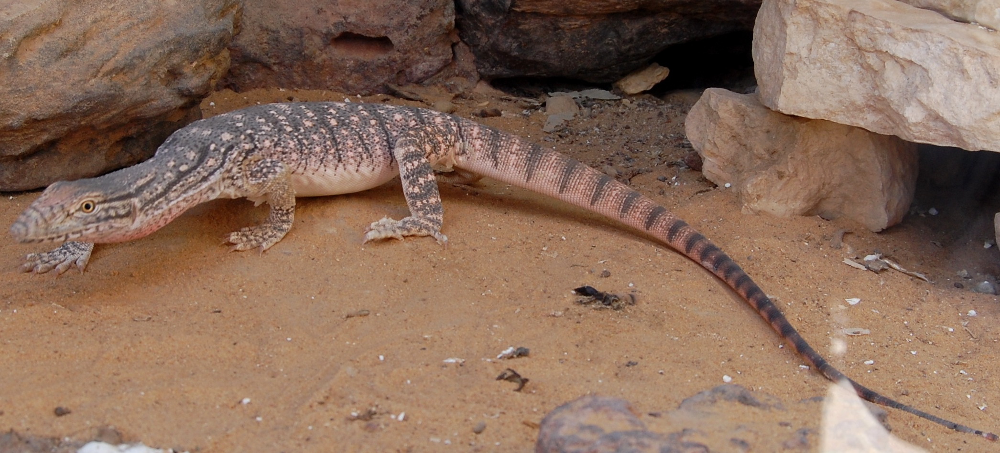

# Animals in the Bible

## License Information

Animals in the Bible © United Bible Societies, 2025. Adapted from: <cite>All Creatures Great and Small: Living Things in the Bible</cite>, by Edward R. Hope © 2005 United Bible Societies. This work is licensed under Creative Commons Attribution-ShareAlike 4.0 International (<a href="https://creativecommons.org/licenses/by-sa/4.0/">https://creativecommons.org/licenses/by-sa/4.0/</a>).

--------------------------------

## Monitor (id: FAUNA:4.7)

4\.7 Monitor
============

Reference:"
-----------

Hebrew כֹּחַ (koach)

[LEV 11:30](https://ref.ly/Lev11:30)

Discussion:
-----------

*Iguana (Pixabay)*

The English versions (KJV (King James Version (1611)) “chameleon"; RSV (Revised Standard Version (1952)) “land crocodile"; NEB (New English Bible (1970)) “sand\-gecko"; JB (Jerusalem Bible (1966)) “koach"; NIV (New International Version (1984)) “monitor lizard"; REB (Revised English Bible (1989)) “sand\-gecko"; NAB (New American Bible (1970)) “chameleon") reflect the fact that no certain identification can be made of what lizard this is. The RSV (Revised Standard Version (1952)) term “land crocodile” is the same lizard as the “monitor lizard” of NIV (New International Version (1984)). This suggestion has the most support among modern scholars. The Hebrew name is related to a root meaning “strength,” which could well apply to either the Desert Monitor *Varanus griseus* or the Nile Monitor *Varanus niloticus*. The latter creature is not found in Israel, but it would have been well\-known from Egypt. Both of these giant lizards are related to the iguanas.

If this word means “chameleon", then the reference is probably to the strength of its grip. It has claws that can close around twigs, with three toes on one side opposed to two on the other, giving it a very tenacious grip. However, this interpretation is not as likely as “monitor lizard".

Description:
------------

*Desert monitor lizard (© Knockout mouse (Wikimedia Commons))*

The desert monitor is one of the largest lizards in the world, reaching a total length of nearly 1\.2 meters (4 feet) in Israel and even longer in other countries. They are powerful, but normally slow\-moving, except when escaping from danger. They are carnivorous, eating a wide variety of prey, including insects, mice, snakes, lizards, birds’ eggs, nestlings, and carrion from animal carcasses. They are a greyish brown and live in desert and savannah semidesert regions.

The Nile or water monitor is very similar in appearance, but it lives near rivers and in thicker vegetation. It includes turtle and crocodile eggs in its diet.

Special significance or symbolism:
----------------------------------

They are listed as unclean.

Translation:
------------

Either monitor lizards or iguanas are found in many countries of the world in the warmer parts of all continents and in Australia (where they are called goannas). In these areas a local word will not be hard to find. Elsewhere a phrase such as “giant lizard” can be used.

* **Associated Passages:** Leviticus 11:30

