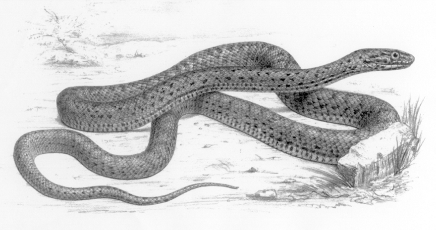

# Animals in the Bible

## License Information

Animals in the Bible © United Bible Societies, 2025. Adapted from: <cite>All Creatures Great and Small: Living Things in the Bible</cite>, by Edward R. Hope © 2005 United Bible Societies. This work is licensed under Creative Commons Attribution-ShareAlike 4.0 International (<a href="https://creativecommons.org/licenses/by-sa/4.0/">https://creativecommons.org/licenses/by-sa/4.0/</a>).

--------------------------------

## Snake (id: FAUNA:4.9)

4\.9 Snake
==========

References:
-----------

Hebrew נָחָשׁ (nachash)

[GEN 3:1](https://ref.ly/Gen3:1), [GEN 3:2](https://ref.ly/Gen3:2), [GEN 3:4](https://ref.ly/Gen3:4), [GEN 3:13](https://ref.ly/Gen3:13), [GEN 3:14](https://ref.ly/Gen3:14), [GEN 49:17](https://ref.ly/Gen49:17), [EXO 4:3](https://ref.ly/Exod4:3), [EXO 7:15](https://ref.ly/Exod7:15), [NUM 21:6](https://ref.ly/Num21:6), [NUM 21:7](https://ref.ly/Num21:7), [NUM 21:9](https://ref.ly/Num21:9), [DEU 8:15](https://ref.ly/Deut8:15), [2KI 18:4](https://ref.ly/2Kgs18:4), [JOB 26:13](https://ref.ly/Job26:13), [PSA 58:5](https://ref.ly/Ps58:5), [PSA 140:4](https://ref.ly/Ps140:4), [PRO 23:32](https://ref.ly/Prov23:32), [PRO 30:19](https://ref.ly/Prov30:19), [ECC 10:8](https://ref.ly/Eccl10:8), [ECC 10:11](https://ref.ly/Eccl10:11), [ISA 14:29](https://ref.ly/Isa14:29), [ISA 27:1](https://ref.ly/Isa27:1), [ISA 65:25](https://ref.ly/Isa65:25), [JER 8:17](https://ref.ly/Jer8:17), [JER 46:22](https://ref.ly/Jer46:22), [AMO 5:19](https://ref.ly/Amos5:19), [AMO 9:3](https://ref.ly/Amos9:3), [MIC 7:17](https://ref.ly/Mic7:17)

Hebrew תַּנִּין (tanin)

[EXO 7:9](https://ref.ly/Exod7:9), [EXO 7:10](https://ref.ly/Exod7:10), [EXO 7:12](https://ref.ly/Exod7:12), [DEU 32:33](https://ref.ly/Deut32:33), [PSA 91:13](https://ref.ly/Ps91:13)

Greek δράκων (drakōn)

[ESG 1:1](https://ref.ly/EsthGr1:1), [ESG 10:3](https://ref.ly/EsthGr10:3), [WIS 16:10](https://ref.ly/Wis16:10), [SIR 25:16](https://ref.ly/Sir25:16), [BEL 1:23](https://ref.ly/Bel1:23), [BEL 1:25](https://ref.ly/Bel1:25), [BEL 1:27](https://ref.ly/Bel1:27), [BEL 1:28](https://ref.ly/Bel1:28), [ODA 2:33](https://ref.ly/Odes2:33), [PSS 2:25](https://ref.ly/PssSol2:25)

Greek ἑρπετόν (herpeton)

[WIS 11:15](https://ref.ly/Wis11:15), [WIS 17:9](https://ref.ly/Wis17:9), [SIR 10:11](https://ref.ly/Sir10:11), [LJE 1:19](https://ref.ly/EpJer1:19)

Greek ὄφις (ofis)

[MAT 7:10](https://ref.ly/Matt7:10), [MAT 10:16](https://ref.ly/Matt10:16), [MAT 23:33](https://ref.ly/Matt23:33), [MRK 16:18](https://ref.ly/Mark16:18), [LUK 10:19](https://ref.ly/Luke10:19), [LUK 11:11](https://ref.ly/Luke11:11), [JHN 3:14](https://ref.ly/John3:14), [1CO 10:9](https://ref.ly/1Cor10:9), [2CO 11:3](https://ref.ly/2Cor11:3), [REV 9:19](https://ref.ly/Rev9:19), [REV 12:9](https://ref.ly/Rev12:9), [REV 12:14](https://ref.ly/Rev12:14), [REV 12:15](https://ref.ly/Rev12:15), [REV 20:2](https://ref.ly/Rev20:2), [WIS 16:5](https://ref.ly/Wis16:5), [SIR 21:2](https://ref.ly/Sir21:2), [SIR 25:15](https://ref.ly/Sir25:15), [4MA 18:8](https://ref.ly/4Macc18:8), [PSS 4:9](https://ref.ly/PssSol4:9)

Discussion:
-----------

*Snake (© Doron Horovitz, Israel Government Press Office (IGPO))*

The word “serpent” is a fairly archaic English word, once meaning any kind of reptile, but later only used for snakes. It is no longer used in everyday speech to refer to actual snakes but only to mythological ones and representations of them, especially representations on badges, crests, and flags. It is therefore somewhat strange to find “serpent” in modern English translations, where actual snakes are referred to in the original text. In some of these translations, NAB (New American Bible (1970)) for example, “serpent” is used in the Old Testament and “snake” in the New Testament.

The Hebrew and Greek words are general terms including all types of snake. In [ISA 27:1](https://ref.ly/Isa27:1) some scholars interpret the word *nachash* as meaning “reptile” or “dragon” rather than “snake". NAB (New American Bible (1970)) also has this meaning in [JER 46:22](https://ref.ly/Jer46:22).

In the nineteenth century Canon Tristram reported hearing from Arabs that snakes, especially cobras, could be rendered unconscious in a rigid spasm by squeezing certain nerves on the side of their necks. In this state the snake was said to become like a stick. Some ancient pictures seem to illustrate people doing this. Tristram went on to say that he had not observed this phenomenon personally. However, in recent years this technique has been demonstrated on film. It may be of relevance for the accounts in Exodus of people turning rods into snakes and vice versa.

See also [4\.4 Cobra](#FAUNA:4.4) and [4\.10 Viper](#FAUNA:4.10).

Description:
------------

*Desert rock snake (H. B. Tristram)*

Snakes are reptiles, that is, they have no internal mechanism to control the temperature of their blood and have to rely on the sun to do this. They have no legs but propel themselves by wriggling or by gliding along by moving their skin in combination with their many ribs, so that their scales hook onto any small irregularities on the surface they are moving on. This means of moving along is not very obvious, and snakes seem to many peoples to move magically or at least mysteriously. This and the fact that many of them have a poisonous bite have caused many peoples, including the ancient biblical peoples, to have a superstitious dread of them.

Special significance or symbolism:
----------------------------------

To the biblical writers snakes were a symbol of lurking, unexpected danger. The belief that snakes had poisonous tongues led people to associate them with lies, deception, and misleading teaching, as epitomized by the Devil himself, who is portrayed as a deceiving snake in [REV 12:9](https://ref.ly/Rev12:9).

Furthermore, since the cobra was the symbol of one of the major Egyptian goddesses, snakes also had connotations of heathen religion. To the Egyptians the snake was a symbol of long life. In some contexts in the Bible the snake is a symbol for Egypt.

In the New Testament, besides the above, the snake becomes a symbol for cunning wisdom.

Translation:
------------

Snakes are found all over the world, except in the far Northern and Southern Hemispheres, where the lengthy cold winters are unsuited to their existence. In most languages a general word for snake is not difficult to find. In some languages there are two general words for snake, one for the viper/adder type and the other for longer, slimmer snakes, including cobras, mambas, pythons, and boas. In such cases the latter word is preferable in most general contexts.

The references to “fiery snakes” should probably be interpreted as referring to the effects of the snake’s bite rather than to its appearance; for example, “snakes that can burn people like fire."

[JER 46:22](https://ref.ly/Jer46:22) means “she \[Egypt] will hiss like a retreating snake."

[ECC 10:11](https://ref.ly/Eccl10:11) means “if the snake bites before it is charmed, that \[the bite] is all the income the snake charmer gets."

In most contexts the word *tanin* is translated as “dragon” or “whale” in KJV (King James Version (1611)) and RSV (Revised Standard Version (1952)) and as “sea monster” in the other versions. However, the word is traditionally translated as “serpent” or “snake” in [EXO 7:0](https://ref.ly/Exod7:0), and in [DEU 32:33](https://ref.ly/Deut32:33) and [PSA 91:13](https://ref.ly/Ps91:13), where the word occurs in parallel with another word for “snake".

While *tanin* probably does refer to a sea monster, it most likely means “snake” in the passages mentioned. It is impossible to identify the actual type of snake referred to, and most scholars take this word to have the same meaning in these particular contexts as the more usual word *nachash*. In other words it is an alternative word for snakes in general. See also [7\.2 Dragon, sea monster](#FAUNA:7.2).

Another possibility has been suggested by Jewish scholars in their commentaries on Exodus. They note that, while in Moses’ rod is said to turn into a *nachash* in the desert, along the banks of the Nile ([EXO 7:0](https://ref.ly/Exod7:0)) Aaron’s rod turns into a *tanin*, which they interpret to mean “crocodile". Each miracle would then be appropriate to its setting: a snake in the desert, a crocodile by the river. One scholar also points out that in [EZK 29:3](https://ref.ly/Ezek29:3) Pharaoh is called “the great crocodile \[*tanim* \< *tanin* ] that lies in the midst of his rivers,” and that the Egyptians used to worship the crocodile. While no translation has adopted this proposal, it should be given serious consideration.

The problematic Hebrew word *qipoz*, which occurs only in [ISA 34:15](https://ref.ly/Isa34:15), has been associated by some scholars with a snake. The English Revised Version has “arrowsnake", and JB (Jerusalem Bible (1966)) has “viper". Rather strangely, the name “arrowsnake” is associated with *qipoz* because the word is said to be derived from a verb *qafaz* (*qafats*), which means “to leap.” *Fauna and Flora of the Bible* even has this note: “The arrowsnake is a serpent which is able to coil itself back and dart forward quickly like an arrow, or to leap from a tree.” In fact the arrowsnake *Eryx jaculus*, more correctly called the javelin sand boa, is so\-called, not because it can leap, but because it has a small head that is hard to distinguish from its narrow tail; that is, it is pointed at both ends of its fairly thick body like a javelin. It belongs to the category of snakes called constrictors, which coil around their prey and suffocate them by crushing the breath out of them. It lives in the sand and among rocks, rather than in trees, and is slow\-moving. It reaches about 75 centimeters (30 inches) in length. Nevertheless, the context of the verse and the other words used in poetic parallelism to it indicate fairly conclusively that *qipoz* is better interpreted as a bird. See [3\.17\.6 Qipoz](#FAUNA:3.17.6).

* **Associated Passages:** Genesis 3:1; Genesis 3:2; Genesis 3:4; Genesis 3:13; Genesis 3:14; Genesis 49:17; Exodus 4:3; Exodus 7:15; Numbers 21:6; Numbers 21:7; Numbers 21:9; Deuteronomy 8:15; 2 Kings 18:4; Job 26:13; Psalms 58:5; Psalms 140:4; Proverbs 23:32; Proverbs 30:19; Ecclesiastes 10:8; Ecclesiastes 10:11; Isaiah 14:29; Isaiah 27:1; Isaiah 65:25; Jeremiah 8:17; Jeremiah 46:22; Amos 5:19; Amos 9:3; Micah 7:17; Exodus 7:9; Exodus 7:10; Exodus 7:12; Deuteronomy 32:33; Psalms 91:13; Esther Greek 1:1; Esther Greek 10:3; Wisdom of Solomon 16:10; Sirach 25:16; Bel and the Dragon 1:23; Bel and the Dragon 1:25; Bel and the Dragon 1:27; Bel and the Dragon 1:28; Odae/Odes 2:33; Psalms of Solomon 2:25; Wisdom of Solomon 11:15; Wisdom of Solomon 17:9; Sirach 10:11; Letter of Jeremiah 1:19; Matthew 7:10; Matthew 10:16; Matthew 23:33; Mark 16:18; Luke 10:19; Luke 11:11; John 3:14; 1 Corinthians 10:9; 2 Corinthians 11:3; Revelation 9:19; Revelation 12:9; Revelation 12:14; Revelation 12:15; Revelation 20:2; Wisdom of Solomon 16:5; Sirach 21:2; Sirach 25:15; 4 Maccabees 18:8; Psalms of Solomon 4:9; Exodus 7:0; Ezekiel 29:3; Isaiah 34:15

