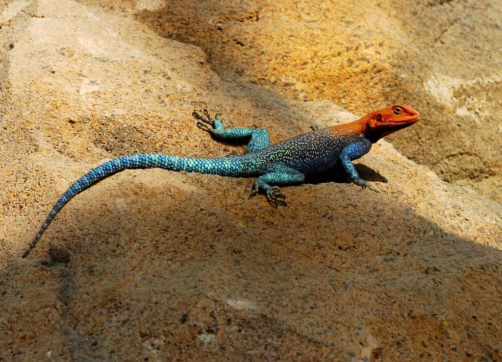

# Animals in the Bible

## License Information

Animals in the Bible © United Bible Societies, 2025. Adapted from: <cite>All Creatures Great and Small: Living Things in the Bible</cite>, by Edward R. Hope © 2005 United Bible Societies. This work is licensed under Creative Commons Attribution-ShareAlike 4.0 International (<a href="https://creativecommons.org/licenses/by-sa/4.0/">https://creativecommons.org/licenses/by-sa/4.0/</a>).

--------------------------------

## Snakes and lizards (id: FAUNA:4)

4 Snakes and lizards
====================

* [4\.1 Introduction](#FAUNA:4.1)
* [4\.2 Reptiles (crawling and creeping things)](#FAUNA:4.2)
* [4\.3 Chameleon](#FAUNA:4.3)
* [4\.4 Cobra](#FAUNA:4.4)
* [4\.5 Gecko](#FAUNA:4.5)
* [4\.6 Lizard](#FAUNA:4.6)
* [4\.7 Monitor](#FAUNA:4.7)
* [4\.8 Skink](#FAUNA:4.8)
* [4\.9 Snake](#FAUNA:4.9)
* [4\.10 Viper](#FAUNA:4.10)

## Introduction to snakes and lizards (id: FAUNA:4.1)

4\.1 Introduction to snakes and lizards
=======================================

**A. Snakes**

There are at least forty snake species found in the Middle East and adjacent areas of Africa. Some are small, being only about 15 centimeters (6 inches) long, while others may reach 2 meters (6 feet) in length. They live in a variety of habitats, from desert sand to rocky wadis, thick undergrowth, and river banks, with different species preferring their own type of environment. The snakes of this region include representative species of all of the major snake families except the rattlesnake.

Many of these Middle Eastern snake species are non\-poisonous, but the biblical writers, in common with many other peoples around the world, had the traditional belief that all were poisonous. In fact this region has a higher proportion of poisonous species than most other areas of the world. Like many other people too, the Jews and early Christians had a great fear of snakes of all kinds. Thus there is no reference in the Bible to harmless snakes.

It is unlikely that the biblical writers would have differentiated between many of the individual species. It is more likely that they only made a distinction between the types of snake that were most common. There were, of course, also general words that included all types.

Some scholars claim that the ancient biblical writers believed that when a snake bit someone, the snake’s tongue stung him at the same time, and that it was this sting that poisoned the man. Others, however, believe that while the poison was certainly associated with the snake’s tongue, the verb “sting” was in fact just the Hebrew way of referring to the rather special way a snake bites. This would be supported by the fact that in many languages around the world the word for a snake’s bite is different from the usual word “bite". In these languages the words used are equivalent to “peck", “stab", “burn", “sting", and such like.

In fact, as most readers will know, snake poison is produced not by the tongue but by glands situated between the snake’s mouth and its eyes, and the poison is conveyed through tube\-like vessels to the fangs, which are hollow in some species and deeply grooved in others. When the snake bites, muscles force the liquid poison from the glands into the fangs, thus injecting the poison into the victim.

All snakes are carnivorous, with some small species eating insects and worms, while the rest may eat frogs, mice, birds and bird eggs, lizards, and other snakes. Without exception this food is swallowed whole. The snake is able to dislocate its jaw, making it possible to open the jaw very wide, and the muscles and skin around the neck are flexible enough to allow the prey to pass. However, snakes eat only very seldom, and some larger snakes are known to have gone many months without food. Even those that eat more frequently do so only every three or four days.

All snakes lay eggs, but in the case of vipers the eggs are kept inside the female until they hatch. There are thus snakes that appear to give birth to live young, as well as those that lay clutches of eggs.

Snake charming has a very long history and was well known in Bible times. The snake usually chosen for this purpose was the Egyptian cobra, which is a large snake with the ability to spread its neck into a flat hood when it adopts the upright threatening posture typical of the cobra family. It also has striking markings on the hood. The charmer uses a flute\-like musical instrument that he plays. The snake begins to emerge from a basket or clay pot and is then hypnotized by the charmer, and begins to mimic the charmer’s movements. It was believed that it was the charmer’s magical music that produced this effect. Modern experiments have shown that the cobra is actually deaf but is sensitive to the vibrations produced by the music. However, it is not the music alone which produces the trance, but the swaying motions that the charmer makes with the flute.

The various Hebrew words for snake all contain sounds similar to the puffs and hisses made by snakes. This makes it difficult to associate a name with a particular species. However, with some of the names that occur repeatedly, the contexts help somewhat to make a tentative identification of the type of snake.

**B. Lizards**

There are at least forty species and subspecies of lizard found in the land of Israel, and the Hebrew words, rather than differentiating between them all, seem to make distinctions only between the more obvious main groups of species. Most of these names occur only once, in the list of unclean foods in Leviticus, so identification is only very speculative. In spite of this, however, there is some agreement among scholars about the types of lizard mentioned. This is because the Hebrew words are fairly descriptive, and one can identify a type of lizard with the descriptive name in many cases.

Rather than trying to list the different kinds, TEV (Today's English Version (Good News Bible)) sums up the whole list in as “lizards". As a last resort translators can use this option, but since the Hebrew list is specific, an attempt should first be made to find specific equivalents in the translation.

## Reptiles (crawling and creeping things) (id: FAUNA:4.2)

4\.2 Reptiles (crawling and creeping things)
============================================

References:
-----------

Hebrew זחל (zachal)

[DEU 32:24](https://ref.ly/Deut32:24), [MIC 7:17](https://ref.ly/Mic7:17)

Hebrew רֶמֶשׂ (remes)

[GEN 1:24](https://ref.ly/Gen1:24), [GEN 1:25](https://ref.ly/Gen1:25), [GEN 1:26](https://ref.ly/Gen1:26), [GEN 6:7](https://ref.ly/Gen6:7), [GEN 6:20](https://ref.ly/Gen6:20), [GEN 7:14](https://ref.ly/Gen7:14), [GEN 7:23](https://ref.ly/Gen7:23), [GEN 8:19](https://ref.ly/Gen8:19), [GEN 9:3](https://ref.ly/Gen9:3), [1KI 5:13](https://ref.ly/1Kgs5:13), [PSA 104:25](https://ref.ly/Ps104:25), [PSA 148:10](https://ref.ly/Ps148:10), [EZK 8:10](https://ref.ly/Ezek8:10), [EZK 38:20](https://ref.ly/Ezek38:20), [HOS 2:20](https://ref.ly/Hos2:20), [HAB 1:14](https://ref.ly/Hab1:14)

Hebrew שֶׁרֶץ (sherets)

[GEN 7:21](https://ref.ly/Gen7:21), [LEV 5:2](https://ref.ly/Lev5:2), [LEV 11:10](https://ref.ly/Lev11:10), [LEV 11:20](https://ref.ly/Lev11:20), [LEV 11:21](https://ref.ly/Lev11:21), [LEV 11:23](https://ref.ly/Lev11:23), [LEV 11:29](https://ref.ly/Lev11:29), [LEV 11:31](https://ref.ly/Lev11:31), [LEV 11:41](https://ref.ly/Lev11:41), [LEV 11:42](https://ref.ly/Lev11:42), [LEV 11:43](https://ref.ly/Lev11:43), [LEV 11:44](https://ref.ly/Lev11:44), [LEV 22:5](https://ref.ly/Lev22:5)

Greek ἑρπετόν (herpeton)

[ACT 10:12](https://ref.ly/John10:12), [ACT 11:6](https://ref.ly/John11:6), [ROM 1:23](https://ref.ly/Acts1:23), [JAS 3:7](https://ref.ly/Heb3:7), [WIS 11:15](https://ref.ly/EsthGr11:15), [WIS 17:9](https://ref.ly/EsthGr17:9), [SIR 10:11](https://ref.ly/Wis10:11), [LJE 1:19](https://ref.ly/Bar1:19)

Latin reptilis

[2ES 6:53](https://ref.ly/1Esd6:53)

Discussion:
-----------

The Hebrew words *zachal* and *remes* literally mean “creeping \[things]” or “crawling \[things]", which is the Hebrew way of referring to small unclean creatures, reptiles in particular. The Hebrew word *sherets* literally means “swarming things” and refers to mammals and reptiles that move close to the ground in groups or swarms. In Israel some vipers give birth to live offspring that live near each other until full maturity. They congregate near each other again at mating time. These vipers are included in the term *sherets*. The Greek word *herpeton* is also a general word for reptile; it includes snakes and lizards. All of the Hebrew, Greek, and Latin words usually exclude fish, the one possible exception being [GEN 1:20](https://ref.ly/Gen1:20).

Special significance or symbolism:
----------------------------------

The Hebrew words carry the connotation of uncleanness.

Translation:
------------

In languages which have a word meaning “reptile", this will fit most contexts. In languages which do not, phrases such as “snakes and lizards", “wriggling things", and so forth could be used.

* **Associated Passages:** Deuteronomy 32:24; Micah 7:17; Genesis 1:24; Genesis 1:25; Genesis 1:26; Genesis 6:7; Genesis 6:20; Genesis 7:14; Genesis 7:23; Genesis 8:19; Genesis 9:3; 1 Kings 5:13; Psalms 104:25; Psalms 148:10; Ezekiel 8:10; Ezekiel 38:20; Hosea 2:20; Habakkuk 1:14; Genesis 7:21; Leviticus 5:2; Leviticus 11:10; Leviticus 11:20; Leviticus 11:21; Leviticus 11:23; Leviticus 11:29; Leviticus 11:31; Leviticus 11:41; Leviticus 11:42; Leviticus 11:43; Leviticus 11:44; Leviticus 22:5; Acts 10:12; Acts 11:6; Romans 1:23; James 3:7; Wisdom of Solomon 11:15; Wisdom of Solomon 17:9; Sirach 10:11; Letter of Jeremiah 1:19; 2 Esdras (Latin) 6:53; Genesis 1:20

## Chameleon (id: FAUNA:4.3)

4\.3 Chameleon
==============

Reference:"
-----------

Hebrew תִּנְשֶׁמֶת (tinshemeth)

[LEV 11:30](https://ref.ly/Lev11:30)

Discussion:
-----------

This word appears in the list of unclean birds as well as in the list of lizards, and it seems quite clear that an owl and a reptile had the same name. Giving quite different creatures the same name is a common phenomenon in many languages. For instance, in English the word “cob” is used for a male swan as well as for a type of riding horse, and “sable” is the name of a small carnivorous animal as well the name of a large antelope; in Dutch “duiker” is the name of both the cormorant (a bird) and a type of antelope.

The Hebrew name *tinshemeth* is derived from a verb that means “to pant or to breathe loudly". This makes it very likely that the reference is to the chameleon. When annoyed, hurt, or in danger, the chameleon turns black, inflates its large lungs, making itself look bigger, and then opens its mouth, puffing and hissing like a snake. See also [3\.17\.8 Tinshemeth](#FAUNA:3.17.8), a type of owl.

Description:
------------

The Chameleon *Chamaeleo chamaeleon* is a very interesting lizard. It lives in vegetation. It is basically green but can change color to match its environment. It can become brown, pale yellow, or gray, and can vary the shade at different points of its body so as to become mottled or to have patches of dark and light color. This gives it good camouflage in vegetation. It is slow moving, often moving only one limb at a time in a series of wavering movements, mimicking the movement of twigs in the breeze. It has opposed claws on each foot, enabling it to hold very tight and to walk along thin twigs.

It has small scales and many small wart\-like lumps on its tough skin. It has a row of pointed scales down its spine. Some species of chameleon have horn\-like protrusions on their heads and faces.

The chameleon’s eyes are unique. It has an eyelid that completely covers the eye except for a small hole for the chameleon to see through. The chameleon can move this aperture around with each eyelid working independently of the other, and this enables it to look in two directions at once. It feeds on insects by catching them with its long, sticky, elastic tongue, which it flicks at the prey. The chameleon is also able to use its tail to wrap around twigs and other things to support itself when the wind blows or when climbing at a steep angle. It can hang by this tail from a twig or small branch and often uses this technique to move from a higher branch to a lower one.

Special significance or symbolism:
----------------------------------

It is listed as an unclean animal.

Translation:
------------

Chameleons are found all over Africa except in desert areas, and in some parts of tropical Asia. Where chameleons are not known, it may be necessary to borrow a word from the dominant language of the area, or from Hebrew, as JB (Jerusalem Bible (1966)) has done. A phrase such as “slow lizard” or “puffer lizard” is another option.

* **Associated Passages:** Leviticus 11:30

## Cobra (id: FAUNA:4.4)

4\.4 Cobra
==========

References:
-----------

Hebrew פֶּתֶן (pethen)

[DEU 32:33](https://ref.ly/Deut32:33), [JOB 20:14](https://ref.ly/Job20:14), [JOB 20:16](https://ref.ly/Job20:16), [PSA 58:5](https://ref.ly/Ps58:5), [PSA 91:13](https://ref.ly/Ps91:13), [ISA 11:8](https://ref.ly/Isa11:8)

Hebrew צֶפַע, צִפְעוֹנִי (tsefa‘, tsif‘oni)

[PRO 23:32](https://ref.ly/Prov23:32), [ISA 11:8](https://ref.ly/Isa11:8), [ISA 14:29](https://ref.ly/Isa14:29), [ISA 59:5](https://ref.ly/Isa59:5), [JER 8:17](https://ref.ly/Jer8:17)

Greek ἀσπίς (aspis)

[ROM 3:13](https://ref.ly/Acts3:13)

Discussion:
-----------

There is general agreement among modern scholars that the word *pethen* refers to the cobra, since the word is closely associated with snake charming, which requires a snake that can raise the front part of its body vertically, something a viper cannot do. The words *tsif‘oni* and *tsefa‘* are also probably references to a type of cobra. This can be well supported by the contexts in which the word occurs, in which reference is made to the fact that it lives in holes and lays eggs. These contexts would rule out any of the vipers.

There is some evidence that *pethen* was the earlier name for the cobra, and *tsefa‘* and *tsif‘oni* were later names. Something similar is the case with English, where “cobra” has been in use only for the last one hundred years, and previously “asp” was used.

"Adder” is used as the name for some of the subspecies of viper and is probably not the best word to translate these three Hebrew words.

Description:
------------

Cobras are characterized by their ability to spread the ribs in their neck area, so as to form a broad flat profile called the hood. This makes the snake look much thicker than it really is. Cobras also have short fixed fangs in the front of their mouths. The cobra that is found in the land of Israel is the Desert Cobra or Walter Innes’s snake (*Walterinnesia aegyptia*), while the cobra found in Egypt is the Egyptian Cobra *Naja haje*. The cobra is a large snake, reaching 2 meters (6 feet) in length, and about 50 millimeters (2 inches) in diameter. It is dark brown with a yellowish underside. In some areas where it is found it has broad yellowish bands, which give it its alternative English name, banded cobra. When it rears up and spreads its hood, the hood has a yellowish background, but displays a broad dark brown horizontal stripe.

Its bite is very poisonous, and it takes quick effect, acting on the nervous system. The cobra feeds on mice, gerbils, birds, bird’s eggs, lizards, frogs, and other snakes. It hunts by following scent trails, which it senses with its tongue. When within range of its prey, it raises its head slowly vertically, and suddenly strikes at the unsuspecting victim. It lives mainly in grassland and where the vegetation is fairly thick. It takes cover in rat holes, holes in eroded banks, hollow trees, under logs, and among exposed roots. It may lay its eggs in any of these sheltered places. In cold weather it coils itself up to preserve its body heat.

Special significance or symbolism:
----------------------------------

The cobra, besides being a symbol of lurking danger, was also closely associated with Egypt. In some poetic passages, therefore, it is a metaphor for the enemies of Israel, Egypt in particular.

Translation:
------------

The Egyptian cobra is found all over Africa, and a local word should not be difficult to find. In South and Southeast Asia a word for the King Cobra *Naja hannah* or one of the other cobras would be a good equivalent. In areas where these cobras are symbols of good luck and the presence of a deity, the Hebrew symbolism might need to be explained in a footnote. In other parts of the world, if cobras are unknown, the name of a local long poisonous snake of a type different from vipers and adders is a possible choice.

In passages where snakes are referred to as “stinging", it is not necessary to use a verb meaning literally “to sting". This is just the Hebrew way of referring to the bite of a snake. As mentioned in the introduction to this chapter, in many languages the verb used for a snake’s bite is different from the one used to refer to the bite of something else, such as a dog.

[ISA 14:29](https://ref.ly/Isa14:29): This verse is poetic and contains a reference to sticks becoming snakes, and snakes producing even more dangerous ones. A literal translation is “Do not rejoice, all you Philistines, that the rod of striking is broken. From the snake root will spring forth a cobra; its fruit will be a flying viper". The expression “snake root” is a play on words and refers to the “root” of the broken stick and to the snake as the “root” or origin of the cobra. The verse can be restated as:

Do not rejoice, all you Philistines,

That the rod that struck you is broken.

The broken end is a snake.

The snake will produce a cobra,

It will produce a poisonous flying viper.

See [4\.10 Viper](#FAUNA:4.10) for note on “flying” viper.

* **Associated Passages:** Deuteronomy 32:33; Job 20:14; Job 20:16; Psalms 58:5; Psalms 91:13; Isaiah 11:8; Proverbs 23:32; Isaiah 14:29; Isaiah 59:5; Jeremiah 8:17; Romans 3:13

## Gecko (id: FAUNA:4.5)

4\.5 Gecko
==========

References:
-----------

Hebrew אֲנָקָה (’anaqah)

[LEV 11:30](https://ref.ly/Lev11:30)

Hebrew שְׂמָמִית (semamith)

[PRO 30:28](https://ref.ly/Prov30:28)

Discussion:
-----------

Translations generally agree that *’anaqah* indicates the gecko. There are many different species of gecko in the land of Israel, ranging from the fairly large Rock Gecko *Ptyodactylus hasselquistii* to the small Turkish Gecko or Mediterranean Gecko *Hemidactylus turcicus*, which is only about 10 centimeters (4 inches) long. *’Anaqah* is probably a general word for all kinds of gecko. The word is related to a verb meaning “to cry out", and it is this that gives the clue to the identification of the name.

Description:
------------

Geckos are the only lizards that call. The name “gecko” is borrowed from the Malay word *getjok*, which mimics the call of one type of gecko. In many languages the names for the different kinds of gecko also mimic their two syllable calls. For instance, in Thai the giant gecko is called *tuk\-gae* and the house gecko *ching\-chok*.

Besides their distinctive calls, all geckos are characterized by the knobs on the end of their toes. These pads are covered in microscopic hairs that catch on any slight roughness of the surface and enable the geckos to walk upside down on ceilings and overhangs.

Geckos feed on ants, moths, beetles, flies, mosquitoes, and other insects. The males often fight, and one may end up with the detached tail of the other in its mouth. This too may be eaten. Some of the larger geckos also eat small lizards and small snakes.

Special significance or symbolism:
----------------------------------

Geckos are listed as unclean. In the context of [PRO 30:28](https://ref.ly/Prov30:28) the gecko is a symbol of an insignificant creature that associates freely with royalty.

Translation:
------------

Geckos are found throughout Africa, the Middle East, southeastern Europe, Asia, and the tropical parts of Australia. In these areas it will not be hard to find a local word. In areas where they are not found, a word borrowed from Hebrew or the dominant language of the area can usually be combined with the word for lizard; for example, “anaka lizard” or “gecko lizard".

While KJV (King James Version (1611)) has “spider” for *semamith* at [PRO 30:28](https://ref.ly/Prov30:28), other translations and commentators are unanimous in interpreting this word as “lizard". It probably is a reference to the house gecko, which is the most common lizard found inside houses. Most modern commentators take the verb to be a passive in this verse, that is, “the lizard, which can be held \[or, caught] in the hand."

* **Associated Passages:** Leviticus 11:30; Proverbs 30:28

## Lizard (id: FAUNA:4.6)

4\.6 Lizard
===========

References:
-----------

Hebrew לְטָאָה (leta’ah)

[LEV 11:30](https://ref.ly/Lev11:30)

Hebrew צָב (tsav)

[LEV 11:29](https://ref.ly/Lev11:29)

Discussion:
-----------

There is a reasonably strong consensus among scholars that *leta’ah* refers to the lacertid and agama lizards, both of which are common and fairly obvious in Israel. The lacertids are soft\-skinned lizards that live in close proximity to roads and houses. One of the more colorful is the Syrian Green Lizard *Lacerta trilineata*, which lives in orchards and woods. The most common of the agamas is the Rainbow Agama *Agama stellio*, which is very common around houses and on walls and rocks.

Most scholars agree that *tsav* is the name for the dab or thorn\-tailed lizards of which there are many species in Israel. Two of the most common are the Egyptian Thorn\-tailed Lizard *Uromastyx aegyptia* and the Colored Thorn\-tailed Lizard *Uromastyx ornata*. The name “dab” is an English version of their Arabic name *dhubb* or *dhabb*, which is reflected in the Hebrew *tsav*.

Description:
------------

Lacertid lizards (*leta’ah*) are fairly small, about 15–20 centimeters (6–8 inches) long, and they have a shiny smooth skin. Syrian green lizards have dark green spots on a lighter green background, with a yellow\-green belly. They feed on flies, gnats, mosquitoes, and ants.

The rainbow agama is much larger, reaching 50–60 centimeters (20–24 inches) in length. In the breeding season the male develops bright colors, with a blue tail, green body, and bright orange or bright green head, dependent on the subspecies. The females and non\-breeding males are a dull gray color. All agamas are characterized by the fact that they bob their heads vigorously by doing “push\-ups” with their front legs. They have long, fairly stiff tails, which they raise when they run. They feed on a wide variety of insects and also prey on smaller lizards. In most of the Arab\-speaking world they are known as *hardoun* lizards. Some agamas have the ability to change color to match their surroundings in the same way that chameleons do.

The thorn\-tailed lizards (*tsav*) are relatively large desert lizards with a length of about 65 centimeters (26 inches). They have a fairly thick, squat appearance and have a thick short tail covered with sharp spikes, which are actually cone\-shaped scales. They use this tail for defense. They often crawl into holes or cracks in rocks and then block the entrance with their thorny tail. They are vegetarian, eating various succulent desert plants. Even though they are on the list of unclean foods, they are commonly eaten by Arabs and Bedouin, who keep them in cages and fatten them.

Special significance or symbolism:
----------------------------------

They are listed as unclean.

Translation:
------------

Agamas are found throughout Africa and in tropical Asia. Lacertids are found all over Europe. Elsewhere a general word for lizard can be used.

For *tsav* a phrase, such as “big thorny lizard” or “big lizard with a thorny tail", is usually the best option. Where languages differentiate between smaller lizards and monitor lizards, “thorny monitor” or “monitor with a thorny tail” will better convey the idea of large size.

* **Associated Passages:** Leviticus 11:30; Leviticus 11:29

## Monitor (id: FAUNA:4.7)

4\.7 Monitor
============

Reference:"
-----------

Hebrew כֹּחַ (koach)

[LEV 11:30](https://ref.ly/Lev11:30)

Discussion:
-----------

The English versions (KJV (King James Version (1611)) “chameleon"; RSV (Revised Standard Version (1952)) “land crocodile"; NEB (New English Bible (1970)) “sand\-gecko"; JB (Jerusalem Bible (1966)) “koach"; NIV (New International Version (1984)) “monitor lizard"; REB (Revised English Bible (1989)) “sand\-gecko"; NAB (New American Bible (1970)) “chameleon") reflect the fact that no certain identification can be made of what lizard this is. The RSV (Revised Standard Version (1952)) term “land crocodile” is the same lizard as the “monitor lizard” of NIV (New International Version (1984)). This suggestion has the most support among modern scholars. The Hebrew name is related to a root meaning “strength,” which could well apply to either the Desert Monitor *Varanus griseus* or the Nile Monitor *Varanus niloticus*. The latter creature is not found in Israel, but it would have been well\-known from Egypt. Both of these giant lizards are related to the iguanas.

If this word means “chameleon", then the reference is probably to the strength of its grip. It has claws that can close around twigs, with three toes on one side opposed to two on the other, giving it a very tenacious grip. However, this interpretation is not as likely as “monitor lizard".

Description:
------------

The desert monitor is one of the largest lizards in the world, reaching a total length of nearly 1\.2 meters (4 feet) in Israel and even longer in other countries. They are powerful, but normally slow\-moving, except when escaping from danger. They are carnivorous, eating a wide variety of prey, including insects, mice, snakes, lizards, birds’ eggs, nestlings, and carrion from animal carcasses. They are a greyish brown and live in desert and savannah semidesert regions.

The Nile or water monitor is very similar in appearance, but it lives near rivers and in thicker vegetation. It includes turtle and crocodile eggs in its diet.

Special significance or symbolism:
----------------------------------

They are listed as unclean.

Translation:
------------

Either monitor lizards or iguanas are found in many countries of the world in the warmer parts of all continents and in Australia (where they are called goannas). In these areas a local word will not be hard to find. Elsewhere a phrase such as “giant lizard” can be used.

* **Associated Passages:** Leviticus 11:30

## Skink (id: FAUNA:4.8)

4\.8 Skink
==========

Reference:"
-----------

Hebrew חֹמֶט (chomet)

[LEV 11:30](https://ref.ly/Lev11:30)

Discussion:
-----------

There is considerable doubt about the meaning of this word, but since skinks are very plentiful in Israel and North Africa, one would expect them to be in any list of the region’s lizards. Thus there is some justification for the NIV (New International Version (1984)) and NAB (New American Bible (1970)) rendering.

Description:
------------

Skinks are generally thin and streamlined and have smooth shiny skins. There are small and large species, with the smaller types about 10 centimeters (4 inches) long, while the largest desert skinks reach 50 centimeters (20 inches) in length. Skinks have shorter legs than most other types of lizard, and this gives them a rather snake\-like appearance. Some species have no legs at all. Species that live in the desert sand move through the sand with a swimming motion. Other species live in houses or among rocks, typically hiding in cracks and under stones or rocks. A few species live in holes and are very fast runners. They eat insects such as flies, moths, ants, and others; they occasionally eat each others’ tails as well.

Most skinks are grey or light brown, and many have longitudinal stripes.

Special significance or symbolism:
----------------------------------

They are listed as an unclean animal.

Translation:
------------

Skinks are found virtually worldwide outside of the Arctic and Antarctic regions, and a local word is often easy to find. In many languages, however, skinks are not differentiated from other lizards, and a phrase such as “smooth lizard” or “thin lizard” may be the best equivalent.

* **Associated Passages:** Leviticus 11:30

## Snake (id: FAUNA:4.9)

4\.9 Snake
==========

References:
-----------

Hebrew נָחָשׁ (nachash)

[GEN 3:1](https://ref.ly/Gen3:1), [GEN 3:2](https://ref.ly/Gen3:2), [GEN 3:4](https://ref.ly/Gen3:4), [GEN 3:13](https://ref.ly/Gen3:13), [GEN 3:14](https://ref.ly/Gen3:14), [GEN 49:17](https://ref.ly/Gen49:17), [EXO 4:3](https://ref.ly/Exod4:3), [EXO 7:15](https://ref.ly/Exod7:15), [NUM 21:6](https://ref.ly/Num21:6), [NUM 21:7](https://ref.ly/Num21:7), [NUM 21:9](https://ref.ly/Num21:9), [DEU 8:15](https://ref.ly/Deut8:15), [2KI 18:4](https://ref.ly/2Kgs18:4), [JOB 26:13](https://ref.ly/Job26:13), [PSA 58:5](https://ref.ly/Ps58:5), [PSA 140:4](https://ref.ly/Ps140:4), [PRO 23:32](https://ref.ly/Prov23:32), [PRO 30:19](https://ref.ly/Prov30:19), [ECC 10:8](https://ref.ly/Eccl10:8), [ECC 10:11](https://ref.ly/Eccl10:11), [ISA 14:29](https://ref.ly/Isa14:29), [ISA 27:1](https://ref.ly/Isa27:1), [ISA 65:25](https://ref.ly/Isa65:25), [JER 8:17](https://ref.ly/Jer8:17), [JER 46:22](https://ref.ly/Jer46:22), [AMO 5:19](https://ref.ly/Amos5:19), [AMO 9:3](https://ref.ly/Amos9:3), [MIC 7:17](https://ref.ly/Mic7:17)

Hebrew תַּנִּין (tanin)

[EXO 7:9](https://ref.ly/Exod7:9), [EXO 7:10](https://ref.ly/Exod7:10), [EXO 7:12](https://ref.ly/Exod7:12), [DEU 32:33](https://ref.ly/Deut32:33), [PSA 91:13](https://ref.ly/Ps91:13)

Greek δράκων (drakōn)

[ESG 1:1](https://ref.ly/Jdt1:1), [ESG 10:3](https://ref.ly/Jdt10:3), [WIS 16:10](https://ref.ly/EsthGr16:10), [SIR 25:16](https://ref.ly/Wis25:16), [BEL 1:23](https://ref.ly/Sus1:23), [BEL 1:25](https://ref.ly/Sus1:25), [BEL 1:27](https://ref.ly/Sus1:27), [BEL 1:28](https://ref.ly/Sus1:28), [ODA 2:33](https://ref.ly/AddPs2:33), [PSS 2:25](https://ref.ly/Odes2:25)

Greek ἑρπετόν (herpeton)

[WIS 11:15](https://ref.ly/EsthGr11:15), [WIS 17:9](https://ref.ly/EsthGr17:9), [SIR 10:11](https://ref.ly/Wis10:11), [LJE 1:19](https://ref.ly/Bar1:19)

Greek ὄφις (ofis)

[MAT 7:10](https://ref.ly/Matt7:10), [MAT 10:16](https://ref.ly/Matt10:16), [MAT 23:33](https://ref.ly/Matt23:33), [MRK 16:18](https://ref.ly/Matt16:18), [LUK 10:19](https://ref.ly/Mark10:19), [LUK 11:11](https://ref.ly/Mark11:11), [JHN 3:14](https://ref.ly/Luke3:14), [1CO 10:9](https://ref.ly/Rom10:9), [2CO 11:3](https://ref.ly/1Cor11:3), [REV 9:19](https://ref.ly/Jude9:19), [REV 12:9](https://ref.ly/Jude12:9), [REV 12:14](https://ref.ly/Jude12:14), [REV 12:15](https://ref.ly/Jude12:15), [REV 20:2](https://ref.ly/Jude20:2), [WIS 16:5](https://ref.ly/EsthGr16:5), [SIR 21:2](https://ref.ly/Wis21:2), [SIR 25:15](https://ref.ly/Wis25:15), [4MA 18:8](https://ref.ly/3Macc18:8), [PSS 4:9](https://ref.ly/Odes4:9)

Discussion:
-----------

The word “serpent” is a fairly archaic English word, once meaning any kind of reptile, but later only used for snakes. It is no longer used in everyday speech to refer to actual snakes but only to mythological ones and representations of them, especially representations on badges, crests, and flags. It is therefore somewhat strange to find “serpent” in modern English translations, where actual snakes are referred to in the original text. In some of these translations, NAB (New American Bible (1970)) for example, “serpent” is used in the Old Testament and “snake” in the New Testament.

The Hebrew and Greek words are general terms including all types of snake. In [ISA 27:1](https://ref.ly/Isa27:1) some scholars interpret the word *nachash* as meaning “reptile” or “dragon” rather than “snake". NAB (New American Bible (1970)) also has this meaning in [JER 46:22](https://ref.ly/Jer46:22).

In the nineteenth century Canon Tristram reported hearing from Arabs that snakes, especially cobras, could be rendered unconscious in a rigid spasm by squeezing certain nerves on the side of their necks. In this state the snake was said to become like a stick. Some ancient pictures seem to illustrate people doing this. Tristram went on to say that he had not observed this phenomenon personally. However, in recent years this technique has been demonstrated on film. It may be of relevance for the accounts in Exodus of people turning rods into snakes and vice versa.

See also [4\.4 Cobra](#FAUNA:4.4) and [4\.10 Viper](#FAUNA:4.10).

Description:
------------

Snakes are reptiles, that is, they have no internal mechanism to control the temperature of their blood and have to rely on the sun to do this. They have no legs but propel themselves by wriggling or by gliding along by moving their skin in combination with their many ribs, so that their scales hook onto any small irregularities on the surface they are moving on. This means of moving along is not very obvious, and snakes seem to many peoples to move magically or at least mysteriously. This and the fact that many of them have a poisonous bite have caused many peoples, including the ancient biblical peoples, to have a superstitious dread of them.

Special significance or symbolism:
----------------------------------

To the biblical writers snakes were a symbol of lurking, unexpected danger. The belief that snakes had poisonous tongues led people to associate them with lies, deception, and misleading teaching, as epitomized by the Devil himself, who is portrayed as a deceiving snake in [REV 12:9](https://ref.ly/Jude12:9).

Furthermore, since the cobra was the symbol of one of the major Egyptian goddesses, snakes also had connotations of heathen religion. To the Egyptians the snake was a symbol of long life. In some contexts in the Bible the snake is a symbol for Egypt.

In the New Testament, besides the above, the snake becomes a symbol for cunning wisdom.

Translation:
------------

Snakes are found all over the world, except in the far Northern and Southern Hemispheres, where the lengthy cold winters are unsuited to their existence. In most languages a general word for snake is not difficult to find. In some languages there are two general words for snake, one for the viper/adder type and the other for longer, slimmer snakes, including cobras, mambas, pythons, and boas. In such cases the latter word is preferable in most general contexts.

The references to “fiery snakes” should probably be interpreted as referring to the effects of the snake’s bite rather than to its appearance; for example, “snakes that can burn people like fire."

[JER 46:22](https://ref.ly/Jer46:22) means “she \[Egypt] will hiss like a retreating snake."

[ECC 10:11](https://ref.ly/Eccl10:11) means “if the snake bites before it is charmed, that \[the bite] is all the income the snake charmer gets."

In most contexts the word *tanin* is translated as “dragon” or “whale” in KJV (King James Version (1611)) and RSV (Revised Standard Version (1952)) and as “sea monster” in the other versions. However, the word is traditionally translated as “serpent” or “snake” in [EXO 7:0](https://ref.ly/Exod7:0), and in [DEU 32:33](https://ref.ly/Deut32:33) and [PSA 91:13](https://ref.ly/Ps91:13), where the word occurs in parallel with another word for “snake".

While *tanin* probably does refer to a sea monster, it most likely means “snake” in the passages mentioned. It is impossible to identify the actual type of snake referred to, and most scholars take this word to have the same meaning in these particular contexts as the more usual word *nachash*. In other words it is an alternative word for snakes in general. See also [7\.2 Dragon, sea monster](#FAUNA:7.2).

Another possibility has been suggested by Jewish scholars in their commentaries on Exodus. They note that, while in Moses’ rod is said to turn into a *nachash* in the desert, along the banks of the Nile ([EXO 7:0](https://ref.ly/Exod7:0)) Aaron’s rod turns into a *tanin*, which they interpret to mean “crocodile". Each miracle would then be appropriate to its setting: a snake in the desert, a crocodile by the river. One scholar also points out that in [EZK 29:3](https://ref.ly/Ezek29:3) Pharaoh is called “the great crocodile \[*tanim* \< *tanin* ] that lies in the midst of his rivers,” and that the Egyptians used to worship the crocodile. While no translation has adopted this proposal, it should be given serious consideration.

The problematic Hebrew word *qipoz*, which occurs only in [ISA 34:15](https://ref.ly/Isa34:15), has been associated by some scholars with a snake. The English Revised Version has “arrowsnake", and JB (Jerusalem Bible (1966)) has “viper". Rather strangely, the name “arrowsnake” is associated with *qipoz* because the word is said to be derived from a verb *qafaz* (*qafats*), which means “to leap.” *Fauna and Flora of the Bible* even has this note: “The arrowsnake is a serpent which is able to coil itself back and dart forward quickly like an arrow, or to leap from a tree.” In fact the arrowsnake *Eryx jaculus*, more correctly called the javelin sand boa, is so\-called, not because it can leap, but because it has a small head that is hard to distinguish from its narrow tail; that is, it is pointed at both ends of its fairly thick body like a javelin. It belongs to the category of snakes called constrictors, which coil around their prey and suffocate them by crushing the breath out of them. It lives in the sand and among rocks, rather than in trees, and is slow\-moving. It reaches about 75 centimeters (30 inches) in length. Nevertheless, the context of the verse and the other words used in poetic parallelism to it indicate fairly conclusively that *qipoz* is better interpreted as a bird. See [3\.17\.6 Qipoz](#FAUNA:3.17.6).

* **Associated Passages:** Genesis 3:1; Genesis 3:2; Genesis 3:4; Genesis 3:13; Genesis 3:14; Genesis 49:17; Exodus 4:3; Exodus 7:15; Numbers 21:6; Numbers 21:7; Numbers 21:9; Deuteronomy 8:15; 2 Kings 18:4; Job 26:13; Psalms 58:5; Psalms 140:4; Proverbs 23:32; Proverbs 30:19; Ecclesiastes 10:8; Ecclesiastes 10:11; Isaiah 14:29; Isaiah 27:1; Isaiah 65:25; Jeremiah 8:17; Jeremiah 46:22; Amos 5:19; Amos 9:3; Micah 7:17; Exodus 7:9; Exodus 7:10; Exodus 7:12; Deuteronomy 32:33; Psalms 91:13; Esther Greek 1:1; Esther Greek 10:3; Wisdom of Solomon 16:10; Sirach 25:16; Bel and the Dragon 1:23; Bel and the Dragon 1:25; Bel and the Dragon 1:27; Bel and the Dragon 1:28; Odae/Odes 2:33; Psalms of Solomon 2:25; Wisdom of Solomon 11:15; Wisdom of Solomon 17:9; Sirach 10:11; Letter of Jeremiah 1:19; Matthew 7:10; Matthew 10:16; Matthew 23:33; Mark 16:18; Luke 10:19; Luke 11:11; John 3:14; 1 Corinthians 10:9; 2 Corinthians 11:3; Revelation 9:19; Revelation 12:9; Revelation 12:14; Revelation 12:15; Revelation 20:2; Wisdom of Solomon 16:5; Sirach 21:2; Sirach 25:15; 4 Maccabees 18:8; Psalms of Solomon 4:9; Exodus 7:0; Ezekiel 29:3; Isaiah 34:15

## Viper (id: FAUNA:4.10)

4\.10 Viper
===========

References:
-----------

Hebrew אֶפְעֶה (’ef‘eh)

[JOB 20:16](https://ref.ly/Job20:16), [ISA 30:6](https://ref.ly/Isa30:6), [ISA 59:5](https://ref.ly/Isa59:5)

Hebrew שָׂרָף (saraf)

[NUM 21:6](https://ref.ly/Num21:6), [NUM 21:8](https://ref.ly/Num21:8), [DEU 8:15](https://ref.ly/Deut8:15), [ISA 14:29](https://ref.ly/Isa14:29), [ISA 30:6](https://ref.ly/Isa30:6)

Hebrew שְׁפִיפֹן (shefifon)

[GEN 49:17](https://ref.ly/Gen49:17)

Greek ἔχιδνα, ἔχις (echidna, echis)

[MAT 3:7](https://ref.ly/Matt3:7), [MAT 12:34](https://ref.ly/Matt12:34), [MAT 23:33](https://ref.ly/Matt23:33), [LUK 3:7](https://ref.ly/Mark3:7), [ACT 28:3](https://ref.ly/John28:3), [SIR 39:30](https://ref.ly/Wis39:30)

Discussion:
-----------

There are a large number of snake species belonging to the viper family in Israel. From the contexts it is possible in one or two places to identify the particular species, and it is possible that the various Hebrew words actually refer to particular species. However, associating the various words with the corresponding species is largely conjecture, even though based on careful deduction.

The most common vipers in Israel are the Palestinian Viper *Vipera palaestina*, the Carpet Viper *Echis coloratus*, the Sand Viper *Cerastes vipera*, and the Horned Viper *Cerastes cerastes*. The Palestinian viper is the largest of these vipers and is found in a variety of habitats, from the woods of the north to the desert’s edge. Since this is the most inhabited area, people are bitten by this snake more than any other. The other four vipers mentioned are found in desert areas, but in slightly different habitats. The sand viper and the horned viper live in the sand, while the carpet viper lives in gravelly areas and among rocks. It often camouflages itself among dried leaves.

The desert vipers, when moving in sand, cannot move in the normal way, so they adopt a movement known as “sidewinding". They do this by moving a coil sideways to a position in front of the head, then the snake moves its head and the front part of its body in the air, arching over the sand as far as it can reach before falling back onto the sand. Then it repeats the movement again. This is done at some speed, and the snake moves diagonally across the sand surprisingly quickly, although not as quickly as another snake moving normally. The parallel elongated S\-shaped marks it leaves in the sand look as though it has moved in a series of jumps, since they seem not to be connected. It is generally accepted that this motion caused the biblical writers to refer to these snakes as “flying".

Description:
------------

Vipers are different from other snakes mainly in that they give birth to live offspring. The females retain their eggs in a special sac in their bodies, and when the eggs hatch the small snakes emerge from the mother. The larger vipers produce as many as sixty young snakes at a time, while the smaller sand vipers have smaller broods of about twelve to fifteen. This is what John the Baptist refers to by his well\-known phrase “brood of vipers".

The vipers have long hinged fangs located in the front of their mouths. These fangs fold back as they close their mouths. When striking, vipers have to open their mouths very wide in order to get these fangs into the required position.

The carpet viper (also known as the saw\-scaled viper) was very numerous in biblical Israel, and in most other areas of its range (it is found in a broad continuous band from West Africa to South and Central Asia). It is likely that this was the *saraf*, a name derived from a finite verb meaning “to burn something,” a reference to the burning effect of its poisonous bite.

This snake occurs in two slightly different forms. The most common type in Israel and the Sinai Peninsula is a reddish brown snake with a pale underside. It has a row of pale blotches arranged side\-by\-side in pairs all the way down its back. These blotches give it excellent camouflage. It grows to about 80 centimeters (32 inches) in length, and its head is smaller and its body thinner than most typical vipers. It is very easily provoked and quite an aggressive snake. It is mainly active in the daytime, as it can stand higher temperatures than many other snakes. It lives in desert and grassland areas and feeds on jerboas, mice, and mole rats. Its venom, like that of most vipers, is highly poisonous, attacking both the blood vessels and the blood corpuscles, but, like the poison of most other vipers, it is slow\-acting.

Carpet vipers move like other snakes on firm surfaces, but in sand they move by side\-winding.

The horned viper is one of the two common sand vipers found in Israel and the Sinai Peninsula. As the species name suggests, these vipers live in sand. They have scales arranged so that with small sideways movements they can bury themselves in the sand, with only their eyes and nostrils showing. This is how they lie in wait for their prey, mainly jerboas and other small rodents. When the sand gets too hot for comfort, they bury themselves even deeper, or they move to the shade of a stone.

The horned viper has an unusually elongated scale above each eye, the “horns". It is a light brown mottled color and moves by sidewinding. It has a broad head and grows to a length of about 75 centimeters (30 inches).

The sand viper is similar in habits to the horned viper, but it is slightly smaller, reaching about 35 centimeters (14 inches) in length in Israel. It is a fairly squat looking snake with a thin neck and tail but a thick body. It is a uniform pale sandy color.

The Palestinian viper is much larger than the other vipers of the Middle East. It grows to about 1\.25 meters (4 feet) in length, and may be 100 millimeters (4 inches) thick. It is a beautifully marked snake, basically a light brown, with a dark brown zigzag stripe with a pale border down the middle of its back. It also has dark brown blotches with pale borders on each side of the zigzag stripe. Its head is striped.

This snake feeds on mice, toads, and frogs and is often found close to human dwellings. It lives under stones or in vegetation. As mentioned above, more people are bitten by this snake than any other. It is likely that this is the snake referred to by the Greek word *echidna*.

Special significance or symbolism:
----------------------------------

Vipers have the same basic significance in the Bible as other snakes, (see above) with one additional feature. Since the young are carried alive inside the female viper, which then gives birth to large numbers of well\-developed young, all at the same time, the viper was associated with fertility. This was also their significance in the Egyptian and Canaanite religious systems.

Translation:
------------

Although vipers are found widely all over the world, not all languages distinguish them from other types of snake. As mentioned above, the carpet viper is found across Central Africa, from the west to east coasts, and into Central and South Asia. In these areas the name for this snake can be used in all the verses that refer to vipers. In southern Africa the Puff Adder *Bitis arietans* is probably the best equivalent.

In order to retain the relationship of the word *saraf* with the verb “to burn something,” translators often try to use expressions such as “vipers that burn \[people]” or “fiery serpents". This is only possible where the word used for “burn” means “to cause a wound with something hot.” One should not convey the idea of “a viper that sets people on fire” or “a viper that is burning.” Often it is better to use a phrase meaning simply “poisonous vipers".

[GEN 49:17](https://ref.ly/Gen49:17): Some commentaries have identified this snake as one of the sand vipers, since these conceal themselves so well that the horse may not see the snake and so be bitten on the heel. However, these snakes live in sand and would not be too likely to lie “by the path.” It is more likely to have been the carpet viper with its perfect camouflage.

[JOB 20:16](https://ref.ly/Job20:16): The phrase “the tongue of a viper” reflects the Hebrew belief that a snake’s poison was produced by its tongue. This belief should be reflected in the translation if possible. The context clearly shows that profit made by evil means is likened to snake venom, so wording such as the following could be considered:

What he sucks in is cobra’s venom,

What he gains destroys him like the poisonous tongue of a viper.

[ISA 59:5](https://ref.ly/Isa59:5): This is a difficult verse, and commentators interpret it differently. A literal translation of the Hebrew is:

They hatch cobras’ eggs, they spin spiders’ webs,

The one who eats their eggs dies,

The one who/which is pressed, a viper is hatched/born.

The problem in interpretation centers around the subject of the first passive clause. Who or what is squashed, squeezed, or pressed? Many commentators take the subject to be the egg, but a few take it to mean the evil people (compare NAB (New American Bible (1970)): “if one of them is pressed, it will hatch as a viper"). If the first interpretation is followed, then the poem would read:

They hatch cobras’ eggs and spin spiders’ web.

Whoever eats their eggs dies,

And if one of their eggs is squashed a viper breaks out.

However, many have pointed out that it makes little sense to say a viper emerges from a cobra’s egg. The poetry would be making no new point at all. However, if the second interpretation is followed, the poem reads:

They hatch cobras’ eggs and spin spiders’ webs;

Whoever eats their eggs dies;

And if one of these people is squeezed, a viper emerges.

In other words, if you share the results of their deeds, you are destroyed, but if you oppose them, you are also in danger. The image in this latter rendering would be someone squashing a pregnant female viper whose eggs are due to be hatched. Living baby vipers would emerge. An ancient Arabic saying says “Crush the mother viper, and be bitten by her seven sons.” It is possible that both the Arabic saying and the Hebrew poem have common roots.

* **Associated Passages:** Job 20:16; Isaiah 30:6; Isaiah 59:5; Numbers 21:6; Numbers 21:8; Deuteronomy 8:15; Isaiah 14:29; Genesis 49:17; Matthew 3:7; Matthew 12:34; Matthew 23:33; Luke 3:7; Acts 28:3; Sirach 39:30

