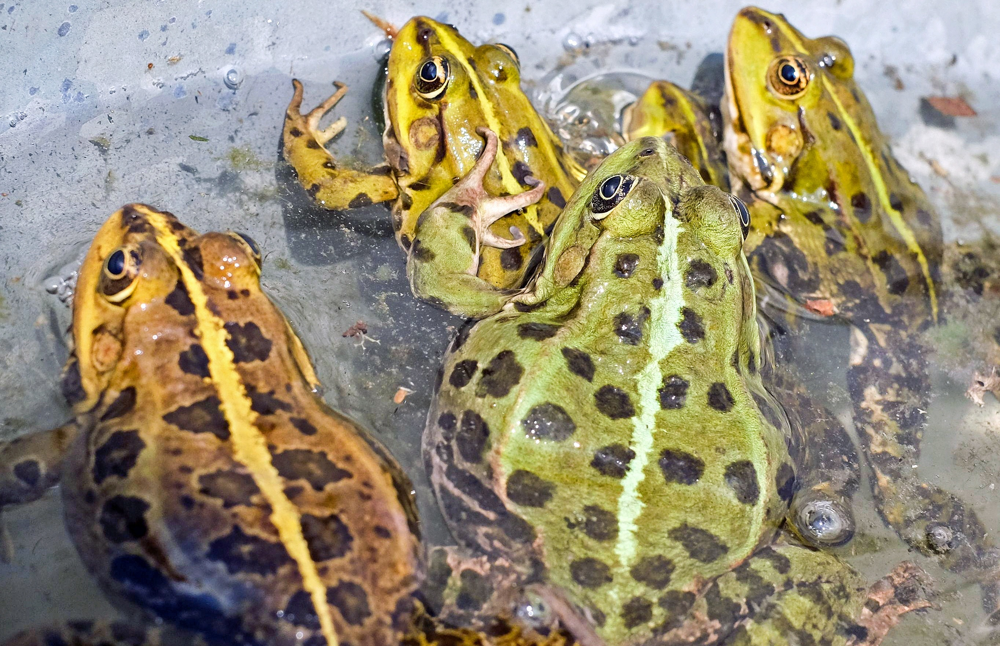

# Animals in the Bible

## License Information

Animals in the Bible © United Bible Societies, 2025. Adapted from: <cite>All Creatures Great and Small: Living Things in the Bible</cite>, by Edward R. Hope © 2005 United Bible Societies. This work is licensed under Creative Commons Attribution-ShareAlike 4.0 International (<a href="https://creativecommons.org/licenses/by-sa/4.0/">https://creativecommons.org/licenses/by-sa/4.0/</a>).

--------------------------------

## Frog (id: FAUNA:5.2)

5\.2 Frog
=========

References:
-----------

Hebrew צְפַרְדֵּעַ (tsefarde‘a)

[EXO 7:27](https://ref.ly/Exod7:27), [EXO 7:28](https://ref.ly/Exod7:28), [EXO 7:29](https://ref.ly/Exod7:29), [EXO 8:1](https://ref.ly/Exod8:1), [EXO 8:2](https://ref.ly/Exod8:2), [EXO 8:3](https://ref.ly/Exod8:3), [EXO 8:4](https://ref.ly/Exod8:4), [EXO 8:5](https://ref.ly/Exod8:5), [EXO 8:7](https://ref.ly/Exod8:7), [EXO 8:8](https://ref.ly/Exod8:8), [EXO 8:9](https://ref.ly/Exod8:9), [PSA 78:45](https://ref.ly/Ps78:45), [PSA 105:30](https://ref.ly/Ps105:30)

Greek βάτραχος (batrachos)

[REV 16:13](https://ref.ly/Rev16:13), [WIS 19:10](https://ref.ly/Wis19:10)

Discussion:
-----------

There is little doubt that the Hebrew and Greek words mean “frog". The plague of frogs mentioned in Exodus comes after the plague of polluted water. The frogs seem to have left the water and come into the villages. Since frogs eat flies and thus control fly populations, it seems likely that the death of the frogs was one of the causes of the next two plagues to trouble Egypt, namely gnats and flies.

Description:
------------

The two most common frogs in the Middle East and Egypt are the Edible Frog *Rana esculenta* and the Spotted Frog *Rana punctata*. They are both about 70 millimeters (3 inches) long and are brown or olive\-green in color. They live in the water almost all of the time and eat gnats, flies, and other waterside insects. They lay eggs, which hatch as tadpoles and gradually grow legs. The hind legs are much bigger and better developed than the front legs, since the hind legs are used for jumping.

Special significance or symbolism:
----------------------------------

Frogs were considered unclean by the Jews and also by the Egyptians and Persians, who associated them with demons.

Translation:
------------

Frogs are found all over the world, and there should be no problem in finding a local equivalent.

* **Associated Passages:** Exodus 7:27; Exodus 7:28; Exodus 7:29; Exodus 8:1; Exodus 8:2; Exodus 8:3; Exodus 8:4; Exodus 8:5; Exodus 8:7; Exodus 8:8; Exodus 8:9; Psalms 78:45; Psalms 105:30; Revelation 16:13; Wisdom of Solomon 19:10

