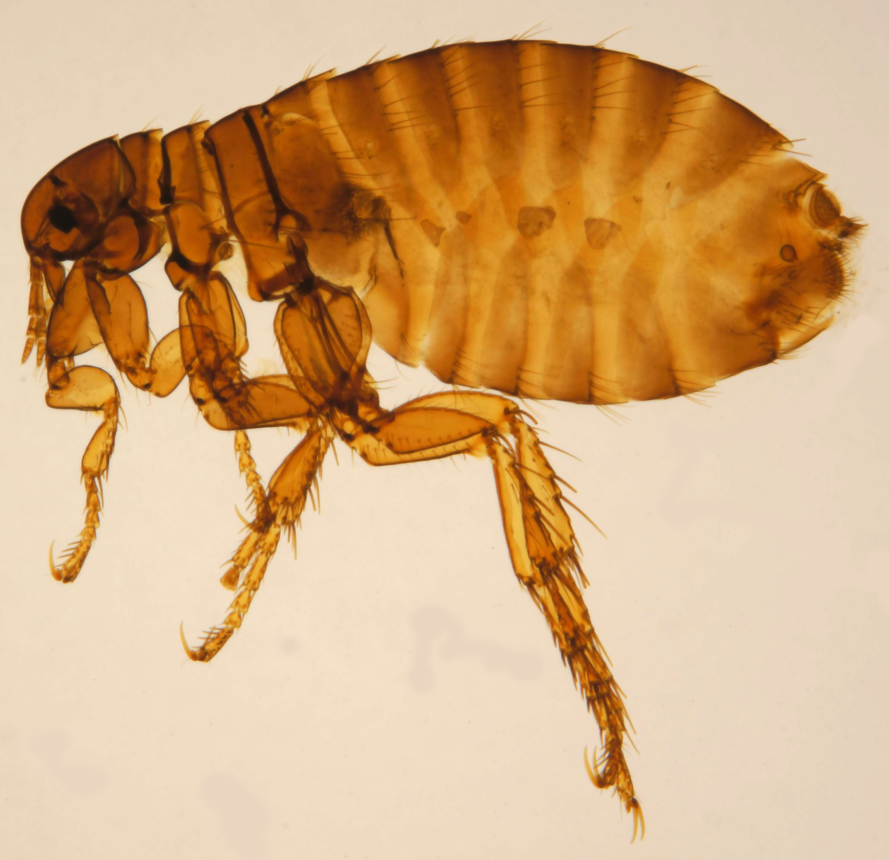

# Animals in the Bible

## License Information

Animals in the Bible © United Bible Societies, 2025. Adapted from: <cite>All Creatures Great and Small: Living Things in the Bible</cite>, by Edward R. Hope © 2005 United Bible Societies. This work is licensed under Creative Commons Attribution-ShareAlike 4.0 International (<a href="https://creativecommons.org/licenses/by-sa/4.0/">https://creativecommons.org/licenses/by-sa/4.0/</a>).

--------------------------------

## Flea (id: FAUNA:6.3)

6\.3 Flea
=========

References:
-----------

Hebrew פַּרְעֹשׁ (par‘osh)

[1SA 24:15](https://ref.ly/1Sam24:15), [1SA 26:20](https://ref.ly/1Sam26:20)

Description:
------------

*Flea (© Katja ZSM (Wikimedia Commons))*

The Common Flea *Pulex irritans* is one of the fleas that are parasitic on man, but there are other subspecies that also live on dogs, camels, and other mammals. Fleas are very small (about 1\.25 millimeters \[0\.05 inch] long) black jumping insects that suck blood in their adult phase, inflicting itching bites as they do so. Scratching the bites can easily cause infection. Their hind legs are adapted for jumping, and the required tension before a jump is produced by a special sticky protein. The flea strains its leg against the adhesive, and when it snaps free the legs release a surprising amount of energy. A flea less than a millimeter in length can jump well over a meter, that is, more than a thousand times its own length.

Fleas are a troublesome pest, breeding in dirt and dust. The people of biblical times had no defense against fleas, and in houses with mud floors the problem was acute. If fleas got too bad, there was no choice but to move to another house.

Another species of flea (*Xonopsylla cheopis*) infests the black rat and is the carrier of bubonic plague. See [2\.27 Mouse, rat](#FAUNA:2.27).

Special significance or symbolism:
----------------------------------

The flea was a symbol for an insignificant troublemaker, a nuisance who was of no great importance.

Translation:
------------

The translation of [1SA 24:14](https://ref.ly/1Sam24:14) should indicate that David is talking in a derogatory way about himself, not about the king. He is referring to himself as “a flea.” In the versions that translate all of David’s words as questions, this is often inadequately conveyed, and the idea is better carried as a question followed by two answers to the question: “What has the king come to find? A dead dog! A flea!” In some languages it may be necessary to say, “I am only a dead dog! I am only a flea!"

There is a difficult textual problem in [1SA 26:14](https://ref.ly/1Sam26:14), and scholars are evenly divided about which is the better text. RSV (Revised Standard Version (1952)) and JB (Jerusalem Bible (1966)) follow the Septuagint and read “my life", while other versions follow the Masoretic Text and read “flea". It is probably best to translate “flea” with a footnote to indicate that instead of “flea” the Septuagint has “my life".

* **Associated Passages:** 1 Samuel 24:15; 1 Samuel 26:20; 1 Samuel 24:14; 1 Samuel 26:14

