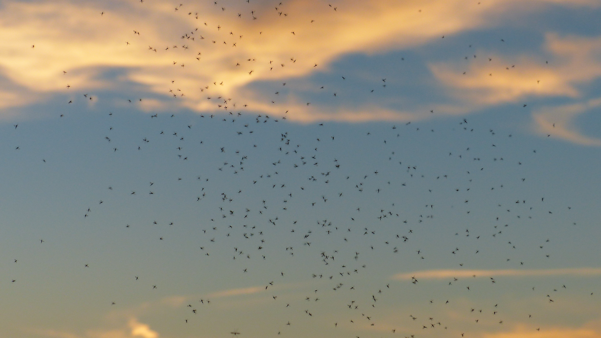

# Animals in the Bible

## License Information

Animals in the Bible © United Bible Societies, 2025. Adapted from: <cite>All Creatures Great and Small: Living Things in the Bible</cite>, by Edward R. Hope © 2005 United Bible Societies. This work is licensed under Creative Commons Attribution-ShareAlike 4.0 International (<a href="https://creativecommons.org/licenses/by-sa/4.0/">https://creativecommons.org/licenses/by-sa/4.0/</a>).

--------------------------------

## Gnat, mosquito, louse (id: FAUNA:6.6)

6\.6 Gnat, mosquito, louse
==========================

References:
-----------

Hebrew כֵּן, כִּנָּם (ken, kinam)

[EXO 8:12](https://ref.ly/Exod8:12), [EXO 8:13](https://ref.ly/Exod8:13), [EXO 8:14](https://ref.ly/Exod8:14), [PSA 105:31](https://ref.ly/Ps105:31), [ISA 51:6](https://ref.ly/Isa51:6)

Greek κώνωψ (kōnōps)

[MAT 23:24](https://ref.ly/Matt23:24)

Greek σκνίψ (sknips)

[WIS 19:10](https://ref.ly/Wis19:10)

Discussion:
-----------

There is considerable doubt about the meaning of *ken*. The root from which it seems to be derived means “to make firm” or “establish", possibly also “to remain firmly attached". The various possibilities reflected in the English versions all have some support.

Four of the five references relate to the plagues that troubled Egypt prior to the Exodus. Some of the insects that have been suggested are discussed below:

*Mosquito (Pixabay)*

**Gnat/Mosquito**: “Gnat” is a fairly archaic word for a number of species of small flying insects, such as mosquitoes, lake flies, and the minute flies also known as “midges". These all abound naturally in Egypt, especially in the Nile Valley. Thus the pest referred to by the Hebrew *ken* is likely mosquitoes that bite humans, in this case the Malaria Mosquito *Anopheles*. This identification was supported by Hort, who pointed out that once the Egyptian frogs had all died, mosquitoes and flies were bound to multiply in unprecedented numbers.

*Swarm of midges (Pixabay)*

Mosquitoes are small flying insects that make a characteristic whining noise as they fly. They are found wherever there is stagnant water and vegetation. Some species are active in the daytime, and others at night. They lay eggs on the surface of pools and puddles or in damp vegetation. The eggs hatch as small worm\-like creatures called nymphs, which have hair\-like tails through which they breathe. Most species of nymph live in water, but they must rise to the surface to breathe. When they mature, they emerge from the water and wait for their new wings to dry before they fly off to feed. Females of many species feed on human or animal blood, and some species can transmit diseases such as malaria and dengue fever.

*Louse (Janice Harney Carr, Center for Disease Control (Wikimedia Commons))*

**Louse**: This tiny wingless insect belongs to a family with the scientific name *Siphunculata (Anoplura)*. They are generally tiny, whitish creatures that live on humans, animals, or birds and feed by sucking blood from the skin. The Human Body Louse *Pediculus humanus* is usually found on the head and hairy parts of the body. Lice crawl around, but they do not jump like fleas. They are extremely common in crowded conditions, because they pass easily from one person to another. They lay small eggs attached to the hairs of the unknowing host.

Lice breed in dirt, and since the water in the first plague had “turned to blood,” the Egyptians probably did not bathe for some time. Conditions were probably dirtier than usual. Lice are also the carriers of the killer disease typhus. However, as a counter argument to the suggestion that *ken* are lice, some scholars have pointed out that the biblical text indicates that the *kinim* attacked man and beast, and lice are not normally a serious threat to livestock, but only a nuisance.

The KJV (King James Version (1611)) translation “lice” has the support of the eminent zoological archaeologist F.S. Bodenheimer, as well as rabbinical tradition and ancient commentators such as Josephus.

**Maggot**: The maggots found in many tropical countries are the larvae of various species of fly. The fly lays its eggs in clothing or in wounds on the skin. The eggs quickly hatch out as minute worms that burrow into the surrounding flesh, on which they feed. As they grow larger they form lumps like boils under the skin. The mature larvae then emerge, leaving open sores. These maggots are thus associated with flies on the one hand and with boils on the other. It seems significant that two of the following three plagues in Egypt were in fact flies and boils. This logical possibility is the main support for the NEB (New English Bible (1970)) and REB (Revised English Bible (1989)) rendering. See also [6\.13 Worm, maggot](#FAUNA:6.13).

**Ticks** are small eight\-legged creatures belonging to a class called *Arachnida*, which also includes spiders and scorpions. However, ticks are much smaller than the other members of the class and do not look like spiders or scorpions. They attach themselves very firmly to the skin of a person, animal, reptile, or bird and begin to suck blood (compare the meaning “attached firmly” which some scholars suggest as the root from which *ken* is derived). The females become so bloated that they swell to almost one hundred times their original size and then drop off and lay many eggs in the soil. When these eggs hatch, hundreds of baby ticks emerge and settle into the dust or attach themselves to grass stems. They are able to exist like this for many months, just waiting for a suitable person, animal, or bird to pass by. Once they are able to get onto the creature they were waiting for, they crawl around until they sense a blood vessel close to the surface. Then they bite into the skin and begin to feed. The places where they have begun to feed become very itchy and may turn into sores.

Ticks are a common pest in Egypt and many other subtropical and tropical countries. They carry diseases that can be dangerous to man, such as tropical tick fever (also known as relapsing fever), or dangerous to animals, such as Texas cattle fever and distemper. No English translation has yet adopted this interpretation, which is just as plausible as that of the NEB (New English Bible (1970)) and REB (Revised English Bible (1989)). However, scholars such as J.G. Wood and G.S. Cansdale have supported this translation.

The Greek word *sknips* means “louse".

Special significance or symbolism:
----------------------------------

*ken* is a symbol of a small but deadly plague, or a small but troublesome nuisance.

The inference associated with *kōnōps* in [MAT 23:24](https://ref.ly/Matt23:24) is something very small and insignificant.

Translation:
------------

Mosquitoes, lice, ticks, and maggots are found almost all over the world, apart from some desert regions. The translators should decide upon one of the possibilities for inclusion in the main text of the translation but indicate in a footnote the other possibilities. The footnote could be worded: “The meaning of the Hebrew word is not certain. It may mean … , or … , or. … "

[ISA 51:6](https://ref.ly/Isa51:6): In the middle of this verse the Hebrew text has the following:

Although the heavens may vanish like smoke

And the earth become worn out like clothing

And its inhabitants vanish like *ken,* … .

Many scholars suggest that instead of *ken* the Hebrew was originally *kinim*, and the text should read “vanish like mosquitoes/lice/ticks.” In this context the word would indicate small numerous (perhaps repulsive) insects with a brief life span. Thus NIV (New International Version (1984)), TEV (Today's English Version (Good News Bible)), REB (Revised English Bible (1989)), and NAB (New American Bible (1970)) have “die like flies"; RSV (Revised Standard Version (1952)) has “die like gnats"; JB (Jerusalem Bible (1966)) has “die like vermin". Some non\-English translations have “die like ants” and “die like fleas".

The reference in [MAT 23:24](https://ref.ly/Matt23:24) to “straining out a gnat” relates to a Jewish practice, common in ancient times, of straining wine or water before drinking it. This was to avoid swallowing a mosquito or other insect, which would make the person ritually unclean according to [LEV 11:0](https://ref.ly/Lev11:0). TEV (Today's English Version (Good News Bible)) translates the word as “fly", because to English\-speaking readers the fly is a dirty insect. However, the emphasis of Jesus’ saying is not on the unclean nature of the insect but on its small, insignificant character. In many languages the translation “mosquito” will suffice, but in some it may be necessary to use “tiny mosquito” to retain the inference.

* **Associated Passages:** Exodus 8:12; Exodus 8:13; Exodus 8:14; Psalms 105:31; Isaiah 51:6; Matthew 23:24; Wisdom of Solomon 19:10; Leviticus 11:0

