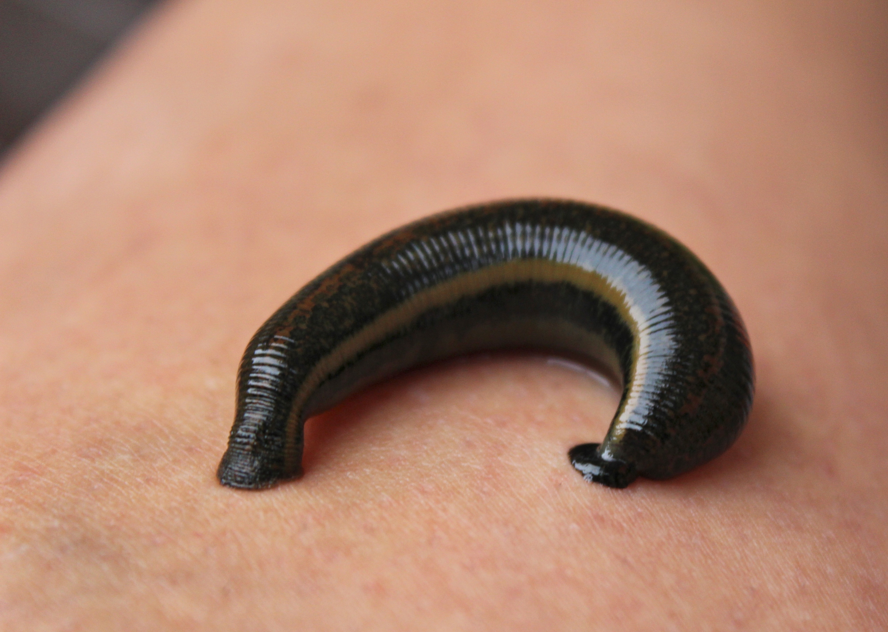

# Animals in the Bible

## License Information

Animals in the Bible © United Bible Societies, 2025. Adapted from: <cite>All Creatures Great and Small: Living Things in the Bible</cite>, by Edward R. Hope © 2005 United Bible Societies. This work is licensed under Creative Commons Attribution-ShareAlike 4.0 International (<a href="https://creativecommons.org/licenses/by-sa/4.0/">https://creativecommons.org/licenses/by-sa/4.0/</a>).

--------------------------------

## Insects, spiders, and worms (id: FAUNA:6)

6 Insects, spiders, and worms
=============================

* [6\.1 Ant](#FAUNA:6.1)
* [6\.2 Bee](#FAUNA:6.2)
* [6\.3 Flea](#FAUNA:6.3)
* [6\.4 Fly](#FAUNA:6.4)
* [6\.5 Gadfly](#FAUNA:6.5)
* [6\.6 Gnat, mosquito, mouse](#FAUNA:6.6)
* [6\.7 Hornet, wasp](#FAUNA:6.7)
* [6\.8 Leech](#FAUNA:6.8)
* [6\.9 Locust, grasshopper, cricket](#FAUNA:6.9)
* [6\.10 Moth](#FAUNA:6.10)
* [6\.11 Scorpion](#FAUNA:6.11)
* [6\.12 Spider](#FAUNA:6.12)
* [6\.13 Worm, maggot](#FAUNA:6.13)

## Ant (id: FAUNA:6.1)

6\.1 Ant
========

References:
-----------

Hebrew נְמָלָה (nemalah)

[PRO 6:6](https://ref.ly/Prov6:6), [PRO 30:25](https://ref.ly/Prov30:25)

Discussion:
-----------

The Hebrew word probably covers all kinds of ants, but the most obvious ant that fits the scriptural context is the Harvester Ant *Messor semirufus*, which is common all over the land of Israel. It collects grain and grass seeds, when these ripen in the summer, and stores them in its nest for the winter.

Description:
------------

The harvester ant is a fairly large dark brown ant, and like most ants, its nest is home to a queen ant, to workers, and to soldier ants that protect the nest. The nest is underground with an entrance that is usually well marked both by the tiny trails leading into it and by the amount of chaff dumped near the entrance by the ants. Any ant is capable of carrying many times its own weight.

Special significance or symbolism:
----------------------------------

The ant is the symbol of diligence and hard work.

Translation:
------------

A generic word for ant is probably the best choice, but where necessary the name of a local ant that carries food to its nest is a suitable choice.

* **Associated Passages:** Proverbs 6:6; Proverbs 30:25

## Bee (id: FAUNA:6.2)

6\.2 Bee
========

References:
-----------

Hebrew דְּבוֹרָה (devorah)

[DEU 1:44](https://ref.ly/Deut1:44), [JDG 14:8](https://ref.ly/Judg14:8), [PSA 118:12](https://ref.ly/Ps118:12), [ISA 7:18](https://ref.ly/Isa7:18)

Greek μέλισσα (melissa)

[SIR 11:3](https://ref.ly/Wis11:3), [4MA 14:19](https://ref.ly/3Macc14:19)

Discussion:
-----------

The species of bee found in Israel in biblical times was obviously a fierce strain, since most of the references are to it swarming around and attacking people. In fact it is likely that all bees were originally much fiercer than the fairly docile bees commonly kept in hives today(the result of breeding from selected queen bees. Most biblical references are to “wild bees", that is, bees in natural hives rather than in hives made by man. However, it is likely that bees were also kept in apiaries, since we know that the practice was common in Egypt, Greece, and Rome from very early times.

The Hebrew word for “honey", *devash*, is also used for syrup extracted from figs, dates, and grapes, or from certain types of palm tree. The phrase “a land flowing with milk and honey” refers to a land that is fertile and thus rich in pasture, fruit, and the grain and flowers from which bees make honey.

Description:
------------

The bee is a flying insect that collects nectar from flowers and converts it into honey. It lives in swarms made up of many thousands of bees. They make a hive in a hollow log, in spaces between rocks, in holes in the ground, in old termite nests, or other places. There the bees build combs made of wax. In the comb are small cells, and in the cells nearest the center of the hive the queen bee lays eggs, and young are raised, while the honey is stored in cells toward the outside. Bees are able to sting and do so when they feel that their hive is threatened. The smell of one bee’s sting makes the other bees in the hive aggressive.

Translation:
------------

Since bees are universal, translation usually does not present a problem. Where no generic term exists for bees in general, the specific name for a honey bee, or a bee that makes edible honey, should be used at [JDG 14:8](https://ref.ly/Judg14:8), but in all other references the word for a type of bee that swarms around and stings intruders should be used.

Note: The NEB (New English Bible (1970)) rendering of “They surround me like bees at the honey” is certainly mistaken. It is not bees swarming around honey, but bees swarming to attack, that is in focus.

* **Associated Passages:** Deuteronomy 1:44; Judges 14:8; Psalms 118:12; Isaiah 7:18; Sirach 11:3; 4 Maccabees 14:19

## Flea (id: FAUNA:6.3)

6\.3 Flea
=========

References:
-----------

Hebrew פַּרְעֹשׁ (par‘osh)

[1SA 24:15](https://ref.ly/1Sam24:15), [1SA 26:20](https://ref.ly/1Sam26:20)

Description:
------------

The Common Flea *Pulex irritans* is one of the fleas that are parasitic on man, but there are other subspecies that also live on dogs, camels, and other mammals. Fleas are very small (about 1\.25 millimeters \[0\.05 inch] long) black jumping insects that suck blood in their adult phase, inflicting itching bites as they do so. Scratching the bites can easily cause infection. Their hind legs are adapted for jumping, and the required tension before a jump is produced by a special sticky protein. The flea strains its leg against the adhesive, and when it snaps free the legs release a surprising amount of energy. A flea less than a millimeter in length can jump well over a meter, that is, more than a thousand times its own length.

Fleas are a troublesome pest, breeding in dirt and dust. The people of biblical times had no defense against fleas, and in houses with mud floors the problem was acute. If fleas got too bad, there was no choice but to move to another house.

Another species of flea (*Xonopsylla cheopis*) infests the black rat and is the carrier of bubonic plague. See [2\.27 Mouse, rat](#FAUNA:2.27).

Special significance or symbolism:
----------------------------------

The flea was a symbol for an insignificant troublemaker, a nuisance who was of no great importance.

Translation:
------------

The translation of [1SA 24:14](https://ref.ly/1Sam24:14) should indicate that David is talking in a derogatory way about himself, not about the king. He is referring to himself as “a flea.” In the versions that translate all of David’s words as questions, this is often inadequately conveyed, and the idea is better carried as a question followed by two answers to the question: “What has the king come to find? A dead dog! A flea!” In some languages it may be necessary to say, “I am only a dead dog! I am only a flea!"

There is a difficult textual problem in [1SA 26:14](https://ref.ly/1Sam26:14), and scholars are evenly divided about which is the better text. RSV (Revised Standard Version (1952)) and JB (Jerusalem Bible (1966)) follow the Septuagint and read “my life", while other versions follow the Masoretic Text and read “flea". It is probably best to translate “flea” with a footnote to indicate that instead of “flea” the Septuagint has “my life".

* **Associated Passages:** 1 Samuel 24:15; 1 Samuel 26:20; 1 Samuel 24:14; 1 Samuel 26:14

## Fly (id: FAUNA:6.4)

6\.4 Fly
========

References:
-----------

Hebrew זְבוּב (zevuv)

[2KI 1:2](https://ref.ly/2Kgs1:2), [2KI 1:3](https://ref.ly/2Kgs1:3), [2KI 1:6](https://ref.ly/2Kgs1:6), [2KI 1:16](https://ref.ly/2Kgs1:16), [ECC 10:1](https://ref.ly/Eccl10:1), [ISA 7:18](https://ref.ly/Isa7:18)

Hebrew עָרֹב (‘arov)

[EXO 8:17](https://ref.ly/Exod8:17), [EXO 8:18](https://ref.ly/Exod8:18), [EXO 8:20](https://ref.ly/Exod8:20), [EXO 8:25](https://ref.ly/Exod8:25), [EXO 8:27](https://ref.ly/Exod8:27), [PSA 78:45](https://ref.ly/Ps78:45), [PSA 105:31](https://ref.ly/Ps105:31)

Greek μυῖα (muia)

[WIS 16:9](https://ref.ly/EsthGr16:9)

Discussion:
-----------

Flies of many varieties are very common in Egypt and the Middle East. The Common Housefly *Musca domestica* is the variety found in almost every house and wherever cattle, sheep, or goats are kept.

Description:
------------

The common housefly is a two\-winged insect with large composite eyes. It feeds on a large variety of vegetable and protein matter and converges on food, rotting fruit or meat, dung, and household garbage. It is thus capable of carrying germs and viruses from various sources onto human food and may cause diseases related to food contamination.

Flies usually lay eggs on or near one of the sources of food; for example, rotting vegetation or protein such as meat, which is warm as the result of bacterial activity. The eggs hatch as small maggots, which feed on the rotting material. A few species of fly lay their eggs near sores on the skin of humans or animals, and the maggots feed on the flesh of the sores.

Special significance or symbolism:
----------------------------------

Flies were associated with decay and uncleanness.

Translation:
------------

Houseflies are found all over the world, and it should not be difficult to find a local equivalent.

The name of the god of Ekron in [2KI 1:2](https://ref.ly/2Kgs1:2), Baal\-zebub, may possibly mean “Lord of the fly", in other words the god who protected people from the sores and diseases caused by flies. However, the name may instead be related to the Ugaritic word *zebul*, “the highest,” and thus may have originally been Baal\-zebul, the Canaanite equivalent of “Most High Lord,” but it was changed sarcastically by the people of Israel to Baal\-zebub, “Lord of the fly.” Because of the doubt about the proper derivation of the word, it is probably best to transliterate the name rather than try to translate it, and add a footnote as follows, “This name means ‘Lord of flies’ and may be a mocking corruption of the god’s real name Baal\-zebul” (compare JB (Jerusalem Bible (1966))).

The word *‘arov* means literally “mixture” and does not actually indicate a specific insect. For this reason the New Jewish Publication Society Version and the New American Standard Bible (NASB (New American Standard Bible)) render “swarms of insects", and *Traduction oecuménique* de la Bible and the German common language version (GECL (German Common Language Version (Gute Nachricht Bibel))) have “vermin". Most English translations have “flies", while some translations prefer a type of fly that stings, “horsefly” or “gadfly” (compare Luther, Dutch common language translation \[DUCL (Dutch Common Language Version) ], New Jerusalem Bible \[NJB (New Jerusalem Bible (1985)) ], and Spanish common language version \[SPCL (Spanish Common Language Version (Dios Habla Hoy)) ]. At [EXO 8:21](https://ref.ly/Exod8:21) SPCL (Spanish Common Language Version (Dios Habla Hoy)) adds the footnote, “It is not clear which insect the text is referring to. It is probably using a general term to indicate a terrible invasion of all sorts of insects."

Note: In [ISA 51:6](https://ref.ly/Isa51:6) NIV (New International Version (1984)) and REB (Revised English Bible (1989)) have “die like flies", which is a good English idiom, but see [6\.6 Gnat, mosquito, louse](#FAUNA:6.6).

* **Associated Passages:** 2 Kings 1:2; 2 Kings 1:3; 2 Kings 1:6; 2 Kings 1:16; Ecclesiastes 10:1; Isaiah 7:18; Exodus 8:17; Exodus 8:18; Exodus 8:20; Exodus 8:25; Exodus 8:27; Psalms 78:45; Psalms 105:31; Wisdom of Solomon 16:9; Exodus 8:21; Isaiah 51:6

## Gadfly (id: FAUNA:6.5)

6\.5 Gadfly
===========

Reference:"
-----------

Hebrew קֶרֶץ (qerets)

[JER 46:20](https://ref.ly/Jer46:20)

Discussion and description:
---------------------------

Gadflies, known also as horseflies and blister flies, are various species of biting fly that feed on the blood of any warm\-blooded animal or human that happens to be available. Some species are carriers of disease. The particular gadfly referred to in Scripture is probably the Common Horsefly *Stomoxys calcitrans*, which is very common in the Middle East, western Asia, Australia, and Africa. They are very persistent and will not leave their host unless actually brushed or knocked away. Their bites sting briefly and itch for a short while afterward.

Special significance or symbolism:
----------------------------------

In the single reference in Scripture the gadfly represents a minor enemy that succeeds in creating trouble.

Translation:
------------

Where biting flies are found locally, the name of a common type can be used. Elsewhere a short descriptive phrase meaning “biting fly", “stinging fly", “burning fly", or something similar can be used.

* **Associated Passages:** Jeremiah 46:20

## Gnat, mosquito, louse (id: FAUNA:6.6)

6\.6 Gnat, mosquito, louse
==========================

References:
-----------

Hebrew כֵּן, כִּנָּם (ken, kinam)

[EXO 8:12](https://ref.ly/Exod8:12), [EXO 8:13](https://ref.ly/Exod8:13), [EXO 8:14](https://ref.ly/Exod8:14), [PSA 105:31](https://ref.ly/Ps105:31), [ISA 51:6](https://ref.ly/Isa51:6)

Greek κώνωψ (kōnōps)

[MAT 23:24](https://ref.ly/Matt23:24)

Greek σκνίψ (sknips)

[WIS 19:10](https://ref.ly/EsthGr19:10)

Discussion:
-----------

There is considerable doubt about the meaning of *ken*. The root from which it seems to be derived means “to make firm” or “establish", possibly also “to remain firmly attached". The various possibilities reflected in the English versions all have some support.

Four of the five references relate to the plagues that troubled Egypt prior to the Exodus. Some of the insects that have been suggested are discussed below:

**Gnat/Mosquito**: “Gnat” is a fairly archaic word for a number of species of small flying insects, such as mosquitoes, lake flies, and the minute flies also known as “midges". These all abound naturally in Egypt, especially in the Nile Valley. Thus the pest referred to by the Hebrew *ken* is likely mosquitoes that bite humans, in this case the Malaria Mosquito *Anopheles*. This identification was supported by Hort, who pointed out that once the Egyptian frogs had all died, mosquitoes and flies were bound to multiply in unprecedented numbers.

Mosquitoes are small flying insects that make a characteristic whining noise as they fly. They are found wherever there is stagnant water and vegetation. Some species are active in the daytime, and others at night. They lay eggs on the surface of pools and puddles or in damp vegetation. The eggs hatch as small worm\-like creatures called nymphs, which have hair\-like tails through which they breathe. Most species of nymph live in water, but they must rise to the surface to breathe. When they mature, they emerge from the water and wait for their new wings to dry before they fly off to feed. Females of many species feed on human or animal blood, and some species can transmit diseases such as malaria and dengue fever.

**Louse**: This tiny wingless insect belongs to a family with the scientific name *Siphunculata (Anoplura)*. They are generally tiny, whitish creatures that live on humans, animals, or birds and feed by sucking blood from the skin. The Human Body Louse *Pediculus humanus* is usually found on the head and hairy parts of the body. Lice crawl around, but they do not jump like fleas. They are extremely common in crowded conditions, because they pass easily from one person to another. They lay small eggs attached to the hairs of the unknowing host.

Lice breed in dirt, and since the water in the first plague had “turned to blood,” the Egyptians probably did not bathe for some time. Conditions were probably dirtier than usual. Lice are also the carriers of the killer disease typhus. However, as a counter argument to the suggestion that *ken* are lice, some scholars have pointed out that the biblical text indicates that the *kinim* attacked man and beast, and lice are not normally a serious threat to livestock, but only a nuisance.

The KJV (King James Version (1611)) translation “lice” has the support of the eminent zoological archaeologist F.S. Bodenheimer, as well as rabbinical tradition and ancient commentators such as Josephus.

**Maggot**: The maggots found in many tropical countries are the larvae of various species of fly. The fly lays its eggs in clothing or in wounds on the skin. The eggs quickly hatch out as minute worms that burrow into the surrounding flesh, on which they feed. As they grow larger they form lumps like boils under the skin. The mature larvae then emerge, leaving open sores. These maggots are thus associated with flies on the one hand and with boils on the other. It seems significant that two of the following three plagues in Egypt were in fact flies and boils. This logical possibility is the main support for the NEB (New English Bible (1970)) and REB (Revised English Bible (1989)) rendering. See also [6\.13 Worm, maggot](#FAUNA:6.13).

**Ticks** are small eight\-legged creatures belonging to a class called *Arachnida*, which also includes spiders and scorpions. However, ticks are much smaller than the other members of the class and do not look like spiders or scorpions. They attach themselves very firmly to the skin of a person, animal, reptile, or bird and begin to suck blood (compare the meaning “attached firmly” which some scholars suggest as the root from which *ken* is derived). The females become so bloated that they swell to almost one hundred times their original size and then drop off and lay many eggs in the soil. When these eggs hatch, hundreds of baby ticks emerge and settle into the dust or attach themselves to grass stems. They are able to exist like this for many months, just waiting for a suitable person, animal, or bird to pass by. Once they are able to get onto the creature they were waiting for, they crawl around until they sense a blood vessel close to the surface. Then they bite into the skin and begin to feed. The places where they have begun to feed become very itchy and may turn into sores.

Ticks are a common pest in Egypt and many other subtropical and tropical countries. They carry diseases that can be dangerous to man, such as tropical tick fever (also known as relapsing fever), or dangerous to animals, such as Texas cattle fever and distemper. No English translation has yet adopted this interpretation, which is just as plausible as that of the NEB (New English Bible (1970)) and REB (Revised English Bible (1989)). However, scholars such as J.G. Wood and G.S. Cansdale have supported this translation.

The Greek word *sknips* means “louse".

Special significance or symbolism:
----------------------------------

*ken* is a symbol of a small but deadly plague, or a small but troublesome nuisance.

The inference associated with *kōnōps* in [MAT 23:24](https://ref.ly/Matt23:24) is something very small and insignificant.

Translation:
------------

Mosquitoes, lice, ticks, and maggots are found almost all over the world, apart from some desert regions. The translators should decide upon one of the possibilities for inclusion in the main text of the translation but indicate in a footnote the other possibilities. The footnote could be worded: “The meaning of the Hebrew word is not certain. It may mean … , or … , or. … "

[ISA 51:6](https://ref.ly/Isa51:6): In the middle of this verse the Hebrew text has the following:

Although the heavens may vanish like smoke

And the earth become worn out like clothing

And its inhabitants vanish like *ken,* … .

Many scholars suggest that instead of *ken* the Hebrew was originally *kinim*, and the text should read “vanish like mosquitoes/lice/ticks.” In this context the word would indicate small numerous (perhaps repulsive) insects with a brief life span. Thus NIV (New International Version (1984)), TEV (Today's English Version (Good News Bible)), REB (Revised English Bible (1989)), and NAB (New American Bible (1970)) have “die like flies"; RSV (Revised Standard Version (1952)) has “die like gnats"; JB (Jerusalem Bible (1966)) has “die like vermin". Some non\-English translations have “die like ants” and “die like fleas".

The reference in [MAT 23:24](https://ref.ly/Matt23:24) to “straining out a gnat” relates to a Jewish practice, common in ancient times, of straining wine or water before drinking it. This was to avoid swallowing a mosquito or other insect, which would make the person ritually unclean according to [LEV 11:0](https://ref.ly/Lev11:0). TEV (Today's English Version (Good News Bible)) translates the word as “fly", because to English\-speaking readers the fly is a dirty insect. However, the emphasis of Jesus’ saying is not on the unclean nature of the insect but on its small, insignificant character. In many languages the translation “mosquito” will suffice, but in some it may be necessary to use “tiny mosquito” to retain the inference.

* **Associated Passages:** Exodus 8:12; Exodus 8:13; Exodus 8:14; Psalms 105:31; Isaiah 51:6; Matthew 23:24; Wisdom of Solomon 19:10; Leviticus 11:0

## Hornet, wasp (id: FAUNA:6.7)

6\.7 Hornet, wasp
=================

References:
-----------

Hebrew צִרְעָה (tsir‘ah)

[EXO 23:28](https://ref.ly/Exod23:28), [DEU 7:20](https://ref.ly/Deut7:20), [JOS 24:12](https://ref.ly/Josh24:12)

Greek σφήξ (sfēx)

[WIS 12:8](https://ref.ly/EsthGr12:8)

Discussion:
-----------

There is little doubt among scholars that the Hebrew and Greek words refer to both hornets and wasps. The rendering of NEB (New English Bible (1970)) and REB (Revised English Bible (1989)), “panic", does not have much support, as the suggested derivation from the Arabic *dara‘a* is very debatable.

Description:
------------

Hornets and wasps are closely related species, with the hornets being larger than the wasps. Like bees they both belong to the zoological order *Hymenoptera*, which means that they have stiff, transparent, membrane\-like wings. The hornets are usually black or brown; some species have yellow bands. Wasps are often greenish and may also have yellow or light green bands. The larger hornets can be 30–40 millimeters (1–1\.5 inches) long.

Both hornets and wasps are characterized by having a long narrow waist between the thorax (chest) and the abdomen (stomach). All have a sting that, because of their large size, can be very painful, even dangerous. Unlike bees, hornets and wasps do not have a detachable sting and can sting repeatedly. They feed on insects, caterpillars, and spiders, and many types sting their prey and then deposit the paralyzed but still living insect or spider near the hornet’s eggs, as a readily available source of food for the larvae when they hatch from the eggs. Some species actually lay their eggs on the paralyzed victim.

The Oriental hornet *Vespa orientalis*, typically lives in nests that it digs underground. A nest contains multiple combs in which the colony lives. While nests are most commonly found under ground, some paper nests are constructed in protective hollows such as inside hollow trees. The Oriental hornets have a reddish\-brown color and have distinctive thick yellow bands on the abdomen and yellow patches on the head between the eyes. They communicate through sound vibrations and capture other insects such as grasshoppers, flies, honey bees, and vespids with which they feed the colony's brood. They will also collect other animal proteins for their young such as pieces of fresh or spoiled meat and fish. The adults eat carbohydrates such as nectar, honeydew, and fruits. The hornets are a primary pest to honey bees, attacking bee colonies to obtain honey and animal proteins. The sting of an Oriental hornet can be quite painful to humans and some humans are allergic to stings. The Oriental hornet looks similar to the European hornet (*Vespa crabro*) and should not be confused with the Asian giant hornet (*Vespa mandarinia*) of East Asia.

Special significance or symbolism:
----------------------------------

Hornets are a symbol in the Bible for a dangerous enemy or an attacking army.

Translation:
------------

Although hornets or wasps are found in most warm countries, some large dangerous\-looking hornets are relatively harmless. For instance, the black house hornet found all over Africa does not live in swarms but on its own. It makes mud nests on walls or under a roof. It is large and has a sting, but it is not aggressive and very seldom stings any person or animal. Thus care should be taken by translators to choose the name of a hornet that both lives in swarms and is dangerous. In cases where all local hornets or wasps are relatively harmless, a descriptive phrase meaning “warrior hornet", “war hornet", “army hornet", “death hornet” or something similar can be used.

* **Associated Passages:** Exodus 23:28; Deuteronomy 7:20; Joshua 24:12; Wisdom of Solomon 12:8

## Leech (id: FAUNA:6.8)

6\.8 Leech
==========

Reference:"
-----------

Hebrew עֲלוּקָה (‘aluqah)

[PRO 30:15](https://ref.ly/Prov30:15)

Discussion:
-----------

A few scholars have suggested that *‘aluqah* was the name of a demon believed to suck blood from humans, but this suggestion does not have much support and can be discounted. Similarly the suggestion that some have made that the word refers to the bloodsucking vampire bat can be discounted. Such bats are only found in Latin America and would have been unknown to the biblical writers. It is much more generally accepted that this word refers to the leech. The root from which the Hebrew word is derived means “to adhere to,” or “to suck".

Description:
------------

Leeches are worm\-like creatures of the order *Hirudinea*. They live in streams, swamps, or damp ground but are also able to live on dry land. The largest of the Middle Eastern leeches is the Nile Leech *Limnatis nilotica*. Leeches have specialized mouths that enable them to make small cuts in the skin of their victims, which may be humans, animals, reptiles, or even fish. They then fasten firmly on to the surrounding skin and gorge themselves on blood. Their skin has many small folds, and as the leech feeds, it expands until it is many times its original size. When sufficiently gorged it drops off.

If forcibly pulled from the skin, the small cut made by the leech bleeds profusely. Since leeches are sensitive to salt on their skin, they have been removed since very ancient times by putting salt on them. The leeches then detach themselves, and the wound does not bleed nearly as much.

Leeches have been used since ancient times by doctors to cause patients to bleed in a reasonably controlled way.

Special significance or symbolism:
----------------------------------

In the single scriptural reference the leech is a symbol of greediness.

Translation:
------------

Leeches are found throughout the world in warm damp conditions, and in such places a local word for leech should not be hard to find. Elsewhere a phrase meaning “bloodsucking worm” can be used, or a term can be borrowed from the local trade or international language.

* **Associated Passages:** Proverbs 30:15

## Locust, grasshopper, cricket (id: FAUNA:6.9)

6\.9 Locust, grasshopper, cricket
=================================

References:
-----------

Hebrew אַרְבֶּה (’arbeh)

[EXO 10:4](https://ref.ly/Exod10:4), [EXO 10:12](https://ref.ly/Exod10:12), [EXO 10:13](https://ref.ly/Exod10:13), [EXO 10:14](https://ref.ly/Exod10:14), [EXO 10:14](https://ref.ly/Exod10:14), [EXO 10:19](https://ref.ly/Exod10:19), [EXO 10:19](https://ref.ly/Exod10:19), [LEV 11:22](https://ref.ly/Lev11:22), [DEU 28:38](https://ref.ly/Deut28:38), [JDG 6:5](https://ref.ly/Judg6:5), [JDG 7:12](https://ref.ly/Judg7:12), [1KI 8:37](https://ref.ly/1Kgs8:37), [2CH 6:28](https://ref.ly/2Chr6:28), [JOB 39:20](https://ref.ly/Job39:20), [PSA 78:46](https://ref.ly/Ps78:46), [PSA 105:34](https://ref.ly/Ps105:34), [PSA 109:23](https://ref.ly/Ps109:23), [PRO 30:27](https://ref.ly/Prov30:27), [JER 46:23](https://ref.ly/Jer46:23), [JOL 1:4](https://ref.ly/Joel1:4), [JOL 1:4](https://ref.ly/Joel1:4), [JOL 2:25](https://ref.ly/Joel2:25), [NAM 3:15](https://ref.ly/Nah3:15), [NAM 3:17](https://ref.ly/Nah3:17)

Hebrew גֵּב, גּוֹב, גֹּבַי (gev, gov, govay)

[ISA 33:4](https://ref.ly/Isa33:4), [AMO 7:1](https://ref.ly/Amos7:1), [NAM 3:17](https://ref.ly/Nah3:17), [NAM 3:17](https://ref.ly/Nah3:17)

Hebrew גָּזָם (gazam)

[JOL 1:4](https://ref.ly/Joel1:4), [JOL 2:25](https://ref.ly/Joel2:25), [AMO 4:9](https://ref.ly/Amos4:9)

Hebrew חָגָב (chagav)

[LEV 11:22](https://ref.ly/Lev11:22), [NUM 13:33](https://ref.ly/Num13:33), [2CH 7:13](https://ref.ly/2Chr7:13), [ECC 12:5](https://ref.ly/Eccl12:5), [ISA 40:22](https://ref.ly/Isa40:22)

Hebrew חָסִיל (chasil)

[1KI 8:37](https://ref.ly/1Kgs8:37), [2CH 6:28](https://ref.ly/2Chr6:28), [PSA 78:46](https://ref.ly/Ps78:46), [ISA 33:4](https://ref.ly/Isa33:4), [JOL 1:4](https://ref.ly/Joel1:4), [JOL 2:25](https://ref.ly/Joel2:25)

Hebrew חַרְגֹּל (chargol)

[LEV 11:22](https://ref.ly/Lev11:22)

Hebrew יֶלֶק (yeleq)

[PSA 105:34](https://ref.ly/Ps105:34), [JER 51:14](https://ref.ly/Jer51:14), [JER 51:27](https://ref.ly/Jer51:27), [JOL 1:4](https://ref.ly/Joel1:4), [JOL 1:4](https://ref.ly/Joel1:4), [JOL 2:25](https://ref.ly/Joel2:25), [NAM 3:15](https://ref.ly/Nah3:15), [NAM 3:15](https://ref.ly/Nah3:15), [NAM 3:16](https://ref.ly/Nah3:16)

Hebrew סָלְעָם (sol‘am)

[LEV 11:22](https://ref.ly/Lev11:22)

Hebrew צְלָצַל (tselatsal)

[DEU 28:42](https://ref.ly/Deut28:42), [ISA 18:1](https://ref.ly/Isa18:1)

Greek ἀκρίς (akris)

[MAT 3:4](https://ref.ly/Matt3:4), [MRK 1:6](https://ref.ly/Matt1:6), [REV 9:3](https://ref.ly/Jude9:3), [REV 9:7](https://ref.ly/Jude9:7), [JDT 2:20](https://ref.ly/Tob2:20), [WIS 16:9](https://ref.ly/EsthGr16:9), [SIR 43:18](https://ref.ly/Wis43:18)

Latin locusta

[2ES 4:24](https://ref.ly/1Esd4:24)

Discussion:
-----------

The locust is the most important insect in the Bible, being mentioned many more times than any other insect. Although there are nine Hebrew words in the Bible which refer to locusts, the most common one is *’arbeh*. The equivalent in Greek is *akris*, and in Latin it is *locusta*. These words certainly refer to the locust rather than to the grasshopper. All locusts and grasshoppers belong to the family *Acrididae*, which is a family within the order *Orthoptera*, or “straight\-winged” insects. Many species are found in the land of Israel and Egypt, but the most important are the Migratory Locust *Locusta migratoria*, the Desert Locust *Schistocerca gregaria*, and the Moroccan Locust *Dociostaurus moroccanus*. All three species are an important local food and are probably all called *’arbeh* in the Bible.

Description:
------------

**Grasshoppers and locusts** are both six\-legged, winged insects that are characterized by the fact that their third pair of legs is elongated and adapted to hopping. The lower portion of these legs has a row of spikes that are used both for making sounds and as a means of defense. The front wings are narrow, straight, and stiff. When not being used to fly, they function as a cover for thin, membrane\-like hind wings, which are much larger and colored, and which are folded together like a Chinese fan. When the locust or grasshopper flies, it hops into the air spreading out its wings as it does so. It flies with a slight clattering sound, made by the stiff front wings striking each other.

Locusts differ from grasshoppers mainly in that they form swarms at certain periods and migrate to new areas, which they colonize. At other times they live either solitary or in small groups. Their reproduction rate varies with the climatic conditions. Eggs are laid in the soil in small packets, and hatching is related to the degree of humidity. In dry periods only a few hatch, but in periods of good rainfall they suddenly hatch out in exceptionally large numbers.

Unlike most other insects, locusts do not go through stages in which they exist as larvae or caterpillars. They emerge from the eggs as nymphs, which are simply tiny wingless locusts with undeveloped hopper legs. The nymphs, which can only crawl around, feed on green vegetation, consuming many times their own body weight each day. As they grow bigger and develop, they shed their skins. Their hopping legs develop before their wings, so that they pass through a stage when they can hop but not fly. At this stage, when they are referred to as “hoppers", they exist in less dense masses than as nymphs, having spread out a little, but since they are now eating even more than before, they can still cause considerable damage to crops. Once they develop into adults they can both hop and fly. If the climatic conditions are right and exceptionally large numbers have developed to this stage, they completely devastate the vegetation where they have been developing. When this happens they begin to congregate in preparation for swarming. In other words they come together and migrate as a group to greener pastures, flying together in large swarms. At this congregating stage, during the migration and immediately after it, they present a major threat to crops and other vegetation, on which they feed unceasingly.

A locust swarm may consist of billions of locusts. G.S. Cansdale quotes a report of a single swarm in 1889 that was estimated to cover 5,500 square kilometers (about 2,000 square miles). Certainly even in recent times swarms have been known large enough to blot out the sun like a large black cloud. The clattering of wings as the locusts approach is a sound hard to forget. Where the swarm lands, even temporarily, every green bush or clump of grass in sight is attacked by the locusts, and the sound of them munching on the leaves is clearly audible, sometimes for hours. Afterwards, hardly a single green leaf or blade of grass can be seen, and many bushes even have the bark eaten off, leaving them bare.

Against such enormous numbers ancient peoples felt absolutely helpless. There was no way they could stop the destruction. The lighting of grass fires helped only in a very small way. Ironically it is when locusts swarm like this that they can be easily caught in large numbers for eating. They are often caught in blankets, fishing nets, and baskets. The lower part of the hopping legs is snapped off, and they are cooked by toasting, grilling, frying, or broiling. In some places they are also eaten raw. When toasted and salted they taste a little like salted peanuts.

Some commentators have pointed out that the plague of locusts in Egypt probably provided the Israelites with food in the Arabian and Sinai deserts, since this is the usual migration route of locusts in that part of the world.

Following is a summary of the development cycle of the major locust species: Nymphs, which can only crawl, develop to a hopping stage; the hoppers develop wings and become adult locusts; if climatic conditions are right, these adults gather into swarms and migrate to new locations; the females lay eggs, and the whole cycle is repeated. There are thus four discernible phases: nymphs, hoppers, resident adults, and swarming or migrating adults. It is possible that *chasil* refers to the crawling nymph, *yeleq* to the juvenile hopper, *’arbeh* to the resident adult, and *gazam* to the swarming adult. However, this is far from proven, as the words seem to be used almost interchangeably when referring to locust plagues.

**Crickets and katydids**: Crickets are a wingless, nocturnal relative of the locusts and grasshoppers. They are usually black or brown, with shorter rounder bodies, and they shelter during the day under rocks or logs, or, in the case of the so\-called mole crickets, in holes that they dig. At night they make characteristic high\-pitched chirping sounds, which carry a surprisingly long way. Each species makes a slightly different sound. Like locusts and grasshoppers they feed on vegetation, usually leaves.

Katydids are similar to crickets but are usually green and have wings. They are active at night, when they make cricket\-like chirping sounds, but settle during the day underneath leaves in trees. Their wings are leaf\-shaped, and with their green color they have excellent camouflage. Some katydids eat other insects.

Both crickets and katydids have extremely long feelers.

Special significance or symbolism:
----------------------------------

Given their large numbers and swarming characteristics, it is small wonder that locusts were a symbol of a vast attacking army against which there was no defense. They were also a symbol of divine punishment.

In two of the five verses that contain the word *chagav*, the usage is figurative, denoting something small and insignificant (hence the TEV (Today's English Version (Good News Bible)) rendering “as tiny as ants” in [ISA 40:22](https://ref.ly/Isa40:22)).

The usage of *chagav* in [ECC 12:5](https://ref.ly/Eccl12:5), where the Hebrew text literally means “the grasshopper can only crawl” is problematic. Within this poetic section depicting old age, the reference is obviously to one of the signs of human aging. Commentators usually accept one of two possible interpretations: a) that this is a reference to the difficulty with which old people move, or b) that this is a joking reference to the loss of male sexual virility. If the first interpretation is accepted, “grasshopper” is a nickname for a lively person (who now can only move with difficulty), while in the second case the word would be a nickname for the male sexual organ.

Translation:
------------

The Migratory Locust *Locusta migratoria* is found in many parts of the world, except North America. In these areas it should be easy to find a local word. However, in some countries with high rainfall this and other species of locust do not swarm in the same way that they do in the Middle East and the drier parts of Africa. In these countries it may be necessary in some contexts to use a phrase such as “swarms of locusts” rather than simply “locusts". In areas where locusts are not known, a phrase like “large/giant grasshopper” can usually be substituted.

The Hebrew words *gev, gov* and *govay* are related to a verb meaning “to swarm” or “to gather together", and thus the reference is almost certainly to the locust.

The word *tselatsal* ([DEU 28:42](https://ref.ly/Deut28:42); [ISA 18:1](https://ref.ly/Isa18:1)) represents the sound of insects’ wings, and the reference is most likely to the sound made by a swarm of locusts. The English versions that have “whirring” or “buzzing” make some attempt at reflecting this, but “buzzing” is inadequate as a description of the sound such a swarm makes. “Clattering", “chirping", “whirring", or “fluttering” comes closest in English to representing the sound represented by the Hebrew word.

NEB (New English Bible (1970)) and REB (Revised English Bible (1989)) are alone in interpreting this word to refer to the “mole cricket", an insect that at worst creates a minor nuisance, not a plague of the proportions of a locust swarm. In [ISA 18:1](https://ref.ly/Isa18:1) both of these versions follow the Septuagint rather than the Masoretic Text, and translate “sailing ships".

Translations that represent a) locust swarms and b) the sound such swarms make are recommended. In English this would be something like “whirring locust swarms” in both the Deuteronomy and Isaiah passages. In many Bantu languages in Africa, and in other languages where ideophones occur which express the sound of thousands of whirring wings, such ideophones are a good equivalent. Elsewhere a noun phrase, modified by an adverbial expression similar to the English, can be used.

In most contexts the word *chagav* seems to mean “grasshopper", the exception being [2CH 7:13](https://ref.ly/2Chr7:13), where the reference is to locusts. In the two passages where the grasshopper symbolizes something small and insignificant ([NUM 13:33](https://ref.ly/Num13:33) and [ISA 40:22](https://ref.ly/Isa40:22)), it may not be possible to capture the right inference by translating literally. In such cases the translator is free to use some other insect that is symbolic of small size and insignificance in the local culture, such as “ant", “louse", “flea", and others. In cases where no insect name carries this symbolism, the name of an animal with the correct connotations can be used; for example, “mouse” or “squirrel".

In verses where only one Hebrew word for “locust” occurs, there is little problem, and the word for “grasshopper” or “locust” in the local language can be used. The following notes refer to cases where more than one of these words occur:

[LEV 11:22](https://ref.ly/Lev11:22): This text contains four clean insects. The two Hebrew words *sol‘am* and *chargol* occur only here, so it is very difficult to be precise about their meaning. The suggestions, therefore, have to be very tentative.

From the general rule given in this verse about the characteristics of clean insects, we can deduce that all four of the insects have specialized legs for hopping. This would suggest that locusts (*’arbeh*), grasshoppers (*chagav*), and crickets (probably *chargol*) would be included in the list, as various species of these three insects are commonly eaten in the Middle East, Africa, and parts of Asia. Since a fourth name occurs in the list, NIV (New International Version (1984)) translates *sol‘am* as “katydid", while NAB (New American Bible (1970)) translates *chargol* as “katydids” and *sol‘am* as “grasshoppers". The katydid is a nocturnal hopping insect similar to a grasshopper in many respects, but usually with green leaf\-shaped wings. However, katydids are usually solitary creatures, and not very easy to collect, and thus they are not commonly a food source. RSV (Revised Standard Version (1952)) and possibly TEV (Today's English Version (Good News Bible)) take *sol‘am* to be a type of locust, so that their lists contain two types of locust, plus grasshoppers and crickets.

NEB (New English Bible (1970)) and REB (Revised English Bible (1989)) opt rather for four different kinds of locust, which they refer to as the “great locust” (*’arbeh*), the “long\-headed locust” (*sol‘am*), the “green locust” (*chargol*), and the “desert locust” (*chagav*). These identifications are based on the supposed etymology of the words, that is, the ancient Semitic roots from which the Hebrew words are derived. However, etymology is a very dubious basis for ascribing meaning to words, and these particular derivations have little support in the scholarly world. NAB (New American Bible (1970)) translates *chagav* as “cricket".

All that can be said with certainty about the list of clean insects is that it most probably contains locusts, grasshoppers, and crickets. It is probably safest to translate the list as “all kinds of locusts, all kinds of grasshoppers, and all kinds of crickets,” and add this footnote: “In Hebrew there are four insects in the list. Some scholars suggest that these are four different types of locust."

[1KI 8:37](https://ref.ly/1Kgs8:37); [2CH 6:28](https://ref.ly/2Chr6:28): The Hebrew in these verses has both *’arbeh* and *chasil* in a list of calamities. The reference is probably to adult and juvenile locusts, so translations such as “locusts and grasshoppers", “large and small locusts” and “adult locusts and their children” are common.

[PSA 78:46](https://ref.ly/Ps78:46): In Hebrew this verse again contains both *’arbeh* and *chasil*, and the reference is again probably to adult and juvenile locusts. The following can therefore serve as a model:

He gave their \[newly sprouting] fields to the grasshoppers \[young locusts/small locusts]

And their \[mature] crops to the locusts \[adult locusts/large locusts].

[PSA 105:34](https://ref.ly/Ps105:34): This verse contains both *’arbeh* and *yeleq* with similar meaning to [PSA 78:46](https://ref.ly/Ps78:46):

He spoke, and locusts came,

young locusts/grasshoppers beyond number.

[ISA 33:4](https://ref.ly/Isa33:4): In this verse the two words for locust are *chasil* and *gev*, and the reference, as above, seems to be to juvenile and adult locusts:

Their belongings are plundered as if they were being stripped by grasshoppers \[young locusts],

And people swarm over their goods like (adult) locusts.

[JOL 1:4](https://ref.ly/Joel1:4); [JOL 2:25](https://ref.ly/Joel2:25): In each of these verses there are no less than four different words for locust: *gazam*, *’arbeh*, *yeleq*, and *chasil*. Most commentators accept that this refers to locusts in four different stages of development. These would presumably be the swarming adult locust, the resident adult locust, the wingless hopper, and the crawling nymph. However, as can be seen above, although *yeleq* and *chasil* are both used for juvenile locusts, it is impossible to say which refers to the nymph and which to the hopper.

The TEV (Today's English Version (Good News Bible)) rendering “what one swarm of locusts left, the next swarm devoured” conveys the general idea, but is technically inaccurate in that not all the Hebrew words necessarily refer to swarming locusts. A more precise translation would be:

What the swarming locusts left, the resident locusts ate;

What the resident locusts left, the young crawling locusts ate;

And what the young hopping locusts left, the young crawling locusts ate.

[NAM 3:15](https://ref.ly/Nah3:15); [NAM 3:16](https://ref.ly/Nah3:16); [NAM 3:17](https://ref.ly/Nah3:17): In the Hebrew poetry of this passage three words for locust are used in parallelisms: *’arbeh, yeleq* and *gov*. Regardless of the precise meaning of the words for the different types of officials, it is clear that the three words for locust are synonymous. They are a metaphor for a) large numbers, b) destructiveness, and c) transients (temporary visitors). In many languages there will not be more than one word for locust, if that. Therefore, to avoid the excessive repetition of the one word, slightly different phrases can be used. In the following model translation, there has been an attempt to reflect the structure of the poem, while using different phrases for the three words for locust:

15Even there the fire will eat you,

and the sword will cut you down.

It will eat you as grasshoppers eat a plant.

Multiply

like the grasshopper!

Multiply

like the locust!

16You increased the number of your traders \[troops],

until there are more than the stars in the sky.

The locust raids then flies away.

17Your officers \[princes] are like grasshoppers,

your diplomats like a swarm of locusts

gathering on stone walls

on a cold day.

The sun comes out,

and they fly away.

Where have they all gone?

No one knows.

There is general consensus that *gazam* refers to the adult locust, and *yeleq* and *chasil* to juvenile forms. However, a few scholars believe that different species of locusts are involved, rather than locusts at different stages of KJV (King James Version (1611)) ’s “palmerworm” and “cankerworm” in are alternative words for “caterpillar", which is almost certainly not a good translation for any of the Hebrew words.

Some commentators and a few versions have suggested that in the Greek text of [MAT 3:4](https://ref.ly/Matt3:4) and [MRK 1:6](https://ref.ly/Matt1:6) the word *akris* could be a wrongly written form of a word meaning “carob pods", a local food (see *Fauna and Flora of the Bible*, pages 103–104\). However, there is no manuscript evidence for such a change. As the text stands it makes perfect sense, since these locusts are eaten and enjoyed as food wherever they occur. Locusts and honey would in fact provide a reasonably good diet, containing protein, carbohydrates, vitamins, and trace elements.

* **Associated Passages:** Exodus 10:4; Exodus 10:12; Exodus 10:13; Exodus 10:14; Exodus 10:19; Leviticus 11:22; Deuteronomy 28:38; Judges 6:5; Judges 7:12; 1 Kings 8:37; 2 Chronicles 6:28; Job 39:20; Psalms 78:46; Psalms 105:34; Psalms 109:23; Proverbs 30:27; Jeremiah 46:23; Joel 1:4; Joel 2:25; Nahum 3:15; Nahum 3:17; Isaiah 33:4; Amos 7:1; Amos 4:9; Numbers 13:33; 2 Chronicles 7:13; Ecclesiastes 12:5; Isaiah 40:22; Jeremiah 51:14; Jeremiah 51:27; Nahum 3:16; Deuteronomy 28:42; Isaiah 18:1; Matthew 3:4; Mark 1:6; Revelation 9:3; Revelation 9:7; Judith 2:20; Wisdom of Solomon 16:9; Sirach 43:18; 2 Esdras (Latin) 4:24

## Moth (id: FAUNA:6.10)

6\.10 Moth
==========

References:
-----------

Hebrew עָשׁ (‘ash)

[JOB 4:19](https://ref.ly/Job4:19), [JOB 9:9](https://ref.ly/Job9:9), [JOB 13:28](https://ref.ly/Job13:28), [JOB 27:18](https://ref.ly/Job27:18), [PSA 39:12](https://ref.ly/Ps39:12), [ISA 50:9](https://ref.ly/Isa50:9), [ISA 51:8](https://ref.ly/Isa51:8), [HOS 5:12](https://ref.ly/Hos5:12)

Hebrew סָס (sas)

[ISA 51:8](https://ref.ly/Isa51:8)

Greek σής (sēs)

[MAT 6:19](https://ref.ly/Matt6:19), [MAT 6:20](https://ref.ly/Matt6:20), [LUK 12:33](https://ref.ly/Mark12:33), [SIR 42:13](https://ref.ly/Wis42:13)

Discussion:
-----------

There is general consensus that *‘ash* refers to a moth, and *sas* to its larva stage in the Hebrew Bible, and that *sēs* in the New Testament also refers to a moth. The moth referred to is always in contexts of destroyed or damaged clothing, so the reference is obviously to a moth that lays its eggs on human clothing. This limits the type of moth to one of the clothes moths of the *Tineidae* family, probably *Tineola biselliella*. Although the damage is blamed on the moth in the Bible, it is actually its larvae that cause the damage. It is possible that both moth and larva are meant when *‘ash* is used.

Description:
------------

Clothes moths are smallish brown or gray moths that lay eggs in clothing or other forms of cloth. The eggs hatch into very small caterpillars, which almost immediately begin to feed on the fibers. They make small silken cocoons from which only the heads protrude, and later finally emerge as moths.

Special significance or symbolism:
----------------------------------

Moths are symbols of decay, ruin, and slow destruction.

Translation:
------------

[JOB 4:19](https://ref.ly/Job4:19): Most versions follow the Hebrew in the last part of this verse, which means “they are as easily crushed as a moth is."

[JOB 27:18](https://ref.ly/Job27:18): In the first half of this verse most translations follow the Septuagint and the Syriac versions, which read “he builds his house like a spider’s web,” rather than the Hebrew “he builds his house like a moth.” However, if the moth pupa was also called *‘ash*, then the Hebrew text can be taken to mean “he builds his house like a moth’s cocoon,” which is basically the same poetic image as the Greek and Syriac versions.

[JAS 5:2](https://ref.ly/Heb5:2): A verb is used in this verse which means “eaten by moths” and which contains a derivative of the noun *sēs*.

* **Associated Passages:** Job 4:19; Job 9:9; Job 13:28; Job 27:18; Psalms 39:12; Isaiah 50:9; Isaiah 51:8; Hosea 5:12; Matthew 6:19; Matthew 6:20; Luke 12:33; Sirach 42:13; James 5:2

## Scorpion (id: FAUNA:6.11)

6\.11 Scorpion
==============

References:
-----------

Hebrew עַקְרָב (‘aqrav)

[NUM 34:4](https://ref.ly/Num34:4), [DEU 8:15](https://ref.ly/Deut8:15), [JOS 15:3](https://ref.ly/Josh15:3), [JDG 1:36](https://ref.ly/Judg1:36), [1KI 12:11](https://ref.ly/1Kgs12:11), [1KI 12:14](https://ref.ly/1Kgs12:14), [2CH 10:11](https://ref.ly/2Chr10:11), [2CH 10:14](https://ref.ly/2Chr10:14), [EZK 2:6](https://ref.ly/Ezek2:6)

Greek σκορπίος (scorpios)

[LUK 10:19](https://ref.ly/Mark10:19), [LUK 11:12](https://ref.ly/Mark11:12), [REV 9:3](https://ref.ly/Jude9:3), [REV 9:5](https://ref.ly/Jude9:5), [REV 9:10](https://ref.ly/Jude9:10), [SIR 26:7](https://ref.ly/Wis26:7), [SIR 39:30](https://ref.ly/Wis39:30), [4MA 11:10](https://ref.ly/3Macc11:10)

Discussion:
-----------

There is complete agreement that these words refer to the scorpion. Many scholars accept that *‘aqrav* was also a nickname for a type of whip used for punishing criminals.

Description:
------------

The scorpion is an eight\-legged creature. In the land of Israel it grows to about 13 centimeters (5 inches) long, but in some tropical countries scorpions can be up to 18 centimeters (7 inches) long. The front pair of legs has claws similar to those on a crab, and the tail, which it can arch over its head, carries a fierce sting. It feeds on other insects and on small reptiles, such as baby lizards. It grasps its prey in its claws and stings it with its tail, either killing it or paralyzing it.

Special significance or symbolism:
----------------------------------

In the Hebrew Bible the scorpion epitomizes harsh, inhospitable living conditions.

Translation:
------------

The passages in 1Kings and 2Chronicles probably refer to a particularly painful type of whip, hence the NEB (New English Bible (1970)) use of “lash", JB (Jerusalem Bible (1966)) “loaded scourge", and TEV (Today's English Version (Good News Bible)) “bullwhips". A phrase such as “scorpion whip” is used in many non\-English translations.

In [NUM 34:4](https://ref.ly/Num34:4); [JOS 15:3](https://ref.ly/Josh15:3); [JDG 1:36](https://ref.ly/Judg1:36) reference is made to a place called *ma‘aleh ‘aqrabim* “Scorpion Pass", but since place names are usually not translated, the name Akrabbim Pass is usually used in translation.

Scorpions are found almost worldwide, except in the Arctic tundra and on some islands. In most places, therefore, a local word will be available.

* **Associated Passages:** Numbers 34:4; Deuteronomy 8:15; Joshua 15:3; Judges 1:36; 1 Kings 12:11; 1 Kings 12:14; 2 Chronicles 10:11; 2 Chronicles 10:14; Ezekiel 2:6; Luke 10:19; Luke 11:12; Revelation 9:3; Revelation 9:5; Revelation 9:10; Sirach 26:7; Sirach 39:30; 4 Maccabees 11:10

## Spider (id: FAUNA:6.12)

6\.12 Spider
============

References:
-----------

Hebrew עַכָּבִישׁ (‘akavish)

[JOB 8:14](https://ref.ly/Job8:14), [ISA 59:5](https://ref.ly/Isa59:5)

Discussion:
-----------

The two occurrences of this word in the Hebrew Bible are both in phrases that refer to the spider’s web. There is unanimity on this interpretation.

Description:
------------

Spiders are eight\-legged creatures that typically produce silken strands of web. This material may be used for making net\-like webs (in the case of the orb spiders), lining nests, covering eggs, or, in the case of the trap\-door spider, for making a hinge for the trap door. The orb spiders, which seem to be the ones referred to in the Bible, spin webs in which they catch their prey, mainly flying insects, such as flies, grasshoppers, and the like. In Israel there are literally scores of different spider species, and *‘akavish* cannot be associated with any one of them. It is a general word for all spiders.

Special significance or symbolism:
----------------------------------

In the Bible, the spider’s web is viewed as something weak, temporary, and easily broken.

Translation:
------------

Spiders are found everywhere throughout the world. However, the spider’s web may not be viewed as something temporary and easily broken in the receptor culture. This is what leads NEB (New English Bible (1970)) to translate [ISA 59:5](https://ref.ly/Isa59:5) as “they weave cobwebs” rather than “they weave the spider’s web,” since the former at least conveys the idea of something undesirable and of no value. In many languages an expression, such as “they weave a weak spider’s web” is a better equivalent. In [JOB 8:14](https://ref.ly/Job8:14) there is a Hebrew word whose meaning is unknown, but the sense is fairly clear:

What he trusts is fragile;

What he relies on is a weak spider’s web.

* **Associated Passages:** Job 8:14; Isaiah 59:5

## Worm, maggot (id: FAUNA:6.13)

6\.13 Worm, maggot
==================

References:
-----------

Hebrew רִמָּה (rimah)

[EXO 16:24](https://ref.ly/Exod16:24), [JOB 7:5](https://ref.ly/Job7:5), [JOB 17:14](https://ref.ly/Job17:14), [JOB 21:26](https://ref.ly/Job21:26), [JOB 24:20](https://ref.ly/Job24:20), [JOB 25:6](https://ref.ly/Job25:6), [ISA 14:11](https://ref.ly/Isa14:11)

Hebrew תּוֹלֵעָה, תּוֹלַעַת (tole‘ah, tola‘ath)

[EXO 16:20](https://ref.ly/Exod16:20), [DEU 28:39](https://ref.ly/Deut28:39), [JOB 25:6](https://ref.ly/Job25:6), [PSA 22:7](https://ref.ly/Ps22:7), [ISA 14:11](https://ref.ly/Isa14:11), [ISA 41:14](https://ref.ly/Isa41:14), [ISA 66:24](https://ref.ly/Isa66:24), [JON 4:7](https://ref.ly/Jonah4:7)

Greek σκώληξ, σκωληκόβρωτος (skōlēx)

[MRK 9:48](https://ref.ly/Matt9:48), [ACT 12:23](https://ref.ly/John12:23), [JDT 16:17](https://ref.ly/Tob16:17), [SIR 7:17](https://ref.ly/Wis7:17), [SIR 10:11](https://ref.ly/Wis10:11), [SIR 19:3](https://ref.ly/Wis19:3), [1MA 2:62](https://ref.ly/Bel2:62), [2MA 9:9](https://ref.ly/1Macc9:9)

Discussion:
-----------

In English, “worm” is a fairly general word, while “grub” refers to worms and insect larvae that eat fruit and some vegetables such as beans. “Maggot” refers to the worm\-like larvae flies and beetles, which feed on decaying meat or flesh. The Hebrew words *tole‘ah* and *tola‘ath* are fairly general terms for worms of all kinds, regardless of what the worms eat.

In Exodus, Leviticus, and Numbers there occurs the phrase *tola‘ath shani*, literally “worm of scarlet". The Hebrew name indicates both a scarlet color and the dye producing this color. The dye is made from the kermes insect *Coccus ilicis*, which was found in the Ararat region. The dye was traded by the Phoenicians, who carried it to the Middle East, North Africa, southern Europe, Mesopotamia, and even further.

Unlike the more general words *tole‘ah* and *tola‘ath*, *rimah* and its Greek equivalent *skōlēx* refer exclusively in the Bible to flesh\-eating worms, in other words, maggots. The use of “worm” and “vermin” in modern English versions is motivated by the fact that to say that one’s own body is covered with maggots is repulsive and impolite in English culture. It may not be in other cultures.

Description:
------------

Worms, grubs, and maggots are small, soft, legless, tube\-shaped creatures that have no bones or shells. They typically feed on overripe fruit, rotting meat, and similar things. Most are actually larvae that hatch from the eggs laid by flies or some beetles. Most of them mature into pupae and then into adult forms of the parent insects.

Special significance or symbolism:
----------------------------------

In the Bible worms and maggots are symbols of uncleanness, decay and insignificance. In [PSA 22:6](https://ref.ly/Ps22:6) and [ISA 41:14](https://ref.ly/Isa41:14) the word *tola‘ath* signifies a very insignificant human being or even nation. Where comparing a person with a worm or maggot will not convey the same meaning, it may be possible to find some other insect which symbolizes insignificance. Where no such comparison exists, it will be necessary to follow something like “weak and helpless as a worm” (GECL (German Common Language Version (Gute Nachricht Bibel)) for [ISA 41:14](https://ref.ly/Isa41:14)).

Maggots were a symbol of uncleanness, decay, and death. In [JOB 25:6](https://ref.ly/Job25:6) the maggot is symbolic of a repulsive, insignificant person.

Translation:
------------

Worms and maggots are found universally, and finding equivalents should not be too hard. However, in many languages there are specific words for different kinds of worms or maggots, but no generic word that includes them all. In such cases the individual contexts should guide the translator. When the reference is to worms destroying grapes or olives, a suitable word for such a context should be found; when the reference is to maggots that feed on corpses, a suitable word for these contexts should be used. It is more important to translate appropriately for a given context than it is to translate one Hebrew or Greek word the same way every time.

The use of a word for a flesh\-eating worm or maggot is appropriate for all contexts.

In [JOB 24:20](https://ref.ly/Job24:20) the Masoretic Text is very obscure and difficult to understand. It contains a reference to *rimah*. RSV (Revised Standard Version (1952)) supports a correction of the Hebrew text, changing *rimah* “maggot” to *shemo* “his name". However, many commentators and most modern English versions interpret the verse without making this change and have wording similar to:

The womb \[that is, his mother] forgets him,

And worms feast on him \[or, suck him dry].

Thus are evil men forgotten,

like broken trees.

Reference is also made to maggots in [MRK 9:44](https://ref.ly/Matt9:44),[MRK 9:46](https://ref.ly/Matt9:46), but these two verses are not in the best Greek texts and are usually included only in footnotes.

In [ACT 12:23](https://ref.ly/John12:23) there is a Greek verb *skōlēkobrōtos*, which means “eaten by maggots". The death of Herod Agrippa was seen as punishment for an evil life, and it was believed to result from his being eaten by maggots. The reference may be to sores that did not heal (as may happen with gangrene, diabetes, syphilis, or tropical ulcers) and in unhygienic conditions became infected with maggots, eventually leading to blood poisoning and death. Another possible interpretation is that the “maggots” are intestinal parasites, such as tapeworms or liver flukes, which may cause ill health and eventually death.

See also [6\.4 Fly](#FAUNA:6.4).

* **Associated Passages:** Exodus 16:24; Job 7:5; Job 17:14; Job 21:26; Job 24:20; Job 25:6; Isaiah 14:11; Exodus 16:20; Deuteronomy 28:39; Psalms 22:7; Isaiah 41:14; Isaiah 66:24; Jonah 4:7; Mark 9:48; Acts 12:23; Judith 16:17; Sirach 7:17; Sirach 10:11; Sirach 19:3; 1 Maccabees 2:62; 2 Maccabees 9:9; Psalms 22:6; Mark 9:44; Mark 9:46

