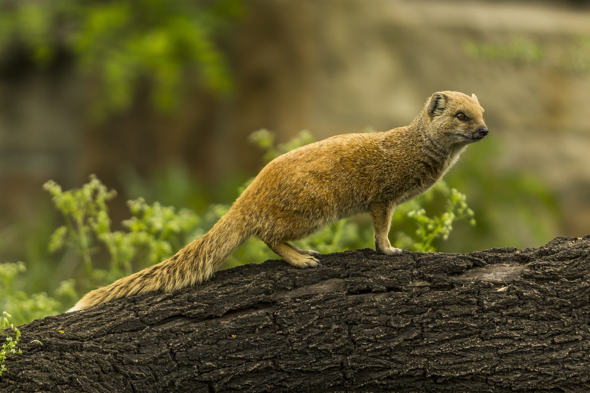
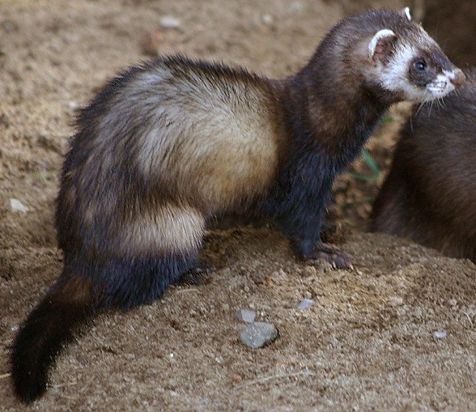

# Animals in the Bible

## License Information

Animals in the Bible © United Bible Societies, 2025. Adapted from: <cite>All Creatures Great and Small: Living Things in the Bible</cite>, by Edward R. Hope © 2005 United Bible Societies. This work is licensed under Creative Commons Attribution-ShareAlike 4.0 International (<a href="https://creativecommons.org/licenses/by-sa/4.0/">https://creativecommons.org/licenses/by-sa/4.0/</a>).

--------------------------------

## 标题：獴、鼬鼠（mongoose, weasel） (id: FAUNA:2.26)

2\.26 标题：獴、鼬鼠（mongoose, weasel）
===============================

经文出处
----

Hebrew 来：חֹלֶד (音译：choled)

[LEV 11:29](https://ref.ly/Lev11:29)

讨论
--

关于希伯来文*choled* 的意思，学者有很大的分歧。这个词的词根可能与一个意为"挖"的动词有关。接受这个词源学解释的人将其翻译成"鼹鼠"（以色列当地没有）、"田鼠"或"老鼠"。然而，这个词更有可能来自一个意为"爬行"或"蠕动"的闪语词根。接受后面这种解释的人把*choled* 翻译成"鼬鼠"。

一直到19世纪，以色列和约旦可能都有真正的鼬鼠（伶鼬；学名*Mustela nivalis* ）。然而，和鼬鼠类似的埃及獴（学名*Herpestes ichneumon* ）更为常见，这种动物在古埃及人眼中是神圣的动物，与月亮女神相关联。以色列地另一种类似鼬鼠的动物是虎鼬（学名*Vormela peregusna* ）。圣经中的*choled* 可能是这三种动物中的任何一种。大多数动物学家都认为是獴，这种动物与埃及宗教的联系也支持这种可能性。

描述
--

**鼬鼠** （伶鼬）是一种小型食肉动物，身体长，腿短，比大老鼠稍大。它们吃老鼠、小鸟、青蛙和鸟蛋。鼬鼠呈红黑色，腹部为白色；移动速度非常快，而且一直在移动，看上去好像在地面上滑行。它们的体型很小，可以钻到大老鼠的洞里。鼬鼠在白天和晚上都很活跃。

埃及獴 比鼬鼠大，从鼻子到尾巴尖约有80厘米（2\.5英尺）长。它们也是身体长，腿短；全身呈灰色，只有尾巴尖为黑色。埃及獴生活在芦苇床和茂密的灌木丛中，吃老鼠、耗子、蜥蜴、蛇、鸡、鸟、昆虫和鸡蛋，白天晚上都在捕食。

在现今的以色列，**虎鼬** 相当常见。这种动物比埃及獴小，但比鼬鼠大。头的下半部和身体是黑色的，胸部有一个白色的斑块；背部为黄棕色，上面有棕色的斑块。食性与埃及獴相似，但只在夜间觅食。受到威胁时，虎鼬会从肛门附近的腺体向敌人喷射一种液体，这种液体的气味非常难闻并且很难去除。

特殊意义或象征意义
---------

《利未记》记载，这是一种在礼仪上不洁净的动物。

翻译
--

在亚洲，最接近的对等物是一种亚洲獴或麝香猫。在北美和中美洲可以选择一种当地的鼬鼠或臭鼬；在非洲，显而易见的选择是一种较大的獴或虎鼬。在大洋洲，袋鼬（学名*Dasyurus quoll* 或*Dasyurops maculatus* ）或袋獾（学名*Sarcophilus harrisii* ）都是合理的对等物。在其他地方，可以使用"食鼠者"这样的词或进行音译。

* **Associated Passages:** 利未记 11:29

