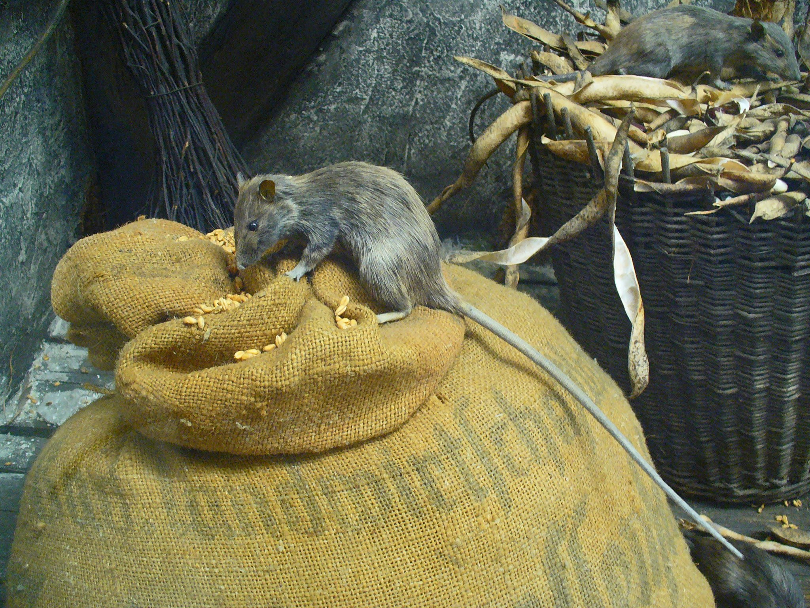

# Animals in the Bible

## License Information

Animals in the Bible © United Bible Societies, 2025. Adapted from: <cite>All Creatures Great and Small: Living Things in the Bible</cite>, by Edward R. Hope © 2005 United Bible Societies. This work is licensed under Creative Commons Attribution-ShareAlike 4.0 International (<a href="https://creativecommons.org/licenses/by-sa/4.0/">https://creativecommons.org/licenses/by-sa/4.0/</a>).

--------------------------------

## 标题：老鼠、耗子（mouse, rat） (id: FAUNA:2.27)

2\.27 标题：老鼠、耗子（mouse, rat）
==========================

经文出处
----

Hebrew 来：עַכְבָּר (音译：‘akbar)

[LEV 11:29](https://ref.ly/Lev11:29), [1SA 6:4](https://ref.ly/1Sam6:4), [1SA 6:5](https://ref.ly/1Sam6:5), [1SA 6:11](https://ref.ly/1Sam6:11), [1SA 6:18](https://ref.ly/1Sam6:18), [ISA 66:17](https://ref.ly/Isa66:17)

讨论
--

希伯来文*‘akbar* 是一个非常宽泛的词，包括所有小型啮齿动物。因此，这个词包括家鼠、田鼠、鼷鼠、睡鼠、跳鼠、沙鼠、黑鼠、棕鼠、仓鼠等。迦南人猎捕较大的啮齿动物作为食物，如跳鼠和沙鼠（尽管它们叫"沙鼠"，但实际上并不是老鼠），现今中东的许多沙漠部落也还是这样。

描述
--

我们不能在这本手册中描述希伯来文*‘akbar* 涵盖的所有啮齿动物，因此这里的描述仅限于耗子、鼷鼠、跳鼠和沙鼠。家鼠和田鼠在世界各地都为人所知，因此就不再赘述了。

**耗子** 比老鼠大（连尾巴有25—30厘米或1英尺长），但其他方面看起来很像老鼠。黑鼠（学名*Rattus rattus* ）和棕鼠（学名*Rattus norvegicus* ）都有不同的毛色，从黑色到灰褐色不等，另外棕鼠的口鼻稍短。黑鼠是一种跳蚤的宿主，而这种跳蚤是可怕的黑死病的携带者。在20世纪60年代，虽然动物学家们认为*Rattus rattus* 起源于亚洲，但在以色列也发现了这种耗子的遗骸，时间可追溯至史前。棕色挪威鼠是在20世纪30年代才出现在这片土地上的。

**黎凡特田鼠** （学名*Microtus socialis guentheri* ）：田鼠与小老鼠的区别很小，只是颊齿的形状不同，因此对于大多数人来说，两者看起来就是老鼠。田鼠的身体较小，毛呈灰褐色，肚子为浅白色，以草茎及小麦、大麦等谷物的茎秆为食。田鼠在白天和晚上都很活跃，每次活动约两三个小时，每天吃的食物有自己的体重那么多，甚至更多。田鼠每年最多可产16窝仔，一窝多达12只。因此，在食物充足并且有掩护物来躲避食肉动物的季节里，田鼠的数量会暴增，对农作物构成非常严重的威胁。在所有鼠类中，田鼠是最具破坏性的。

**埃及小跳鼠** （学名*Jaculus jaculus* ）：这个学名的意思是"跳跃者"。跳鼠比大多数老鼠略大，后腿很长，前腿很短；像袋鼠那样跳跃，甚至被（错误地）称为"袋鼠鼠"。跳鼠的尾巴很长，末端有一簇毛，用来在跳跃时保持平衡。它们生活在沙漠和半沙漠地区，身体也呈沙色。跳鼠只在晚上活动，眼睛和耳朵都很大，以弥补夜间活动的困难。它们以种子为食，可以长时间不喝水。

**巴勒斯坦沙鼠** （学名*Gerbillus andersoni allenbyi* ）：沙鼠和跳鼠非常相似，但体型较小。受到惊吓时，沙鼠的移动非常之快，每一下跳跃可达3米（10英尺）远。但从严格意义上来说，沙鼠并不是鼠。

特殊意义或象征意义
---------

在[LEV 11:29](https://ref.ly/Lev11:29) 中，*‘akbar* 被列为礼仪上不洁净的动物。至于是所有"鼠"都不洁净，还是只有某些种类不洁净，目前尚不清楚，并且犹太教学者经常对此进行争论。在中东的沙漠部落中，跳鼠、沙鼠和仓鼠都是常见的食物，现今已不归类为"鼠"。

翻译
--

[LEV 11:29](https://ref.ly/Lev11:29) ：翻译者要做的主要解经选择是，这条禁令是针对所有种类的小型啮齿动物，还是只针对其中一部分种类。解经家在这个问题上意见不一。NEB (New English Bible (1970)) 、JB (Jerusalem Bible (1966)) 、NIV (New International Version (1984)) 和REB (Revised English Bible (1989)) 都将这一禁令应用到具体的物种：耗子（JB (Jerusalem Bible (1966)) 和NIV (New International Version (1984)) ）或跳鼠（NEB (New English Bible (1970)) 和REB (Revised English Bible (1989)) ）。"耗子"是一个可以理解的选择，因为耗子，尤其是黑鼠，是众所周知的疾病携带者。TEV (Today's English Version (Good News Bible)) 认为禁令包括所有物种，译为"耗子、老鼠"。KJV (King James Version (1611)) 、RSV (Revised Standard Version (1952)) 和NAB (New American Bible (1970)) 译为"老鼠"，不过这个译法涵盖的范围可能更广，而不是更窄。

[1SA 5:6](https://ref.ly/1Sam5:6) ：这节经文有一个文本问题。《马索拉文本》只提到一种瘟疫，称为"肿瘤"。KJV (King James Version (1611)) 、RSV (Revised Standard Version (1952)) 、JB (Jerusalem Bible (1966)) 、NIV (New International Version (1984)) 和TEV (Today's English Version (Good News Bible)) 都依循这个文本。《七十士译本》和《武加大译本》提到两种瘟疫，即"肿块"和"耗子／老鼠"。有些学者认为后一种文本更好，因为这种差异可以解释为抄写员在抄写时遗漏了一行希伯来文文本。（这是一种很常见的错误。）NEB (New English Bible (1970)) 、REB (Revised English Bible (1989)) 和NAB (New American Bible (1970)) 依循这个文本。该文本也解释了为什么下一章提到两种瘟疫。即使文本中只保留了一种瘟疫，大多数注释书都将其解作与黑鼠有关的黑死病。

如果接受《七十士译本》的文本，那就有两种可能的解释。如果认为这两种瘟疫紧密联系，即肿块与耗子有关，而瘟疫是黑死病，那么，在这里和[1SA 6:0](https://ref.ly/1Sam6:0) 翻译成耗子是正确的。（TEV (Today's English Version (Good News Bible)) 在第6章的脚注中标明该瘟疫是黑死病，但却出人意料地将*‘akbarim* 译为"老鼠"！）然而，如果不把"老鼠"和肿瘤联系起来，那么第二种瘟疫可能是指田鼠这种破坏性极强的动物突然数目激增。

[ISA 66:17](https://ref.ly/Isa66:17) ：这节经文和[LEV 11:29](https://ref.ly/Lev11:29) 应使用同一个译词。

* **Associated Passages:** 利未记 11:29; 撒母耳记上 6:4; 撒母耳记上 6:5; 撒母耳记上 6:11; 撒母耳记上 6:18; 以赛亚书 66:17; 撒母耳记上 5:6; 撒母耳记上 6:0

