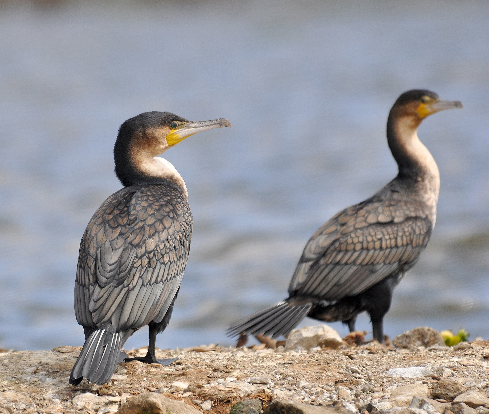

# Animals in the Bible

## License Information

Animals in the Bible © United Bible Societies, 2025. Adapted from: <cite>All Creatures Great and Small: Living Things in the Bible</cite>, by Edward R. Hope © 2005 United Bible Societies. This work is licensed under Creative Commons Attribution-ShareAlike 4.0 International (<a href="https://creativecommons.org/licenses/by-sa/4.0/">https://creativecommons.org/licenses/by-sa/4.0/</a>).

--------------------------------

## 标题：鸬鹚（cormorant） (id: FAUNA:3.4)

3\.4 标题：鸬鹚（cormorant）
=====================

经文出处
----

Hebrew 来：שָׁלָךְ (音译：shalak)

[LEV 11:17](https://ref.ly/Lev11:17), [DEU 14:17](https://ref.ly/Deut14:17)

讨论
--

虽然*shalak* 译为"鸬鹚"的传统可追溯到17世纪，但是这种译法一直都有相当大的疑问。一方面，*shalak* 这个词的词根意思是"投掷"，表明叫这个名字的鸟是把自己"投掷"到猎物上，这不是鸬鹚的习性。鸬鹚是浮在水上，潜入水下捕获猎物。这使得已故的德赖弗（G. R. Driver）建议将这个词译为"渔鸮"，NEB (New English Bible (1970)) 和REB (Revised English Bible (1989)) 就采用了这种译法。但是，这个建议也有问题，因为渔鸮，或者更确切地说，褐渔鸮（学名*Scotopelia ceylonensis* ），不太可能为人熟知，渔民只能在有月光的夜晚看到它捕鱼，而且这种情况很少见。在出埃及时期，以色列人还不是一个捕鱼的民族。

在现代希伯来文中，*shalak* 是鹗或鱼鹰（学名*Pandion haliaetus* ）的名称，这是一种鱼雕，从高处俯冲进水中并用爪子抓鱼。有些以色列学者认为*shalak* 可能是白胸翡翠（学名*Halcyon smyrnensis* ）或鲣鸟（学名*Sula bassana* ）在古时的名字，它们都是从高处俯冲到猎物上，在水下用喙叼住猎物。

对这种鸟的辨识存在很多疑问，并且将其译为"鱼鹰"似乎与译成"鸬鹚"有同样多的理由，甚至更合理。

另参[3\.15 鱼鹰 (osprey)](#FAUNA:3.15) 。

描述
--

白颈鸬鹚或普通鸬鹚（学名*Phalacrocorax carbo* ）是中东地区最常见的一种鸬鹚。这种大型水鸟的身体细长，长喙的尖端为钩状。成年白颈鸬鹚通体黑色，在喉和喙的相接处有一个黄色小囊。这种鸬鹚的面部也为黄色；它们生活在海岸和湖岸、较大的河流沿岸和沼泽地区；脚蹼和鸭子相像，可以在水中游泳，但大部分身体都在水下；能潜水，可以长距离潜水捕鱼。

像所有鸬鹚一样，白颈鸬鹚的羽毛不防水，因此它能够轻松地在水下游泳。然而，这也意味着在潜水或游泳一段时间后，鸬鹚必须从水中出来，晾干翅膀。因此，经常可以看到鸬鹚栖息在木头或岩石上，展开翅膀晾着。

白天，鸬鹚通常只是以四五只的小群活动，但当晚上它们在树上栖息时，会大群聚集在一起，十分聒噪。在成群的小鱼贴近水面游动的季节，经常可以看到大群黑色鸬鹚贴着水面快速飞行，一只接一只排成长队，寻找鱼群。找到后，它们就会一起落在水面上，非常兴奋地捕食。

特殊意义或象征意义
---------

除了被列在不洁净的鸟类清单中，*shalak* 这种鸟在圣经中没有其他的重要意义。

翻译
--

如果翻译者决定将*shalak* 译为"鸬鹚"，那么找到当地的某种鸬鹚应该并不困难，因为鸬鹚分布在世界各地的大型水域附近。事实上，白颈鸬鹚不仅分布在以色列，而且遍布欧洲、亚洲、澳大拉西亚、非洲和北美洲东半部的海岸、湖岸、大型河流和沼泽地附近。非洲南部有一种形态略有不同的白颈鸬鹚，称为白胸鸬鹚，它的胸部和喉咙处为白色，喉囊较小，但学名相同。其他地方会有当地的鸬鹚种类，可以通过它们栖息时张开翅膀晾干的习性来识别。

* **Associated Passages:** 利未记 11:17; 申命记 14:17

