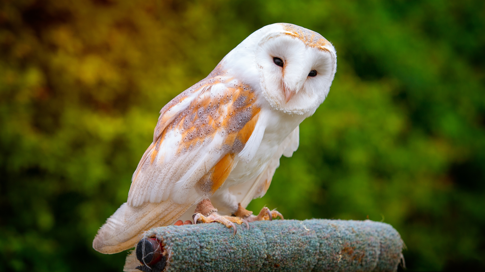

# Animals in the Bible

## License Information

Animals in the Bible © United Bible Societies, 2025. Adapted from: <cite>All Creatures Great and Small: Living Things in the Bible</cite>, by Edward R. Hope © 2005 United Bible Societies. This work is licensed under Creative Commons Attribution-ShareAlike 4.0 International (<a href="https://creativecommons.org/licenses/by-sa/4.0/">https://creativecommons.org/licenses/by-sa/4.0/</a>).

--------------------------------

## 标题：Tinshemeth（希伯来文） (id: FAUNA:3.17.8)

3\.17\.8 标题：Tinshemeth（希伯来文）
============================

经文出处
----

Hebrew 来：תִּנְשֶׁמֶת (音译：tinshemeth)

[LEV 11:18](https://ref.ly/Lev11:18), [DEU 14:16](https://ref.ly/Deut14:16)

讨论
--

如上所述，仓鸮、角鸮和白鸮等术语是同一种猫头鹰的别称。犹太和基督徒学者将*tinshemeth* 译为"仓鸮"（"barn owl"，NAB (New American Bible (1970)) ；NIV (New International Version (1984)) 译为"white owl"，"白鸮"）具有悠久的传统。NEB (New English Bible (1970)) 和REB (Revised English Bible (1989)) 按照德赖弗（G. R. Driver）的建议译为"little owl"（"小猫头鹰"），但这并没有像译为"仓鸮"那样在学者中得到广泛的支持，这也是 *tinshemeth* 的现代希伯来文含义。KJV (King James Version (1611)) 和RSV (Revised Standard Version (1952)) 将其分别译为"swan"（"天鹅"）和"water hen"（"水鸡"），这种意见可以置之不理。天鹅在以色列地极其罕见，"水鸡"这个词太过模糊。

希伯来文*tinshemeth* 一词实际上在圣经中出现过三次。其中两次可能是指仓鸮，但还有一次是指一种蜥蜴或变色龙。（参[4\.3 变色龙 (chameleon)](#FAUNA:4.3) 。）

描述
--

仓鸮（学名*Tyto alba* ）是世界上分布最广的猫头鹰之一，除了北极和南极地区以及偏远的岛屿外，几乎无处不在。身体灰白色，翅膀和背部是浅黄褐色或灰色，在胸部和翅膀下方几乎全为白色。眼睛很小，头部很大，还有一个非常引人注目的心形白色面盘，边缘是棕色线条。圆形面庞长着短鬃毛般的羽毛，可以帮助猫头鹰感受微小的声音。仓鸮经常栖息在谷仓、废弃的房屋、洞穴和墓地中，会发出多种奇怪的声音，从众所周知的抽搐颤抖的尖叫声到各种嘶嘶声、唧喳声和鼾声。雌性比雄性更大，叫声更响亮。这些猫头鹰主要以田鼠、家鼠和其他小型夜行动物为食。

特殊意义或象征意义
---------

这种鸟被列为礼仪上不洁净的鸟类，与坟墓和死亡联系在一起。

翻译
--

对于这种猫头鹰，在当地找到对应的种类应该没有多大问题。如果所有名称都不合适，那么可以使用"白脸猫头鹰"这个短语，尽管严格来说，还有一种与仓鸮没有密切关系并且更小的猫头鹰被称为"白脸猫头鹰"。

* **Associated Passages:** 利未记 11:18; 申命记 14:16

