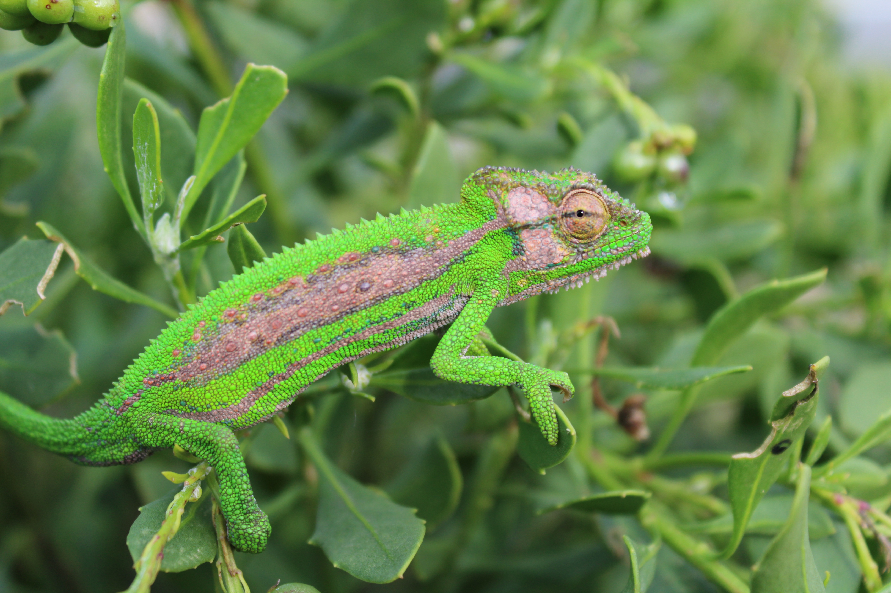

# Animals in the Bible

## License Information

Animals in the Bible © United Bible Societies, 2025. Adapted from: <cite>All Creatures Great and Small: Living Things in the Bible</cite>, by Edward R. Hope © 2005 United Bible Societies. This work is licensed under Creative Commons Attribution-ShareAlike 4.0 International (<a href="https://creativecommons.org/licenses/by-sa/4.0/">https://creativecommons.org/licenses/by-sa/4.0/</a>).

--------------------------------

## 标题：变色龙（chameleon） (id: FAUNA:4.3)

4\.3 标题：变色龙（chameleon）
======================

经文出处
----

Hebrew 来：תִּנְשֶׁמֶת (音译：tinshemeth)

[LEV 11:30](https://ref.ly/Lev11:30)

讨论
--

这个词不仅出现在蜥蜴的清单中，还出现在不洁净的鸟类清单中，因此似乎某种猫头鹰和某种爬行动物具有相同的名字。在许多语言中，用同一个名字称呼不同的生物是一种常见的现象。例如，在英文中，"cob"既指雄性天鹅，也指一种用来骑乘的马，"sable"既是一种小型肉食动物的名称，也是一种大型羚羊的名称；在荷兰文中，鸬鹚（一种鸟）和一种羚羊都叫"duiker"。

希伯来文*tinshemeth* 源自一个意为"喘气或大声呼吸"的动词，因此这个词很可能是指变色龙或变色蜥蜴。当变色龙恼怒、受伤或处于危险时，身体会变黑，很大的肺部会膨胀，使自己看起来更大，然后张开嘴，像蛇一样发出嘶嘶或呼呼的声音。另参[3\.17\.8 Tinshemeth（希伯来文）](#FAUNA:3.17.8) ，这是一种猫头鹰。

描述
--

变色龙（学名*Chamaeleo chamaeleon* ）是一种非常有趣的蜥蜴。它栖居在草木中，体色通常为绿色，然而可以改变颜色来融入环境，比如变成棕色、淡黄色或灰色，另外还可以改变身体不同部位的明暗度，从而显得斑驳，或呈现深深浅浅的色块，巧妙地伪装在草木之中。变色龙爬行缓慢，并且动作是摇摇摆摆、一走一停的，通常一次只移动一个肢体，很像是微风中摇晃的树枝。这种蜥蜴的每只脚都长着对趾，能够牢牢抓住细枝，从而稳稳地穿行其中。

变色龙的皮肤很硬，覆有小鳞片和许多疣状小肿块，沿着脊椎还有一排尖锐的鳞片。有些种类的头部和面部有像喇叭一样的突起。

变色龙的眼睛是独一无二的，眼睑完全盖住了眼睛，只通过一个小孔看东西。变色龙可以上下左右转动这个小孔，并且两个眼睑独立动作，从而能够同时朝两个方向观看。变色龙以昆虫为食，用又长又黏、弹性十足的舌头来捕捉昆虫，快如闪电。在刮风或攀爬的角度较大时，变色龙还会利用尾巴缠住树枝和其他东西来支撑身体。它可以用尾巴悬挂在枝条或小树枝上，并经常施展这种技巧从高处的树枝移到低处。

特殊意义或象征意义
---------

变色龙被列为礼仪上不洁净的动物。

翻译
--

除了沙漠地区，变色龙分布在非洲各地，部分亚洲热带地区也有它的踪迹。在变色龙不为人知的地方，可能需要从该地区的主要语言或希伯来文中借用一个词，如JB (Jerusalem Bible (1966)) 的做法。另外，也可以使用像"慢速蜥蜴"或"发嘶嘶声的蜥蜴"这样的短语。

* **Associated Passages:** 利未记 11:30

