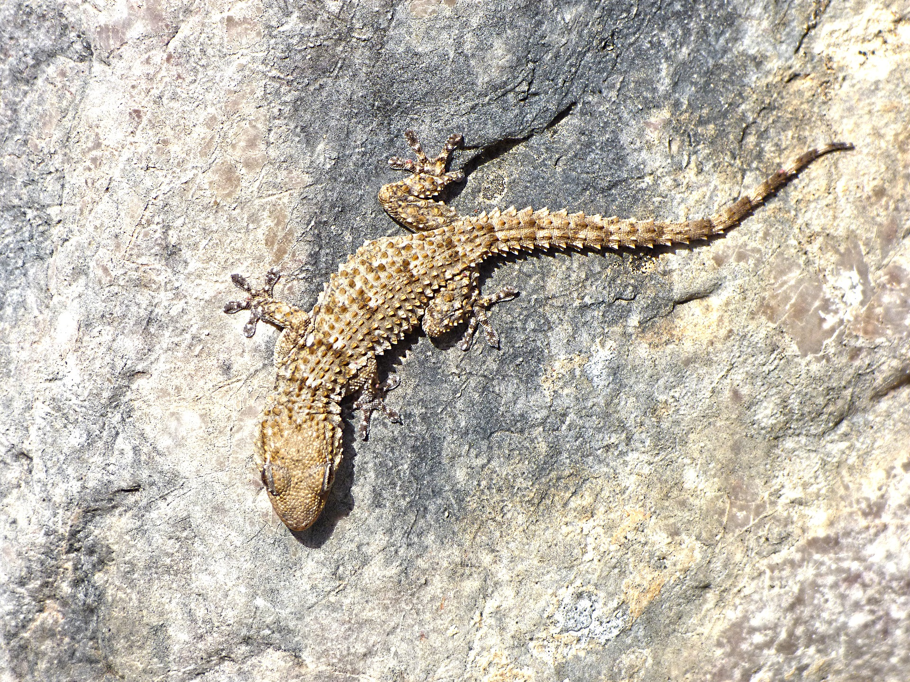

# Animals in the Bible

## License Information

Animals in the Bible © United Bible Societies, 2025. Adapted from: <cite>All Creatures Great and Small: Living Things in the Bible</cite>, by Edward R. Hope © 2005 United Bible Societies. This work is licensed under Creative Commons Attribution-ShareAlike 4.0 International (<a href="https://creativecommons.org/licenses/by-sa/4.0/">https://creativecommons.org/licenses/by-sa/4.0/</a>).

--------------------------------

## 标题：壁虎（gecko） (id: FAUNA:4.5)

4\.5 标题：壁虎（gecko）
=================

经文出处
----

Hebrew 来：אֲנָקָה (音译：’anaqah)

[LEV 11:30](https://ref.ly/Lev11:30)

Hebrew 来：שְׂמָמִית (音译：semamith)

[PRO 30:28](https://ref.ly/Prov30:28)

讨论
--

各译本都将*’anaqah* 译作壁虎。以色列地有许多种类的壁虎，从体型硕大的岩石壁虎（学名*Ptyodactylus hasselquistii* ）到长仅10厘米（4英寸）的土耳其蜥虎或地中海壁虎（学名*Hemidactylus turcicus* ）。*’Anaqah* 可能是所有壁虎的总称。该词和一个意为"呼喊"的动词有关联，从而提供了辨识这个名称的线索。

描述
--

壁虎是唯一会叫的蜥蜴。"壁虎"（gecko）这个名称是从马来文*getjok* 借来的，模仿的是一种壁虎的叫声。在许多语言中，不同种类壁虎的名称也是模仿它们的双音节叫声。例如，在泰国，大壁虎名叫*tuk\-gae* ，家壁虎称为*ching\-chok* 。

除了独特的叫声之外，所有壁虎的典型特征是脚趾末端都有小疙瘩（褶襞）。这些趾垫上面覆盖着纳米级的刚毛，因此壁虎可以抓住任何稍微粗糙的表面，能够在天花板和悬垂物上倒立爬行。

壁虎以蚂蚁、飞蛾、甲虫、苍蝇、蚊子和其他昆虫为食。雄性之间经常打斗，最后，其中一只可能会咬掉另一只的尾巴，并且可能会吃掉断尾。一些体型较大的壁虎也吃小蜥蜴和小蛇。

特殊意义或象征意义
---------

壁虎被列为礼仪上不洁净的动物。在[PRO 30:28](https://ref.ly/Prov30:28) 中，壁虎代表一种虽然不起眼，但却可以自由出现在王宫里的动物。

翻译
--

壁虎分布在非洲、中东、欧洲东南部、亚洲，以及澳大利亚的热带地区。在这些地区的当地语言中找到一个对应的译词并不困难。在没有壁虎的地方，通常可以从希伯来文或该地区的主要语言中借用一个词，然后和表示蜥蜴的词结合在一起，比如"anaka蜥蜴"或"gecko蜥蜴"。

KJV (King James Version (1611)) 把[PRO 30:28](https://ref.ly/Prov30:28) 中的*semamith* 译成"spider"（"蜘蛛"），但其他译本和解经家一致将这个词解释为"蜥蜴"。这里可能是指家壁虎，即室内最常见的壁虎。现代解经家大多认为这节经文中的这个动词是被动语态，意即"蜥蜴，可以被人拿在（或抓在）手中"。

* **Associated Passages:** 利未记 11:30; 箴言 30:28

