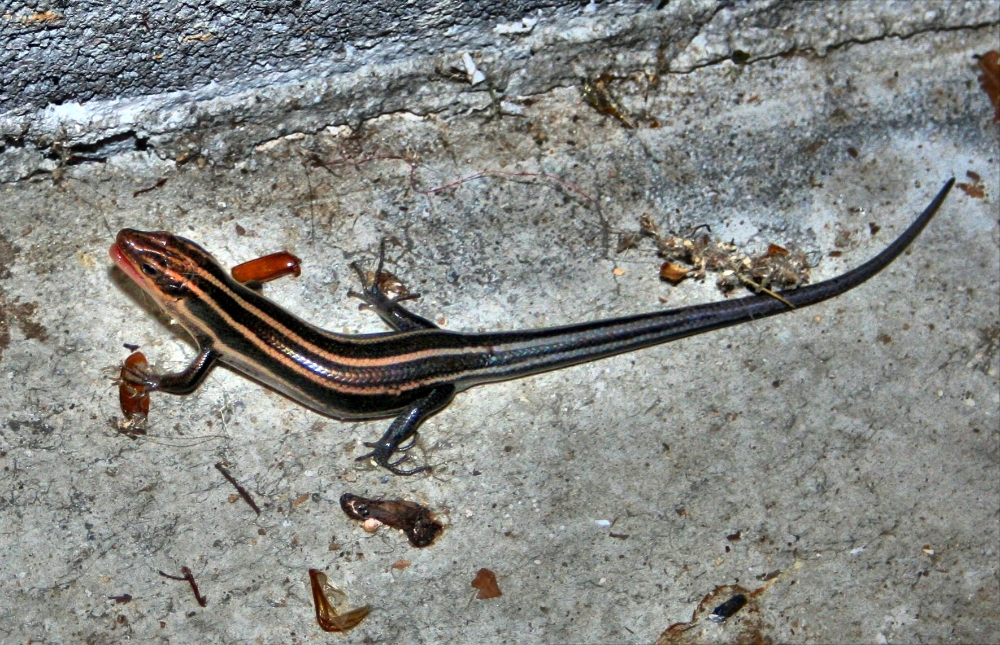

# Animals in the Bible

## License Information

Animals in the Bible © United Bible Societies, 2025. Adapted from: <cite>All Creatures Great and Small: Living Things in the Bible</cite>, by Edward R. Hope © 2005 United Bible Societies. This work is licensed under Creative Commons Attribution-ShareAlike 4.0 International (<a href="https://creativecommons.org/licenses/by-sa/4.0/">https://creativecommons.org/licenses/by-sa/4.0/</a>).

--------------------------------

## 标题：蛇医、石龙子（skink） (id: FAUNA:4.8)

4\.8 标题：蛇医、石龙子（skink）
=====================

经文出处
----

Hebrew 来：חֹמֶט (音译：chomet)

[LEV 11:30](https://ref.ly/Lev11:30)

讨论
--

这个词的意思仍然存在很大疑问，但是因为以色列和北非的蛇医（石龙子）非常多，所以这种动物很有可能列在该地区的蜥蜴清单里面。因此，NIV (New International Version (1984)) 和NAB (New American Bible (1970)) 的译文列入蛇医也有其道理。

描述
--

蛇医一般身体细长，呈流线型，皮肤光滑闪亮。蛇医有大有小，小的只有10厘米（4英寸）长，然而最大的沙漠蛇医长达50厘米（20英寸）。蛇医的腿比大多数其他种类的蜥蜴要短，因此看起来很像蛇。有些种类的蛇医甚至没有腿。生活在沙漠中的蛇医以游泳的动作在沙子中穿行。其他种类的蛇医生活在房屋里或岩石间，通常隐藏在裂缝中，以及石头或岩石下面。还有几种蛇医生活在洞穴里，而且爬得很快。蛇医以苍蝇、飞蛾、蚂蚁等昆虫为食，偶尔也会吃其他蛇医的尾巴。

大部分蛇医的皮肤为灰色或浅棕色，许多种类长着纵向条纹。

特殊意义或象征意义
---------

蛇医被列为礼仪上不洁净的动物。

翻译
--

事实上，除了南极和北极地区以外，世界各地都有蛇医的身影，通常很容易在当地语言中找到对应的译词。然而在许多语言中，蛇医和其他蜥蜴没有区别，这时"光滑的蜥蜴"或"细长的蜥蜴"等短语可能是最好的译法。

* **Associated Passages:** 利未记 11:30

