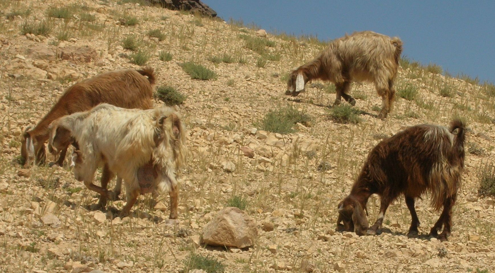
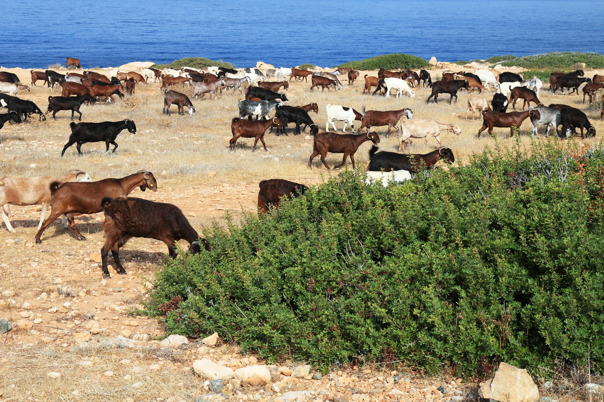

# Animals in the Bible

## License Information

Animals in the Bible © United Bible Societies, 2025. Adapted from: <cite>All Creatures Great and Small: Living Things in the Bible</cite>, by Edward R. Hope © 2005 United Bible Societies. This work is licensed under Creative Commons Attribution-ShareAlike 4.0 International (<a href="https://creativecommons.org/licenses/by-sa/4.0/">https://creativecommons.org/licenses/by-sa/4.0/</a>).

--------------------------------

## 标题：山羊（goat） (id: FAUNA:2.16)

2\.16 标题：山羊（goat）
=================

经文出处
----

Hebrew 来：עֵז (音译：‘ez)

[GEN 15:9](https://ref.ly/Gen15:9), [GEN 27:9](https://ref.ly/Gen27:9), [GEN 27:16](https://ref.ly/Gen27:16), [GEN 30:32](https://ref.ly/Gen30:32), [GEN 30:33](https://ref.ly/Gen30:33), [GEN 30:35](https://ref.ly/Gen30:35), [GEN 31:38](https://ref.ly/Gen31:38), [GEN 32:15](https://ref.ly/Gen32:15), [GEN 37:31](https://ref.ly/Gen37:31), [GEN 38:17](https://ref.ly/Gen38:17), [GEN 38:20](https://ref.ly/Gen38:20), [EXO 12:5](https://ref.ly/Exod12:5), [LEV 1:10](https://ref.ly/Lev1:10), [LEV 3:12](https://ref.ly/Lev3:12), [LEV 4:23](https://ref.ly/Lev4:23), [LEV 4:28](https://ref.ly/Lev4:28), [LEV 5:6](https://ref.ly/Lev5:6), [LEV 7:23](https://ref.ly/Lev7:23), [LEV 9:3](https://ref.ly/Lev9:3), [LEV 16:5](https://ref.ly/Lev16:5), [LEV 17:3](https://ref.ly/Lev17:3), [LEV 22:19](https://ref.ly/Lev22:19), [LEV 22:27](https://ref.ly/Lev22:27), [LEV 23:19](https://ref.ly/Lev23:19), [NUM 7:16](https://ref.ly/Num7:16), [NUM 7:22](https://ref.ly/Num7:22), [NUM 7:28](https://ref.ly/Num7:28), [NUM 7:34](https://ref.ly/Num7:34), [NUM 7:40](https://ref.ly/Num7:40), [NUM 7:46](https://ref.ly/Num7:46), [NUM 7:52](https://ref.ly/Num7:52), [NUM 7:58](https://ref.ly/Num7:58), [NUM 7:64](https://ref.ly/Num7:64), [NUM 7:70](https://ref.ly/Num7:70), [NUM 7:76](https://ref.ly/Num7:76), [NUM 7:82](https://ref.ly/Num7:82), [NUM 7:87](https://ref.ly/Num7:87), [NUM 15:11](https://ref.ly/Num15:11), [NUM 15:24](https://ref.ly/Num15:24), [NUM 15:27](https://ref.ly/Num15:27), [NUM 18:17](https://ref.ly/Num18:17), [NUM 28:15](https://ref.ly/Num28:15), [NUM 28:30](https://ref.ly/Num28:30), [NUM 29:5](https://ref.ly/Num29:5), [NUM 29:11](https://ref.ly/Num29:11), [NUM 29:16](https://ref.ly/Num29:16), [NUM 29:19](https://ref.ly/Num29:19), [NUM 29:25](https://ref.ly/Num29:25), [DEU 14:4](https://ref.ly/Deut14:4), [JDG 6:19](https://ref.ly/Judg6:19), [JDG 13:15](https://ref.ly/Judg13:15), [JDG 13:19](https://ref.ly/Judg13:19), [JDG 15:1](https://ref.ly/Judg15:1), [1SA 16:20](https://ref.ly/1Sam16:20), [1SA 19:13](https://ref.ly/1Sam19:13), [1SA 19:16](https://ref.ly/1Sam19:16), [1SA 25:2](https://ref.ly/1Sam25:2), [1KI 20:27](https://ref.ly/1Kgs20:27), [2CH 29:21](https://ref.ly/2Chr29:21), [2CH 35:7](https://ref.ly/2Chr35:7), [PRO 27:27](https://ref.ly/Prov27:27), [SNG 4:1](https://ref.ly/Song4:1), [SNG 6:5](https://ref.ly/Song6:5), [EZK 43:22](https://ref.ly/Ezek43:22), [EZK 45:23](https://ref.ly/Ezek45:23), [DAN 8:5](https://ref.ly/Dan8:5), [DAN 8:8](https://ref.ly/Dan8:8)

Hebrew 来：עַתּוּד (音译：‘atud)

[GEN 31:10](https://ref.ly/Gen31:10), [GEN 31:12](https://ref.ly/Gen31:12), [NUM 7:17](https://ref.ly/Num7:17), [NUM 7:23](https://ref.ly/Num7:23), [NUM 7:29](https://ref.ly/Num7:29), [NUM 7:35](https://ref.ly/Num7:35), [NUM 7:41](https://ref.ly/Num7:41), [NUM 7:47](https://ref.ly/Num7:47), [NUM 7:53](https://ref.ly/Num7:53), [NUM 7:59](https://ref.ly/Num7:59), [NUM 7:65](https://ref.ly/Num7:65), [NUM 7:71](https://ref.ly/Num7:71), [NUM 7:77](https://ref.ly/Num7:77), [NUM 7:83](https://ref.ly/Num7:83), [NUM 7:88](https://ref.ly/Num7:88), [DEU 32:14](https://ref.ly/Deut32:14), [PSA 50:9](https://ref.ly/Ps50:9), [PSA 50:13](https://ref.ly/Ps50:13), [PSA 66:15](https://ref.ly/Ps66:15), [PRO 27:26](https://ref.ly/Prov27:26), [ISA 1:11](https://ref.ly/Isa1:11), [ISA 34:6](https://ref.ly/Isa34:6), [JER 50:8](https://ref.ly/Jer50:8), [JER 51:40](https://ref.ly/Jer51:40), [EZK 27:21](https://ref.ly/Ezek27:21), [EZK 34:17](https://ref.ly/Ezek34:17), [EZK 39:18](https://ref.ly/Ezek39:18)

Hebrew 来：צָפִיר (音译：tsafir)

[2CH 29:21](https://ref.ly/2Chr29:21), [EZR 8:35](https://ref.ly/Ezra8:35), [DAN 8:5](https://ref.ly/Dan8:5), [DAN 8:5](https://ref.ly/Dan8:5), [DAN 8:8](https://ref.ly/Dan8:8), [DAN 8:21](https://ref.ly/Dan8:21)

Hebrew 来：שָׂעִיר (音译：sa‘ir)

[GEN 37:31](https://ref.ly/Gen37:31), [LEV 4:23](https://ref.ly/Lev4:23), [LEV 4:24](https://ref.ly/Lev4:24), [LEV 9:3](https://ref.ly/Lev9:3), [LEV 9:15](https://ref.ly/Lev9:15), [LEV 10:16](https://ref.ly/Lev10:16), [LEV 16:5](https://ref.ly/Lev16:5), [LEV 16:7](https://ref.ly/Lev16:7), [LEV 16:8](https://ref.ly/Lev16:8), [LEV 16:9](https://ref.ly/Lev16:9), [LEV 16:10](https://ref.ly/Lev16:10), [LEV 16:15](https://ref.ly/Lev16:15), [LEV 16:18](https://ref.ly/Lev16:18), [LEV 16:20](https://ref.ly/Lev16:20), [LEV 16:21](https://ref.ly/Lev16:21), [LEV 16:22](https://ref.ly/Lev16:22), [LEV 16:26](https://ref.ly/Lev16:26), [LEV 16:27](https://ref.ly/Lev16:27), [LEV 23:19](https://ref.ly/Lev23:19), [NUM 7:16](https://ref.ly/Num7:16), [NUM 7:22](https://ref.ly/Num7:22), [NUM 7:28](https://ref.ly/Num7:28), [NUM 7:34](https://ref.ly/Num7:34), [NUM 7:40](https://ref.ly/Num7:40), [NUM 7:46](https://ref.ly/Num7:46), [NUM 7:52](https://ref.ly/Num7:52), [NUM 7:58](https://ref.ly/Num7:58), [NUM 7:64](https://ref.ly/Num7:64), [NUM 7:70](https://ref.ly/Num7:70), [NUM 7:76](https://ref.ly/Num7:76), [NUM 7:82](https://ref.ly/Num7:82), [NUM 7:87](https://ref.ly/Num7:87), [NUM 15:24](https://ref.ly/Num15:24), [NUM 28:15](https://ref.ly/Num28:15), [NUM 28:22](https://ref.ly/Num28:22), [NUM 28:30](https://ref.ly/Num28:30), [NUM 29:5](https://ref.ly/Num29:5), [NUM 29:11](https://ref.ly/Num29:11), [NUM 29:16](https://ref.ly/Num29:16), [NUM 29:19](https://ref.ly/Num29:19), [NUM 29:22](https://ref.ly/Num29:22), [NUM 29:25](https://ref.ly/Num29:25), [NUM 29:28](https://ref.ly/Num29:28), [NUM 29:31](https://ref.ly/Num29:31), [NUM 29:34](https://ref.ly/Num29:34), [NUM 29:38](https://ref.ly/Num29:38), [2CH 29:23](https://ref.ly/2Chr29:23), [EZK 43:22](https://ref.ly/Ezek43:22), [EZK 43:25](https://ref.ly/Ezek43:25), [EZK 45:23](https://ref.ly/Ezek45:23), [DAN 8:21](https://ref.ly/Dan8:21)

Hebrew 来：שְׂעִירָה (音译：se‘irah)

[LEV 4:28](https://ref.ly/Lev4:28), [LEV 5:6](https://ref.ly/Lev5:6)

Hebrew 来：תַּיִשׁ (音译：tayish)

[GEN 30:35](https://ref.ly/Gen30:35), [GEN 32:15](https://ref.ly/Gen32:15), [2CH 17:11](https://ref.ly/2Chr17:11), [PRO 30:31](https://ref.ly/Prov30:31)

Greek 希：αἴγειος (音译：aigeios)

[HEB 11:37](https://ref.ly/Phlm11:37)

Greek 希：αἴξ (音译：aix)

[JDT 2:17](https://ref.ly/Tob2:17)

Greek 希：τράγος (音译：tragos)

[HEB 9:12](https://ref.ly/Phlm9:12), [HEB 9:13](https://ref.ly/Phlm9:13), [HEB 9:19](https://ref.ly/Phlm9:19), [HEB 10:4](https://ref.ly/Phlm10:4), [1ES 8:66](https://ref.ly/4Macc8:66)

Greek 希：χίμαρος (音译：chimaros)

[1ES 7:8](https://ref.ly/4Macc7:8)

讨论
--

希伯来文*‘ez* 和希腊文*tragos* 是表示"山羊"的常用词语，一般用在与礼仪无关的表达中。*‘Ez* 通常是阴性形式，由于人们很少吃成年公羊，因此这个词常指养作肉食或产奶的山羊。

希伯来文*‘atud* 指的是羊群中的领头公山羊，也可以引申指人类领袖。

*Tsafir* 是一个亚兰文或晚期希伯来文词语，出现在圣经中的《历代志下》、《以斯拉记》和《但以理书》，这些书卷是最后添加到旧约正典中的。*Tsafir* 指的是公山羊，可能是被阉割过的。

希伯来文*sa‘ir* 主要出现在《利未记》，指的是献祭用的山羊。这个词的字面意思是"毛茸茸的那个"，可能指专门养来生产羊毛的山羊（参下面的描述 部分）。*Sa‘ir* 指的是公山羊，阴性形式是*se‘irah* 。

希伯来文*tayish* 的意思是"用头部顶撞的那个"，指公山羊。

希腊文*aigeios* 指的是一种为了获取长羊毛而选育的山羊。*Aix* 一词可能也有这个含义。

描述
--

山羊是一种体型较小的有蹄动物。在中东，它们在很早的时候就被驯养了。长毛山羊和短毛山羊都为人所知，养长毛山羊是为了得到羊毛，养短毛山羊则是为了得到羊奶、肉和皮。短毛山羊可能是努比亚山羊（学名*Capra hircus mambrica* ），这个品种的山羊长着一对垂耳，带黑白或棕白斑点。长毛山羊是安哥拉山羊（学名*Capra hircus angorensis* ）的一种，也长着垂耳，通常是黑色的，长长的毛柔软而光滑。

圣经中有三处经文把这种羊毛比作人类的头发：[SNG 4:1](https://ref.ly/Song4:1) 、[SNG 6:5](https://ref.ly/Song6:5) 和[1SA 19:13](https://ref.ly/1Sam19:13) 。

对于古时的以色列人来说，山羊非常重要。山羊和绵羊一样，是肉、奶、皮革、羊毛和羊角的重要来源。山羊喜欢吃叶子和嫩枝胜过青草，因此它们不会和绵羊争吃牧草。事实上，即使在没有草的地方，山羊也可以靠着沙漠灌木生存下去。山羊非常耐受干旱或沙漠气候。

人们把山羊和绵羊合群放牧，不过绵羊的数量更多。事实上，山羊对牧羊人的帮助很大。绵羊缺少自信，对彼此的依赖性很强，因而总是成群挤在一起；而山羊则在一只公头羊的领导下，分散成多个群体，自信地走来走去。当绵羊和山羊一起放牧时，山羊以山坡或山谷边缘的灌木为食，绵羊则在地形比较平缓的地方吃草。山羊分散，绵羊跟随着山羊，这样绵羊吃草的区域就更大了，从而所有的羊都从低密度放牧中受益。

另外，山羊的方向感比绵羊好。绵羊跟着山羊，这样它们走失的可能性就降低了。黄昏时分，山羊会自动跟着头羊回圈，而绵羊会跟随着山羊，这样，牧羊人的工作就轻松多了。

成年公山羊的肉有很重的膻味，人们不爱吃。然而，宰杀母山羊也不好，因为它们要繁殖后代。因此，在圣经时期，人们通常宰杀公山羊羔来食用，另外也可能会把阉割的公山羊养肥来吃。

山羊毛可用来制作帐棚和厚外套，也可用作枕头和鞍子的填充物。

中东地区的垂耳山羊不像其他山羊品种那样容易与绵羊区分开来，因此，把绵羊和山羊分开时必须小心。

另参[2\.31 绵羊、羔羊、小羊 (sheep, lamb)](#FAUNA:2.31) 。

特殊意义或象征意义
---------

虽然山羊是人类重要的食物和衣服来源，但在古代中东的民间宗教中，山羊也与魔鬼联系在一起。这种联系在三段经文中尤其明显；下面会讨论其中两段。第三段经文是[LEV 16:5–LEV 16:28](https://ref.ly/Lev16:5-Lev16:28) ，在这段经文中，拈阄所选"归给阿撒泻勒"的那只山羊要被送到旷野里去。阿撒泻勒（Azazel）是旷野山羊鬼魔的名字。这段经文不是要敬拜山羊鬼魔，而是把以色列人的罪送到它那里去。

希伯来文*‘atud* 指在一群山羊中的领头公山羊，也用来指"牧羊人"式的人类领袖。

翻译
--

如果目标语言中没有"山羊"一词，通常可以使用外来词或采用音译。在知道山羊的地方，应使用通常表示山羊的词。当*‘ez* 和另一个表示山羊的词一起出现时，*‘ez* 应译为"母山羊"。同样地，当*sa‘ir* 和另一个表示山羊的词同时出现时，*sa‘ir* 应译为"公山羊"。

除了下文提到的《耶利米书》和《撒迦利亚书》的经文之外，*‘atud* 都应该译为"大公山羊"、"领头山羊"或"种公山羊"。

[LEV 17:7](https://ref.ly/Lev17:7) ：在这节经文中，这个词指的是异教献给山羊鬼魔的祭牲，而不是指山羊。有些英文译本译为"satyr"（"萨提尔"，古希腊神话中半人半羊的森林之神），这是不正确的，因为这个词语反映的是很久以后的希腊信仰。翻译者应该将其译作"山羊鬼魔"。

[2CH 11:15](https://ref.ly/2Chr11:15) ：经文的字面直译作，"为他自己所造的丘坛、山羊和牛犊设立的祭司。"很明显，这里的"山羊"，以及丘坛和牛犊，都是人手造的。换句话说，这句话的意思是，"事奉他所建造的高地神龛、山羊偶像和牛犊偶像的祭司。"

[ISA 13:21](https://ref.ly/Isa13:21) ，[ISA 34:14](https://ref.ly/Isa34:14) ：这两节经文提到的其他动物都是与荒凉毁坏的城镇相关联的野生动物。这些城镇中似乎还有幸存的山羊，它们没有牧羊人照看，就像野生动物那样生活。在这些经文中，翻译者应该把字面意思为"山羊"的词语译为"野化山羊"或"野山羊"。有些语言还可以采用"吃垃圾的山羊"、"变野了的山羊"、"灌木山羊"或"森林山羊"等表达。

[JER 51:40](https://ref.ly/Jer51:40) ；[ZEC 10:3](https://ref.ly/Zech10:3) ：在这两节经文中，*‘atud* 应译为"羊群的首领"或类似表述。

在所有其他经文中，翻译者都可以使用表示山羊的常用词语。

* **Associated Passages:** 创世记 15:9; 创世记 27:9; 创世记 27:16; 创世记 30:32; 创世记 30:33; 创世记 30:35; 创世记 31:38; 创世记 32:15; 创世记 37:31; 创世记 38:17; 创世记 38:20; 出埃及记 12:5; 利未记 1:10; 利未记 3:12; 利未记 4:23; 利未记 4:28; 利未记 5:6; 利未记 7:23; 利未记 9:3; 利未记 16:5; 利未记 17:3; 利未记 22:19; 利未记 22:27; 利未记 23:19; 民数记 7:16; 民数记 7:22; 民数记 7:28; 民数记 7:34; 民数记 7:40; 民数记 7:46; 民数记 7:52; 民数记 7:58; 民数记 7:64; 民数记 7:70; 民数记 7:76; 民数记 7:82; 民数记 7:87; 民数记 15:11; 民数记 15:24; 民数记 15:27; 民数记 18:17; 民数记 28:15; 民数记 28:30; 民数记 29:5; 民数记 29:11; 民数记 29:16; 民数记 29:19; 民数记 29:25; 申命记 14:4; 士师记 6:19; 士师记 13:15; 士师记 13:19; 士师记 15:1; 撒母耳记上 16:20; 撒母耳记上 19:13; 撒母耳记上 19:16; 撒母耳记上 25:2; 列王纪上 20:27; 历代志下 29:21; 历代志下 35:7; 箴言 27:27; 雅歌 4:1; 雅歌 6:5; 以西结书 43:22; 以西结书 45:23; 但以理书 8:5; 但以理书 8:8; 创世记 31:10; 创世记 31:12; 民数记 7:17; 民数记 7:23; 民数记 7:29; 民数记 7:35; 民数记 7:41; 民数记 7:47; 民数记 7:53; 民数记 7:59; 民数记 7:65; 民数记 7:71; 民数记 7:77; 民数记 7:83; 民数记 7:88; 申命记 32:14; 诗篇 50:9; 诗篇 50:13; 诗篇 66:15; 箴言 27:26; 以赛亚书 1:11; 以赛亚书 34:6; 耶利米书 50:8; 耶利米书 51:40; 以西结书 27:21; 以西结书 34:17; 以西结书 39:18; 以斯拉记 8:35; 但以理书 8:21; 利未记 4:24; 利未记 9:15; 利未记 10:16; 利未记 16:7; 利未记 16:8; 利未记 16:9; 利未记 16:10; 利未记 16:15; 利未记 16:18; 利未记 16:20; 利未记 16:21; 利未记 16:22; 利未记 16:26; 利未记 16:27; 民数记 28:22; 民数记 29:22; 民数记 29:28; 民数记 29:31; 民数记 29:34; 民数记 29:38; 历代志下 29:23; 以西结书 43:25; 历代志下 17:11; 箴言 30:31; 希伯来书 11:37; 友弟德传 2:17; 希伯来书 9:12; 希伯来书 9:13; 希伯来书 9:19; 希伯来书 10:4; 厄斯德拉上 8:66; 厄斯德拉上 7:8; 利未记 16:28; 利未记 17:7; 历代志下 11:15; 以赛亚书 13:21; 以赛亚书 34:14; 撒迦利亚书 10:3

## 标题：小山羊（young goat, kid） (id: FAUNA:2.16.1)

2\.16\.1 标题：小山羊（young goat, kid）
================================

经文出处
----

Hebrew 来：גְּדִי, גְּדִיָּה (音译：gedi, gediyah)

[GEN 27:9](https://ref.ly/Gen27:9), [GEN 27:16](https://ref.ly/Gen27:16), [GEN 38:17](https://ref.ly/Gen38:17), [GEN 38:20](https://ref.ly/Gen38:20), [GEN 38:23](https://ref.ly/Gen38:23), [EXO 23:19](https://ref.ly/Exod23:19), [EXO 34:26](https://ref.ly/Exod34:26), [DEU 14:21](https://ref.ly/Deut14:21), [JDG 6:19](https://ref.ly/Judg6:19), [JDG 13:15](https://ref.ly/Judg13:15), [JDG 13:19](https://ref.ly/Judg13:19), [JDG 14:6](https://ref.ly/Judg14:6), [JDG 15:1](https://ref.ly/Judg15:1), [1SA 10:3](https://ref.ly/1Sam10:3), [1SA 16:20](https://ref.ly/1Sam16:20), [SNG 1:8](https://ref.ly/Song1:8), [ISA 11:6](https://ref.ly/Isa11:6)

Greek 希：ἔριφος, ἐρίφιον (音译：erifos, erifion)

[MAT 25:32](https://ref.ly/Matt25:32), [MAT 25:33](https://ref.ly/Matt25:33), [LUK 15:29](https://ref.ly/Mark15:29), [TOB 2:12](https://ref.ly/Rev2:12), [TOB 2:13](https://ref.ly/Rev2:13), [SIR 47:3](https://ref.ly/Wis47:3), [1ES 1:7](https://ref.ly/4Macc1:7)

讨论
--

以色列人通常只在特殊的节期宰杀肥牛犊，但是会定期宰杀肥山羊羔（包括公的和母的）作平常食用。公山羊只有在成年之后，其肉质才会因为性成熟而带有很重的膻味。

翻译
--

在希伯来文中，*gedi* 经常与其他表示山羊的词（如*‘ez* ）一起使用，形成类似*gedi ‘izim* 的表达，字面意思是"山羊的小羊"。这个较长表达和词语*gedi* 的意思完全相同。在所有经文中，翻译者都可以使用一个具体的词语或者表示小山羊或幼崽的短语。参上一个条目中的插图。

* **Associated Passages:** 创世记 27:9; 创世记 27:16; 创世记 38:17; 创世记 38:20; 创世记 38:23; 出埃及记 23:19; 出埃及记 34:26; 申命记 14:21; 士师记 6:19; 士师记 13:15; 士师记 13:19; 士师记 14:6; 士师记 15:1; 撒母耳记上 10:3; 撒母耳记上 16:20; 雅歌 1:8; 以赛亚书 11:6; 马太福音 25:32; 马太福音 25:33; 路加福音 15:29; 多俾亚传 2:12; 多俾亚传 2:13; 德训篇 47:3; 厄斯德拉上 1:7

