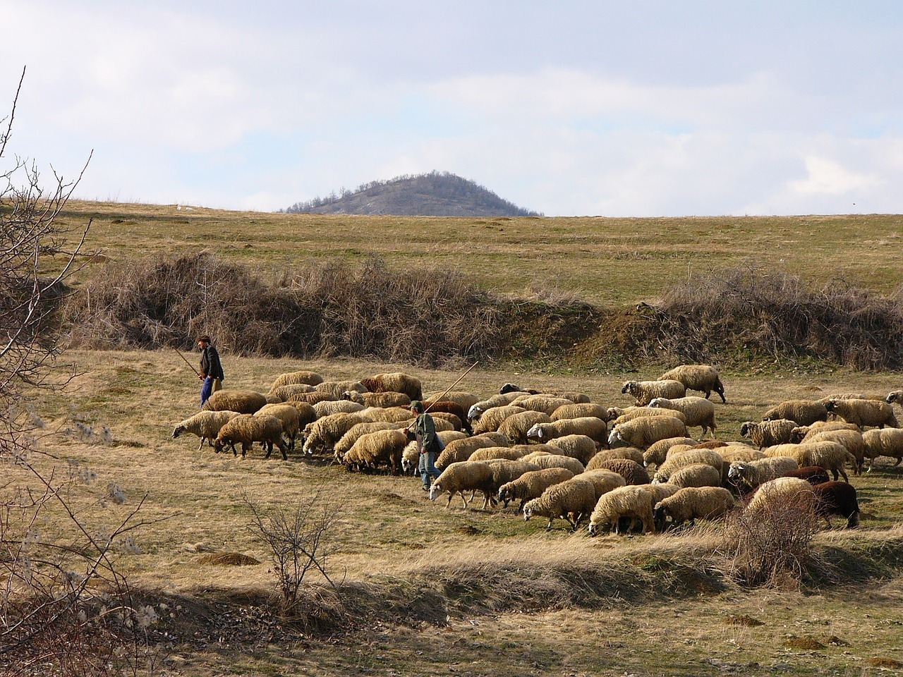
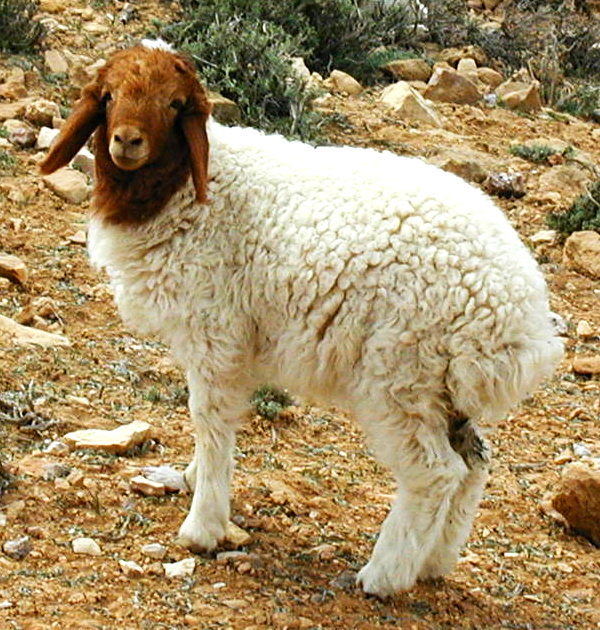
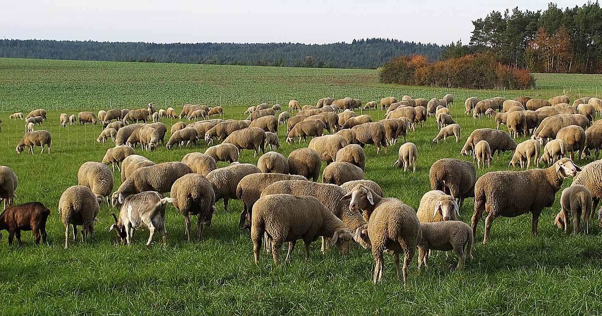

# Animals in the Bible

## License Information

Animals in the Bible © United Bible Societies, 2025. Adapted from: <cite>All Creatures Great and Small: Living Things in the Bible</cite>, by Edward R. Hope © 2005 United Bible Societies. This work is licensed under Creative Commons Attribution-ShareAlike 4.0 International (<a href="https://creativecommons.org/licenses/by-sa/4.0/">https://creativecommons.org/licenses/by-sa/4.0/</a>).

--------------------------------

## 标题：绵羊、羔羊、小羊（sheep, lamb） (id: FAUNA:2.31)

2\.31 标题：绵羊、羔羊、小羊（sheep, lamb）
==============================

经文出处
----

Hebrew 来：אַיִל (音译：’ayil)

GEN 15:9, GEN 22:13, GEN 22:13, GEN 31:38, GEN 32:15, EXO 25:5, EXO 26:14, EXO 29:1, EXO 29:3, EXO 29:15, EXO 29:15, EXO 29:16, EXO 29:17, EXO 29:18, EXO 29:19, EXO 29:19, EXO 29:20, EXO 29:22, EXO 29:22, EXO 29:26, EXO 29:27, EXO 29:31, EXO 29:32, EXO 35:7, EXO 35:23, EXO 36:19, EXO 39:34, LEV 5:15, LEV 5:16, LEV 5:18, LEV 5:25, LEV 8:2, LEV 8:18, LEV 8:18, LEV 8:20, LEV 8:21, LEV 8:22, LEV 8:22, LEV 8:22, LEV 8:29, LEV 9:2, LEV 9:4, LEV 9:18, LEV 9:19, LEV 16:3, LEV 16:5, LEV 19:21, LEV 19:22, LEV 23:18, NUM 5:8, NUM 6:14, NUM 6:17, NUM 6:19, NUM 7:15, NUM 7:17, NUM 7:21, NUM 7:23, NUM 7:27, NUM 7:29, NUM 7:33, NUM 7:35, NUM 7:39, NUM 7:41, NUM 7:45, NUM 7:47, NUM 7:51, NUM 7:53, NUM 7:57, NUM 7:59, NUM 7:63, NUM 7:65, NUM 7:69, NUM 7:71, NUM 7:75, NUM 7:77, NUM 7:81, NUM 7:83, NUM 7:87, NUM 7:88, NUM 15:6, NUM 15:11, NUM 23:1, NUM 23:2, NUM 23:4, NUM 23:14, NUM 23:29, NUM 23:30, NUM 28:11, NUM 28:12, NUM 28:14, NUM 28:19, NUM 28:20, NUM 28:27, NUM 28:28, NUM 29:2, NUM 29:3, NUM 29:8, NUM 29:9, NUM 29:13, NUM 29:14, NUM 29:14, NUM 29:17, NUM 29:18, NUM 29:20, NUM 29:21, NUM 29:23, NUM 29:24, NUM 29:26, NUM 29:27, NUM 29:29, NUM 29:30, NUM 29:32, NUM 29:33, NUM 29:36, NUM 29:37, DEU 32:14, 1SA 15:22, 2KI 3:4, 1CH 15:26, 1CH 29:21, 2CH 13:9, 2CH 17:11, 2CH 29:21, 2CH 29:22, 2CH 29:32, EZR 8:35, EZR 10:19, JOB 42:8, PSA 66:15, PSA 114:4, PSA 114:6, ISA 1:11, ISA 34:6, ISA 60:7, JER 51:40, EZK 27:21, EZK 34:17, EZK 39:18, EZK 43:23, EZK 43:25, EZK 45:23, EZK 45:24, EZK 46:4, EZK 46:5, EZK 46:6, EZK 46:7, EZK 46:11, DAN 8:3, DAN 8:4, DAN 8:6, DAN 8:7, DAN 8:7, DAN 8:7, DAN 8:7, DAN 8:20, MIC 6:7

Hebrew 来：אִמַּר (音译：’imar)

EZR 6:9, EZR 6:17, EZR 7:17

Hebrew 来：דְּכַר (音译：dekar)

EZR 6:9, EZR 6:17, EZR 7:17

Hebrew 来：טָלֶה (音译：taleh)

1SA 7:9, ISA 40:11, ISA 65:25

Hebrew 来：כֶּבֶשׂ, כַבְשָׂה, כִּבְשָׂה (音译：keves, kavsah, kivsah)

GEN 21:28, GEN 21:29, GEN 21:30, EXO 12:5, EXO 29:38, EXO 29:39, EXO 29:39, EXO 29:40, EXO 29:41, LEV 4:32, LEV 9:3, LEV 12:6, LEV 14:10, LEV 14:10, LEV 14:12, LEV 14:13, LEV 14:21, LEV 14:24, LEV 14:25, LEV 23:12, LEV 23:18, LEV 23:19, LEV 23:20, NUM 6:12, NUM 6:14, NUM 6:14, NUM 7:15, NUM 7:17, NUM 7:21, NUM 7:23, NUM 7:27, NUM 7:29, NUM 7:33, NUM 7:35, NUM 7:39, NUM 7:41, NUM 7:45, NUM 7:47, NUM 7:51, NUM 7:53, NUM 7:57, NUM 7:59, NUM 7:63, NUM 7:65, NUM 7:69, NUM 7:71, NUM 7:75, NUM 7:77, NUM 7:81, NUM 7:83, NUM 7:87, NUM 7:88, NUM 15:5, NUM 15:11, NUM 28:3, NUM 28:4, NUM 28:4, NUM 28:7, NUM 28:8, NUM 28:9, NUM 28:11, NUM 28:13, NUM 28:14, NUM 28:19, NUM 28:21, NUM 28:21, NUM 28:27, NUM 28:29, NUM 28:29, NUM 29:2, NUM 29:4, NUM 29:4, NUM 29:8, NUM 29:10, NUM 29:10, NUM 29:13, NUM 29:15, NUM 29:15, NUM 29:17, NUM 29:18, NUM 29:20, NUM 29:21, NUM 29:23, NUM 29:24, NUM 29:26, NUM 29:27, NUM 29:29, NUM 29:30, NUM 29:32, NUM 29:33, NUM 29:36, NUM 29:37, 2SA 12:3, 2SA 12:4, 2SA 12:6, 1CH 29:21, 2CH 29:21, 2CH 29:22, 2CH 29:32, 2CH 35:7, EZR 8:35, JOB 31:20, PRO 27:26, ISA 1:11, ISA 5:17, ISA 11:6, JER 11:19, EZK 46:4, EZK 46:5, EZK 46:6, EZK 46:7, EZK 46:11, EZK 46:13, EZK 46:15, HOS 4:16

Hebrew 来：כֶּשֶׂב, כִּשְׂבָּה (音译：kesev, kisvah)

GEN 30:32, GEN 30:33, GEN 30:35, GEN 30:40, LEV 1:10, LEV 3:7, LEV 4:35, LEV 5:6, LEV 7:23, LEV 17:3, LEV 22:19, LEV 22:27, NUM 18:17, DEU 14:4

Hebrew 来：כַּר (音译：kar)

DEU 32:14, 1SA 15:9, 2KI 3:4, PSA 37:20, ISA 16:1, ISA 34:6, JER 51:40, EZK 27:21, EZK 39:18, AMO 6:4

Hebrew 来：רָחֵל (音译：rachel)

GEN 31:38, GEN 32:15, SNG 6:6, ISA 53:7

Greek 希：ἀμνός (音译：amnos)

JHN 1:29, JHN 1:36, ACT 8:32, 1PE 1:19, WIS 19:9, SIR 13:17

Greek 希：ἀρήν (音译：arēn)

LUK 10:3

Greek 希：ἀρνίον, ἀρνος (音译：arnion, arnos)

JHN 21:15, REV 5:6, REV 5:8, REV 5:12, REV 5:13, REV 6:1, REV 6:16, REV 7:9, REV 7:10, REV 7:14, REV 7:17, REV 12:11, REV 13:8, REV 13:11, REV 14:1, REV 14:4, REV 14:4, REV 14:10, REV 15:3, REV 17:14, REV 17:14, REV 19:7, REV 19:9, REV 21:9, REV 21:14, REV 21:22, REV 21:23, REV 21:27, REV 22:1, REV 22:3, SIR 46:16, SIR 47:3, 1ES 1:7, 1ES 6:28, 1ES 7:7, 1ES 8:14

Greek 希：κριός (音译：krios)

TOB 7:8, S3Y 1:16, 1ES 6:29, 1ES 7:7, 1ES 8:14, 1ES 8:65, 1ES 9:20

Greek 希：μάνδρα (音译：mandra)

JDT 2:26, JDT 3:3

Greek 希：πασχα (音译：pascha)

MRK 14:12, LUK 22:7, 1CO 5:7

Greek 希：πρόβατον (音译：probaton)

MAT 7:15, MAT 9:36, MAT 10:6, MAT 10:16, MAT 12:11, MAT 12:12, MAT 15:24, MAT 18:12, MAT 25:32, MAT 25:33, MAT 26:31, MRK 6:34, MRK 14:27, LUK 15:4, LUK 15:6, JHN 2:14, JHN 2:15, JHN 10:1, JHN 10:2, JHN 10:3, JHN 10:3, JHN 10:4, JHN 10:7, JHN 10:8, JHN 10:11, JHN 10:12, JHN 10:12, JHN 10:13, JHN 10:15, JHN 10:16, JHN 10:26, JHN 10:27, JHN 21:16, JHN 21:17, ACT 8:32, ROM 8:36, HEB 13:20, 1PE 2:25, REV 18:13, TOB 7:8, JDT 2:17, JDT 8:26, JDT 11:19, SIR 47:3, BEL 14:3, BEL 14:32, 1ES 1:8, 1ES 1:9

Greek 希：πρωτότοκος (音译：prototokos)

TOB 5:13

Latin 拉：grex

2ES 5:18, 2ES 15:10

Latin 拉：ovis

2ES 5:26, 2ES 16:32

讨论
--

在亚伯拉罕时期之前，美索不达米亚已经培育出至少五种绵羊。从木乃伊化的遗骸（意即保存下来的尸体）和古代艺术作品中得知，在主前2000年左右，埃及就至少已经有了两个不同的品种。因此，圣经中提到的绵羊可能不止一种。

希伯来文*kar* 似乎用来指进口的外国绵羊，可能指一个特殊的品种，但有些学者认为指的是阉割过的公羊，因为这个词从来没有在祭祀的语境中出现过。*Kar* 也用来指撞城槌，这是悬挂在绳子上的一根重木，在攻城时用来撞破城墙。*’Ayil* 指成年公绵羊，*rachel* 指正在繁殖的母绵羊，*taleh* 指非常幼小的羔羊，可能还没有断奶。其余的希伯来文词语是绵羊的通称。

希腊文*probaton* 是一个通称，表示绵羊，或者可能包括山羊在内的羊群。希腊文*krios* 表示公绵羊。*Pascha* 是一个专有名词，特指逾越节的羔羊。其余的希腊文词语都是指羔羊。*Ovis* 是拉丁文的绵羊。

早期的希伯来人是游牧民族，对他们来说，绵羊是最重要的家畜。虽然山羊几乎所有植物都吃，但绵羊却对所吃的草和植物比较挑剔。这意味着要找到合适的牧放场所并不总是很容易，牧羊人需要不停地把羊群从一个地方赶到另一个地方。这就导致了游牧的生活方式；他们通常住在可以移动的帐棚里，而不是普通的房屋里面。直到以色列人离开埃及、占领迦南地之后，他们的生活方式才发生改变，开始在乡村定居，成为农民和果农。

然而，即使在那个时候，大多数家庭仍然会养羊，有些家庭成员也会像牧羊人那样，经常离家生活很长的时间。

圣经记载，绵羊为人类提供肉、奶、毛、皮和角，并且人们有可能为了提高这些商品的产量而选择性地培育出来多个品种。圣经早在摩西律法中就提到了羊毛，而且禁止把羊毛和植物纤维混在一起织造衣物。甚至在颁布摩西律法之前，GEN 31:19 就提到了剪羊毛。事实上，绵羊毛是以色列人最常用的纤维。

在圣经时期，从埃及一直到中国就已经有了大规模的羊毛贸易。在中东，羊毛比棉花和亚麻这两种常用纤维更加便宜。（丝绸在所罗门时期就已经为人所知，但因为产自中国，在运往西方的途中经由许多商人转手，所以极其昂贵。）如果认为当时所有羊毛都是白色的，那就错了，正如GEN 30:0 清楚指明，有些绵羊是深色的，有些绵羊有深色和浅色的斑块，可能是黑色、白色和棕色的混合。

*绵羊和羔羊 (© Ray Pritz (UBS))*

我们可以相当肯定地说，以色列人知道的一种羊是肥尾羊（学名*Ovis laticaudata* ），在EXO 29:22; LEV 3:9; LEV 8:25; LEV 9:19 中提到了它的肥尾。

羊角有多种用途。整只羊角可用作喝水的器皿、瓶和号角。羊角片可用作刀柄和其他家用器具，以及制作手镯和珠子等饰品。针，可能还有箭头，也是用羊角和骨头做的，后来是用青铜和铁。

绵羊在以色列宗教中也非常重要。在献祭制度和传统宗教节期中，尤其是在逾越节，绵羊是非常重要的元素。

描述
--

绵羊和山羊属于同一个大科。不同之处在于绵羊生产羊毛，这是一种特殊的软毛，长在羊身上的普通毛发之间。公绵羊角和山羊角的形状也不同。公绵羊的角向下卷曲，在面部旁边形成小弧度螺旋，而山羊的角朝着肩部后卷的幅度较大。圣经时期的绵羊所生产的羊毛比今天的品种所产羊毛要短得多。

肥尾羊或宽尾羊是一种小型绵羊，通常是棕色和白色，有一条非常宽的尾巴。和中东大多数其他品种的绵羊一样，肥尾羊的耳朵又大又软。

绵羊一般比较胆小，缺乏山羊的自信和适应能力。山羊会分散开来寻找食物，然后重新聚集在一起；而绵羊若与其他绵羊分开，会变得非常没有安全感，因而往往扎堆，所以牧羊人的工作量很大。在中东，人们会训练带头公山羊跟随着牧羊人。然后，其余的绵羊会跟着这只带头公山羊，并且这只公山羊通常会戴着木制的铃舌或铃铛。绵羊在进食时，通常会保持在能够听到铃声的范围内。这种方法可能已经有几百年的历史。（关于绵羊和山羊的进一步比较，参[2\.16 山羊（goat）](#FAUNA:2.16) 。）

*牧羊人和绵羊 (Pixabay)*

对于大多数的现代品种，只有公绵羊长着角。但是在大多数古代品种中，母绵羊也长着短角。因此，分开羊群中的绵羊和山羊要比今天更难。另参[2\.31\.1 羊群(flock, herd)](#FAUNA:2.31.1) 中的插图。

特殊意义或象征意义
---------

在所有动物中，绵羊对以色列民族来说是最重要的，具有重要的宗教、社会和经济意义。

圣经经常把以色列人，可能还把整个人类，比喻成绵羊。像绵羊一样，人们很容易就会误入歧途（PSA 119:176; ISA 53:6; JER 50:6; 1PE 2:25 ）、需要引导和保护（1KI 22:17; 2CH 18:16; MAT 9:36; MRK 6:34 ）、毫无防卫能力（ISA 52:7 ），以及命定要早早死去（PSA 44:23 （《和》44:22）；JER 12:3 ；ROM 8:36 ）。

*羔羊 (© Ray Pritz (UBS))*

在新约中，羔羊喻指基督，强调他是为赎世人的罪而献上的祭牲，特别是在《约翰福音》和《启示录》中。《启示录》引入这个比喻的方式给人留下了深刻的印象。REV 5:5 记载，作者正为没有人能打开书卷而悲伤，这时一位长老安慰他说，"犹大支派的狮子"已得胜，能展开那书卷。接下来，本以为会看到狮子的作者却看到了一只像是被宰杀了的、献作祭牲的羔羊。这卷书的其余部分都是在描写这羔羊胜过邪恶势力。

在福音书中，耶稣也称他的门徒为"羊"和"羔羊"（MAT 10:17; JHN 10:1; JHN 21:15; JHN 21:17; JHN 21:18 ）。

牧者的比喻延伸到上帝自己，他是终极的"以色列的牧者"（PSA 23:1 ，PSA 80:2 ［《和》80:1］）。其次，那些负责教育、引导、统治和保护以色列的君王、先知和祭司也被喻为牧人（ISA 56:11; JER 23:4; JER 49:19; EZK 34:2; ZEC 10:2 ）。

弥赛亚也被称为牧人（ISA 40:11 ），并且耶稣称自己为"好牧人"（JHN 10:11 ）。在HEB 13:20 中，他被称为"群羊的大牧人"；在1PE 2:25 中，他被称为"你们性命的牧人和监督"。

翻译
--

在知道绵羊的语言中，我们建议根据上面讨论 部分给出的含义进行翻译。如果可能的话，应该把阴性形式翻译成"母羔羊"或"母绵羊"。如果目标语言没有表示绵羊的词语，翻译者通常可以在开始翻译圣经前先创造或借用一个词语，然后用在译文中。对于绵羊这种动物，我们不建议用另外一种当地熟知的动物来替代，因为这样就体现不出绵羊在圣经文化中所具有的礼仪和象征意义。

在翻译PSA 23:1 时，必须确保"我的牧者"这个短语保留了作者意欲表达的关系，并反映出诗人关于耶和华是他的恩主、保护者和向导的主题。实际上，这篇诗的首节有两个比喻：上帝被比作照顾羊的牧羊人，以及这个比喻所蕴含的，诗人被比作依靠牧羊人的绵羊。在许多语言中，短语"我的牧者"表示的是一种与上述不同的关系，指"看顾我的绵羊的人"或"我雇来照看我羊的人"。在许多非洲语言中，有些粗心的翻译者所翻的译文是这种意思："首领（不过）是我的牧人"。在很多时候，翻译者需要把整节经文改述为："我是羊，主是我的牧人。"

* **Associated Passages:** 创世记 15:9; 创世记 22:13; 创世记 31:38; 创世记 32:15; 出埃及记 25:5; 出埃及记 26:14; 出埃及记 29:1; 出埃及记 29:3; 出埃及记 29:15; 出埃及记 29:16; 出埃及记 29:17; 出埃及记 29:18; 出埃及记 29:19; 出埃及记 29:20; 出埃及记 29:22; 出埃及记 29:26; 出埃及记 29:27; 出埃及记 29:31; 出埃及记 29:32; 出埃及记 35:7; 出埃及记 35:23; 出埃及记 36:19; 出埃及记 39:34; 利未记 5:15; 利未记 5:16; 利未记 5:18; 利未记 5:25; 利未记 8:2; 利未记 8:18; 利未记 8:20; 利未记 8:21; 利未记 8:22; 利未记 8:29; 利未记 9:2; 利未记 9:4; 利未记 9:18; 利未记 9:19; 利未记 16:3; 利未记 16:5; 利未记 19:21; 利未记 19:22; 利未记 23:18; 民数记 5:8; 民数记 6:14; 民数记 6:17; 民数记 6:19; 民数记 7:15; 民数记 7:17; 民数记 7:21; 民数记 7:23; 民数记 7:27; 民数记 7:29; 民数记 7:33; 民数记 7:35; 民数记 7:39; 民数记 7:41; 民数记 7:45; 民数记 7:47; 民数记 7:51; 民数记 7:53; 民数记 7:57; 民数记 7:59; 民数记 7:63; 民数记 7:65; 民数记 7:69; 民数记 7:71; 民数记 7:75; 民数记 7:77; 民数记 7:81; 民数记 7:83; 民数记 7:87; 民数记 7:88; 民数记 15:6; 民数记 15:11; 民数记 23:1; 民数记 23:2; 民数记 23:4; 民数记 23:14; 民数记 23:29; 民数记 23:30; 民数记 28:11; 民数记 28:12; 民数记 28:14; 民数记 28:19; 民数记 28:20; 民数记 28:27; 民数记 28:28; 民数记 29:2; 民数记 29:3; 民数记 29:8; 民数记 29:9; 民数记 29:13; 民数记 29:14; 民数记 29:17; 民数记 29:18; 民数记 29:20; 民数记 29:21; 民数记 29:23; 民数记 29:24; 民数记 29:26; 民数记 29:27; 民数记 29:29; 民数记 29:30; 民数记 29:32; 民数记 29:33; 民数记 29:36; 民数记 29:37; 申命记 32:14; 撒母耳记上 15:22; 列王纪下 3:4; 历代志上 15:26; 历代志上 29:21; 历代志下 13:9; 历代志下 17:11; 历代志下 29:21; 历代志下 29:22; 历代志下 29:32; 以斯拉记 8:35; 以斯拉记 10:19; 约伯记 42:8; 诗篇 66:15; 诗篇 114:4; 诗篇 114:6; 以赛亚书 1:11; 以赛亚书 34:6; 以赛亚书 60:7; 耶利米书 51:40; 以西结书 27:21; 以西结书 34:17; 以西结书 39:18; 以西结书 43:23; 以西结书 43:25; 以西结书 45:23; 以西结书 45:24; 以西结书 46:4; 以西结书 46:5; 以西结书 46:6; 以西结书 46:7; 以西结书 46:11; 但以理书 8:3; 但以理书 8:4; 但以理书 8:6; 但以理书 8:7; 但以理书 8:20; 弥迦书 6:7; 以斯拉记 6:9; 以斯拉记 6:17; 以斯拉记 7:17; 撒母耳记上 7:9; 以赛亚书 40:11; 以赛亚书 65:25; 创世记 21:28; 创世记 21:29; 创世记 21:30; 出埃及记 12:5; 出埃及记 29:38; 出埃及记 29:39; 出埃及记 29:40; 出埃及记 29:41; 利未记 4:32; 利未记 9:3; 利未记 12:6; 利未记 14:10; 利未记 14:12; 利未记 14:13; 利未记 14:21; 利未记 14:24; 利未记 14:25; 利未记 23:12; 利未记 23:19; 利未记 23:20; 民数记 6:12; 民数记 15:5; 民数记 28:3; 民数记 28:4; 民数记 28:7; 民数记 28:8; 民数记 28:9; 民数记 28:13; 民数记 28:21; 民数记 28:29; 民数记 29:4; 民数记 29:10; 民数记 29:15; 撒母耳记下 12:3; 撒母耳记下 12:4; 撒母耳记下 12:6; 历代志下 35:7; 约伯记 31:20; 箴言 27:26; 以赛亚书 5:17; 以赛亚书 11:6; 耶利米书 11:19; 以西结书 46:13; 以西结书 46:15; 何西阿书 4:16; 创世记 30:32; 创世记 30:33; 创世记 30:35; 创世记 30:40; 利未记 1:10; 利未记 3:7; 利未记 4:35; 利未记 5:6; 利未记 7:23; 利未记 17:3; 利未记 22:19; 利未记 22:27; 民数记 18:17; 申命记 14:4; 撒母耳记上 15:9; 诗篇 37:20; 以赛亚书 16:1; 阿摩司书 6:4; 雅歌 6:6; 以赛亚书 53:7; 约翰福音 1:29; 约翰福音 1:36; 使徒行传 8:32; 彼得前书 1:19; 智慧篇 19:9; 德训篇 13:17; 路加福音 10:3; 约翰福音 21:15; 启示录 5:6; 启示录 5:8; 启示录 5:12; 启示录 5:13; 启示录 6:1; 启示录 6:16; 启示录 7:9; 启示录 7:10; 启示录 7:14; 启示录 7:17; 启示录 12:11; 启示录 13:8; 启示录 13:11; 启示录 14:1; 启示录 14:4; 启示录 14:10; 启示录 15:3; 启示录 17:14; 启示录 19:7; 启示录 19:9; 启示录 21:9; 启示录 21:14; 启示录 21:22; 启示录 21:23; 启示录 21:27; 启示录 22:1; 启示录 22:3; 德训篇 46:16; 德训篇 47:3; 厄斯德拉上 1:7; 厄斯德拉上 6:28; 厄斯德拉上 7:7; 厄斯德拉上 8:14; 多俾亚传 7:8; 三童歌 1:16; 厄斯德拉上 6:29; 厄斯德拉上 8:65; 厄斯德拉上 9:20; 友弟德传 2:26; 友弟德传 3:3; 马可福音 14:12; 路加福音 22:7; 哥林多前书 5:7; 马太福音 7:15; 马太福音 9:36; 马太福音 10:6; 马太福音 10:16; 马太福音 12:11; 马太福音 12:12; 马太福音 15:24; 马太福音 18:12; 马太福音 25:32; 马太福音 25:33; 马太福音 26:31; 马可福音 6:34; 马可福音 14:27; 路加福音 15:4; 路加福音 15:6; 约翰福音 2:14; 约翰福音 2:15; 约翰福音 10:1; 约翰福音 10:2; 约翰福音 10:3; 约翰福音 10:4; 约翰福音 10:7; 约翰福音 10:8; 约翰福音 10:11; 约翰福音 10:12; 约翰福音 10:13; 约翰福音 10:15; 约翰福音 10:16; 约翰福音 10:26; 约翰福音 10:27; 约翰福音 21:16; 约翰福音 21:17; 罗马书 8:36; 希伯来书 13:20; 彼得前书 2:25; 启示录 18:13; 友弟德传 2:17; 友弟德传 8:26; 友弟德传 11:19; 彼勒与大龙 14:3; 彼勒与大龙 14:32; 厄斯德拉上 1:8; 厄斯德拉上 1:9; 多俾亚传 5:13; 厄斯德拉下 5:18; 厄斯德拉下 15:10; 厄斯德拉下 5:26; 厄斯德拉下 16:32; 创世记 31:19; 创世记 30:0; 利未记 3:9; 利未记 8:25; 诗篇 119:176; 以赛亚书 53:6; 耶利米书 50:6; 列王纪上 22:17; 历代志下 18:16; 以赛亚书 52:7; 诗篇 44:23; 耶利米书 12:3; 启示录 5:5; 马太福音 10:17; 约翰福音 21:18; 诗篇 23:1; 诗篇 80:2; 以赛亚书 56:11; 耶利米书 23:4; 耶利米书 49:19; 以西结书 34:2; 撒迦利亚书 10:2

* **Associated ACAI Concepts:** Sheep (ID: `fauna:Lamb`)

## 标题：羊群（flock, herd） (id: FAUNA:2.31.1)

2\.31\.1 标题：羊群（flock, herd）
===========================

经文出处
----

Hebrew 来：מַרְעִית (音译：mar‘it)

JER 10:21

Hebrew 来：עֵדֶר (音译：‘eder)

GEN 29:2, GEN 29:3, GEN 29:8, GEN 30:40, GEN 32:17, GEN 32:20, JDG 5:16, 1SA 17:34, 2CH 32:28, JOB 24:2, PSA 78:52, PRO 27:23, SNG 1:7, SNG 4:1, SNG 4:2, SNG 6:5, SNG 6:6, ISA 17:2, ISA 32:14, ISA 40:11, JER 6:3, JER 13:17, JER 13:20, JER 31:10, JER 31:24, JER 51:23, EZK 34:12, JOL 1:18, MIC 2:12, MIC 4:8, MIC 5:7, ZEP 2:14, ZEC 10:3, MAL 1:14

Hebrew 来：צֹאן (音译：ts’on)

GEN 4:2, GEN 4:4, GEN 12:16, GEN 13:5, GEN 20:14, GEN 21:27, GEN 21:28, GEN 24:35, GEN 26:14, GEN 27:9, GEN 29:2, GEN 29:3, GEN 29:6, GEN 29:7, GEN 29:8, GEN 29:9, GEN 29:10, GEN 29:10, GEN 30:31, GEN 30:32, GEN 30:36, GEN 30:38, GEN 30:38, GEN 30:39, GEN 30:39, GEN 30:40, GEN 30:40, GEN 30:40, GEN 30:41, GEN 30:41, GEN 30:42, GEN 30:43, GEN 31:4, GEN 31:8, GEN 31:8, GEN 31:10, GEN 31:10, GEN 31:12, GEN 31:19, GEN 31:38, GEN 31:41, GEN 31:43, GEN 31:43, GEN 32:6, GEN 32:8, GEN 33:13, GEN 33:13, GEN 34:28, GEN 37:2, GEN 37:12, GEN 37:14, GEN 38:12, GEN 38:13, GEN 38:17, GEN 45:10, GEN 46:32, GEN 46:32, GEN 46:34, GEN 47:1, GEN 47:3, GEN 47:4, GEN 47:17, GEN 50:8, EXO 2:16, EXO 2:17, EXO 2:19, EXO 3:1, EXO 3:1, EXO 9:3, EXO 10:9, EXO 10:24, EXO 12:21, EXO 12:32, EXO 12:38, EXO 20:24, EXO 21:37, EXO 22:29, EXO 34:3, LEV 1:2, LEV 1:10, LEV 3:6, LEV 5:6, LEV 5:15, LEV 5:18, LEV 5:25, LEV 22:21, LEV 27:32, NUM 11:22, NUM 15:3, NUM 22:40, NUM 27:17, NUM 31:28, NUM 31:30, NUM 31:32, NUM 31:36, NUM 31:37, NUM 31:43, NUM 32:16, NUM 32:36, DEU 7:13, DEU 8:13, DEU 12:6, DEU 12:17, DEU 12:21, DEU 14:23, DEU 14:26, DEU 15:14, DEU 15:19, DEU 15:19, DEU 16:2, DEU 18:4, DEU 28:4, DEU 28:18, DEU 28:31, DEU 28:51, DEU 32:14, JOS 7:24, 1SA 8:17, 1SA 14:32, 1SA 15:9, 1SA 15:14, 1SA 15:15, 1SA 15:21, 1SA 16:11, 1SA 16:19, 1SA 17:15, 1SA 17:20, 1SA 17:28, 1SA 17:34, 1SA 24:4, 1SA 25:2, 1SA 25:2, 1SA 25:4, 1SA 25:16, 1SA 25:18, 1SA 27:9, 1SA 30:20, 2SA 7:8, 2SA 12:2, 2SA 12:4, 2SA 17:29, 2SA 24:17, 1KI 1:9, 1KI 1:19, 1KI 1:25, 1KI 5:3, 1KI 8:5, 1KI 8:63, 1KI 22:17, 2KI 5:26, 1CH 4:39, 1CH 4:41, 1CH 5:21, 1CH 12:41, 1CH 17:7, 1CH 21:17, 1CH 27:31, 2CH 5:6, 2CH 7:5, 2CH 14:14, 2CH 15:11, 2CH 17:11, 2CH 18:2, 2CH 18:16, 2CH 29:33, 2CH 30:24, 2CH 30:24, 2CH 31:6, 2CH 32:29, 2CH 35:7, EZR 10:19, NEH 3:1, NEH 3:32, NEH 5:18, NEH 10:37, NEH 12:39, JOB 1:3, JOB 1:16, JOB 21:11, JOB 30:1, JOB 42:12, PSA 44:12, PSA 44:23, PSA 49:15, PSA 65:14, PSA 74:1, PSA 77:21, PSA 78:52, PSA 78:70, PSA 79:13, PSA 80:2, PSA 95:7, PSA 100:3, PSA 107:41, PSA 114:4, PSA 114:6, PSA 144:13, PRO 27:23, ECC 2:7, SNG 1:8, ISA 7:21, ISA 13:14, ISA 22:13, ISA 53:6, ISA 60:7, ISA 61:5, ISA 63:11, ISA 65:10, JER 3:24, JER 5:17, JER 12:3, JER 13:20, JER 23:1, JER 23:2, JER 23:3, JER 25:34, JER 25:35, JER 25:36, JER 31:12, JER 33:12, JER 33:13, JER 49:20, JER 49:29, JER 50:6, JER 50:8, JER 50:45, EZK 24:5, EZK 25:5, EZK 34:2, EZK 34:3, EZK 34:6, EZK 34:6, EZK 34:8, EZK 34:8, EZK 34:8, EZK 34:8, EZK 34:10, EZK 34:10, EZK 34:10, EZK 34:11, EZK 34:12, EZK 34:12, EZK 34:15, EZK 34:17, EZK 34:19, EZK 34:22, EZK 34:31, EZK 34:31, EZK 36:37, EZK 36:38, EZK 36:38, EZK 36:38, EZK 43:23, EZK 43:25, EZK 45:15, HOS 5:6, JOL 1:18, AMO 6:4, AMO 7:15, JON 3:7, MIC 2:12, MIC 5:7, MIC 7:14, HAB 3:17, ZEP 2:6, ZEC 9:16, ZEC 10:2, ZEC 11:4, ZEC 11:7, ZEC 11:7, ZEC 11:7, ZEC 11:11, ZEC 11:17, ZEC 13:7

Hebrew 来：שֶׂה (音译：seh)

GEN 22:7, GEN 22:8, GEN 30:32, EXO 12:3, EXO 12:4, EXO 12:5, EXO 13:13, EXO 21:37, EXO 22:3, EXO 22:8, EXO 22:9, EXO 34:19, EXO 34:20, LEV 5:7, LEV 12:8, LEV 22:23, LEV 22:28, LEV 27:26, NUM 15:11, DEU 14:4, DEU 17:1, DEU 18:3, DEU 22:1, JOS 6:21, JDG 6:4, 1SA 14:34, 1SA 15:3, 1SA 17:34, 1SA 22:19, PSA 119:176, ISA 7:25, ISA 43:23, ISA 53:7, ISA 66:3, JER 50:17, EZK 34:17, EZK 34:20, EZK 34:22, EZK 45:15

Greek 希：ποίμνη (音译：poimnē)

MAT 26:31, LUK 2:8, JHN 10:16, 1CO 9:7, 1CO 9:7

Greek 希：ποίμνιον (音译：poimnion)

LUK 12:32, ACT 20:28, ACT 20:29, 1PE 5:2, 1PE 5:3, JDT 2:27, JDT 3:3, SIR 8:13, BAR 4:26

讨论
--

*羊群 (Wolfgang Eckert (Pixabay))*

在圣经时期，绵羊是人们最基本的家畜。一个穷人可能没有牛或山羊，但一般都会有绵羊。在2SA 12:3–2SA 12:6 所记拿单的比喻中，那个人只有一只羔羊，这凸显出他的贫穷。

富有的人可能会拥有很多只不同种类的牲畜，因而牲畜会被分成几群，每群都有牧人。在寻找牧草和水的过程中，属于同一个人的不同羊群可能会分散到不同的地方。在圣经希伯来文中，几群家畜合在一起可以用一个集合名词*‘eder* 来指称。这个词通常包含绵羊，但也可以包含山羊、牛、驴，甚至可能包含骆驼。在一个人的*‘eder* 中，绵羊会是最多的。如果作者想要更加具体，可以用表示羊群、牛群、驴和骆驼的词来指称*‘eder* 中的不同畜群。

希伯来文*‘eder* 中的"羊群"在希伯来文中称为*ts’on* ，这个词总是包括绵羊，但也可能包括山羊。*Ts’on* 中的绵羊数目多于山羊。

希伯来文*ts’on* 由一种叫做*seh* 的动物组成。虽然*seh* 通常指绵羊，但也可以指山羊。在有些上下文中，有些译本把这个词翻译成"动物"。例如，EXO 12:5 的希伯来文本最好翻译成，"必须是无残疾的动物（*seh* ），一岁的公羊；你们可以从绵羊里挑选，也可以从山羊里挑选。"

翻译
--

经文本身往往会指出所述动物的种类。在这种情况下，翻译通常并不困难。然而，当文本使用*‘eder* 且没有指明是什么动物时，对于许多语言来说，最好把它翻译成"家畜群"或"人们饲养的动物群"等短语。

希伯来文*ts’on* 与此类似，上下文通常会表明这个词指的是绵羊还是山羊。然而，如果出现这个词的经文没有进一步解释，最好翻译成"绵羊和山羊群"。

希伯来文*seh* 的翻译不像前两个词语那样简单。在有些上下文中，最好翻译成"一头牲畜"，有些上下文最好翻译成"一只绵羊或山羊"，还有一些上下文最好翻译成"一只羊"。有些语言用不同的分类名词来表示大型动物和小型动物，在把*seh* 翻译成"动物"时，应该使用表示绵羊或山羊大小的分类词。

* **Associated Passages:** 耶利米书 10:21; 创世记 29:2; 创世记 29:3; 创世记 29:8; 创世记 30:40; 创世记 32:17; 创世记 32:20; 士师记 5:16; 撒母耳记上 17:34; 历代志下 32:28; 约伯记 24:2; 诗篇 78:52; 箴言 27:23; 雅歌 1:7; 雅歌 4:1; 雅歌 4:2; 雅歌 6:5; 雅歌 6:6; 以赛亚书 17:2; 以赛亚书 32:14; 以赛亚书 40:11; 耶利米书 6:3; 耶利米书 13:17; 耶利米书 13:20; 耶利米书 31:10; 耶利米书 31:24; 耶利米书 51:23; 以西结书 34:12; 约珥书 1:18; 弥迦书 2:12; 弥迦书 4:8; 弥迦书 5:7; 西番雅书 2:14; 撒迦利亚书 10:3; 玛拉基书 1:14; 创世记 4:2; 创世记 4:4; 创世记 12:16; 创世记 13:5; 创世记 20:14; 创世记 21:27; 创世记 21:28; 创世记 24:35; 创世记 26:14; 创世记 27:9; 创世记 29:6; 创世记 29:7; 创世记 29:9; 创世记 29:10; 创世记 30:31; 创世记 30:32; 创世记 30:36; 创世记 30:38; 创世记 30:39; 创世记 30:41; 创世记 30:42; 创世记 30:43; 创世记 31:4; 创世记 31:8; 创世记 31:10; 创世记 31:12; 创世记 31:19; 创世记 31:38; 创世记 31:41; 创世记 31:43; 创世记 32:6; 创世记 32:8; 创世记 33:13; 创世记 34:28; 创世记 37:2; 创世记 37:12; 创世记 37:14; 创世记 38:12; 创世记 38:13; 创世记 38:17; 创世记 45:10; 创世记 46:32; 创世记 46:34; 创世记 47:1; 创世记 47:3; 创世记 47:4; 创世记 47:17; 创世记 50:8; 出埃及记 2:16; 出埃及记 2:17; 出埃及记 2:19; 出埃及记 3:1; 出埃及记 9:3; 出埃及记 10:9; 出埃及记 10:24; 出埃及记 12:21; 出埃及记 12:32; 出埃及记 12:38; 出埃及记 20:24; 出埃及记 21:37; 出埃及记 22:29; 出埃及记 34:3; 利未记 1:2; 利未记 1:10; 利未记 3:6; 利未记 5:6; 利未记 5:15; 利未记 5:18; 利未记 5:25; 利未记 22:21; 利未记 27:32; 民数记 11:22; 民数记 15:3; 民数记 22:40; 民数记 27:17; 民数记 31:28; 民数记 31:30; 民数记 31:32; 民数记 31:36; 民数记 31:37; 民数记 31:43; 民数记 32:16; 民数记 32:36; 申命记 7:13; 申命记 8:13; 申命记 12:6; 申命记 12:17; 申命记 12:21; 申命记 14:23; 申命记 14:26; 申命记 15:14; 申命记 15:19; 申命记 16:2; 申命记 18:4; 申命记 28:4; 申命记 28:18; 申命记 28:31; 申命记 28:51; 申命记 32:14; 约书亚记 7:24; 撒母耳记上 8:17; 撒母耳记上 14:32; 撒母耳记上 15:9; 撒母耳记上 15:14; 撒母耳记上 15:15; 撒母耳记上 15:21; 撒母耳记上 16:11; 撒母耳记上 16:19; 撒母耳记上 17:15; 撒母耳记上 17:20; 撒母耳记上 17:28; 撒母耳记上 24:4; 撒母耳记上 25:2; 撒母耳记上 25:4; 撒母耳记上 25:16; 撒母耳记上 25:18; 撒母耳记上 27:9; 撒母耳记上 30:20; 撒母耳记下 7:8; 撒母耳记下 12:2; 撒母耳记下 12:4; 撒母耳记下 17:29; 撒母耳记下 24:17; 列王纪上 1:9; 列王纪上 1:19; 列王纪上 1:25; 列王纪上 5:3; 列王纪上 8:5; 列王纪上 8:63; 列王纪上 22:17; 列王纪下 5:26; 历代志上 4:39; 历代志上 4:41; 历代志上 5:21; 历代志上 12:41; 历代志上 17:7; 历代志上 21:17; 历代志上 27:31; 历代志下 5:6; 历代志下 7:5; 历代志下 14:14; 历代志下 15:11; 历代志下 17:11; 历代志下 18:2; 历代志下 18:16; 历代志下 29:33; 历代志下 30:24; 历代志下 31:6; 历代志下 32:29; 历代志下 35:7; 以斯拉记 10:19; 尼希米记 3:1; 尼希米记 3:32; 尼希米记 5:18; 尼希米记 10:37; 尼希米记 12:39; 约伯记 1:3; 约伯记 1:16; 约伯记 21:11; 约伯记 30:1; 约伯记 42:12; 诗篇 44:12; 诗篇 44:23; 诗篇 49:15; 诗篇 65:14; 诗篇 74:1; 诗篇 77:21; 诗篇 78:70; 诗篇 79:13; 诗篇 80:2; 诗篇 95:7; 诗篇 100:3; 诗篇 107:41; 诗篇 114:4; 诗篇 114:6; 诗篇 144:13; 传道书 2:7; 雅歌 1:8; 以赛亚书 7:21; 以赛亚书 13:14; 以赛亚书 22:13; 以赛亚书 53:6; 以赛亚书 60:7; 以赛亚书 61:5; 以赛亚书 63:11; 以赛亚书 65:10; 耶利米书 3:24; 耶利米书 5:17; 耶利米书 12:3; 耶利米书 23:1; 耶利米书 23:2; 耶利米书 23:3; 耶利米书 25:34; 耶利米书 25:35; 耶利米书 25:36; 耶利米书 31:12; 耶利米书 33:12; 耶利米书 33:13; 耶利米书 49:20; 耶利米书 49:29; 耶利米书 50:6; 耶利米书 50:8; 耶利米书 50:45; 以西结书 24:5; 以西结书 25:5; 以西结书 34:2; 以西结书 34:3; 以西结书 34:6; 以西结书 34:8; 以西结书 34:10; 以西结书 34:11; 以西结书 34:15; 以西结书 34:17; 以西结书 34:19; 以西结书 34:22; 以西结书 34:31; 以西结书 36:37; 以西结书 36:38; 以西结书 43:23; 以西结书 43:25; 以西结书 45:15; 何西阿书 5:6; 阿摩司书 6:4; 阿摩司书 7:15; 约拿书 3:7; 弥迦书 7:14; 哈巴谷书 3:17; 西番雅书 2:6; 撒迦利亚书 9:16; 撒迦利亚书 10:2; 撒迦利亚书 11:4; 撒迦利亚书 11:7; 撒迦利亚书 11:11; 撒迦利亚书 11:17; 撒迦利亚书 13:7; 创世记 22:7; 创世记 22:8; 出埃及记 12:3; 出埃及记 12:4; 出埃及记 12:5; 出埃及记 13:13; 出埃及记 22:3; 出埃及记 22:8; 出埃及记 22:9; 出埃及记 34:19; 出埃及记 34:20; 利未记 5:7; 利未记 12:8; 利未记 22:23; 利未记 22:28; 利未记 27:26; 民数记 15:11; 申命记 14:4; 申命记 17:1; 申命记 18:3; 申命记 22:1; 约书亚记 6:21; 士师记 6:4; 撒母耳记上 14:34; 撒母耳记上 15:3; 撒母耳记上 22:19; 诗篇 119:176; 以赛亚书 7:25; 以赛亚书 43:23; 以赛亚书 53:7; 以赛亚书 66:3; 耶利米书 50:17; 以西结书 34:20; 马太福音 26:31; 路加福音 2:8; 约翰福音 10:16; 哥林多前书 9:7; 路加福音 12:32; 使徒行传 20:28; 使徒行传 20:29; 彼得前书 5:2; 彼得前书 5:3; 友弟德传 2:27; 友弟德传 3:3; 德训篇 8:13; 巴路克 4:26; 撒母耳记下 12:3; 撒母耳记下 12:6

* **Associated ACAI Concepts:** Flock (ID: `fauna:Flock`)
