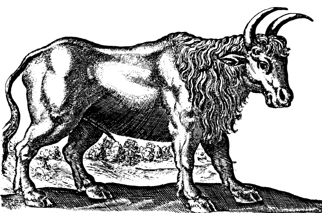
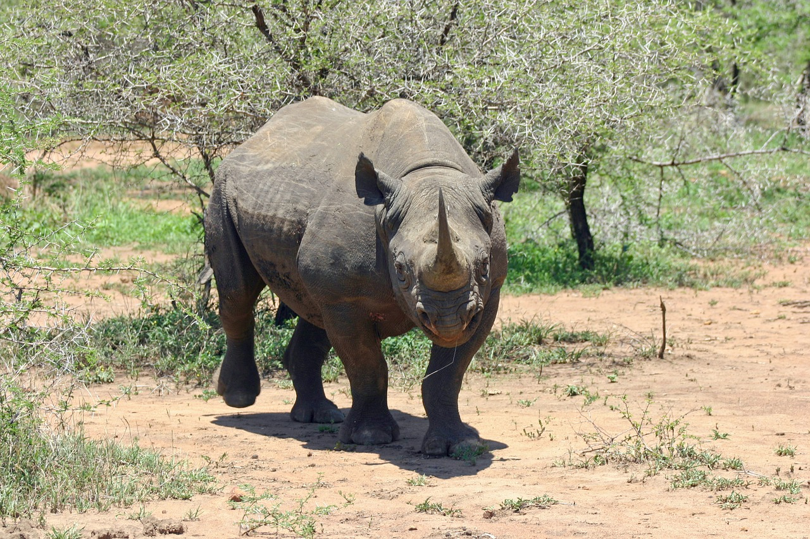
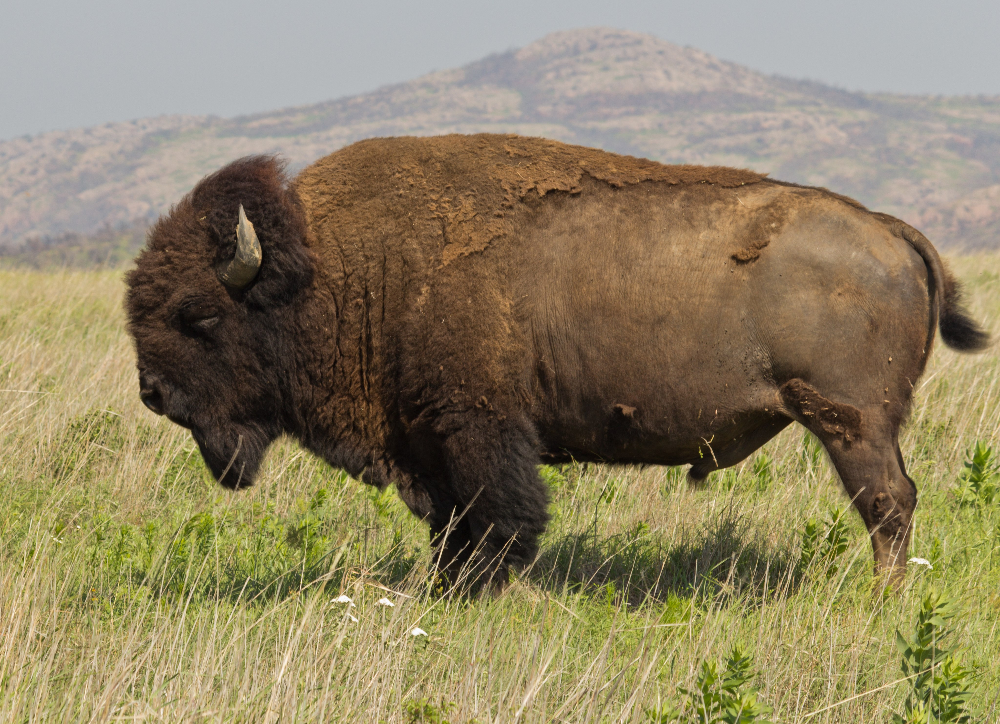

# Animals in the Bible

## License Information

Animals in the Bible © United Bible Societies, 2025. Adapted from: <cite>All Creatures Great and Small: Living Things in the Bible</cite>, by Edward R. Hope © 2005 United Bible Societies. This work is licensed under Creative Commons Attribution-ShareAlike 4.0 International (<a href="https://creativecommons.org/licenses/by-sa/4.0/">https://creativecommons.org/licenses/by-sa/4.0/</a>).

--------------------------------

## 标题：野牛（wild ox） (id: FAUNA:2.34)

2\.34 标题：野牛（wild ox）
====================

经文出处
----

Hebrew 来：רְאֵם (音译：re’em)

[NUM 23:22](https://ref.ly/Num23:22), [NUM 24:8](https://ref.ly/Num24:8), [DEU 33:17](https://ref.ly/Deut33:17), [JOB 39:9](https://ref.ly/Job39:9), [JOB 39:10](https://ref.ly/Job39:10), [PSA 22:22](https://ref.ly/Ps22:22), [PSA 29:6](https://ref.ly/Ps29:6), [PSA 92:11](https://ref.ly/Ps92:11), [ISA 34:7](https://ref.ly/Isa34:7)

讨论
--

*野牛 ((Source unknown))*

自20世纪初以来，*re’em* 在英文译本中的译法便依循了特里斯特拉姆在上个世纪提出的原创性建议，译成 "wild ox"（"野牛"）。然而，这种译法也存在一些问题。翻译成"野牛"的理由通常有：（1）阿卡德文的对等词*rimu* 指的是野牛或原牛（学名*Bos primigenius* ），经常被阿卡德国王猎杀；（2）野牛或原牛符合圣经对于那种难以驯服的野生动物的描述。

从动物学的角度来看，这两个理由都有不足之处，并且语言学的论据也存在争议。首先，阿卡德国王猎杀的原牛是一种生活在大降雨量地区的森林中的动物。在历史上，只在欧洲中部和东南部的森林地区、亚美尼亚（包括黑海南部海岸）和美索不达米亚曾经发现这种动物。在以色列地和阿拉伯半岛仅存的原牛遗骸属于更新世早期。因此，这种动物不太可能在圣经时期生活在以色列。

其次，虽然阿卡德文*rimu* 通常翻译成"野牛"，但有些学者把乌加列文*rum* 翻译成"水牛"，而古阿拉伯文*rim* 通常翻译为"长角羚"。这些词语都与希伯来文*re’em* 有关联。有些学者认为*re’em* 实际上是长角羚。

此外，虽然野生原牛体型庞大、危险且强壮，但并不是真的"无法驯服"。它们必须傍水生活，因此很容易用网捕获，而且很早就被驯养了。野生原牛是所有欧洲短角牛的祖先。在伊拉克库君吉克（Kujunjik）考古发掘中发现了一些雕刻在石灰岩上的古代图画，描绘了用牛拉着的车，这些牛和早期狩猎场景中描绘的原牛几乎一模一样。

早期的埃及王曾经捕猎一种很像原牛的动物，但这种动物早在兰塞三世统治时期（约主前1190年）就已经从埃及消失了，因此兰塞三世改为在苏丹的森林地区捕猎"野牛"（可能是非洲水牛），并且没有证据表明原牛曾生活在该地区。（一幅纪念这种狩猎的图画清楚描绘了人们乘坐战车捕获一些很像原牛的动物，但这可能是一种艺术表现手法，也可能是一种传统的模式化形象——在类似的画作中，狮子肯定是异想天开的模式化形象。）

在埃及发现的许多动物木乃伊中，有一些是狷羚（赤狷羚）和非洲水牛。这两种动物都符合圣经对"野牛"的描述，并且赤狷羚肯定曾生活在阿拉伯半岛和以色列地。

希腊文《七十士译本》把*re’em* 翻译成*monokerōs* ，字面意思是"独角的"（KJV (King James Version (1611)) 据此译为"unicorn"，"独角兽"），但这个词在古希腊文中指"犀牛"。由于《七十士译本》翻译的时间较早，翻译者需要认真对待。犹太人应该知道这种动物，因为埃及的部分地区有它们的踪迹。古自然学家亚美细亚的斯特拉博生活在主后1世纪早期，他曾描述在埃及看到的一头犀牛，并且提到当时的另一位自然学家也描述过这种动物。出埃及时期，人们在埃及、苏丹和埃塞俄比亚发现了一种犀牛，在美索不达米亚发现了另一种犀牛。

在出埃及时期，欧洲东南部的森林、小亚细亚的最北端和美索不达米亚都有原牛的踪迹，但在埃及、迦南、阿拉伯半岛、西奈和叙利亚却没有。然而，长角羚和狷羚数目众多且为人所熟知，另外非洲水牛和犀牛也为人所知，至少是听说过。

翻译者还应注意这问题的另一个方面。纵观人类历史，体型庞大、引人注目的动物往往具有象征意义，即使在从未见过这种动物的社会中也是如此。在中国和英国的文化中，狮子具有重要的地位已经有好几百年了，但是，没有任何证据表明狮子曾在中国或英国生活过。因此，虽然原牛是一个几乎不可能的解释，但也不能将其完全排除。

关于希伯来文*re’em* ，有四件事是可以肯定的：这是一种野生、无法驯服的动物；有角；非常强壮；把它与家牛和狮子作对比或比较是合适的。

描述
--

**原牛** ：原牛（学名*Bos primigenius* ）现已灭绝，这是一种体型非常庞大的动物，长着指向前方的大角；看起来很像现代西班牙斗牛所用的公牛，但可能个头更大。公原牛为深棕色或黑色，沿脊柱有一条浅色的条纹，母原牛呈浅棕色。德国柏林、慕尼黑和法兰克福的动物园开展了基因工程实验，旨在通过对具有所需特征的家牛进行选择性繁殖，来重新引入原牛的原始基因特征，这些实验已经取得很大成功，繁殖出来的动物看起来很像最初的原牛。

*非洲水牛 (Pixabay)*

**非洲水牛** ：非洲水牛（学名*Syncerus caffer* ）也是一种体型非常大的动物，没有原牛那么高，但比原牛重。非洲水牛分布在整个非洲撒哈拉以南地区水源充足的地方。白天，它们喜欢躲藏在茂密的灌木或河边的森林里。它们的角非常粗，从前额部位一个很像大盾（boss）的宽阔处凸出来，然后向两侧弯下去，再突然上弯指向头部。公牛的角比母牛的角更粗。皮肤上覆盖着短毛，毛色从黑色到灰色或棕色不一，通常覆盖着干泥，因此水牛看起来和当地的泥土一样颜色。

非洲水牛成大群生活，经常有五百头以上。它们非常强壮、狡猾、无畏，可能是非洲最危险的动物。它们虽然已经习惯了保护区内的人类，但仍然不可预测，很容易被激怒。和亚洲水牛不一样，非洲水牛从来没有被驯化。

*黑犀牛 (Pixabay)*

**犀牛** ：在圣经时期，美索不达米亚的犀牛是印度犀牛（学名*Rhinoceros unicornis* ）的一个亚种，而在埃及和苏丹发现的犀牛是勾唇犀牛或黑犀牛（学名*Diceros bicornis* ）。勾唇犀牛重达2000公斤（4400磅），肩高约1\.7米（70英寸）。它的鼻子上方有两个角，一个在前，另一个在后。前角的长度超过半米（20英寸）。勾唇犀牛生活在灌木丛生的乡村地区，以树叶和嫩枝为食。它们是独居动物，视力不好，非常好斗。印度犀牛甚至比勾唇犀牛还要大，但只有一个角。

**狷羚** ：参[2\.7 北非狷羚（狍子）（bubal hartebeest \[roe deer]）](#FAUNA:2.7) 。

特殊意义或象征意义
---------

希伯来文*re’em* 是力量、野性和权力的象征。

翻译
--

由于无法确定这个希伯来文词语究竟是指哪一种动物，翻译者最好在文本中使用一个相当于"野牛"或"野公牛"的词，并在每次翻译这个词时，在脚注中注明这个词可能意指"水牛"，以及《七十士译本》译为"犀牛"。

在许多国家中可能会出现下述问题，就是"野牛"一词指的是后来变成在野外生存的家牛。在这种情况下，最好使用一种强壮、有角的大型动物的当地名称。

*白肢野牛 (© Jenis patel (Wikimedia Commons))*

在非洲，对等词显然是水牛。*Re’em* 的意思可能是"水牛"，这一事实进一步增加了这个选择的可信性。

*美洲野牛 (© katsrcool from Edmond (Wikimedia Commons))*

在印度次大陆、缅甸、泰国、马来西亚和中国西部，有一种动物名叫白肢野牛（学名*Bibos gaurus* ），现在已近乎灭绝。这种动物在泰国称为*ngua\-kating* ，在马来西亚称为*seladang* 。人们有时错误地称它们为"野生水牛"。白肢野牛是一种与原牛非常相似的野牛。在喜马拉雅和中国西部的山区，还有一种与野牛相似但是略小的动物，叫做"羚牛"（学名*Budorcas taxicolor* ）。在喜马拉雅和中亚地区，还可以翻译成"野牦牛"。

在北美洲，美洲野牛或美洲水牛（学名*Bison bison* ）是最接近的动物。在北极的一些地区，也可以翻译成麝牛（学名*Ovibos moschatus* ）。

在其他地方，翻译者可以采用音译，或者从当地主要语言中借用一个词语。

* **Associated Passages:** 民数记 23:22; 民数记 24:8; 申命记 33:17; 约伯记 39:9; 约伯记 39:10; 诗篇 22:22; 诗篇 29:6; 诗篇 92:11; 以赛亚书 34:7

