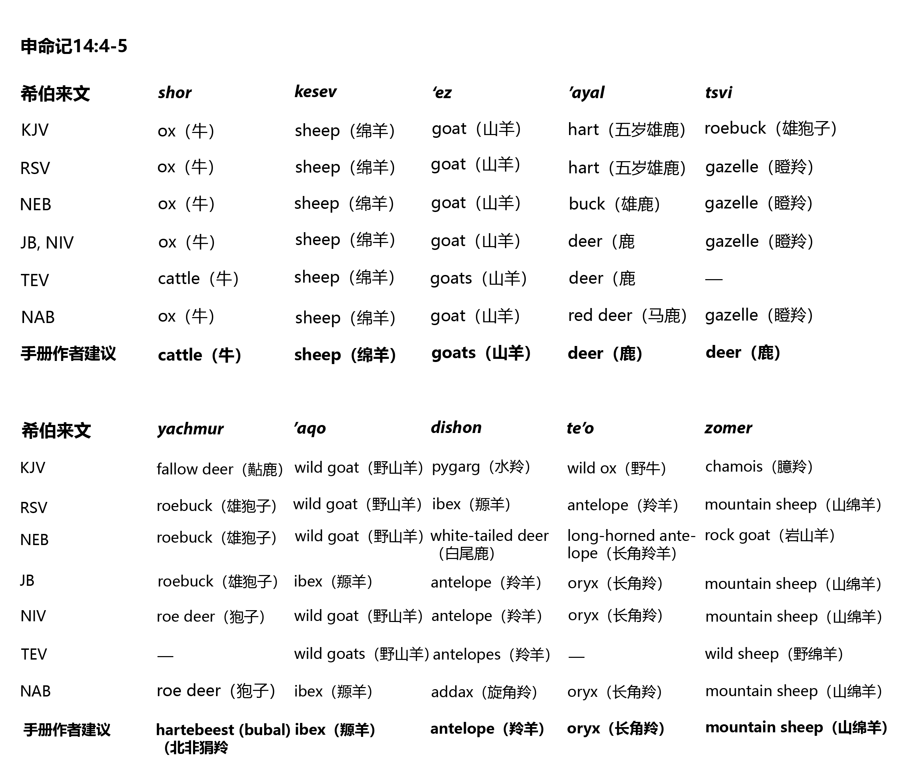
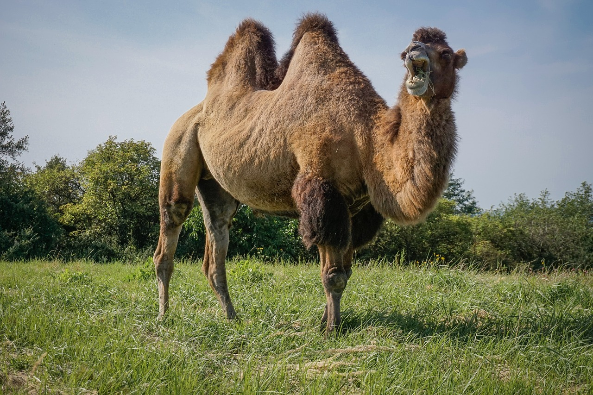

# Animals in the Bible

## License Information

Animals in the Bible © United Bible Societies, 2025. Adapted from: <cite>All Creatures Great and Small: Living Things in the Bible</cite>, by Edward R. Hope © 2005 United Bible Societies. This work is licensed under Creative Commons Attribution-ShareAlike 4.0 International (<a href="https://creativecommons.org/licenses/by-sa/4.0/">https://creativecommons.org/licenses/by-sa/4.0/</a>).

--------------------------------

## 标题：哺乳动物 (id: FAUNA:2)

2 标题：哺乳动物
=========

* [2\.1 洁净的动物（申14:4–6）](#FAUNA:2.1)
* [2\.2 羚羊（antelope）](#FAUNA:2.2)
* [2\.3 猿猴（apes）](#FAUNA:2.3)
* [2\.4 驴（ass, donkey）](#FAUNA:2.4)
* [2\.5 蝙蝠（bat）](#FAUNA:2.5)
* [2\.6 熊（bear）](#FAUNA:2.6)
* [2\.7 北非狷羚（狍子）（bubal hartebeest \[roe deer]）](#FAUNA:2.7)
* [2\.8 骆驼、独峰驼（camel, dromedary）](#FAUNA:2.8)
* [2\.9 猫（cat）](#FAUNA:2.9)
* [2\.10 牛、母牛、阉牛、公牛（cattle, cow, ox, bull）](#FAUNA:2.10)
* [2\.11 鹿（deer）](#FAUNA:2.11)
* [2\.12 狗（dog）](#FAUNA:2.12)
* [2\.13 儒艮（dugong）](#FAUNA:2.13)
* [2\.14 象（elephant）](#FAUNA:2.14)
* [2\.15 瞪羚（gazelle）](#FAUNA:2.15)
* [2\.16 山羊（goat）](#FAUNA:2.16)
* [2\.17 野兔、兔子（hare）](#FAUNA:2.17)
* [2\.18 马（horse）](#FAUNA:2.18)
* [2\.19 鬣狗（hyena）](#FAUNA:2.19)
* [2\.20 蹄兔、石獾（hyrax, rock badger）](#FAUNA:2.20)
* [2\.21 野山羊、羱羊、高山山羊（ibex, wild goat, mountain goat）](#FAUNA:2.21)
* [2\.22 土狼、豺狼、野狗、狐狸（jackal, fox）](#FAUNA:2.22)
* [2\.23 金钱豹、猎豹（leopard, cheetah）](#FAUNA:2.23)
* [2\.24 狮子（lion）](#FAUNA:2.24)
* [2\.25 田鼠（mole rat）](#FAUNA:2.25)
* [2\.26 獴、鼬鼠（mongoose, weasel）](#FAUNA:2.26)
* [2\.27 老鼠、耗子（mouse, rat）](#FAUNA:2.27)
* [2\.28 骡子（mule）](#FAUNA:2.28)
* [2\.29 羚羊、长角羚、剑羚（oryx）](#FAUNA:2.29)
* [2\.30 猪（pig）](#FAUNA:2.30)
* [2\.31 绵羊、羔羊、小羊（sheep, lamb）](#FAUNA:2.31)
* [2\.32 野驴（wild ass）](#FAUNA:2.32)
* [2\.33 野猪（wild boar）](#FAUNA:2.33)
* [2\.34 野牛（wild ox）](#FAUNA:2.34)
* [2\.35 狼（wolf）](#FAUNA:2.35)

## 标题：洁净的动物（申14:4–6） (id: FAUNA:2.1)

2\.1 标题：洁净的动物（申14:4–6）
======================

[DEU 14:4–DEU 14:6](https://ref.ly/Deut14:4-Deut14:6) 记载了一份在礼仪上洁净的动物的清单，学者对其中三种家畜的看法一致，但对另外七种植食动物，则有很大的分歧。

首先，我们可以根据考古学的证据，推断出圣经时期的人们所熟悉的植食动物，这会有助于确认清单上的动物。可以确定的是，瞪羚、剑羚、野山羊、黇鹿和山绵羊必定是他们所熟悉的，因为这些动物在该地区都可找到。它们分别与希伯来文*tsvi* 、*te’o* 、*’aqo* 、*’ayal* 和*zemer* 配对，这就确定了七种植食动物中的五种，但剩下两种还不能完全确定。

在圣地所见的野生动物中，赤狷羚和水羚属的羚羊很早就被视为洁净的动物。上文所述的一个还未确定的希伯来文词语*yachmur* 很可能就是指这两种动物之一，很可能就是狷羚。如果情况确实是这样，那么所罗门晚年在以色列饲养了一群狷羚（[1KI 4:23](https://ref.ly/1Kgs4:23) ）。饲养野生狷羚在美索不达米亚和埃及都很常见。

另外一个还未确定的希伯来文词语*dishon* 指的可能是水羚属羚羊，或者是旋角羚，埃及人也会饲养这种动物。

以色列人熟知的所有"狩猎动物"，即鹿、羚羊、瞪羚、野山羊和野绵羊，显然都列在洁净动物的清单里。在译文中保留这个事实，可能比确定每一个希伯来文词语的具体所指更加重要。

---

申命记14:4–5
---------

| 希伯来文\-\- *shor* | *kesev* | *‘ez* | *’ayal* | *tsvi* |
| --- | --- | --- | --- | --- |
| KJV (King James Version (1611)) | ox（牛） | sheep（绵羊） | goat（山羊） | hart（五岁雄鹿） | roebuck（雄狍子） |
| RSV (Revised Standard Version (1952)) | ox（牛） | sheep（绵羊） | goat（山羊） | hart（五岁雄鹿） | gazelle（瞪羚） |
| NEB (New English Bible (1970)) | ox（牛）\-\- sheep（绵羊） | goat（山羊） | buck（雄鹿） | gazelle（瞪羚） |
| JB (Jerusalem Bible (1966)), NIV (New International Version (1984)) | ox（牛） | sheep（绵羊） | goat（山羊） | deer（鹿） | gazelle（瞪羚） |
| TEV (Today's English Version (Good News Bible)) | cattle（牛） | sheep（绵羊） | goats（山羊） | deer（鹿） | —— |
| NAB (New American Bible (1970)) | ox（牛） | sheep（绵羊） | goat（山羊） | red deer（马鹿） | gazelle（瞪羚） |
| 手册作者建议 | **cattle（牛）** | **sheep（绵羊）** | **goats（山羊）** | **deer（鹿）** | **gazelle（瞪羚）** |
| 希伯来文\-\- *yachmur* | *’aqo* | *dishon* | *te’o* | *zomer* |
| KJV (King James Version (1611)) | fallow deer（黇鹿） | wild goat（野山羊） | pygarg（水羚） | wild ox（野牛） | chamois（臆羚） |
| RSV (Revised Standard Version (1952)) | roebuck（雄狍子） | wild goat（野山羊） | ibex（羱羊） | antelope（羚羊） | mountain sheep（山绵羊） |
| NEB (New English Bible (1970)) | roebuck（雄狍子） | wild goat（野山羊） | white\-tailed deer（白尾鹿） | long\-horned antelope（长角羚羊） | rock goat（岩山羊） |
| JB (Jerusalem Bible (1966)) | roebuck（雄狍子） | ibex（羱羊） | antelope（羚羊） | oryx（长角羚） | mountain sheep（山绵羊） |
| NIV (New International Version (1984)) | roe deer（狍子） | wild goat（野山羊） | antelope（羚羊） | oryx（长角羚） | mountain sheep（山绵羊） |
| TEV (Today's English Version (Good News Bible)) | —— | wild goats（野山羊） | antelopes（羚羊） | —— | wild sheep（野绵羊） |
| NAB (New American Bible (1970)) | roe deer（狍子） | ibex（羱羊） | addax（旋角羚） | oryx（长角羚） | mountain sheep（山绵羊） |
| 手册作者建议 | **hartebeest (bubal)（北非狷羚）** | **ibex（羱羊）** | **antelope（羚羊）** | **oryx（长角羚）** | **mountain sheep（山绵羊）** |

---

* **Associated Passages:** 申命记 14:4; 申命记 14:6; 列王纪上 4:23

## 标题：羚羊（antelope） (id: FAUNA:2.2)

2\.2 标题：羚羊（antelope）
====================

经文出处
----

Hebrew 来：דִּישׁוֹן (音译：dishon)

[DEU 14:5](https://ref.ly/Deut14:5)

讨论
--

希腊文《七十士译本》将这个词译为*pugargos* （KJV (King James Version (1611)) 音译为"pygarg"），意思是"白色的臀部"。这个希腊文名称可能是指水羚属（学名*Kobus* ）的羚羊，包括非洲大羚羊、迪氏水羚（学名*Kobus defassa* ）和白耳水羚（大角驴羚；学名*Kobus megaceros* ），它们的臀部周围都有一个白色的环状条纹。圣经时期的人很熟悉迪氏水羚和白耳水羚。大多数种类的瞪羚，其臀部也是白色的。

然而，认为这个希伯来文名称是指另一种羚羊"旋角羚"（学名*Addax nasomaculatus* ），这几乎已经成为传统，而且奇怪的是，这种羚羊并没有白色的臀部（比较NAB (New American Bible (1970)) ）。旋角羚是非洲西北部的物种，并且没有确凿的证据显示它们曾在利比亚以东的野外出现过。然而，埃及人很可能曾经饲养成群的旋角羚，就像欧洲人在鹿园中饲养鹿那样，但埃及人是把旋角羚当作祭物和食物。所罗门可能也圈养过旋角羚。

许多学者认为*dishon* 这个名称与希伯来文词根*d\-w\-sh* 有关联，从而使这个名称的意思有点像"脚步沉重缓慢的人"。这个名称与旋角羚的特征相符，因为旋角羚的蹄子很大，行走通常很有节奏。有些学者基于一些证据提出，*dishon* 就是阿拉伯大羚羊或白剑羚（学名*Oryx leucoryx* ）。他们援引的语言学证据来自剑羚的阿卡德文名称*da\-as\-su* ，有学者认为这个词的词根与希伯来文词根*d\-sh\-n* 相近。然而，另一个希伯来文*te’o* 也被动物学家解释为"剑羚"，同时也出现在这节经文关于洁净动物的清单中，因此*dishon* 不太可能也是"剑羚"的意思。翻译者可以选择旋角羚或水羚属羚羊作为译词，并且任何一个选择似乎都没有绝对的说服力（另参[2\.7 北非狷羚（狍子）（bubal hartebeest \[roe deer]）](#FAUNA:2.7) ）。

描述
--

水羚属（学名*Kobus* ）羚羊的体型相当大，肩高约1\.3米（4英尺），毛很长。公羚羊有角，从根部沿着与水平线约呈45度角的方向生长出去，然后向上、向前弯曲。角的长度经常超过半米（20英寸）。非洲大羚羊和迪氏水羚呈灰色或灰褐色，白耳水羚是红色的。它们成小群（白耳水羚通常是大群）生活在河流或沼泽附近，以草和水草为食。

旋角羚长着螺旋状的角和宽大的蹄子，冬天时毛色为浅棕色，但夏天几乎是白色的，大小跟驴差不多。

特殊意义或象征意义
---------

这是一种在礼仪上洁净的动物。

翻译
--

[DEU 14:5](https://ref.ly/Deut14:5) 所记的洁净动物清单包含了七个名称。TEV (Today's English Version (Good News Bible)) 将其缩减成四个，译作"deer, wild sheep, wild goats, or antelopes"（"鹿、野绵羊、野山羊或羚羊"）。这些名称都是集合名词，实际上并未包含原文中提到的所有动物，例如瞪羚就被省略了。在很难找到七个名称的情况下，这也可以作为一种解决方案。

在撒哈拉以南的非洲地区，非洲大羚羊、驴羚、迪氏水羚和白耳水羚为人熟知，可采用其中任何一个名称。与旋角羚相似的羚羊有大弯角羚（学名*Strepsiceros strepsiceros* ）和小弯角羚（学名*Strepsiceros imberbis* ）。

在印度次大陆，最接近的对等译词是蓝牛羚（学名*Boselaphus tragocamelus* ）。

其他地方可以采用"白臀羚羊"等短语，或者采用音译。

* **Associated Passages:** 申命记 14:5

## 标题：猿猴（apes） (id: FAUNA:2.3)

2\.3 标题：猿猴（apes）
================

* [2\.3\.1 狒狒（baboon）](#FAUNA:2.3.1)
* [2\.3\.2 猴子（monkey）](#FAUNA:2.3.2)

## 标题：狒狒（baboon） (id: FAUNA:2.3.1)

2\.3\.1 标题：狒狒（baboon）
=====================

经文出处
----

Hebrew 来：קוֹף (音译：qof)

[1KI 10:22](https://ref.ly/1Kgs10:22), [2CH 9:21](https://ref.ly/2Chr9:21)

讨论
--

非洲、亚洲和欧洲有两个灵长类动物科，分别是有尾巴的猴科（学名*Cercopithecidae* ）和没有尾巴的猩猩科（学名*Pongidae* ）。有充分的证据显示，古埃及和古代中东的人们很熟悉猴子和狒狒，但在文学或艺术作品中却完全没有提到过没有尾巴的类人猿。因此，尽管所有英文译本都译为"apes"（意为"类人猿"，在16和17世纪用来指任何非人类的灵长类动物），但它可能并不是现代英文中的最佳译词。

博登海默（Bodenheimer）认为，希伯来文*qof* 作为一个单词和字母表中的一个字母，就是古埃及文的词根*g\-f* 和象形文字*kafu* ，两者都是指狒狒。其他学者认为，跟许多动物名称一样，*qof* 和*kafu* 都是拟声词（意即名称的发音就像是动物发出的声音）。在古代中东，草原狒狒（黄狒狒；学名*Papio cynocephalus* ）、阿努比斯狒狒（东非狒狒；学名*Papio anubis doguerra* ）和献祭用的阿拉伯狒狒（学名*Papio hamdryas* ）都是人们所熟知的，因此上述辨识似乎非常合理。

描述
--

狒狒（狒狒属*papio* 的各个种）是大型灵长类动物，尾巴长，口鼻部像狗。通常，成年狒狒的大小和一只大狗差不多。有些体型大的公狒狒长着狮子那样的鬃毛。狒狒大部分时间都在地面上活动，吃各种植物的根、嫩芽、果实和叶子，也吃昆虫和小型爬行动物。在某些地区，狒狒还会抓一些小型哺乳动物来吃，比如老鼠、野兔，甚至小瞪羚。狒狒群居生活，每群约有30—80只，有明确的社会结构，由一只居于统治地位的母狒狒领导全群。狒狒通常是浅棕色的，但年老的公狒狒有时候会变成灰色。

在非洲，除了撒哈拉沙漠和非洲西北部以外，大部分多石丘陵地区都有狒狒或其近缘物种，比如山魈。

翻译
--

在非洲，狒狒、山魈或狮尾狒（埃塞俄比亚）的当地名称是很好的对等词。在其他地方，如果当地有体型较大、长时间在地面上活动的猴子，那么采用这个物种的名称是不错的选择。在南亚、东亚和东南亚地区，多种猕猴和恒河猴在许多方面与狒狒相似。在南美洲，采用大型吼猴的通用名称是很合适的译法；如果没有通称，可以采用其中一种吼猴的名称。

在没有上述猴类的地方，可以采用"大猴子"之类短语，也可以按照希伯来文原文或当地的主要语言进行音译。

* **Associated Passages:** 列王纪上 10:22; 历代志下 9:21

## 标题：猴子（monkey） (id: FAUNA:2.3.2)

2\.3\.2 标题：猴子（monkey）
=====================

经文出处
----

Hebrew 来：תֻּכִּי (音译：tuki)

[1KI 10:22](https://ref.ly/1Kgs10:22), [2CH 9:21](https://ref.ly/2Chr9:21)

讨论
--

有些译本将这个词译作"孔雀"（"peacocks"；KJV (King James Version (1611)) 、RSV (Revised Standard Version (1952)) ），这几乎肯定是不正确的。因为除此之外，所罗门船上的其他货物都来自东非（迄今为止，考古学家在圣地发现的古象牙制品都是用非洲象牙制成的），但孔雀却是来自印度和缅甸。

如果希伯来文*qof* 指的是狒狒，那么*tuki* 可能是指长尾猴属的一种小型长尾猴，这些长尾猴中最常见的是"绿色"和"蓝色"的长尾黑颚猴（学名*Cercopithecus aethiops* ），遍布撒哈拉沙漠以南的非洲、苏丹和埃塞俄比亚。古时，这些猴子因为很容易捕获，所以常被当成宠物，出口到整个中东和欧洲。

描述
--

长尾黑颚猴是一种体型较小的长尾猴，皮毛呈灰色，带点绿色或蓝色，眼皮和雄性生殖器也呈绿色或蓝色。它们基本上是素食的动物，吃水果和嫩叶，偶尔也吃昆虫和蜘蛛。大部分时间都在树上，偶尔也会到草地上觅食草籽和掉落的果实。它们以家族群居的方式生活，成员多达20只左右。

翻译
--

在非洲大部分地区，较合适的译词是长尾猴属在当地的属名，或者是长尾黑颚猴、白额长尾猴（学名*Cercopithecus mona* ）或赤猴（*erythrocebus patas* ）的种名。在亚洲，可以使用长尾叶猴的属名，或任一种常见叶猴的种名。在拉丁美洲，小型卷尾猴的属名或种名是很合适的译词。如果当地语言的选择有限，或者只有一个表示猴子的词语，那么*tuki* 可以翻译为"小猴子"。在猴子不为人知的地方，翻译者应该音译*tuki* ，或者按照主要语言或贸易语言中的词语进行音译。

因此，我们建议将[1KI 10:22](https://ref.ly/1Kgs10:22) 和[2CH 9:21](https://ref.ly/2Chr9:21) 中的希伯来文*veqofim vetukiyim* 译成"狒狒和猴子"。

* **Associated Passages:** 列王纪上 10:22; 历代志下 9:21

## 标题：驴（ass, donkey） (id: FAUNA:2.4)

2\.4 标题：驴（ass, donkey）
======================

经文出处
----

Hebrew 来：אָתוֹן (音译：‘athon)

[GEN 12:16](https://ref.ly/Gen12:16), [GEN 32:16](https://ref.ly/Gen32:16), [GEN 45:23](https://ref.ly/Gen45:23), [GEN 49:11](https://ref.ly/Gen49:11), [NUM 22:21](https://ref.ly/Num22:21), [NUM 22:22](https://ref.ly/Num22:22), [NUM 22:23](https://ref.ly/Num22:23), [NUM 22:23](https://ref.ly/Num22:23), [NUM 22:23](https://ref.ly/Num22:23), [NUM 22:25](https://ref.ly/Num22:25), [NUM 22:27](https://ref.ly/Num22:27), [NUM 22:27](https://ref.ly/Num22:27), [NUM 22:28](https://ref.ly/Num22:28), [NUM 22:29](https://ref.ly/Num22:29), [NUM 22:30](https://ref.ly/Num22:30), [NUM 22:30](https://ref.ly/Num22:30), [NUM 22:32](https://ref.ly/Num22:32), [NUM 22:33](https://ref.ly/Num22:33), [JDG 5:10](https://ref.ly/Judg5:10), [1SA 9:3](https://ref.ly/1Sam9:3), [1SA 9:3](https://ref.ly/1Sam9:3), [1SA 9:5](https://ref.ly/1Sam9:5), [1SA 9:20](https://ref.ly/1Sam9:20), [1SA 10:2](https://ref.ly/1Sam10:2), [1SA 10:2](https://ref.ly/1Sam10:2), [1SA 10:14](https://ref.ly/1Sam10:14), [1SA 10:16](https://ref.ly/1Sam10:16), [2KI 4:22](https://ref.ly/2Kgs4:22), [2KI 4:24](https://ref.ly/2Kgs4:24), [1CH 27:30](https://ref.ly/1Chr27:30), [JOB 1:3](https://ref.ly/Job1:3), [JOB 1:14](https://ref.ly/Job1:14), [JOB 42:12](https://ref.ly/Job42:12), [ZEC 9:9](https://ref.ly/Zech9:9)

Hebrew 来：חֲמוֹר (音译：chamor)

[GEN 12:16](https://ref.ly/Gen12:16), [GEN 22:3](https://ref.ly/Gen22:3), [GEN 22:5](https://ref.ly/Gen22:5), [GEN 24:35](https://ref.ly/Gen24:35), [GEN 30:43](https://ref.ly/Gen30:43), [GEN 32:6](https://ref.ly/Gen32:6), [GEN 34:28](https://ref.ly/Gen34:28), [GEN 36:24](https://ref.ly/Gen36:24), [GEN 42:26](https://ref.ly/Gen42:26), [GEN 42:27](https://ref.ly/Gen42:27), [GEN 43:18](https://ref.ly/Gen43:18), [GEN 43:24](https://ref.ly/Gen43:24), [GEN 44:3](https://ref.ly/Gen44:3), [GEN 44:13](https://ref.ly/Gen44:13), [GEN 45:23](https://ref.ly/Gen45:23), [GEN 47:17](https://ref.ly/Gen47:17), [GEN 49:14](https://ref.ly/Gen49:14), [EXO 4:20](https://ref.ly/Exod4:20), [EXO 9:3](https://ref.ly/Exod9:3), [EXO 13:13](https://ref.ly/Exod13:13), [EXO 20:17](https://ref.ly/Exod20:17), [EXO 21:33](https://ref.ly/Exod21:33), [EXO 22:3](https://ref.ly/Exod22:3), [EXO 22:8](https://ref.ly/Exod22:8), [EXO 22:9](https://ref.ly/Exod22:9), [EXO 23:4](https://ref.ly/Exod23:4), [EXO 23:5](https://ref.ly/Exod23:5), [EXO 23:12](https://ref.ly/Exod23:12), [EXO 34:20](https://ref.ly/Exod34:20), [NUM 16:15](https://ref.ly/Num16:15), [NUM 31:28](https://ref.ly/Num31:28), [NUM 31:30](https://ref.ly/Num31:30), [NUM 31:34](https://ref.ly/Num31:34), [NUM 31:39](https://ref.ly/Num31:39), [NUM 31:45](https://ref.ly/Num31:45), [DEU 5:14](https://ref.ly/Deut5:14), [DEU 5:21](https://ref.ly/Deut5:21), [DEU 22:3](https://ref.ly/Deut22:3), [DEU 22:4](https://ref.ly/Deut22:4), [DEU 22:10](https://ref.ly/Deut22:10), [DEU 28:31](https://ref.ly/Deut28:31), [JOS 6:21](https://ref.ly/Josh6:21), [JOS 7:24](https://ref.ly/Josh7:24), [JOS 9:4](https://ref.ly/Josh9:4), [JOS 15:18](https://ref.ly/Josh15:18), [JDG 1:14](https://ref.ly/Judg1:14), [JDG 6:4](https://ref.ly/Judg6:4), [JDG 15:15](https://ref.ly/Judg15:15), [JDG 15:16](https://ref.ly/Judg15:16), [JDG 15:16](https://ref.ly/Judg15:16), [JDG 19:3](https://ref.ly/Judg19:3), [JDG 19:10](https://ref.ly/Judg19:10), [JDG 19:19](https://ref.ly/Judg19:19), [JDG 19:21](https://ref.ly/Judg19:21), [JDG 19:28](https://ref.ly/Judg19:28), [1SA 8:16](https://ref.ly/1Sam8:16), [1SA 12:3](https://ref.ly/1Sam12:3), [1SA 15:3](https://ref.ly/1Sam15:3), [1SA 16:20](https://ref.ly/1Sam16:20), [1SA 22:19](https://ref.ly/1Sam22:19), [1SA 25:18](https://ref.ly/1Sam25:18), [1SA 25:20](https://ref.ly/1Sam25:20), [1SA 25:23](https://ref.ly/1Sam25:23), [1SA 25:42](https://ref.ly/1Sam25:42), [1SA 27:9](https://ref.ly/1Sam27:9), [2SA 16:1](https://ref.ly/2Sam16:1), [2SA 16:2](https://ref.ly/2Sam16:2), [2SA 17:23](https://ref.ly/2Sam17:23), [2SA 19:27](https://ref.ly/2Sam19:27), [1KI 2:40](https://ref.ly/1Kgs2:40), [1KI 13:13](https://ref.ly/1Kgs13:13), [1KI 13:13](https://ref.ly/1Kgs13:13), [1KI 13:23](https://ref.ly/1Kgs13:23), [1KI 13:24](https://ref.ly/1Kgs13:24), [1KI 13:27](https://ref.ly/1Kgs13:27), [1KI 13:28](https://ref.ly/1Kgs13:28), [1KI 13:28](https://ref.ly/1Kgs13:28), [1KI 13:29](https://ref.ly/1Kgs13:29), [2KI 6:25](https://ref.ly/2Kgs6:25), [2KI 7:7](https://ref.ly/2Kgs7:7), [2KI 7:10](https://ref.ly/2Kgs7:10), [1CH 5:21](https://ref.ly/1Chr5:21), [1CH 12:41](https://ref.ly/1Chr12:41), [2CH 28:15](https://ref.ly/2Chr28:15), [EZR 2:67](https://ref.ly/Ezra2:67), [NEH 7:68](https://ref.ly/Neh7:68), [NEH 13:15](https://ref.ly/Neh13:15), [JOB 24:3](https://ref.ly/Job24:3), [PRO 26:3](https://ref.ly/Prov26:3), [ISA 1:3](https://ref.ly/Isa1:3), [ISA 21:7](https://ref.ly/Isa21:7), [ISA 32:20](https://ref.ly/Isa32:20), [JER 22:19](https://ref.ly/Jer22:19), [EZK 23:20](https://ref.ly/Ezek23:20), [ZEC 9:9](https://ref.ly/Zech9:9), [ZEC 14:15](https://ref.ly/Zech14:15)

Hebrew 来：עַיִר (音译：‘ayir)

[GEN 32:16](https://ref.ly/Gen32:16), [JDG 10:4](https://ref.ly/Judg10:4), [JDG 10:4](https://ref.ly/Judg10:4), [JDG 12:14](https://ref.ly/Judg12:14), [JOB 11:12](https://ref.ly/Job11:12), [ISA 30:6](https://ref.ly/Isa30:6), [ISA 30:24](https://ref.ly/Isa30:24), [ZEC 9:9](https://ref.ly/Zech9:9)

Greek 希：ὄνος (音译：onos)

[MAT 21:2](https://ref.ly/Matt21:2), [MAT 21:5](https://ref.ly/Matt21:5), [MAT 21:7](https://ref.ly/Matt21:7), [LUK 13:15](https://ref.ly/Mark13:15), [JHN 12:15](https://ref.ly/Luke12:15), [JDT 2:17](https://ref.ly/Tob2:17), [SIR 33:24](https://ref.ly/Wis33:24)

Greek 希：ὀνάριον (音译：onarion)

[JHN 12:14](https://ref.ly/Luke12:14)

Greek 希：πῶλος (音译：pōlos)

[MAT 21:2](https://ref.ly/Matt21:2), [MAT 21:5](https://ref.ly/Matt21:5), [MAT 21:7](https://ref.ly/Matt21:7), [MRK 11:2](https://ref.ly/Matt11:2), [MRK 11:4](https://ref.ly/Matt11:4), [MRK 11:5](https://ref.ly/Matt11:5), [MRK 11:7](https://ref.ly/Matt11:7), [LUK 19:30](https://ref.ly/Mark19:30), [LUK 19:33](https://ref.ly/Mark19:33), [LUK 19:33](https://ref.ly/Mark19:33), [LUK 19:35](https://ref.ly/Mark19:35), [JHN 12:15](https://ref.ly/Luke12:15)

Greek 希：ὑποζύγιον (音译：hupozugion)

[MAT 21:5](https://ref.ly/Matt21:5), [2PE 2:16](https://ref.ly/1Pet2:16), [1ES 5:42](https://ref.ly/4Macc5:42)

讨论
--

除了*pōlos* 和*hupozugion* 以外（参下文讨论），上述希伯来文和希腊文词语都明显是指驴（学名*Equus asinus* ）。然而，不同词语之间确实存在细微的语义区别。

希伯来文*chamor* 和希腊文*onos* 是驴的统称，而*’athon* （阴性）特指"配鞍的驴"或"用来骑乘的驴"。配鞍的驴通常是高大强壮的母驴。当公驴发情时，要控制靠近母驴的公驴是非常困难的。这个希伯来文词语源自一个意为"强壮"的词根。

希伯来文*‘ayir* 指的是年轻的公驴；可能强调它的活力和难以控制，因为这个希伯来文词语的词根可能意指"乱蹦乱跳的"。

希腊文*onarion* 是指小驴，不分性别。一些语言有表示幼驴的专用词语，用来翻译*onarion* 就很恰当。

希腊文*hupozugion* 经常译为"驴"，但其实该词可以用来指任何一种驮畜。著名的德国新约学者瓦尔特•鲍尔（Walter Bauer）提出了极有说服力的论述，他指出，在[MAT 21:5](https://ref.ly/Matt21:5) 中，*epi pōlon huion hupozugiou* 所指的动物是马驹而不是驴驹（1953：220—229）。有些语言的表述可以不指明具体的动物种类，如"驮畜"（"beast of burden"；NEB (New English Bible (1970)) 、JB (Jerusalem Bible (1966)) 、REB (Revised English Bible (1989)) ）。*pōlos* 通常指的是马驹，即幼年的马，除非后面跟着一个表示驴的词（另参[2\.32 野驴 (wild ass)](#FAUNA:2.32) ）。

描述
--

驴是一种家畜，与马同属，但体型比较小，耳朵比较长。中东地区养殖和使用的驴是驯化的努比亚或索马里野驴（学名*Equus Asinus africanus* ）。驴在起初的野生状态下是灰色的，腹部颜色发白，腿的下部有深色的环形条纹。早在主前2500年，驴就已在埃及被驯化。后来通过与欧洲和波斯的驴杂交，驯养的驴开始有各种毛色，从深棕色到浅棕色，再到原来的灰色，偶尔还有白色。希伯来文*chamor* 便是源自一个意为"红棕色"的词根。

驴是一种很好的驮畜，能和体型更大的骡子驮一样多的东西，但却没有骡子那种难以预料的坏脾气。驴的耐力很强，并且易于喂养，因为它们几乎吃所有可作饲料的植物。体型较大的驴（通常是雌性）也经常用来骑乘。

在圣经时期，驴是非常珍贵的，尤其是母驴，因为它们非常适合驮重和骑乘，并且能够生育后代。驴在当时是动物界中人类最好的朋友。它们是普通人的交通工具，许多普通家庭都养着一头驴。驴不仅被用作交通工具，还能耕地和推磨。

今天，很多地方的人仍然饲养驴，在非洲热带草原、中东、南亚和中亚、欧洲、拉丁美洲和澳大利亚等地都有人养驴。雨林或季风地区似乎不养驴，不过这些地方的人通常也很熟悉这种动物。

特殊意义或象征意义
---------

驴是公认必备的家畜，因此在圣经时期，家驴的数目是衡量一个社会相对繁荣程度的一项指标。只有掌握权势的政治、军事人士才可以骑马（马一般归国家所有），普通百姓都是骑驴。[ZEC 9:9](https://ref.ly/Zech9:9) 这节经文的含意是：得胜的君王骑着驴回城，这是把自己看作一名普通的以色列人，而非凯旋归来的军阀。

翻译
--

大多数语言都有一个表示驴的当地词或外来词，翻译者可以选用这个词语。在东南亚、巴布亚新几内亚、西非，以及其他地方，驴很稀有甚或不为人知，此时通常可以按照当地主要语言或贸易语言（例如英文、西班牙文、法文、中文或阿拉伯文）的词语进行音译。

在大多数语境中，翻译者应该使用"母"驴的对等词来翻译*’athon* ，但在某些情况下，译作"骑乘用的驴"更好。

希伯来文*‘ayir* 应根据具体上下文来翻译。在[GEN 32:16](https://ref.ly/Gen32:16) （《和》32:15），应该采用"公驴"的对等词，在[JDG 10:4](https://ref.ly/Judg10:4) 和[JDG 12:14](https://ref.ly/Judg12:14) 两处，可能也应该这样翻译。后两处经文暗示，母驴是更平常的骑乘牲口。

[JOB 11:12](https://ref.ly/Job11:12) 的重点可能在于驴子乱蹦乱跳的性情，译文应该类似于"他把小驴拴在葡萄树上，把活泼的驴驹拴在佳美的葡萄树上"，表明一定程度的不负责任，或许是过分放纵。

[JOB 11:12](https://ref.ly/Job11:12) 和[ZEC 9:9](https://ref.ly/Zech9:9) 两处经文显然是在强调驴的年幼，所以应该译成"小驴"、"驴驹"、"幼驴"等。

[ISA 30:6](https://ref.ly/Isa30:6) 和[ISA 30:24](https://ref.ly/Isa30:24) 没有特别的强调，因此采用"驴"的一般词语即可。

补充说明
----

在[MAT 18:6](https://ref.ly/Matt18:6) 和[MRK 9:42](https://ref.ly/Matt9:42) 中，用来表示磨盘石的希腊文短语为*mulos onikos* ，字面意思是"驴磨盘石"，意指由驴拉动而不是靠人力推动的大磨盘石。

* **Associated Passages:** 创世记 12:16; 创世记 32:16; 创世记 45:23; 创世记 49:11; 民数记 22:21; 民数记 22:22; 民数记 22:23; 民数记 22:25; 民数记 22:27; 民数记 22:28; 民数记 22:29; 民数记 22:30; 民数记 22:32; 民数记 22:33; 士师记 5:10; 撒母耳记上 9:3; 撒母耳记上 9:5; 撒母耳记上 9:20; 撒母耳记上 10:2; 撒母耳记上 10:14; 撒母耳记上 10:16; 列王纪下 4:22; 列王纪下 4:24; 历代志上 27:30; 约伯记 1:3; 约伯记 1:14; 约伯记 42:12; 撒迦利亚书 9:9; 创世记 22:3; 创世记 22:5; 创世记 24:35; 创世记 30:43; 创世记 32:6; 创世记 34:28; 创世记 36:24; 创世记 42:26; 创世记 42:27; 创世记 43:18; 创世记 43:24; 创世记 44:3; 创世记 44:13; 创世记 47:17; 创世记 49:14; 出埃及记 4:20; 出埃及记 9:3; 出埃及记 13:13; 出埃及记 20:17; 出埃及记 21:33; 出埃及记 22:3; 出埃及记 22:8; 出埃及记 22:9; 出埃及记 23:4; 出埃及记 23:5; 出埃及记 23:12; 出埃及记 34:20; 民数记 16:15; 民数记 31:28; 民数记 31:30; 民数记 31:34; 民数记 31:39; 民数记 31:45; 申命记 5:14; 申命记 5:21; 申命记 22:3; 申命记 22:4; 申命记 22:10; 申命记 28:31; 约书亚记 6:21; 约书亚记 7:24; 约书亚记 9:4; 约书亚记 15:18; 士师记 1:14; 士师记 6:4; 士师记 15:15; 士师记 15:16; 士师记 19:3; 士师记 19:10; 士师记 19:19; 士师记 19:21; 士师记 19:28; 撒母耳记上 8:16; 撒母耳记上 12:3; 撒母耳记上 15:3; 撒母耳记上 16:20; 撒母耳记上 22:19; 撒母耳记上 25:18; 撒母耳记上 25:20; 撒母耳记上 25:23; 撒母耳记上 25:42; 撒母耳记上 27:9; 撒母耳记下 16:1; 撒母耳记下 16:2; 撒母耳记下 17:23; 撒母耳记下 19:27; 列王纪上 2:40; 列王纪上 13:13; 列王纪上 13:23; 列王纪上 13:24; 列王纪上 13:27; 列王纪上 13:28; 列王纪上 13:29; 列王纪下 6:25; 列王纪下 7:7; 列王纪下 7:10; 历代志上 5:21; 历代志上 12:41; 历代志下 28:15; 以斯拉记 2:67; 尼希米记 7:68; 尼希米记 13:15; 约伯记 24:3; 箴言 26:3; 以赛亚书 1:3; 以赛亚书 21:7; 以赛亚书 32:20; 耶利米书 22:19; 以西结书 23:20; 撒迦利亚书 14:15; 士师记 10:4; 士师记 12:14; 约伯记 11:12; 以赛亚书 30:6; 以赛亚书 30:24; 马太福音 21:2; 马太福音 21:5; 马太福音 21:7; 路加福音 13:15; 约翰福音 12:15; 友弟德传 2:17; 德训篇 33:24; 约翰福音 12:14; 马可福音 11:2; 马可福音 11:4; 马可福音 11:5; 马可福音 11:7; 路加福音 19:30; 路加福音 19:33; 路加福音 19:35; 彼得后书 2:16; 厄斯德拉上 5:42; 马太福音 18:6; 马可福音 9:42

## 标题：蝙蝠（bat） (id: FAUNA:2.5)

2\.5 标题：蝙蝠（bat）
===============

经文出处
----

Hebrew 来：עֲטַלֵּף (音译：‘atalef)

[LEV 11:19](https://ref.ly/Lev11:19), [DEU 14:18](https://ref.ly/Deut14:18), [ISA 2:20](https://ref.ly/Isa2:20)

Greek 希：νυκτερίς (音译：nukteris)

[LJE 1:22](https://ref.ly/Bar1:22)

讨论
--

和世界上许多其他民族一样，古代以色列人因蝙蝠会飞而将其归为鸟类。其实，蝙蝠是隶属于翼手目（学名*Chiroptera* ）的哺乳动物。这个希伯来文词语是一个统称，可以指以色列地32种蝙蝠中的任何一种。除了极北地区和南极的苔原，世界上所有地区都有蝙蝠。圣地本土的蝙蝠有两类：一类吃果实，另一类吃昆虫。

描述
--

蝙蝠是唯一能够真正飞翔的哺乳动物（尽管有些哺乳动物也能够从高处滑翔到低处）。蝙蝠有毛，但没有羽毛，不生蛋，而是产幼崽。它们长着细长的前肢和手指，支撑着一片连接手指和脚趾的翼膜，这片翼膜就起到了翅膀的作用。它们在夜间飞来飞去，白天倒挂在树上或突出的岩石上。蝙蝠的耳朵和大脑非常特别，能够通过聆听自己发出的声音碰到周围物体后产生的回声，来准确地判断距离。

在以色列地，蝙蝠的大小约在小鼠和大鼠之间。

特殊意义或象征意义
---------

在旧约中，以果实为食和以昆虫为食的两类蝙蝠都被认为是在礼仪上不洁净的。以色列境内有许多种类的蝙蝠生活在洞穴、墓穴、空房和废墟里，因此人们将它们与死亡、荒凉、毁灭和巫术联系在一起。

翻译
--

由于蝙蝠随处可见，找到一个译词并不困难。翻译者可以使用表示吃昆虫或果实的蝙蝠的词语，但不应当使用表示热带拉丁美洲的吸血蝙蝠、食鱼蝙蝠或食鸟蝙蝠的词语。在许多文化中，蝙蝠与毁灭和荒凉没有关联，因此在[ISA 2:20](https://ref.ly/Isa2:20) 中，可能需要使用"将……遗弃给蝙蝠"等类短语。

* **Associated Passages:** 利未记 11:19; 申命记 14:18; 以赛亚书 2:20; 耶利米书信 1:22

## 标题：熊（bear） (id: FAUNA:2.6)

2\.6 标题：熊（bear）
===============

经文出处
----

Hebrew 来：דֹּב (音译：dov)

[1SA 17:34](https://ref.ly/1Sam17:34), [1SA 17:36](https://ref.ly/1Sam17:36), [1SA 17:37](https://ref.ly/1Sam17:37), [2SA 17:8](https://ref.ly/2Sam17:8), [2KI 2:24](https://ref.ly/2Kgs2:24), [PRO 17:12](https://ref.ly/Prov17:12), [PRO 28:15](https://ref.ly/Prov28:15), [ISA 11:7](https://ref.ly/Isa11:7), [ISA 59:11](https://ref.ly/Isa59:11), [LAM 3:10](https://ref.ly/Lam3:10), [HOS 13:8](https://ref.ly/Hos13:8), [AMO 5:19](https://ref.ly/Amos5:19)

Greek 希：ἄρκος (音译：arkos)

[REV 13:2](https://ref.ly/Jude13:2), [WIS 11:17](https://ref.ly/EsthGr11:17), [SIR 25:17](https://ref.ly/Wis25:17), [SIR 47:3](https://ref.ly/Wis47:3)

讨论
--

在圣经时期，以色列人知道的熊是叙利亚棕熊（学名*Ursus arctos syriacus* ）。公熊和母熊是用同一个希伯来文词语来表示，翻译者可以根据上下文相关词语的阴性或阳性来确定熊的性别（参下文 翻译 部分）。

描述
--

叙利亚棕熊的体型非常大，与北美灰熊（学名*Ursus horribilis* ）或欧洲棕熊（学名*Ursus arctos* ）差不多。叙利亚棕熊的面部非常像狗，皮毛很厚，用四肢行走，还能用两只后腿站立起来，以获得更好的视野。直立的时候，身高可达2米（6英尺）甚至更高。体重可超过200公斤（440磅）。叙利亚棕熊和许多其他的熊一样，会在夏季和秋季吃大量食物以积累脂肪，然后在木头下面挖出的洞穴里面睡上一整个冬天。

熊基本上以草根、浆果、野生果实、老鼠和蜥蜴为食，偶尔会在凶性大发时咬死小型牲畜。熊的视力不太好，因此当人熊相遇，一方看到另一方之前，常常已经非常靠近了。在这种情况下，熊可能会用强有力的前爪攻击人，也可能会咬人。母熊对自己的幼崽极其爱护。

特殊意义或象征意义
---------

圣经经常同时提到熊和狮子，两者都是强大力量和危险的象征。母熊尤其被认为是危险的动物，特别是在产崽之后。

翻译
--

如果目标语言区分熊的性别，那么[2SA 17:8](https://ref.ly/2Sam17:8) 、[2KI 2:24](https://ref.ly/2Kgs2:24) 、[PRO 17:12](https://ref.ly/Prov17:12) 和[HOS 13:8](https://ref.ly/Hos13:8) 应该指明是母熊，别处可以假定为公熊。

对于北半球的翻译者来说，找到一个表示"熊"的词语通常不太难，最好选择"熊"的统称，而不要用某一种熊的专有名称。如果必须使用专有名称，那么在北美洲适合采用表示"灰熊"的词，而在欧洲以及亚洲的部分地区，欧洲棕熊与叙利亚棕熊的亲缘关系最近。亚洲大陆的许多地区没有棕熊，此时喜马拉雅黑熊（学名*Selenarctos thibetanus* ）是最好的译词。翻译者要避免译成印度和锡兰的懒熊，或者马来西亚、印度支那和印度尼西亚的太阳熊和月亮熊，因为这些熊的牙齿很小，并不危险。

在南美洲的高海拔地区，如果读者知道眼镜熊（学名*Tremarctos ornatus* ），则可以使用这个词。南半球的其他地方比较难以翻译，特别是在不知道熊的地区。翻译者一般不能使用当地某种动物的名称，因为比较危险的当地动物通常与熊迥然有别。唯一的选择是按照当地主要语言或贸易语言中的名称，或者按照圣经原文语言的名称进行音译，并添加一个术语简释条目，如："熊是一种非常危险的大型动物，长着巨大的爪子和牙齿。"

在非洲中部和南部的一些地区，棕鬣狗的名称是"mbere"或"bere"，虽然这个词读起来很像英文的"bear"（"熊"），但指的却是两种截然不同的动物。这个词不应该用来表示"熊"，因为鬣狗与巫术有联系，而熊与巫术毫无关联。

* **Associated Passages:** 撒母耳记上 17:34; 撒母耳记上 17:36; 撒母耳记上 17:37; 撒母耳记下 17:8; 列王纪下 2:24; 箴言 17:12; 箴言 28:15; 以赛亚书 11:7; 以赛亚书 59:11; 耶利米哀歌 3:10; 何西阿书 13:8; 阿摩司书 5:19; 启示录 13:2; 智慧篇 11:17; 德训篇 25:17; 德训篇 47:3

## 标题：北非狷羚（狍子）（bubal hartebeest [roe deer]） (id: FAUNA:2.7)

2\.7 标题：北非狷羚（狍子）（bubal hartebeest \[roe deer]）
==============================================

经文出处
----

Hebrew 来：יַחְמוּר (音译：yachmur)

[DEU 14:5](https://ref.ly/Deut14:5), [1KI 5:3](https://ref.ly/1Kgs5:3)

讨论
--

虽然大多数英文译本（RSV (Revised Standard Version (1952)) 、NEB (New English Bible (1970)) 、JB (Jerusalem Bible (1966)) 、NIV (New International Version (1984)) 、REB (Revised English Bible (1989)) 、NAB (New American Bible (1970)) ）均译作"roebuck"（"雄狍子"），但许多圣经动物学家反对这种译法。他们认为：狍子在圣经时期虽然相当常见，一年里有部分时间是独自或成对生活，但却并不是群居的动物；它们极其胆小，生活在茂密的灌木丛中，很少出来，所以很难捕获。甚至在它们栖息的地区，也难得看见它们。因此有人指出，[1KI 4:23](https://ref.ly/1Kgs4:23) 记载每天都有大量的狍子摆在所罗门的餐桌上几乎是不可能的。然而，也有学者认为，打猎捕获狍子虽然困难，但是设陷阱诱捕就比较容易。

KJV (King James Version (1611)) 将其译成"黇鹿"，这种译法也被否定了，因为学者几乎一致认同希伯来文*’ayal* 是指黇鹿，并且这个词此前已经出现在所罗门的食物清单里面了。

动物学家一致同意将该词译作"北非狷羚"，这种动物为人所熟知，并且很容易进行半驯养，就像鹿那样。在埃及的壁画和石刻上就绘有狷羚，西奈半岛也有，只是数量较少。另外，人们在埃及考古遗址发现了许多北非狷羚的木乃伊。在迦南和以色列的考古遗址都发现了不少北非狷羚的骨头，甚至在迦南祭坛附近也有，表明迦南人可能用它们来献祭。

希伯来文名称*yachmur* 可能源自*ch\-m\-r* 这个词根，意思是"红色的"，与驴的希伯来文名称的词根相同。北非狷羚是红色的，而且长得非常像有角的驴。这种动物也被称为"赤狷羚"。Hartebeest（"狷羚"）是从荷兰文借用的英文词语，字面意思是"鹿牛"。

有趣的是，《七十士译本》将*yachmur* 翻译为*bubalos* （"水牛"），这是以色列人所熟知的动物。巴比伦人和叙利亚人驯养了水牛，并且在以色列北部胡列湖周围的沼泽中也有水牛的踪迹。然而，这个译法没有得到现代学者的支持。北非狷羚中的狷羚（bubal）一名是源于这个希腊文词语。

描述
--

狍子（学名*Capreolus capreolus* ）是体型较小的鹿，成年雄性长着有三个分叉的短角。皮毛在夏季呈褐色，冬季呈灰色。它们独自或成对生活在森林和茂密林地的矮树丛中，即使在觅食时，离开树丛的距离也不会超过一两米（3—6英尺）。

狷羚或赤狷羚（学名*Alcelaphus buselaphus* ）是一种大型羚羊，肩高约1\.5米（5英尺）。雄性和雌性的面部都很长，头上有一大块隆起，隆起处长着一对短而粗的角。这对角先是向前、向上弯曲到一半的长度，然后突然笔直地向后生长。狷羚是红棕色的。

狷羚是平原动物，经常在瞪羚、斑马或其他羚羊群中吃草。狷羚的背部倾斜，看起来有些笨拙，但其实它们非常善于奔跑，能够持续地快速奔跑10公里（6英里），并且在这个距离内能轻松超越任何其他动物。

狷羚曾经遍布北非和以色列的各个平原，贝都因人称之为"野牛"。在一些犹太圣经译本中，*yachmur* 被翻译为"野牛"。如今，上述地区的狷羚已经灭绝了，但是在博茨瓦纳的卡拉哈里半岛，以及安哥拉、纳米比亚、赞比亚和津巴布韦的邻近地区，还可以见到这种动物。乍得、苏丹、乌干达、肯尼亚和坦桑尼亚也有非常相似的狷羚，如莱氏狷羚（学名*Alcelaphus lelwel* ）和科氏狷羚（学名*Alcelaphus cokei* ）。在肯尼亚和坦桑尼亚，狷羚的斯瓦希里文名称是*kongoni* 。近缘物种有：喀麦隆、扎伊尔、乌干达和肯尼亚的鄂氏牛羚或黑面狷羚（学名*Damaliscus korrigum* ）、津巴布韦和莫桑比克的转角牛羚（学名*Damaliscus lunatus* ），以及南非的披红狷羚（学名*Alcelaphus caama* ）、白纹牛羚（学名*Damaliscus pygargus* ）和白脸牛羚（学名*Damaliscus albifrons* ）。

翻译
--

（1）如果选择将这个词译为"狍子"，那么在狍子为人熟知的地区，可以使用该物种的当地名称。如果当地人不知道狍子，可以使用其他相似的小型鹿的名称；例如，在印度、缅甸和东南亚，可译为麂或赤麂（学名*Muntiacus muntiacus* ）；

在拉丁美洲的巴西和阿根廷，可译为草原鹿（学名*Blastocerus bezoarticus* ）。

在不知道鹿的非洲地区，可以使用小型独羚的名称，例如霓羚亚科中的一种：

在西非和中非，可译为黄背霓羚或丛林山羊（学名*Cephalophus sylvicultrix* ）；

在东非、中非和南非，可译为灰霓羚（学名*Sylvicapra grimmia* ）；

在其他地方，可以采用类似"小型鹿"（与表示黇鹿的译词"大型鹿"相对）的表述或是采用音译。

（2）如果译成红狷羚或北非狷羚，则选择如下：在博茨瓦纳、赞比亚、津巴布韦等地，可采用红狷羚（学名*Alcelaphus buselaphus* ）的当地名称；

在东非，可译为科氏狷羚或东非狷羚（学名*Alcelaphus cokei* ）；

在乍得和苏丹，可译为莱氏狷羚（学名*Alcelaphus lelwel* ）；

在南非，可译为披红狷羚（学名*Alcelaphus caama* ）、转角牛羚（学名*Damaliscus lunatus* ）、白纹牛羚（学名*Damaliscus pygargus* ）或白脸牛羚（学名*Damaliscus albifrons* ）；

在其他地区，可采用"野牛"这类名称。

* **Associated Passages:** 申命记 14:5; 列王纪上 5:3; 列王纪上 4:23

## 标题：骆驼、独峰驼（camel, dromedary） (id: FAUNA:2.8)

2\.8 标题：骆驼、独峰驼（camel, dromedary）
================================

经文出处
----

Hebrew 来：בֵּכֶר, בִּכְרָה (音译：beker, bikrah)

[ISA 60:6](https://ref.ly/Isa60:6), [JER 2:23](https://ref.ly/Jer2:23)

Hebrew 来：גָּמָל (音译：gamal)

[GEN 12:16](https://ref.ly/Gen12:16), [GEN 24:10](https://ref.ly/Gen24:10), [GEN 24:10](https://ref.ly/Gen24:10), [GEN 24:11](https://ref.ly/Gen24:11), [GEN 24:14](https://ref.ly/Gen24:14), [GEN 24:19](https://ref.ly/Gen24:19), [GEN 24:20](https://ref.ly/Gen24:20), [GEN 24:22](https://ref.ly/Gen24:22), [GEN 24:30](https://ref.ly/Gen24:30), [GEN 24:31](https://ref.ly/Gen24:31), [GEN 24:32](https://ref.ly/Gen24:32), [GEN 24:32](https://ref.ly/Gen24:32), [GEN 24:35](https://ref.ly/Gen24:35), [GEN 24:44](https://ref.ly/Gen24:44), [GEN 24:46](https://ref.ly/Gen24:46), [GEN 24:46](https://ref.ly/Gen24:46), [GEN 24:61](https://ref.ly/Gen24:61), [GEN 24:63](https://ref.ly/Gen24:63), [GEN 24:64](https://ref.ly/Gen24:64), [GEN 30:43](https://ref.ly/Gen30:43), [GEN 31:17](https://ref.ly/Gen31:17), [GEN 31:34](https://ref.ly/Gen31:34), [GEN 32:8](https://ref.ly/Gen32:8), [GEN 32:16](https://ref.ly/Gen32:16), [GEN 37:25](https://ref.ly/Gen37:25), [EXO 9:3](https://ref.ly/Exod9:3), [LEV 11:4](https://ref.ly/Lev11:4), [DEU 14:7](https://ref.ly/Deut14:7), [JDG 6:5](https://ref.ly/Judg6:5), [JDG 7:12](https://ref.ly/Judg7:12), [JDG 8:21](https://ref.ly/Judg8:21), [JDG 8:26](https://ref.ly/Judg8:26), [1SA 15:3](https://ref.ly/1Sam15:3), [1SA 27:9](https://ref.ly/1Sam27:9), [1SA 30:17](https://ref.ly/1Sam30:17), [1KI 10:2](https://ref.ly/1Kgs10:2), [2KI 8:9](https://ref.ly/2Kgs8:9), [1CH 5:21](https://ref.ly/1Chr5:21), [1CH 12:41](https://ref.ly/1Chr12:41), [1CH 27:30](https://ref.ly/1Chr27:30), [2CH 9:1](https://ref.ly/2Chr9:1), [2CH 14:14](https://ref.ly/2Chr14:14), [EZR 2:67](https://ref.ly/Ezra2:67), [NEH 7:68](https://ref.ly/Neh7:68), [JOB 1:3](https://ref.ly/Job1:3), [JOB 1:17](https://ref.ly/Job1:17), [JOB 42:12](https://ref.ly/Job42:12), [ISA 21:7](https://ref.ly/Isa21:7), [ISA 30:6](https://ref.ly/Isa30:6), [ISA 60:6](https://ref.ly/Isa60:6), [JER 49:29](https://ref.ly/Jer49:29), [JER 49:32](https://ref.ly/Jer49:32), [EZK 25:5](https://ref.ly/Ezek25:5), [ZEC 14:15](https://ref.ly/Zech14:15)

Hebrew 来：כִּרְכָּרָה (音译：kirkarah)

[ISA 66:20](https://ref.ly/Isa66:20)

Greek 希：κάμηλος (音译：kamēlos)

[MAT 3:4](https://ref.ly/Matt3:4), [MAT 19:24](https://ref.ly/Matt19:24), [MAT 23:24](https://ref.ly/Matt23:24), [MRK 1:6](https://ref.ly/Matt1:6), [MRK 10:25](https://ref.ly/Matt10:25), [LUK 18:25](https://ref.ly/Mark18:25), [TOB 9:2](https://ref.ly/Rev9:2), [JDT 2:17](https://ref.ly/Tob2:17), [1ES 5:43](https://ref.ly/4Macc5:43)

Latin 拉：camelus

[2ES 15:36](https://ref.ly/1Esd15:36)

讨论
--

学者对于上述希伯来文、希腊文和拉丁文词语所指的动物没有疑问，但是对于[GEN 12:16](https://ref.ly/Gen12:16) 中提到的骆驼，却有一些不同的意见。1960年以前，人们认为埃及人是在主前1300年左右才开始驯养骆驼并使用的。这个观点的证据是，在那个时间点之前，似乎没有表示骆驼的象形文字（代表文字的图形）或描绘骆驼的图画。

然而，在1960年之后，人们发现了一个驮着货物的骆驼石雕和一些刻在石头上的线条画，经考古学家鉴定为主前3000年左右的作品。另外，在一些古城镇遗址也发掘出许多主前1800—主前1600年间的骆驼骨头，在开罗附近的法尤姆还发掘出大约主前2500年的骆驼毛线绳。这些新证据使一些学者得出以下结论：大约从主前3000年开始，人们就确实开始驯养骆驼并加以使用；至于在主前1550年之前，纪念碑或坟墓装饰上没有用象形文字描绘骆驼，并且也没有骆驼雕像，这可能是因为人们对骆驼有一些禁忌。

不管这些学者的结论是否正确，毫无疑问的是，我们所拥有的希伯来圣经文本包含了"骆驼"这个词，并且在[GEN 12:16](https://ref.ly/Gen12:16) 中必须照着原文翻译成"骆驼"。

圣经时期有两种骆驼，最常见的是阿拉伯独峰驼（学名*Camelus dromedarius* ），是以色列地区的本土骆驼。第二种是有两个驼峰的双峰驼（学名*Camelus bactrianus* ），双峰驼也为人所知并且很珍贵，不过是从中亚引进的。

描述
--

骆驼与美洲驼、骆马、羊驼和原驼属于同一个科，但骆驼的体型要大得多，而且背部有很大的脂肪驼峰。双峰驼的身高可达2米（6\.5英尺），独峰驼甚至更加高大。独峰驼呈均匀的浅褐色；双峰驼的毛色较深，特别是在冬季，它们的毛长得更长，颜色更深。

骆驼没有蹄，但是有一个大脚垫，上面有两个宽脚趾，非常适合在沙地上行走。另外在其他方面，它们也非常适合沙漠地区的生活：驼峰可以储存多余的食物，因此骆驼可以长时间不吃东西；特殊的血细胞使其可以长时间不喝水；骆驼的消化系统效率非常高，可以从相当干燥的植被中摄取最多的营养。骆驼对恶劣环境的适应能力，意味着它们可以长途穿越干旱地带，这是驴等其他驮畜所力不能及的。骆驼不仅能用来骑乘和运载货物，还能用来拉车。

冬天的时候，骆驼的毛会变厚、变长，而到了夏天，冬天长出来的毛就会大团大团地脱落。这些骆驼毛可以收集起来，捻成绳子或纺成线。骆驼毛线可以编织成粗布，人们常用这种布来制作帐棚，有时也用来做外套。

骆驼的奶是以色列人的食物和饮料，但骆驼肉却被视为在礼仪上不洁净的食物。

特殊意义或象征意义
---------

尽管骆驼肉是礼仪上不洁净的食物，骆驼依然是财富和商业的象征。拥有骆驼意味着可以进行长途货物运输和从事贸易，所以拥有许多骆驼的人或国家自然会被视为拥有商业上的成功和财富。

翻译
--

在不知道骆驼的地区，翻译者通常可以按照希伯来文或当地主要语言进行音译。但是，有些语言已经创造出描述性的名称。南美洲的一些语言已经在普遍使用"驼背的美洲驼"或"带驼峰的大羊驼"等名称。其他地方使用诸如"驼背的马"等表述。通常，翻译者需要在术语简释或词汇表中提供比较详细的描述。

[GEN 32:16](https://ref.ly/Gen32:16) （《和》32:15）：这里提到的是产奶的母骆驼，通常译为"三十匹产奶的骆驼"或"三十匹产奶的母骆驼"。

[ISA 60:6](https://ref.ly/Isa60:6) ：虽然*beker* 一词可能与希伯来文词根*B\-K\-R* （意为"早期的"或"最早的"）有关系，但是在[ISA 60:6](https://ref.ly/Isa60:6) 中，似乎并没有特别强调骆驼的年幼，重点可能在于它们优良的品质。这个词在经文中用作"骆驼"的限定同义词（基本含义相同的词），从而形成一个诗歌对句。KJV (King James Version (1611)) 、NEB (New English Bible (1970)) 和JB (Jerusalem Bible (1966)) 中的"dromedary"（"独峰驼"）也有相同的功能。

如果目标语言有两个表示骆驼的词语，那么在[ISA 60:6](https://ref.ly/Isa60:6) 所述对句中，第一句可以使用通常用来表示骆驼的词语，在平行句中使用不太常用的词来翻译*beker* 。如果目标语言只有一个表示骆驼的单词，或是使用外来词或自创词来表示骆驼，那么最好在对句的第一句使用通常表示骆驼的词语，在第二句使用限定式的表述；例如：

骆驼车队将覆盖那地，

是米甸和以法最好的骆驼；

示巴的……。

在[JER 2:23](https://ref.ly/Jer2:23) 中，上下文清楚表明*bikrah* 指的是准备交配的、"发情的"母骆驼。TEV (Today's English Version (Good News Bible)) 将这个词译为"wild"（"狂野的"），不过最好译为"发疯的、失控的"（"berserk"；比较JB (Jerusalem Bible (1966)) 中的"frantic"，"发狂的"）。整句可以翻译为："你像发情的母骆驼一样疯狂。"

[ISA 66:20](https://ref.ly/Isa66:20) ：希伯来文*kirkaroth* （单数，*kirkarah* ）在圣经中只出现过一次，似乎是指用来骑乘的骆驼，而不是用来运货的骆驼。这节经文描述百姓从遥远的异国他乡回来，因此这里的骆驼可能是指中亚的双峰驼。对于大多数语言，这节经文可以使用表示骆驼的常用词。如果目标语言区分了驮畜和骑乘动物，这节经文中的骆驼一词可以译为"骑乘用骆驼"。在熟知双峰驼的地方，这里可以使用表示双峰驼的词。

[MAT 19:24](https://ref.ly/Matt19:24); [MAT 23:24](https://ref.ly/Matt23:24); [MRK 10:25](https://ref.ly/Matt10:25); [LUK 18:25](https://ref.ly/Mark18:25) ：在这些经文中，一处是把大骆驼与小针眼作对比，另一处是与小蚊子作对比。在一些不熟悉骆驼的语言中，翻译者可以使用人们比较熟悉的大型动物的名称，如"牛"、"马"或"大象"，以保留耶稣的话语对当地读者的冲击力。在这种情况下，需要增加一个脚注，说明希腊文本中使用的是"骆驼"一词。另外，翻译者应避免使用经文最初的读者不知道的动物名称，如"驼鹿"或"袋鼠"等，也不可使用具有负面含义的词语，例如"大猪"。

* **Associated Passages:** 以赛亚书 60:6; 耶利米书 2:23; 创世记 12:16; 创世记 24:10; 创世记 24:11; 创世记 24:14; 创世记 24:19; 创世记 24:20; 创世记 24:22; 创世记 24:30; 创世记 24:31; 创世记 24:32; 创世记 24:35; 创世记 24:44; 创世记 24:46; 创世记 24:61; 创世记 24:63; 创世记 24:64; 创世记 30:43; 创世记 31:17; 创世记 31:34; 创世记 32:8; 创世记 32:16; 创世记 37:25; 出埃及记 9:3; 利未记 11:4; 申命记 14:7; 士师记 6:5; 士师记 7:12; 士师记 8:21; 士师记 8:26; 撒母耳记上 15:3; 撒母耳记上 27:9; 撒母耳记上 30:17; 列王纪上 10:2; 列王纪下 8:9; 历代志上 5:21; 历代志上 12:41; 历代志上 27:30; 历代志下 9:1; 历代志下 14:14; 以斯拉记 2:67; 尼希米记 7:68; 约伯记 1:3; 约伯记 1:17; 约伯记 42:12; 以赛亚书 21:7; 以赛亚书 30:6; 耶利米书 49:29; 耶利米书 49:32; 以西结书 25:5; 撒迦利亚书 14:15; 以赛亚书 66:20; 马太福音 3:4; 马太福音 19:24; 马太福音 23:24; 马可福音 1:6; 马可福音 10:25; 路加福音 18:25; 多俾亚传 9:2; 友弟德传 2:17; 厄斯德拉上 5:43; 厄斯德拉下 15:36

## 标题：猫（cat） (id: FAUNA:2.9)

2\.9 标题：猫（cat）
==============

经文出处
----

Greek 希：αἴλουρος (音译：ailouros)

[LJE 1:22](https://ref.ly/Bar1:22)

讨论
--

大约在主前1600年或1700年，埃及或埃塞俄比亚人最早开始驯养猫，中国大概也在同一时期驯养家猫。在非洲，非洲野猫（学名*Felis lybica* ）很可能是在寻找田鼠和家鼠的过程中，一开始先住在粮仓里面，然后被人类喂食的肉汁剩饭所引诱，最终进到人的家里。这些最早的家猫不是仅仅作为宠物喂养，更是为了控制啮齿动物。人们把猫视为埃及女神巴什特（Basht）的象征，这个神明常被描绘成猫首人身的形象。猫甚至还被制成木乃伊，与重要人物一起埋葬。埃及人相信，巴什特女神居住在尼罗河以东地区并统治那地，而那里正是以色列人从约瑟时期到出埃及所居住的地方。猫与巴什特的关联可能解释了为什么圣经的原始正典书卷（旧约）没有提到猫，并且次经唯一一次提到猫是与巴比伦的神庙有关。

在猫被驯养后的几个世纪里，以色列的邻近国家也饲养了利比亚家猫，并且远至印度也很快有家猫出现。无论在哪里，家猫都会与当地的野猫杂交，导致现在有许多品种。《次经•耶利米书信》（《思》《耶肋米亚书信》）提到的猫可能是非洲野猫（甚至在远至巴比伦以东的地方野生），或是另一种当地的野猫，如欧洲野猫（学名*Felis sylvestris* ）。在古代，野猫被认为是有益的动物，因为它们控制了老鼠的数量，从而在一定程度上保护了农作物和粮仓。因此，野猫在城镇和乡村都很常见。然而，上述经文提到的猫也可能是家猫，大概是被驯养的非洲野猫（学名*Felis libyca domestica* ）。

描述
--

不论是驯养的还是野生的非洲野猫，都是体型相当大的黄灰色虎斑猫，长着一条条深色的条纹，以背脊处的深色条纹为中线，沿着两侧垂直向下伸展。和所有的猫一样，这种猫的前脚长着五个脚趾，后脚长着四个脚趾，并且爪子可以缩回到脚趾里面，尾巴约有半个身子那么长，上面有环形的条纹。

特殊意义或象征意义
---------

如上文所述，猫与埃及女神巴什特有关联，这可能导致猫被以色列人认为是在礼仪上不洁净的动物。

翻译
--

至于《次经•耶利米书信》（《思》《耶肋米亚书信》）中提到的猫究竟是野猫还是家猫，解经家的看法不一。因此，翻译者最好采用表示普通家猫的当地词语。即使在没有猫的地方，现在人们对猫也相当熟悉，翻译者应该不难找到恰当的译词。如果目标语言区分了纯色的猫和有斑点的猫，那么应该选择表示斑点猫的词语。

* **Associated Passages:** 耶利米书信 1:22

## 标题：牛、母牛、阉牛、公牛（cattle, cow, ox, bull） (id: FAUNA:2.10)

2\.10 标题：牛、母牛、阉牛、公牛（cattle, cow, ox, bull）
==========================================

经文出处
----

Hebrew 来：אַבִּיר (音译：’abir)

[PSA 50:13](https://ref.ly/Ps50:13), [PSA 68:31](https://ref.ly/Ps68:31), [ISA 34:7](https://ref.ly/Isa34:7), [JER 50:11](https://ref.ly/Jer50:11)

Hebrew 来：אַלּוּף, אֶלֶף (音译：’aluf, ’elef)

[DEU 7:13](https://ref.ly/Deut7:13), [DEU 28:4](https://ref.ly/Deut28:4), [DEU 28:18](https://ref.ly/Deut28:18), [DEU 28:51](https://ref.ly/Deut28:51), [PSA 8:8](https://ref.ly/Ps8:8), [PSA 144:14](https://ref.ly/Ps144:14), [PRO 14:4](https://ref.ly/Prov14:4), [ISA 30:24](https://ref.ly/Isa30:24)

Hebrew 来：בְּהֵמָה (音译：behemah)

[NUM 32:26](https://ref.ly/Num32:26), [DEU 28:4](https://ref.ly/Deut28:4)

Hebrew 来：בָּקָר (音译：baqar)

[GEN 12:16](https://ref.ly/Gen12:16), [GEN 13:5](https://ref.ly/Gen13:5), [GEN 18:7](https://ref.ly/Gen18:7), [GEN 18:7](https://ref.ly/Gen18:7), [GEN 18:8](https://ref.ly/Gen18:8), [GEN 20:14](https://ref.ly/Gen20:14), [GEN 21:27](https://ref.ly/Gen21:27), [GEN 24:35](https://ref.ly/Gen24:35), [GEN 26:14](https://ref.ly/Gen26:14), [GEN 32:8](https://ref.ly/Gen32:8), [GEN 33:13](https://ref.ly/Gen33:13), [GEN 34:28](https://ref.ly/Gen34:28), [GEN 45:10](https://ref.ly/Gen45:10), [GEN 46:32](https://ref.ly/Gen46:32), [GEN 47:1](https://ref.ly/Gen47:1), [GEN 47:17](https://ref.ly/Gen47:17), [GEN 50:8](https://ref.ly/Gen50:8), [EXO 9:3](https://ref.ly/Exod9:3), [EXO 10:9](https://ref.ly/Exod10:9), [EXO 10:24](https://ref.ly/Exod10:24), [EXO 12:32](https://ref.ly/Exod12:32), [EXO 12:38](https://ref.ly/Exod12:38), [EXO 20:24](https://ref.ly/Exod20:24), [EXO 21:37](https://ref.ly/Exod21:37), [EXO 29:1](https://ref.ly/Exod29:1), [EXO 34:3](https://ref.ly/Exod34:3), [LEV 1:2](https://ref.ly/Lev1:2), [LEV 1:3](https://ref.ly/Lev1:3), [LEV 1:5](https://ref.ly/Lev1:5), [LEV 3:1](https://ref.ly/Lev3:1), [LEV 4:3](https://ref.ly/Lev4:3), [LEV 4:14](https://ref.ly/Lev4:14), [LEV 9:2](https://ref.ly/Lev9:2), [LEV 16:3](https://ref.ly/Lev16:3), [LEV 22:19](https://ref.ly/Lev22:19), [LEV 22:21](https://ref.ly/Lev22:21), [LEV 23:18](https://ref.ly/Lev23:18), [LEV 27:32](https://ref.ly/Lev27:32), [NUM 7:3](https://ref.ly/Num7:3), [NUM 7:6](https://ref.ly/Num7:6), [NUM 7:7](https://ref.ly/Num7:7), [NUM 7:8](https://ref.ly/Num7:8), [NUM 7:15](https://ref.ly/Num7:15), [NUM 7:17](https://ref.ly/Num7:17), [NUM 7:21](https://ref.ly/Num7:21), [NUM 7:23](https://ref.ly/Num7:23), [NUM 7:27](https://ref.ly/Num7:27), [NUM 7:29](https://ref.ly/Num7:29), [NUM 7:33](https://ref.ly/Num7:33), [NUM 7:35](https://ref.ly/Num7:35), [NUM 7:39](https://ref.ly/Num7:39), [NUM 7:41](https://ref.ly/Num7:41), [NUM 7:45](https://ref.ly/Num7:45), [NUM 7:47](https://ref.ly/Num7:47), [NUM 7:51](https://ref.ly/Num7:51), [NUM 7:53](https://ref.ly/Num7:53), [NUM 7:57](https://ref.ly/Num7:57), [NUM 7:59](https://ref.ly/Num7:59), [NUM 7:63](https://ref.ly/Num7:63), [NUM 7:65](https://ref.ly/Num7:65), [NUM 7:69](https://ref.ly/Num7:69), [NUM 7:71](https://ref.ly/Num7:71), [NUM 7:75](https://ref.ly/Num7:75), [NUM 7:77](https://ref.ly/Num7:77), [NUM 7:81](https://ref.ly/Num7:81), [NUM 7:83](https://ref.ly/Num7:83), [NUM 7:87](https://ref.ly/Num7:87), [NUM 7:88](https://ref.ly/Num7:88), [NUM 8:8](https://ref.ly/Num8:8), [NUM 8:8](https://ref.ly/Num8:8), [NUM 11:22](https://ref.ly/Num11:22), [NUM 15:3](https://ref.ly/Num15:3), [NUM 15:8](https://ref.ly/Num15:8), [NUM 15:9](https://ref.ly/Num15:9), [NUM 15:24](https://ref.ly/Num15:24), [NUM 22:40](https://ref.ly/Num22:40), [NUM 28:11](https://ref.ly/Num28:11), [NUM 28:19](https://ref.ly/Num28:19), [NUM 28:27](https://ref.ly/Num28:27), [NUM 29:2](https://ref.ly/Num29:2), [NUM 29:8](https://ref.ly/Num29:8), [NUM 29:13](https://ref.ly/Num29:13), [NUM 29:17](https://ref.ly/Num29:17), [NUM 31:28](https://ref.ly/Num31:28), [NUM 31:30](https://ref.ly/Num31:30), [NUM 31:33](https://ref.ly/Num31:33), [NUM 31:38](https://ref.ly/Num31:38), [NUM 31:44](https://ref.ly/Num31:44), [DEU 8:13](https://ref.ly/Deut8:13), [DEU 12:6](https://ref.ly/Deut12:6), [DEU 12:17](https://ref.ly/Deut12:17), [DEU 12:21](https://ref.ly/Deut12:21), [DEU 14:23](https://ref.ly/Deut14:23), [DEU 14:26](https://ref.ly/Deut14:26), [DEU 15:19](https://ref.ly/Deut15:19), [DEU 16:2](https://ref.ly/Deut16:2), [DEU 21:3](https://ref.ly/Deut21:3), [DEU 32:14](https://ref.ly/Deut32:14), [JDG 3:31](https://ref.ly/Judg3:31), [1SA 11:5](https://ref.ly/1Sam11:5), [1SA 11:7](https://ref.ly/1Sam11:7), [1SA 11:7](https://ref.ly/1Sam11:7), [1SA 14:32](https://ref.ly/1Sam14:32), [1SA 14:32](https://ref.ly/1Sam14:32), [1SA 15:9](https://ref.ly/1Sam15:9), [1SA 15:14](https://ref.ly/1Sam15:14), [1SA 15:15](https://ref.ly/1Sam15:15), [1SA 15:21](https://ref.ly/1Sam15:21), [1SA 16:2](https://ref.ly/1Sam16:2), [1SA 27:9](https://ref.ly/1Sam27:9), [1SA 30:20](https://ref.ly/1Sam30:20), [2SA 6:6](https://ref.ly/2Sam6:6), [2SA 12:2](https://ref.ly/2Sam12:2), [2SA 12:4](https://ref.ly/2Sam12:4), [2SA 17:29](https://ref.ly/2Sam17:29), [2SA 24:22](https://ref.ly/2Sam24:22), [2SA 24:22](https://ref.ly/2Sam24:22), [2SA 24:24](https://ref.ly/2Sam24:24), [1KI 1:9](https://ref.ly/1Kgs1:9), [1KI 5:3](https://ref.ly/1Kgs5:3), [1KI 5:3](https://ref.ly/1Kgs5:3), [1KI 7:25](https://ref.ly/1Kgs7:25), [1KI 7:29](https://ref.ly/1Kgs7:29), [1KI 7:29](https://ref.ly/1Kgs7:29), [1KI 7:44](https://ref.ly/1Kgs7:44), [1KI 8:5](https://ref.ly/1Kgs8:5), [1KI 8:63](https://ref.ly/1Kgs8:63), [1KI 19:20](https://ref.ly/1Kgs19:20), [1KI 19:21](https://ref.ly/1Kgs19:21), [1KI 19:21](https://ref.ly/1Kgs19:21), [2KI 5:26](https://ref.ly/2Kgs5:26), [2KI 16:17](https://ref.ly/2Kgs16:17), [1CH 12:41](https://ref.ly/1Chr12:41), [1CH 12:41](https://ref.ly/1Chr12:41), [1CH 13:9](https://ref.ly/1Chr13:9), [1CH 21:23](https://ref.ly/1Chr21:23), [1CH 27:29](https://ref.ly/1Chr27:29), [1CH 27:29](https://ref.ly/1Chr27:29), [2CH 4:3](https://ref.ly/2Chr4:3), [2CH 4:3](https://ref.ly/2Chr4:3), [2CH 4:4](https://ref.ly/2Chr4:4), [2CH 4:15](https://ref.ly/2Chr4:15), [2CH 5:6](https://ref.ly/2Chr5:6), [2CH 7:5](https://ref.ly/2Chr7:5), [2CH 13:9](https://ref.ly/2Chr13:9), [2CH 15:11](https://ref.ly/2Chr15:11), [2CH 18:2](https://ref.ly/2Chr18:2), [2CH 29:22](https://ref.ly/2Chr29:22), [2CH 29:32](https://ref.ly/2Chr29:32), [2CH 29:33](https://ref.ly/2Chr29:33), [2CH 31:6](https://ref.ly/2Chr31:6), [2CH 32:29](https://ref.ly/2Chr32:29), [2CH 35:7](https://ref.ly/2Chr35:7), [2CH 35:8](https://ref.ly/2Chr35:8), [2CH 35:9](https://ref.ly/2Chr35:9), [2CH 35:12](https://ref.ly/2Chr35:12), [NEH 10:37](https://ref.ly/Neh10:37), [JOB 1:3](https://ref.ly/Job1:3), [JOB 1:14](https://ref.ly/Job1:14), [JOB 40:15](https://ref.ly/Job40:15), [JOB 42:12](https://ref.ly/Job42:12), [PSA 66:15](https://ref.ly/Ps66:15), [ECC 2:7](https://ref.ly/Eccl2:7), [ISA 7:21](https://ref.ly/Isa7:21), [ISA 11:7](https://ref.ly/Isa11:7), [ISA 22:13](https://ref.ly/Isa22:13), [ISA 65:10](https://ref.ly/Isa65:10), [ISA 65:25](https://ref.ly/Isa65:25), [JER 3:24](https://ref.ly/Jer3:24), [JER 5:17](https://ref.ly/Jer5:17), [JER 31:12](https://ref.ly/Jer31:12), [JER 52:20](https://ref.ly/Jer52:20), [EZK 4:15](https://ref.ly/Ezek4:15), [EZK 43:19](https://ref.ly/Ezek43:19), [EZK 43:23](https://ref.ly/Ezek43:23), [EZK 43:25](https://ref.ly/Ezek43:25), [EZK 45:18](https://ref.ly/Ezek45:18), [EZK 46:6](https://ref.ly/Ezek46:6), [HOS 5:6](https://ref.ly/Hos5:6), [JOL 1:18](https://ref.ly/Joel1:18), [AMO 6:12](https://ref.ly/Amos6:12), [JON 3:7](https://ref.ly/Jonah3:7), [HAB 3:17](https://ref.ly/Hab3:17)

Hebrew 来：מְרִיא (音译：meri’)

[2SA 6:13](https://ref.ly/2Sam6:13), [1KI 1:9](https://ref.ly/1Kgs1:9), [1KI 1:19](https://ref.ly/1Kgs1:19), [1KI 1:25](https://ref.ly/1Kgs1:25), [ISA 1:11](https://ref.ly/Isa1:11), [ISA 11:6](https://ref.ly/Isa11:6), [EZK 39:18](https://ref.ly/Ezek39:18), [AMO 5:22](https://ref.ly/Amos5:22)

Hebrew 来：עֵגֶל, עֶגְלה (音译：‘egel, ‘eglah)

[GEN 15:9](https://ref.ly/Gen15:9), [EXO 32:4](https://ref.ly/Exod32:4), [EXO 32:8](https://ref.ly/Exod32:8), [EXO 32:19](https://ref.ly/Exod32:19), [EXO 32:20](https://ref.ly/Exod32:20), [EXO 32:24](https://ref.ly/Exod32:24), [EXO 32:35](https://ref.ly/Exod32:35), [LEV 9:2](https://ref.ly/Lev9:2), [LEV 9:3](https://ref.ly/Lev9:3), [LEV 9:8](https://ref.ly/Lev9:8), [DEU 9:16](https://ref.ly/Deut9:16), [DEU 9:21](https://ref.ly/Deut9:21), [DEU 21:3](https://ref.ly/Deut21:3), [DEU 21:4](https://ref.ly/Deut21:4), [DEU 21:6](https://ref.ly/Deut21:6), [JDG 14:18](https://ref.ly/Judg14:18), [1SA 16:2](https://ref.ly/1Sam16:2), [1SA 28:24](https://ref.ly/1Sam28:24), [1KI 12:28](https://ref.ly/1Kgs12:28), [1KI 12:32](https://ref.ly/1Kgs12:32), [2KI 10:29](https://ref.ly/2Kgs10:29), [2KI 17:16](https://ref.ly/2Kgs17:16), [2CH 11:15](https://ref.ly/2Chr11:15), [2CH 13:8](https://ref.ly/2Chr13:8), [NEH 9:18](https://ref.ly/Neh9:18), [PSA 29:6](https://ref.ly/Ps29:6), [PSA 68:31](https://ref.ly/Ps68:31), [PSA 106:19](https://ref.ly/Ps106:19), [ISA 7:21](https://ref.ly/Isa7:21), [ISA 11:6](https://ref.ly/Isa11:6), [ISA 27:10](https://ref.ly/Isa27:10), [JER 31:18](https://ref.ly/Jer31:18), [JER 34:18](https://ref.ly/Jer34:18), [JER 34:19](https://ref.ly/Jer34:19), [JER 46:20](https://ref.ly/Jer46:20), [JER 46:21](https://ref.ly/Jer46:21), [JER 50:11](https://ref.ly/Jer50:11), [EZK 1:7](https://ref.ly/Ezek1:7), [HOS 8:5](https://ref.ly/Hos8:5), [HOS 8:6](https://ref.ly/Hos8:6), [HOS 10:5](https://ref.ly/Hos10:5), [HOS 10:11](https://ref.ly/Hos10:11), [HOS 13:2](https://ref.ly/Hos13:2), [AMO 6:4](https://ref.ly/Amos6:4), [MIC 6:6](https://ref.ly/Mic6:6), [MAL 3:20](https://ref.ly/Mal3:20)

Hebrew 来：פָּר, פָּרָה (音译：par, parah)

[GEN 32:16](https://ref.ly/Gen32:16), [GEN 32:16](https://ref.ly/Gen32:16), [GEN 41:2](https://ref.ly/Gen41:2), [GEN 41:3](https://ref.ly/Gen41:3), [GEN 41:3](https://ref.ly/Gen41:3), [GEN 41:4](https://ref.ly/Gen41:4), [GEN 41:4](https://ref.ly/Gen41:4), [GEN 41:18](https://ref.ly/Gen41:18), [GEN 41:19](https://ref.ly/Gen41:19), [GEN 41:20](https://ref.ly/Gen41:20), [GEN 41:20](https://ref.ly/Gen41:20), [GEN 41:26](https://ref.ly/Gen41:26), [GEN 41:27](https://ref.ly/Gen41:27), [EXO 24:5](https://ref.ly/Exod24:5), [EXO 29:1](https://ref.ly/Exod29:1), [EXO 29:3](https://ref.ly/Exod29:3), [EXO 29:10](https://ref.ly/Exod29:10), [EXO 29:10](https://ref.ly/Exod29:10), [EXO 29:11](https://ref.ly/Exod29:11), [EXO 29:12](https://ref.ly/Exod29:12), [EXO 29:14](https://ref.ly/Exod29:14), [EXO 29:36](https://ref.ly/Exod29:36), [LEV 4:3](https://ref.ly/Lev4:3), [LEV 4:4](https://ref.ly/Lev4:4), [LEV 4:4](https://ref.ly/Lev4:4), [LEV 4:4](https://ref.ly/Lev4:4), [LEV 4:5](https://ref.ly/Lev4:5), [LEV 4:7](https://ref.ly/Lev4:7), [LEV 4:8](https://ref.ly/Lev4:8), [LEV 4:11](https://ref.ly/Lev4:11), [LEV 4:12](https://ref.ly/Lev4:12), [LEV 4:14](https://ref.ly/Lev4:14), [LEV 4:15](https://ref.ly/Lev4:15), [LEV 4:15](https://ref.ly/Lev4:15), [LEV 4:16](https://ref.ly/Lev4:16), [LEV 4:20](https://ref.ly/Lev4:20), [LEV 4:20](https://ref.ly/Lev4:20), [LEV 4:21](https://ref.ly/Lev4:21), [LEV 4:21](https://ref.ly/Lev4:21), [LEV 8:2](https://ref.ly/Lev8:2), [LEV 8:14](https://ref.ly/Lev8:14), [LEV 8:14](https://ref.ly/Lev8:14), [LEV 8:17](https://ref.ly/Lev8:17), [LEV 16:3](https://ref.ly/Lev16:3), [LEV 16:6](https://ref.ly/Lev16:6), [LEV 16:11](https://ref.ly/Lev16:11), [LEV 16:11](https://ref.ly/Lev16:11), [LEV 16:14](https://ref.ly/Lev16:14), [LEV 16:15](https://ref.ly/Lev16:15), [LEV 16:18](https://ref.ly/Lev16:18), [LEV 16:27](https://ref.ly/Lev16:27), [LEV 23:18](https://ref.ly/Lev23:18), [NUM 7:15](https://ref.ly/Num7:15), [NUM 7:21](https://ref.ly/Num7:21), [NUM 7:27](https://ref.ly/Num7:27), [NUM 7:33](https://ref.ly/Num7:33), [NUM 7:39](https://ref.ly/Num7:39), [NUM 7:45](https://ref.ly/Num7:45), [NUM 7:51](https://ref.ly/Num7:51), [NUM 7:57](https://ref.ly/Num7:57), [NUM 7:63](https://ref.ly/Num7:63), [NUM 7:69](https://ref.ly/Num7:69), [NUM 7:75](https://ref.ly/Num7:75), [NUM 7:81](https://ref.ly/Num7:81), [NUM 7:87](https://ref.ly/Num7:87), [NUM 7:88](https://ref.ly/Num7:88), [NUM 8:8](https://ref.ly/Num8:8), [NUM 8:8](https://ref.ly/Num8:8), [NUM 8:12](https://ref.ly/Num8:12), [NUM 15:24](https://ref.ly/Num15:24), [NUM 19:2](https://ref.ly/Num19:2), [NUM 19:5](https://ref.ly/Num19:5), [NUM 19:6](https://ref.ly/Num19:6), [NUM 19:9](https://ref.ly/Num19:9), [NUM 19:10](https://ref.ly/Num19:10), [NUM 23:1](https://ref.ly/Num23:1), [NUM 23:2](https://ref.ly/Num23:2), [NUM 23:4](https://ref.ly/Num23:4), [NUM 23:14](https://ref.ly/Num23:14), [NUM 23:29](https://ref.ly/Num23:29), [NUM 23:30](https://ref.ly/Num23:30), [NUM 28:11](https://ref.ly/Num28:11), [NUM 28:12](https://ref.ly/Num28:12), [NUM 28:14](https://ref.ly/Num28:14), [NUM 28:19](https://ref.ly/Num28:19), [NUM 28:20](https://ref.ly/Num28:20), [NUM 28:27](https://ref.ly/Num28:27), [NUM 28:28](https://ref.ly/Num28:28), [NUM 29:2](https://ref.ly/Num29:2), [NUM 29:3](https://ref.ly/Num29:3), [NUM 29:8](https://ref.ly/Num29:8), [NUM 29:9](https://ref.ly/Num29:9), [NUM 29:13](https://ref.ly/Num29:13), [NUM 29:14](https://ref.ly/Num29:14), [NUM 29:14](https://ref.ly/Num29:14), [NUM 29:17](https://ref.ly/Num29:17), [NUM 29:18](https://ref.ly/Num29:18), [NUM 29:20](https://ref.ly/Num29:20), [NUM 29:21](https://ref.ly/Num29:21), [NUM 29:23](https://ref.ly/Num29:23), [NUM 29:24](https://ref.ly/Num29:24), [NUM 29:26](https://ref.ly/Num29:26), [NUM 29:27](https://ref.ly/Num29:27), [NUM 29:29](https://ref.ly/Num29:29), [NUM 29:30](https://ref.ly/Num29:30), [NUM 29:32](https://ref.ly/Num29:32), [NUM 29:33](https://ref.ly/Num29:33), [NUM 29:36](https://ref.ly/Num29:36), [NUM 29:37](https://ref.ly/Num29:37), [JOS 18:23](https://ref.ly/Josh18:23), [JDG 6:25](https://ref.ly/Judg6:25), [JDG 6:25](https://ref.ly/Judg6:25), [JDG 6:26](https://ref.ly/Judg6:26), [JDG 6:28](https://ref.ly/Judg6:28), [1SA 1:24](https://ref.ly/1Sam1:24), [1SA 1:25](https://ref.ly/1Sam1:25), [1SA 6:7](https://ref.ly/1Sam6:7), [1SA 6:7](https://ref.ly/1Sam6:7), [1SA 6:10](https://ref.ly/1Sam6:10), [1SA 6:12](https://ref.ly/1Sam6:12), [1SA 6:14](https://ref.ly/1Sam6:14), [1KI 18:23](https://ref.ly/1Kgs18:23), [1KI 18:23](https://ref.ly/1Kgs18:23), [1KI 18:23](https://ref.ly/1Kgs18:23), [1KI 18:25](https://ref.ly/1Kgs18:25), [1KI 18:26](https://ref.ly/1Kgs18:26), [1KI 18:33](https://ref.ly/1Kgs18:33), [1CH 15:26](https://ref.ly/1Chr15:26), [1CH 29:21](https://ref.ly/1Chr29:21), [2CH 13:9](https://ref.ly/2Chr13:9), [2CH 29:21](https://ref.ly/2Chr29:21), [2CH 30:24](https://ref.ly/2Chr30:24), [2CH 30:24](https://ref.ly/2Chr30:24), [EZR 8:35](https://ref.ly/Ezra8:35), [JOB 21:10](https://ref.ly/Job21:10), [JOB 42:8](https://ref.ly/Job42:8), [PSA 22:13](https://ref.ly/Ps22:13), [PSA 50:9](https://ref.ly/Ps50:9), [PSA 51:21](https://ref.ly/Ps51:21), [PSA 69:32](https://ref.ly/Ps69:32), [ISA 1:11](https://ref.ly/Isa1:11), [ISA 11:7](https://ref.ly/Isa11:7), [ISA 34:7](https://ref.ly/Isa34:7), [JER 50:27](https://ref.ly/Jer50:27), [EZK 39:18](https://ref.ly/Ezek39:18), [EZK 43:19](https://ref.ly/Ezek43:19), [EZK 43:21](https://ref.ly/Ezek43:21), [EZK 43:22](https://ref.ly/Ezek43:22), [EZK 43:23](https://ref.ly/Ezek43:23), [EZK 43:25](https://ref.ly/Ezek43:25), [EZK 45:18](https://ref.ly/Ezek45:18), [EZK 45:22](https://ref.ly/Ezek45:22), [EZK 45:23](https://ref.ly/Ezek45:23), [EZK 45:24](https://ref.ly/Ezek45:24), [EZK 46:6](https://ref.ly/Ezek46:6), [EZK 46:7](https://ref.ly/Ezek46:7), [EZK 46:11](https://ref.ly/Ezek46:11), [HOS 4:16](https://ref.ly/Hos4:16), [HOS 14:3](https://ref.ly/Hos14:3), [AMO 4:1](https://ref.ly/Amos4:1)

Hebrew 来：שׁוֹר (音译：shor)

[GEN 32:6](https://ref.ly/Gen32:6), [GEN 49:6](https://ref.ly/Gen49:6), [EXO 20:17](https://ref.ly/Exod20:17), [EXO 21:28](https://ref.ly/Exod21:28), [EXO 21:28](https://ref.ly/Exod21:28), [EXO 21:28](https://ref.ly/Exod21:28), [EXO 21:29](https://ref.ly/Exod21:29), [EXO 21:29](https://ref.ly/Exod21:29), [EXO 21:32](https://ref.ly/Exod21:32), [EXO 21:32](https://ref.ly/Exod21:32), [EXO 21:33](https://ref.ly/Exod21:33), [EXO 21:35](https://ref.ly/Exod21:35), [EXO 21:35](https://ref.ly/Exod21:35), [EXO 21:35](https://ref.ly/Exod21:35), [EXO 21:36](https://ref.ly/Exod21:36), [EXO 21:36](https://ref.ly/Exod21:36), [EXO 21:36](https://ref.ly/Exod21:36), [EXO 21:37](https://ref.ly/Exod21:37), [EXO 21:37](https://ref.ly/Exod21:37), [EXO 22:3](https://ref.ly/Exod22:3), [EXO 22:8](https://ref.ly/Exod22:8), [EXO 22:9](https://ref.ly/Exod22:9), [EXO 22:29](https://ref.ly/Exod22:29), [EXO 23:4](https://ref.ly/Exod23:4), [EXO 23:12](https://ref.ly/Exod23:12), [EXO 34:19](https://ref.ly/Exod34:19), [LEV 4:10](https://ref.ly/Lev4:10), [LEV 7:23](https://ref.ly/Lev7:23), [LEV 9:4](https://ref.ly/Lev9:4), [LEV 9:18](https://ref.ly/Lev9:18), [LEV 9:19](https://ref.ly/Lev9:19), [LEV 17:3](https://ref.ly/Lev17:3), [LEV 22:23](https://ref.ly/Lev22:23), [LEV 22:27](https://ref.ly/Lev22:27), [LEV 22:28](https://ref.ly/Lev22:28), [LEV 27:26](https://ref.ly/Lev27:26), [NUM 7:3](https://ref.ly/Num7:3), [NUM 15:11](https://ref.ly/Num15:11), [NUM 18:17](https://ref.ly/Num18:17), [NUM 22:4](https://ref.ly/Num22:4), [DEU 5:14](https://ref.ly/Deut5:14), [DEU 5:21](https://ref.ly/Deut5:21), [DEU 14:4](https://ref.ly/Deut14:4), [DEU 15:19](https://ref.ly/Deut15:19), [DEU 17:1](https://ref.ly/Deut17:1), [DEU 18:3](https://ref.ly/Deut18:3), [DEU 22:1](https://ref.ly/Deut22:1), [DEU 22:4](https://ref.ly/Deut22:4), [DEU 22:10](https://ref.ly/Deut22:10), [DEU 25:4](https://ref.ly/Deut25:4), [DEU 28:31](https://ref.ly/Deut28:31), [DEU 33:17](https://ref.ly/Deut33:17), [JOS 6:21](https://ref.ly/Josh6:21), [JOS 7:24](https://ref.ly/Josh7:24), [JDG 6:4](https://ref.ly/Judg6:4), [JDG 6:25](https://ref.ly/Judg6:25), [1SA 12:3](https://ref.ly/1Sam12:3), [1SA 14:34](https://ref.ly/1Sam14:34), [1SA 14:34](https://ref.ly/1Sam14:34), [1SA 15:3](https://ref.ly/1Sam15:3), [1SA 22:19](https://ref.ly/1Sam22:19), [2SA 6:13](https://ref.ly/2Sam6:13), [1KI 1:19](https://ref.ly/1Kgs1:19), [1KI 1:25](https://ref.ly/1Kgs1:25), [NEH 5:18](https://ref.ly/Neh5:18), [JOB 6:5](https://ref.ly/Job6:5), [JOB 21:10](https://ref.ly/Job21:10), [JOB 24:3](https://ref.ly/Job24:3), [PSA 69:32](https://ref.ly/Ps69:32), [PSA 106:20](https://ref.ly/Ps106:20), [PRO 7:22](https://ref.ly/Prov7:22), [PRO 14:4](https://ref.ly/Prov14:4), [PRO 15:17](https://ref.ly/Prov15:17), [ISA 1:3](https://ref.ly/Isa1:3), [ISA 7:25](https://ref.ly/Isa7:25), [ISA 32:20](https://ref.ly/Isa32:20), [ISA 66:3](https://ref.ly/Isa66:3), [EZK 1:10](https://ref.ly/Ezek1:10), [HOS 12:12](https://ref.ly/Hos12:12)

Aramaic 兰：תּוֹר (音译：tor)

[EZR 6:9](https://ref.ly/Ezra6:9), [EZR 6:17](https://ref.ly/Ezra6:17), [EZR 7:17](https://ref.ly/Ezra7:17), [DAN 4:22](https://ref.ly/Dan4:22), [DAN 4:29](https://ref.ly/Dan4:29), [DAN 4:30](https://ref.ly/Dan4:30), [DAN 5:21](https://ref.ly/Dan5:21)

Greek 希：βοῦς (音译：bous)

[LUK 13:15](https://ref.ly/Mark13:15), [LUK 14:5](https://ref.ly/Mark14:5), [LUK 14:19](https://ref.ly/Mark14:19), [JHN 2:14](https://ref.ly/Luke2:14), [JHN 2:15](https://ref.ly/Luke2:15), [1CO 9:9](https://ref.ly/Rom9:9), [1CO 9:9](https://ref.ly/Rom9:9), [1TI 5:18](https://ref.ly/2Thess5:18), [JDT 2:17](https://ref.ly/Tob2:17), [SIR 38:25](https://ref.ly/Wis38:25)

Greek 希：δάμαλις (音译：damalis)

[HEB 9:13](https://ref.ly/Phlm9:13), [SIR 38:26](https://ref.ly/Wis38:26)

Greek 希：μόσχος (音译：moschos)

[LUK 15:23](https://ref.ly/Mark15:23), [LUK 15:27](https://ref.ly/Mark15:27), [LUK 15:30](https://ref.ly/Mark15:30), [HEB 9:12](https://ref.ly/Phlm9:12), [HEB 9:19](https://ref.ly/Phlm9:19), [REV 4:7](https://ref.ly/Jude4:7), [1ES 1:7](https://ref.ly/4Macc1:7), [1ES 1:8](https://ref.ly/4Macc1:8), [1ES 1:9](https://ref.ly/4Macc1:9)

Greek 希：σιτιστός (音译：sitistos)

[MAT 22:4](https://ref.ly/Matt22:4)

Greek 希：ταῦρος (音译：tauros)

[MAT 22:4](https://ref.ly/Matt22:4), [ACT 14:13](https://ref.ly/John14:13), [HEB 9:13](https://ref.ly/Phlm9:13), [HEB 10:4](https://ref.ly/Phlm10:4), [SIR 6:2](https://ref.ly/Wis6:2), [SIR 38:25](https://ref.ly/Wis38:25), [S3Y 1:16](https://ref.ly/EpJer1:16), [1ES 6:29](https://ref.ly/4Macc6:29), [1ES 7:7](https://ref.ly/4Macc7:7), [1ES 8:14](https://ref.ly/4Macc8:14), [1ES 8:65](https://ref.ly/4Macc8:65)

讨论
--

[GEN 12:16](https://ref.ly/Gen12:16) 首次提到希伯来人放牧和饲养牛群，当时亚伯兰从埃及法老那里得到了牛，并将它们带回迦南。从此，尽管只有相对富裕的人才拥有牛，但牛已经成为希伯来人生活和文化的重要元素。特别地，基列地区以牛的数量多、品质好而闻名（[NUM 32:1](https://ref.ly/Num32:1); [NUM 32:4](https://ref.ly/Num32:4); [1CH 5:9](https://ref.ly/1Chr5:9) ）。

*英文名称*

对于母语不是英语的读者来说，英语中有许多个表示牛的名称，非常难以区别，因此这里有必要解释这些词语。有时，甚至母语是英语的读者也会分辨不清。

**Cattle** （"牛、牛群"）：在现代英文中，这个词是复数形式，没有单数形式和可数形式。因此，在说到牛的具体数量时，可以使用诸如"five head of cattle"（"五头牛"）之类的表达，或是具体说明牛的性别，比如用"four cows and one bull"（"四头母牛和一头公牛"）这样的短语。在早期的英文中，"cattle"这个词的意思是"财产"，然后变成意指"牲畜"，最后在现代英文中，"cattle"成为一个比较具体的词，统指所有与母牛相像的家畜，包含了cows（母牛）、bulls（公牛）、oxen（阉牛）、calves（牛犊）、bullocks（小公牛）、steers（肉用牛）、heifers（母牛犊）等。

**Cows and Bulls** （"母牛和公牛"）：虽然严格来说，"cows"（"母牛"）是指成年雌性牛，但这个单词在现代英文中有时仅仅用来表示"牛"，并不涉及性别，特别是在和数字连用时。因此，"400 cows"的意思是"400 head of cattle"（"400头牛"）。TEV (Today's English Version (Good News Bible)) 有时会这样使用这个词。"Bulls"（"成年雄性牛"）这个词从来没有这种比较宽泛的意思。

**Oxen** （"阉牛"）：在现代英文中，这个词指的是被阉割的公牛，阉割是为了使它们更加温顺，从而可以更好地干活。在牛被驯化后不久，人们就发现了阉割的作用；尽管律法禁止犹太人阉割动物，但他们似乎从外邦人那里获得了被阉割的动物，也有可能他们没有遵守诫命。

英文"oxen"（"阉牛"）比较古老的用法具有"cattle"（"牛"）的一般性含义。这种古老的用法保存在"oxgoat"（"牛羊"）、"oxtail"（"牛尾"）、"wild oxen"（"野牛"）等词语中，其含义没有包含动物的性别元素。大多数英文版本使用的正是这种古老的一般性含意，特别是在与数量词连用的时候。因此，在这些版本中，"400 oxen的意思是"400 head of cattle"（"400头牛"），而不是"400 castrated bulls"（"400头阉割的公牛"）。这就是为什么诫命明确禁止以色列人用阉割了的牲畜献祭，我们却发现英文版本提到献"oxen"的原因。

**Steers** （"肉用牛"）：指养来屠宰食用的阉牛，不是用来耕作的牛。

**Bullocks** （"小公牛"）：这个词通常是指年幼的公牛，但在某些英文方言中，例如澳大利亚英文，它也有与"oxen"或"steers"相同的意思，即阉牛。

**Heifers** （"母牛犊"）：指从未生产过的小母牛。

**Calves** （"牛犊"）：指幼牛，不分性别。

*牛奶制品*

以色列人会挤牛、绵羊和山羊的奶。但是，由于他们居住地方的气候炎热，并且他们把奶装在山羊皮做成的袋子中储存，因此奶不能长时间保持新鲜。他们可能像许多其他游牧族群那样喝发酵了的酸奶。摇晃酸奶，就会有块状物（称为"凝乳"）分离出来，剩下的部分会变成稀薄的水状液体，称为"乳清"。凝乳可以直接食用，在英文译本中常被翻译成"butter"（"奶油、黄油"）。然而，它不是现代生活中常说的黄油。凝乳也可以压缩、腌制并烘干成扁扁的饼。这就是大多数英文译本所说的"cheese"（"奶酪"）。它不像现代奶酪那样有外壳或外皮来保持新鲜，所以保存得没那么好。

描述
--

亚伯兰进入迦南时，美索不达米亚和埃及已经有了好几种驯养的牛。从主前约3000年的浅浮雕和埃及墓葬壁画得知，当时的人们已经拥有长角和短角品种的牛，以及背部有隆起和没有隆起的品种。那时，牛已经有几种不同的颜色（棕色、黑色、白色）以及这些颜色的多种组合，即使在这么早的时期就已经是这样了。

特殊意义或象征意义
---------

牛是一种在礼仪上洁净的动物，可以用来献祭和衡量财富。在以色列周围的所有地区，在许多个时期，牛（特别是公牛）都与神明联系在一起，并且有崇拜牛的习俗。埃及、美索不达米亚和迦南民族是如此，从西方的克里特人到东方印度人的文化也是如此。因此，牛除了是以色列人的食物、财富和祭牲之外，也是引诱他们犯罪的一个祸源。

翻译
--

希伯来文*’abir* 的字面意思是"大有能力的那一个"，可用于人、天使、上帝自己或动物。用在动物上面的时候，可能指的是战马或公牛。根据上下文，翻译者通常（但不总是）能够确定这个词是指哪种对象。[PSA 50:13](https://ref.ly/Ps50:13) 和 [PSA 68:31](https://ref.ly/Ps68:31) （《和》68:30）中显然是指公牛，[JER 50:11](https://ref.ly/Jer50:11) 有可能也是指公牛，尽管RSV (Revised Standard Version (1952)) 、TEV (Today's English Version (Good News Bible)) 、NIV (New International Version (1984)) 和NAB (New American Bible (1970)) 在后面这节经文中将这个词译为"stallions"（"壮马"）。如果能将这节经文的后半部分译为"踹谷嬉戏的母牛犊"和"吼叫的公牛"，而不译为"踹谷嬉戏的母牛犊"和"发嘶声的壮马"，那么可以更好地呈现诗句的平行结构。

[ISA 34:7](https://ref.ly/Isa34:7) 是一个有趣的例子。NEB (New English Bible (1970)) 和REB (Revised English Bible (1989)) 将其译成"bison"（"野牛"），这种译法可以不予考虑。一方面，这样翻译就把关于审判的预言变成一个关于狩猎探险的预言，这种可能性极低；另一方面，也许更为有力的理由是，没有任何证据显示欧洲野牛（学名*Bison bonasus* ）曾经向南出现在以东附近地方。

这节诗文一语双关，*’abir* 既可以指公牛也可以指人。诗中说的是耶和华准备的祭牲，然后，通过用模糊的语句描述祭牲，让读者推断出将要被杀死的是人而不是动物。JB (Jerusalem Bible (1966)) 和TEV (Today's English Version (Good News Bible)) 的译文清楚地反映出这一点。诗歌体经文的意思是：

像野牛一样，他们自己也要死亡，

像献祭的公牛（parim）一样，他们的强人（也要被杀死在祭坛上）。

*’Aluf，’elef* ：这两个词语可能与希伯来文词根*’a\-l\-f\-* 有关，这个词根意为"教导"或"训练"。因此，*’aluf* /*’elef* 表示驯养或家养的动物。翻译时建议使用"牛"的统称。

希伯来文*behemah* 通常指"动物"、"驯养动物"或"家畜"。在前面列出的经文中，这个词应该译为"牛"。另参[1 动物概述](#FAUNA:1) 。

希伯来文*baqar* 是最常用来表示"牛"的词。这个词最广泛的用法其实是指"畜群"，可能包含了绵羊和山羊，但一定包含牛在内。这个词很多时候仅仅指牛，用来与绵羊和山羊作对比。有些经文提到*baqar* 会下崽子，很明显只是指母牛。

在翻译*baqar* 时，翻译者应该首先确定上下文是指一般的家畜还是特指牛，然后采用相应的译词。一般来说，当英文译本译作"herds"（"畜群"），而没有具体指明是哪些动物时，*baqar* 的意思通常是"家畜"或"驯养的动物"。如果是单指牛，就使用一个统称。如果目标语言有很多个表示牛的词语，区分了性别、畜龄、毛色、品种和其他特征，那么应该使用含义最广泛的词语，除非上下文另有说明；例如，[LEV 22:19](https://ref.ly/Lev22:19) 显然是指公牛。

希伯来文*meri’* 是指圈养的动物，通常是特别留作献祭用的小牛犊，因此最好翻译成"圈养的牛犊"、"养肥的牛犊"或"上等牛犊"。NEB (New English Bible (1970)) 和REB (Revised English Bible (1989)) 将其译成"buffalo"（"水牛"），这是参照了其他闪族语言中可能意为"水牛"的相似词语，但大多数解经家并不认同这种译法，因为相关语言中的相似词常有不同的含义。例如，英文中的"deer"（"鹿"）和德文中的"Tier"（"动物"）有关联，但是意思却不同。在[ISA 11:6](https://ref.ly/Isa11:6) 中，《马索拉文本》还包括"和一头肥牛犊"这个短语，但《七十士译本》和拉丁文《武加大译本》遵循了一份不同的文本，因此大多数现代版本没有这个短语。

希伯来文*‘egel* 和*‘eglah* 分别表示公牛犊和母牛犊。这些词语也用来表示迦南人崇拜的牛犊雕像。NEB (New English Bible (1970)) 、NIV (New International Version (1984)) 和REB (Revised English Bible (1989)) 在《何西阿书》中将这两个词译为"calf\-gods"（"牛犊神明"）和"calf\-idols"（"牛犊偶像"），清楚说明了这一点。大多数这类上下文是不言而喻的，但[HOS 10:5](https://ref.ly/Hos10:5) 也是一处提到"牛犊偶像"的经文，大多数版本都没有充分表达出这个含意。然而，NCV (New Century Version) 将其译作"calf\-shaped idol"（"牛犊形状的偶像"），CEV (Contemporary English Version) 则译作"idols"（"偶像"），并添加了一个脚注："希伯来文本作‘牛犊’，指牛犊形状的偶像。"

希伯来文*par* 特指献为祭牲的小公牛。有些解经家推断，这些是头生的公牛；还有解经家认为，这些公牛是被特别喂肥的。后一种解法反映在JB (Jerusalem Bible (1966)) 对[JDG 6:25](https://ref.ly/Judg6:25) 的翻译中。很可能这两种解法都是正确的。献祭公牛的畜龄从一岁到三岁不等，甚至可能更大，所以译为"牛犊"有点误导。最好的处理是：当*par* 在某段经文中首次出现时，将其译成"献为祭物的公牛"之类短语，然后在这一段里简单地译成"公牛"。

希伯来文*parah* 是*par* 的阴性形式，特指为了献祭而喂肥的小母牛。译成"母牛犊"是没有根据的，因为在许多语境中，*parah* 指的是产下了牛犊的母牛。因此，*parah* 最好就译为母牛。但是，在[AMO 4:1](https://ref.ly/Amos4:1) 中，应该译为肥母牛。在[HOS 4:16](https://ref.ly/Hos4:16) 中，*parah* 用来喻指倔强，这可能与下述事实有关：一直被关在圈中喂养的母牛，会不愿意远离它的圈，因此在要前往耶路撒冷被献上为祭的时候，它可能很不愿意挪步。TEV (Today's English Version (Good News Bible)) 在这节经文中使用了"mule"（"骡子"）一词，因为在英语文化中，以倔强闻名的是这种动物。如果在翻译者所处的文化中，人们不认为母牛是种倔强的动物，那么可以进行类似的替代，不过用来替代的动物应该是圣经时期的人们所知道的。不建议翻译者使用"水牛"这样的词，因为这会误导读者得出以色列降雨充沛的推论。

希伯来文*shor* 是个统称，表示一头牛，可能是公的、母的或者非公非母（NIV (New International Version (1984)) 在把这个词译为"ox"时，有时会加上脚注来说明），只有根据上下文才能确定性别。*Shor* 给英文翻译者带来了一个难题，因为英文中没有含义相同的可数对等词。翻译者必须使用指定性别的词语。在英文中，这个词最常见的译法是"ox"，但这里是采用该词在古英语中的"一头牛"的意思，并未指明动物的性别，也未表明它是否被阉割。有些现代译本也在这种无性别的意义上使用"cow"一词。如果目标语言有指称一头牛（不论母牛、阉牛、公牛）的词语，并不涉及性别，那么就可以使用这个词来翻译*shor* 。如果目标语言也像英文那样必须指明牛的性别，那么通常可以根据上下文选择用词。如果不能根据上下文确定性别，则可以使用牛的复数统称。

亚兰文*tor* 是牛的统称。由于英文存在单复数的问题，所以在《以斯拉记》的经文中，英文译本将这个词译为复数形式的"小公牛"，在《但以理书》的经文中，则在一般意义上使用"ox"一词。在《以斯拉记》中，该词的含义是指献祭用的牛，而在《但以理书》是指一般的牛。

希腊文*bous* 是表示牛的常用词语，不分性别。最佳的对等译词是既可以指公牛又可以指母牛的通称。在《约翰福音》中，从圣殿中被赶出去的牛肯定不是"阉牛"。

[MAT 22:4](https://ref.ly/Matt22:4) ：希腊文*sitistos* 一词是指为了屠宰吃肉而养肥的圈养牛。

希腊文*tauros* 是"公牛"的常用词。英文译本有"ox"（"阉牛"）和"bull"（"公牛"）的不同译法，但新约各处经文的含义并没有真正的区别，因此建议翻译者在整本新约中都使用"公牛"这个词。公牛既可以吃也可以献祭（[MAT 22:4](https://ref.ly/Matt22:4); [HEB 9:13](https://ref.ly/Phlm9:13); [HEB 10:4](https://ref.ly/Phlm10:4) ）。希腊人也将公牛（不是阉牛）与众神明联系在一起（[ACT 14:13](https://ref.ly/John14:13) ）。

希腊文*moschos* 是指公牛犊。[ACT 7:41](https://ref.ly/John7:41) 使用了一个源自*moschos* 的动词，意思是"造了一个公牛犊"。

[HEB 9:13](https://ref.ly/Phlm9:13) ：这里的最佳对等译词是表示母牛犊的词语或短语。关于"野牛"，参[2\.34野牛 (wild ox)](#FAUNA:2.34) 。

* **Associated Passages:** 诗篇 50:13; 诗篇 68:31; 以赛亚书 34:7; 耶利米书 50:11; 申命记 7:13; 申命记 28:4; 申命记 28:18; 申命记 28:51; 诗篇 8:8; 诗篇 144:14; 箴言 14:4; 以赛亚书 30:24; 民数记 32:26; 创世记 12:16; 创世记 13:5; 创世记 18:7; 创世记 18:8; 创世记 20:14; 创世记 21:27; 创世记 24:35; 创世记 26:14; 创世记 32:8; 创世记 33:13; 创世记 34:28; 创世记 45:10; 创世记 46:32; 创世记 47:1; 创世记 47:17; 创世记 50:8; 出埃及记 9:3; 出埃及记 10:9; 出埃及记 10:24; 出埃及记 12:32; 出埃及记 12:38; 出埃及记 20:24; 出埃及记 21:37; 出埃及记 29:1; 出埃及记 34:3; 利未记 1:2; 利未记 1:3; 利未记 1:5; 利未记 3:1; 利未记 4:3; 利未记 4:14; 利未记 9:2; 利未记 16:3; 利未记 22:19; 利未记 22:21; 利未记 23:18; 利未记 27:32; 民数记 7:3; 民数记 7:6; 民数记 7:7; 民数记 7:8; 民数记 7:15; 民数记 7:17; 民数记 7:21; 民数记 7:23; 民数记 7:27; 民数记 7:29; 民数记 7:33; 民数记 7:35; 民数记 7:39; 民数记 7:41; 民数记 7:45; 民数记 7:47; 民数记 7:51; 民数记 7:53; 民数记 7:57; 民数记 7:59; 民数记 7:63; 民数记 7:65; 民数记 7:69; 民数记 7:71; 民数记 7:75; 民数记 7:77; 民数记 7:81; 民数记 7:83; 民数记 7:87; 民数记 7:88; 民数记 8:8; 民数记 11:22; 民数记 15:3; 民数记 15:8; 民数记 15:9; 民数记 15:24; 民数记 22:40; 民数记 28:11; 民数记 28:19; 民数记 28:27; 民数记 29:2; 民数记 29:8; 民数记 29:13; 民数记 29:17; 民数记 31:28; 民数记 31:30; 民数记 31:33; 民数记 31:38; 民数记 31:44; 申命记 8:13; 申命记 12:6; 申命记 12:17; 申命记 12:21; 申命记 14:23; 申命记 14:26; 申命记 15:19; 申命记 16:2; 申命记 21:3; 申命记 32:14; 士师记 3:31; 撒母耳记上 11:5; 撒母耳记上 11:7; 撒母耳记上 14:32; 撒母耳记上 15:9; 撒母耳记上 15:14; 撒母耳记上 15:15; 撒母耳记上 15:21; 撒母耳记上 16:2; 撒母耳记上 27:9; 撒母耳记上 30:20; 撒母耳记下 6:6; 撒母耳记下 12:2; 撒母耳记下 12:4; 撒母耳记下 17:29; 撒母耳记下 24:22; 撒母耳记下 24:24; 列王纪上 1:9; 列王纪上 5:3; 列王纪上 7:25; 列王纪上 7:29; 列王纪上 7:44; 列王纪上 8:5; 列王纪上 8:63; 列王纪上 19:20; 列王纪上 19:21; 列王纪下 5:26; 列王纪下 16:17; 历代志上 12:41; 历代志上 13:9; 历代志上 21:23; 历代志上 27:29; 历代志下 4:3; 历代志下 4:4; 历代志下 4:15; 历代志下 5:6; 历代志下 7:5; 历代志下 13:9; 历代志下 15:11; 历代志下 18:2; 历代志下 29:22; 历代志下 29:32; 历代志下 29:33; 历代志下 31:6; 历代志下 32:29; 历代志下 35:7; 历代志下 35:8; 历代志下 35:9; 历代志下 35:12; 尼希米记 10:37; 约伯记 1:3; 约伯记 1:14; 约伯记 40:15; 约伯记 42:12; 诗篇 66:15; 传道书 2:7; 以赛亚书 7:21; 以赛亚书 11:7; 以赛亚书 22:13; 以赛亚书 65:10; 以赛亚书 65:25; 耶利米书 3:24; 耶利米书 5:17; 耶利米书 31:12; 耶利米书 52:20; 以西结书 4:15; 以西结书 43:19; 以西结书 43:23; 以西结书 43:25; 以西结书 45:18; 以西结书 46:6; 何西阿书 5:6; 约珥书 1:18; 阿摩司书 6:12; 约拿书 3:7; 哈巴谷书 3:17; 撒母耳记下 6:13; 列王纪上 1:19; 列王纪上 1:25; 以赛亚书 1:11; 以赛亚书 11:6; 以西结书 39:18; 阿摩司书 5:22; 创世记 15:9; 出埃及记 32:4; 出埃及记 32:8; 出埃及记 32:19; 出埃及记 32:20; 出埃及记 32:24; 出埃及记 32:35; 利未记 9:3; 利未记 9:8; 申命记 9:16; 申命记 9:21; 申命记 21:4; 申命记 21:6; 士师记 14:18; 撒母耳记上 28:24; 列王纪上 12:28; 列王纪上 12:32; 列王纪下 10:29; 列王纪下 17:16; 历代志下 11:15; 历代志下 13:8; 尼希米记 9:18; 诗篇 29:6; 诗篇 106:19; 以赛亚书 27:10; 耶利米书 31:18; 耶利米书 34:18; 耶利米书 34:19; 耶利米书 46:20; 耶利米书 46:21; 以西结书 1:7; 何西阿书 8:5; 何西阿书 8:6; 何西阿书 10:5; 何西阿书 10:11; 何西阿书 13:2; 阿摩司书 6:4; 弥迦书 6:6; 玛拉基书 3:20; 创世记 32:16; 创世记 41:2; 创世记 41:3; 创世记 41:4; 创世记 41:18; 创世记 41:19; 创世记 41:20; 创世记 41:26; 创世记 41:27; 出埃及记 24:5; 出埃及记 29:3; 出埃及记 29:10; 出埃及记 29:11; 出埃及记 29:12; 出埃及记 29:14; 出埃及记 29:36; 利未记 4:4; 利未记 4:5; 利未记 4:7; 利未记 4:8; 利未记 4:11; 利未记 4:12; 利未记 4:15; 利未记 4:16; 利未记 4:20; 利未记 4:21; 利未记 8:2; 利未记 8:14; 利未记 8:17; 利未记 16:6; 利未记 16:11; 利未记 16:14; 利未记 16:15; 利未记 16:18; 利未记 16:27; 民数记 8:12; 民数记 19:2; 民数记 19:5; 民数记 19:6; 民数记 19:9; 民数记 19:10; 民数记 23:1; 民数记 23:2; 民数记 23:4; 民数记 23:14; 民数记 23:29; 民数记 23:30; 民数记 28:12; 民数记 28:14; 民数记 28:20; 民数记 28:28; 民数记 29:3; 民数记 29:9; 民数记 29:14; 民数记 29:18; 民数记 29:20; 民数记 29:21; 民数记 29:23; 民数记 29:24; 民数记 29:26; 民数记 29:27; 民数记 29:29; 民数记 29:30; 民数记 29:32; 民数记 29:33; 民数记 29:36; 民数记 29:37; 约书亚记 18:23; 士师记 6:25; 士师记 6:26; 士师记 6:28; 撒母耳记上 1:24; 撒母耳记上 1:25; 撒母耳记上 6:7; 撒母耳记上 6:10; 撒母耳记上 6:12; 撒母耳记上 6:14; 列王纪上 18:23; 列王纪上 18:25; 列王纪上 18:26; 列王纪上 18:33; 历代志上 15:26; 历代志上 29:21; 历代志下 29:21; 历代志下 30:24; 以斯拉记 8:35; 约伯记 21:10; 约伯记 42:8; 诗篇 22:13; 诗篇 50:9; 诗篇 51:21; 诗篇 69:32; 耶利米书 50:27; 以西结书 43:21; 以西结书 43:22; 以西结书 45:22; 以西结书 45:23; 以西结书 45:24; 以西结书 46:7; 以西结书 46:11; 何西阿书 4:16; 何西阿书 14:3; 阿摩司书 4:1; 创世记 32:6; 创世记 49:6; 出埃及记 20:17; 出埃及记 21:28; 出埃及记 21:29; 出埃及记 21:32; 出埃及记 21:33; 出埃及记 21:35; 出埃及记 21:36; 出埃及记 22:3; 出埃及记 22:8; 出埃及记 22:9; 出埃及记 22:29; 出埃及记 23:4; 出埃及记 23:12; 出埃及记 34:19; 利未记 4:10; 利未记 7:23; 利未记 9:4; 利未记 9:18; 利未记 9:19; 利未记 17:3; 利未记 22:23; 利未记 22:27; 利未记 22:28; 利未记 27:26; 民数记 15:11; 民数记 18:17; 民数记 22:4; 申命记 5:14; 申命记 5:21; 申命记 14:4; 申命记 17:1; 申命记 18:3; 申命记 22:1; 申命记 22:4; 申命记 22:10; 申命记 25:4; 申命记 28:31; 申命记 33:17; 约书亚记 6:21; 约书亚记 7:24; 士师记 6:4; 撒母耳记上 12:3; 撒母耳记上 14:34; 撒母耳记上 15:3; 撒母耳记上 22:19; 尼希米记 5:18; 约伯记 6:5; 约伯记 24:3; 诗篇 106:20; 箴言 7:22; 箴言 15:17; 以赛亚书 1:3; 以赛亚书 7:25; 以赛亚书 32:20; 以赛亚书 66:3; 以西结书 1:10; 何西阿书 12:12; 以斯拉记 6:9; 以斯拉记 6:17; 以斯拉记 7:17; 但以理书 4:22; 但以理书 4:29; 但以理书 4:30; 但以理书 5:21; 路加福音 13:15; 路加福音 14:5; 路加福音 14:19; 约翰福音 2:14; 约翰福音 2:15; 哥林多前书 9:9; 提摩太前书 5:18; 友弟德传 2:17; 德训篇 38:25; 希伯来书 9:13; 德训篇 38:26; 路加福音 15:23; 路加福音 15:27; 路加福音 15:30; 希伯来书 9:12; 希伯来书 9:19; 启示录 4:7; 厄斯德拉上 1:7; 厄斯德拉上 1:8; 厄斯德拉上 1:9; 马太福音 22:4; 使徒行传 14:13; 希伯来书 10:4; 德训篇 6:2; 三童歌 1:16; 厄斯德拉上 6:29; 厄斯德拉上 7:7; 厄斯德拉上 8:14; 厄斯德拉上 8:65; 民数记 32:1; 民数记 32:4; 历代志上 5:9; 使徒行传 7:41

## 标题：鹿（deer） (id: FAUNA:2.11)

2\.11 标题：鹿（deer）
================

经文出处
----

Hebrew 来：אַיָּל (音译：’ayal)

[DEU 12:15](https://ref.ly/Deut12:15), [DEU 12:22](https://ref.ly/Deut12:22), [DEU 14:5](https://ref.ly/Deut14:5), [DEU 15:22](https://ref.ly/Deut15:22), [1KI 5:3](https://ref.ly/1Kgs5:3), [PSA 42:2](https://ref.ly/Ps42:2), [SNG 2:9](https://ref.ly/Song2:9), [SNG 2:17](https://ref.ly/Song2:17), [SNG 8:14](https://ref.ly/Song8:14), [ISA 35:6](https://ref.ly/Isa35:6), [LAM 1:6](https://ref.ly/Lam1:6)

Hebrew 来：אַיָּלָה, אַיֶּלֶת (音译：’ayalah, ’ayelet)

[GEN 49:21](https://ref.ly/Gen49:21), [2SA 22:34](https://ref.ly/2Sam22:34), [JOB 39:1](https://ref.ly/Job39:1), [PSA 18:34](https://ref.ly/Ps18:34), [PSA 22:1](https://ref.ly/Ps22:1), [PSA 29:9](https://ref.ly/Ps29:9), [PRO 5:19](https://ref.ly/Prov5:19), [SNG 2:7](https://ref.ly/Song2:7), [SNG 3:5](https://ref.ly/Song3:5), [JER 14:5](https://ref.ly/Jer14:5), [HAB 3:19](https://ref.ly/Hab3:19)

关于*yachmur* ，参[2\.7 北非狷羚（狍子）（bubal hartebeest \[roe deer]）](#FAUNA:2.7) 。

讨论
--

迦南地曾有三种鹿（属于*cervidae* 鹿科），即黇鹿（学名*Dama dama* ）、马鹿（学名*Cervus elaphus* ）和狍（学名*Capreolus capreolus* ）。其中，马鹿早在以色列人出埃及之前就消失了，而狍子一般生活在偏远山谷的茂密灌木丛中，很少被人们见到。因此，黇鹿在当时是最常见的。在所罗门时期，黇鹿除了在野地悠然出没之外，在鹿园中也有养殖。

希伯来文*’ayal* 可能是鹿的统称，或特指雄性黇鹿。希伯来文*’ayalah* 和*’ayelet* 都是阴性形式。

在KJV (King James Version (1611)) 译成时期，猎鹿活动非常流行，当时还有多个专门词语表示处于不同发育阶段的鹿。在中世纪英文中，雄鹿按照兽龄依次称为：knobber、brocket、spayad、staggard、hart和stag。因此，"hart"实际上指的是五岁的雄马鹿，鹿角上长出了"皇家"叉。"Stag"指的是六岁以后的雄马鹿，通常是指鹿群的雄性头鹿，鹿角顶部长出有三个叉的"皇冠"。"Hind"指的是三岁和更大的雌性马鹿。"Buck"指的是雄性黇鹿或雄性狍子，"doe"指的是雌性的黇鹿或狍子。KJV (King James Version (1611)) 、RSV (Revised Standard Version (1952)) 和NEB (New English Bible (1970)) 都反映出这些用法。

在现代英文中，除了猎鹿圈子以外，多数情况下出现的鹿不论公母都称之为"deer"。在大部分英语国家中，如果要区分雌雄，雄鹿通常称为"stag"，雌鹿通常称为"doe"。但是在美国，所有雄鹿都被称为"buck"。幼鹿常被称为"fawn"。

描述
--

鹿与羚羊的不同之处在于：雄鹿的角每年都会自然脱落，而羚羊却不是这样。大多数鹿的角都是分叉的，即每只角上不止一个尖头。另一个区别是：鹿只有雄性长角，而许多种羚羊不论雄雌都有角。

黇鹿体型很大，肩高约1米（3英尺）。夏天毛色微红，带有白色斑点，到了冬天则毛色变暗，斑点消失。雄鹿在两岁时开始长角（分叉角）。开始时，鹿角较短且不分叉。每年初春鹿角都会脱落，三岁时鹿角分叉，长出两个朝前的小枝，同时主枝向上生长。接下来，鹿角的主枝不断长大、变得平坦，同时长出多个尖头。最后到黇鹿满5岁时，鹿角的宽度已达人的两只手的宽度，长度约为70厘米（2英尺）。

黇鹿在秋天交配，雄鹿会发出嘶哑的咆哮声。雌鹿没有鹿角，体态十分优雅。

特殊意义或象征意义
---------

在圣经中，雄鹿象征着速度、敏捷和力量，另外在《雅歌》中也代表着性能力（英文"stag"一词既指雄鹿，又与情色有关）。雌鹿象征脚步稳健和极强的生育能力，从两岁起每年至少生产一仔。

翻译
--

如果当地人知道鹿，那么最好使用鹿的统称。如果目标语言没有鹿的统称，但是知道黇鹿，则应采用这个名称。在其他有鹿的地方，如果翻译时必须使用具体名称而非统称，那么最好选择一种体型较大的鹿的名称，比如水鹿（印度、缅甸、泰国和中国西部常见），或麋鹿（北美洲常见）。

在世界上的一些地区，鹿与脚步稳健并无关联，因此在[2SA 22:34](https://ref.ly/2Sam22:34) 、[PSA 18:34](https://ref.ly/Ps18:34) （《和》18:33）和[HAB 3:19](https://ref.ly/Hab3:19) ，可以使用"如鹿般稳健"之类的表述，或者将鹿替换为其他被当地人认为是脚步稳健的动物（具体参见以下讨论）。

在非洲，鹿的体型都比较小，并且生活在森林里面，因此当经文是指鹿这种动物时，可以用一种成群生活的羚羊（如黑斑羚）来替代。如果经文提到鹿是作为比喻，那么翻译时可以灵活变通。例如，在[PSA 42:2](https://ref.ly/Ps42:2) （《和》42:1）中，可以将这节经文出现的"鹿"合理地替换为当地一种需要经常喝水的大型羚羊，如牛羚或黑斑羚。同样，在前文表达"在高处稳健行走"这个意思的经文中，可以把"鹿"换成当地善于攀登岩崖的羚羊，如岩羚（学名*Oreotragus oreotragus* ）或臆羚（学名*Rupicapra rupicapra* ）。以上所述情况都可以添加一个脚注，说明在希伯来文本中这些词本意是指鹿，不过翻译者也不是必须这样做。需要注意，[PSA 42:2](https://ref.ly/Ps42:2) （《和》42:1）虽然使用了阳性的*’ayal* ，但相应的动词是阴性。如果目标语言区分动物的雌雄，这里建议使用一个表示雌性动物的词语。

[GEN 49:21](https://ref.ly/Gen49:21) 的希伯来文本存在几个问题。这个包含名词*’ayalah* 的句子非常奇怪，《马索拉文本》字面上的意思是："拿弗他利是被派出／释放的母鹿，发出优美的言语。"动词"派出"通常指差遣信使，"优美的言语"一语增加了这种可能性。这句话可以解释为："拿弗他利就像一只被派作信使的鹿，传递美好的消息。"这个比喻的重点是鹿的速度，也就是说，这句经文把拿弗他利描述为一个脚步敏捷的信使，这是非常奇怪的。目前，没有重要的译本采取这种解释。

许多译本理解为："拿弗他利是被释放的母鹿，生下漂亮的幼鹿"（比较RSV (Revised Standard Version (1952)) 、NIV (New International Version (1984)) 、TEV (Today's English Version (Good News Bible)) 、NAB (New American Bible (1970)) ），但是，这样理解需要对意为"言语"的词语作出一个非常有争议的修改。把拿弗他利比作鹿可以有两种理解，一种是享受自由，另一种是生育能力。很有可能的是，这一句的希伯来文《马索拉文本》在某个时候被损坏了，而希腊文《七十士译本》反映了文本的较早形式："拿弗他利是枝繁叶茂的笃耨香树，长出了可爱的树冠"（比较NEB (New English Bible (1970)) 、REB (Revised English Bible (1989)) ，以及大多数其他版本的脚注）。《七十士译本》的翻译是依据*’elah* ，而非*’ayalah* 。这两个比喻都指向兴旺和生育。[PSA 29:9](https://ref.ly/Ps29:9) 也存在类似的问题，那里的文本很可能是*’elah* （"笃耨香树"），而不是*’ayalah* （"鹿"）。

在没有鹿和羚羊的地区，翻译者可以借用词语，但应在术语简释中予以说明。

* **Associated Passages:** 申命记 12:15; 申命记 12:22; 申命记 14:5; 申命记 15:22; 列王纪上 5:3; 诗篇 42:2; 雅歌 2:9; 雅歌 2:17; 雅歌 8:14; 以赛亚书 35:6; 耶利米哀歌 1:6; 创世记 49:21; 撒母耳记下 22:34; 约伯记 39:1; 诗篇 18:34; 诗篇 22:1; 诗篇 29:9; 箴言 5:19; 雅歌 2:7; 雅歌 3:5; 耶利米书 14:5; 哈巴谷书 3:19

## 标题：狗（dog） (id: FAUNA:2.12)

2\.12 标题：狗（dog）
===============

经文出处
----

Hebrew 来：כֶּלֶב (音译：kelev)

[EXO 11:7](https://ref.ly/Exod11:7), [EXO 22:30](https://ref.ly/Exod22:30), [DEU 23:19](https://ref.ly/Deut23:19), [JDG 7:5](https://ref.ly/Judg7:5), [1SA 17:43](https://ref.ly/1Sam17:43), [1SA 24:15](https://ref.ly/1Sam24:15), [2SA 3:8](https://ref.ly/2Sam3:8), [2SA 9:8](https://ref.ly/2Sam9:8), [2SA 16:9](https://ref.ly/2Sam16:9), [1KI 14:11](https://ref.ly/1Kgs14:11), [1KI 16:4](https://ref.ly/1Kgs16:4), [1KI 21:19](https://ref.ly/1Kgs21:19), [1KI 21:19](https://ref.ly/1Kgs21:19), [1KI 21:23](https://ref.ly/1Kgs21:23), [1KI 21:24](https://ref.ly/1Kgs21:24), [1KI 22:38](https://ref.ly/1Kgs22:38), [2KI 8:13](https://ref.ly/2Kgs8:13), [2KI 9:10](https://ref.ly/2Kgs9:10), [2KI 9:36](https://ref.ly/2Kgs9:36), [JOB 30:1](https://ref.ly/Job30:1), [PSA 22:17](https://ref.ly/Ps22:17), [PSA 22:21](https://ref.ly/Ps22:21), [PSA 59:7](https://ref.ly/Ps59:7), [PSA 59:15](https://ref.ly/Ps59:15), [PSA 68:24](https://ref.ly/Ps68:24), [PRO 26:11](https://ref.ly/Prov26:11), [PRO 26:17](https://ref.ly/Prov26:17), [ECC 9:4](https://ref.ly/Eccl9:4), [ISA 56:10](https://ref.ly/Isa56:10), [ISA 56:11](https://ref.ly/Isa56:11), [ISA 66:3](https://ref.ly/Isa66:3), [JER 15:3](https://ref.ly/Jer15:3)

Greek 希：κύων (音译：kuōn)

[MAT 7:6](https://ref.ly/Matt7:6), [LUK 16:21](https://ref.ly/Mark16:21), [PHP 3:2](https://ref.ly/Eph3:2), [2PE 2:22](https://ref.ly/1Pet2:22), [REV 22:15](https://ref.ly/Jude22:15), [TOB 5:16](https://ref.ly/Rev5:16), [TOB 11:4](https://ref.ly/Rev11:4), [JDT 11:19](https://ref.ly/Tob11:19), [SIR 13:18](https://ref.ly/Wis13:18)

Greek 希：κυνάριον (音译：kunarion)

[MAT 15:26](https://ref.ly/Matt15:26), [MAT 15:27](https://ref.ly/Matt15:27), [MRK 7:27](https://ref.ly/Matt7:27), [MRK 7:28](https://ref.ly/Matt7:28)

讨论和描述
-----

狗很早就被驯化，古时用于狩猎和看门。早在主前4,000年，埃及陶器上就描绘有皮毛光滑、速度飞快的猎犬，看起来很像现代的灰狗。从巴比伦雕塑得知，美索不达米亚人约在主前2,500年就饲养了大型猎犬，样子像是现代的斗牛獒。

犹太人虽然也养狗，主要用于看门，但却轻视它们，让它们在垃圾堆里自行觅食。因着狗这种食腐的习性，以及狗在当时还可能与一些埃及神明有联系，所以犹太人将狗视为非常不洁净的动物。在圣经时期，犹太人居住地所见的狗可能是流浪狗（学名*Canis familiaris putiatini* ），外表很像体型较小的浅棕色德国牧羊犬。野生和家养的流浪狗在中东地区随处可见，在南亚和东南亚的大陆沿海地区也被称为食蟹狗。这种狗也和澳洲野狗十分相似。

依循希腊和罗马文化的外邦人会在家中饲养小型宠物狗，但犹太人不这样做。这种宠物狗可能就是[MAT 15:26](https://ref.ly/Matt15:26) 和[MRK 7:27](https://ref.ly/Matt7:27) 中提到的*kunarion* 。

特殊意义或象征意义
---------

如上所述，狗被犹太人视为礼仪上不洁净的动物。因此，称某人为"狗"是非常贬义的说法，如果将某人称为"死狗"更是如此。以色列人认为，狗是仅次于猪的第二不洁净的动物。流浪狗游荡在村庄周围，吃的东西包括动物尸体和人的粪便，甚至还吃战死后没有及时掩埋的人的尸体。此外，狗还可能是古埃及死神阿努比斯（Anubis）的象征（尽管许多现代学者认为应该是豺狼）。

综上不难理解，死后被狗吞吃被犹太人视为最糟糕的结局。

在主后1世纪，犹太人认为外邦人是礼仪上不洁净的，因此贬称他们为"狗"。因此，[PHP 3:2](https://ref.ly/Eph3:2) 将犹太派基督徒比作狗，具有强烈的讽刺意味。

在圣经中，狗还有一个隐含意思，与性变态和滥交有关，这可能是因为发情的公狗在寻求交配时并不总能区分公母，而且公狗和母狗会与不同的狗多次交配。

翻译
--

在[EXO 11:7](https://ref.ly/Exod11:7) 中，有一句话的字面意思是"没有一只狗会摇舌"，意思是没有一只狗会吠叫或咆哮，并且翻译者也应该这样翻译。

[DEU 23:18](https://ref.ly/Deut23:18) 把那些在迦南神庙里面卖淫的男妓称为"狗"，并且[REV 22:15](https://ref.ly/Jude22:15) 中的"犬类"似乎是指性变态或乱交的人。这两节经文如果按照字面翻译就会丧失这个象征意义，因此最好在前一节经文中译成"男庙妓"，在后一节经文中使用"肆意苟合的人"等表述。

关于[2SA 3:8](https://ref.ly/2Sam3:8) 中"犹大的狗头"一语，有解经家认为指的是事奉古埃及死神阿努比斯的祭司所戴的神圣狗头面具，因此这里是指"披着伪装的犹大人"，即"犹大间谍"。还有解经家认为这个表述是指滥交（从狗的习性而来的象征意义），因此经文是指"犹大的性欲旺盛之人"。在这节经文的语境中，两种解释都有可能，也许两种言外之意都有，这样该短语的意思就是"性欲旺盛的犹大间谍"。

[JOB 30:1](https://ref.ly/Job30:1) ："看守我羊群的狗"指的是帮助牧人看守羊群的看门狗。

[ISA 66:3](https://ref.ly/Isa66:3) ："献羊羔，好像打折狗项"这个分句应该理解为，第4节提到有些百姓不顺服上帝，因此他们即使献上羔羊等蒙上帝悦纳的祭物，也与献上最不被上帝悦纳、最不洁净的祭物一样。"打折狗项"是上帝不悦纳的祭物这点可以从两个方面来理解：首先，狗是一种不洁净的动物，其次以打断脖子的方式杀狗是错误的，因为血会留在狗的身体里面，按照犹太律法这是不洁净的。

在[PHP 3:2](https://ref.ly/Eph3:2) 中，如果把过度重视礼仪上的洁净和割礼的基督徒译作"狗"，几乎不可能让读者领略到这个比喻的讽刺意味。如果目标语言的文化并不把狗视为特别不干净的动物，那么翻译时应该使用"脏狗"等表述。

* **Associated Passages:** 出埃及记 11:7; 出埃及记 22:30; 申命记 23:19; 士师记 7:5; 撒母耳记上 17:43; 撒母耳记上 24:15; 撒母耳记下 3:8; 撒母耳记下 9:8; 撒母耳记下 16:9; 列王纪上 14:11; 列王纪上 16:4; 列王纪上 21:19; 列王纪上 21:23; 列王纪上 21:24; 列王纪上 22:38; 列王纪下 8:13; 列王纪下 9:10; 列王纪下 9:36; 约伯记 30:1; 诗篇 22:17; 诗篇 22:21; 诗篇 59:7; 诗篇 59:15; 诗篇 68:24; 箴言 26:11; 箴言 26:17; 传道书 9:4; 以赛亚书 56:10; 以赛亚书 56:11; 以赛亚书 66:3; 耶利米书 15:3; 马太福音 7:6; 路加福音 16:21; 腓立比书 3:2; 彼得后书 2:22; 启示录 22:15; 多俾亚传 5:16; 多俾亚传 11:4; 友弟德传 11:19; 德训篇 13:18; 马太福音 15:26; 马太福音 15:27; 马可福音 7:27; 马可福音 7:28; 申命记 23:18

## 标题：儒艮（dugong） (id: FAUNA:2.13)

2\.13 标题：儒艮（dugong）
===================

经文出处
----

Hebrew 来：תַּחַשׁ (音译：tachash)

[EXO 25:5](https://ref.ly/Exod25:5), [EXO 26:14](https://ref.ly/Exod26:14), [EXO 35:7](https://ref.ly/Exod35:7), [EXO 35:23](https://ref.ly/Exod35:23), [EXO 36:19](https://ref.ly/Exod36:19), [EXO 39:34](https://ref.ly/Exod39:34), [NUM 4:6](https://ref.ly/Num4:6), [NUM 4:8](https://ref.ly/Num4:8), [NUM 4:10](https://ref.ly/Num4:10), [NUM 4:11](https://ref.ly/Num4:11), [NUM 4:12](https://ref.ly/Num4:12), [NUM 4:14](https://ref.ly/Num4:14), [NUM 4:25](https://ref.ly/Num4:25), [EZK 16:10](https://ref.ly/Ezek16:10)

讨论
--

圣经中所有出现这种动物的地方都提到用它的皮制作皮革，显然这种动物的皮可以制成优质的皮革。KJV (King James Version (1611)) 和RSV (Revised Standard Version (1952)) 分别译成了"badger"（"獾"）和"goat"（"山羊"），这基本可以肯定是误译。NEB (New English Bible (1970)) 译作"porpoise"（"海豚"）倒是有些依据，因为阿拉伯文中有一个与该希伯来文词语十分相似的词，指的就是海豚。然而，对以色列人来说，捕获足够数量的海豚来为帐幕做罩棚是不太可能的，因为海豚生活在海中，而以色列不是一个航海发达的国家。

数百年以来，生活在海边的一些贝都因人部落一直使用一种叫做儒艮的动物皮来制作凉鞋和其他物品，许多现代学者认为*tachash* 是指这种动物。NIV (New International Version (1984)) 和NEB (New English Bible (1970)) 将这个词译为"sea cow"（"海牛"；在旁注中）。儒艮游得很慢，以靠近海岸的水草为食，很容易被网捕获。

描述
--

儒艮（学名*Dugong dugong* ）是一种长约3米（10英尺）的大型动物，生活在海中，通常组成12—15头的群体。儒艮行动缓慢，以河流入海口附近浅水处的水草为食，有时甚至会沿河而上一小段距离。它们每隔几分钟就需要探出水面呼吸，有时会从水里上来躺在岩石或沙洲上。

儒艮没有后肢，而是长着鳍，尾巴也看起来像是大鱼，但儒艮是哺乳动物。它们的皮毛柔软。儒艮不产卵，而是胎生，并用乳汁喂养幼崽。即使在今天，人们也能在亚喀巴湾和红海发现大量儒艮；另外，东非、南亚、马达加斯加、马来西亚、印度尼西亚、巴布亚新几内亚、澳大利亚和所罗门群岛的热带海岸也有它们的踪迹；在台湾也有发现。

儒艮与海豹是远亲。它们的身体都呈浅灰色，雄性的上颚长着小长牙。它们都是无害且毫无戒备心的动物，很容易被捕获。儒艮的皮相当厚实、柔软、耐磨，可制出优质皮革，并且皮革上面通常会留着毛。

有三种和儒艮非常相似的动物，分别是西非的塞内加尔海牛（学名*Trichechus senegalensis* ）、加勒比岛屿和佛罗里达的海岸及泻湖中的加勒比海牛（学名*Trichechus manatus* ），以及亚马逊河和奥里诺科河中的南美海牛（学名*Trichechus inunguis* ）。

翻译
--

在知道儒艮和海牛的地方，翻译时最好选择上一段提到的三个名称中的一个。如果当地不知道这些动物，可以翻译为"海豹"。如果海豹也不为人所知，可以采用比较宽泛的表达，比如"优质的软皮革"或"皮毛"，这样做胜过试图指明动物的名称。在所有出现这种动物的经文中，重点都在它的皮毛，而不在动物本身。

* **Associated Passages:** 出埃及记 25:5; 出埃及记 26:14; 出埃及记 35:7; 出埃及记 35:23; 出埃及记 36:19; 出埃及记 39:34; 民数记 4:6; 民数记 4:8; 民数记 4:10; 民数记 4:11; 民数记 4:12; 民数记 4:14; 民数记 4:25; 以西结书 16:10

## 标题：象（elephant） (id: FAUNA:2.14)

2\.14 标题：象（elephant）
====================

经文出处
----

Greek 希：ἐλέφας (音译：elephas)

[1MA 1:17](https://ref.ly/Bel1:17), [1MA 3:34](https://ref.ly/Bel3:34), [1MA 6:30](https://ref.ly/Bel6:30), [1MA 6:34](https://ref.ly/Bel6:34), [1MA 6:35](https://ref.ly/Bel6:35), [1MA 6:46](https://ref.ly/Bel6:46), [1MA 8:6](https://ref.ly/Bel8:6), [2MA 11:4](https://ref.ly/1Macc11:4), [2MA 13:2](https://ref.ly/1Macc13:2), [2MA 13:15](https://ref.ly/1Macc13:15), [2MA 14:12](https://ref.ly/1Macc14:12), [3MA 5:1](https://ref.ly/2Macc5:1), [3MA 5:2](https://ref.ly/2Macc5:2), [3MA 5:10](https://ref.ly/2Macc5:10), [3MA 5:20](https://ref.ly/2Macc5:20), [3MA 5:38](https://ref.ly/2Macc5:38), [3MA 5:48](https://ref.ly/2Macc5:48)

Greek 希：ἐλεφαντάρχης (音译：elephantarchēs)

[3MA 5:4](https://ref.ly/2Macc5:4), [3MA 5:45](https://ref.ly/2Macc5:45)

Greek 希：θηρίον (音译：thērion)

[1MA 11:56](https://ref.ly/Bel11:56), [2MA 15:20](https://ref.ly/1Macc15:20), [2MA 15:21](https://ref.ly/1Macc15:21)

Hebrew 来：שֵׁן (音译：‎shēn)

[1KI 10:18](https://ref.ly/1Kgs10:18), [1KI 22:39](https://ref.ly/1Kgs22:39), [2CH 9:17](https://ref.ly/2Chr9:17), [PSA 45:9](https://ref.ly/Ps45:9), [SNG 5:14](https://ref.ly/Song5:14), [SNG 7:5](https://ref.ly/Song7:5), [EZK 27:6](https://ref.ly/Ezek27:6), [EZK 27:15](https://ref.ly/Ezek27:15), [AMO 3:15](https://ref.ly/Amos3:15), [AMO 6:4](https://ref.ly/Amos6:4)

Hebrew 来：שֶׁנְהַבִּים (音译：shenhabbîm‎)

[1KI 10:22](https://ref.ly/1Kgs10:22), [2CH 9:21](https://ref.ly/2Chr9:21)

讨论
--

在基督信仰经典中，首次明确提及"象"是在希腊文的《次经•马加比传上》（《思》《玛加伯上》），然而早在所罗门时期就提到过象牙（原文直译"牙"）。在那个时期，象牙贸易的路线已经建立起来，从苏丹沿尼罗河而下，然后从现今非洲红海海岸的吉布提开始海运，一直到现今亚喀巴湾的埃拉特。一部分提到象牙的经文可能指的是河马的牙齿，然而[1KI 10:22](https://ref.ly/1Kgs10:22) 和[2CH 9:21](https://ref.ly/2Chr9:21) 这两处经文明确指出是象牙（原文直译"象的牙齿"）。在巴勒斯坦，考古人员发掘出了早至主前2300年左右的象牙饰品，因此很可能在所罗门之前很久，象牙就已经为人所知了。

早在主前第二个千年之前，人们就将印度象（*Elephas maximus* ）驯化，并且加以训练，用于作战。在主前4世纪，亚历山大大帝将他的帝国扩张至印度，俘获了战象，而且并入他的军队。用象作战的策略随后传入了中东。有人在叙利亚和美索不达米亚发现了与印度象同种的、体型较小的象。到主前3世纪，印度本土的象才被引入埃及。据说，多利买二世拥有96头象，4头象搭配一辆战车。在同一世纪的晚些时候，多利买四世战胜叙利亚的塞琉古王安条克三世，俘获了叙利亚人的象。然而，塞琉古诸王继续使用战象；接续安条克三世作王的伊皮法尼就是用战象进攻埃及的。之后，伊皮法尼和他儿子还使用战象与犹太人对战。《次经•马加比传上》（《思》《玛加伯上》）记载，除了印度驭手之外，每一头战象上还坐着32名士兵。战象走在1,000名叙利亚士兵和500名骑兵前头，率先投入战斗。马加比家族的一个兄弟设法冲到最大的那头象的肚子底下，一剑刺入，但却在象倒毙之际被象压死了。后来，很可能是因为印度象难以捕获，有人将非洲象（*Loxodonta africana* ）驯化用于作战。有些古代钱币显示，罗马皇帝哈德良在翻越阿尔卑斯山时使用的象就是非洲象，很可能是从北非引进罗马的。另参[7\.1 贝希摩斯 (behemoth)](#FAUNA:7.1) 。

*Elephas* 是次经中表示"象"的最常用的词；然而[2MA 14:12](https://ref.ly/1Macc14:12) 和[3MA 5:4](https://ref.ly/2Macc5:4); [3MA 5:45](https://ref.ly/2Macc5:45) 采用*elephantarchēs* ，这个词的意思是"战象分队的指挥官"；[2MA 15:20](https://ref.ly/1Macc15:20); [2MA 15:21](https://ref.ly/1Macc15:21) 还出现了*thērion* 一词，意为"巨兽"。

描述
--

象是世界上最大的陆地动物。印度雄象高约3米（10英尺），体重近4,000公斤（8,800磅）。非洲象比印度象高出约0\.5米（20英寸），体重达到6,000公斤（13,200磅）。象鼻基本上是一个拉长了的鼻子，但是肌肉发达，具备非常有用的功能。象鼻不仅能用来闻味道，还能将树枝拉下来吃，摘取灌木丛中的浆果，吸水喷进嘴里或洒在身上，甚至可以当作武器。雄象的鼻子两侧长着长长的象牙，经常超过2米（6英尺），可以用来挖出树根、剥下树皮和举起原木。象牙是由象牙质构成的。象的耳朵硕大，可以给自己扇风。

象的身体为深灰色，不长毛，全身看起来光秃秃的样子，但事实上却布满了刚毛。象的主食是植物，比如树叶、树根、嫩枝、树皮和果实等。

特殊意义或象征意义
---------

象是世界上体型最大且最强壮的陆上动物。

翻译
--

大多数非洲、中东和亚洲语言都有指称象的词语，许多国际语言的词语都源于希腊文词根*elephas* 。在没有象的地方，如果人们知道与象有亲缘关系的古代猛犸的化石，也可以用这个词来翻译现今的象。在大多数其他地方，可以从该地区的主要语言中借用一个词。如果这种语言是英文、西班牙文、法文、葡萄牙文、德文或荷兰文，表示大象的词就会类似于*elephant* 、*elefant* 、*elefantos* 或*olifant* 。

* **Associated Passages:** 玛加伯上 1:17; 玛加伯上 3:34; 玛加伯上 6:30; 玛加伯上 6:34; 玛加伯上 6:35; 玛加伯上 6:46; 玛加伯上 8:6; 玛加伯下 11:4; 玛加伯下 13:2; 玛加伯下 13:15; 玛加伯下 14:12; 玛加伯三书 5:1; 玛加伯三书 5:2; 玛加伯三书 5:10; 玛加伯三书 5:20; 玛加伯三书 5:38; 玛加伯三书 5:48; 玛加伯三书 5:4; 玛加伯三书 5:45; 玛加伯上 11:56; 玛加伯下 15:20; 玛加伯下 15:21; 列王纪上 10:18; 列王纪上 22:39; 历代志下 9:17; 诗篇 45:9; 雅歌 5:14; 雅歌 7:5; 以西结书 27:6; 以西结书 27:15; 阿摩司书 3:15; 阿摩司书 6:4; 列王纪上 10:22; 历代志下 9:21

## 标题：瞪羚（gazelle） (id: FAUNA:2.15)

2\.15 标题：瞪羚（gazelle）
====================

经文出处
----

Hebrew 来：צְבִי (音译：tsvi)

[DEU 12:15](https://ref.ly/Deut12:15), [DEU 12:22](https://ref.ly/Deut12:22), [DEU 14:5](https://ref.ly/Deut14:5), [DEU 15:22](https://ref.ly/Deut15:22), [2SA 2:18](https://ref.ly/2Sam2:18), [1KI 5:3](https://ref.ly/1Kgs5:3), [PRO 6:5](https://ref.ly/Prov6:5), [SNG 2:9](https://ref.ly/Song2:9), [SNG 2:17](https://ref.ly/Song2:17), [SNG 8:14](https://ref.ly/Song8:14), [ISA 13:14](https://ref.ly/Isa13:14)

Hebrew 来：צְבִיָּה (音译：tsviyah)

[SNG 2:7](https://ref.ly/Song2:7), [SNG 3:5](https://ref.ly/Song3:5), [SNG 4:5](https://ref.ly/Song4:5), [SNG 7:4](https://ref.ly/Song7:4)

Greek 希：δορκάς (音译：dorkas)

[SIR 27:20](https://ref.ly/Wis27:20)

讨论
--

这几个希伯来文和希腊文名称可能都是瞪羚的统称。中东地区至少有两种瞪羚，即小鹿瞪羚（学名*Gazella dorcas* ）和巴勒斯坦／阿拉伯瞪羚（学名*Gazella arabica* ），现今在偏僻地区仍然能够看到这两种瞪羚。在亚述巴尼帕王狩猎浮雕上描绘的瞪羚无疑是黑斑羚（学名*Aepyceros melampus* ），从角的形状和雌性羚羊没有角上面可以辨识出来。这表明在主前650年左右，甚至东至尼尼微都有黑斑羚出没。

描述
--

瞪羚是中小体型的平原羚羊，栖息在稀树草原、平原和半沙漠地区。除了雌黑斑羚没有角以外，其他雌性瞪羚都长角。上面提到的几种瞪羚的角均呈里拉琴的形状，长约25—50厘米（10—20英寸）。瞪羚的毛色为红棕色，身体下部几乎是白色，长着优雅的长腿，非常善于跳跃。瞪羚成小群生活，通常不超过30只。雌性瞪羚一岁就达到性成熟，每年都会生下幼崽，如此之高的繁殖率保证了种群的生存。瞪羚以草、金合欢树及其他灌木的叶子为食。

瞪羚的繁殖群为一雄多雌形式。其他雄瞪羚在性成熟之后会被驱逐出群，形成单身雄性兽群。这些单身雄性兽群是人类和动物捕猎的主要目标，因为肉源充足，而且不会破坏繁殖链。在圣经时期，人们用网和陷阱捕捉瞪羚，或用弓箭射杀。

特殊意义或象征意义
---------

瞪羚被犹太人认为是礼仪上最洁净的狩猎动物，因为它满足律法关于分蹄和反刍的要求。瞪羚也是速度、优雅和美丽的象征（希伯来文词根意为"美丽"），同时象征着女性的性欲和生育能力。

翻译
--

如果目标语言区分动物的雌雄，则应把*tsvi* 翻译为雄性动物，把*tsviyah* 翻译为雌性动物。

在熟知瞪羚的东非，可以使用瞪羚的统称或者其中一种体型较小的瞪羚的名称，如汤氏瞪羚（学名*Gazella thompsonii* ）。在非洲其他知道黑斑羚的地方，可以使用黑斑羚这个词来翻译。

在世界其他地方，当经文指瞪羚这种动物时，可以选择一种群居生活的小型羚羊或鹿的名称，当经文是象征快速、优雅或美丽时，可以选择一种行动敏捷、体态优雅的羚羊或鹿。与前文相同，在不知道瞪羚、羚羊和鹿的地方，可以使用主要国际语言或希伯来原文词语的音译，但应在术语简释中予以说明。

* **Associated Passages:** 申命记 12:15; 申命记 12:22; 申命记 14:5; 申命记 15:22; 撒母耳记下 2:18; 列王纪上 5:3; 箴言 6:5; 雅歌 2:9; 雅歌 2:17; 雅歌 8:14; 以赛亚书 13:14; 雅歌 2:7; 雅歌 3:5; 雅歌 4:5; 雅歌 7:4; 德训篇 27:20

## 标题：山羊（goat） (id: FAUNA:2.16)

2\.16 标题：山羊（goat）
=================

经文出处
----

Hebrew 来：עֵז (音译：‘ez)

[GEN 15:9](https://ref.ly/Gen15:9), [GEN 27:9](https://ref.ly/Gen27:9), [GEN 27:16](https://ref.ly/Gen27:16), [GEN 30:32](https://ref.ly/Gen30:32), [GEN 30:33](https://ref.ly/Gen30:33), [GEN 30:35](https://ref.ly/Gen30:35), [GEN 31:38](https://ref.ly/Gen31:38), [GEN 32:15](https://ref.ly/Gen32:15), [GEN 37:31](https://ref.ly/Gen37:31), [GEN 38:17](https://ref.ly/Gen38:17), [GEN 38:20](https://ref.ly/Gen38:20), [EXO 12:5](https://ref.ly/Exod12:5), [LEV 1:10](https://ref.ly/Lev1:10), [LEV 3:12](https://ref.ly/Lev3:12), [LEV 4:23](https://ref.ly/Lev4:23), [LEV 4:28](https://ref.ly/Lev4:28), [LEV 5:6](https://ref.ly/Lev5:6), [LEV 7:23](https://ref.ly/Lev7:23), [LEV 9:3](https://ref.ly/Lev9:3), [LEV 16:5](https://ref.ly/Lev16:5), [LEV 17:3](https://ref.ly/Lev17:3), [LEV 22:19](https://ref.ly/Lev22:19), [LEV 22:27](https://ref.ly/Lev22:27), [LEV 23:19](https://ref.ly/Lev23:19), [NUM 7:16](https://ref.ly/Num7:16), [NUM 7:22](https://ref.ly/Num7:22), [NUM 7:28](https://ref.ly/Num7:28), [NUM 7:34](https://ref.ly/Num7:34), [NUM 7:40](https://ref.ly/Num7:40), [NUM 7:46](https://ref.ly/Num7:46), [NUM 7:52](https://ref.ly/Num7:52), [NUM 7:58](https://ref.ly/Num7:58), [NUM 7:64](https://ref.ly/Num7:64), [NUM 7:70](https://ref.ly/Num7:70), [NUM 7:76](https://ref.ly/Num7:76), [NUM 7:82](https://ref.ly/Num7:82), [NUM 7:87](https://ref.ly/Num7:87), [NUM 15:11](https://ref.ly/Num15:11), [NUM 15:24](https://ref.ly/Num15:24), [NUM 15:27](https://ref.ly/Num15:27), [NUM 18:17](https://ref.ly/Num18:17), [NUM 28:15](https://ref.ly/Num28:15), [NUM 28:30](https://ref.ly/Num28:30), [NUM 29:5](https://ref.ly/Num29:5), [NUM 29:11](https://ref.ly/Num29:11), [NUM 29:16](https://ref.ly/Num29:16), [NUM 29:19](https://ref.ly/Num29:19), [NUM 29:25](https://ref.ly/Num29:25), [DEU 14:4](https://ref.ly/Deut14:4), [JDG 6:19](https://ref.ly/Judg6:19), [JDG 13:15](https://ref.ly/Judg13:15), [JDG 13:19](https://ref.ly/Judg13:19), [JDG 15:1](https://ref.ly/Judg15:1), [1SA 16:20](https://ref.ly/1Sam16:20), [1SA 19:13](https://ref.ly/1Sam19:13), [1SA 19:16](https://ref.ly/1Sam19:16), [1SA 25:2](https://ref.ly/1Sam25:2), [1KI 20:27](https://ref.ly/1Kgs20:27), [2CH 29:21](https://ref.ly/2Chr29:21), [2CH 35:7](https://ref.ly/2Chr35:7), [PRO 27:27](https://ref.ly/Prov27:27), [SNG 4:1](https://ref.ly/Song4:1), [SNG 6:5](https://ref.ly/Song6:5), [EZK 43:22](https://ref.ly/Ezek43:22), [EZK 45:23](https://ref.ly/Ezek45:23), [DAN 8:5](https://ref.ly/Dan8:5), [DAN 8:8](https://ref.ly/Dan8:8)

Hebrew 来：עַתּוּד (音译：‘atud)

[GEN 31:10](https://ref.ly/Gen31:10), [GEN 31:12](https://ref.ly/Gen31:12), [NUM 7:17](https://ref.ly/Num7:17), [NUM 7:23](https://ref.ly/Num7:23), [NUM 7:29](https://ref.ly/Num7:29), [NUM 7:35](https://ref.ly/Num7:35), [NUM 7:41](https://ref.ly/Num7:41), [NUM 7:47](https://ref.ly/Num7:47), [NUM 7:53](https://ref.ly/Num7:53), [NUM 7:59](https://ref.ly/Num7:59), [NUM 7:65](https://ref.ly/Num7:65), [NUM 7:71](https://ref.ly/Num7:71), [NUM 7:77](https://ref.ly/Num7:77), [NUM 7:83](https://ref.ly/Num7:83), [NUM 7:88](https://ref.ly/Num7:88), [DEU 32:14](https://ref.ly/Deut32:14), [PSA 50:9](https://ref.ly/Ps50:9), [PSA 50:13](https://ref.ly/Ps50:13), [PSA 66:15](https://ref.ly/Ps66:15), [PRO 27:26](https://ref.ly/Prov27:26), [ISA 1:11](https://ref.ly/Isa1:11), [ISA 34:6](https://ref.ly/Isa34:6), [JER 50:8](https://ref.ly/Jer50:8), [JER 51:40](https://ref.ly/Jer51:40), [EZK 27:21](https://ref.ly/Ezek27:21), [EZK 34:17](https://ref.ly/Ezek34:17), [EZK 39:18](https://ref.ly/Ezek39:18)

Hebrew 来：צָפִיר (音译：tsafir)

[2CH 29:21](https://ref.ly/2Chr29:21), [EZR 8:35](https://ref.ly/Ezra8:35), [DAN 8:5](https://ref.ly/Dan8:5), [DAN 8:5](https://ref.ly/Dan8:5), [DAN 8:8](https://ref.ly/Dan8:8), [DAN 8:21](https://ref.ly/Dan8:21)

Hebrew 来：שָׂעִיר (音译：sa‘ir)

[GEN 37:31](https://ref.ly/Gen37:31), [LEV 4:23](https://ref.ly/Lev4:23), [LEV 4:24](https://ref.ly/Lev4:24), [LEV 9:3](https://ref.ly/Lev9:3), [LEV 9:15](https://ref.ly/Lev9:15), [LEV 10:16](https://ref.ly/Lev10:16), [LEV 16:5](https://ref.ly/Lev16:5), [LEV 16:7](https://ref.ly/Lev16:7), [LEV 16:8](https://ref.ly/Lev16:8), [LEV 16:9](https://ref.ly/Lev16:9), [LEV 16:10](https://ref.ly/Lev16:10), [LEV 16:15](https://ref.ly/Lev16:15), [LEV 16:18](https://ref.ly/Lev16:18), [LEV 16:20](https://ref.ly/Lev16:20), [LEV 16:21](https://ref.ly/Lev16:21), [LEV 16:22](https://ref.ly/Lev16:22), [LEV 16:26](https://ref.ly/Lev16:26), [LEV 16:27](https://ref.ly/Lev16:27), [LEV 23:19](https://ref.ly/Lev23:19), [NUM 7:16](https://ref.ly/Num7:16), [NUM 7:22](https://ref.ly/Num7:22), [NUM 7:28](https://ref.ly/Num7:28), [NUM 7:34](https://ref.ly/Num7:34), [NUM 7:40](https://ref.ly/Num7:40), [NUM 7:46](https://ref.ly/Num7:46), [NUM 7:52](https://ref.ly/Num7:52), [NUM 7:58](https://ref.ly/Num7:58), [NUM 7:64](https://ref.ly/Num7:64), [NUM 7:70](https://ref.ly/Num7:70), [NUM 7:76](https://ref.ly/Num7:76), [NUM 7:82](https://ref.ly/Num7:82), [NUM 7:87](https://ref.ly/Num7:87), [NUM 15:24](https://ref.ly/Num15:24), [NUM 28:15](https://ref.ly/Num28:15), [NUM 28:22](https://ref.ly/Num28:22), [NUM 28:30](https://ref.ly/Num28:30), [NUM 29:5](https://ref.ly/Num29:5), [NUM 29:11](https://ref.ly/Num29:11), [NUM 29:16](https://ref.ly/Num29:16), [NUM 29:19](https://ref.ly/Num29:19), [NUM 29:22](https://ref.ly/Num29:22), [NUM 29:25](https://ref.ly/Num29:25), [NUM 29:28](https://ref.ly/Num29:28), [NUM 29:31](https://ref.ly/Num29:31), [NUM 29:34](https://ref.ly/Num29:34), [NUM 29:38](https://ref.ly/Num29:38), [2CH 29:23](https://ref.ly/2Chr29:23), [EZK 43:22](https://ref.ly/Ezek43:22), [EZK 43:25](https://ref.ly/Ezek43:25), [EZK 45:23](https://ref.ly/Ezek45:23), [DAN 8:21](https://ref.ly/Dan8:21)

Hebrew 来：שְׂעִירָה (音译：se‘irah)

[LEV 4:28](https://ref.ly/Lev4:28), [LEV 5:6](https://ref.ly/Lev5:6)

Hebrew 来：תַּיִשׁ (音译：tayish)

[GEN 30:35](https://ref.ly/Gen30:35), [GEN 32:15](https://ref.ly/Gen32:15), [2CH 17:11](https://ref.ly/2Chr17:11), [PRO 30:31](https://ref.ly/Prov30:31)

Greek 希：αἴγειος (音译：aigeios)

[HEB 11:37](https://ref.ly/Phlm11:37)

Greek 希：αἴξ (音译：aix)

[JDT 2:17](https://ref.ly/Tob2:17)

Greek 希：τράγος (音译：tragos)

[HEB 9:12](https://ref.ly/Phlm9:12), [HEB 9:13](https://ref.ly/Phlm9:13), [HEB 9:19](https://ref.ly/Phlm9:19), [HEB 10:4](https://ref.ly/Phlm10:4), [1ES 8:66](https://ref.ly/4Macc8:66)

Greek 希：χίμαρος (音译：chimaros)

[1ES 7:8](https://ref.ly/4Macc7:8)

讨论
--

希伯来文*‘ez* 和希腊文*tragos* 是表示"山羊"的常用词语，一般用在与礼仪无关的表达中。*‘Ez* 通常是阴性形式，由于人们很少吃成年公羊，因此这个词常指养作肉食或产奶的山羊。

希伯来文*‘atud* 指的是羊群中的领头公山羊，也可以引申指人类领袖。

*Tsafir* 是一个亚兰文或晚期希伯来文词语，出现在圣经中的《历代志下》、《以斯拉记》和《但以理书》，这些书卷是最后添加到旧约正典中的。*Tsafir* 指的是公山羊，可能是被阉割过的。

希伯来文*sa‘ir* 主要出现在《利未记》，指的是献祭用的山羊。这个词的字面意思是"毛茸茸的那个"，可能指专门养来生产羊毛的山羊（参下面的描述 部分）。*Sa‘ir* 指的是公山羊，阴性形式是*se‘irah* 。

希伯来文*tayish* 的意思是"用头部顶撞的那个"，指公山羊。

希腊文*aigeios* 指的是一种为了获取长羊毛而选育的山羊。*Aix* 一词可能也有这个含义。

描述
--

山羊是一种体型较小的有蹄动物。在中东，它们在很早的时候就被驯养了。长毛山羊和短毛山羊都为人所知，养长毛山羊是为了得到羊毛，养短毛山羊则是为了得到羊奶、肉和皮。短毛山羊可能是努比亚山羊（学名*Capra hircus mambrica* ），这个品种的山羊长着一对垂耳，带黑白或棕白斑点。长毛山羊是安哥拉山羊（学名*Capra hircus angorensis* ）的一种，也长着垂耳，通常是黑色的，长长的毛柔软而光滑。

圣经中有三处经文把这种羊毛比作人类的头发：[SNG 4:1](https://ref.ly/Song4:1) 、[SNG 6:5](https://ref.ly/Song6:5) 和[1SA 19:13](https://ref.ly/1Sam19:13) 。

对于古时的以色列人来说，山羊非常重要。山羊和绵羊一样，是肉、奶、皮革、羊毛和羊角的重要来源。山羊喜欢吃叶子和嫩枝胜过青草，因此它们不会和绵羊争吃牧草。事实上，即使在没有草的地方，山羊也可以靠着沙漠灌木生存下去。山羊非常耐受干旱或沙漠气候。

人们把山羊和绵羊合群放牧，不过绵羊的数量更多。事实上，山羊对牧羊人的帮助很大。绵羊缺少自信，对彼此的依赖性很强，因而总是成群挤在一起；而山羊则在一只公头羊的领导下，分散成多个群体，自信地走来走去。当绵羊和山羊一起放牧时，山羊以山坡或山谷边缘的灌木为食，绵羊则在地形比较平缓的地方吃草。山羊分散，绵羊跟随着山羊，这样绵羊吃草的区域就更大了，从而所有的羊都从低密度放牧中受益。

另外，山羊的方向感比绵羊好。绵羊跟着山羊，这样它们走失的可能性就降低了。黄昏时分，山羊会自动跟着头羊回圈，而绵羊会跟随着山羊，这样，牧羊人的工作就轻松多了。

成年公山羊的肉有很重的膻味，人们不爱吃。然而，宰杀母山羊也不好，因为它们要繁殖后代。因此，在圣经时期，人们通常宰杀公山羊羔来食用，另外也可能会把阉割的公山羊养肥来吃。

山羊毛可用来制作帐棚和厚外套，也可用作枕头和鞍子的填充物。

中东地区的垂耳山羊不像其他山羊品种那样容易与绵羊区分开来，因此，把绵羊和山羊分开时必须小心。

另参[2\.31 绵羊、羔羊、小羊 (sheep, lamb)](#FAUNA:2.31) 。

特殊意义或象征意义
---------

虽然山羊是人类重要的食物和衣服来源，但在古代中东的民间宗教中，山羊也与魔鬼联系在一起。这种联系在三段经文中尤其明显；下面会讨论其中两段。第三段经文是[LEV 16:5–LEV 16:28](https://ref.ly/Lev16:5-Lev16:28) ，在这段经文中，拈阄所选"归给阿撒泻勒"的那只山羊要被送到旷野里去。阿撒泻勒（Azazel）是旷野山羊鬼魔的名字。这段经文不是要敬拜山羊鬼魔，而是把以色列人的罪送到它那里去。

希伯来文*‘atud* 指在一群山羊中的领头公山羊，也用来指"牧羊人"式的人类领袖。

翻译
--

如果目标语言中没有"山羊"一词，通常可以使用外来词或采用音译。在知道山羊的地方，应使用通常表示山羊的词。当*‘ez* 和另一个表示山羊的词一起出现时，*‘ez* 应译为"母山羊"。同样地，当*sa‘ir* 和另一个表示山羊的词同时出现时，*sa‘ir* 应译为"公山羊"。

除了下文提到的《耶利米书》和《撒迦利亚书》的经文之外，*‘atud* 都应该译为"大公山羊"、"领头山羊"或"种公山羊"。

[LEV 17:7](https://ref.ly/Lev17:7) ：在这节经文中，这个词指的是异教献给山羊鬼魔的祭牲，而不是指山羊。有些英文译本译为"satyr"（"萨提尔"，古希腊神话中半人半羊的森林之神），这是不正确的，因为这个词语反映的是很久以后的希腊信仰。翻译者应该将其译作"山羊鬼魔"。

[2CH 11:15](https://ref.ly/2Chr11:15) ：经文的字面直译作，"为他自己所造的丘坛、山羊和牛犊设立的祭司。"很明显，这里的"山羊"，以及丘坛和牛犊，都是人手造的。换句话说，这句话的意思是，"事奉他所建造的高地神龛、山羊偶像和牛犊偶像的祭司。"

[ISA 13:21](https://ref.ly/Isa13:21) ，[ISA 34:14](https://ref.ly/Isa34:14) ：这两节经文提到的其他动物都是与荒凉毁坏的城镇相关联的野生动物。这些城镇中似乎还有幸存的山羊，它们没有牧羊人照看，就像野生动物那样生活。在这些经文中，翻译者应该把字面意思为"山羊"的词语译为"野化山羊"或"野山羊"。有些语言还可以采用"吃垃圾的山羊"、"变野了的山羊"、"灌木山羊"或"森林山羊"等表达。

[JER 51:40](https://ref.ly/Jer51:40) ；[ZEC 10:3](https://ref.ly/Zech10:3) ：在这两节经文中，*‘atud* 应译为"羊群的首领"或类似表述。

在所有其他经文中，翻译者都可以使用表示山羊的常用词语。

* **Associated Passages:** 创世记 15:9; 创世记 27:9; 创世记 27:16; 创世记 30:32; 创世记 30:33; 创世记 30:35; 创世记 31:38; 创世记 32:15; 创世记 37:31; 创世记 38:17; 创世记 38:20; 出埃及记 12:5; 利未记 1:10; 利未记 3:12; 利未记 4:23; 利未记 4:28; 利未记 5:6; 利未记 7:23; 利未记 9:3; 利未记 16:5; 利未记 17:3; 利未记 22:19; 利未记 22:27; 利未记 23:19; 民数记 7:16; 民数记 7:22; 民数记 7:28; 民数记 7:34; 民数记 7:40; 民数记 7:46; 民数记 7:52; 民数记 7:58; 民数记 7:64; 民数记 7:70; 民数记 7:76; 民数记 7:82; 民数记 7:87; 民数记 15:11; 民数记 15:24; 民数记 15:27; 民数记 18:17; 民数记 28:15; 民数记 28:30; 民数记 29:5; 民数记 29:11; 民数记 29:16; 民数记 29:19; 民数记 29:25; 申命记 14:4; 士师记 6:19; 士师记 13:15; 士师记 13:19; 士师记 15:1; 撒母耳记上 16:20; 撒母耳记上 19:13; 撒母耳记上 19:16; 撒母耳记上 25:2; 列王纪上 20:27; 历代志下 29:21; 历代志下 35:7; 箴言 27:27; 雅歌 4:1; 雅歌 6:5; 以西结书 43:22; 以西结书 45:23; 但以理书 8:5; 但以理书 8:8; 创世记 31:10; 创世记 31:12; 民数记 7:17; 民数记 7:23; 民数记 7:29; 民数记 7:35; 民数记 7:41; 民数记 7:47; 民数记 7:53; 民数记 7:59; 民数记 7:65; 民数记 7:71; 民数记 7:77; 民数记 7:83; 民数记 7:88; 申命记 32:14; 诗篇 50:9; 诗篇 50:13; 诗篇 66:15; 箴言 27:26; 以赛亚书 1:11; 以赛亚书 34:6; 耶利米书 50:8; 耶利米书 51:40; 以西结书 27:21; 以西结书 34:17; 以西结书 39:18; 以斯拉记 8:35; 但以理书 8:21; 利未记 4:24; 利未记 9:15; 利未记 10:16; 利未记 16:7; 利未记 16:8; 利未记 16:9; 利未记 16:10; 利未记 16:15; 利未记 16:18; 利未记 16:20; 利未记 16:21; 利未记 16:22; 利未记 16:26; 利未记 16:27; 民数记 28:22; 民数记 29:22; 民数记 29:28; 民数记 29:31; 民数记 29:34; 民数记 29:38; 历代志下 29:23; 以西结书 43:25; 历代志下 17:11; 箴言 30:31; 希伯来书 11:37; 友弟德传 2:17; 希伯来书 9:12; 希伯来书 9:13; 希伯来书 9:19; 希伯来书 10:4; 厄斯德拉上 8:66; 厄斯德拉上 7:8; 利未记 16:28; 利未记 17:7; 历代志下 11:15; 以赛亚书 13:21; 以赛亚书 34:14; 撒迦利亚书 10:3

## 标题：小山羊（young goat, kid） (id: FAUNA:2.16.1)

2\.16\.1 标题：小山羊（young goat, kid）
================================

经文出处
----

Hebrew 来：גְּדִי, גְּדִיָּה (音译：gedi, gediyah)

[GEN 27:9](https://ref.ly/Gen27:9), [GEN 27:16](https://ref.ly/Gen27:16), [GEN 38:17](https://ref.ly/Gen38:17), [GEN 38:20](https://ref.ly/Gen38:20), [GEN 38:23](https://ref.ly/Gen38:23), [EXO 23:19](https://ref.ly/Exod23:19), [EXO 34:26](https://ref.ly/Exod34:26), [DEU 14:21](https://ref.ly/Deut14:21), [JDG 6:19](https://ref.ly/Judg6:19), [JDG 13:15](https://ref.ly/Judg13:15), [JDG 13:19](https://ref.ly/Judg13:19), [JDG 14:6](https://ref.ly/Judg14:6), [JDG 15:1](https://ref.ly/Judg15:1), [1SA 10:3](https://ref.ly/1Sam10:3), [1SA 16:20](https://ref.ly/1Sam16:20), [SNG 1:8](https://ref.ly/Song1:8), [ISA 11:6](https://ref.ly/Isa11:6)

Greek 希：ἔριφος, ἐρίφιον (音译：erifos, erifion)

[MAT 25:32](https://ref.ly/Matt25:32), [MAT 25:33](https://ref.ly/Matt25:33), [LUK 15:29](https://ref.ly/Mark15:29), [TOB 2:12](https://ref.ly/Rev2:12), [TOB 2:13](https://ref.ly/Rev2:13), [SIR 47:3](https://ref.ly/Wis47:3), [1ES 1:7](https://ref.ly/4Macc1:7)

讨论
--

以色列人通常只在特殊的节期宰杀肥牛犊，但是会定期宰杀肥山羊羔（包括公的和母的）作平常食用。公山羊只有在成年之后，其肉质才会因为性成熟而带有很重的膻味。

翻译
--

在希伯来文中，*gedi* 经常与其他表示山羊的词（如*‘ez* ）一起使用，形成类似*gedi ‘izim* 的表达，字面意思是"山羊的小羊"。这个较长表达和词语*gedi* 的意思完全相同。在所有经文中，翻译者都可以使用一个具体的词语或者表示小山羊或幼崽的短语。参上一个条目中的插图。

* **Associated Passages:** 创世记 27:9; 创世记 27:16; 创世记 38:17; 创世记 38:20; 创世记 38:23; 出埃及记 23:19; 出埃及记 34:26; 申命记 14:21; 士师记 6:19; 士师记 13:15; 士师记 13:19; 士师记 14:6; 士师记 15:1; 撒母耳记上 10:3; 撒母耳记上 16:20; 雅歌 1:8; 以赛亚书 11:6; 马太福音 25:32; 马太福音 25:33; 路加福音 15:29; 多俾亚传 2:12; 多俾亚传 2:13; 德训篇 47:3; 厄斯德拉上 1:7

## 标题：野兔、兔子（hare） (id: FAUNA:2.17)

2\.17 标题：野兔、兔子（hare）
====================

经文出处
----

Hebrew 来：אַרְנֶבֶת (音译：’arnevet)

[LEV 11:6](https://ref.ly/Lev11:6), [DEU 14:7](https://ref.ly/Deut14:7)

讨论
--

野兔和穴兔在动物学分类上都属于兔科（*Leporidae* ）。以色列和埃及有几种野兔，最常见的是欧洲棕色野兔（学名*Lepus europaeus* ）、阿拉伯野兔（学名*Lepus arabicus* ）和非洲野兔（学名*Lepus capensis* ）的亚种。20世纪50年代前，野兔和穴兔与小鼠、大鼠、松鼠一起，被划分为啮齿目动物。现在，野兔和穴兔被归类为"兔形目"，因为真正的啮齿目动物只有长前齿（门齿）的前面有珐琅质，然而野兔和穴兔门齿的前后两面都有珐琅质。

除了澳大利亚之外，世界各地都很容易见到野兔。后来，澳大利亚也引进了欧洲兔（*Oryctolagus cumiculus* ）。野兔和穴兔之间的明显区别主要是：（1）穴兔生活在自己挖掘的洞穴中，但野兔并不挖洞，虽然它们可能会暂时栖息在其他动物挖出的洞穴里；（2）穴兔群居生活，然而野兔基本上独自活动。

根据摩西律法，犹太人不能食用野兔，因为"反刍却不分蹄"。事实上，野兔并不反刍，但常常看起来像是在反刍。有些野兔存在一种称为"吃软粪"（refection）的现象，就是咀嚼同一食物两次，因此看起来像是反刍。这些野兔会拉两种粪便。一种粪便（软粪）含有部分消化的食物，会被野兔再次吃掉。有些作家认为，这就是圣经所表述的"反刍"。然而，在中东野兔中并未见过这种现象。

严格地说，这个禁令是一个宗教或礼仪方面的禁令，因为野兔是许多国家的重要食物种类。野兔并没有特别"不洁净"，它们生活习性的干净程度并不比山羊差。

描述
--

野兔体型短小，皮毛浅褐色，身长约半米（20英寸），耳朵长，尾巴短而蓬松，后腿长而有力，擅长跳跃。野兔白天躲起来，晚上出来觅食植物。

翻译
--

由于野兔和穴兔遍布世界各地，因此要找到一个合适的当地译词通常并不困难。美国和加拿大都有穴兔和野兔，如果必须选择一个专门用词而不是统称，那么长耳大野兔或雪兔要比棉尾兔更好，因为前两种兔确实都是野兔。

* **Associated Passages:** 利未记 11:6; 申命记 14:7

## 标题：马（horse） (id: FAUNA:2.18)

2\.18 标题：马（horse）
=================

经文出处
----

Hebrew 来：סוּס, סוּסָה (音译：sus, susah)

[GEN 47:17](https://ref.ly/Gen47:17), [GEN 49:17](https://ref.ly/Gen49:17), [EXO 9:3](https://ref.ly/Exod9:3), [EXO 14:9](https://ref.ly/Exod14:9), [EXO 14:23](https://ref.ly/Exod14:23), [EXO 15:1](https://ref.ly/Exod15:1), [EXO 15:19](https://ref.ly/Exod15:19), [EXO 15:21](https://ref.ly/Exod15:21), [DEU 11:4](https://ref.ly/Deut11:4), [DEU 17:16](https://ref.ly/Deut17:16), [DEU 20:1](https://ref.ly/Deut20:1), [JOS 11:4](https://ref.ly/Josh11:4), [JOS 11:6](https://ref.ly/Josh11:6), [JOS 11:9](https://ref.ly/Josh11:9), [JDG 5:22](https://ref.ly/Judg5:22), [2SA 15:1](https://ref.ly/2Sam15:1), [1KI 5:6](https://ref.ly/1Kgs5:6), [1KI 5:8](https://ref.ly/1Kgs5:8), [1KI 10:25](https://ref.ly/1Kgs10:25), [1KI 10:28](https://ref.ly/1Kgs10:28), [1KI 10:29](https://ref.ly/1Kgs10:29), [1KI 18:5](https://ref.ly/1Kgs18:5), [1KI 20:1](https://ref.ly/1Kgs20:1), [1KI 20:20](https://ref.ly/1Kgs20:20), [1KI 20:21](https://ref.ly/1Kgs20:21), [1KI 20:25](https://ref.ly/1Kgs20:25), [1KI 22:4](https://ref.ly/1Kgs22:4), [2KI 2:11](https://ref.ly/2Kgs2:11), [2KI 3:7](https://ref.ly/2Kgs3:7), [2KI 5:9](https://ref.ly/2Kgs5:9), [2KI 6:14](https://ref.ly/2Kgs6:14), [2KI 6:15](https://ref.ly/2Kgs6:15), [2KI 6:17](https://ref.ly/2Kgs6:17), [2KI 7:6](https://ref.ly/2Kgs7:6), [2KI 7:7](https://ref.ly/2Kgs7:7), [2KI 7:10](https://ref.ly/2Kgs7:10), [2KI 7:13](https://ref.ly/2Kgs7:13), [2KI 7:14](https://ref.ly/2Kgs7:14), [2KI 9:33](https://ref.ly/2Kgs9:33), [2KI 10:2](https://ref.ly/2Kgs10:2), [2KI 11:16](https://ref.ly/2Kgs11:16), [2KI 14:20](https://ref.ly/2Kgs14:20), [2KI 18:23](https://ref.ly/2Kgs18:23), [2KI 23:11](https://ref.ly/2Kgs23:11), [2CH 1:16](https://ref.ly/2Chr1:16), [2CH 1:17](https://ref.ly/2Chr1:17), [2CH 9:24](https://ref.ly/2Chr9:24), [2CH 9:25](https://ref.ly/2Chr9:25), [2CH 9:28](https://ref.ly/2Chr9:28), [2CH 23:15](https://ref.ly/2Chr23:15), [2CH 25:28](https://ref.ly/2Chr25:28), [EZR 2:66](https://ref.ly/Ezra2:66), [NEH 3:28](https://ref.ly/Neh3:28), [EST 6:8](https://ref.ly/Esth6:8), [EST 6:9](https://ref.ly/Esth6:9), [EST 6:10](https://ref.ly/Esth6:10), [EST 6:11](https://ref.ly/Esth6:11), [EST 8:10](https://ref.ly/Esth8:10), [JOB 39:18](https://ref.ly/Job39:18), [JOB 39:19](https://ref.ly/Job39:19), [PSA 20:8](https://ref.ly/Ps20:8), [PSA 32:9](https://ref.ly/Ps32:9), [PSA 33:17](https://ref.ly/Ps33:17), [PSA 76:7](https://ref.ly/Ps76:7), [PSA 147:10](https://ref.ly/Ps147:10), [PRO 21:31](https://ref.ly/Prov21:31), [PRO 26:3](https://ref.ly/Prov26:3), [ECC 10:7](https://ref.ly/Eccl10:7), [SNG 1:9](https://ref.ly/Song1:9), [ISA 2:7](https://ref.ly/Isa2:7), [ISA 5:28](https://ref.ly/Isa5:28), [ISA 30:16](https://ref.ly/Isa30:16), [ISA 31:1](https://ref.ly/Isa31:1), [ISA 31:3](https://ref.ly/Isa31:3), [ISA 36:8](https://ref.ly/Isa36:8), [ISA 43:17](https://ref.ly/Isa43:17), [ISA 63:13](https://ref.ly/Isa63:13), [ISA 66:20](https://ref.ly/Isa66:20), [JER 4:13](https://ref.ly/Jer4:13), [JER 5:8](https://ref.ly/Jer5:8), [JER 6:23](https://ref.ly/Jer6:23), [JER 8:6](https://ref.ly/Jer8:6), [JER 8:16](https://ref.ly/Jer8:16), [JER 12:5](https://ref.ly/Jer12:5), [JER 17:25](https://ref.ly/Jer17:25), [JER 22:4](https://ref.ly/Jer22:4), [JER 31:40](https://ref.ly/Jer31:40), [JER 46:4](https://ref.ly/Jer46:4), [JER 46:9](https://ref.ly/Jer46:9), [JER 50:37](https://ref.ly/Jer50:37), [JER 50:42](https://ref.ly/Jer50:42), [JER 51:21](https://ref.ly/Jer51:21), [JER 51:27](https://ref.ly/Jer51:27), [EZK 17:15](https://ref.ly/Ezek17:15), [EZK 23:6](https://ref.ly/Ezek23:6), [EZK 23:12](https://ref.ly/Ezek23:12), [EZK 23:20](https://ref.ly/Ezek23:20), [EZK 23:23](https://ref.ly/Ezek23:23), [EZK 26:7](https://ref.ly/Ezek26:7), [EZK 26:10](https://ref.ly/Ezek26:10), [EZK 26:11](https://ref.ly/Ezek26:11), [EZK 27:14](https://ref.ly/Ezek27:14), [EZK 38:4](https://ref.ly/Ezek38:4), [EZK 38:15](https://ref.ly/Ezek38:15), [EZK 39:20](https://ref.ly/Ezek39:20), [HOS 1:7](https://ref.ly/Hos1:7), [HOS 14:4](https://ref.ly/Hos14:4), [JOL 2:4](https://ref.ly/Joel2:4), [AMO 2:15](https://ref.ly/Amos2:15), [AMO 4:10](https://ref.ly/Amos4:10), [AMO 6:12](https://ref.ly/Amos6:12), [MIC 5:9](https://ref.ly/Mic5:9), [NAM 3:2](https://ref.ly/Nah3:2), [HAB 1:8](https://ref.ly/Hab1:8), [HAB 3:8](https://ref.ly/Hab3:8), [HAB 3:15](https://ref.ly/Hab3:15), [HAG 2:22](https://ref.ly/Hag2:22), [ZEC 1:8](https://ref.ly/Zech1:8), [ZEC 6:2](https://ref.ly/Zech6:2), [ZEC 6:3](https://ref.ly/Zech6:3), [ZEC 6:6](https://ref.ly/Zech6:6), [ZEC 9:10](https://ref.ly/Zech9:10), [ZEC 10:3](https://ref.ly/Zech10:3), [ZEC 10:5](https://ref.ly/Zech10:5), [ZEC 12:4](https://ref.ly/Zech12:4), [ZEC 14:15](https://ref.ly/Zech14:15), [ZEC 14:20](https://ref.ly/Zech14:20)

Hebrew 来：פָּרָשׁ (音译：parash)

[1KI 5:6](https://ref.ly/1Kgs5:6), [2CH 9:25](https://ref.ly/2Chr9:25)

Hebrew 来：רֶכֶשׁ (音译：rekesh)

[1KI 5:8](https://ref.ly/1Kgs5:8), [EST 8:10](https://ref.ly/Esth8:10), [EST 8:14](https://ref.ly/Esth8:14), [MIC 1:13](https://ref.ly/Mic1:13)

Greek 希：ἵππος (音译：hippos)

[JAS 3:3](https://ref.ly/Heb3:3), [REV 6:2](https://ref.ly/Jude6:2), [REV 6:4](https://ref.ly/Jude6:4), [REV 6:5](https://ref.ly/Jude6:5), [REV 6:8](https://ref.ly/Jude6:8), [REV 9:7](https://ref.ly/Jude9:7), [REV 9:9](https://ref.ly/Jude9:9), [REV 9:17](https://ref.ly/Jude9:17), [REV 9:17](https://ref.ly/Jude9:17), [REV 9:19](https://ref.ly/Jude9:19), [REV 14:20](https://ref.ly/Jude14:20), [REV 18:13](https://ref.ly/Jude18:13), [REV 19:11](https://ref.ly/Jude19:11), [REV 19:14](https://ref.ly/Jude19:14), [REV 19:18](https://ref.ly/Jude19:18), [REV 19:19](https://ref.ly/Jude19:19), [REV 19:21](https://ref.ly/Jude19:21), [JDT 1:1](https://ref.ly/Tob1:1), [JDT 1:2](https://ref.ly/Tob1:2), [JDT 1:6](https://ref.ly/Tob1:6), [JDT 1:7](https://ref.ly/Tob1:7), [JDT 1:9](https://ref.ly/Tob1:9), [JDT 1:16](https://ref.ly/Tob1:16), [WIS 1:19](https://ref.ly/EsthGr1:19), [SIR 1:30](https://ref.ly/Wis1:30), [SIR 1:33](https://ref.ly/Wis1:33), [SIR 1:48](https://ref.ly/Wis1:48), [1MA 1:3](https://ref.ly/Bel1:3), [1MA 1:4](https://ref.ly/Bel1:4), [1MA 1:4](https://ref.ly/Bel1:4), [1MA 1:4](https://ref.ly/Bel1:4), [1MA 1:4](https://ref.ly/Bel1:4), [1MA 1:6](https://ref.ly/Bel1:6), [1MA 1:6](https://ref.ly/Bel1:6), [1MA 1:8](https://ref.ly/Bel1:8), [1MA 1:10](https://ref.ly/Bel1:10), [1MA 1:10](https://ref.ly/Bel1:10), [1MA 1:10](https://ref.ly/Bel1:10), [1MA 1:10](https://ref.ly/Bel1:10), [1MA 1:10](https://ref.ly/Bel1:10), [1MA 1:10](https://ref.ly/Bel1:10), [1MA 1:10](https://ref.ly/Bel1:10), [1MA 1:12](https://ref.ly/Bel1:12), [1MA 1:13](https://ref.ly/Bel1:13), [1MA 1:15](https://ref.ly/Bel1:15), [1MA 1:16](https://ref.ly/Bel1:16), [2MA 1:3](https://ref.ly/1Macc1:3), [2MA 1:5](https://ref.ly/1Macc1:5), [2MA 1:10](https://ref.ly/1Macc1:10), [2MA 1:10](https://ref.ly/1Macc1:10), [2MA 1:11](https://ref.ly/1Macc1:11), [2MA 1:15](https://ref.ly/1Macc1:15), [1ES 1:2](https://ref.ly/4Macc1:2), [1ES 1:2](https://ref.ly/4Macc1:2), [1ES 1:2](https://ref.ly/4Macc1:2), [1ES 1:5](https://ref.ly/4Macc1:5)

Latin 拉：equus

[2ES 15:35](https://ref.ly/1Esd15:35)

讨论
--

在动物学分类上，马、驴和斑马属于同一个科。大约在主前2000年以前，马最早在中亚和蒙古草原被驯化，那里也是东方野马的故乡。（欧洲野马被驯化的时间要晚得多）。到了主前1700年，马被引入到迦南和埃及。由于马匹是进口的，因此价格非常昂贵，数百年以来，只有国王和富有的当地首领才会有马。很快，马的军事潜力被人发现，比起没有战车和骑兵的军队，配备这些资源的军队拥有非常大的优势。马给军队带来了前所未有的机动性，彻底改变了作战战术。

后来，欧洲殖民者把马带到国外，引入到地球上的几乎所有国家。西班牙、法国、美洲和澳大利亚所称的"野马"实际上是驯养的马，只不过它们在这些地方又回归到了野生状态。

在圣经中，[GEN 47:17](https://ref.ly/Gen47:17) 第一次提到马，约瑟趁着那个地区发生大面积饥荒和埃及拥有粮食储备的机会，为法老换取马匹。他藉此削弱了邻近的部落，同时使法老的军队拥有更强的军事能力。讽刺的是，这些马后来被用来对付摩西率领出离埃及的以色列人。

迦南人也有马和战车，但在[DEU 17:16](https://ref.ly/Deut17:16) 中，上帝禁止以色列人加添马匹，因为这会弱化他们对上帝的依靠。因此，以色列人与迦南各族作战时处于非常不利的境地。为了弥补这一弱势，他们主要在山区作战，有时也在沼泽地带作战（[JDG 4:7](https://ref.ly/Judg4:7); [JDG 5:19](https://ref.ly/Judg5:19); [JDG 5:20](https://ref.ly/Judg5:20); [JDG 5:21](https://ref.ly/Judg5:21) ），因为战车在这些地方发挥不出作用。捕获马匹后，他们会割断马后腿的筋，从而使这些马匹对迦南人和以色列人自己都毫无用处（[JOS 11:9](https://ref.ly/Josh11:9) ）。即便如此，[JDG 1:19](https://ref.ly/Judg1:19) 说，"犹大赶出了山区的居民，却不能赶出平原的居民，因为他们有铁的战车"（RSV (Revised Standard Version (1952)) 直译；另比较TEV (Today's English Version (Good News Bible)) 和REB (Revised English Bible (1989)) ）。

约书亚、扫罗和大卫似乎都注意到了不可加添马匹的警告。然而，大卫最终却在试探面前跌倒。[2SA 8:4](https://ref.ly/2Sam8:4) 提到，虽然他砍断了俘获的大部分马匹的蹄筋，但却为自己留下了一百匹马。后来，大卫的两个儿子押沙龙（[2SA 15:1](https://ref.ly/2Sam15:1) ）和亚多尼雅（[1KI 1:5](https://ref.ly/1Kgs1:5) ）从大卫的马厩里面取了马来装备自己，反叛攻击大卫；这样，大卫从这些马上面取得的优势反而变成对他不利。

然而，使战车和战马成为以色列军队中一支重要力量的人是所罗门。他以每匹150舍客勒银子的价钱从埃及和基利家买马。另外，他还从较小的国家获得马匹，作为他们每年所交贡赋的一部分。所罗门最终得到了12,000匹马，并把它们安置在许多城镇中（[1KI 10:26](https://ref.ly/1Kgs10:26) ）。

描述
--

在圣经时期，大多数马很可能与今天的骑乘马和役马非常不同。那时的马个头较小，头部较短，颈部较粗，在冬天可能会长出相当厚的毛。在外观上，它们可能与一些动物园中的普氏野马（学名*Equus caballus przewalskii* ）相似。

特殊意义或象征意义
---------

在圣经中，马是军事力量的象征，并且特别提到马蹄的坚硬和耐用。马还有某种宗教意义，而且与太阳有关，据说太阳乘着战车驶过天空。显然，有些拜偶像的犹大王制作了马的偶像来献给太阳（[2KI 23:11](https://ref.ly/2Kgs23:11) ），并把它们放在圣殿中；后来，约西亚把它们从圣殿中清除干净。

翻译
--

几乎每一个国家都有马，因此要找到一个合适的译词通常没有问题，尽管有时需要从某种主要语言中借用词语。在[SNG 1:9](https://ref.ly/Song1:9) 和[JER 50:11](https://ref.ly/Jer50:11) 中，翻译者最好区分公马和母马，在前一节经文中译为"母马"，在后一节经文译为"公马"（如果采纳"种马"这种不太可能的解释）。种马会大声嘶叫并互相争斗，以确定谁占统治地位，尤其是在母马的面前。这可能就是《耶利米书》的经文所指的行为。

希伯来文*’abir* 的字面意思是"大能的那位"，可能是指特别高大的、强壮的雄性战马。在许多语言中，最好用"狂野的马"之类短语来翻译；或者使用"战马"或"头马"等比较形象的词语。[JER 50:11](https://ref.ly/Jer50:11) 中的马是公马，这一事实非常重要，因为该节经文指的是种马那无法控制的性情，尤其是在母马和其他种马面前的时候。

希伯来文*sus* 和希腊文*hippos* 分别是马在旧约和新约中的统称。在旧约，阴性形式*susah* 仅出现过一次（[SNG 1:9](https://ref.ly/Song1:9) ）。关于*sus* 另一个含义的讨论，另参[3\.23 燕子、雨燕 (swallow, swift)](#FAUNA:3.23) 。

希伯来文*parash* 一词出现了50多次，通常指的是战马和骑手组成的军事单元，即一名骑兵。这个词的复数形式通常指骑兵队或骑兵营。（次经有些地方提到*hippos* 时也有类似的用法；《七十士译本》把*parash* 译为*hippos* 。）NAB (New American Bible (1970)) 和NIV (New International Version (1984)) （后者在脚注中）认为这个词的意思是"charioteers"（"战车驭手"）。在大多数经文中，最好把该词译为"骑在马上的士兵"，除了[1KI 4:26](https://ref.ly/1Kgs4:26) 和[2CH 9:25](https://ref.ly/2Chr9:25) 之外；在这两节经文中，*parash* 似乎是指骑兵队的马，而没有提到骑手。这两节经文中的数字也有所不同。在希伯来文本中，[1KI 4:26](https://ref.ly/1Kgs4:26) 提到40,000座马厩，而[2CH 9:25](https://ref.ly/2Chr9:25) 是4,000座。在《七十士译本》中，两段经文的数字都是4,000。关于这个差异，有几种解释。

[1KI 4:26](https://ref.ly/1Kgs4:26) ：NAB (New American Bible (1970)) （JB (Jerusalem Bible (1966)) 类似）译为，"所罗门有四千个马棚，养着一万二千匹拉战车的马。"这导致*parash* 的译法出现不一致，因为在[2CH 9:25](https://ref.ly/2Chr9:25) 的平行经文中，*parash* 既不是也不能译为"拉战车的马"。另外，这种不寻常的译法似乎是选择了"四千"这个数字的结果。不过，如果接受希伯来文本的"四万"，那么就有四万个养着战车马的马棚，但却只有一万二千匹马！

NIV (New International Version (1984)) 试图避免这个难处，英文意为，"所罗门有四千个饲养战车马的马棚，以及一万二千匹马。"然而，这个译法实际上还是把*parash* 译为了"拉战车的马"，但[1CH 9:25](https://ref.ly/1Chr9:25) 既不是也不能这样翻译。

RSV (Revised Standard Version (1952)) 英文意为，"所罗门还有四万个饲养战车用马的马棚，以及一万二千马兵。"这样翻译*parash* 虽然保持了译法一致，但忽略了语境的差异。按照这个译法，叙事者把马厩和骑兵放到了同一个句子中数点，这是非常不可能的。

大多数注释书和《希伯来文旧约文本项目初步和中期报告》（HOTTP (Hebrew Old Testament Text Project (UBS)) ）都认为：在这节经文中，希伯来文本（"四万"）是更好的。TEV (Today's English Version (Good News Bible)) 的译文反映出这一点，英文意为，"所罗门有四万个饲养战车用马的马棚和一万二千匹供骑兵骑乘的马"（比较NEB (New English Bible (1970)) 、REB (Revised English Bible (1989)) ）。

由于*parash* 在不同的语境中可以指（1）战马及骑手，（2）仅骑手，（3）仅战马，因此，供骑兵骑乘的马这个翻译是前后一致的。还可以译为"战马"或"军马"。表面上，希伯来文本的四万这个数字是马厩的数目，但作者也可能是想指出马厩中马匹的数目。

NIV (New International Version (1984)) 关于*parash* 的脚注"战车驭手"并没有多少根据。

[1CH 9:25](https://ref.ly/1Chr9:25) ：这节经文普遍被人接受的解释为："所罗门有四千个用来放置战车和马匹的棚屋，以及一万二千匹供骑兵骑乘的马"（比较TEV (Today's English Version (Good News Bible)) 、NEB (New English Bible (1970)) 、REB (Revised English Bible (1989)) ）。这种译法接受了[1KI 4:26](https://ref.ly/1Kgs4:26) 和[1CH 9:25](https://ref.ly/1Chr9:25) 之间的不一致。

翻译者可以依循NEB (New English Bible (1970)) 和REB (Revised English Bible (1989)) ，在[1KI 4:26](https://ref.ly/1Kgs4:26) 中译为"饲养四万匹战车用马的马厩"；同时依循TEV (Today's English Version (Good News Bible)) ，在[2CH 9:25](https://ref.ly/2Chr9:25) 中译为"四千个马厩"；这两个译法都既站得住脚，又避免了译法前后不一。因为四千个马厩是可以容纳四万匹马的。不过，这样处理就是以两种不同的方式来翻译两个非常相似的希伯来文短语。

希伯来文*rekesh* 最好译为"快马"或"最好的马"。[EST 8:10](https://ref.ly/Esth8:10); [EST 8:14](https://ref.ly/Esth8:14) 表明，这个词指的是一种特别选育出来的马，显然速度极快，因而特别适合信使骑乘。有学者认为，现代的阿拉伯马品种源于古代的*rekesh* 。

[MIC 1:13](https://ref.ly/Mic1:13) ：这节经文描述的是一个非常危急的形势，作者大声疾呼，要拉吉的百姓把他们的车套到最快的马上；这些马可能通常是留给贵族骑乘的。

* **Associated Passages:** 创世记 47:17; 创世记 49:17; 出埃及记 9:3; 出埃及记 14:9; 出埃及记 14:23; 出埃及记 15:1; 出埃及记 15:19; 出埃及记 15:21; 申命记 11:4; 申命记 17:16; 申命记 20:1; 约书亚记 11:4; 约书亚记 11:6; 约书亚记 11:9; 士师记 5:22; 撒母耳记下 15:1; 列王纪上 5:6; 列王纪上 5:8; 列王纪上 10:25; 列王纪上 10:28; 列王纪上 10:29; 列王纪上 18:5; 列王纪上 20:1; 列王纪上 20:20; 列王纪上 20:21; 列王纪上 20:25; 列王纪上 22:4; 列王纪下 2:11; 列王纪下 3:7; 列王纪下 5:9; 列王纪下 6:14; 列王纪下 6:15; 列王纪下 6:17; 列王纪下 7:6; 列王纪下 7:7; 列王纪下 7:10; 列王纪下 7:13; 列王纪下 7:14; 列王纪下 9:33; 列王纪下 10:2; 列王纪下 11:16; 列王纪下 14:20; 列王纪下 18:23; 列王纪下 23:11; 历代志下 1:16; 历代志下 1:17; 历代志下 9:24; 历代志下 9:25; 历代志下 9:28; 历代志下 23:15; 历代志下 25:28; 以斯拉记 2:66; 尼希米记 3:28; 以斯帖记 6:8; 以斯帖记 6:9; 以斯帖记 6:10; 以斯帖记 6:11; 以斯帖记 8:10; 约伯记 39:18; 约伯记 39:19; 诗篇 20:8; 诗篇 32:9; 诗篇 33:17; 诗篇 76:7; 诗篇 147:10; 箴言 21:31; 箴言 26:3; 传道书 10:7; 雅歌 1:9; 以赛亚书 2:7; 以赛亚书 5:28; 以赛亚书 30:16; 以赛亚书 31:1; 以赛亚书 31:3; 以赛亚书 36:8; 以赛亚书 43:17; 以赛亚书 63:13; 以赛亚书 66:20; 耶利米书 4:13; 耶利米书 5:8; 耶利米书 6:23; 耶利米书 8:6; 耶利米书 8:16; 耶利米书 12:5; 耶利米书 17:25; 耶利米书 22:4; 耶利米书 31:40; 耶利米书 46:4; 耶利米书 46:9; 耶利米书 50:37; 耶利米书 50:42; 耶利米书 51:21; 耶利米书 51:27; 以西结书 17:15; 以西结书 23:6; 以西结书 23:12; 以西结书 23:20; 以西结书 23:23; 以西结书 26:7; 以西结书 26:10; 以西结书 26:11; 以西结书 27:14; 以西结书 38:4; 以西结书 38:15; 以西结书 39:20; 何西阿书 1:7; 何西阿书 14:4; 约珥书 2:4; 阿摩司书 2:15; 阿摩司书 4:10; 阿摩司书 6:12; 弥迦书 5:9; 那鸿书 3:2; 哈巴谷书 1:8; 哈巴谷书 3:8; 哈巴谷书 3:15; 哈该书 2:22; 撒迦利亚书 1:8; 撒迦利亚书 6:2; 撒迦利亚书 6:3; 撒迦利亚书 6:6; 撒迦利亚书 9:10; 撒迦利亚书 10:3; 撒迦利亚书 10:5; 撒迦利亚书 12:4; 撒迦利亚书 14:15; 撒迦利亚书 14:20; 以斯帖记 8:14; 弥迦书 1:13; 雅各书 3:3; 启示录 6:2; 启示录 6:4; 启示录 6:5; 启示录 6:8; 启示录 9:7; 启示录 9:9; 启示录 9:17; 启示录 9:19; 启示录 14:20; 启示录 18:13; 启示录 19:11; 启示录 19:14; 启示录 19:18; 启示录 19:19; 启示录 19:21; 友弟德传 1:1; 友弟德传 1:2; 友弟德传 1:6; 友弟德传 1:7; 友弟德传 1:9; 友弟德传 1:16; 智慧篇 1:19; 德训篇 1:30; 德训篇 1:33; 德训篇 1:48; 玛加伯上 1:3; 玛加伯上 1:4; 玛加伯上 1:6; 玛加伯上 1:8; 玛加伯上 1:10; 玛加伯上 1:12; 玛加伯上 1:13; 玛加伯上 1:15; 玛加伯上 1:16; 玛加伯下 1:3; 玛加伯下 1:5; 玛加伯下 1:10; 玛加伯下 1:11; 玛加伯下 1:15; 厄斯德拉上 1:2; 厄斯德拉上 1:5; 厄斯德拉下 15:35; 士师记 4:7; 士师记 5:19; 士师记 5:20; 士师记 5:21; 士师记 1:19; 撒母耳记下 8:4; 列王纪上 1:5; 列王纪上 10:26; 耶利米书 50:11; 列王纪上 4:26; 历代志上 9:25

## 标题：鬣狗（hyena） (id: FAUNA:2.19)

2\.19 标题：鬣狗（hyena）
==================

经文出处
----

Hebrew 来：צָבוּעַ (音译：tsavu‘a)

[1SA 13:18](https://ref.ly/1Sam13:18), [JER 12:9](https://ref.ly/Jer12:9)

Hebrew 来：צִי (音译：tsiyim)

[PSA 72:9](https://ref.ly/Ps72:9), [PSA 74:14](https://ref.ly/Ps74:14), [ISA 13:21](https://ref.ly/Isa13:21), [ISA 23:13](https://ref.ly/Isa23:13), [ISA 34:14](https://ref.ly/Isa34:14), [JER 50:39](https://ref.ly/Jer50:39)

Greek 希：ὕαινα (音译：huaina)

[SIR 13:18](https://ref.ly/Wis13:18)

讨论
--

希伯来文*tsavu‘a* 在圣经中只出现过两次，其中一次出现在短语*‘ayit tsavu‘a* 中（[JER 12:9](https://ref.ly/Jer12:9) ）。*‘Ayit* 通常是"尖叫者"的意思；在[GEN 15:11](https://ref.ly/Gen15:11) 中，这个词显然指一种鸟，因此被译为"猛禽"（或"食肉的鸟"；参[3\.8 雕、兀鹫 (eagle, vulture)](#FAUNA:3.8) ）。*Tsavu‘a* 的意思是"有斑点的"。因此，有些学者认为"有斑点的尖叫者"意指"有斑点的猛禽"（如RSV (Revised Standard Version (1952)) 、NIV (New International Version (1984)) ），也有学者认为意指"鬣狗"（如REB (Revised English Bible (1989)) 、NEB (New English Bible (1970)) ）。然而，也有学者将*‘ayit tsavu‘a* 与另一个意为"贪婪地攻击"的希伯来文词根联系在一起，认为*‘ayit* 是指"猎物"，甚至是指"腐肉"。这些学者认为，*‘ayit tsavu‘a* 是指"鬣狗的猎物"或"鬣狗（吃）的腐肉"（比较NAB (New American Bible (1970)) 和NRSV (New Revised Standard Version (1989)) ）。建议翻译者采取这种解释。这个短语也可以译作，"鬣狗觅食的地方"。

学者对希伯来文*tsiyim* 的意思有很大的疑问，各译本有土拨鼠、野兽、野猫、沙漠动物，甚至是鲨鱼和海豚等多种译法。显然，这个词是指一种特别危险的野生动物（可能生活在沙漠），通常与破坏和豺狼相关联。许多学者和动物学家认为这个词是指鬣狗，虽然英文译本并没有这种译法。

这个词的意思之所以如此不确定，部分原因是没有人能够确定*tsiyim* 与其他哪些希伯来文词语相关。有些学者将其与"沙漠"联系在一起，解作"沙漠生物"。这种解释并不排除鬣狗的可能性。事实上，由于参考经文似乎是指一种特定的动物，而不是泛指沙漠动物，因此语境与"鬣狗"非常符合。现今，学者倾向于把它与很早就从希伯来文中消失了的、意为"哀号或叫喊"的一个词语联系在一起，由此可以得出相当明显的结论，即这个词的意思是"哀号者"，就是鬣狗。

翻译者可以忽略"鲨鱼"、"海豚"和"土拨鼠"等非常值得怀疑的译法，尤其"土拨鼠"，因为这是一种生活在高山环境中的动物，从未在以色列地出现过。

从远古以来，条纹鬣狗（学名*Hyaena hyaena* ）就一直是中东地区非常出名和常见的动物，圣经若提到它们乃在情理之中。

描述
--

夜里，鬣狗从地洞和木头下面的坑里钻出来。它们是非常出名的食腐动物，吃各种各样的腐肉和骨头，在城镇和乡村周围的垃圾堆里觅食。然而，鬣狗也会捕猎，偶尔会猎杀小山羊、绵羊和幼瞪羚。它们经常会待在废弃的房屋或坟墓里面。

鬣狗在夜间发出多种奇怪的叫声。在标记领地和联系群体成员时会高声嚎叫，赶走竞争的食腐动物时会哼叫，被人类或其他食肉动物吓跑时会发出吠叫和哀号。

条纹鬣狗也生活在非洲东北部、阿拉伯半岛和印度。这种鬣狗和所有其他品种的鬣狗一样，看起来就像是一只长着大脑袋的大狗。它的前腿比后腿长。从两耳之间开始，沿着整个背部，一直到尾巴末端，都长着竖起来的硬鬃毛。毛呈棕灰色，带有模糊的深色条纹，在颈部形成斑块。

特殊意义或象征意义
---------

我们并不能百分百地肯定*tsiyim* 指的是鬣狗，也不能确定这个词的隐含意义，但是根据人们对鬣狗的认识以及它们对于其他闪族人的意义，我们可以得出一些结论。作为以尸体为食的食腐动物，鬣狗在饥荒或战争时期会剧增。因此，它们与这两种灾难联系在一起。鬣狗在夜晚会发出多种奇怪的声音，也经常与鬼怪联系起来，而鬼怪故事中也有很多以鬣狗形象出现的角色。最后，可能因为鬣狗会吃掉未被妥善掩埋的人类尸体，所以大多数人都对它们深恶痛绝。在中东所有地方，称呼某人为鬣狗都是一种极大的侮辱。

翻译
--

斑鬣狗（学名*Crocuta crocuta* ）跟条纹鬣狗不是一个品种，但非常相似，生活在非洲东部、中部和南部各地。另一个品种棕鬣狗（学名*Hyaena brunnea* ）生活在非洲西南部。因此，这些地区很容易找到表示鬣狗的词语。在这些地区的大多数班图语言中，表示鬣狗的词语与*fisi* （*fitsi* 、*pisi* 和其他词形）或*bere* （*mbere* 、*mvere* 和其他词形）有关系。

如果翻译者所在地区有吃腐肉的野狗或野狼，可以使用这种动物的名称。在其他地方，可以使用像"野狗"这样的短语或音译，并在术语简释或词汇表中给出比较完整的描述。

[1SA 13:18](https://ref.ly/1Sam13:18) 记载了一个叫做*Tsevo‘im* 谷的地方，意思是"鬣狗谷"。翻译者可以将其翻译成鬣狗谷，也可以按照希伯来文进行音译。

[PSA 72:9](https://ref.ly/Ps72:9) ：在这节难解的经文中，*tsiyim* 与一个意为"敌人"的词语平行。因此，如果作者指的是"鬣狗"，那么是在隐喻"敌人"。这节经文的大意是："他的敌人（那些鬣狗）必在他面前下拜；他的仇敌必舔土。"然而，也有一些学者认为*tsiyim* 的意思是"沙漠生物"，喻指沙漠部落，并把经文理解为，"沙漠部落必在他面前下拜；他的敌人必舔土。"这里完全可能是一个双关语，包含了这两种意思："沙漠部落（那些鬣狗）必在他面前下拜……。"

[PSA 74:14](https://ref.ly/Ps74:14) ：希伯来经文直译作：

你曾压碎力威亚探的头，

又把它给人们、给*tsiyim* 作食物。

大多数译本把这节经文译为：

你曾压碎力威亚探的头，

又把它的死尸给旷野的走兽吃。

有些非常古老的犹太传统以这节经文为依据，讲述上帝如何杀死怪兽力威亚探，然后为他的百姓摆设盛筵，并且是由亚伯拉罕作主人。这巨兽的肉极多，即使在所有人都吃饱之后，还要扔掉许多，而鬣狗会来吃掉这些剩肉。这表明，自古以来就有人把这个多次出现的希伯来文介词短语（参上文直译）理解为"给（他的）百姓和鬣狗"。

[ISA 13:21](https://ref.ly/Isa13:21); [ISA 13:22](https://ref.ly/Isa13:22) ：这两节经文用了四个词语来表示那些待在废弃建筑物里、不停嚎叫的野兽：*tsiyim* 、*’ochim* 、*’iyim* 和*tanim* 。除了*tsiyim* ，其余三个词语的意思可能都是"豺狼"；然而，为了保持希伯来诗歌的平行结构，最好把*tsiyim* 和*’iyim* 都译为"鬣狗"：

哀嚎的鬣狗必在那里居住，

嚎叫的豺狼必挤满他们的房屋……

. … . … . … . … .

鬣狗必在他们的堡垒中哀嚎，

豺狼必在他们华美的宫殿中嚎叫。

[ISA 34:14](https://ref.ly/Isa34:14) ：这节经文可能应该解作，"鬣狗必与豺狼相遇……。"

[JER 50:39](https://ref.ly/Jer50:39) ：这节经文可能应该解作，"鬣狗和豺狼必住在那里……。"

* **Associated Passages:** 撒母耳记上 13:18; 耶利米书 12:9; 诗篇 72:9; 诗篇 74:14; 以赛亚书 13:21; 以赛亚书 23:13; 以赛亚书 34:14; 耶利米书 50:39; 德训篇 13:18; 创世记 15:11; 以赛亚书 13:22

## 标题：蹄兔、石獾（hyrax, rock badger） (id: FAUNA:2.20)

2\.20 标题：蹄兔、石獾（hyrax, rock badger）
==================================

经文出处
----

Hebrew 来：שָׁפָן (音译：shafan)

[LEV 11:5](https://ref.ly/Lev11:5), [DEU 14:7](https://ref.ly/Deut14:7), [PSA 104:18](https://ref.ly/Ps104:18), [PRO 30:26](https://ref.ly/Prov30:26)

讨论
--

**Coney** （"兔子"）：在17世纪，英文单词"coney"常用来指"rabbit"，而"rabbit"当时仅指幼兔。后来，"rabbit"也指成年兔子。再后来，除了皮毛商人之外，"coney"一词已不再使用。然而，可以肯定的是，希伯来文*shafan* 不是指"rabbit"，因此KJV (King James Version (1611)) 译成"coney"是不正确的。在19世纪，圣经读者也许并不确知"coney"是什么，但他们可能因为听到牧师对这种动物的描述，便将其当成了叙利亚蹄兔。对这些读者来说，"coney"具有了一个新的含义，并且这个含义在其他任何地方都是没有的。因此，NIV (New International Version (1984)) 把这个希伯来文词语译为"coney"既过时又不正确。

**Badger** （"獾"）：在以色列有两种獾。比较常见的是獾（学名*Meles meles* ），另一种是蜜獾（学名*Mellivora capensis* ）。蜜獾什么都吃，从小型哺乳动物到蜥蜴、昆虫、蜗牛、果实、蜂蜜，再到所有死去的动物或鸟。但是，[LEV 11:5](https://ref.ly/Lev11:5) 和[DEU 14:7](https://ref.ly/Deut14:7) 中提到的动物只吃植物，而在[PSA 104:18](https://ref.ly/Ps104:18) 和[PRO 30:26](https://ref.ly/Prov30:26) 中，它的自然栖息地是岩石地带，因此*Shafan* 不可能是獾或蜜獾，那些使用"獾"的译本是不正确的。

**Rock badger** （"石獾"）："石獾"这个名字笼罩着神秘的色彩。在布朗（Brown）、德赖弗（Driver）和布瑞格斯（Briggs）翻译的《格泽纽斯希伯来文辞典》（Gesenius’ Hebrew Lexicon）于1906年出版之前，还没有一种已知的、俗称为"石獾"的动物。在这部辞典中，"石獾"显然是第一次作为希伯来文*shafan* 的翻译出现。我们不确定为什么他们又造了这个新词，而没有采用更为常见的"岩兔"，这可能是从开普敦荷兰语*klip dassie* （"小石獾"）直译过来的结果。然而，自那以后，"石獾"一词就被大多数英文翻译者所使用。但是，"coney"和"rock badger"不仅对于大多数读者来说难以理解，而且是不正确的。

毫无疑问，希伯来文*shafan* 所指的动物就是叙利亚岩蹄兔（学名*Procavia capensis syriaca* ）。1867年，岩蹄兔首先得到卡农•特里斯特拉姆（Canon Tristram）的确认，并且从那时起多次被证实。岩蹄兔在中东和非洲十分常见，只吃植物，生活在岩石之间。

在非洲南部和东部，蹄兔（学名*Procavia capensis* ）和黄斑蹄兔（学名*Heterohyrax brucei* ）的其他亚种有时也称为"岩兔"，但更多时候人们会用南非荷兰语名称dassie来称呼它们。

描述
--

蹄兔仅在中东和非洲有发现，大小和小兔子差不多，但其他方面并不相同。蹄兔在许多方面是独一无二的，它们的耳朵小而圆，没有看得见的尾巴，腿很短，看起来有点像大型天竺鼠或蔗鼠，但它们其实不是啮齿动物。蹄兔主要吃叶子和草，它们的颚、齿和脚的构造，以及它们史前祖先的大小，都将其与犀牛和大象联系起来。

蹄兔的两颗上门牙发育成小獠牙，有时会突出到嘴外面。它们的前脚有四个脚趾，后脚有三个脚趾。这些脚趾都没有爪子，但是每一个脚趾都有个像蹄子一样的小趾甲。它们的脚掌始终是湿黏的，由一个特别的腺体来滋润，这使它们能够跑上几乎垂直的岩石表面，爬树轻而易举。蹄兔的背部中间还有一个很大的腺体，覆盖着椭圆形的一丛毛，并且颜色与其他地方的毛色不同。这些毛可以直立起来，以示警告。

对于这么小的哺乳动物来说，蹄兔的怀孕期相当长，有七个月。它们以群居的方式生活。蹄兔不能通过排汗来调节体温，所以在天气很冷的时候，它们就在岩石下方的洞穴中挤成一团；反之在天气很热的时候，它们就在岩石或树木下面微风习习的荫凉处伸展四肢躺着。只有在天气冷热适中的时候，才能看见它们活动。

蹄兔很会发出声音，彼此之间用多种声音进行沟通，有呼噜声，有像哨子一样发出警告的尖叫声，以及表示领地权的吠叫声。

叙利亚岩蹄兔的毛呈灰褐色，背上的补缀是黄色的。今天，在犹太旷野的河谷和加利利的很多地方，经常可以看到它们。另外，它们也出现在西奈半岛、阿拉伯半岛、叙利亚和黎巴嫩。

[LEV 11:5](https://ref.ly/Lev11:5) 和[DEU 14:7](https://ref.ly/Deut14:7) 提到蹄兔"反刍"，这其实并不正确，然而它们看起来常常像是在不停地咀嚼。蹄兔被归类为"不洁净的"，完全是出于宗教原因。蹄兔以植物为食，食用它们并不比食用山羊或绵羊对健康有更大的危险。事实上，它们花很多的时间清洁自己。

特殊意义或象征意义
---------

除了被视为"不洁净的"动物之外，蹄兔还有一个涵义。它们几乎没有防卫能力，很容易就会成为老鹰、豹和人类的猎物。在[PRO 3:26](https://ref.ly/Prov3:26) ，蹄兔是没有防御能力和智慧相结合的象征。它们无力防御，却有智慧寻求岩石的保护，而岩石象征上帝那不受时间限制的、稳固的保护。

翻译
--

蹄兔广泛分布在非洲东部、西部、中部和南部地区，因此在这些地区通常不难找到相应的译词。在许多东部和东南部班图语中，表示蹄兔的词是*mbira* 、*mbila* 、*mpila* 或一些类似的派生词。在这些语言中，蹄兔通常被归类为老鼠的一种。

然而，在中东和非洲以外，很难找到一个既准确又广为人知的词语来表示这种动物。像"悬崖兔子"或"岩兔"这样的短语有时虽然可以接受，但最好的办法可能是音译希伯来文*shafan* 或英文学术名称"hyrax"，并在脚注或术语简释中详细描述。

在《利未记》和《申命记》的经文中，翻译者必须把作者关于蹄兔是一种反刍动物的认识表达出来，虽然这实际上可能并不准确。

* **Associated Passages:** 利未记 11:5; 申命记 14:7; 诗篇 104:18; 箴言 30:26; 箴言 3:26

## 标题：野山羊、羱羊、高山山羊（ibex, wild goat, mountain goat） (id: FAUNA:2.21)

2\.21 标题：野山羊、羱羊、高山山羊（ibex, wild goat, mountain goat）
====================================================

经文出处
----

Hebrew 来：אַקּוֹ (音译：’aqo)

[DEU 14:5](https://ref.ly/Deut14:5)

Hebrew 来：יָעֵל, יַעֲלָה (音译：ya‘el, ya‘alah)

[1SA 24:3](https://ref.ly/1Sam24:3), [JOB 39:1](https://ref.ly/Job39:1), [PSA 104:18](https://ref.ly/Ps104:18), [PRO 5:19](https://ref.ly/Prov5:19)

讨论
--

在以色列地发现的野山羊是努比亚羱羊（学名*Capra ibex nubiana* ），从远古时代起就生活在这个地区的群山之中，并且直到不久以前还是一种非常常见的动物。羱羊曾经生活在以色列的山区、西奈半岛、阿拉伯半岛和埃及，现今在这些地方仍然还有一些。在埃塞俄比亚和厄立特里亚有一个近缘物种西敏羱羊（学名*Capra walie* ）。

目前，羱羊是在以色列发现的唯一一种野生山羊。另一种野生山羊曾经生活在那里，但早在亚伯拉罕之前的石器时代就消失了。希伯来文*ya‘el* 和*’aqo* 都是指这种动物。因此，在[DEU 14:5](https://ref.ly/Deut14:5) 关于洁净动物的清单中，RSV (Revised Standard Version (1952)) 、NIV (New International Version (1984)) 、NEB (New English Bible (1970)) 和REB (Revised English Bible (1989)) 等译本包含了两种野生山羊，这可能是不正确的。

更多讨论参[2\.1 洁净的动物（申14:4–6）](#FAUNA:2.1) 。

描述
--

努比亚羱羊是一种体型相当大的野山羊，成羊的肩高约有90厘米（3英尺）。它们的皮毛在一年中的大部分时间是灰色的，但到了冬天会变成灰棕色。雄羊的角又粗又长，超过130厘米（4英尺），向后弯曲成半圆形。雌羊的角要细得多且短得多，仅40厘米（15英寸）。羊角只有最末端的几厘米是光滑的，其余部分有许多道凸起的环脊。这些羱羊在山区群居，喜欢悬崖峭壁，以生长在上面的灌木丛为食。羱羊肉比山羊肉和鹿肉更加肥嫩多汁。许多个世纪以来，它们一直是极受欢迎的狩猎动物。

[1SA 24:2](https://ref.ly/1Sam24:2) 中提到的"野山羊磐石"可能是隐基底附近纳哈亚鲁哥（Nahal Arugot）的池塘和溪流周围的岩石地区。这个地区已被划为自然保护区，羱羊和其他当地动物在那里得到保护。"隐基底"这个名字的意思就是"小山羊的绿洲"或"小山羊的水泉"，可能是指一只小羱羊。

特殊意义或象征意义
---------

羱羊与远方的高山有密切的联系。在希伯来文化和阿拉伯文化中，它被视为所有动物中离人最遥远的（比较[JOB 39:1](https://ref.ly/Job39:1) ），这可能就是为什么许多译本把*ya‘el* 译为"高山山羊"的原因。羱羊以其在陡岩峭壁上仍然脚步稳健而出名，不过圣经并没有提到这个特点。

在上面提到的两种文化中，雌羱羊是优雅和美丽的象征；优雅源于它们在悬崖上站立、行走和跳跃时的完美平衡，美丽可能源于它们长着像人那样的大眼睛。在英语文化和许多其他文化中，[PRO 5:19](https://ref.ly/Prov5:19) 的翻译存在一个问题，因为山羊在这些文化中并不是美丽的象征。一些藏缅文化认为野生鬣羚是所有动物中最丑陋的。在这些语言中，把妇女称为"野山羊"是一种侮辱。因此，有些译本将这个词译为"母鹿"而不是"野山羊"。

翻译
--

在世界以下地区可以找到当地野山羊：

欧洲东南部、小亚细亚、巴基斯坦 \- 野山羊 \- 学名*Capra hircus*

欧洲西南部 \- 比利牛斯羱羊 \- 学名*Capra pyrenaica*

欧洲阿尔卑斯地区 \- 阿尔卑斯羱羊、石羚 \- 学名*Capra ibex*

埃及、中东 \- 努比亚羱羊 \- 学名*Capra ibex nubiana*

埃塞尔比亚、厄立特里亚 \- 西敏羱羊 \- 学名*Capra walie*

中亚、西伯利亚 \- 喜马拉雅羱羊 \- 学名*Capra sibirica*

阿富汗、克什米尔 \- 捻角山羊 \- 学名*Capra falconeri*

尼泊尔、印度北部 \- 喜马拉雅塔尔羊 \- 学名*Hemitragus jemlahicus*

印度南部 \- 尼尔吉里塔尔羊 \- 学名*Hemitragus hylocrius*

喜马拉雅、中国、韩国 \- 斑羚 \- 学名*Nemorhaedus*

喜马拉雅、中国西部 \- 羚牛 \- 学名*Budorcas taxicolor*

印度东北部、缅甸、泰国、马来西亚、老挝、中国、台湾、日本 \- 鬣羚 \- 学名*Capricornis indica*

北美洲 \- 落基山山羊、白山羊 \- 学名*Oreamnos americanus*

撒哈拉沙漠以南的非洲地区没有真正的野山羊。与之最相似的动物是一种生活在悬崖上的小型岩羚（学名*Oreotragus oreotragus* ）。这种动物在当地很常见，而且为人所熟知，许多非洲译本使用它的当地名称来翻译*ya‘el* 和*’aqo* 。

在没有发现当地野山羊的其他国家，或是在没有表示野山羊的专用词语的国家，翻译者通常可以使用"野山羊"或"野生高山山羊"等短语。后一个短语可能更好，因为在西非，"丛林山羊"是指霓羚，这是一种与高山无关的小型羚羊。

[PRO 5:19](https://ref.ly/Prov5:19) ：这节经文出现在一系列箴言的中间，这些箴言论到性约束的价值和婚姻中的忠诚。书卷的作者／编者劝告读者只可以从妻子那里得到性的满足。妻子则被称为"可爱（或迷人）的鹿，优雅的羱羊"。

讨论
--

前文已经提到，在许多文化中，把女性称为"野山羊"是一种侮辱而不是赞美。在这种情况下，翻译者应找到一个象征优雅、能与"鹿"平行的动物作为比喻。

[DEU 14:4](https://ref.ly/Deut14:4); [DEU 14:5](https://ref.ly/Deut14:5) ：在这个洁净动物的清单中，翻译者应避免使用两个表示野山羊的词语。然而，建议把*’aqo* （即清单中的第七个名称）译为"羱羊"或"野山羊"。

* **Associated Passages:** 申命记 14:5; 撒母耳记上 24:3; 约伯记 39:1; 诗篇 104:18; 箴言 5:19; 撒母耳记上 24:2; 申命记 14:4

## 标题：土狼、豺狼、野狗、狐狸（jackal, fox） (id: FAUNA:2.22)

2\.22 标题：土狼、豺狼、野狗、狐狸（jackal, fox）
=================================

经文出处
----

Hebrew 来：אֹחַ (音译：’ochim)

[ISA 13:21](https://ref.ly/Isa13:21)

Hebrew 来：אִי (音译：’iy)

[ISA 13:22](https://ref.ly/Isa13:22), [ISA 34:14](https://ref.ly/Isa34:14), [JER 50:39](https://ref.ly/Jer50:39)

Hebrew 来：שׁוּעָל (音译：shu‘al)

[JDG 15:4](https://ref.ly/Judg15:4), [NEH 3:35](https://ref.ly/Neh3:35), [PSA 63:11](https://ref.ly/Ps63:11), [SNG 2:15](https://ref.ly/Song2:15), [SNG 2:15](https://ref.ly/Song2:15), [LAM 5:18](https://ref.ly/Lam5:18), [EZK 13:4](https://ref.ly/Ezek13:4)

Hebrew 来：תַּן (音译：tan)

[NEH 2:13](https://ref.ly/Neh2:13), [JOB 30:29](https://ref.ly/Job30:29), [PSA 44:20](https://ref.ly/Ps44:20), [ISA 13:22](https://ref.ly/Isa13:22), [ISA 34:13](https://ref.ly/Isa34:13), [ISA 35:7](https://ref.ly/Isa35:7), [ISA 43:20](https://ref.ly/Isa43:20), [JER 9:10](https://ref.ly/Jer9:10), [JER 10:22](https://ref.ly/Jer10:22), [JER 14:6](https://ref.ly/Jer14:6), [JER 49:33](https://ref.ly/Jer49:33), [JER 51:37](https://ref.ly/Jer51:37), [LAM 4:3](https://ref.ly/Lam4:3), [LAM 4:3](https://ref.ly/Lam4:3), [MIC 1:8](https://ref.ly/Mic1:8), [MAL 1:3](https://ref.ly/Mal1:3)

Greek 希：ἀλώπηξ (音译：alōpēx)

[MAT 8:20](https://ref.ly/Matt8:20), [LUK 9:58](https://ref.ly/Mark9:58), [LUK 13:32](https://ref.ly/Mark13:32)

讨论
--

在圣经时期，甚至是在现今，以色列有三种狐狸和一种豺狼。另外在埃及还有一种狐狸。在圣经中，希伯来文*shu‘al* 及其希腊文对等词*alōpēx* 指的是这些动物中的任何一种。这些动物属于同一个科，并且这个科还包括狼和狗。"豺狼"（"jackal"）借用自阿拉伯文*jakal* ，而*jakal* 与希伯来文*shu‘al* 同根同源。在KJV (King James Version (1611)) 翻译时期，"jackal"一词还没有被引入到英文中，因此这个译本全部用"fox"（"狐狸"）来翻译*shu‘al* 。

现代学者几乎一致认为，*’iyim* （*’iy* 的复数形式）源自一个意为"嚎叫"的词根，尤其是指嚎叫的豺狼。这个词通常和*tsiyim* （"鬣狗"）一起出现，并且*tsiyim* 一词的词根意为"哀号"。两者合在一起，可以合理地解作"哀号嚎叫的野兽"。学者们认为这通常是指鬣狗和豺狼。

根据上下文，翻译者通常能够确定这些词语在特定经文中指的是哪种动物。有可能狐狸是小*shu‘al* ，而豺狼是大*shu‘al* 。

在早期希伯来文中，*tan* 的复数形式*tanin* 是指一种蛇。这个用法见于[EXO 7:9](https://ref.ly/Exod7:9); [EXO 7:10](https://ref.ly/Exod7:10); [EXO 7:12](https://ref.ly/Exod7:12); [DEU 32:33](https://ref.ly/Deut32:33); [PSA 91:13](https://ref.ly/Ps91:13) 。同一个词语也是某种神秘怪兽或海蛇的名字。这种用法见于[GEN 1:21](https://ref.ly/Gen1:21); [JOB 7:12](https://ref.ly/Job7:12); [PSA 74:13](https://ref.ly/Ps74:13); [PSA 148:7](https://ref.ly/Ps148:7); [ISA 27:1](https://ref.ly/Isa27:1); [ISA 51:9](https://ref.ly/Isa51:9); [JER 51:34](https://ref.ly/Jer51:34); [EZK 29:3](https://ref.ly/Ezek29:3); [EZK 32:2](https://ref.ly/Ezek32:2) 。然而，现在人们普遍认为，在后期希伯来文中，*tan* 是豺狼的诗歌体名称，源于一个意为"朗诵"或"哀悼"的词根。在提到蛇或怪兽*tanin* 的经文中，上下文通常会表明这个词不是指豺狼。[4\.9 蛇 (snake)](#FAUNA:4.9) 和[7\.2 龙、海兽 (dragon, sea monster)](#FAUNA:7.2) 将进一步讨论这些经文。

描述
--

**狐狸** ：所有狐狸看起来都像是长着尖鼻子的小长毛狗。赤狐（学名*Vulpes vulpes* 、*Vulpes flavescens* ）现今在整个欧洲、北非、中东、中亚、中国、日本、北美洲和大洋洲都十分常见；它们被引入北美洲和大洋洲，供人们带着狗群骑马狩猎。赤狐是一种体型较小的动物，从鼻子到尾巴尖长约1米（3英尺）。身体的上部通常是红色，下部是白色，有一根毛茸茸的尾巴。赤狐主要以老鼠为食，但也吃鸡、野禽和掉落的果实。它们可能偶尔会吃死尸（死了的动物），但不是通常意义上的食腐动物。

路氏沙狐（学名*Vulpes ruppelli* ）和埃及狐狸（学名*Vulpes nilotica* ）体型略小，毛呈黄褐色，但在其他方面与赤狐非常相似。耳廓狐（学名*Vulpes zerda* ）是一种非常小的狐狸，耳朵很大，现今在中东和埃及有发现，可能在更早以前也生活在以色列。耳廓狐以昆虫和老鼠为食。

狐狸成对、独自或者在有幼崽之后以小家庭方式生活。白天，它们躲在通常由其他动物挖的洞里，晚上出来觅食。被狗追赶时，狐狸能够非常狡猾地逃脱，比如沿原路折返一段距离，然后跳到旁边，朝新的方向逃跑，从而混乱它们留下的气味。另外，它们还会向着溪流的上游跑，这样便不会留下任何气味。

**豺狼** ：在以色列发现的豺狼是金豺或亚洲胡狼（学名*Canis aureus* ），有时也被称为印度豺狼。这种动物比狐狸大，呈棕黄色，背部长毛的尖端为黑色。

豺狼几乎什么都吃，是非常精明的机会主义者，必要时行动非常迅速、策略狡黠。它们会从人类的住家里偷食物，甚至从危险的野猪那里偷幼崽。豺狼是食腐动物，吃家庭垃圾和腐肉，尤其是被狮子咬死的死尸的残余，不过它们也吃甲虫和鸟蛋，也会咬死小型哺乳动物、猎鸟和家养鸡鸭。

有些文献提到豺狼成群生活，这并不完全正确。它们成对或以小家庭的方式生活。但当很多对豺狼被相同的洞穴、腐肉、垃圾堆或潜在猎物吸引时，可能会暂时结成较大的群体。在这些较大的临时群体中，它们可以像一个群体那样合作和行动。

豺狼生活在其他动物挖的洞穴或者废弃的房屋或棚子里，晚上出来觅食。它们在洞穴入口处长时间狂吠、嘶吼和哀号，特别是在有月光的夜晚，并且会接连引发邻近豺狼的回应。

特殊意义或象征意义
---------

狐狸和豺狼都是非常聪明的动物，在中东、非洲和欧洲以反应机敏、诡计多端的机会主义者而声名远播。非洲哲学家和故事作家伊索以狡猾的狐狸为主角的寓言故事可以追溯到但以理时期。狐狸也出现在希腊和罗马寓言中。许多世纪以来，有关豺狼伺机猎食的类似寓言在非洲和中东地区广为流传。

在古代阿拉伯文学、《他勒目》和《米大示》中，"狮子"代表非常伟大和有能力的人。与此相反，"豺狼"指无足轻重但却妄自尊大的人。由于"狮子"（或"母狮"）的比喻用法在圣经中很常见，因此当"豺狼"或"狐狸"在圣经中用来比喻一个人的时候，很有可能暗含妄自尊大实则无足轻重的意思。

然而，豺狼在圣经中的主要象征意义与其生活在废墟中、以尸体为食的习性有联系。经上说某个地方必要成为豺狼的住所，意思就是那个地方必因战争而被废弃，成为荒场。因此，豺狼象征死亡和荒凉，也表示无足轻重和随时利用机会的狡诈。

翻译
--

在人们知道豺狼但不知道狐狸的地区，可以用表示"豺狼"的词来指称这两种动物。同样，在知道狐狸但不知道豺狼的地方，使用"狐狸"这一个词就足够了。在狐狸和豺狼都不为人所知的地方，可能会有一些近缘动物，如郊狼（学名*Canis latrans* ），或者各种野狗或小狼。如果连这些动物都没有，翻译者可使用"野狗"等表述或进行音译。

[ISA 13:21](https://ref.ly/Isa13:21); [ISA 13:22](https://ref.ly/Isa13:22) ：这两节经文用了四个词语来指那些待在废弃建筑物里、不停咆哮的野兽：*tsiyim* 、*’ochim* 、*’iyim* 和*tanim* 。除了*tsiyim* ，其余三个词语的意思可能都是"豺狼"；然而，为了保持希伯来诗歌的平行结构，最好把*tsiyim* 和*’iyim* 都译为"鬣狗"。因此，这两节经文可译为：

哀嚎的鬣狗必在那里居住，

嚎叫的豺狼必挤满他们的房屋。

. … . … . … . … 

鬣狗必在他们的堡垒中哀嚎，

豺狼必在他们华美的宫殿嚎叫。

希伯来文*’ochim* 在整本圣经中仅出现在这里，源于一个意为"嚎叫"的希伯来文。NEB (New English Bible (1970)) 和REB (Revised English Bible (1989)) 的译法"porcupines"（"豪猪"）备受质疑。"猫头鹰"是有可能的，但"豺狼"更符合上下文，因为这样保留了"豺狼"和"鬣狗"的平行关系。

希伯来文*shu‘al* ：

[JDG 15:4](https://ref.ly/Judg15:4) ：豺狼比较容易受到肉类诱饵的诱惑，因此它们相对容易被诱捕。大多数现代译本都把这段经文中的*shu‘al* 译为"豺狼"。

[NEH 3:35](https://ref.ly/Neh3:35) （《和》4:3）：由于狐狸比豺狼更小、更轻，因此这里首选的解释是狐狸。这样，经文的意思是："即使是一只小狐狸爬上这些墙，它们也会倒塌。"在狐狸或豺狼不为人所知的地方，可以在这节经文中使用"小狗"。

[PSA 63:11](https://ref.ly/Ps63:11) （《和》63:10）：这里指的是在战争中死去、变成腐尸（即未埋葬的尸体）的敌军士兵，因此*shu‘al* 应该理解为"豺狼"。TEV (Today's English Version (Good News Bible)) 译为"狼"，这并不符合语境，因为狼并不是食腐动物。

[SNG 2:15](https://ref.ly/Song2:15) ：这节经文很难理解。虽然狐狸偶尔会吃掉落下来或者葡萄藤上低垂的葡萄，但把它们描述成"葡萄园的破坏者"并不准确。更有可能的是，这里的重点是，豺狼对以色列人来说象征着毁坏（参上面特殊意义和象征意义 部分的说明）。因此，这节经文的大意是："为我们抓住豺狼——那些象征我们的葡萄园已被毁坏的小豺狼。因为我们的葡萄园正发旺。"

[LAM 5:18](https://ref.ly/Lam5:18); [EZK 13:4](https://ref.ly/Ezek13:4) ：这两节经文的背景是毁坏和荒凉，"豺狼"是更好的解释。

希伯来文*tan* ：

[JOB 30:29](https://ref.ly/Job30:29) ：这里应该解作"豺狼是我的兄弟"，意思是作者和豺狼都生活在废墟中。

[PSA 44:19](https://ref.ly/Ps44:19) （《和》44:20）：这节经文的第一行有三种解释：

（1）把*tanim* 解作"海怪"，并依循NEB (New English Bible (1970)) 和REB (Revised English Bible (1989)) 的译法："你压碎我们，就像压碎海蛇（或译：海怪）那样。"

（2）解作"哭号"或"悲痛"（如NAB (New American Bible (1970)) ），译为"你在困苦之地压碎我们"（直译："在悲痛之中"）。

（3）解作"豺狼"（如TEV (Today's English Version (Good News Bible)) 、NIV (New International Version (1984)) ），译为"你压碎我们（或译：使我们失望），我们就成为豺狼之地"，"你使我们在豺狼之中绝望无助"，或"你压碎我们，使我们如同豺狼居住的荒场"。

上面第三种解释反映了这个词较晚的用法。

在*tan* 出现的所有其他地方，"豺狼"都是最符合语境的。

[JER 51:34](https://ref.ly/Jer51:34) ：许多译本把*tan* 译为"龙"或"蛇"，但"豺狼"似乎更好；豺狼常常不经仔细咀嚼就匆忙把食物吞下去，然后在它们找到安全场所之后，再把食物吐出来，慢慢地吃第二遍。

[LUK 13:32](https://ref.ly/Mark13:32) ：在这节经文中，希腊文*alōpēx* 是比喻用法，因此，重要的是保留这个词的引申含意，而不是指出确切的动物。*Alōpēx* 略带侮辱，翻译者要做的主要解经决定是：耶稣使用这个词时，是指它的希腊文涵义"狡猾的机会主义者"，还是闪语涵义"无足轻重但自视很高的人"。两者都符合这个语境。如果耶稣是指前者，那么他是在说：即使希律•安提帕是一个狡猾的机会主义者，耶稣也知道他的计划。如果是指后者，那么耶稣是在说希律没有能力阻止他要做的事情。有些解经家认为这两种推断都有，因为希腊文和希伯来文的隐喻都被犹太人所熟知。

如果翻译者决定采用希腊文的喻义，那么，*alōpēx* 可以翻译为"狡猾的狐狸"或"狡猾的豺狼"。如果采用闪语喻义，可以翻译为"无足轻重的豺狼"。在这两种情况下，翻译者都可以在文本中使用一个象征狡猾的机会主义者的动物（如狒狒），或者一个象征无足轻重但却又自命不凡的动物（如兔子），并在脚注中注明原文词语的意思是狐狸或豺狼。

* **Associated Passages:** 以赛亚书 13:21; 以赛亚书 13:22; 以赛亚书 34:14; 耶利米书 50:39; 士师记 15:4; 尼希米记 3:35; 诗篇 63:11; 雅歌 2:15; 耶利米哀歌 5:18; 以西结书 13:4; 尼希米记 2:13; 约伯记 30:29; 诗篇 44:20; 以赛亚书 34:13; 以赛亚书 35:7; 以赛亚书 43:20; 耶利米书 9:10; 耶利米书 10:22; 耶利米书 14:6; 耶利米书 49:33; 耶利米书 51:37; 耶利米哀歌 4:3; 弥迦书 1:8; 玛拉基书 1:3; 马太福音 8:20; 路加福音 9:58; 路加福音 13:32; 出埃及记 7:9; 出埃及记 7:10; 出埃及记 7:12; 申命记 32:33; 诗篇 91:13; 创世记 1:21; 约伯记 7:12; 诗篇 74:13; 诗篇 148:7; 以赛亚书 27:1; 以赛亚书 51:9; 耶利米书 51:34; 以西结书 29:3; 以西结书 32:2; 诗篇 44:19

## 标题：金钱豹、猎豹（leopard, cheetah） (id: FAUNA:2.23)

2\.23 标题：金钱豹、猎豹（leopard, cheetah）
=================================

经文出处
----

Hebrew 来：נָמֵר (音译：namer)

[SNG 4:8](https://ref.ly/Song4:8), [ISA 11:6](https://ref.ly/Isa11:6), [JER 5:6](https://ref.ly/Jer5:6), [JER 13:23](https://ref.ly/Jer13:23), [HOS 13:7](https://ref.ly/Hos13:7), [HAB 1:8](https://ref.ly/Hab1:8)

Hebrew 来：נְמַר (音译：nemar)

[DAN 7:6](https://ref.ly/Dan7:6)

Greek 希：πάρδαλις (音译：pardalis)

[REV 13:2](https://ref.ly/Jude13:2), [SIR 28:23](https://ref.ly/Wis28:23)

讨论
--

在20世纪之前，金钱豹（学名*Panthera pardus* ）和猎豹（学名*Acinonyx jubatus* ）在以色列很常见。豹生活在群山之间，许多河谷的茂密丛林之中，以及约旦河流域。现今，只有极少数豹子仍然生活在尼革夫（南地）和死海沿岸的河谷中。猎豹生活在埃及、以色列地、阿拉伯和叙利亚的半沙漠平原。早在主前几百年，中东和埃及的人们就已经训练猎豹来猎捕动物。由于被人不断猎杀，它们现今在这些地区已经灭绝。

在旧约中，希伯来文*namer* 和亚兰文*nemar* 很可能是指这两种动物。希腊文*pardalis* 是指金钱豹。

描述
--

金钱豹是所有大型猫科动物中分布最广的，遍布亚洲热带大陆和非洲。体长约2米（6英尺），呈棕黄色，全身和尾巴上都有黑色的斑点。这些斑点使它们与灌木丛和树下的斑驳日影浑然一体。金钱豹极其敏捷，并且这种敏捷和自然伪装在猎食时得以充分发挥作用。它们会悄悄尾随瞪羚、羚羊或鹿（偶尔也会跟踪山羊或绵羊），直至距离猎物10—15米（30—50英尺）或更近。这时，它们会突然从隐蔽处冲出，飞扑向猎物。在捕猎猴子和狒狒时，金钱豹的策略稍有不同。它们会跟着猴子或狒狒爬上树，把猎物逼到树枝末端，最终从树上掉下来，这时金钱豹会跟着跳下树来，在地上抓住猎物。

金钱豹咬死猎物后，会把猎物带到树上或很高的岩石上吃，这可能是为了躲开鬣狗。吃饱后，如果尸体上还有肉，豹子会把尸体留在树的枝杈中间，稍后再回来吃。唯一的例外是带着幼崽的雌豹。雌豹会把猎物带到岩石或木头下的巢穴里给幼崽吃，但仍然会把所有剩余的肉带到树上存放。与狮子和猎豹不同，金钱豹不会远距离追捕猎物。

金钱豹独自生活和捕食猎物，只有在交配时才聚在一起。幼豹跟着母豹生活，直到能够独自捕捉猎物；幼豹通常在一岁时完全独立。雌豹保护幼崽的意识非常强，因此极其危险。

偶尔，豹子会在出生时全身为黑色（所说的黑豹）。这只是普通的金钱豹，但是发生了很小的基因突变，称为黑化。

猎豹身上也有斑点，但体型比金钱豹稍小，腿更长。猎豹的两只眼睛也各有一条垂直的条纹。和大多数其他猫科动物不同，猎豹不能缩回爪子。猎豹分布在撒哈拉以南的非洲各地，但数量已经大大减少。在南亚，它们的数量一度很多，但现在已经寥寥无几。

猎豹以小家庭为单位生活和捕食猎物。它们的奔跑速度非常快，并凭借这个优势猎食。猎豹生活在平坦开阔的草原上；跟踪猎物时，除了草丛和低矮的灌木丛，通常没有太多的隐蔽物。在悄悄跟踪猎物到50米（55码）以内，它们便突然冲出，以惊人的加速度追上猎物，并咬住对方的咽喉。

特殊意义或象征意义
---------

在圣经中，豹常常与狮子成对出现，因此象征着极大的危险。然而，在[HAB 1:8](https://ref.ly/Hab1:8) 中，*namer* 是速度的象征。这更符合猎豹而不是金钱豹，因此，NEB (New English Bible (1970)) 译成"hunting\-leopards"（"猎豹"）是非常合理的。

翻译
--

在知道金钱豹和猎豹的地方，表示"猎豹"的词可能是[HAB 1:8](https://ref.ly/Hab1:8) 的最佳选择。在不知道豹子的地方，可以使用表示美洲豹、山猫、美洲狮、山狮或老虎的词语。在其他地方，可以使用外来词，或者按照希伯来文或当地主要语言进行音译。

* **Associated Passages:** 雅歌 4:8; 以赛亚书 11:6; 耶利米书 5:6; 耶利米书 13:23; 何西阿书 13:7; 哈巴谷书 1:8; 但以理书 7:6; 启示录 13:2; 德训篇 28:23

## 标题：狮子（lion） (id: FAUNA:2.24)

2\.24 标题：狮子（lion）
=================

经文出处
----

Hebrew 来：אֲרִי, אַרְיֵה (音译：’ari, ’aryeh)

[GEN 49:9](https://ref.ly/Gen49:9), [GEN 49:9](https://ref.ly/Gen49:9), [NUM 23:24](https://ref.ly/Num23:24), [NUM 24:9](https://ref.ly/Num24:9), [DEU 33:22](https://ref.ly/Deut33:22), [JDG 14:5](https://ref.ly/Judg14:5), [JDG 14:8](https://ref.ly/Judg14:8), [JDG 14:8](https://ref.ly/Judg14:8), [JDG 14:9](https://ref.ly/Judg14:9), [JDG 14:18](https://ref.ly/Judg14:18), [1SA 17:34](https://ref.ly/1Sam17:34), [1SA 17:36](https://ref.ly/1Sam17:36), [1SA 17:37](https://ref.ly/1Sam17:37), [2SA 1:23](https://ref.ly/2Sam1:23), [2SA 17:10](https://ref.ly/2Sam17:10), [2SA 23:20](https://ref.ly/2Sam23:20), [2SA 23:20](https://ref.ly/2Sam23:20), [1KI 7:29](https://ref.ly/1Kgs7:29), [1KI 7:29](https://ref.ly/1Kgs7:29), [1KI 7:36](https://ref.ly/1Kgs7:36), [1KI 10:19](https://ref.ly/1Kgs10:19), [1KI 10:20](https://ref.ly/1Kgs10:20), [1KI 13:24](https://ref.ly/1Kgs13:24), [1KI 13:24](https://ref.ly/1Kgs13:24), [1KI 13:25](https://ref.ly/1Kgs13:25), [1KI 13:26](https://ref.ly/1Kgs13:26), [1KI 13:28](https://ref.ly/1Kgs13:28), [1KI 13:28](https://ref.ly/1Kgs13:28), [1KI 20:36](https://ref.ly/1Kgs20:36), [1KI 20:36](https://ref.ly/1Kgs20:36), [2KI 17:25](https://ref.ly/2Kgs17:25), [2KI 17:26](https://ref.ly/2Kgs17:26), [1CH 11:22](https://ref.ly/1Chr11:22), [1CH 12:9](https://ref.ly/1Chr12:9), [2CH 9:18](https://ref.ly/2Chr9:18), [2CH 9:19](https://ref.ly/2Chr9:19), [JOB 4:10](https://ref.ly/Job4:10), [PSA 7:3](https://ref.ly/Ps7:3), [PSA 10:9](https://ref.ly/Ps10:9), [PSA 17:12](https://ref.ly/Ps17:12), [PSA 22:14](https://ref.ly/Ps22:14), [PSA 22:17](https://ref.ly/Ps22:17), [PSA 22:22](https://ref.ly/Ps22:22), [PRO 22:13](https://ref.ly/Prov22:13), [PRO 26:13](https://ref.ly/Prov26:13), [PRO 28:15](https://ref.ly/Prov28:15), [ECC 9:4](https://ref.ly/Eccl9:4), [SNG 4:8](https://ref.ly/Song4:8), [ISA 11:7](https://ref.ly/Isa11:7), [ISA 15:9](https://ref.ly/Isa15:9), [ISA 21:8](https://ref.ly/Isa21:8), [ISA 31:4](https://ref.ly/Isa31:4), [ISA 35:9](https://ref.ly/Isa35:9), [ISA 38:13](https://ref.ly/Isa38:13), [ISA 65:25](https://ref.ly/Isa65:25), [JER 2:30](https://ref.ly/Jer2:30), [JER 4:7](https://ref.ly/Jer4:7), [JER 5:6](https://ref.ly/Jer5:6), [JER 12:8](https://ref.ly/Jer12:8), [JER 49:19](https://ref.ly/Jer49:19), [JER 50:17](https://ref.ly/Jer50:17), [JER 50:44](https://ref.ly/Jer50:44), [JER 51:38](https://ref.ly/Jer51:38), [LAM 3:10](https://ref.ly/Lam3:10), [LAM 3:10](https://ref.ly/Lam3:10), [EZK 1:10](https://ref.ly/Ezek1:10), [EZK 10:14](https://ref.ly/Ezek10:14), [EZK 19:2](https://ref.ly/Ezek19:2), [EZK 19:6](https://ref.ly/Ezek19:6), [EZK 22:25](https://ref.ly/Ezek22:25), [HOS 11:10](https://ref.ly/Hos11:10), [JOL 1:6](https://ref.ly/Joel1:6), [AMO 3:4](https://ref.ly/Amos3:4), [AMO 3:8](https://ref.ly/Amos3:8), [AMO 3:12](https://ref.ly/Amos3:12), [AMO 5:19](https://ref.ly/Amos5:19), [MIC 5:7](https://ref.ly/Mic5:7), [NAM 2:12](https://ref.ly/Nah2:12), [NAM 2:12](https://ref.ly/Nah2:12), [NAM 2:12](https://ref.ly/Nah2:12), [NAM 2:13](https://ref.ly/Nah2:13), [ZEP 3:3](https://ref.ly/Zeph3:3)

Hebrew 来：שַׁחַץ (音译：beney shachats)

[JOB 28:8](https://ref.ly/Job28:8)

Hebrew 来：כְּפִיר (音译：kefir)

[JDG 14:5](https://ref.ly/Judg14:5), [JOB 4:10](https://ref.ly/Job4:10), [JOB 38:39](https://ref.ly/Job38:39), [PSA 17:12](https://ref.ly/Ps17:12), [PSA 34:11](https://ref.ly/Ps34:11), [PSA 35:17](https://ref.ly/Ps35:17), [PSA 58:7](https://ref.ly/Ps58:7), [PSA 91:13](https://ref.ly/Ps91:13), [PSA 104:21](https://ref.ly/Ps104:21), [PRO 19:12](https://ref.ly/Prov19:12), [PRO 20:2](https://ref.ly/Prov20:2), [PRO 28:1](https://ref.ly/Prov28:1), [ISA 5:29](https://ref.ly/Isa5:29), [ISA 11:6](https://ref.ly/Isa11:6), [ISA 31:4](https://ref.ly/Isa31:4), [JER 2:15](https://ref.ly/Jer2:15), [JER 25:38](https://ref.ly/Jer25:38), [JER 51:38](https://ref.ly/Jer51:38), [EZK 19:2](https://ref.ly/Ezek19:2), [EZK 19:3](https://ref.ly/Ezek19:3), [EZK 19:5](https://ref.ly/Ezek19:5), [EZK 19:6](https://ref.ly/Ezek19:6), [EZK 32:2](https://ref.ly/Ezek32:2), [EZK 38:13](https://ref.ly/Ezek38:13), [EZK 41:19](https://ref.ly/Ezek41:19), [HOS 5:14](https://ref.ly/Hos5:14), [AMO 3:4](https://ref.ly/Amos3:4), [MIC 5:7](https://ref.ly/Mic5:7), [NAM 2:12](https://ref.ly/Nah2:12), [NAM 2:14](https://ref.ly/Nah2:14), [ZEC 11:3](https://ref.ly/Zech11:3)

Hebrew 来：לָבִיא, לְבִיָּה (音译：laviy’, leviyah)

[GEN 49:9](https://ref.ly/Gen49:9), [NUM 23:24](https://ref.ly/Num23:24), [NUM 24:9](https://ref.ly/Num24:9), [DEU 33:20](https://ref.ly/Deut33:20), [JOB 4:11](https://ref.ly/Job4:11), [JOB 38:39](https://ref.ly/Job38:39), [PSA 57:5](https://ref.ly/Ps57:5), [ISA 5:29](https://ref.ly/Isa5:29), [ISA 30:6](https://ref.ly/Isa30:6), [EZK 19:2](https://ref.ly/Ezek19:2), [HOS 13:8](https://ref.ly/Hos13:8), [JOL 1:6](https://ref.ly/Joel1:6), [NAM 2:12](https://ref.ly/Nah2:12), [NAM 2:13](https://ref.ly/Nah2:13)

Hebrew 来：לַיִשׁ (音译：layish)

[JOB 4:11](https://ref.ly/Job4:11), [PRO 30:30](https://ref.ly/Prov30:30), [ISA 30:6](https://ref.ly/Isa30:6)

Hebrew 来：שַׁחַל (音译：shachal)

[JOB 4:10](https://ref.ly/Job4:10), [JOB 10:16](https://ref.ly/Job10:16), [JOB 28:8](https://ref.ly/Job28:8), [PSA 91:13](https://ref.ly/Ps91:13), [PRO 26:13](https://ref.ly/Prov26:13), [HOS 5:14](https://ref.ly/Hos5:14), [HOS 13:7](https://ref.ly/Hos13:7)

Greek 希：λέων (音译：leōn)

[2TI 4:17](https://ref.ly/1Tim4:17), [HEB 11:33](https://ref.ly/Phlm11:33), [1PE 5:8](https://ref.ly/Jas5:8), [REV 4:7](https://ref.ly/Jude4:7), [REV 5:5](https://ref.ly/Jude5:5), [REV 9:8](https://ref.ly/Jude9:8), [REV 9:17](https://ref.ly/Jude9:17), [REV 10:3](https://ref.ly/Jude10:3), [REV 13:2](https://ref.ly/Jude13:2), [ESG 14:13](https://ref.ly/Jdt14:13), [WIS 11:17](https://ref.ly/EsthGr11:17), [SIR 4:30](https://ref.ly/Wis4:30), [SIR 13:19](https://ref.ly/Wis13:19), [SIR 21:2](https://ref.ly/Wis21:2), [SIR 25:16](https://ref.ly/Wis25:16), [SIR 27:10](https://ref.ly/Wis27:10), [SIR 27:28](https://ref.ly/Wis27:28), [SIR 28:23](https://ref.ly/Wis28:23), [SIR 47:3](https://ref.ly/Wis47:3), [BEL 1:31](https://ref.ly/Sus1:31), [BEL 1:32](https://ref.ly/Sus1:32), [BEL 1:34](https://ref.ly/Sus1:34), [1MA 2:60](https://ref.ly/Bel2:60), [1MA 3:4](https://ref.ly/Bel3:4), [3MA 6:7](https://ref.ly/2Macc6:7), [1ES 4:24](https://ref.ly/4Macc4:24)

Greek 希：λεοντηδόν (音译：leontēdon)

[2MA 11:11](https://ref.ly/1Macc11:11)

Greek 希：σκύμνος (音译：skumnos)

[1MA 3:4](https://ref.ly/Bel3:4)

Latin 拉：leo

[2ES 11:37](https://ref.ly/1Esd11:37), [2ES 12:1](https://ref.ly/1Esd12:1), [2ES 12:31](https://ref.ly/1Esd12:31), [2ES 16:6](https://ref.ly/1Esd16:6)

在[2SA 23:20](https://ref.ly/2Sam23:20) 和[1CH 11:22](https://ref.ly/1Chr11:22) ，希伯来文*’ari’el* 的字面意思是"上帝的狮子"或"雄狮"，但这是一个惯用语，指英雄人物或大能的勇士，而不是指狮子。

有些参考书把希伯来文*gur* 也列为狮子的一个名称（幼狮）。然而，现在大多数学者认为这个词指的是任何食肉动物的幼崽。只有在某个表示狮子的词语也出现时，或者上下文清楚表明是指幼狮时，例如在平行结构中，才应该将其理解为"幼狮"。

讨论
--

在各英文译本中，几个希伯来文词语的翻译似乎存在很大的混乱和不一致。在很大程度上，这是因为英文翻译者和指导他们的解经家对狮子及其行为有许多错误的观点。以[AMO 3:4](https://ref.ly/Amos3:4) 为例，斯莫利（Smalley）和德瓦德（de Waard）在解释这节经文时，与休厄尔•福斯布罗克（Hughell Fosbroke）和许多其他人的观点应和；他说，"第一幅画面中狮子的咆哮是凶猛的咆哮，它一边咆哮着一边攻击它要杀死、吃掉的猎物。当有人听到这咆哮声时，便知道狮子已经捕捉到了猎物。然而，第二幅画面是狮子把食物拖到巢穴后，发出心满意足的吼叫。"

然而，狮子在攻击猎物时并不咆哮（事实上，它们通常会悄无声息地咬死猎物），并且通常也不住在洞穴里。另外，它们吃东西的时候也不会发出心满意足的吼叫。相反，它们会对着想要分享美食的其他狮子低吼和吼叫。

有些读者可能会认为，淳朴的古代人不太可能会知道狮子的这些细节。需要指出的是，在整个非洲，那些生活在有狮子地区的淳朴人们对狮子的习性非常熟悉，犹太作家也非常可能是这样。因此，西方圣经学者的错误假设才是问题所在，而犹太作家并没有错误的假设。这一部分的后文将提出证据，证明圣经作者对狮子的行为非常熟悉。

同样，表示狮子的许多希伯来文词语的意思也可能略有不同。对狮子及其行为的进一步研究有助于确定这些词语的含义。

在圣经时期，狮子遍布中东、美索不达米亚、埃及、苏丹地区和埃塞俄比亚（古实）。

希腊文*leōn* 和拉丁文*leo* 是狮子的统称，希腊文*leontēdon* 的意思大致是"凶猛的狮子"。

描述
--

为了消除目前圣经学者对狮子的许多错误假设，本手册对狮子的描述会比其他动物更加详细和广泛。

狮子（学名*Panthera leo* ）是大型猫科动物中体型最大的动物，从鼻子到尾尖常可达到2\.8米（9英尺），站立时肩高达1米（3英尺3英寸）。然而，狮子和孟加拉虎（学名*Panthera tigris* ）之间的体型差异很小。成年狮子比金钱豹（学名*Panthera pardus* ）至少长半米（20英寸），体重是其两倍，经常重达250公斤（550磅）；比美洲豹（学名*Panthera onca* ）或山狮（美洲狮；学名*Puma concolor* ）要长30厘米（1英尺），多重100公斤（220磅）。狮子呈淡黄褐色，出生时有斑点，随后在生长过程中逐渐消失。成年公狮的脖子和肩膀上长着鬃毛，颜色比其他部位的毛发要深。有些狮子甚至有黑色的鬃毛。母狮和幼狮没有鬃毛，看起来非常相像。

**群体行为** ：狮子通常群居生活。狮群在英文中称为pride（意为：骄傲），由一头居统治地位的公狮（常称为"那只骄傲的雄狮"），加上一群成年和半成年的母狮，以及小公狮组成。公狮可能会离开狮群，偶尔会有一两只母狮跟着一只流浪的公狮离开狮群，但在通常情况下，母狮会一直留在狮群中，彼此之间建立起非常紧密、持续一生的联系。占统治地位的雄狮经常会对狮群中较年轻的公狮进行仪式性的攻击，而后者会打滚表示屈服，而不是奋起搏斗。

然而，当母狮进入交配期时，来自狮群内部和外部的成年公狮会挑战占统治地位的雄狮，并且互相挑战，试图与母狮交配。这会导致激烈的争斗。如果占统治地位的雄狮被狮群内部的公狮打败，它会离开狮群独自游荡，而狮群其余的狮子则不会受到影响。如果来自外部的公狮取代了骄傲的雄狮，它通常会赶走其他公狮；这些公狮会独自或三五成群地游荡。这些流浪的公狮会试图夺取其他狮群，或从其中偷走母狮。由于独自游荡、捕猎时又没有协助，因此被驱逐的雄性头狮往往是饥饿、消瘦、营养不良和危险的。

在生产前两三天，母狮会在一块岩石或倒下的原木下面挖一个临时的巢穴，并带其他一两头母狮去造访那里。母狮在巢穴中生下幼崽后，其他母狮中的一只会带食物给她。这样，母狮在生下幼崽的前一两个星期便可以和幼崽待在一起。每隔三、四天，母狮便会把幼崽转移到一个新的巢穴。当幼崽长到两周大的时候，母狮会把它们带到狮群所在的地方，狮群通过舔幼崽来认识它们。此后，幼狮就属于狮群，会喝附近正处在哺乳期的任何母狮的奶。

幼狮还没有长大到可以捕猎时，会藏在灌木丛中，由狮群中的捕手负责捕猎。此后，幼狮会跟着狩猎的狮子，在一旁观看如何捕食猎物。最后，母狮会帮助幼狮咬死较小的动物，直到幼狮能够熟练地捕杀。这时，幼狮便会加入狮群捕食猎物。

狮群在同一片领地里面共同生活。它们会从肛门旁边的腺体喷出液体在灌木和树干上，来作为标记。它们会保护这片有标记的领地，防止其他狮子侵入。狮群在进食时会聚集在一起，进食后也待在一起，但在捕猎时会分散到领地的各处。

**叫声** ：狮子会发出许多种声音，翻译者在处理那些提到狮子发声的经文时，要留心这一点。希伯来文词语通常不是很具体，但上下文会表明声音的类型。

在狮子发出的声音中，咆哮是最响亮的，通常由公狮发出。人们认为，狮子咆哮是一种标记领地的行为，是保持狮群团结的一种方式。狮子通常在捕猎开始前发出咆哮，也是让狮群知道分散开来的各个成员的位置。这在捕猎中是很重要的。狮子咆哮时，先发出一声很长、很响亮的呻吟，然后发出较短、有节奏的喘息声；这种喘息声会重复多达20次，并且变得越来越柔和。任意两只狮子的咆哮都不完全相同，因此通过咆哮声可以辨认出它们。游荡的狮子还可以通过咆哮，让其他狮子知道它们是潜在的同伴。饥饿的狮子比饱食的狮子咆哮得更频繁，表明了它们的饥饿程度。

低吼是一种警告，是随着每一次呼吸而发出的一种非常低沉的咕噜声。狮子低声吼叫的目的是赶走陌生的狮子或其他潜在的敌人，如豹、鬣狗，或人类。当公狮或母狮发出低吼时，它通常会向敌人靠近。如果低声吼叫没有达到预期的效果，狮子就会发出吼叫；吼叫与低吼相似，但是声调更高，并且发声时龇牙咧嘴，身体低蹲，耳朵向后放平。这通常是攻击的前奏。真正攻击敌人时，狮子会发出一声低沉颤抖的呜咽，随之而来的争斗会伴随着许多响亮的吼叫和低吼。

当多只狮子一起吃一具尸体时，通常会发出很多吼叫、低吼和撕咬声。

狮子发出的其他声音还有：

— 狮群成员彼此不见两三天后，再次碰面时会发出"呜呜"的声音。这种声音也用来召唤幼狮从藏身之处出来；

— 发情的母狮和交配中的狮子都会发出打哈欠般的呻吟；

— 狮子在追赶猎物，把它们逼向埋伏着的其他狮子时会发出咕噜声；

— 表示满足、响亮的呼噜声，和猫非常像。

**猎食** ：狮子吃饱后，会在一起休息和放松两三天。到休息时间快结束时，有些狮子会离开狮群的其他成员，朝着猎物可能正在吃草的地方移动。然后，在开始捕猎之前，它们会断断续续咆哮一两个小时，藉此把自己的位置告诉同伴。随后，它们会安静下来，开始认真捕猎。捕猎通常有两种形式。如果猎物附近有很好的隐蔽物，两三只母狮和幼狮会利用这些隐蔽悄悄跟踪猎物。当足够接近时，其中一两只会突然冲出扑向猎物，而其他狮子则会协调行动，阻断猎物逃跑的所有路线。

如果地形比较开阔，母狮和幼狮会在猎物的下风头埋伏，然后，成年公狮比较明显地前进到上风头位置。然后，它们一边随着呼吸发出响亮的咕噜声，一边跑向猎物。不管用哪种方法，狮子第一次冲向猎物时，都会试图咬住猎物的一条腿或脊椎，使对方失去行动能力。一旦猎物慢下来，便会有一头狮子咬住它的喉咙，使其窒息而死。这样造成的死亡通常相当缓慢。如果猎物很大，捕杀需要消耗相当多的力气；狮子在开始进食前，通常会站着休息一下。

独自流浪的公狮在捕猎中处于劣势，经常挨饿。因此，它们比狮群的狮子咆哮得更频繁。它们经常会咬死家畜，有时甚至会咬死人。

在捕食现场的狮子有资历之分，年龄很重要。最年长的公狮或母狮首先开始进食，这是其他狮子可以加入的信号。如果猎物很大，它们会相对安静地进食。但如果猎物很小，就会有许多吼叫、低吼和撕咬声。然而，每当领头雄狮来到，正在进食的狮子便会退后，让雄狮独自进食。雄狮有时会让一头幼崽和它一起进食，但不会允许成年的狮子这样。只有在领头雄狮吃饱后，其他狮子才会继续进食。领头雄狮很少参与追逐或捕杀猎物。它们最多发起冲锋，将猎物驱赶到埋伏着的母狮和幼狮那里。

特殊意义或象征意义
---------

在圣经中，狮子象征危险和毁灭，经常与熊成对出现。狮子也象征极大的政治权力和君王的威严。

翻译
--

在详细讨论具体的经文之前，我们需要先确定各个希伯来文词语分别表示哪种狮子。

通过考察与希伯来文名词一起出现的动词和形容词，我们发现：

*’Ari* ：这是最常用来表示狮子的词语，在圣经中与许多动词相关联，包括屈身蹲伏、跳跃、吼叫、咆哮、捕杀、毁灭、撕碎猎物、折断骨头、攻击、从隐蔽处冲出、赶散绵羊、践踏和站在猎物上。与这个名词一起使用的形容词有强壮的、毁灭性的、勇敢的和饥饿的。

从以上证据可以看到，*’ari* 或其阴性形式*’aryeh* 是公狮或母狮的统称。

*’Aryeh* ：虽然这个词是阴性形式，但英文译本无一例外地将其译成"lion"（"公狮、狮子"），因为这个形式通常出现在希伯来文短语*gur ’aryeh* 中，短语的字面意思为"母狮的幼崽"；但在英文中，译为"lion cub"（"幼狮"）更为自然。

*Beney shachats* ：这个表达的字面意思为"骄傲之子"，只在诗歌体的[JOB 28:8](https://ref.ly/Job28:8) 出现过一次，作为"狮子"（*shachal* ）的平行语。可能除了发音相似之外，这两个表达都是指狮子。只有KJV (King James Version (1611)) 在译文中反映出这一点。

*Kefir* ：与这个名词相关的动词包括杀戮、觅食、捕猎、吼叫、攻击、冲出、撕碎猎物、咆哮和低吼。相关的唯一一个形容词是"发怒的"。翻译者通常将这个词译为"小狮子"。[EZK 19:1–EZK 19:9](https://ref.ly/Ezek19:1-Ezek19:9) 似乎支持*kefir* 是指小公狮，也是捕猎能手（参下面关于这段经文的讨论）。

*Laviy’* ：与这个名词相关的动词有低吼、吞吃、躺下、蹲伏和养育幼崽。同时出现的唯一一个描述性短语是"大牙齿"。这个词通常译成"母狮"（如JB (Jerusalem Bible (1966)) ），似乎有充足的根据。

*Layish* ：这个名词只出现了三次。同时出现的动词短语有"因没有猎物而死"；同时出现的形容词有"行走时满有威严"和"强壮的"。这些证据与"壮年狮子"或"勇猛的狮子"等理解相吻合。这个词似乎是指居于统治地位的雄狮或"骄傲的雄狮"。在某些上下文中，有些译本（RSV (Revised Standard Version (1952)) 、JB (Jerusalem Bible (1966)) 、NAB (New American Bible (1970)) ）将这个词译为"老狮子"，有误导读者之嫌。

*Shachal* ：同时出现的动词有咆哮、猎杀和撕碎猎物。根据亚述文和古典阿拉伯文的证据，有些学者认为这个希伯来文词语是源于一个更古老的闪语词根，意思是"咆哮"或"发出召唤"。现有证据似乎都允许将*shachal* 解作"公狮"。这个词可能用来指流浪的公狮，而不是指狮群中的狮子。

在一些英文译本的《次经•马加比传》（《思》《玛加伯传》）中，希腊文*skumnos* 被错误地翻译为"cub"（"幼崽"）或"whelp"（"幼兽"）。上下文说到这种动物在咆哮，而幼狮不会这样做。这个词似乎是指一头强壮的年轻狮子。最好翻译成壮年狮子（比较TEV (Today's English Version (Good News Bible)) "like a ferocious lion"，"如同凶猛的狮子"）。

在完全不知道狮子的地区，翻译者最好借用主要语言、希伯来文或希腊文的词语，而不要试图找到一个当地的对等词。这是因为经文对狮子行为的描述相当具体，如果用一种当地的动物来替代，那就不符合文本中提到的行为。尤其是，狮子是大型猫科动物中（除了猎豹之外）唯一一种以大家庭方式生活和捕猎的动物。

如果上下文有需要，翻译者应尽量保留表示狮子的不同希伯来文词语之间的细微差异，这通常可以使用简短、自然的描述性短语来实现。然而，在一般情况下，如果上下文只用了一个希伯来文词语表示狮子，那就没有必要制造差异，使用一个表示狮子或母狮的词语就足够了。

表示狮子所发声音的最常用希伯来文词语有*sha’ag* 、*(natan) qol* 和*naham* 。当*sha’ag* 用在人类发声的语境中时，是表示疼痛或悲痛的哭号。然而，在指动物发声的语境中，这个词可以表示疼痛和悲痛，也可以是一种攻击性的声音，因此可以翻译为"痛叫、咆哮、呻吟、吼叫或低吼"，有时也可以翻译为"厉吼"。有一个类似的阿拉伯文词语，通常指牛的哞哞叫声或山羊的咩咩叫声。当*sha’ag* 用于狮子的时候，英文翻译者一贯地翻译成"咆哮"，因为他们误以为狮子的"咆哮"是一种攻击性的声音。在大多数语境中，最好把这个词理解为"低吼"或"吼叫"。

另一方面，（*natan* ）*qol* 是一个更为宽泛的表达，可以表示任何一种发声，包括呼唤、呻吟或歌唱。英文翻译者在[AMO 3:4](https://ref.ly/Amos3:4) 将这个词译为"低吼"（"growl"；TEV (Today's English Version (Good News Bible)) 、REB (Revised English Bible (1989)) 、NIV (New International Version (1984)) ）或"大叫"（"cry out"；RSV (Revised Standard Version (1952)) ）。在这节经文中，该词与*sha’ag* 平行，因此这样解释的原因显而易见。然而，采用"发出声音"等中性的译法也同样合理。在所有表示狮子声音的希伯来文表达中，这是最有可能表示咆哮的一个，尤其是在出现名词*shachal* 且意指"狮子"的经文中，例如[JOB 4:10](https://ref.ly/Job4:10) 。

*Naham* 用于人类时，是指因为悲伤或痛苦而发出的呻吟；用于动物时，通常翻译为"低吼"。

**狮子的栖息地和*ma‘on* 在狮子相关语境中的意义** ：一般来说，*ma‘on* 是指住所、藏身之处或避难所。在圣经中一两个地方，这个词指的是军事避难所或要塞。当用于动物时，可以表示"巢穴"（如豺狼的巢穴）、"藏身之处"、"领地"，或仅表示"发现动物的地方"。在所有英文译本中，这个希伯来文的译法要么是"lair"（"洞穴"），要么是"den"（"巢穴"）。这些译法似乎也与人们对狮子行为的误解有关。狮子通常不生活在洞穴或巢穴中，因此最好把*ma‘on* 翻译成"领地"或"狮子生活的地方"。参下面关于[AMO 3:4](https://ref.ly/Amos3:4) 的讨论。

[GEN 49:8](https://ref.ly/Gen49:8); [GEN 49:10](https://ref.ly/Gen49:10) ：理解这段经文的关键是动词*‘alah* 的意思。TEV (Today's English Version (Good News Bible)) 、REB (Revised English Bible (1989)) 和NIV (New International Version (1984)) 把第9节中的‘alah 解作"返回"（TEV (Today's English Version (Good News Bible)) 甚至译为"返回它的洞穴"）。然而，这个希伯来文动词更常见的意思是"起来、起身"，这在上下文中完全合理。如上文所述，狮子咬死猎物后，通常会站起来，喘着气，休息几分钟，然后再蹲下进食。

[JOB 4:10](https://ref.ly/Job4:10); [JOB 4:11](https://ref.ly/Job4:11) ：在这段经文中，捕猎能手（*kefirim* ）的牙齿被敲断，而领头雄狮（*layish* ）因没有捕获到猎物而死亡，两者之间有着明显的逻辑关系。大多数英文译本把*taref* 翻译成"prey"（"猎物"），从而推断出问题是缺少可以捕猎的动物。最好把这个词翻译成"捕获的猎物"，即已被咬死的动物。

[PSA 22:14](https://ref.ly/Ps22:14) （《和》22:13）：这节经文的希伯来文清楚地指出，低吼、吼叫和撕碎猎物都是冲着诗人而去的。

[JER 51:38](https://ref.ly/Jer51:38); [JER 51:39](https://ref.ly/Jer51:39) ：有些英文译本把*kefir* 理解为"young lions"（"小狮子"），这与经文描绘的画面有些出入。这节经文不是指小狮子发出稚嫩的咆哮，而是指正在捕猎的饥饿狮子发出可怕的咆哮。

[EZK 19:1](https://ref.ly/Ezek19:1); [EZK 19:9](https://ref.ly/Ezek19:9) ：这段经文清晰呈现了母狮训练幼狮成为捕猎能手的画面，这很好地说明了*kefir* 的含义。

[HOS 11:10](https://ref.ly/Hos11:10) ：这里的画面是一头狮子发出咆哮，而狮群中的其他成员咆哮回应。TEV (Today's English Version (Good News Bible)) 的译法呈现的画面是上帝向他的敌人发出怒吼，这并不合理。

[AMO 3:4](https://ref.ly/Amos3:4) ：翻译者要决定狮子在这里发出的是什么声音，以及发出声音的原因。现有文本似乎表明狮子已经捕获到了猎物，因此翻译者可以按照这个前设来为*sha’ag* 和*natan qol* 选择相应的译词。"吼叫"和"低吼"似乎是合理的选择，不仅符合语境和狮子真实的行为，而且正确翻译出了希伯来文词根的意思。

接下来，翻译者要为*ma‘on* 选择合适的译词。"它藏身的地方"与对句第一行中的"灌木"平行，因此这个表述非常合适。

这节经文中表示狮子的两个词语是*’aryeh* 和*kefir* 。前者应该译为"母狮"，后者应该译为"狮子"或"猎食的狮子"。

因此，《〈阿摩司书〉手册》可以这样改述为："第一行的吼叫和第二行的低吼都是指狮子一起进食时发出的警告声。"

《〈阿摩司书〉手册》中的图13给出了这样一个分析：从"灾难"的主题来看这节经文和论点之间的关系，这"灾难"大概是指临到猎物身上的灾难。然而，如果认为狮子始终是上帝的象征，那么[AMO 3:4](https://ref.ly/Amos3:4) 应该是指：因为灾难已经临到以色列，所以上帝发出"怒吼"（根据手册的解释），正如"狮子怒吼，因为它已经抓住了猎物"。然而，在交叉平行结构的对应元素中，即在[AMO 3:8](https://ref.ly/Amos3:8) a中，手册分析认为灾难是在未来，因为"咆哮"被解作一种警告。因此，手册在这些要点上的分析前后并不十分一致。

但是，如果低吼和吼叫（而不是咆哮）是指进食中的狮子之间的攻击，或是指它们对其他食肉动物和食腐动物的攻击，那么这些行为更接近警告，而不是毁灭。这种解释能更好地把[AMO 3:4](https://ref.ly/Amos3:4) 和[AMO 3:8](https://ref.ly/Amos3:8) a联络起来。如果[AMO 3:8](https://ref.ly/Amos3:8) a中的*sha’ag* 也翻译为"吼叫"，则警告效果更是大大增强。

因此，《〈阿摩司书〉手册》所示交叉平行结构的标题便是：

A 和谐

B 警告信号

C 灾难

D 困惑

C' 灾难

B' 警告信号

A' 和谐

有趣的是，这种译法并没有改变《〈阿摩司书〉手册》中确定的基本论点，反而予以强化。

[MIC 2:11](https://ref.ly/Mic2:11); [MIC 2:12](https://ref.ly/Mic2:12) ：理解这节经文的关键是*kefir* ，该词在这里通常翻译为"幼崽"，而*ma‘on* 、*mir‘eh* 和*chor* 则通常翻译为"巢穴"、"兽穴"和"洞穴"。

RSV (Revised Standard Version (1952)) 、NEB (New English Bible (1970)) 和REB (Revised English Bible (1989)) 的预设是：狮子住在洞里，而且把猎物带到那里面；这段经文中的公狮把猎物撕碎，来喂母狮和幼狮。TEV (Today's English Version (Good News Bible)) 的预设相同，但补充了在洞穴中喂狮子幼崽的观点。然而，正如我们所见，狮子并不住在洞里；公狮也不撕碎死尸来喂养幼狮，并且它们当然也不喂母狮，而是和母狮争夺肉食。

更好的解释是：采用与上一段经文同样的方法处理*kefir* ，将其解作"猎食的狮子"。*Ma‘on* 在这里似乎指"居住的地方、领地"。NIV (New International Version (1984)) 和TEV (Today's English Version (Good News Bible)) 把*mir‘eh* 理解为"吃食的地方"，这也符合上下文。*Chor* 在这里与*me‘onot* （"领地"）平行。*Chor* 通常是"洞"或"洞穴"的意思，可指一些母狮喂养哺乳期母狮的临时洞穴。

* **Associated Passages:** 创世记 49:9; 民数记 23:24; 民数记 24:9; 申命记 33:22; 士师记 14:5; 士师记 14:8; 士师记 14:9; 士师记 14:18; 撒母耳记上 17:34; 撒母耳记上 17:36; 撒母耳记上 17:37; 撒母耳记下 1:23; 撒母耳记下 17:10; 撒母耳记下 23:20; 列王纪上 7:29; 列王纪上 7:36; 列王纪上 10:19; 列王纪上 10:20; 列王纪上 13:24; 列王纪上 13:25; 列王纪上 13:26; 列王纪上 13:28; 列王纪上 20:36; 列王纪下 17:25; 列王纪下 17:26; 历代志上 11:22; 历代志上 12:9; 历代志下 9:18; 历代志下 9:19; 约伯记 4:10; 诗篇 7:3; 诗篇 10:9; 诗篇 17:12; 诗篇 22:14; 诗篇 22:17; 诗篇 22:22; 箴言 22:13; 箴言 26:13; 箴言 28:15; 传道书 9:4; 雅歌 4:8; 以赛亚书 11:7; 以赛亚书 15:9; 以赛亚书 21:8; 以赛亚书 31:4; 以赛亚书 35:9; 以赛亚书 38:13; 以赛亚书 65:25; 耶利米书 2:30; 耶利米书 4:7; 耶利米书 5:6; 耶利米书 12:8; 耶利米书 49:19; 耶利米书 50:17; 耶利米书 50:44; 耶利米书 51:38; 耶利米哀歌 3:10; 以西结书 1:10; 以西结书 10:14; 以西结书 19:2; 以西结书 19:6; 以西结书 22:25; 何西阿书 11:10; 约珥书 1:6; 阿摩司书 3:4; 阿摩司书 3:8; 阿摩司书 3:12; 阿摩司书 5:19; 弥迦书 5:7; 那鸿书 2:12; 那鸿书 2:13; 西番雅书 3:3; 约伯记 28:8; 约伯记 38:39; 诗篇 34:11; 诗篇 35:17; 诗篇 58:7; 诗篇 91:13; 诗篇 104:21; 箴言 19:12; 箴言 20:2; 箴言 28:1; 以赛亚书 5:29; 以赛亚书 11:6; 耶利米书 2:15; 耶利米书 25:38; 以西结书 19:3; 以西结书 19:5; 以西结书 32:2; 以西结书 38:13; 以西结书 41:19; 何西阿书 5:14; 那鸿书 2:14; 撒迦利亚书 11:3; 申命记 33:20; 约伯记 4:11; 诗篇 57:5; 以赛亚书 30:6; 何西阿书 13:8; 箴言 30:30; 约伯记 10:16; 何西阿书 13:7; 提摩太后书 4:17; 希伯来书 11:33; 彼得前书 5:8; 启示录 4:7; 启示录 5:5; 启示录 9:8; 启示录 9:17; 启示录 10:3; 启示录 13:2; 以斯帖记补篇 14:13; 智慧篇 11:17; 德训篇 4:30; 德训篇 13:19; 德训篇 21:2; 德训篇 25:16; 德训篇 27:10; 德训篇 27:28; 德训篇 28:23; 德训篇 47:3; 彼勒与大龙 1:31; 彼勒与大龙 1:32; 彼勒与大龙 1:34; 玛加伯上 2:60; 玛加伯上 3:4; 玛加伯三书 6:7; 厄斯德拉上 4:24; 玛加伯下 11:11; 厄斯德拉下 11:37; 厄斯德拉下 12:1; 厄斯德拉下 12:31; 厄斯德拉下 16:6; 以西结书 19:1; 以西结书 19:9; 创世记 49:8; 创世记 49:10; 耶利米书 51:39; 弥迦书 2:11; 弥迦书 2:12

## 标题：田鼠（mole rat） (id: FAUNA:2.25)

2\.25 标题：田鼠（mole rat）
=====================

经文出处
----

Hebrew 来：חֲפַרְפָּרָה (音译：chafarparah)

[ISA 2:20](https://ref.ly/Isa2:20)

讨论
--

这个词在《希伯来圣经》中只出现过一次，很难确定它指的是什么。在《马索拉文本》中，这个词被写作两个词语*lachpor perot* ，意思似乎是"挖洞"。但是，古译本把《马索拉文本》的这两个词语解作一个名词*lachafarparot* ，字面意思是"给挖洞者"或"给搜索者"，所以古译本认为这个词意指"给田鼠"。动词形式*chafar* 在圣经中出现的次数较多，意思是"挖"、"搜索"或"窥探"（[JOS 2:2](https://ref.ly/Josh2:2); [JOS 2:3](https://ref.ly/Josh2:3) ）。这个词可能的名词形式只出现在[ISA 2:20](https://ref.ly/Isa2:20) 中，与一个意思为"蝙蝠"的词平行。"田鼠"和"蝙蝠"似乎是一对奇怪的组合，尤其是考虑到以色列人把蝙蝠归为鸟类。

除了"田鼠"之外，解经家还把这个词解作"食腐动物"（会在垃圾堆中搜寻和挖掘）、"木蛀虫"（一种小甲虫）和"啄木鸟"。

严格来说，以色列并没有以虫子为食的田鼠。最相近的对等词是叙利亚鼹鼠（学名*Spalax leucodon ehrenbergi* ），它们像田鼠一样在地下挖洞，然而是一种以树根和球茎为食的啮齿动物。

有些学者和译本把希伯来文*choled* 翻译成"田鼠"或"鼹鼠"，但参[2\.26 獴、鼬鼠 (mongoose, weasel)](#FAUNA:2.26) 。KJV (King James Version (1611)) 把另一个希伯来文词语*tinshemeth* 翻译成"鼹鼠"，但参[4\.3 变色龙 (chameleon)](#FAUNA:4.3) 。

描述
--

叙利亚鼹鼠是一种灰色的啮齿动物，体长可达20厘米（8英寸），嘴巴前部有凸出来的大门牙。它们几乎完全在地下生活，用大门牙和扁平的前爪在地下挖掘地道，不时把多余的土壤推到地面上，形成一个个小堆，也因此暴露了自己的踪迹。叙利亚鼹鼠的眼睛看不见东西，以树根为食。

翻译
--

这个词的所有译法都是一种猜测。最安全的翻译方法可能是依循一个著名的英文译本，即使它的译法也是基于猜测。为使译词更好地符合上下文，翻译者可以采用上面提出的任何其他建议译法，但应在脚注中说明这个希伯来文词语的意思不确定。

如果接受田鼠的解释，类似的动物在非洲的沙地随处可见（属于滨鼠科*Bathyergomorpha* ），翻译者可以随意使用一个当地品种的名字。蔗鼠（学名*Thryonomys swinderianus* ；在西非被称为割草者）是另一种可选。在北美洲，平原囊鼠（学名*Geomys bursarius* ）或黑尾土拨鼠（黑尾草原犬鼠；学名*Cynomys ludovicianus* ）可能是当地最好的选择；而在印度和东南亚，可以考虑使用当地的竹鼠（学名*Rhizomys* ）。在南美洲，翻译者可以使用当地的栉鼠（学名*Ctenomys* ）、硬毛鼠（学名*Geocapromys* ）、兔鼠（学名*Lagostomus maximus* ）或豚鼠（学名*Cavia porcellus* ）之一。在其他地方，可以使用一种类似鼹鼠的名称，或像老鼠一样在地下挖洞的动物的名称。

* **Associated Passages:** 以赛亚书 2:20; 约书亚记 2:2; 约书亚记 2:3

## 标题：獴、鼬鼠（mongoose, weasel） (id: FAUNA:2.26)

2\.26 标题：獴、鼬鼠（mongoose, weasel）
===============================

经文出处
----

Hebrew 来：חֹלֶד (音译：choled)

[LEV 11:29](https://ref.ly/Lev11:29)

讨论
--

关于希伯来文*choled* 的意思，学者有很大的分歧。这个词的词根可能与一个意为"挖"的动词有关。接受这个词源学解释的人将其翻译成"鼹鼠"（以色列当地没有）、"田鼠"或"老鼠"。然而，这个词更有可能来自一个意为"爬行"或"蠕动"的闪语词根。接受后面这种解释的人把*choled* 翻译成"鼬鼠"。

一直到19世纪，以色列和约旦可能都有真正的鼬鼠（伶鼬；学名*Mustela nivalis* ）。然而，和鼬鼠类似的埃及獴（学名*Herpestes ichneumon* ）更为常见，这种动物在古埃及人眼中是神圣的动物，与月亮女神相关联。以色列地另一种类似鼬鼠的动物是虎鼬（学名*Vormela peregusna* ）。圣经中的*choled* 可能是这三种动物中的任何一种。大多数动物学家都认为是獴，这种动物与埃及宗教的联系也支持这种可能性。

描述
--

**鼬鼠** （伶鼬）是一种小型食肉动物，身体长，腿短，比大老鼠稍大。它们吃老鼠、小鸟、青蛙和鸟蛋。鼬鼠呈红黑色，腹部为白色；移动速度非常快，而且一直在移动，看上去好像在地面上滑行。它们的体型很小，可以钻到大老鼠的洞里。鼬鼠在白天和晚上都很活跃。

埃及獴 比鼬鼠大，从鼻子到尾巴尖约有80厘米（2\.5英尺）长。它们也是身体长，腿短；全身呈灰色，只有尾巴尖为黑色。埃及獴生活在芦苇床和茂密的灌木丛中，吃老鼠、耗子、蜥蜴、蛇、鸡、鸟、昆虫和鸡蛋，白天晚上都在捕食。

在现今的以色列，**虎鼬** 相当常见。这种动物比埃及獴小，但比鼬鼠大。头的下半部和身体是黑色的，胸部有一个白色的斑块；背部为黄棕色，上面有棕色的斑块。食性与埃及獴相似，但只在夜间觅食。受到威胁时，虎鼬会从肛门附近的腺体向敌人喷射一种液体，这种液体的气味非常难闻并且很难去除。

特殊意义或象征意义
---------

《利未记》记载，这是一种在礼仪上不洁净的动物。

翻译
--

在亚洲，最接近的对等物是一种亚洲獴或麝香猫。在北美和中美洲可以选择一种当地的鼬鼠或臭鼬；在非洲，显而易见的选择是一种较大的獴或虎鼬。在大洋洲，袋鼬（学名*Dasyurus quoll* 或*Dasyurops maculatus* ）或袋獾（学名*Sarcophilus harrisii* ）都是合理的对等物。在其他地方，可以使用"食鼠者"这样的词或进行音译。

* **Associated Passages:** 利未记 11:29

## 标题：老鼠、耗子（mouse, rat） (id: FAUNA:2.27)

2\.27 标题：老鼠、耗子（mouse, rat）
==========================

经文出处
----

Hebrew 来：עַכְבָּר (音译：‘akbar)

[LEV 11:29](https://ref.ly/Lev11:29), [1SA 6:4](https://ref.ly/1Sam6:4), [1SA 6:5](https://ref.ly/1Sam6:5), [1SA 6:11](https://ref.ly/1Sam6:11), [1SA 6:18](https://ref.ly/1Sam6:18), [ISA 66:17](https://ref.ly/Isa66:17)

讨论
--

希伯来文*‘akbar* 是一个非常宽泛的词，包括所有小型啮齿动物。因此，这个词包括家鼠、田鼠、鼷鼠、睡鼠、跳鼠、沙鼠、黑鼠、棕鼠、仓鼠等。迦南人猎捕较大的啮齿动物作为食物，如跳鼠和沙鼠（尽管它们叫"沙鼠"，但实际上并不是老鼠），现今中东的许多沙漠部落也还是这样。

描述
--

我们不能在这本手册中描述希伯来文*‘akbar* 涵盖的所有啮齿动物，因此这里的描述仅限于耗子、鼷鼠、跳鼠和沙鼠。家鼠和田鼠在世界各地都为人所知，因此就不再赘述了。

**耗子** 比老鼠大（连尾巴有25—30厘米或1英尺长），但其他方面看起来很像老鼠。黑鼠（学名*Rattus rattus* ）和棕鼠（学名*Rattus norvegicus* ）都有不同的毛色，从黑色到灰褐色不等，另外棕鼠的口鼻稍短。黑鼠是一种跳蚤的宿主，而这种跳蚤是可怕的黑死病的携带者。在20世纪60年代，虽然动物学家们认为*Rattus rattus* 起源于亚洲，但在以色列也发现了这种耗子的遗骸，时间可追溯至史前。棕色挪威鼠是在20世纪30年代才出现在这片土地上的。

**黎凡特田鼠** （学名*Microtus socialis guentheri* ）：田鼠与小老鼠的区别很小，只是颊齿的形状不同，因此对于大多数人来说，两者看起来就是老鼠。田鼠的身体较小，毛呈灰褐色，肚子为浅白色，以草茎及小麦、大麦等谷物的茎秆为食。田鼠在白天和晚上都很活跃，每次活动约两三个小时，每天吃的食物有自己的体重那么多，甚至更多。田鼠每年最多可产16窝仔，一窝多达12只。因此，在食物充足并且有掩护物来躲避食肉动物的季节里，田鼠的数量会暴增，对农作物构成非常严重的威胁。在所有鼠类中，田鼠是最具破坏性的。

**埃及小跳鼠** （学名*Jaculus jaculus* ）：这个学名的意思是"跳跃者"。跳鼠比大多数老鼠略大，后腿很长，前腿很短；像袋鼠那样跳跃，甚至被（错误地）称为"袋鼠鼠"。跳鼠的尾巴很长，末端有一簇毛，用来在跳跃时保持平衡。它们生活在沙漠和半沙漠地区，身体也呈沙色。跳鼠只在晚上活动，眼睛和耳朵都很大，以弥补夜间活动的困难。它们以种子为食，可以长时间不喝水。

**巴勒斯坦沙鼠** （学名*Gerbillus andersoni allenbyi* ）：沙鼠和跳鼠非常相似，但体型较小。受到惊吓时，沙鼠的移动非常之快，每一下跳跃可达3米（10英尺）远。但从严格意义上来说，沙鼠并不是鼠。

特殊意义或象征意义
---------

在[LEV 11:29](https://ref.ly/Lev11:29) 中，*‘akbar* 被列为礼仪上不洁净的动物。至于是所有"鼠"都不洁净，还是只有某些种类不洁净，目前尚不清楚，并且犹太教学者经常对此进行争论。在中东的沙漠部落中，跳鼠、沙鼠和仓鼠都是常见的食物，现今已不归类为"鼠"。

翻译
--

[LEV 11:29](https://ref.ly/Lev11:29) ：翻译者要做的主要解经选择是，这条禁令是针对所有种类的小型啮齿动物，还是只针对其中一部分种类。解经家在这个问题上意见不一。NEB (New English Bible (1970)) 、JB (Jerusalem Bible (1966)) 、NIV (New International Version (1984)) 和REB (Revised English Bible (1989)) 都将这一禁令应用到具体的物种：耗子（JB (Jerusalem Bible (1966)) 和NIV (New International Version (1984)) ）或跳鼠（NEB (New English Bible (1970)) 和REB (Revised English Bible (1989)) ）。"耗子"是一个可以理解的选择，因为耗子，尤其是黑鼠，是众所周知的疾病携带者。TEV (Today's English Version (Good News Bible)) 认为禁令包括所有物种，译为"耗子、老鼠"。KJV (King James Version (1611)) 、RSV (Revised Standard Version (1952)) 和NAB (New American Bible (1970)) 译为"老鼠"，不过这个译法涵盖的范围可能更广，而不是更窄。

[1SA 5:6](https://ref.ly/1Sam5:6) ：这节经文有一个文本问题。《马索拉文本》只提到一种瘟疫，称为"肿瘤"。KJV (King James Version (1611)) 、RSV (Revised Standard Version (1952)) 、JB (Jerusalem Bible (1966)) 、NIV (New International Version (1984)) 和TEV (Today's English Version (Good News Bible)) 都依循这个文本。《七十士译本》和《武加大译本》提到两种瘟疫，即"肿块"和"耗子／老鼠"。有些学者认为后一种文本更好，因为这种差异可以解释为抄写员在抄写时遗漏了一行希伯来文文本。（这是一种很常见的错误。）NEB (New English Bible (1970)) 、REB (Revised English Bible (1989)) 和NAB (New American Bible (1970)) 依循这个文本。该文本也解释了为什么下一章提到两种瘟疫。即使文本中只保留了一种瘟疫，大多数注释书都将其解作与黑鼠有关的黑死病。

如果接受《七十士译本》的文本，那就有两种可能的解释。如果认为这两种瘟疫紧密联系，即肿块与耗子有关，而瘟疫是黑死病，那么，在这里和[1SA 6:0](https://ref.ly/1Sam6:0) 翻译成耗子是正确的。（TEV (Today's English Version (Good News Bible)) 在第6章的脚注中标明该瘟疫是黑死病，但却出人意料地将*‘akbarim* 译为"老鼠"！）然而，如果不把"老鼠"和肿瘤联系起来，那么第二种瘟疫可能是指田鼠这种破坏性极强的动物突然数目激增。

[ISA 66:17](https://ref.ly/Isa66:17) ：这节经文和[LEV 11:29](https://ref.ly/Lev11:29) 应使用同一个译词。

* **Associated Passages:** 利未记 11:29; 撒母耳记上 6:4; 撒母耳记上 6:5; 撒母耳记上 6:11; 撒母耳记上 6:18; 以赛亚书 66:17; 撒母耳记上 5:6; 撒母耳记上 6:0

## 标题：骡子（mule） (id: FAUNA:2.28)

2\.28 标题：骡子（mule）
=================

经文出处
----

Hebrew 来：פֶּרֶד (音译：pered)

[2SA 13:29](https://ref.ly/2Sam13:29), [2SA 18:9](https://ref.ly/2Sam18:9), [2SA 18:9](https://ref.ly/2Sam18:9), [2SA 18:9](https://ref.ly/2Sam18:9), [1KI 10:25](https://ref.ly/1Kgs10:25), [1KI 18:5](https://ref.ly/1Kgs18:5), [2KI 5:17](https://ref.ly/2Kgs5:17), [1CH 12:41](https://ref.ly/1Chr12:41), [2CH 9:24](https://ref.ly/2Chr9:24), [EZR 2:66](https://ref.ly/Ezra2:66), [PSA 32:9](https://ref.ly/Ps32:9), [ISA 66:20](https://ref.ly/Isa66:20), [EZK 27:14](https://ref.ly/Ezek27:14), [ZEC 14:15](https://ref.ly/Zech14:15)

Hebrew 来：פִּרְדָּה (音译：pirdah)

[1KI 1:33](https://ref.ly/1Kgs1:33), [1KI 1:38](https://ref.ly/1Kgs1:38), [1KI 1:44](https://ref.ly/1Kgs1:44)

Greek 希：ἡμίονος (音译：hēmionos)

[JDT 2:17](https://ref.ly/Tob2:17), [JDT 15:11](https://ref.ly/Tob15:11), [1ES 5:43](https://ref.ly/4Macc5:43)

讨论
--

希伯来文*pirdah* 指的是母骡，而*pered* 既可以指公骡，也可以指母骡。在圣经时期，骡子供人骑乘和用作驮畜，而马主要用来拉战车。骡子引入迦南的时间似乎比马晚得多。约瑟的故事提到了马，[DEU 17:16](https://ref.ly/Deut17:16) 禁止王加添马匹，然而直到大卫时期，圣经才提到骡子。严格来说，圣经并没有明文禁止饲养骡子，但[LEV 19:19](https://ref.ly/Lev19:19) 禁止动物杂交，因此繁殖骡子也属于被禁范围。这样，以色列人的骡子似乎依赖于从邻国进口。

描述
--

骡子并不是一种天然就有的动物，它是人们用公驴和母马杂交繁殖的结果。也可以用公马和母驴来繁殖，但从动物学上来说，它们的后代是"駃騠"，而不是"骡子"，通常比骡子小。骡子的体型和力气都比驴大，也比马和驴更能抵抗疾病。骡子通常是深褐色，耳朵比母马大。

虽然骡子也分公母，但是它们不能生育，不能繁殖后代。因此，强壮的公骡比公马更容易驾驭。

特殊意义或象征意义
---------

在英文中，骡子与固执联系在一起，但在其他文化中却通常并非如此，因为如果处理得当，骡子很容易驾驭。[PSA 32:9](https://ref.ly/Ps32:9) 将骡子和马一并讲论，因为两者都缺乏悟性，需要有人把它们引导到正确的方向。

翻译
--

即使在知道骡子的社会中，人们也常把它们称为"马驴"或"驴马"。因此，如果目标语言没有表示骡子的词语，那么这是一个很好的译法。

* **Associated Passages:** 撒母耳记下 13:29; 撒母耳记下 18:9; 列王纪上 10:25; 列王纪上 18:5; 列王纪下 5:17; 历代志上 12:41; 历代志下 9:24; 以斯拉记 2:66; 诗篇 32:9; 以赛亚书 66:20; 以西结书 27:14; 撒迦利亚书 14:15; 列王纪上 1:33; 列王纪上 1:38; 列王纪上 1:44; 友弟德传 2:17; 友弟德传 15:11; 厄斯德拉上 5:43; 申命记 17:16; 利未记 19:19

## 标题：羚羊、长角羚、剑羚（oryx） (id: FAUNA:2.29)

2\.29 标题：羚羊、长角羚、剑羚（oryx）
========================

经文出处
----

Hebrew 来：תְּאוֹ (音译：te’o)

[DEU 14:5](https://ref.ly/Deut14:5), [ISA 51:20](https://ref.ly/Isa51:20)

讨论
--

大多数现代学者认为，希伯来文*te’o* 指的是长角羚／剑羚。人们在以色列人和迦南人的家庭和祭祀场所附近发现了长角羚的骨头，这些地方的历史跨度很长，证明这种动物相当普遍，而且被认为是可以食用的。此外众所周知的是，直到19世纪中叶，巴勒斯坦的南地（尼革夫）还有大量长角羚悠然出没。

描述
--

阿拉伯大羚羊或沙漠大羚羊（学名*Oryx leucoryx* ）是一种中等大小的羚羊，约有驴那么大。这种动物与非洲长角羚是近亲，如卡拉哈里和纳米布半沙漠地区的南非剑羚（学名*Oryx gazella* ）、东非长角羚（学名*Oryx beisa* ），以及苏丹和埃及的弯角长角羚（学名*Oryx algazel* ）。在许多方面，长角羚也与貂羚（黑马羚；学名*Hippotragus niger* ）和马羚（学名*Hippotragus equinus* ）相似，只是体型比它们小。在南非、津巴布韦、赞比亚和安哥拉都可以找到后两种羚羊。

阿拉伯大羚羊在以色列地一度数量众多，如今已近乎灭绝，仅存的大羚羊都是从一个很小的繁殖群，在半圈养和圈养环境中繁殖出来的。这种近亲繁殖和圈养导致了明显的遗传退化，因此今天的品种比它们的祖先更小、更弱，而且许多羚羊长着畸形的角。尽管插图所示的大羚羊让我们大致了解原来的阿拉伯大羚羊是什么样子，但也应该记住这些带有缺陷的现代大羚羊。

阿拉伯大羚羊的雄性和雌性都长着细长的角，通常超过1米（3英尺）。羊角几乎是直的，从头部往后倾斜，与垂直方向约成30度角。成年大羚羊为浅黄褐色，面部和前后腿的下半部分长着深棕色斑块，腹部为白色。

在野外，长角羚能够用长角很好地保护自己。非洲的长角羚常常能够赶走狮子和其他掠食者，有时甚至能杀死攻击它们的猛兽。当被猎人打伤时，长角羚会变得极其危险。它们也非常善于奔跑。长角羚生活在半沙漠的环境中，非常耐受这种恶劣的条件。

特殊意义或象征意义
---------

长角羚以其力量（这或许夸大了，因为它的力量是与长角有关）和勇敢而闻名。它们的角是中东和非洲已知最长的角，由于角是权力和力量的象征，所以可能增加了长角羚与权力之间的联系。有些犹太学者认为，犹太人后来用长角羚的角来制作特殊的*shofar* 角，这是只有在逾越节才吹的羊角号。长角羚被列为礼仪上洁净的动物之一。

翻译
--

在非洲和其他知道长角羚或者貂羚和马羚的地区，翻译者可以在所有相关经文中使用表示这些动物之一的词语。在其他地方，可以用"长着长角的羚羊"等表达来翻译*te’o* ，或考虑使用希伯来文词语的音译，并在脚注和术语简释中进行说明。

* **Associated Passages:** 申命记 14:5; 以赛亚书 51:20

## 标题：猪（pig） (id: FAUNA:2.30)

2\.30 标题：猪（pig）
===============

经文出处
----

Hebrew 来：חֲזִיר (音译：chazir)

[LEV 11:7](https://ref.ly/Lev11:7), [DEU 14:8](https://ref.ly/Deut14:8), [PRO 11:22](https://ref.ly/Prov11:22), [ISA 65:4](https://ref.ly/Isa65:4), [ISA 66:3](https://ref.ly/Isa66:3), [ISA 66:17](https://ref.ly/Isa66:17)

Greek 希：χοῖρος (音译：choiros)

[MAT 7:6](https://ref.ly/Matt7:6), [MAT 8:30](https://ref.ly/Matt8:30), [MAT 8:31](https://ref.ly/Matt8:31), [MAT 8:32](https://ref.ly/Matt8:32), [MRK 5:11](https://ref.ly/Matt5:11), [MRK 5:12](https://ref.ly/Matt5:12), [MRK 5:13](https://ref.ly/Matt5:13), [MRK 5:16](https://ref.ly/Matt5:16), [LUK 8:32](https://ref.ly/Mark8:32), [LUK 8:33](https://ref.ly/Mark8:33), [LUK 15:15](https://ref.ly/Mark15:15), [LUK 15:16](https://ref.ly/Mark15:16)

Greek 希：ὕειος (音译：hueios)

[1MA 1:47](https://ref.ly/Bel1:47), [2MA 6:18](https://ref.ly/1Macc6:18), [2MA 7:1](https://ref.ly/1Macc7:1)

Greek 希：ὗς (音译：hus)

[2PE 2:22](https://ref.ly/1Pet2:22)

讨论
--

希伯来文*chazir* 指家猪和野猪。在主前2500年左右，埃及人就已经知道驯养的猪了；大概也是在那个时候，迦南地的人驯养了猪。野猪的驯化似乎与各地农业的发展是同步进行的。人们很可能把野猪圈养在很大的围栏之内，喂以残羹冷饭，从而使它们远离种植着庄稼的田地。后来，当野猪被完全驯化以后，人们更多是牧放猪群，而不是圈养它们。猪几乎什么都吃，所以牧放猪群就不再需要喂它们了。人们很快发现，当猪用鼻子掘地寻觅食物时，清除了大面积的树根和灌木，从而促进了牧草的生长。因此，早期的猪倌把猪赶到想要在以后放牧牛羊的地方，使它们远离人工种植的田地。犹太人养猪可能不是为了吃猪肉，因为猪是礼仪上不洁净的；他们养猪是为了促进牧草的生长，以及把猪卖给邻近的其他族群。

欧洲野猪（学名*Sus scrofus* ）一度大量存在于以色列地，尤其是约旦河谷。由于犹太人和穆斯林都不吃野猪肉，也不猎取野猪，因此即使在现今，约旦河谷和许多其他有水及茂密灌木丛的地方依然有它们的踪影。

希腊文*choiros* 和*hueios* 的意思是"猪"或"猪肉"。*Hus* 的意思是母猪。

描述
--

圣经时期的驯养猪看起来更像野猪，而不太像现代品种的家猪。它们呈棕色或灰色，而且毛很多。小猪可能有横条纹。

特殊意义或象征意义
---------

在所有动物中，猪被认为是礼仪上最不洁净的。

翻译
--

如果目标语言区分了野猪和家猪，应在[PSA 80:14](https://ref.ly/Ps80:14) （《和》80:13）使用表示野猪的词。在[2PE 2:22](https://ref.ly/1Pet2:22) 中，虽然希腊文指明是母猪，但在这句俗语中，猪的公母并不重要。许多译本都只是译为"猪"。

[PSA 68:30](https://ref.ly/Ps68:30) （《和》68:31）中的希伯来文表达"芦苇中的野生动物"可能是指野猪，可以译为"芦苇中的野猪"。

* **Associated Passages:** 利未记 11:7; 申命记 14:8; 箴言 11:22; 以赛亚书 65:4; 以赛亚书 66:3; 以赛亚书 66:17; 马太福音 7:6; 马太福音 8:30; 马太福音 8:31; 马太福音 8:32; 马可福音 5:11; 马可福音 5:12; 马可福音 5:13; 马可福音 5:16; 路加福音 8:32; 路加福音 8:33; 路加福音 15:15; 路加福音 15:16; 玛加伯上 1:47; 玛加伯下 6:18; 玛加伯下 7:1; 彼得后书 2:22; 诗篇 80:14; 诗篇 68:30

## 标题：绵羊、羔羊、小羊（sheep, lamb） (id: FAUNA:2.31)

2\.31 标题：绵羊、羔羊、小羊（sheep, lamb）
==============================

经文出处
----

Hebrew 来：אַיִל (音译：’ayil)

[GEN 15:9](https://ref.ly/Gen15:9), [GEN 22:13](https://ref.ly/Gen22:13), [GEN 22:13](https://ref.ly/Gen22:13), [GEN 31:38](https://ref.ly/Gen31:38), [GEN 32:15](https://ref.ly/Gen32:15), [EXO 25:5](https://ref.ly/Exod25:5), [EXO 26:14](https://ref.ly/Exod26:14), [EXO 29:1](https://ref.ly/Exod29:1), [EXO 29:3](https://ref.ly/Exod29:3), [EXO 29:15](https://ref.ly/Exod29:15), [EXO 29:15](https://ref.ly/Exod29:15), [EXO 29:16](https://ref.ly/Exod29:16), [EXO 29:17](https://ref.ly/Exod29:17), [EXO 29:18](https://ref.ly/Exod29:18), [EXO 29:19](https://ref.ly/Exod29:19), [EXO 29:19](https://ref.ly/Exod29:19), [EXO 29:20](https://ref.ly/Exod29:20), [EXO 29:22](https://ref.ly/Exod29:22), [EXO 29:22](https://ref.ly/Exod29:22), [EXO 29:26](https://ref.ly/Exod29:26), [EXO 29:27](https://ref.ly/Exod29:27), [EXO 29:31](https://ref.ly/Exod29:31), [EXO 29:32](https://ref.ly/Exod29:32), [EXO 35:7](https://ref.ly/Exod35:7), [EXO 35:23](https://ref.ly/Exod35:23), [EXO 36:19](https://ref.ly/Exod36:19), [EXO 39:34](https://ref.ly/Exod39:34), [LEV 5:15](https://ref.ly/Lev5:15), [LEV 5:16](https://ref.ly/Lev5:16), [LEV 5:18](https://ref.ly/Lev5:18), [LEV 5:25](https://ref.ly/Lev5:25), [LEV 8:2](https://ref.ly/Lev8:2), [LEV 8:18](https://ref.ly/Lev8:18), [LEV 8:18](https://ref.ly/Lev8:18), [LEV 8:20](https://ref.ly/Lev8:20), [LEV 8:21](https://ref.ly/Lev8:21), [LEV 8:22](https://ref.ly/Lev8:22), [LEV 8:22](https://ref.ly/Lev8:22), [LEV 8:22](https://ref.ly/Lev8:22), [LEV 8:29](https://ref.ly/Lev8:29), [LEV 9:2](https://ref.ly/Lev9:2), [LEV 9:4](https://ref.ly/Lev9:4), [LEV 9:18](https://ref.ly/Lev9:18), [LEV 9:19](https://ref.ly/Lev9:19), [LEV 16:3](https://ref.ly/Lev16:3), [LEV 16:5](https://ref.ly/Lev16:5), [LEV 19:21](https://ref.ly/Lev19:21), [LEV 19:22](https://ref.ly/Lev19:22), [LEV 23:18](https://ref.ly/Lev23:18), [NUM 5:8](https://ref.ly/Num5:8), [NUM 6:14](https://ref.ly/Num6:14), [NUM 6:17](https://ref.ly/Num6:17), [NUM 6:19](https://ref.ly/Num6:19), [NUM 7:15](https://ref.ly/Num7:15), [NUM 7:17](https://ref.ly/Num7:17), [NUM 7:21](https://ref.ly/Num7:21), [NUM 7:23](https://ref.ly/Num7:23), [NUM 7:27](https://ref.ly/Num7:27), [NUM 7:29](https://ref.ly/Num7:29), [NUM 7:33](https://ref.ly/Num7:33), [NUM 7:35](https://ref.ly/Num7:35), [NUM 7:39](https://ref.ly/Num7:39), [NUM 7:41](https://ref.ly/Num7:41), [NUM 7:45](https://ref.ly/Num7:45), [NUM 7:47](https://ref.ly/Num7:47), [NUM 7:51](https://ref.ly/Num7:51), [NUM 7:53](https://ref.ly/Num7:53), [NUM 7:57](https://ref.ly/Num7:57), [NUM 7:59](https://ref.ly/Num7:59), [NUM 7:63](https://ref.ly/Num7:63), [NUM 7:65](https://ref.ly/Num7:65), [NUM 7:69](https://ref.ly/Num7:69), [NUM 7:71](https://ref.ly/Num7:71), [NUM 7:75](https://ref.ly/Num7:75), [NUM 7:77](https://ref.ly/Num7:77), [NUM 7:81](https://ref.ly/Num7:81), [NUM 7:83](https://ref.ly/Num7:83), [NUM 7:87](https://ref.ly/Num7:87), [NUM 7:88](https://ref.ly/Num7:88), [NUM 15:6](https://ref.ly/Num15:6), [NUM 15:11](https://ref.ly/Num15:11), [NUM 23:1](https://ref.ly/Num23:1), [NUM 23:2](https://ref.ly/Num23:2), [NUM 23:4](https://ref.ly/Num23:4), [NUM 23:14](https://ref.ly/Num23:14), [NUM 23:29](https://ref.ly/Num23:29), [NUM 23:30](https://ref.ly/Num23:30), [NUM 28:11](https://ref.ly/Num28:11), [NUM 28:12](https://ref.ly/Num28:12), [NUM 28:14](https://ref.ly/Num28:14), [NUM 28:19](https://ref.ly/Num28:19), [NUM 28:20](https://ref.ly/Num28:20), [NUM 28:27](https://ref.ly/Num28:27), [NUM 28:28](https://ref.ly/Num28:28), [NUM 29:2](https://ref.ly/Num29:2), [NUM 29:3](https://ref.ly/Num29:3), [NUM 29:8](https://ref.ly/Num29:8), [NUM 29:9](https://ref.ly/Num29:9), [NUM 29:13](https://ref.ly/Num29:13), [NUM 29:14](https://ref.ly/Num29:14), [NUM 29:14](https://ref.ly/Num29:14), [NUM 29:17](https://ref.ly/Num29:17), [NUM 29:18](https://ref.ly/Num29:18), [NUM 29:20](https://ref.ly/Num29:20), [NUM 29:21](https://ref.ly/Num29:21), [NUM 29:23](https://ref.ly/Num29:23), [NUM 29:24](https://ref.ly/Num29:24), [NUM 29:26](https://ref.ly/Num29:26), [NUM 29:27](https://ref.ly/Num29:27), [NUM 29:29](https://ref.ly/Num29:29), [NUM 29:30](https://ref.ly/Num29:30), [NUM 29:32](https://ref.ly/Num29:32), [NUM 29:33](https://ref.ly/Num29:33), [NUM 29:36](https://ref.ly/Num29:36), [NUM 29:37](https://ref.ly/Num29:37), [DEU 32:14](https://ref.ly/Deut32:14), [1SA 15:22](https://ref.ly/1Sam15:22), [2KI 3:4](https://ref.ly/2Kgs3:4), [1CH 15:26](https://ref.ly/1Chr15:26), [1CH 29:21](https://ref.ly/1Chr29:21), [2CH 13:9](https://ref.ly/2Chr13:9), [2CH 17:11](https://ref.ly/2Chr17:11), [2CH 29:21](https://ref.ly/2Chr29:21), [2CH 29:22](https://ref.ly/2Chr29:22), [2CH 29:32](https://ref.ly/2Chr29:32), [EZR 8:35](https://ref.ly/Ezra8:35), [EZR 10:19](https://ref.ly/Ezra10:19), [JOB 42:8](https://ref.ly/Job42:8), [PSA 66:15](https://ref.ly/Ps66:15), [PSA 114:4](https://ref.ly/Ps114:4), [PSA 114:6](https://ref.ly/Ps114:6), [ISA 1:11](https://ref.ly/Isa1:11), [ISA 34:6](https://ref.ly/Isa34:6), [ISA 60:7](https://ref.ly/Isa60:7), [JER 51:40](https://ref.ly/Jer51:40), [EZK 27:21](https://ref.ly/Ezek27:21), [EZK 34:17](https://ref.ly/Ezek34:17), [EZK 39:18](https://ref.ly/Ezek39:18), [EZK 43:23](https://ref.ly/Ezek43:23), [EZK 43:25](https://ref.ly/Ezek43:25), [EZK 45:23](https://ref.ly/Ezek45:23), [EZK 45:24](https://ref.ly/Ezek45:24), [EZK 46:4](https://ref.ly/Ezek46:4), [EZK 46:5](https://ref.ly/Ezek46:5), [EZK 46:6](https://ref.ly/Ezek46:6), [EZK 46:7](https://ref.ly/Ezek46:7), [EZK 46:11](https://ref.ly/Ezek46:11), [DAN 8:3](https://ref.ly/Dan8:3), [DAN 8:4](https://ref.ly/Dan8:4), [DAN 8:6](https://ref.ly/Dan8:6), [DAN 8:7](https://ref.ly/Dan8:7), [DAN 8:7](https://ref.ly/Dan8:7), [DAN 8:7](https://ref.ly/Dan8:7), [DAN 8:7](https://ref.ly/Dan8:7), [DAN 8:20](https://ref.ly/Dan8:20), [MIC 6:7](https://ref.ly/Mic6:7)

Hebrew 来：אִמַּר (音译：’imar)

[EZR 6:9](https://ref.ly/Ezra6:9), [EZR 6:17](https://ref.ly/Ezra6:17), [EZR 7:17](https://ref.ly/Ezra7:17)

Hebrew 来：דְּכַר (音译：dekar)

[EZR 6:9](https://ref.ly/Ezra6:9), [EZR 6:17](https://ref.ly/Ezra6:17), [EZR 7:17](https://ref.ly/Ezra7:17)

Hebrew 来：טָלֶה (音译：taleh)

[1SA 7:9](https://ref.ly/1Sam7:9), [ISA 40:11](https://ref.ly/Isa40:11), [ISA 65:25](https://ref.ly/Isa65:25)

Hebrew 来：כֶּבֶשׂ, כַבְשָׂה, כִּבְשָׂה (音译：keves, kavsah, kivsah)

[GEN 21:28](https://ref.ly/Gen21:28), [GEN 21:29](https://ref.ly/Gen21:29), [GEN 21:30](https://ref.ly/Gen21:30), [EXO 12:5](https://ref.ly/Exod12:5), [EXO 29:38](https://ref.ly/Exod29:38), [EXO 29:39](https://ref.ly/Exod29:39), [EXO 29:39](https://ref.ly/Exod29:39), [EXO 29:40](https://ref.ly/Exod29:40), [EXO 29:41](https://ref.ly/Exod29:41), [LEV 4:32](https://ref.ly/Lev4:32), [LEV 9:3](https://ref.ly/Lev9:3), [LEV 12:6](https://ref.ly/Lev12:6), [LEV 14:10](https://ref.ly/Lev14:10), [LEV 14:10](https://ref.ly/Lev14:10), [LEV 14:12](https://ref.ly/Lev14:12), [LEV 14:13](https://ref.ly/Lev14:13), [LEV 14:21](https://ref.ly/Lev14:21), [LEV 14:24](https://ref.ly/Lev14:24), [LEV 14:25](https://ref.ly/Lev14:25), [LEV 23:12](https://ref.ly/Lev23:12), [LEV 23:18](https://ref.ly/Lev23:18), [LEV 23:19](https://ref.ly/Lev23:19), [LEV 23:20](https://ref.ly/Lev23:20), [NUM 6:12](https://ref.ly/Num6:12), [NUM 6:14](https://ref.ly/Num6:14), [NUM 6:14](https://ref.ly/Num6:14), [NUM 7:15](https://ref.ly/Num7:15), [NUM 7:17](https://ref.ly/Num7:17), [NUM 7:21](https://ref.ly/Num7:21), [NUM 7:23](https://ref.ly/Num7:23), [NUM 7:27](https://ref.ly/Num7:27), [NUM 7:29](https://ref.ly/Num7:29), [NUM 7:33](https://ref.ly/Num7:33), [NUM 7:35](https://ref.ly/Num7:35), [NUM 7:39](https://ref.ly/Num7:39), [NUM 7:41](https://ref.ly/Num7:41), [NUM 7:45](https://ref.ly/Num7:45), [NUM 7:47](https://ref.ly/Num7:47), [NUM 7:51](https://ref.ly/Num7:51), [NUM 7:53](https://ref.ly/Num7:53), [NUM 7:57](https://ref.ly/Num7:57), [NUM 7:59](https://ref.ly/Num7:59), [NUM 7:63](https://ref.ly/Num7:63), [NUM 7:65](https://ref.ly/Num7:65), [NUM 7:69](https://ref.ly/Num7:69), [NUM 7:71](https://ref.ly/Num7:71), [NUM 7:75](https://ref.ly/Num7:75), [NUM 7:77](https://ref.ly/Num7:77), [NUM 7:81](https://ref.ly/Num7:81), [NUM 7:83](https://ref.ly/Num7:83), [NUM 7:87](https://ref.ly/Num7:87), [NUM 7:88](https://ref.ly/Num7:88), [NUM 15:5](https://ref.ly/Num15:5), [NUM 15:11](https://ref.ly/Num15:11), [NUM 28:3](https://ref.ly/Num28:3), [NUM 28:4](https://ref.ly/Num28:4), [NUM 28:4](https://ref.ly/Num28:4), [NUM 28:7](https://ref.ly/Num28:7), [NUM 28:8](https://ref.ly/Num28:8), [NUM 28:9](https://ref.ly/Num28:9), [NUM 28:11](https://ref.ly/Num28:11), [NUM 28:13](https://ref.ly/Num28:13), [NUM 28:14](https://ref.ly/Num28:14), [NUM 28:19](https://ref.ly/Num28:19), [NUM 28:21](https://ref.ly/Num28:21), [NUM 28:21](https://ref.ly/Num28:21), [NUM 28:27](https://ref.ly/Num28:27), [NUM 28:29](https://ref.ly/Num28:29), [NUM 28:29](https://ref.ly/Num28:29), [NUM 29:2](https://ref.ly/Num29:2), [NUM 29:4](https://ref.ly/Num29:4), [NUM 29:4](https://ref.ly/Num29:4), [NUM 29:8](https://ref.ly/Num29:8), [NUM 29:10](https://ref.ly/Num29:10), [NUM 29:10](https://ref.ly/Num29:10), [NUM 29:13](https://ref.ly/Num29:13), [NUM 29:15](https://ref.ly/Num29:15), [NUM 29:15](https://ref.ly/Num29:15), [NUM 29:17](https://ref.ly/Num29:17), [NUM 29:18](https://ref.ly/Num29:18), [NUM 29:20](https://ref.ly/Num29:20), [NUM 29:21](https://ref.ly/Num29:21), [NUM 29:23](https://ref.ly/Num29:23), [NUM 29:24](https://ref.ly/Num29:24), [NUM 29:26](https://ref.ly/Num29:26), [NUM 29:27](https://ref.ly/Num29:27), [NUM 29:29](https://ref.ly/Num29:29), [NUM 29:30](https://ref.ly/Num29:30), [NUM 29:32](https://ref.ly/Num29:32), [NUM 29:33](https://ref.ly/Num29:33), [NUM 29:36](https://ref.ly/Num29:36), [NUM 29:37](https://ref.ly/Num29:37), [2SA 12:3](https://ref.ly/2Sam12:3), [2SA 12:4](https://ref.ly/2Sam12:4), [2SA 12:6](https://ref.ly/2Sam12:6), [1CH 29:21](https://ref.ly/1Chr29:21), [2CH 29:21](https://ref.ly/2Chr29:21), [2CH 29:22](https://ref.ly/2Chr29:22), [2CH 29:32](https://ref.ly/2Chr29:32), [2CH 35:7](https://ref.ly/2Chr35:7), [EZR 8:35](https://ref.ly/Ezra8:35), [JOB 31:20](https://ref.ly/Job31:20), [PRO 27:26](https://ref.ly/Prov27:26), [ISA 1:11](https://ref.ly/Isa1:11), [ISA 5:17](https://ref.ly/Isa5:17), [ISA 11:6](https://ref.ly/Isa11:6), [JER 11:19](https://ref.ly/Jer11:19), [EZK 46:4](https://ref.ly/Ezek46:4), [EZK 46:5](https://ref.ly/Ezek46:5), [EZK 46:6](https://ref.ly/Ezek46:6), [EZK 46:7](https://ref.ly/Ezek46:7), [EZK 46:11](https://ref.ly/Ezek46:11), [EZK 46:13](https://ref.ly/Ezek46:13), [EZK 46:15](https://ref.ly/Ezek46:15), [HOS 4:16](https://ref.ly/Hos4:16)

Hebrew 来：כֶּשֶׂב, כִּשְׂבָּה (音译：kesev, kisvah)

[GEN 30:32](https://ref.ly/Gen30:32), [GEN 30:33](https://ref.ly/Gen30:33), [GEN 30:35](https://ref.ly/Gen30:35), [GEN 30:40](https://ref.ly/Gen30:40), [LEV 1:10](https://ref.ly/Lev1:10), [LEV 3:7](https://ref.ly/Lev3:7), [LEV 4:35](https://ref.ly/Lev4:35), [LEV 5:6](https://ref.ly/Lev5:6), [LEV 7:23](https://ref.ly/Lev7:23), [LEV 17:3](https://ref.ly/Lev17:3), [LEV 22:19](https://ref.ly/Lev22:19), [LEV 22:27](https://ref.ly/Lev22:27), [NUM 18:17](https://ref.ly/Num18:17), [DEU 14:4](https://ref.ly/Deut14:4)

Hebrew 来：כַּר (音译：kar)

[DEU 32:14](https://ref.ly/Deut32:14), [1SA 15:9](https://ref.ly/1Sam15:9), [2KI 3:4](https://ref.ly/2Kgs3:4), [PSA 37:20](https://ref.ly/Ps37:20), [ISA 16:1](https://ref.ly/Isa16:1), [ISA 34:6](https://ref.ly/Isa34:6), [JER 51:40](https://ref.ly/Jer51:40), [EZK 27:21](https://ref.ly/Ezek27:21), [EZK 39:18](https://ref.ly/Ezek39:18), [AMO 6:4](https://ref.ly/Amos6:4)

Hebrew 来：רָחֵל (音译：rachel)

[GEN 31:38](https://ref.ly/Gen31:38), [GEN 32:15](https://ref.ly/Gen32:15), [SNG 6:6](https://ref.ly/Song6:6), [ISA 53:7](https://ref.ly/Isa53:7)

Greek 希：ἀμνός (音译：amnos)

[JHN 1:29](https://ref.ly/Luke1:29), [JHN 1:36](https://ref.ly/Luke1:36), [ACT 8:32](https://ref.ly/John8:32), [1PE 1:19](https://ref.ly/Jas1:19), [WIS 19:9](https://ref.ly/EsthGr19:9), [SIR 13:17](https://ref.ly/Wis13:17)

Greek 希：ἀρήν (音译：arēn)

[LUK 10:3](https://ref.ly/Mark10:3)

Greek 希：ἀρνίον, ἀρνος (音译：arnion, arnos)

[JHN 21:15](https://ref.ly/Luke21:15), [REV 5:6](https://ref.ly/Jude5:6), [REV 5:8](https://ref.ly/Jude5:8), [REV 5:12](https://ref.ly/Jude5:12), [REV 5:13](https://ref.ly/Jude5:13), [REV 6:1](https://ref.ly/Jude6:1), [REV 6:16](https://ref.ly/Jude6:16), [REV 7:9](https://ref.ly/Jude7:9), [REV 7:10](https://ref.ly/Jude7:10), [REV 7:14](https://ref.ly/Jude7:14), [REV 7:17](https://ref.ly/Jude7:17), [REV 12:11](https://ref.ly/Jude12:11), [REV 13:8](https://ref.ly/Jude13:8), [REV 13:11](https://ref.ly/Jude13:11), [REV 14:1](https://ref.ly/Jude14:1), [REV 14:4](https://ref.ly/Jude14:4), [REV 14:4](https://ref.ly/Jude14:4), [REV 14:10](https://ref.ly/Jude14:10), [REV 15:3](https://ref.ly/Jude15:3), [REV 17:14](https://ref.ly/Jude17:14), [REV 17:14](https://ref.ly/Jude17:14), [REV 19:7](https://ref.ly/Jude19:7), [REV 19:9](https://ref.ly/Jude19:9), [REV 21:9](https://ref.ly/Jude21:9), [REV 21:14](https://ref.ly/Jude21:14), [REV 21:22](https://ref.ly/Jude21:22), [REV 21:23](https://ref.ly/Jude21:23), [REV 21:27](https://ref.ly/Jude21:27), [REV 22:1](https://ref.ly/Jude22:1), [REV 22:3](https://ref.ly/Jude22:3), [SIR 46:16](https://ref.ly/Wis46:16), [SIR 47:3](https://ref.ly/Wis47:3), [1ES 1:7](https://ref.ly/4Macc1:7), [1ES 6:28](https://ref.ly/4Macc6:28), [1ES 7:7](https://ref.ly/4Macc7:7), [1ES 8:14](https://ref.ly/4Macc8:14)

Greek 希：κριός (音译：krios)

[TOB 7:8](https://ref.ly/Rev7:8), [S3Y 1:16](https://ref.ly/EpJer1:16), [1ES 6:29](https://ref.ly/4Macc6:29), [1ES 7:7](https://ref.ly/4Macc7:7), [1ES 8:14](https://ref.ly/4Macc8:14), [1ES 8:65](https://ref.ly/4Macc8:65), [1ES 9:20](https://ref.ly/4Macc9:20)

Greek 希：μάνδρα (音译：mandra)

[JDT 2:26](https://ref.ly/Tob2:26), [JDT 3:3](https://ref.ly/Tob3:3)

Greek 希：πασχα (音译：pascha)

[MRK 14:12](https://ref.ly/Matt14:12), [LUK 22:7](https://ref.ly/Mark22:7), [1CO 5:7](https://ref.ly/Rom5:7)

Greek 希：πρόβατον (音译：probaton)

[MAT 7:15](https://ref.ly/Matt7:15), [MAT 9:36](https://ref.ly/Matt9:36), [MAT 10:6](https://ref.ly/Matt10:6), [MAT 10:16](https://ref.ly/Matt10:16), [MAT 12:11](https://ref.ly/Matt12:11), [MAT 12:12](https://ref.ly/Matt12:12), [MAT 15:24](https://ref.ly/Matt15:24), [MAT 18:12](https://ref.ly/Matt18:12), [MAT 25:32](https://ref.ly/Matt25:32), [MAT 25:33](https://ref.ly/Matt25:33), [MAT 26:31](https://ref.ly/Matt26:31), [MRK 6:34](https://ref.ly/Matt6:34), [MRK 14:27](https://ref.ly/Matt14:27), [LUK 15:4](https://ref.ly/Mark15:4), [LUK 15:6](https://ref.ly/Mark15:6), [JHN 2:14](https://ref.ly/Luke2:14), [JHN 2:15](https://ref.ly/Luke2:15), [JHN 10:1](https://ref.ly/Luke10:1), [JHN 10:2](https://ref.ly/Luke10:2), [JHN 10:3](https://ref.ly/Luke10:3), [JHN 10:3](https://ref.ly/Luke10:3), [JHN 10:4](https://ref.ly/Luke10:4), [JHN 10:7](https://ref.ly/Luke10:7), [JHN 10:8](https://ref.ly/Luke10:8), [JHN 10:11](https://ref.ly/Luke10:11), [JHN 10:12](https://ref.ly/Luke10:12), [JHN 10:12](https://ref.ly/Luke10:12), [JHN 10:13](https://ref.ly/Luke10:13), [JHN 10:15](https://ref.ly/Luke10:15), [JHN 10:16](https://ref.ly/Luke10:16), [JHN 10:26](https://ref.ly/Luke10:26), [JHN 10:27](https://ref.ly/Luke10:27), [JHN 21:16](https://ref.ly/Luke21:16), [JHN 21:17](https://ref.ly/Luke21:17), [ACT 8:32](https://ref.ly/John8:32), [ROM 8:36](https://ref.ly/Acts8:36), [HEB 13:20](https://ref.ly/Phlm13:20), [1PE 2:25](https://ref.ly/Jas2:25), [REV 18:13](https://ref.ly/Jude18:13), [TOB 7:8](https://ref.ly/Rev7:8), [JDT 2:17](https://ref.ly/Tob2:17), [JDT 8:26](https://ref.ly/Tob8:26), [JDT 11:19](https://ref.ly/Tob11:19), [SIR 47:3](https://ref.ly/Wis47:3), [BEL 14:3](https://ref.ly/Sus14:3), [BEL 14:32](https://ref.ly/Sus14:32), [1ES 1:8](https://ref.ly/4Macc1:8), [1ES 1:9](https://ref.ly/4Macc1:9)

Greek 希：πρωτότοκος (音译：prototokos)

[TOB 5:13](https://ref.ly/Rev5:13)

Latin 拉：grex

[2ES 5:18](https://ref.ly/1Esd5:18), [2ES 15:10](https://ref.ly/1Esd15:10)

Latin 拉：ovis

[2ES 5:26](https://ref.ly/1Esd5:26), [2ES 16:32](https://ref.ly/1Esd16:32)

讨论
--

在亚伯拉罕时期之前，美索不达米亚已经培育出至少五种绵羊。从木乃伊化的遗骸（意即保存下来的尸体）和古代艺术作品中得知，在主前2000年左右，埃及就至少已经有了两个不同的品种。因此，圣经中提到的绵羊可能不止一种。

希伯来文*kar* 似乎用来指进口的外国绵羊，可能指一个特殊的品种，但有些学者认为指的是阉割过的公羊，因为这个词从来没有在祭祀的语境中出现过。*Kar* 也用来指撞城槌，这是悬挂在绳子上的一根重木，在攻城时用来撞破城墙。*’Ayil* 指成年公绵羊，*rachel* 指正在繁殖的母绵羊，*taleh* 指非常幼小的羔羊，可能还没有断奶。其余的希伯来文词语是绵羊的通称。

希腊文*probaton* 是一个通称，表示绵羊，或者可能包括山羊在内的羊群。希腊文*krios* 表示公绵羊。*Pascha* 是一个专有名词，特指逾越节的羔羊。其余的希腊文词语都是指羔羊。*Ovis* 是拉丁文的绵羊。

早期的希伯来人是游牧民族，对他们来说，绵羊是最重要的家畜。虽然山羊几乎所有植物都吃，但绵羊却对所吃的草和植物比较挑剔。这意味着要找到合适的牧放场所并不总是很容易，牧羊人需要不停地把羊群从一个地方赶到另一个地方。这就导致了游牧的生活方式；他们通常住在可以移动的帐棚里，而不是普通的房屋里面。直到以色列人离开埃及、占领迦南地之后，他们的生活方式才发生改变，开始在乡村定居，成为农民和果农。

然而，即使在那个时候，大多数家庭仍然会养羊，有些家庭成员也会像牧羊人那样，经常离家生活很长的时间。

圣经记载，绵羊为人类提供肉、奶、毛、皮和角，并且人们有可能为了提高这些商品的产量而选择性地培育出来多个品种。圣经早在摩西律法中就提到了羊毛，而且禁止把羊毛和植物纤维混在一起织造衣物。甚至在颁布摩西律法之前，[GEN 31:19](https://ref.ly/Gen31:19) 就提到了剪羊毛。事实上，绵羊毛是以色列人最常用的纤维。

在圣经时期，从埃及一直到中国就已经有了大规模的羊毛贸易。在中东，羊毛比棉花和亚麻这两种常用纤维更加便宜。（丝绸在所罗门时期就已经为人所知，但因为产自中国，在运往西方的途中经由许多商人转手，所以极其昂贵。）如果认为当时所有羊毛都是白色的，那就错了，正如[GEN 30:0](https://ref.ly/Gen30:0) 清楚指明，有些绵羊是深色的，有些绵羊有深色和浅色的斑块，可能是黑色、白色和棕色的混合。

我们可以相当肯定地说，以色列人知道的一种羊是肥尾羊（学名*Ovis laticaudata* ），在[EXO 29:22](https://ref.ly/Exod29:22); [LEV 3:9](https://ref.ly/Lev3:9); [LEV 8:25](https://ref.ly/Lev8:25); [LEV 9:19](https://ref.ly/Lev9:19) 中提到了它的肥尾。

羊角有多种用途。整只羊角可用作喝水的器皿、瓶和号角。羊角片可用作刀柄和其他家用器具，以及制作手镯和珠子等饰品。针，可能还有箭头，也是用羊角和骨头做的，后来是用青铜和铁。

绵羊在以色列宗教中也非常重要。在献祭制度和传统宗教节期中，尤其是在逾越节，绵羊是非常重要的元素。

描述
--

绵羊和山羊属于同一个大科。不同之处在于绵羊生产羊毛，这是一种特殊的软毛，长在羊身上的普通毛发之间。公绵羊角和山羊角的形状也不同。公绵羊的角向下卷曲，在面部旁边形成小弧度螺旋，而山羊的角朝着肩部后卷的幅度较大。圣经时期的绵羊所生产的羊毛比今天的品种所产羊毛要短得多。

肥尾羊或宽尾羊是一种小型绵羊，通常是棕色和白色，有一条非常宽的尾巴。和中东大多数其他品种的绵羊一样，肥尾羊的耳朵又大又软。

绵羊一般比较胆小，缺乏山羊的自信和适应能力。山羊会分散开来寻找食物，然后重新聚集在一起；而绵羊若与其他绵羊分开，会变得非常没有安全感，因而往往扎堆，所以牧羊人的工作量很大。在中东，人们会训练带头公山羊跟随着牧羊人。然后，其余的绵羊会跟着这只带头公山羊，并且这只公山羊通常会戴着木制的铃舌或铃铛。绵羊在进食时，通常会保持在能够听到铃声的范围内。这种方法可能已经有几百年的历史。（关于绵羊和山羊的进一步比较，参[2\.16 山羊（goat）](#FAUNA:2.16) 。）

对于大多数的现代品种，只有公绵羊长着角。但是在大多数古代品种中，母绵羊也长着短角。因此，分开羊群中的绵羊和山羊要比今天更难。另参[2\.31\.1 羊群(flock, herd)](#FAUNA:2.31.1) 中的插图。

特殊意义或象征意义
---------

在所有动物中，绵羊对以色列民族来说是最重要的，具有重要的宗教、社会和经济意义。

圣经经常把以色列人，可能还把整个人类，比喻成绵羊。像绵羊一样，人们很容易就会误入歧途（[PSA 119:176](https://ref.ly/Ps119:176); [ISA 53:6](https://ref.ly/Isa53:6); [JER 50:6](https://ref.ly/Jer50:6); [1PE 2:25](https://ref.ly/Jas2:25) ）、需要引导和保护（[1KI 22:17](https://ref.ly/1Kgs22:17); [2CH 18:16](https://ref.ly/2Chr18:16); [MAT 9:36](https://ref.ly/Matt9:36); [MRK 6:34](https://ref.ly/Matt6:34) ）、毫无防卫能力（[ISA 52:7](https://ref.ly/Isa52:7) ），以及命定要早早死去（[PSA 44:23](https://ref.ly/Ps44:23) （《和》44:22）；[JER 12:3](https://ref.ly/Jer12:3) ；[ROM 8:36](https://ref.ly/Acts8:36) ）。

在新约中，羔羊喻指基督，强调他是为赎世人的罪而献上的祭牲，特别是在《约翰福音》和《启示录》中。《启示录》引入这个比喻的方式给人留下了深刻的印象。[REV 5:5](https://ref.ly/Jude5:5) 记载，作者正为没有人能打开书卷而悲伤，这时一位长老安慰他说，"犹大支派的狮子"已得胜，能展开那书卷。接下来，本以为会看到狮子的作者却看到了一只像是被宰杀了的、献作祭牲的羔羊。这卷书的其余部分都是在描写这羔羊胜过邪恶势力。

在福音书中，耶稣也称他的门徒为"羊"和"羔羊"（[MAT 10:17](https://ref.ly/Matt10:17); [JHN 10:1](https://ref.ly/Luke10:1); [JHN 21:15](https://ref.ly/Luke21:15); [JHN 21:17](https://ref.ly/Luke21:17); [JHN 21:18](https://ref.ly/Luke21:18) ）。

牧者的比喻延伸到上帝自己，他是终极的"以色列的牧者"（[PSA 23:1](https://ref.ly/Ps23:1) ，[PSA 80:2](https://ref.ly/Ps80:2) ［《和》80:1］）。其次，那些负责教育、引导、统治和保护以色列的君王、先知和祭司也被喻为牧人（[ISA 56:11](https://ref.ly/Isa56:11); [JER 23:4](https://ref.ly/Jer23:4); [JER 49:19](https://ref.ly/Jer49:19); [EZK 34:2](https://ref.ly/Ezek34:2); [ZEC 10:2](https://ref.ly/Zech10:2) ）。

弥赛亚也被称为牧人（[ISA 40:11](https://ref.ly/Isa40:11) ），并且耶稣称自己为"好牧人"（[JHN 10:11](https://ref.ly/Luke10:11) ）。在[HEB 13:20](https://ref.ly/Phlm13:20) 中，他被称为"群羊的大牧人"；在[1PE 2:25](https://ref.ly/Jas2:25) 中，他被称为"你们性命的牧人和监督"。

翻译
--

在知道绵羊的语言中，我们建议根据上面讨论 部分给出的含义进行翻译。如果可能的话，应该把阴性形式翻译成"母羔羊"或"母绵羊"。如果目标语言没有表示绵羊的词语，翻译者通常可以在开始翻译圣经前先创造或借用一个词语，然后用在译文中。对于绵羊这种动物，我们不建议用另外一种当地熟知的动物来替代，因为这样就体现不出绵羊在圣经文化中所具有的礼仪和象征意义。

在翻译[PSA 23:1](https://ref.ly/Ps23:1) 时，必须确保"我的牧者"这个短语保留了作者意欲表达的关系，并反映出诗人关于耶和华是他的恩主、保护者和向导的主题。实际上，这篇诗的首节有两个比喻：上帝被比作照顾羊的牧羊人，以及这个比喻所蕴含的，诗人被比作依靠牧羊人的绵羊。在许多语言中，短语"我的牧者"表示的是一种与上述不同的关系，指"看顾我的绵羊的人"或"我雇来照看我羊的人"。在许多非洲语言中，有些粗心的翻译者所翻的译文是这种意思："首领（不过）是我的牧人"。在很多时候，翻译者需要把整节经文改述为："我是羊，主是我的牧人。"

* **Associated Passages:** 创世记 15:9; 创世记 22:13; 创世记 31:38; 创世记 32:15; 出埃及记 25:5; 出埃及记 26:14; 出埃及记 29:1; 出埃及记 29:3; 出埃及记 29:15; 出埃及记 29:16; 出埃及记 29:17; 出埃及记 29:18; 出埃及记 29:19; 出埃及记 29:20; 出埃及记 29:22; 出埃及记 29:26; 出埃及记 29:27; 出埃及记 29:31; 出埃及记 29:32; 出埃及记 35:7; 出埃及记 35:23; 出埃及记 36:19; 出埃及记 39:34; 利未记 5:15; 利未记 5:16; 利未记 5:18; 利未记 5:25; 利未记 8:2; 利未记 8:18; 利未记 8:20; 利未记 8:21; 利未记 8:22; 利未记 8:29; 利未记 9:2; 利未记 9:4; 利未记 9:18; 利未记 9:19; 利未记 16:3; 利未记 16:5; 利未记 19:21; 利未记 19:22; 利未记 23:18; 民数记 5:8; 民数记 6:14; 民数记 6:17; 民数记 6:19; 民数记 7:15; 民数记 7:17; 民数记 7:21; 民数记 7:23; 民数记 7:27; 民数记 7:29; 民数记 7:33; 民数记 7:35; 民数记 7:39; 民数记 7:41; 民数记 7:45; 民数记 7:47; 民数记 7:51; 民数记 7:53; 民数记 7:57; 民数记 7:59; 民数记 7:63; 民数记 7:65; 民数记 7:69; 民数记 7:71; 民数记 7:75; 民数记 7:77; 民数记 7:81; 民数记 7:83; 民数记 7:87; 民数记 7:88; 民数记 15:6; 民数记 15:11; 民数记 23:1; 民数记 23:2; 民数记 23:4; 民数记 23:14; 民数记 23:29; 民数记 23:30; 民数记 28:11; 民数记 28:12; 民数记 28:14; 民数记 28:19; 民数记 28:20; 民数记 28:27; 民数记 28:28; 民数记 29:2; 民数记 29:3; 民数记 29:8; 民数记 29:9; 民数记 29:13; 民数记 29:14; 民数记 29:17; 民数记 29:18; 民数记 29:20; 民数记 29:21; 民数记 29:23; 民数记 29:24; 民数记 29:26; 民数记 29:27; 民数记 29:29; 民数记 29:30; 民数记 29:32; 民数记 29:33; 民数记 29:36; 民数记 29:37; 申命记 32:14; 撒母耳记上 15:22; 列王纪下 3:4; 历代志上 15:26; 历代志上 29:21; 历代志下 13:9; 历代志下 17:11; 历代志下 29:21; 历代志下 29:22; 历代志下 29:32; 以斯拉记 8:35; 以斯拉记 10:19; 约伯记 42:8; 诗篇 66:15; 诗篇 114:4; 诗篇 114:6; 以赛亚书 1:11; 以赛亚书 34:6; 以赛亚书 60:7; 耶利米书 51:40; 以西结书 27:21; 以西结书 34:17; 以西结书 39:18; 以西结书 43:23; 以西结书 43:25; 以西结书 45:23; 以西结书 45:24; 以西结书 46:4; 以西结书 46:5; 以西结书 46:6; 以西结书 46:7; 以西结书 46:11; 但以理书 8:3; 但以理书 8:4; 但以理书 8:6; 但以理书 8:7; 但以理书 8:20; 弥迦书 6:7; 以斯拉记 6:9; 以斯拉记 6:17; 以斯拉记 7:17; 撒母耳记上 7:9; 以赛亚书 40:11; 以赛亚书 65:25; 创世记 21:28; 创世记 21:29; 创世记 21:30; 出埃及记 12:5; 出埃及记 29:38; 出埃及记 29:39; 出埃及记 29:40; 出埃及记 29:41; 利未记 4:32; 利未记 9:3; 利未记 12:6; 利未记 14:10; 利未记 14:12; 利未记 14:13; 利未记 14:21; 利未记 14:24; 利未记 14:25; 利未记 23:12; 利未记 23:19; 利未记 23:20; 民数记 6:12; 民数记 15:5; 民数记 28:3; 民数记 28:4; 民数记 28:7; 民数记 28:8; 民数记 28:9; 民数记 28:13; 民数记 28:21; 民数记 28:29; 民数记 29:4; 民数记 29:10; 民数记 29:15; 撒母耳记下 12:3; 撒母耳记下 12:4; 撒母耳记下 12:6; 历代志下 35:7; 约伯记 31:20; 箴言 27:26; 以赛亚书 5:17; 以赛亚书 11:6; 耶利米书 11:19; 以西结书 46:13; 以西结书 46:15; 何西阿书 4:16; 创世记 30:32; 创世记 30:33; 创世记 30:35; 创世记 30:40; 利未记 1:10; 利未记 3:7; 利未记 4:35; 利未记 5:6; 利未记 7:23; 利未记 17:3; 利未记 22:19; 利未记 22:27; 民数记 18:17; 申命记 14:4; 撒母耳记上 15:9; 诗篇 37:20; 以赛亚书 16:1; 阿摩司书 6:4; 雅歌 6:6; 以赛亚书 53:7; 约翰福音 1:29; 约翰福音 1:36; 使徒行传 8:32; 彼得前书 1:19; 智慧篇 19:9; 德训篇 13:17; 路加福音 10:3; 约翰福音 21:15; 启示录 5:6; 启示录 5:8; 启示录 5:12; 启示录 5:13; 启示录 6:1; 启示录 6:16; 启示录 7:9; 启示录 7:10; 启示录 7:14; 启示录 7:17; 启示录 12:11; 启示录 13:8; 启示录 13:11; 启示录 14:1; 启示录 14:4; 启示录 14:10; 启示录 15:3; 启示录 17:14; 启示录 19:7; 启示录 19:9; 启示录 21:9; 启示录 21:14; 启示录 21:22; 启示录 21:23; 启示录 21:27; 启示录 22:1; 启示录 22:3; 德训篇 46:16; 德训篇 47:3; 厄斯德拉上 1:7; 厄斯德拉上 6:28; 厄斯德拉上 7:7; 厄斯德拉上 8:14; 多俾亚传 7:8; 三童歌 1:16; 厄斯德拉上 6:29; 厄斯德拉上 8:65; 厄斯德拉上 9:20; 友弟德传 2:26; 友弟德传 3:3; 马可福音 14:12; 路加福音 22:7; 哥林多前书 5:7; 马太福音 7:15; 马太福音 9:36; 马太福音 10:6; 马太福音 10:16; 马太福音 12:11; 马太福音 12:12; 马太福音 15:24; 马太福音 18:12; 马太福音 25:32; 马太福音 25:33; 马太福音 26:31; 马可福音 6:34; 马可福音 14:27; 路加福音 15:4; 路加福音 15:6; 约翰福音 2:14; 约翰福音 2:15; 约翰福音 10:1; 约翰福音 10:2; 约翰福音 10:3; 约翰福音 10:4; 约翰福音 10:7; 约翰福音 10:8; 约翰福音 10:11; 约翰福音 10:12; 约翰福音 10:13; 约翰福音 10:15; 约翰福音 10:16; 约翰福音 10:26; 约翰福音 10:27; 约翰福音 21:16; 约翰福音 21:17; 罗马书 8:36; 希伯来书 13:20; 彼得前书 2:25; 启示录 18:13; 友弟德传 2:17; 友弟德传 8:26; 友弟德传 11:19; 彼勒与大龙 14:3; 彼勒与大龙 14:32; 厄斯德拉上 1:8; 厄斯德拉上 1:9; 多俾亚传 5:13; 厄斯德拉下 5:18; 厄斯德拉下 15:10; 厄斯德拉下 5:26; 厄斯德拉下 16:32; 创世记 31:19; 创世记 30:0; 利未记 3:9; 利未记 8:25; 诗篇 119:176; 以赛亚书 53:6; 耶利米书 50:6; 列王纪上 22:17; 历代志下 18:16; 以赛亚书 52:7; 诗篇 44:23; 耶利米书 12:3; 启示录 5:5; 马太福音 10:17; 约翰福音 21:18; 诗篇 23:1; 诗篇 80:2; 以赛亚书 56:11; 耶利米书 23:4; 耶利米书 49:19; 以西结书 34:2; 撒迦利亚书 10:2

## 标题：羊群（flock, herd） (id: FAUNA:2.31.1)

2\.31\.1 标题：羊群（flock, herd）
===========================

经文出处
----

Hebrew 来：מַרְעִית (音译：mar‘it)

[JER 10:21](https://ref.ly/Jer10:21)

Hebrew 来：עֵדֶר (音译：‘eder)

[GEN 29:2](https://ref.ly/Gen29:2), [GEN 29:3](https://ref.ly/Gen29:3), [GEN 29:8](https://ref.ly/Gen29:8), [GEN 30:40](https://ref.ly/Gen30:40), [GEN 32:17](https://ref.ly/Gen32:17), [GEN 32:20](https://ref.ly/Gen32:20), [JDG 5:16](https://ref.ly/Judg5:16), [1SA 17:34](https://ref.ly/1Sam17:34), [2CH 32:28](https://ref.ly/2Chr32:28), [JOB 24:2](https://ref.ly/Job24:2), [PSA 78:52](https://ref.ly/Ps78:52), [PRO 27:23](https://ref.ly/Prov27:23), [SNG 1:7](https://ref.ly/Song1:7), [SNG 4:1](https://ref.ly/Song4:1), [SNG 4:2](https://ref.ly/Song4:2), [SNG 6:5](https://ref.ly/Song6:5), [SNG 6:6](https://ref.ly/Song6:6), [ISA 17:2](https://ref.ly/Isa17:2), [ISA 32:14](https://ref.ly/Isa32:14), [ISA 40:11](https://ref.ly/Isa40:11), [JER 6:3](https://ref.ly/Jer6:3), [JER 13:17](https://ref.ly/Jer13:17), [JER 13:20](https://ref.ly/Jer13:20), [JER 31:10](https://ref.ly/Jer31:10), [JER 31:24](https://ref.ly/Jer31:24), [JER 51:23](https://ref.ly/Jer51:23), [EZK 34:12](https://ref.ly/Ezek34:12), [JOL 1:18](https://ref.ly/Joel1:18), [MIC 2:12](https://ref.ly/Mic2:12), [MIC 4:8](https://ref.ly/Mic4:8), [MIC 5:7](https://ref.ly/Mic5:7), [ZEP 2:14](https://ref.ly/Zeph2:14), [ZEC 10:3](https://ref.ly/Zech10:3), [MAL 1:14](https://ref.ly/Mal1:14)

Hebrew 来：צֹאן (音译：ts’on)

[GEN 4:2](https://ref.ly/Gen4:2), [GEN 4:4](https://ref.ly/Gen4:4), [GEN 12:16](https://ref.ly/Gen12:16), [GEN 13:5](https://ref.ly/Gen13:5), [GEN 20:14](https://ref.ly/Gen20:14), [GEN 21:27](https://ref.ly/Gen21:27), [GEN 21:28](https://ref.ly/Gen21:28), [GEN 24:35](https://ref.ly/Gen24:35), [GEN 26:14](https://ref.ly/Gen26:14), [GEN 27:9](https://ref.ly/Gen27:9), [GEN 29:2](https://ref.ly/Gen29:2), [GEN 29:3](https://ref.ly/Gen29:3), [GEN 29:6](https://ref.ly/Gen29:6), [GEN 29:7](https://ref.ly/Gen29:7), [GEN 29:8](https://ref.ly/Gen29:8), [GEN 29:9](https://ref.ly/Gen29:9), [GEN 29:10](https://ref.ly/Gen29:10), [GEN 29:10](https://ref.ly/Gen29:10), [GEN 30:31](https://ref.ly/Gen30:31), [GEN 30:32](https://ref.ly/Gen30:32), [GEN 30:36](https://ref.ly/Gen30:36), [GEN 30:38](https://ref.ly/Gen30:38), [GEN 30:38](https://ref.ly/Gen30:38), [GEN 30:39](https://ref.ly/Gen30:39), [GEN 30:39](https://ref.ly/Gen30:39), [GEN 30:40](https://ref.ly/Gen30:40), [GEN 30:40](https://ref.ly/Gen30:40), [GEN 30:40](https://ref.ly/Gen30:40), [GEN 30:41](https://ref.ly/Gen30:41), [GEN 30:41](https://ref.ly/Gen30:41), [GEN 30:42](https://ref.ly/Gen30:42), [GEN 30:43](https://ref.ly/Gen30:43), [GEN 31:4](https://ref.ly/Gen31:4), [GEN 31:8](https://ref.ly/Gen31:8), [GEN 31:8](https://ref.ly/Gen31:8), [GEN 31:10](https://ref.ly/Gen31:10), [GEN 31:10](https://ref.ly/Gen31:10), [GEN 31:12](https://ref.ly/Gen31:12), [GEN 31:19](https://ref.ly/Gen31:19), [GEN 31:38](https://ref.ly/Gen31:38), [GEN 31:41](https://ref.ly/Gen31:41), [GEN 31:43](https://ref.ly/Gen31:43), [GEN 31:43](https://ref.ly/Gen31:43), [GEN 32:6](https://ref.ly/Gen32:6), [GEN 32:8](https://ref.ly/Gen32:8), [GEN 33:13](https://ref.ly/Gen33:13), [GEN 33:13](https://ref.ly/Gen33:13), [GEN 34:28](https://ref.ly/Gen34:28), [GEN 37:2](https://ref.ly/Gen37:2), [GEN 37:12](https://ref.ly/Gen37:12), [GEN 37:14](https://ref.ly/Gen37:14), [GEN 38:12](https://ref.ly/Gen38:12), [GEN 38:13](https://ref.ly/Gen38:13), [GEN 38:17](https://ref.ly/Gen38:17), [GEN 45:10](https://ref.ly/Gen45:10), [GEN 46:32](https://ref.ly/Gen46:32), [GEN 46:32](https://ref.ly/Gen46:32), [GEN 46:34](https://ref.ly/Gen46:34), [GEN 47:1](https://ref.ly/Gen47:1), [GEN 47:3](https://ref.ly/Gen47:3), [GEN 47:4](https://ref.ly/Gen47:4), [GEN 47:17](https://ref.ly/Gen47:17), [GEN 50:8](https://ref.ly/Gen50:8), [EXO 2:16](https://ref.ly/Exod2:16), [EXO 2:17](https://ref.ly/Exod2:17), [EXO 2:19](https://ref.ly/Exod2:19), [EXO 3:1](https://ref.ly/Exod3:1), [EXO 3:1](https://ref.ly/Exod3:1), [EXO 9:3](https://ref.ly/Exod9:3), [EXO 10:9](https://ref.ly/Exod10:9), [EXO 10:24](https://ref.ly/Exod10:24), [EXO 12:21](https://ref.ly/Exod12:21), [EXO 12:32](https://ref.ly/Exod12:32), [EXO 12:38](https://ref.ly/Exod12:38), [EXO 20:24](https://ref.ly/Exod20:24), [EXO 21:37](https://ref.ly/Exod21:37), [EXO 22:29](https://ref.ly/Exod22:29), [EXO 34:3](https://ref.ly/Exod34:3), [LEV 1:2](https://ref.ly/Lev1:2), [LEV 1:10](https://ref.ly/Lev1:10), [LEV 3:6](https://ref.ly/Lev3:6), [LEV 5:6](https://ref.ly/Lev5:6), [LEV 5:15](https://ref.ly/Lev5:15), [LEV 5:18](https://ref.ly/Lev5:18), [LEV 5:25](https://ref.ly/Lev5:25), [LEV 22:21](https://ref.ly/Lev22:21), [LEV 27:32](https://ref.ly/Lev27:32), [NUM 11:22](https://ref.ly/Num11:22), [NUM 15:3](https://ref.ly/Num15:3), [NUM 22:40](https://ref.ly/Num22:40), [NUM 27:17](https://ref.ly/Num27:17), [NUM 31:28](https://ref.ly/Num31:28), [NUM 31:30](https://ref.ly/Num31:30), [NUM 31:32](https://ref.ly/Num31:32), [NUM 31:36](https://ref.ly/Num31:36), [NUM 31:37](https://ref.ly/Num31:37), [NUM 31:43](https://ref.ly/Num31:43), [NUM 32:16](https://ref.ly/Num32:16), [NUM 32:36](https://ref.ly/Num32:36), [DEU 7:13](https://ref.ly/Deut7:13), [DEU 8:13](https://ref.ly/Deut8:13), [DEU 12:6](https://ref.ly/Deut12:6), [DEU 12:17](https://ref.ly/Deut12:17), [DEU 12:21](https://ref.ly/Deut12:21), [DEU 14:23](https://ref.ly/Deut14:23), [DEU 14:26](https://ref.ly/Deut14:26), [DEU 15:14](https://ref.ly/Deut15:14), [DEU 15:19](https://ref.ly/Deut15:19), [DEU 15:19](https://ref.ly/Deut15:19), [DEU 16:2](https://ref.ly/Deut16:2), [DEU 18:4](https://ref.ly/Deut18:4), [DEU 28:4](https://ref.ly/Deut28:4), [DEU 28:18](https://ref.ly/Deut28:18), [DEU 28:31](https://ref.ly/Deut28:31), [DEU 28:51](https://ref.ly/Deut28:51), [DEU 32:14](https://ref.ly/Deut32:14), [JOS 7:24](https://ref.ly/Josh7:24), [1SA 8:17](https://ref.ly/1Sam8:17), [1SA 14:32](https://ref.ly/1Sam14:32), [1SA 15:9](https://ref.ly/1Sam15:9), [1SA 15:14](https://ref.ly/1Sam15:14), [1SA 15:15](https://ref.ly/1Sam15:15), [1SA 15:21](https://ref.ly/1Sam15:21), [1SA 16:11](https://ref.ly/1Sam16:11), [1SA 16:19](https://ref.ly/1Sam16:19), [1SA 17:15](https://ref.ly/1Sam17:15), [1SA 17:20](https://ref.ly/1Sam17:20), [1SA 17:28](https://ref.ly/1Sam17:28), [1SA 17:34](https://ref.ly/1Sam17:34), [1SA 24:4](https://ref.ly/1Sam24:4), [1SA 25:2](https://ref.ly/1Sam25:2), [1SA 25:2](https://ref.ly/1Sam25:2), [1SA 25:4](https://ref.ly/1Sam25:4), [1SA 25:16](https://ref.ly/1Sam25:16), [1SA 25:18](https://ref.ly/1Sam25:18), [1SA 27:9](https://ref.ly/1Sam27:9), [1SA 30:20](https://ref.ly/1Sam30:20), [2SA 7:8](https://ref.ly/2Sam7:8), [2SA 12:2](https://ref.ly/2Sam12:2), [2SA 12:4](https://ref.ly/2Sam12:4), [2SA 17:29](https://ref.ly/2Sam17:29), [2SA 24:17](https://ref.ly/2Sam24:17), [1KI 1:9](https://ref.ly/1Kgs1:9), [1KI 1:19](https://ref.ly/1Kgs1:19), [1KI 1:25](https://ref.ly/1Kgs1:25), [1KI 5:3](https://ref.ly/1Kgs5:3), [1KI 8:5](https://ref.ly/1Kgs8:5), [1KI 8:63](https://ref.ly/1Kgs8:63), [1KI 22:17](https://ref.ly/1Kgs22:17), [2KI 5:26](https://ref.ly/2Kgs5:26), [1CH 4:39](https://ref.ly/1Chr4:39), [1CH 4:41](https://ref.ly/1Chr4:41), [1CH 5:21](https://ref.ly/1Chr5:21), [1CH 12:41](https://ref.ly/1Chr12:41), [1CH 17:7](https://ref.ly/1Chr17:7), [1CH 21:17](https://ref.ly/1Chr21:17), [1CH 27:31](https://ref.ly/1Chr27:31), [2CH 5:6](https://ref.ly/2Chr5:6), [2CH 7:5](https://ref.ly/2Chr7:5), [2CH 14:14](https://ref.ly/2Chr14:14), [2CH 15:11](https://ref.ly/2Chr15:11), [2CH 17:11](https://ref.ly/2Chr17:11), [2CH 18:2](https://ref.ly/2Chr18:2), [2CH 18:16](https://ref.ly/2Chr18:16), [2CH 29:33](https://ref.ly/2Chr29:33), [2CH 30:24](https://ref.ly/2Chr30:24), [2CH 30:24](https://ref.ly/2Chr30:24), [2CH 31:6](https://ref.ly/2Chr31:6), [2CH 32:29](https://ref.ly/2Chr32:29), [2CH 35:7](https://ref.ly/2Chr35:7), [EZR 10:19](https://ref.ly/Ezra10:19), [NEH 3:1](https://ref.ly/Neh3:1), [NEH 3:32](https://ref.ly/Neh3:32), [NEH 5:18](https://ref.ly/Neh5:18), [NEH 10:37](https://ref.ly/Neh10:37), [NEH 12:39](https://ref.ly/Neh12:39), [JOB 1:3](https://ref.ly/Job1:3), [JOB 1:16](https://ref.ly/Job1:16), [JOB 21:11](https://ref.ly/Job21:11), [JOB 30:1](https://ref.ly/Job30:1), [JOB 42:12](https://ref.ly/Job42:12), [PSA 44:12](https://ref.ly/Ps44:12), [PSA 44:23](https://ref.ly/Ps44:23), [PSA 49:15](https://ref.ly/Ps49:15), [PSA 65:14](https://ref.ly/Ps65:14), [PSA 74:1](https://ref.ly/Ps74:1), [PSA 77:21](https://ref.ly/Ps77:21), [PSA 78:52](https://ref.ly/Ps78:52), [PSA 78:70](https://ref.ly/Ps78:70), [PSA 79:13](https://ref.ly/Ps79:13), [PSA 80:2](https://ref.ly/Ps80:2), [PSA 95:7](https://ref.ly/Ps95:7), [PSA 100:3](https://ref.ly/Ps100:3), [PSA 107:41](https://ref.ly/Ps107:41), [PSA 114:4](https://ref.ly/Ps114:4), [PSA 114:6](https://ref.ly/Ps114:6), [PSA 144:13](https://ref.ly/Ps144:13), [PRO 27:23](https://ref.ly/Prov27:23), [ECC 2:7](https://ref.ly/Eccl2:7), [SNG 1:8](https://ref.ly/Song1:8), [ISA 7:21](https://ref.ly/Isa7:21), [ISA 13:14](https://ref.ly/Isa13:14), [ISA 22:13](https://ref.ly/Isa22:13), [ISA 53:6](https://ref.ly/Isa53:6), [ISA 60:7](https://ref.ly/Isa60:7), [ISA 61:5](https://ref.ly/Isa61:5), [ISA 63:11](https://ref.ly/Isa63:11), [ISA 65:10](https://ref.ly/Isa65:10), [JER 3:24](https://ref.ly/Jer3:24), [JER 5:17](https://ref.ly/Jer5:17), [JER 12:3](https://ref.ly/Jer12:3), [JER 13:20](https://ref.ly/Jer13:20), [JER 23:1](https://ref.ly/Jer23:1), [JER 23:2](https://ref.ly/Jer23:2), [JER 23:3](https://ref.ly/Jer23:3), [JER 25:34](https://ref.ly/Jer25:34), [JER 25:35](https://ref.ly/Jer25:35), [JER 25:36](https://ref.ly/Jer25:36), [JER 31:12](https://ref.ly/Jer31:12), [JER 33:12](https://ref.ly/Jer33:12), [JER 33:13](https://ref.ly/Jer33:13), [JER 49:20](https://ref.ly/Jer49:20), [JER 49:29](https://ref.ly/Jer49:29), [JER 50:6](https://ref.ly/Jer50:6), [JER 50:8](https://ref.ly/Jer50:8), [JER 50:45](https://ref.ly/Jer50:45), [EZK 24:5](https://ref.ly/Ezek24:5), [EZK 25:5](https://ref.ly/Ezek25:5), [EZK 34:2](https://ref.ly/Ezek34:2), [EZK 34:3](https://ref.ly/Ezek34:3), [EZK 34:6](https://ref.ly/Ezek34:6), [EZK 34:6](https://ref.ly/Ezek34:6), [EZK 34:8](https://ref.ly/Ezek34:8), [EZK 34:8](https://ref.ly/Ezek34:8), [EZK 34:8](https://ref.ly/Ezek34:8), [EZK 34:8](https://ref.ly/Ezek34:8), [EZK 34:10](https://ref.ly/Ezek34:10), [EZK 34:10](https://ref.ly/Ezek34:10), [EZK 34:10](https://ref.ly/Ezek34:10), [EZK 34:11](https://ref.ly/Ezek34:11), [EZK 34:12](https://ref.ly/Ezek34:12), [EZK 34:12](https://ref.ly/Ezek34:12), [EZK 34:15](https://ref.ly/Ezek34:15), [EZK 34:17](https://ref.ly/Ezek34:17), [EZK 34:19](https://ref.ly/Ezek34:19), [EZK 34:22](https://ref.ly/Ezek34:22), [EZK 34:31](https://ref.ly/Ezek34:31), [EZK 34:31](https://ref.ly/Ezek34:31), [EZK 36:37](https://ref.ly/Ezek36:37), [EZK 36:38](https://ref.ly/Ezek36:38), [EZK 36:38](https://ref.ly/Ezek36:38), [EZK 36:38](https://ref.ly/Ezek36:38), [EZK 43:23](https://ref.ly/Ezek43:23), [EZK 43:25](https://ref.ly/Ezek43:25), [EZK 45:15](https://ref.ly/Ezek45:15), [HOS 5:6](https://ref.ly/Hos5:6), [JOL 1:18](https://ref.ly/Joel1:18), [AMO 6:4](https://ref.ly/Amos6:4), [AMO 7:15](https://ref.ly/Amos7:15), [JON 3:7](https://ref.ly/Jonah3:7), [MIC 2:12](https://ref.ly/Mic2:12), [MIC 5:7](https://ref.ly/Mic5:7), [MIC 7:14](https://ref.ly/Mic7:14), [HAB 3:17](https://ref.ly/Hab3:17), [ZEP 2:6](https://ref.ly/Zeph2:6), [ZEC 9:16](https://ref.ly/Zech9:16), [ZEC 10:2](https://ref.ly/Zech10:2), [ZEC 11:4](https://ref.ly/Zech11:4), [ZEC 11:7](https://ref.ly/Zech11:7), [ZEC 11:7](https://ref.ly/Zech11:7), [ZEC 11:7](https://ref.ly/Zech11:7), [ZEC 11:11](https://ref.ly/Zech11:11), [ZEC 11:17](https://ref.ly/Zech11:17), [ZEC 13:7](https://ref.ly/Zech13:7)

Hebrew 来：שֶׂה (音译：seh)

[GEN 22:7](https://ref.ly/Gen22:7), [GEN 22:8](https://ref.ly/Gen22:8), [GEN 30:32](https://ref.ly/Gen30:32), [EXO 12:3](https://ref.ly/Exod12:3), [EXO 12:4](https://ref.ly/Exod12:4), [EXO 12:5](https://ref.ly/Exod12:5), [EXO 13:13](https://ref.ly/Exod13:13), [EXO 21:37](https://ref.ly/Exod21:37), [EXO 22:3](https://ref.ly/Exod22:3), [EXO 22:8](https://ref.ly/Exod22:8), [EXO 22:9](https://ref.ly/Exod22:9), [EXO 34:19](https://ref.ly/Exod34:19), [EXO 34:20](https://ref.ly/Exod34:20), [LEV 5:7](https://ref.ly/Lev5:7), [LEV 12:8](https://ref.ly/Lev12:8), [LEV 22:23](https://ref.ly/Lev22:23), [LEV 22:28](https://ref.ly/Lev22:28), [LEV 27:26](https://ref.ly/Lev27:26), [NUM 15:11](https://ref.ly/Num15:11), [DEU 14:4](https://ref.ly/Deut14:4), [DEU 17:1](https://ref.ly/Deut17:1), [DEU 18:3](https://ref.ly/Deut18:3), [DEU 22:1](https://ref.ly/Deut22:1), [JOS 6:21](https://ref.ly/Josh6:21), [JDG 6:4](https://ref.ly/Judg6:4), [1SA 14:34](https://ref.ly/1Sam14:34), [1SA 15:3](https://ref.ly/1Sam15:3), [1SA 17:34](https://ref.ly/1Sam17:34), [1SA 22:19](https://ref.ly/1Sam22:19), [PSA 119:176](https://ref.ly/Ps119:176), [ISA 7:25](https://ref.ly/Isa7:25), [ISA 43:23](https://ref.ly/Isa43:23), [ISA 53:7](https://ref.ly/Isa53:7), [ISA 66:3](https://ref.ly/Isa66:3), [JER 50:17](https://ref.ly/Jer50:17), [EZK 34:17](https://ref.ly/Ezek34:17), [EZK 34:20](https://ref.ly/Ezek34:20), [EZK 34:22](https://ref.ly/Ezek34:22), [EZK 45:15](https://ref.ly/Ezek45:15)

Greek 希：ποίμνη (音译：poimnē)

[MAT 26:31](https://ref.ly/Matt26:31), [LUK 2:8](https://ref.ly/Mark2:8), [JHN 10:16](https://ref.ly/Luke10:16), [1CO 9:7](https://ref.ly/Rom9:7), [1CO 9:7](https://ref.ly/Rom9:7)

Greek 希：ποίμνιον (音译：poimnion)

[LUK 12:32](https://ref.ly/Mark12:32), [ACT 20:28](https://ref.ly/John20:28), [ACT 20:29](https://ref.ly/John20:29), [1PE 5:2](https://ref.ly/Jas5:2), [1PE 5:3](https://ref.ly/Jas5:3), [JDT 2:27](https://ref.ly/Tob2:27), [JDT 3:3](https://ref.ly/Tob3:3), [SIR 8:13](https://ref.ly/Wis8:13), [BAR 4:26](https://ref.ly/Sir4:26)

讨论
--

在圣经时期，绵羊是人们最基本的家畜。一个穷人可能没有牛或山羊，但一般都会有绵羊。在[2SA 12:3–2SA 12:6](https://ref.ly/2Sam12:3-2Sam12:6) 所记拿单的比喻中，那个人只有一只羔羊，这凸显出他的贫穷。

富有的人可能会拥有很多只不同种类的牲畜，因而牲畜会被分成几群，每群都有牧人。在寻找牧草和水的过程中，属于同一个人的不同羊群可能会分散到不同的地方。在圣经希伯来文中，几群家畜合在一起可以用一个集合名词*‘eder* 来指称。这个词通常包含绵羊，但也可以包含山羊、牛、驴，甚至可能包含骆驼。在一个人的*‘eder* 中，绵羊会是最多的。如果作者想要更加具体，可以用表示羊群、牛群、驴和骆驼的词来指称*‘eder* 中的不同畜群。

希伯来文*‘eder* 中的"羊群"在希伯来文中称为*ts’on* ，这个词总是包括绵羊，但也可能包括山羊。*Ts’on* 中的绵羊数目多于山羊。

希伯来文*ts’on* 由一种叫做*seh* 的动物组成。虽然*seh* 通常指绵羊，但也可以指山羊。在有些上下文中，有些译本把这个词翻译成"动物"。例如，[EXO 12:5](https://ref.ly/Exod12:5) 的希伯来文本最好翻译成，"必须是无残疾的动物（*seh* ），一岁的公羊；你们可以从绵羊里挑选，也可以从山羊里挑选。"

翻译
--

经文本身往往会指出所述动物的种类。在这种情况下，翻译通常并不困难。然而，当文本使用*‘eder* 且没有指明是什么动物时，对于许多语言来说，最好把它翻译成"家畜群"或"人们饲养的动物群"等短语。

希伯来文*ts’on* 与此类似，上下文通常会表明这个词指的是绵羊还是山羊。然而，如果出现这个词的经文没有进一步解释，最好翻译成"绵羊和山羊群"。

希伯来文*seh* 的翻译不像前两个词语那样简单。在有些上下文中，最好翻译成"一头牲畜"，有些上下文最好翻译成"一只绵羊或山羊"，还有一些上下文最好翻译成"一只羊"。有些语言用不同的分类名词来表示大型动物和小型动物，在把*seh* 翻译成"动物"时，应该使用表示绵羊或山羊大小的分类词。

* **Associated Passages:** 耶利米书 10:21; 创世记 29:2; 创世记 29:3; 创世记 29:8; 创世记 30:40; 创世记 32:17; 创世记 32:20; 士师记 5:16; 撒母耳记上 17:34; 历代志下 32:28; 约伯记 24:2; 诗篇 78:52; 箴言 27:23; 雅歌 1:7; 雅歌 4:1; 雅歌 4:2; 雅歌 6:5; 雅歌 6:6; 以赛亚书 17:2; 以赛亚书 32:14; 以赛亚书 40:11; 耶利米书 6:3; 耶利米书 13:17; 耶利米书 13:20; 耶利米书 31:10; 耶利米书 31:24; 耶利米书 51:23; 以西结书 34:12; 约珥书 1:18; 弥迦书 2:12; 弥迦书 4:8; 弥迦书 5:7; 西番雅书 2:14; 撒迦利亚书 10:3; 玛拉基书 1:14; 创世记 4:2; 创世记 4:4; 创世记 12:16; 创世记 13:5; 创世记 20:14; 创世记 21:27; 创世记 21:28; 创世记 24:35; 创世记 26:14; 创世记 27:9; 创世记 29:6; 创世记 29:7; 创世记 29:9; 创世记 29:10; 创世记 30:31; 创世记 30:32; 创世记 30:36; 创世记 30:38; 创世记 30:39; 创世记 30:41; 创世记 30:42; 创世记 30:43; 创世记 31:4; 创世记 31:8; 创世记 31:10; 创世记 31:12; 创世记 31:19; 创世记 31:38; 创世记 31:41; 创世记 31:43; 创世记 32:6; 创世记 32:8; 创世记 33:13; 创世记 34:28; 创世记 37:2; 创世记 37:12; 创世记 37:14; 创世记 38:12; 创世记 38:13; 创世记 38:17; 创世记 45:10; 创世记 46:32; 创世记 46:34; 创世记 47:1; 创世记 47:3; 创世记 47:4; 创世记 47:17; 创世记 50:8; 出埃及记 2:16; 出埃及记 2:17; 出埃及记 2:19; 出埃及记 3:1; 出埃及记 9:3; 出埃及记 10:9; 出埃及记 10:24; 出埃及记 12:21; 出埃及记 12:32; 出埃及记 12:38; 出埃及记 20:24; 出埃及记 21:37; 出埃及记 22:29; 出埃及记 34:3; 利未记 1:2; 利未记 1:10; 利未记 3:6; 利未记 5:6; 利未记 5:15; 利未记 5:18; 利未记 5:25; 利未记 22:21; 利未记 27:32; 民数记 11:22; 民数记 15:3; 民数记 22:40; 民数记 27:17; 民数记 31:28; 民数记 31:30; 民数记 31:32; 民数记 31:36; 民数记 31:37; 民数记 31:43; 民数记 32:16; 民数记 32:36; 申命记 7:13; 申命记 8:13; 申命记 12:6; 申命记 12:17; 申命记 12:21; 申命记 14:23; 申命记 14:26; 申命记 15:14; 申命记 15:19; 申命记 16:2; 申命记 18:4; 申命记 28:4; 申命记 28:18; 申命记 28:31; 申命记 28:51; 申命记 32:14; 约书亚记 7:24; 撒母耳记上 8:17; 撒母耳记上 14:32; 撒母耳记上 15:9; 撒母耳记上 15:14; 撒母耳记上 15:15; 撒母耳记上 15:21; 撒母耳记上 16:11; 撒母耳记上 16:19; 撒母耳记上 17:15; 撒母耳记上 17:20; 撒母耳记上 17:28; 撒母耳记上 24:4; 撒母耳记上 25:2; 撒母耳记上 25:4; 撒母耳记上 25:16; 撒母耳记上 25:18; 撒母耳记上 27:9; 撒母耳记上 30:20; 撒母耳记下 7:8; 撒母耳记下 12:2; 撒母耳记下 12:4; 撒母耳记下 17:29; 撒母耳记下 24:17; 列王纪上 1:9; 列王纪上 1:19; 列王纪上 1:25; 列王纪上 5:3; 列王纪上 8:5; 列王纪上 8:63; 列王纪上 22:17; 列王纪下 5:26; 历代志上 4:39; 历代志上 4:41; 历代志上 5:21; 历代志上 12:41; 历代志上 17:7; 历代志上 21:17; 历代志上 27:31; 历代志下 5:6; 历代志下 7:5; 历代志下 14:14; 历代志下 15:11; 历代志下 17:11; 历代志下 18:2; 历代志下 18:16; 历代志下 29:33; 历代志下 30:24; 历代志下 31:6; 历代志下 32:29; 历代志下 35:7; 以斯拉记 10:19; 尼希米记 3:1; 尼希米记 3:32; 尼希米记 5:18; 尼希米记 10:37; 尼希米记 12:39; 约伯记 1:3; 约伯记 1:16; 约伯记 21:11; 约伯记 30:1; 约伯记 42:12; 诗篇 44:12; 诗篇 44:23; 诗篇 49:15; 诗篇 65:14; 诗篇 74:1; 诗篇 77:21; 诗篇 78:70; 诗篇 79:13; 诗篇 80:2; 诗篇 95:7; 诗篇 100:3; 诗篇 107:41; 诗篇 114:4; 诗篇 114:6; 诗篇 144:13; 传道书 2:7; 雅歌 1:8; 以赛亚书 7:21; 以赛亚书 13:14; 以赛亚书 22:13; 以赛亚书 53:6; 以赛亚书 60:7; 以赛亚书 61:5; 以赛亚书 63:11; 以赛亚书 65:10; 耶利米书 3:24; 耶利米书 5:17; 耶利米书 12:3; 耶利米书 23:1; 耶利米书 23:2; 耶利米书 23:3; 耶利米书 25:34; 耶利米书 25:35; 耶利米书 25:36; 耶利米书 31:12; 耶利米书 33:12; 耶利米书 33:13; 耶利米书 49:20; 耶利米书 49:29; 耶利米书 50:6; 耶利米书 50:8; 耶利米书 50:45; 以西结书 24:5; 以西结书 25:5; 以西结书 34:2; 以西结书 34:3; 以西结书 34:6; 以西结书 34:8; 以西结书 34:10; 以西结书 34:11; 以西结书 34:15; 以西结书 34:17; 以西结书 34:19; 以西结书 34:22; 以西结书 34:31; 以西结书 36:37; 以西结书 36:38; 以西结书 43:23; 以西结书 43:25; 以西结书 45:15; 何西阿书 5:6; 阿摩司书 6:4; 阿摩司书 7:15; 约拿书 3:7; 弥迦书 7:14; 哈巴谷书 3:17; 西番雅书 2:6; 撒迦利亚书 9:16; 撒迦利亚书 10:2; 撒迦利亚书 11:4; 撒迦利亚书 11:7; 撒迦利亚书 11:11; 撒迦利亚书 11:17; 撒迦利亚书 13:7; 创世记 22:7; 创世记 22:8; 出埃及记 12:3; 出埃及记 12:4; 出埃及记 12:5; 出埃及记 13:13; 出埃及记 22:3; 出埃及记 22:8; 出埃及记 22:9; 出埃及记 34:19; 出埃及记 34:20; 利未记 5:7; 利未记 12:8; 利未记 22:23; 利未记 22:28; 利未记 27:26; 民数记 15:11; 申命记 14:4; 申命记 17:1; 申命记 18:3; 申命记 22:1; 约书亚记 6:21; 士师记 6:4; 撒母耳记上 14:34; 撒母耳记上 15:3; 撒母耳记上 22:19; 诗篇 119:176; 以赛亚书 7:25; 以赛亚书 43:23; 以赛亚书 53:7; 以赛亚书 66:3; 耶利米书 50:17; 以西结书 34:20; 马太福音 26:31; 路加福音 2:8; 约翰福音 10:16; 哥林多前书 9:7; 路加福音 12:32; 使徒行传 20:28; 使徒行传 20:29; 彼得前书 5:2; 彼得前书 5:3; 友弟德传 2:27; 友弟德传 3:3; 德训篇 8:13; 巴路克 4:26; 撒母耳记下 12:3; 撒母耳记下 12:6

## 标题：野驴（wild ass） (id: FAUNA:2.32)

2\.32 标题：野驴（wild ass）
=====================

经文出处
----

Hebrew 来：עָרוֹד, עֲרָד (音译：‘arod, ‘arad)

[JOB 39:5](https://ref.ly/Job39:5), [DAN 5:21](https://ref.ly/Dan5:21)

Hebrew 来：פֶּרֶא (音译：pere’)

[GEN 16:12](https://ref.ly/Gen16:12), [JOB 6:5](https://ref.ly/Job6:5), [JOB 11:12](https://ref.ly/Job11:12), [JOB 24:5](https://ref.ly/Job24:5), [JOB 39:5](https://ref.ly/Job39:5), [PSA 104:11](https://ref.ly/Ps104:11), [ISA 32:14](https://ref.ly/Isa32:14), [JER 2:24](https://ref.ly/Jer2:24), [JER 14:6](https://ref.ly/Jer14:6), [HOS 8:9](https://ref.ly/Hos8:9)

Greek 希：ὄναγρος (音译：onagros)

[SIR 13:19](https://ref.ly/Wis13:19)

讨论
--

以色列人知道的野驴有两种：生活在红海的非洲一侧的努比亚野驴（学名*Asinus asinus africanus* ），以及常见于以色列地、叙利亚和美索不达美亚的波斯野驴或亚洲野驴（学名*Equus hemionus* ）。希伯来文*‘arod* 和亚兰文*‘arad* 似乎是指努比亚野驴，而希伯来文*pere’* 指的是亚洲野驴。

人们猎杀这两种野驴都是为了吃肉。

描述
--

努比亚野驴可能是所有家养驴的祖先。这是一种体型较小、浅棕色的驴，脊背和肩膀上有一条独特的黑色条纹。努比亚野驴原来在前腿的下部有条纹。它的耳朵很长，尾尖有长毛。现今，在埃塞俄比亚、厄立特里亚和索马里依然能找到这种野驴。

亚洲野驴（或波斯野驴）是一种体型较大的动物，科学上归为马的一种。外形有些像骡子。学名*Hemionus* 的意思是"半个驴"。亚洲野驴的耳朵比一般的驴子小，身体呈浅黄褐色，但胸部和腹部略显白色。这种驴子显然从来没有被完全驯化，虽然古代苏美尔人的一幅图画描绘几只亚洲野驴套在一辆战车上。在叙利亚和伊拉克的部分地区仍然能发现非常少量的野驴，并且它们已被重新引入以色列。

特殊意义或象征意义
---------

亚洲野驴象征不可驯服的野性，因此"野驴"用来形容那些行为失控的人。

翻译
--

在非洲，与野驴最接近的对等词是斑马，它们的大小差不多，属于同一个科。和亚洲野驴一样，斑马也从未被广泛驯养。在有些经文中，"野驴"指原本是家养、但后来回到野外生活的驴，此时最好使用意为"野马"的词语，因为野驴很容易被捕获和驯化，而野马则较难驯化。然而，在用同一个词语表示马和斑马的语言中，这仍然是一个问题。

这些希伯来文词语和亚兰文*‘arad* 都可以使用相同的词语或表达来翻译，因为除了[JOB 39:5](https://ref.ly/Job39:5) 之外，圣经文本并没有对野驴的品种进行区分。[JOB 39:5](https://ref.ly/Job39:5) 同时出现了希伯来文*pere’* 和*‘arod* ：

谁放野马（*pere’* ）自由？

谁解开野驴（*‘arod* ）的绳索？

翻译者可以在第二行使用代词（谁解开它的绳索），或者把*pere’* 翻译成"斑马"或"野马"，把*‘arod* 翻译成"野驴"，以此来保留经文的平行结构。

* **Associated Passages:** 约伯记 39:5; 但以理书 5:21; 创世记 16:12; 约伯记 6:5; 约伯记 11:12; 约伯记 24:5; 诗篇 104:11; 以赛亚书 32:14; 耶利米书 2:24; 耶利米书 14:6; 何西阿书 8:9; 德训篇 13:19

## 标题：野猪（wild boar） (id: FAUNA:2.33)

2\.33 标题：野猪（wild boar）
======================

经文出处
----

Hebrew 来：חֲזִיר (音译：chazir)

[PSA 80:14](https://ref.ly/Ps80:14)

Latin 拉：aper

[2ES 15:30](https://ref.ly/1Esd15:30)

有些抄本的[2ES 15:30](https://ref.ly/1Esd15:30) 没有"好像野猪"这几个词。

讨论
--

关于拉丁文*aper* 的意思，学者拥有普遍的共识。这里提到的动物是欧洲野猪（学名*Sus scrofa* ），曾大量存在于欧洲和中东的森林地区；从大西洋海岸一直到中国的天山山脉，都有它们的踪迹。

描述
--

野猪是家猪的祖先，但比家猪更好动和强壮，体型更高大，肩高几乎有1米（3英尺）。野猪的毛也比家猪更多，遍布全身，下腹部的毛比其他部位的毛更长。毛色多样，从灰色到黑色不等。成年公猪长着短獠牙，可以用来挖地和防卫。扁平的口鼻部也可用来掘地。每窝小猪可多达12只，小猪的毛从头到尾都有深色的条纹和斑点。成年野猪非常保护小猪，为了小猪可以无所畏惧，极具攻击性，因此是非常危险的动物。野猪是杂食动物，主食为根茎类，但它们也吃草、树叶、昆虫、小动物、小鸟等。它们需要傍水而居，依靠在泥水中打滚来降低体温。在以色列，野猪曾在胡列沼泽活动，今日仍可在约旦河谷或一些偏僻的河谷中看到。

特殊意义或象征意义
---------

犹太人认为野猪和家猪一样，都是礼仪上不洁净的。野猪还与凶猛和好斗有关联。在埃及、亚述、巴比伦，以及后来的波斯、希腊和罗马，野猪头是军事力量的常用象征。

翻译
--

非洲和亚洲都有和*Sus scrofa* 相似的野猪，包括非洲赤道地区的巨林猪（学名*Hylochoerus meinertzerhageni* ），撒哈拉以南非洲大草原地区的灌木猪（红河猪；学名*Potamochaerus porcus* ），以及印度次大陆、缅甸、泰国、老挝和中国西南部的印度野猪（学名*Sus cristatus* ）。所有这些野猪都很有攻击性。

在印度尼西亚和菲律宾的一些岛屿上，与之最接近的动物是鹿猪（鹿豚；学名*Babyrousa babyrussa* ）。然而，鹿猪没有野猪那么大，也没有那么凶猛，所以这些地区的翻译可能要使用"大而凶猛的鹿猪"等表达。

在美国南部、墨西哥和毗邻拉丁美洲的地区，甚至远至巴西南部和巴拉圭，与野猪最接近的动物是领西猯、西猯或麝香猪（学名*Tayassu angulatus* ）。这种动物既不像野猪那么大，也没有那么凶猛，所以最好用"大而凶猛的西猯"之类比较描述性的表达来翻译这个词。

虽然[PSA 80:14](https://ref.ly/Ps80:14) （《和》80:13）有*chazir* 这个词，通常翻译为"猪"，但上下文清楚表明这是一种野生动物，因而翻译成"野猪"更好。

* **Associated Passages:** 诗篇 80:14; 厄斯德拉下 15:30

## 标题：野牛（wild ox） (id: FAUNA:2.34)

2\.34 标题：野牛（wild ox）
====================

经文出处
----

Hebrew 来：רְאֵם (音译：re’em)

[NUM 23:22](https://ref.ly/Num23:22), [NUM 24:8](https://ref.ly/Num24:8), [DEU 33:17](https://ref.ly/Deut33:17), [JOB 39:9](https://ref.ly/Job39:9), [JOB 39:10](https://ref.ly/Job39:10), [PSA 22:22](https://ref.ly/Ps22:22), [PSA 29:6](https://ref.ly/Ps29:6), [PSA 92:11](https://ref.ly/Ps92:11), [ISA 34:7](https://ref.ly/Isa34:7)

讨论
--

自20世纪初以来，*re’em* 在英文译本中的译法便依循了特里斯特拉姆在上个世纪提出的原创性建议，译成 "wild ox"（"野牛"）。然而，这种译法也存在一些问题。翻译成"野牛"的理由通常有：（1）阿卡德文的对等词*rimu* 指的是野牛或原牛（学名*Bos primigenius* ），经常被阿卡德国王猎杀；（2）野牛或原牛符合圣经对于那种难以驯服的野生动物的描述。

从动物学的角度来看，这两个理由都有不足之处，并且语言学的论据也存在争议。首先，阿卡德国王猎杀的原牛是一种生活在大降雨量地区的森林中的动物。在历史上，只在欧洲中部和东南部的森林地区、亚美尼亚（包括黑海南部海岸）和美索不达米亚曾经发现这种动物。在以色列地和阿拉伯半岛仅存的原牛遗骸属于更新世早期。因此，这种动物不太可能在圣经时期生活在以色列。

其次，虽然阿卡德文*rimu* 通常翻译成"野牛"，但有些学者把乌加列文*rum* 翻译成"水牛"，而古阿拉伯文*rim* 通常翻译为"长角羚"。这些词语都与希伯来文*re’em* 有关联。有些学者认为*re’em* 实际上是长角羚。

此外，虽然野生原牛体型庞大、危险且强壮，但并不是真的"无法驯服"。它们必须傍水生活，因此很容易用网捕获，而且很早就被驯养了。野生原牛是所有欧洲短角牛的祖先。在伊拉克库君吉克（Kujunjik）考古发掘中发现了一些雕刻在石灰岩上的古代图画，描绘了用牛拉着的车，这些牛和早期狩猎场景中描绘的原牛几乎一模一样。

早期的埃及王曾经捕猎一种很像原牛的动物，但这种动物早在兰塞三世统治时期（约主前1190年）就已经从埃及消失了，因此兰塞三世改为在苏丹的森林地区捕猎"野牛"（可能是非洲水牛），并且没有证据表明原牛曾生活在该地区。（一幅纪念这种狩猎的图画清楚描绘了人们乘坐战车捕获一些很像原牛的动物，但这可能是一种艺术表现手法，也可能是一种传统的模式化形象——在类似的画作中，狮子肯定是异想天开的模式化形象。）

在埃及发现的许多动物木乃伊中，有一些是狷羚（赤狷羚）和非洲水牛。这两种动物都符合圣经对"野牛"的描述，并且赤狷羚肯定曾生活在阿拉伯半岛和以色列地。

希腊文《七十士译本》把*re’em* 翻译成*monokerōs* ，字面意思是"独角的"（KJV (King James Version (1611)) 据此译为"unicorn"，"独角兽"），但这个词在古希腊文中指"犀牛"。由于《七十士译本》翻译的时间较早，翻译者需要认真对待。犹太人应该知道这种动物，因为埃及的部分地区有它们的踪迹。古自然学家亚美细亚的斯特拉博生活在主后1世纪早期，他曾描述在埃及看到的一头犀牛，并且提到当时的另一位自然学家也描述过这种动物。出埃及时期，人们在埃及、苏丹和埃塞俄比亚发现了一种犀牛，在美索不达米亚发现了另一种犀牛。

在出埃及时期，欧洲东南部的森林、小亚细亚的最北端和美索不达米亚都有原牛的踪迹，但在埃及、迦南、阿拉伯半岛、西奈和叙利亚却没有。然而，长角羚和狷羚数目众多且为人所熟知，另外非洲水牛和犀牛也为人所知，至少是听说过。

翻译者还应注意这问题的另一个方面。纵观人类历史，体型庞大、引人注目的动物往往具有象征意义，即使在从未见过这种动物的社会中也是如此。在中国和英国的文化中，狮子具有重要的地位已经有好几百年了，但是，没有任何证据表明狮子曾在中国或英国生活过。因此，虽然原牛是一个几乎不可能的解释，但也不能将其完全排除。

关于希伯来文*re’em* ，有四件事是可以肯定的：这是一种野生、无法驯服的动物；有角；非常强壮；把它与家牛和狮子作对比或比较是合适的。

描述
--

**原牛** ：原牛（学名*Bos primigenius* ）现已灭绝，这是一种体型非常庞大的动物，长着指向前方的大角；看起来很像现代西班牙斗牛所用的公牛，但可能个头更大。公原牛为深棕色或黑色，沿脊柱有一条浅色的条纹，母原牛呈浅棕色。德国柏林、慕尼黑和法兰克福的动物园开展了基因工程实验，旨在通过对具有所需特征的家牛进行选择性繁殖，来重新引入原牛的原始基因特征，这些实验已经取得很大成功，繁殖出来的动物看起来很像最初的原牛。

**非洲水牛** ：非洲水牛（学名*Syncerus caffer* ）也是一种体型非常大的动物，没有原牛那么高，但比原牛重。非洲水牛分布在整个非洲撒哈拉以南地区水源充足的地方。白天，它们喜欢躲藏在茂密的灌木或河边的森林里。它们的角非常粗，从前额部位一个很像大盾（boss）的宽阔处凸出来，然后向两侧弯下去，再突然上弯指向头部。公牛的角比母牛的角更粗。皮肤上覆盖着短毛，毛色从黑色到灰色或棕色不一，通常覆盖着干泥，因此水牛看起来和当地的泥土一样颜色。

非洲水牛成大群生活，经常有五百头以上。它们非常强壮、狡猾、无畏，可能是非洲最危险的动物。它们虽然已经习惯了保护区内的人类，但仍然不可预测，很容易被激怒。和亚洲水牛不一样，非洲水牛从来没有被驯化。

**犀牛** ：在圣经时期，美索不达米亚的犀牛是印度犀牛（学名*Rhinoceros unicornis* ）的一个亚种，而在埃及和苏丹发现的犀牛是勾唇犀牛或黑犀牛（学名*Diceros bicornis* ）。勾唇犀牛重达2000公斤（4400磅），肩高约1\.7米（70英寸）。它的鼻子上方有两个角，一个在前，另一个在后。前角的长度超过半米（20英寸）。勾唇犀牛生活在灌木丛生的乡村地区，以树叶和嫩枝为食。它们是独居动物，视力不好，非常好斗。印度犀牛甚至比勾唇犀牛还要大，但只有一个角。

**狷羚** ：参[2\.7 北非狷羚（狍子）（bubal hartebeest \[roe deer]）](#FAUNA:2.7) 。

特殊意义或象征意义
---------

希伯来文*re’em* 是力量、野性和权力的象征。

翻译
--

由于无法确定这个希伯来文词语究竟是指哪一种动物，翻译者最好在文本中使用一个相当于"野牛"或"野公牛"的词，并在每次翻译这个词时，在脚注中注明这个词可能意指"水牛"，以及《七十士译本》译为"犀牛"。

在许多国家中可能会出现下述问题，就是"野牛"一词指的是后来变成在野外生存的家牛。在这种情况下，最好使用一种强壮、有角的大型动物的当地名称。

在非洲，对等词显然是水牛。*Re’em* 的意思可能是"水牛"，这一事实进一步增加了这个选择的可信性。

在印度次大陆、缅甸、泰国、马来西亚和中国西部，有一种动物名叫白肢野牛（学名*Bibos gaurus* ），现在已近乎灭绝。这种动物在泰国称为*ngua\-kating* ，在马来西亚称为*seladang* 。人们有时错误地称它们为"野生水牛"。白肢野牛是一种与原牛非常相似的野牛。在喜马拉雅和中国西部的山区，还有一种与野牛相似但是略小的动物，叫做"羚牛"（学名*Budorcas taxicolor* ）。在喜马拉雅和中亚地区，还可以翻译成"野牦牛"。

在北美洲，美洲野牛或美洲水牛（学名*Bison bison* ）是最接近的动物。在北极的一些地区，也可以翻译成麝牛（学名*Ovibos moschatus* ）。

在其他地方，翻译者可以采用音译，或者从当地主要语言中借用一个词语。

* **Associated Passages:** 民数记 23:22; 民数记 24:8; 申命记 33:17; 约伯记 39:9; 约伯记 39:10; 诗篇 22:22; 诗篇 29:6; 诗篇 92:11; 以赛亚书 34:7

## 标题：狼（wolf） (id: FAUNA:2.35)

2\.35 标题：狼（wolf）
================

经文出处
----

Hebrew 来：זְאֵב (音译：ze’ev)

[GEN 49:27](https://ref.ly/Gen49:27), [ISA 11:6](https://ref.ly/Isa11:6), [ISA 65:25](https://ref.ly/Isa65:25), [JER 5:6](https://ref.ly/Jer5:6), [EZK 22:27](https://ref.ly/Ezek22:27), [HAB 1:8](https://ref.ly/Hab1:8), [ZEP 3:3](https://ref.ly/Zeph3:3)

Greek 希：λύκος (音译：lukos)

[MAT 7:15](https://ref.ly/Matt7:15), [MAT 10:16](https://ref.ly/Matt10:16), [LUK 10:3](https://ref.ly/Mark10:3), [JHN 10:12](https://ref.ly/Luke10:12), [ACT 20:29](https://ref.ly/John20:29), [SIR 13:17](https://ref.ly/Wis13:17)

Latin 拉：lupus

[2ES 5:18](https://ref.ly/1Esd5:18)

讨论
--

学者一致同意这个希伯来文词语是指狼（学名*Canis lupus* ）。在圣经时期，狼是以色列全地常见的一种野兽。今天，狼在以色列几乎已经绝种，但在黎巴嫩、叙利亚、伊拉克和伊朗仍有少量的狼存在。上面的希腊文和拉丁文词语是狼的统称，包括欧洲和叙利亚的品种。

描述
--

狼是德国牧羊犬和所有类似品种的祖先。然而，和欧洲及北美洲的品种不同，叙利亚狼没有又长又厚的毛。它的身体为浅棕色，长着典型的长脸，和德国牧羊犬差不多大。叙利亚狼看起来很像豺狼，但是要大得多。它们独自或成对生活，偶尔也会结成有三四个成员的小家庭。在猎物稀少的情况下，邻近的狼有时会暂时聚在一起，互相合作捕捉猎物。然而，北美洲和欧洲的狼在冬天会聚在一起，一直到春色已深。

在圣经时期，叙利亚狼以野兔、小瞪羚和鹧鸪为主要猎物，但它们对绵羊和山羊始终是一个威胁。只有在极其罕见的情况下，叙利亚狼才会攻击人类。对人类来说，它们远远没有狮子或熊那么危险。另一方面，它们并不惧怕人类，如果咬死一只羊，它们会极力保护自己的猎物，需要一群人才能把它们赶走。叙利亚狼极其聪明，能够避开专为它们设下的陷阱。它们在晚上捕猎，并在夜晚通过大声嚎叫来确定其他同类的位置。

叙利亚狼不固定待在一个区域，而是不停游荡。因此，牧羊人永远无法确定附近有没有狼。它们随时都可能突然出现，甚至会突然出现在村庄里面，并且这时经常会被人误以为是狗。

特殊意义或象征意义
---------

对圣经作者来说，狼象征着四处游荡、机会主义、危险、凶恶且狡猾的盗匪行径。有些经文把人称为狼，意指他是一个四处游荡、狡猾的盗匪；在其他语境中，意指某人是聪明、危险的机会主义者。后一种用法通常指某人利用领导地位，以牺牲他人的利益为代价来谋取私利。

翻译
--

非洲地区没有狼，但有斑鬣狗（学名*Crocula crocuta* ）、棕鬣狗（学名*Hyaena brunnea* ）和非洲野犬（学名*Lycaon pictus* ），许多译本都使用它们作为当地对等物。使用这些词语来翻译叙利亚狼存在一个问题：这些非洲动物对当地读者来说可能具有象征意义，而这些象征意义可能与圣经作者的本意截然不同。例如，在一些社会中，斑鬣狗与巫术有关联。在当地含意与圣经作者本意完全不同的情况下，翻译者应使用脚注向读者作出说明。

在阿根廷和巴西，美丽的鬃狼（学名*Chrysocyon jubatus* ）是一个很好的当地对等词；或者，翻译者也可以使用葡萄牙语或西班牙语中表示狼的词语。土狼是另一种可供选择的对等词。

在印度、中亚和西南亚，印度野狗（红野狗、豺；学名*Cuon alpinus* ）是狼在当地一种合宜的对等词。

在没有狼的相近物种的地区，翻译者可以使用"大野狗"这样的短语，或从该地区的主要语言中借用一个词。

[GEN 49:27](https://ref.ly/Gen49:27) ：在这里，狼的三个属性与便雅悯支派联系在一起。表示第一个属性的希伯来文词语在古英文中经常译为"ravening"（"凶猛的"）。这个词的字面意思是"撕碎猎物"，因此RSV (Revised Standard Version (1952)) 的译法"ravenous"语气非常弱，这个词在现代英文中只是"非常饥饿"的意思。TEV (Today's English Version (Good News Bible)) 的译法"vicious"（"凶暴的"）要好得多。第二个属性是"吞吃猎物"，侧重于贪婪；第三个属性是"抢夺一份"（REB (Revised English Bible (1989)) ），强调机会主义。狼在夜间捕食猎物，因此"抢夺"其实发生在"吞吃"之前，虽然在希伯来文诗歌中的顺序是倒过来的。在许多语言中，如果按照正常的顺序陈述，文章的风格会更好。因此，翻译应传达以下含义：

便雅悯是一只凶暴地撕碎猎物的狼；

到了晚上，他便夺去自己的一份；

早上他仍在贪婪吃食。

在[JDG 7:25](https://ref.ly/Judg7:25) 、[JDG 8:3](https://ref.ly/Judg8:3) 和[PSA 83:11](https://ref.ly/Ps83:11) （《和》83:12）中，*ze’ev* 是一个专有名词，可能指沙漠匪帮的领袖。

[JER 5:6](https://ref.ly/Jer5:6); [HAB 1:8](https://ref.ly/Hab1:8); [ZEP 3:3](https://ref.ly/Zeph3:3) ：KJV (King James Version (1611)) 的译法"晚上的狼"最好改译作"来自沙漠的狼"或"来自平原的狼"。许多学者认为这个希伯来文的意思是"阿拉瓦的狼"。阿拉瓦是一条大裂谷的名字，这条裂谷从死海向南几乎一直延伸到亚喀巴湾；但这个词也可以指沙漠平原。

[MAT 7:17](https://ref.ly/Matt7:17) ：这里有一个著名的希伯来文表述，英文译为"wolves in sheep’s clothing"（"穿着羊的衣服的狼"），该表述一直是许多翻译者的难题，因为羊并不穿衣服。这个表达的意思显然是"狼装扮成羊"、"狼试图看起来像羊"或"狼假装是羊"。

[ACT 20:29](https://ref.ly/John20:29) ：保罗在这节经文中使用了比喻。"凶暴的狼"是指寡廉鲜耻、唯利是图的人，他们利用自己在教会中的领导地位谋取私利，却不考虑会众的利益。

* **Associated Passages:** 创世记 49:27; 以赛亚书 11:6; 以赛亚书 65:25; 耶利米书 5:6; 以西结书 22:27; 哈巴谷书 1:8; 西番雅书 3:3; 马太福音 7:15; 马太福音 10:16; 路加福音 10:3; 约翰福音 10:12; 使徒行传 20:29; 德训篇 13:17; 厄斯德拉下 5:18; 士师记 7:25; 士师记 8:3; 诗篇 83:11; 马太福音 7:17

