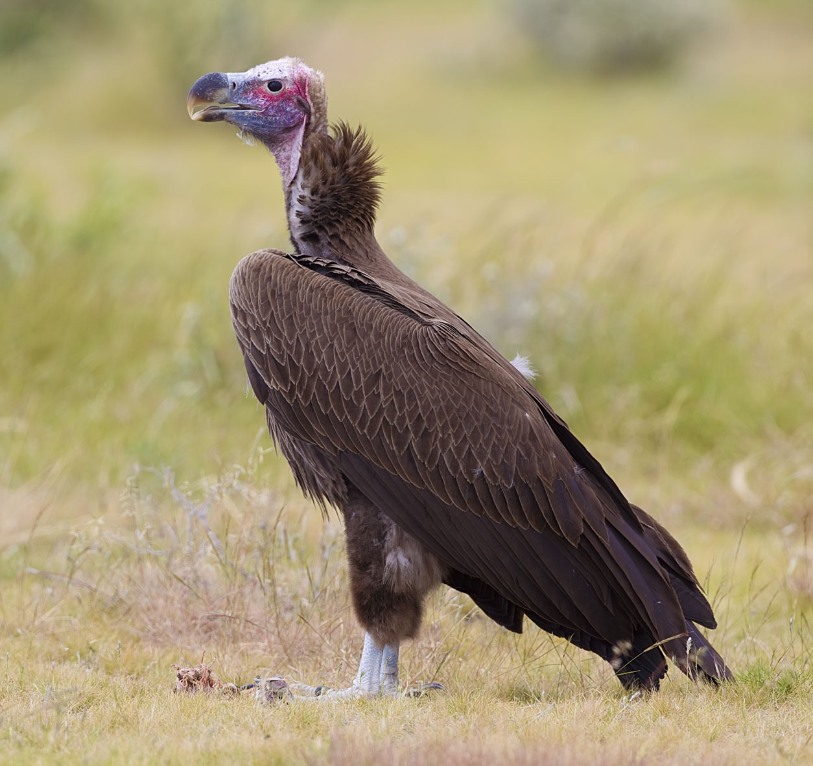
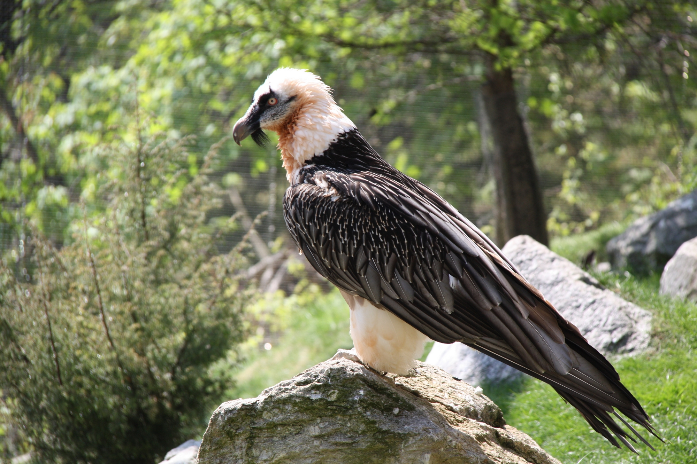

# Animals in the Bible

## License Information

Animals in the Bible © United Bible Societies, 2025. Adapted from: <cite>All Creatures Great and Small: Living Things in the Bible</cite>, by Edward R. Hope © 2005 United Bible Societies. This work is licensed under Creative Commons Attribution-ShareAlike 4.0 International (<a href="https://creativecommons.org/licenses/by-sa/4.0/">https://creativecommons.org/licenses/by-sa/4.0/</a>).

--------------------------------

## 标题：雕、兀鹫（eagle, vulture） (id: FAUNA:3.8)

3\.8 标题：雕、兀鹫（eagle, vulture）
============================

经文出处
----

Hebrew 来：נֶשֶׁר (音译：nesher)

[EXO 19:4](https://ref.ly/Exod19:4), [LEV 11:13](https://ref.ly/Lev11:13), [DEU 14:12](https://ref.ly/Deut14:12), [DEU 28:49](https://ref.ly/Deut28:49), [DEU 32:11](https://ref.ly/Deut32:11), [2SA 1:23](https://ref.ly/2Sam1:23), [JOB 9:26](https://ref.ly/Job9:26), [JOB 39:27](https://ref.ly/Job39:27), [PSA 103:5](https://ref.ly/Ps103:5), [PRO 23:5](https://ref.ly/Prov23:5), [PRO 30:17](https://ref.ly/Prov30:17), [PRO 30:19](https://ref.ly/Prov30:19), [ISA 40:31](https://ref.ly/Isa40:31), [JER 4:13](https://ref.ly/Jer4:13), [JER 48:40](https://ref.ly/Jer48:40), [JER 49:16](https://ref.ly/Jer49:16), [JER 49:22](https://ref.ly/Jer49:22), [LAM 4:19](https://ref.ly/Lam4:19), [EZK 1:10](https://ref.ly/Ezek1:10), [EZK 10:14](https://ref.ly/Ezek10:14), [EZK 17:3](https://ref.ly/Ezek17:3), [EZK 17:7](https://ref.ly/Ezek17:7), [HOS 8:1](https://ref.ly/Hos8:1), [OBA 1:4](https://ref.ly/Obad1:4), [MIC 1:16](https://ref.ly/Mic1:16), [HAB 1:8](https://ref.ly/Hab1:8)

Hebrew 来：עָזְנִיָּה (音译：‘ozniyah)

[LEV 11:13](https://ref.ly/Lev11:13), [DEU 14:12](https://ref.ly/Deut14:12)

Hebrew 来：עַיִט (音译：‘ayit)

[GEN 15:11](https://ref.ly/Gen15:11), [JOB 28:7](https://ref.ly/Job28:7), [ISA 18:6](https://ref.ly/Isa18:6), [ISA 18:6](https://ref.ly/Isa18:6), [ISA 46:11](https://ref.ly/Isa46:11), [JER 12:9](https://ref.ly/Jer12:9), [JER 12:9](https://ref.ly/Jer12:9), [EZK 39:4](https://ref.ly/Ezek39:4)

Hebrew 来：פֶּרֶס (音译：peres)

[LEV 11:13](https://ref.ly/Lev11:13), [DEU 14:12](https://ref.ly/Deut14:12)

Hebrew 来：רָחָם, רָחָמָה (音译：racham, rachamah)

[LEV 11:18](https://ref.ly/Lev11:18), [DEU 14:17](https://ref.ly/Deut14:17)

Greek 希：ἀετός (音译：aetos)

[MAT 24:28](https://ref.ly/Matt24:28), [LUK 17:37](https://ref.ly/Luke17:37), [REV 4:7](https://ref.ly/Rev4:7), [REV 8:13](https://ref.ly/Rev8:13), [REV 12:14](https://ref.ly/Rev12:14)

Latin 拉：aquila

[2ES 11:1](https://ref.ly/2Esd11:1), [2ES 14:18](https://ref.ly/2Esd14:18)

讨论
--

兀鹫和雕在古代比现在更为常见。事实上，自1945年第二次世界大战结束以来，全球兀鹫和雕的数量减少了60％以上。这主要是由于：（1）食用含有高浓度杀虫剂滴滴涕（DDT）的动物，导致缺钙，（2）食用中毒的老鼠，（3）现代步枪的发明使得野生动物消失，以及现代垃圾处理系统的出现，都导致腐肉量减少。

*Nesher* ：与许多希伯来文鸟名一样，*nesher* 这个词既特指一种鸟，也泛指一类鸟。*Nesher* 很有可能特指以色列地最大的猛禽，即兀鹫（学名*Gyps fulvus* ）；但是，因为这个词也指大型猛禽，可以泛指所有种类或其中任何一种，因此这种大型猛禽可能还包括肉垂秃鹫（学名*Torgos tracheliotus negevensis* ；现在相当罕见，但以前数量颇多）、金雕（学名*Aquila chrysaetos* ）、白肩雕（学名*Aquila heliaca* ）、草原雕（学名*Aquila nipalensis* ），也许还有黑雕（学名*Aquila verreauxii* ）。最后提到的这种黑雕只在过去的35年中才在以色列饲养，但是一些鸟类学家相信这种鸟也生活在古代的以色列，因为黑雕总是与它最爱的猎物蹄兔联系在一起。卡农•特里斯特拉姆（Canon Tristram）没有提到黑雕。

*‘Ozniyah* ：学者对这个词的含义有相当大的疑问，其含义基本上是根据这种鸟在不洁净鸟类清单中的位置来确定的；根据位置，这很可能是一种兀鹫而非鱼鹰。由于黑兀鹫（学名*Aegypius monachus* ）略小于肉垂秃鹫和胡兀鹫，所以这个词指黑兀鹫的可能性似乎最大。这个词很可能代表与黑兀鹫大小相近的雕和鵟鹰，即上面提到的一些雕。在现代希伯来文中，*‘ozniyah* 是肉垂秃鹫和黑兀鹫的名称。

*‘Ayit* ：学者普遍认为，*‘ayit* 一词在圣经中涵盖了雕和兀鹫这两种鸟。然而，这个词可能并不涵盖体型较小的猛禽，如鹰、雀鹰或体型较小的隼。这个词所在的上下文明显指的是食腐肉的鸷鸟，而不是指所有的食肉鸟类。因此，"birds of prey"（"食肉鸟类"）这个英文表述含义太广，但是JB (Jerusalem Bible (1966)) 和NIV (New International Version (1984)) 在某些经文中采用的术语"carrion birds"（"食腐鸟"）可能更为准确。

一般认为，希伯来文*‘ayit* 一词源自一个意为"尖叫"的词根，因此这个词的意思是"尖叫者"；在[GEN 15:11](https://ref.ly/Gen15:11) 和其他经文中，显然是指一种鸟。然而，也有学者认为*‘ayit* 与另一个意为"贪婪地攻击"的词根有关。

在17世纪的英文中，"fowls"一词用来指大型或成年鸟类，"birds"用来指较小的鸟类或鸡。动词"raven"的意思是将尸体上的肉撕扯下来，因此KJV (King James Version (1611)) 中的短语"ravenous birds"（[ISA 46:11](https://ref.ly/Isa46:11) ；[EZK 39:4](https://ref.ly/Ezek39:4) ；《和修》分别译作"鸷鸟"和"攫食的飞鸟"）并不是指"饥饿的鸟"，而是指"将尸体上的肉撕扯下来的鸟"。

希伯来文*peres* 一词源于一个意为"撕裂"或"打破"的词根，可能是指外形酷似雕的胡兀鹫或髭兀鹫（学名*Gypaëtus barbatus* ）。这个词可能代表一组比前文*nesher* 所指的兀鹫和雕略小的鹫和雕，包括黑胸蛇雕（又名短趾雕或黑胸鹞；学名*Circaetus gallicus* 或*Circaetus pectoralus* ）和靴雕（学名*Hieraaetus pennatus* ），以及一两种其他种类的雕。

*埃及秃鹫 (© michael clarke stuff (Wikimedia Commons))*

希伯来文*racham* 指黑白相间的东西。从这个词在不洁净鸟类清单中的位置来看，这应该是一种水鸟，因此可能的鸟类减少到两种，即埃及秃鹫（学名*Neophron percnopterus* ）或鱼鹰（学名*Pandion haliatus* ）。在现代希伯来文中，*racham* 是埃及秃鹫的名称，这似乎就是在JB (Jerusalem Bible (1966)) 中被译作"white vulture"（"白兀鹫"）的鸟。KJV (King James Version (1611)) 中的"geir\-eagle"是过去指称兀鹫的词语。

埃及秃鹫比上文提到的其他兀鹫小，颈部和头部长着凌乱的浅橙棕色长羽毛，面部黄色、无毛，黄色的喙比大多数兀鹫的喙更长，钩也较小。身体的其余部分和翅膀呈白色，翼尖为黑色。在飞行时，身体和翅膀的前半部分呈白色，翅膀的末端和后半部分为黑色。

这种兀鹫也吃腐肉，但通常是吃体型更大的兀鹫剩下的零碎，因为它的喙不够强健，无法轻松撕裂皮肉。它通常是在海滩上和垃圾堆里捡食零碎，也吃鸻、鹬、杓鹬等在地面上筑巢的水鸟的蛋，它会叼起石块把蛋砸破。

*Aetos* ：这是通常泛指雕的希腊文词语。

*Aquila* ：这是通常泛指雕的拉丁文词语。

描述
--

真正的雕在腿的下部有羽毛，但是兀鹫、蛇雕、鹰和其他种类的猛禽通常没有这样的羽毛。兀鹫的喙和颈比雕长，头部和颈部通常是秃的，或是有稀疏的绒羽，而没有真正的羽毛。

*西域兀鹫 (Pixabay)*

**西域兀鹫** ：这是兀鹫（学名*Gyps* ）中最大的一种，翼展约2\.5米（8英尺），体重达10公斤（22磅），长着一个粗壮的黑色钩状喙，头部和颈部覆盖着细细的绒羽，看起来好像总是皱着眉头。在后背两肩之间有一簇羽毛。头部、颈部和胸部呈灰色和浅驼色，背部呈深褐色，翅膀边缘的羽毛颜色较深。在空中翱翔时，身体和翅膀的前缘为浅棕色，在翅膀的后缘有一条较宽的暗色带。和所有真正的兀鹫一样，西域兀鹫的腿部没有羽毛。

西域兀鹫以相当大的规模群居，在高高的岩崖上栖息和筑巢。像大多数其他大型兀鹫一样，它们要等到上午九十点钟，有暖气流从地面上升的时候，才能够飞起来。然后它们就会盘旋翱翔，越飞越高。

这种兀鹫的眼睛非常特殊，可以看到很远的地方。《他勒目》（Talmud）中引用的一句谚语说："巴比伦的一只兀鹫看到了以色列的一具尸体。"它们时刻在搜寻死去或垂死的动物，同时留心在附近飞翔的其他兀鹫。它们翱翔的速度很慢，也不煽动翅膀。但当一只西域兀鹫停止盘旋并俯冲向猎物时，它会以小角度俯冲来迅速加速，尽管仍不拍打翅膀，却往往会达到很高的速度。希伯来文*nesher* 可能反映了它快速飞行时翅膀发出的嗖嗖声。其他兀鹫会注意到这一动作，并且紧随其后。

在生活着西域兀鹫和肉垂秃鹫的非洲国家，西域兀鹫通常会大群来到尸体旁，而肉垂秃鹫则成对到来。通常情况下，一头死牛会吸引二十只或更多的兀鹫，也许还有四只肉垂秃鹫。在古代以色列可能也是这个比例。

西域兀鹫先从尸体的肚子和其他柔软部位下嘴，它们会把头伸进尸体内，吃掉肝脏和其他柔软的器官，然后再吃较软的肉，这是"从里向外"吃。它们吃得很快，大约两分钟就可以吃掉1公斤（2磅）的肉。在饱食之后，它们很难起飞，需要在地上助跑并起跳，然后才能升空飞行。如果没有明显的危险，它们吃饱后更喜欢待在原地，或是在附近的木头或树上歇息。

*肉垂秃鹫 (© Yathin sk (Wikimedia Commons))*

**肉垂秃鹫** ：这种兀鹫的身高和翼展与西域兀鹫相差无几，但是身体更轻。它们在以色列的尼革夫地区独自或成对生活，在金合欢等平顶树的树端筑巢。肉垂秃鹫的喙呈微黄色，比西域兀鹫的喙更厚更坚硬，因而能吃皮、筋和韧肉。头部、面部和颈部的皮肤为红色，没有羽毛，头部和颈部有厚褶皱，身体的其余部分呈深棕色或黑色，腿的上部和肩部为白色。在翱翔时，翅膀前缘的白色细纹，以及白色的腿部（通常被鸟类观察者称为"白裤子"）清晰可见，除此之外，整个身体都呈现均匀的黑色。

肉垂秃鹫"从外向里"吃食动物的尸体，先撕开皮，吃掉皮，然后才开始吃肉。这种兀鹫非常具有攻击性，在与西域兀鹫分享尸体时占据上风。虽然腐肉是其主要食物，但它们有时也会自己捕猎，猎物主要是小型哺乳动物，如幼羚和野兔等。

**黑兀鹫** ：顾名思义，这种兀鹫是黑色的，只有裸露的头部和颈部为浅蓝灰色。从下方看时，它完全为黑色。

**大雕** ：前文提到的金雕、白肩雕和黑雕都非常大，翼展至少2米（6英尺）。这些雕总的来说不是食腐动物，但有时可能会与兀鹫一起吃死尸。它们的猎物一般是小型哺乳动物，如小瞪羚、羊羔、蹄兔、野兔、野山羊羔等，偶尔还有鹧鸪和鸽子等野禽。

*胡兀鹫 (© Hswaton (Wikimedia Commons))*

**胡兀鹫** ：又名髭兀鹫，这种鸟在兀鹫中独一无二，因为它像雕一样，腿部披覆羽毛。它比上面提到的兀鹫小，头、颈和身体都呈橙棕色，从头部后面经过眼睛到喙，有一条黑色条纹，在喙两侧的短黑髭处终止。背部和翅膀是深褐色。在它飞翔时，通过毛色和硕大的菱形尾巴可以很容易识别。通常，这种兀鹫在其他兀鹫吃完后进食，并且有一个特别的习惯，就是把骨头携到高空，然后扔到大岩石上摔碎，再吃掉骨髓和碎骨。这种鸟会很多年使用同一块岩石来弄碎骨头，因此KJV (King James Version (1611)) 的翻译者根据拉丁文杜撰了"ossifrage"一词来称呼它，这个词的意思是"破骨者"。另参[3\.2 礼仪上洁净的鸟和不洁净的鸟 (birds, clean and unclean)](#FAUNA:3.2) 和[3\.15 鱼鹰 (osprey)](#FAUNA:3.15) 。

特殊意义或象征意义
---------

雕和兀鹫的体型及力量都很大。特别重要的是，它们甚至能够在不拍动双翅的情况下作长距离高速飞行。由于埃及和亚述的神明都以雕或兀鹫为象征，以及这些鸟吃腐肉的习性，它们对犹太人来说是"不洁净的"。在年轻的埃及王图坦卡蒙（Tutankhamen）的木乃伊上面，有一个由黄金和彩色玻璃做成的大项圈，装饰着他的脖子和肩膀，样子是一只飞行的兀鹫，代表女神奈赫贝特（Nekhbet）。圣经中的雕也象征着保护，在《申命记》中，雕（中文译本多译为"鹰"）暗喻上帝。

雕和兀鹫是吃腐肉的猛禽，象征着战死，因为在战场上的尸体通常没有得到埋葬。这些鸟被列为礼仪上不洁净的鸟类。

兀鹫或雕是健康长寿的象征。事实上，这些鸟可以活很多年。奥地利的一份相当可靠的报告提到一只被关了104年的雕。希伯来文化将雕和长寿联想在一起，有些学者认为这与古代阿拉伯关于凤凰的神话有关；凤凰通常被描绘成某种雕，每五百年向太阳飞去，被太阳的火焰吞噬，并从自己的灰烬中重生。

到新约时期，除了上面提到的象征意义之外，雕也成为罗马帝国力量的象征。

翻译
--

上下文通常会表明圣经作者指的是兀鹫还是雕。当提到速度和俯冲捕获猎物时，指的就是雕；但是当提到吃尸体时，指的就是兀鹫。当圣经文本谈到高高飞翔或者在悬崖上安全地筑巢时，那么雕和兀鹫都适合。

有三种可能出现的语言情境：（1）用同一个词来指称兀鹫和雕，例如傈僳语、拉胡语和其他藏缅语言。这里没有必要区分两者，除非两个希伯来文词语一起出现。（2）没有表示兀鹫或雕的统称，但每个亚种都有自己的名称（例如非洲东南部的许多班图语言）。在这些情况下，最好选择体型最大的兀鹫或雕的名称来翻译*nesher* ，选择略小的兀鹫或雕的名称来翻译*peres* 。（3）有两个统称分别指兀鹫和雕（如英文）。在这种情况下，可以根据上下文来确定译词。

当经文提到巢穴是在悬崖的高处，翻译时就应该小心，因为一些兀鹫和雕的巢是在树上。在这些情况下，应选择在悬崖上筑巢的猛禽名称，即使体型较小。

希伯来文*‘ozniyah* 一词可能是表示黑兀鹫或者一种中等大小的雕。可能最好采用"小兀鹫"这样的表达方式。

在翻译不洁浄鸟类清单中的*‘ozniyah* 时，可以选择与黑兀鹫体型相当的另一种雕或兀鹫的名称；或者与*peres* 一起，采用一个表示体型较大的兀鹫和雕的一般性表述。

*‘Ayit* ：如果目标语言没有一个涵盖雕和兀鹫的词语，但当地有这两种猛禽，例如在非洲和中东，那么最好使用一个意为"雕和兀鹫"的短语；也可以使用短语"食腐猛禽"，或者直接译作"兀鹫"。

美洲和澳大拉西亚没有真正的兀鹫，但是可以用"鵟鹰"来替代"兀鹫"；如果是在美洲，还可以译成"神鹫"。在其他地方，可以使用"吃死物的雕"之类的短语或者借用外来语。

[JER 12:9](https://ref.ly/Jer12:9) ：有些学者认为，这节经文中的短语*‘ayit tsavu‘a* 意思是"有斑点的鸷鸟"。还有学者认为*tsavu‘a* 是指"鬣狗"（认为*‘ayit* 源于一个意为"贪婪地攻击"的词根），他们把*‘ayit tsavu‘a* 的意思解作"贪婪的／食腐的鬣狗"、"鬣狗的猎物"，或者"鬣狗的腐肉"。在这节经文中，后面的这些解释比"有斑点的鸷鸟"更合理。参[2\.19 鬣狗 (hyena)](#FAUNA:2.19) 。

有些时候，翻译者需要注意当地的文化。在有些文化中，兀鹫和雕在人们的观念中具有截然不同的象征意义；在一个文化里被认为是讨厌的、肮脏的，通常是负面的东西，而在另一个文化里则是权力和高贵的象征。后一种象征意义出现在圣经中，但通常与*nesher* 相关联，而*nesher* 一般是指兀鹫而不是雕。因此，有人可能会翻译成"我如兀鹫将你们背在翅膀上"（见下面的讨论）。然而，这会让大多数西方读者产生错误的认识。对于具有这种象征意义的经文，如果上下文允许，最好译成"雕"（或"鹰"）。

*Peres* ：胡兀鹫生活在欧洲南部、中亚和南亚，以及非洲东部和南部的山区。中型短趾雕遍布东欧、中东和非洲。靴雕分布在欧洲、亚洲和非洲各地。在其他地区，可用表示中型兀鹫或雕的名称来翻译*peres* 。

在非洲，有许多与西域兀鹫亲缘很近的兀鹫，并且肉垂秃鹫在非洲大陆的大部分地区都很常见。非洲的兀鹫包括在树上筑巢的白背兀鹫（学名*Gyps africanus* 或*Gyps bengalensis* ）、南非兀鹫（学名*Gyps coprotheres* ），以及鲁佩尔兀鹫（学名*Gyps ruppelli* ）。在提到兀鹫的经文中，任何表示这些兀鹫的当地词语都是合宜的对等词。

西域兀鹫也出现在欧洲中部和东部，以及印度次大陆。在拉丁美洲和加利福尼亚，神鹫可能是当地的对等物。在澳大利亚，楔尾雕（学名*Aquila audax* ）可能是当地的对等物。

在西欧的大部分地区以及以色列，都可以看到金雕和白肩雕。

金雕和白肩雕在非洲的对等物是黑雕（学名*Aquila verreauxii* ）和猛雕（学名*Polemaetus bellicosus* ）。

草原雕（学名*Aquila nipalensis* ）的分布范围经以色列，一直到南非的北部地区。这种雕也分布在东欧、哈萨克斯坦、中亚和南亚。

在北美洲，白头海雕（学名*Haliaeetus leucocephalus* ）在有些经文中可以作希伯来文*nesher* 的对等译词。

[EXO 19:4](https://ref.ly/Exod19:4) ："我带着你们，你们在雕的翅膀上"（NIV (New International Version (1984)) 直译）这句话包含一个比喻，在许多语言中，读者会按照字面意思来理解。然而，这里的经文意思不是大雕将以色列人背到西奈山。事实上，这个比喻指的是上帝的保护、速度和力量，经文的意思是："我把你们带到这里，好像我是大雕背着你们过来一样。"

有些注释书引用了一个经常被人提到但未经证实的说法，大意是说以色列人认为雕把幼雕背在翅膀上。有些注释书甚至声称，博物学家确实观察到了雕的这种行为。除了两处经文之外（[EXO 19:4](https://ref.ly/Exod19:4) 是一处），没有其他证据可以证明以色列人有这种观念，并且专门观察雕的博物学家也没有报告过雕有这样的行为。实际上，这些注释书误解了"在翅膀上"这个希伯来文谚语，它的意思不是"在翅膀的上面"，而是"在飞行"。

[DEU 28:49](https://ref.ly/Deut28:49) ：上下文清楚表明这节经文中的*nesher* 正在攻击悖逆的以色列民，而不是吞吃这死亡的国民，因此这个词应该解作大雕（如RSV (Revised Standard Version (1952)) 、JB (Jerusalem Bible (1966)) 、NIV (New International Version (1984)) 、TEV (Today's English Version (Good News Bible)) 、NAB (New American Bible (1970)) ），而不是兀鹫（如NEB (New English Bible (1970)) 、REB (Revised English Bible (1989)) ）。

[DEU 32:10](https://ref.ly/Deut32:10); [DEU 32:11](https://ref.ly/Deut32:11); [DEU 32:12](https://ref.ly/Deut32:12) ：第11节存在几个问题。在希伯来文诗句中，第10节和第11节紧密相连，因此第11节继续第10节的思路。第10节最后三个动词是"环绕他，看顾他，保护他"。在这里的上下文中，把第11节译成"搅动巢窝"（如RSV (Revised Standard Version (1952)) 、NIV (New International Version (1984)) ）是不大可能的。"在它的巢穴之上看护"（如NEB (New English Bible (1970)) 、JB (Jerusalem Bible (1966)) 、REB (Revised English Bible (1989)) ）是更好的解释，但这个动词在其他地方经常被译为"鼓励"，所以这里也完全可能是"鼓励它的雏鸟"的意思（参NAB (New American Bible (1970)) ）。

所有英文译本都错误地将这处经文曲解为大雕如何教导幼雕飞翔，可能是因为接受了上面提到的错误想象，即大雕将幼雕背在翅膀之上。

实际情形是：大雕向幼雕展示如何在起风时将翅膀展开，同时用爪子紧紧抓住巢的边缘。幼雕最终掌握了这个本领之后，就会松开爪子，乘风飞离巢窝。在这个阶段，大雕通常在巢窝的上方不远处盘旋。

如果不采纳前述想象，那么此处的希伯来文本可以有一种非常不同的、与实际情形一致的解释。这种解释得到了一些学者的支持，但还没有任何注释书或译本提到过。这种解释将第11节中的最后一个动词解作"升高自己"而不是"被升高"。下面是这种解释的译经示例：

10耶和华在旷野之地，

在空旷、野兽吼叫之荒地遇见他，

就环绕他，看顾他，

保护他，如同保护眼中的瞳人。

11如同大雕鼓励雏雕，

在雏雕上面飞翔，

展开双翅教导雏雕，

直到雏雕用它强健的翅膀飞升，

12耶和华也照样独自引导他，

并无外邦神明与他同在。

第11节有两个表示"翅膀"的词语，第二个词是一个诗歌用语，源于一个意为"强大的"希伯来文词根。

[DAN 4:30](https://ref.ly/Dan4:30) （《和》4:33）：这里描述尼布甲尼撒的头发"像鹰的羽毛一样长"（"鹰"或译"雕"），可能读来奇怪，因为以色列当地的雕的头部都很光洁，而大兀鹫的头部或是长着短绒羽，或是秃顶。因此，这里比喻的对象可能是小型埃及秃鹫，这种兀鹫的头部和颈部长着非常凌乱的长羽毛，或者也可能是长冠鹰雕（学名*Lophaetus occipitalis* ），这种雕广泛分布在整个非洲东部和南部，向北一直到埃塞俄比亚和苏丹。

在埃及秃鹫或长冠鹰雕生活的非洲地区，这两个名称都适合这节经文。在其他地区，"他的头发像雕的羽毛一样长"可能是最好的表达。

[MIC 1:16](https://ref.ly/Mic1:16) ：这里可能指的是肉垂秃鹫。

* **Associated Passages:** 出埃及记 19:4; 利未记 11:13; 申命记 14:12; 申命记 28:49; 申命记 32:11; 撒母耳记下 1:23; 约伯记 9:26; 约伯记 39:27; 诗篇 103:5; 箴言 23:5; 箴言 30:17; 箴言 30:19; 以赛亚书 40:31; 耶利米书 4:13; 耶利米书 48:40; 耶利米书 49:16; 耶利米书 49:22; 耶利米哀歌 4:19; 以西结书 1:10; 以西结书 10:14; 以西结书 17:3; 以西结书 17:7; 何西阿书 8:1; 俄巴底亚书 1:4; 弥迦书 1:16; 哈巴谷书 1:8; 创世记 15:11; 约伯记 28:7; 以赛亚书 18:6; 以赛亚书 46:11; 耶利米书 12:9; 以西结书 39:4; 利未记 11:18; 申命记 14:17; 马太福音 24:28; 路加福音 17:37; 启示录 4:7; 启示录 8:13; 启示录 12:14; 厄斯德拉下 11:1; 厄斯德拉下 14:18; 申命记 32:10; 申命记 32:12; 但以理书 4:30

