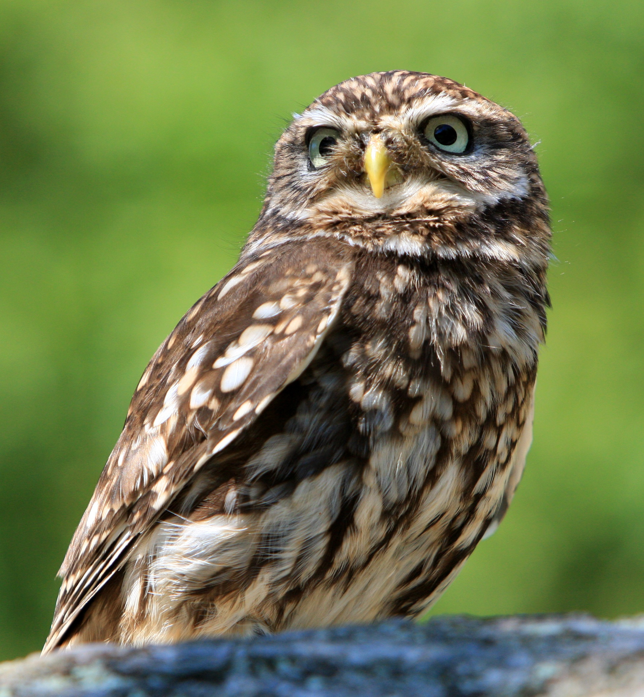
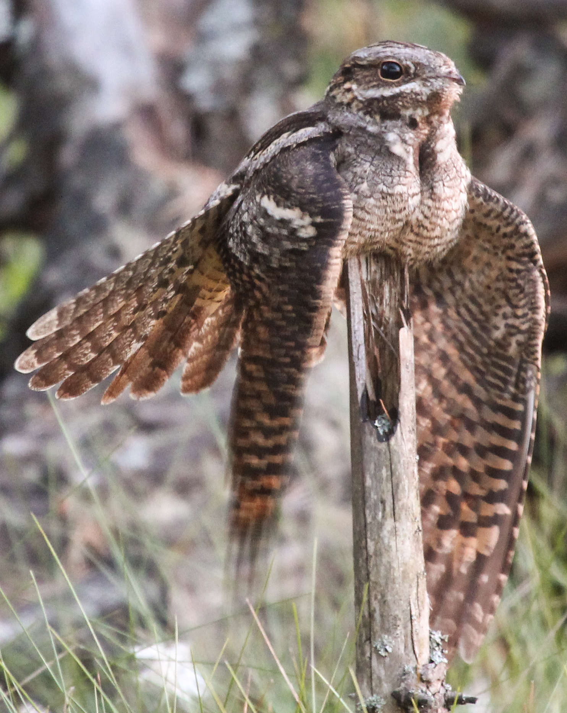

# Animals in the Bible

## License Information

Animals in the Bible © United Bible Societies, 2025. Adapted from: <cite>All Creatures Great and Small: Living Things in the Bible</cite>, by Edward R. Hope © 2005 United Bible Societies. This work is licensed under Creative Commons Attribution-ShareAlike 4.0 International (<a href="https://creativecommons.org/licenses/by-sa/4.0/">https://creativecommons.org/licenses/by-sa/4.0/</a>).

--------------------------------

## 标题：猫头鹰、鸮（owl） (id: FAUNA:3.17)

3\.17 标题：猫头鹰、鸮（owl）
===================

除了南极和一些岛屿之外，世界各地都有猫头鹰。猫头鹰在夜间十分活跃，特点是面部平坦，有短钩状的喙，可以张得很开。猫头鹰会将猎物整个吞下，然后将未消化的部分以小球状反刍吐出。猫头鹰还可以把头扭转180度。

猫头鹰有两个科，在以色列地区都有。一个是草鸮科（学名*Tytonidae* ），包括仓鸮和草鸮。它们的白色面盘为心形，脸型轮廓通常以深色线勾勒出来，另外还长着黑色的小眼睛。另一个是鸱鸮科（学名*Strigidae* ），这是典型的猫头鹰。该科包含许多个物种，所有物种都长着大眼睛，颜色从浅棕色到橙色到黄色不一。这个科包括耳猫头鹰，相当罕见的渔鸮，以及大小不一的各种猫头鹰，从侏儒角鸮（小于20厘米或8英寸）一直到巨型雕鸮（超过70厘米或28英寸）。

以色列地有八种猫头鹰比较常见，大多数很少被人看到，但是因其独特的叫声而广为人知。在圣经时期，夜晚比现代大多数地方的晚上要安静得多，而且夜晚的奇怪声音肯定会引起人们的兴趣，对于声音的来源产生许多猜测。因此，即使人们未曾见过它们，不同的猫头鹰也可能有不同的名字。事实上，当时的人不太可能将大多数叫声与看到的猫头鹰对应起来。（记住，那时没有手电筒。）另参[3\.2 礼仪上洁净的鸟和不洁净的鸟 (birds, clean and unclean)](#FAUNA:3.2) 和[3\.13 寒鸦 (jackdaw)](#FAUNA:3.13) 。

## 标题：Bath ya‘anah（希伯来文） (id: FAUNA:3.17.1)

3\.17\.1 标题：Bath ya‘anah（希伯来文）
==============================

经文出处
----

Hebrew 来：בַּת יַעֲנָה (音译：bath ya‘anah)

[LEV 11:16](https://ref.ly/Lev11:16), [DEU 14:15](https://ref.ly/Deut14:15), [JOB 30:29](https://ref.ly/Job30:29), [ISA 13:21](https://ref.ly/Isa13:21), [ISA 34:13](https://ref.ly/Isa34:13), [ISA 43:20](https://ref.ly/Isa43:20), [JER 50:39](https://ref.ly/Jer50:39), [MIC 1:8](https://ref.ly/Mic1:8)

讨论
--

*雕鸮 (A Different Perspective (Pixabay))*

有些学者将*bath ya‘anah* 与*ya‘en* （鸵鸟）联系起来。然而，考虑到这个词出现的上下文，这种解释似乎不大可能。在圣经的背景下，可以看到*bath ya‘anah* 与野狗、废墟和哀号相关联。另外，这种鸟似乎傍水生活（比较[ISA 43:20](https://ref.ly/Isa43:20) ）。这些都不太符合鸵鸟的情形。此外，虽然有些鸟根据其食物或者与外邦神明之间的联系，很容易看出它们为什么被视为不洁净，但却很难看出为什么鸵鸟也被列入不洁净鸟类的清单。鸵鸟和家禽一样，基本上素食。唯一可能的原因是，因为鸵鸟不能飞行，所以就如蝙蝠一样，被认为有些"不自然"。

也有学者认为该名称源于一个意为"沙漠"的阿拉伯文词语，还有一些学者认为来自一个意为"贪婪"的亚兰文词语。德赖弗（G. R. Driver）在《哈斯丁圣经辞典》（*Hasting’s Dictionary of the Bible* ）中提出建议，这个词指的是雕鸮；根据这种鸟在不洁净的鸟类清单中的位置，这似乎是非常可能的。（参[3\.2 礼仪上洁净的鸟和不洁净的鸟 (birds, clean and unclean)](#FAUNA:3.2) 。）NEB (New English Bible (1970)) 和REB (Revised English Bible (1989)) 中译成的"desert\-owl"（"沙漠猫头鹰"）不是一个具体的物种，而是指栖息地远离城镇的猫头鹰的统称。

描述
--

雕鸮是鸱鸮科中的大块头。欧洲雕鸮（学名*Bubo bubo* ）是中东地区体型最大的猫头鹰，身高超过75厘米（30英寸）。以色列地区相对应的猫头鹰呈浅黄褐色，带斑点，有耳羽簇，最为人所知的是它在夜间发出低沉的呜呜叫声。白天在金合欢树、洞穴、墓地和残垣破壁的阴凉处歇息。以小型哺乳动物为食，包括野兔、小瞪羚、羔羊、田鼠和家鼠，以及大型栖息鸟类，尤其是野生和家养的鸭子。当这种猫头鹰在白天栖息，或者在洞穴或古墓中受到干扰时，有时可以见到它们，但在夜间却很少见到；在现代，有时会在夜晚的道路上看到它们。

特殊意义或象征意义
---------

在圣经中，猫头鹰与死亡、哀悼和毁灭相关联，并被列为礼仪上不洁净的鸟类。

翻译
--

在欧洲的南部和东部，以及整个非洲、南亚和东南亚，都发现有某种雕鸮。在澳大拉西亚，发现了一种略有不同的大型猫头鹰。两种最常见的非洲雕鸮是斑雕鸮（学名*Bubo africanus* ）和巨雕鸮（学名*Bubo lacteus* ；在东非称为黑雕鸮）。亚洲雕鸮（学名*Bubo indicus* ）生活在远离城镇的多树山村。最大的澳大利亚猫头鹰是猛鹰鸮（学名*Ninox strenua* ）。任何指称这些猫头鹰的词语，或者意为"巨型猫头鹰"的短语，都可以用来翻译不洁净鸟类名单中的对应鸟类。在其他上下文中，采用"大型猫头鹰"之类的短语就足够了。

* **Associated Passages:** 利未记 11:16; 申命记 14:15; 约伯记 30:29; 以赛亚书 13:21; 以赛亚书 34:13; 以赛亚书 43:20; 耶利米书 50:39; 弥迦书 1:8

## 标题：Yanshuf（希伯来文） (id: FAUNA:3.17.2)

3\.17\.2 标题：Yanshuf（希伯来文）
=========================

经文出处
----

Hebrew 来：יַנְשׁוֹף (音译：Yanshuf)

[LEV 11:17](https://ref.ly/Lev11:17), [DEU 14:16](https://ref.ly/Deut14:16), [ISA 34:11](https://ref.ly/Isa34:11)

讨论
--

*耳鸮 (Pixabay)*

与大多数猫头鹰一样，各圣经译本对这个词的译法并不完全一致。最早时候，*yanshuf* 译作"角鸮"得到有力的支持。但是，这种译法极具误导性。在[LEV 11:18](https://ref.ly/Lev11:18) 和[DEU 13:16](https://ref.ly/Deut13:16) 的不洁净鸟类清单中，下一个希伯来文名称是*tinshemeth* ，NIV (New International Version (1984)) 将这个词译为"white owl"（"白鸮"），NAB (New American Bible (1970)) 译为"barn owl"（"仓鸮"）。事实上，白鸮和仓鸮只是耳鸮的别称，并且这两个译本已经在清单的前面提到了耳鸮。因此，这两个译本实际上列出了同一种猫头鹰两次。在犹太学者中，将*tinshemet* 译为仓鸮由来已久，在现代希伯来文中，这是仓鸮的名称。（参[3\.17\.8 Tinshemeth（希伯来文）](#FAUNA:3.17.8) 关于*tinshemet* 的进一步讨论）。因此，最好以其他方式来翻译*yanshuf* 。

有两种可选译法。如果翻译者把清单前面的*tachmas* 译成"耳鸮"，那么可把*yanshuf* 译为"灰林鸮"。如果翻译者决定遵循现代希伯来文用法，将*tachmas* 译为"夜鹰"（或"鸱"），那么最好将*yanshuf* 译为"耳鸮"，这也符合现代希伯来文的用法。

描述
--

在以色列地，灰林鸮（学名*Strix aluco* ）是一种相当罕见的鸟类，但是只要在它栖息的地方，它的叫声肯定不会被人错认。雄性发出一连串*HOO\-hoo\-hoo，hoo\-HOO\-hoo* 的叫声，而雌性则用音调更高的单声*HOO* 来回应。它的眼睛周围有灰白色的圆圈，看起来好像戴着眼镜。顾名思义，这种鸟呈斑驳的灰褐色。灰林鸮比较喜欢树木繁茂的地区或果园，以及靠近树干的栖息地。

特殊意义或象征意义
---------

这种鸟被列为礼仪上不洁净的鸟类。

翻译
--

灰林鸮与林鸮（学名*Strigidae* ）属于同一个科，并且世界上的许多地方都有和灰林鸮非常相像的猫头鹰。在撒哈拉以南的非洲地区，非洲林鸮（学名*Strix woodfordii* ）与灰林鸮非常相似，而在澳大利亚，斑布克鹰鸮（学名*Ninox novaseelandiae* ）是个很合适的对等词。在其他地方，可以采用中型林鸮的名称或者"黄褐色猫头鹰"等短语来翻译这种猫头鹰。

* **Associated Passages:** 利未记 11:17; 申命记 14:16; 以赛亚书 34:11; 利未记 11:18; 申命记 13:16

## 标题：Kos（希伯来文） (id: FAUNA:3.17.3)

3\.17\.3 标题：Kos（希伯来文）
=====================

经文出处
----

Hebrew 来：כּוֹס (音译：kos)

[LEV 11:17](https://ref.ly/Lev11:17), [DEU 14:16](https://ref.ly/Deut14:16), [PSA 102:7](https://ref.ly/Ps102:7)

讨论
--

*小猫头鹰 (Pixabay)*

传统上，*kos* 被译为"小猫头鹰"（鸮鸟），这是该词在现代希伯来文中的含义。这种译法是最有可能的，虽然并不是毫无质疑。如果我们接受这种辨识，那么不洁净鸟类清单的结构就非常整齐，这种最小的猫头鹰与最小的猛禽*nets* 配对。

描述
--

顾名思义，小猫头鹰（又名"纵纹腹小鸮"；学名*Athene noctua* ）是一种体型较小的猫头鹰，主要在夜间觅食昆虫和雏鸟。长约25厘米（10英寸），短尾巴，没有耳羽簇，以河岸的洞或白蚁丘为巢穴。小猫头鹰常在白天被人看到，通常是被一群小鸟追逐着。

特殊意义或象征意义
---------

这种鸟被列为礼仪上不洁净的鸟类。

翻译
--

小猫头鹰（纵纹腹小鸮）分布在欧洲东南部、中东和非洲东北部。在其他地方，翻译者可以使用一种小型猫头鹰的名称或短语"小猫头鹰"来指称这种猫头鹰。

* **Associated Passages:** 利未记 11:17; 申命记 14:16; 诗篇 102:7

## 标题：Lilith（希伯来文） (id: FAUNA:3.17.4)

3\.17\.4 标题：Lilith（希伯来文）
========================

经文出处
----

Hebrew 来：לִילִית (音译：lilith)

[ISA 34:14](https://ref.ly/Isa34:14)

讨论
--

有些解经家将这个词与巴比伦传说中提到的雌性鬼怪联系起来，因此RSV (Revised Standard Version (1952)) 、JB (Jerusalem Bible (1966)) 、TEV (Today's English Version (Good News Bible)) 和NAB (New American Bible (1970)) 都是这样翻译。然而，即使这种意见被人接受，该鬼怪也很可能与某种夜鸟有关。在许多中东文化中，恶魔和怪物被认定等同于猫头鹰，这可能是因为它们在夜间发出奇怪的声音。

在现代希伯来文中，*lilith* 是灰林鸮的名称。有些贝都因人说，另一种猫头鹰西红角鸮（学名*Otus scops* ；以色列最常见的猫头鹰之一）发出的颤动的叫声，是一个雌性恶魔窃喜她找到猎物而发出的怪叫。这个名称的词根与希伯来文中的"夜"字相似，但实际上这是一个巴比伦文词语。它也与一些现代巴勒斯坦人描述的猫头鹰叫声相似。

描述
--

上文描述了灰林鸮，参[3\.17\.2 Yanshuf（希伯来文）](#FAUNA:3.17.2) 。西红角鸮是一种体型很小的耳鸮，身体呈斑驳的灰色，白天靠近树干栖息，其斑驳的体色与树皮浑然一体，看起来就像一根残枝。西红角鸮的叫声柔和抖颤。

特殊意义或象征意义
---------

这种鸟与厄运、毁灭和恶魔联系在一起。

翻译
--

诸如"猫头鹰恶魔"或"猫头鹰女巫"之类短语可能是最好的表达方式。在撒哈拉以南的非洲地区，人们熟知西红角鸮，可以使用其当地的名称加上"恶魔"或"女巫"来翻译。

* **Associated Passages:** 以赛亚书 34:14

## 标题：Qipod（希伯来文） (id: FAUNA:3.17.5)

3\.17\.5 标题：Qipod（希伯来文）
=======================

经文出处
----

Hebrew 来：קִפֹּד (音译：qipod)

[ISA 14:23](https://ref.ly/Isa14:23), [ISA 34:11](https://ref.ly/Isa34:11), [ZEP 2:14](https://ref.ly/Zeph2:14)

讨论
--

RSV (Revised Standard Version (1952)) 将这个词翻译成"hedgehog"（"刺猬"）或"porcupine"（"豪猪"），这是非常不可能的，因为在同一段落中一起提到的其他生物都是鸟类。从这个词出现的三处经文的上下文来看，似乎是指一种与沼泽地、旷野和废墟有关的鸟。译为"苇鳽"和"鹭鸶"符合沼泽地的背景，但不适合与以东相关的荒地背景。在[ZEP 2:14](https://ref.ly/Zeph2:14) 中，"苇鳽"的可能性更小，那里说到这种鸟在城里的柱顶筑巢。苇鳽是在茂密的草丛或芦苇丛中筑巢，几乎是在地面上。（然而，这节经文的希伯来文本有很大的问题。）NEB (New English Bible (1970)) 和REB (Revised English Bible (1989)) 采纳德赖弗（G. R. Driver）的建议译为"bustard"（"鸨"），但这只符合以东的荒地背景，而不适合其他上下文。鸨栖息在半沙漠地区，并且在地面上筑巢。

近期提出了其他一些建议，认为这种鸟实际上是白琵鹭（学名*Platalea leucorodia* ），现代希伯来文称为*kapan* （可能是*qipod* 的一种形式），或者可能是寒鸦，因为在出现这个词的两处经文中，同一个句子里面也提到了乌鸦。琵鹭不符合荒地背景，所以目前这一建议几乎没有被接受。寒鸦符合所有的上下文，但*qa’ath* 一词更有可能是指这种鸟。

因此，这里有可能是指某种猫头鹰，猫头鹰适合所有的语境，得到大多数解经家的支持。然而，确定地辨识这种鸟是不可能的。

描述
--

参前文[3\.17 猫头鹰、鸮 (owl)](#FAUNA:3.17) 关于猫头鹰的描述。

特殊意义或象征意义
---------

这种动物与厄运和毁灭联系在一起。

翻译
--

在大多数情况下，泛指猫头鹰的词语可能是最好的选择。因此，[ZEP 2:14](https://ref.ly/Zeph2:14) 可以这样翻译："群畜和各类的走兽必躺卧在其中，寒鸦和猫头鹰要在柱顶筑巢……。"

* **Associated Passages:** 以赛亚书 14:23; 以赛亚书 34:11; 西番雅书 2:14

## 标题：Qipoz（希伯来文） (id: FAUNA:3.17.6)

3\.17\.6 标题：Qipoz（希伯来文）
=======================

经文出处
----

Hebrew 来：קִפּוֹז (音译：qipoz)

[ISA 34:15](https://ref.ly/Isa34:15)

讨论
--

JB (Jerusalem Bible (1966)) 认为*Qipoz* 的意思是"箭头蛇"，这是一种毒蛇，因此将其译作"viper"（"毒蛇"）。然而，在希伯来诗歌中，这个词与"鹞鹰"平行，因此更大可能是指某种猛禽。这也排除了"沙鹑"为正确译法的可能性。某种猫头鹰当然也符合这里的上下文。*Qipoz* 和*qipod* 有可能是同一个词的两种形式。

描述
--

参[3\.17 猫头鹰、鸮 (owl)](#FAUNA:3.17) 关于猫头鹰的描述。

特殊意义或象征意义
---------

这种鸟与厄运和毁灭联系在一起。

翻译
--

参[3\.17\.5 Qipod（希伯来文）](#FAUNA:3.17.5) 中的建议。

* **Associated Passages:** 以赛亚书 34:15

## 标题：Tachmas（希伯来文） (id: FAUNA:3.17.7)

3\.17\.7 标题：Tachmas（希伯来文）
=========================

经文出处
----

Hebrew 来：תַּחְמָס (音译：tachmas)

[LEV 11:16](https://ref.ly/Lev11:16), [DEU 14:15](https://ref.ly/Deut14:15)

讨论
--

*短耳鸮 (© nigel from vancouver, Canada (Wikimedia Commons))*

从各种英文译本的译法可以明显看出，除了确定这是一种夜间活动的鸟类之外，人们对这个词的意思没有达成共识。

如果这种鸟是猫头鹰的一种，根据它在不洁净鸟类清单中的位置，可以认为它的大小介于雕鸮和小猫头鹰之间。换句话说，可能是一种中等大小的猫头鹰。

有四种可能：短耳鸮（学名*Asio flammeus* ），长耳鸮（学名*Asio otus* ），仓鸮（学名*Tyto alba* ；又名角鸮或白鸮）和灰林鸮（学名*Strix aluco* ；又名林鸮）。以色列人不太可能熟知长耳鸮，这是一种安静的过境候鸟，生活在森林地区。即使他们知道长耳鸮的存在，也不会意识到长耳鸮与更加常见的短耳鸮之间的区别：即使是配备手电筒和双筒望远镜的现代鸟类观察者，也难以区分它们。很有可能的是，如果以色列人对这些猫头鹰取了名字，也会是一个名字，而非两个。这将*tachmas* 的可能解释减少到三个，其中短耳鸮最有可能。

*栖息在地上的夜鹰 (Pixabay)*

但是，NAB (New American Bible (1970)) 把这个词译为"nightjar"（"夜鹰"或"鸱"）并不能认为有错。KJV (King James Version (1611)) 和RSV (Revised Standard Version (1952)) 将这个词译为"nighthawk"（"夜鹰"）。在现代希伯来文中，夜鹰（nightjar）被称为*tachmas* ，而耳鸮则称为*yanshuf* （参上文[3\.17\.2 Yanshuf（希伯来文）](#FAUNA:3.17.2) 关于这个名称的讨论）。

描述
--

与耳鸮属（学名*Asio* ）的许多其他猫头鹰一样，短耳鸮是一种中等大小的棕色猫头鹰，面部颜色较浅，耳羽簇也不是很突出。短耳鸮生活在草原和半沙漠地区，会发出一种奇怪的声音，像动物或人的鼾声。

*夜鹰 (© Levashkin (Wikimedia Commons))*

夜鹰是夜间活跃的飞鸟，以飞虫为食，长着短喙，并且喙可以张得很开。白天，它们栖息在地上或茂密的树枝里面，不发出声音且伪装得很好，所以很少被人看到。然而，根据它们在晚上的叫声，就可以知道它们在那里。以色列地区有两种夜鹰最为常见，分别是努比亚夜鹰（学名*Caprimulgus nubicus* ）和欧洲夜鹰（学名*Caprimulgus europaeus* ）。这些鸟长约15厘米（6英寸），呈褐色，满布点斑。晚上经常可以听到它们的叫声，特别是在繁殖季节。夜鹰的叫声由四个双音节声音组成，中间没有停顿，都在同一个音调，第一个和最后一个双音节比其他音节更轻一些，像是*tuka\-TUKA\-TUKA\-tuka* 。

特殊意义或象征意义
---------

这种鸟被列为礼仪上不洁净的鸟类。

翻译
--

短耳鸮遍布地中海地区，而沼泽耳鸮（学名*Asio capensis* ）等类似的耳鸮则遍布整个非洲。在这些地区，找到非常接近的对等词应该并不困难。在其他地方，可以使用当地中型猫头鹰的名称，或者使用"有耳的猫头鹰"等短语。

欧洲夜鹰遍布欧洲和非洲。在非洲、亚洲和澳大拉西亚发现了许多其他种类的夜鹰，如果翻译者决定将*tachmas* 译为"夜鹰"，通常可以采用当地指称这个物种的词语。

* **Associated Passages:** 利未记 11:16; 申命记 14:15

## 标题：Tinshemeth（希伯来文） (id: FAUNA:3.17.8)

3\.17\.8 标题：Tinshemeth（希伯来文）
============================

经文出处
----

Hebrew 来：תִּנְשֶׁמֶת (音译：tinshemeth)

[LEV 11:18](https://ref.ly/Lev11:18), [DEU 14:16](https://ref.ly/Deut14:16)

讨论
--

*叼着猎物的仓鸮 (Pixabay)*

如上所述，仓鸮、角鸮和白鸮等术语是同一种猫头鹰的别称。犹太和基督徒学者将*tinshemeth* 译为"仓鸮"（"barn owl"，NAB (New American Bible (1970)) ；NIV (New International Version (1984)) 译为"white owl"，"白鸮"）具有悠久的传统。NEB (New English Bible (1970)) 和REB (Revised English Bible (1989)) 按照德赖弗（G. R. Driver）的建议译为"little owl"（"小猫头鹰"），但这并没有像译为"仓鸮"那样在学者中得到广泛的支持，这也是 *tinshemeth* 的现代希伯来文含义。KJV (King James Version (1611)) 和RSV (Revised Standard Version (1952)) 将其分别译为"swan"（"天鹅"）和"water hen"（"水鸡"），这种意见可以置之不理。天鹅在以色列地极其罕见，"水鸡"这个词太过模糊。

希伯来文*tinshemeth* 一词实际上在圣经中出现过三次。其中两次可能是指仓鸮，但还有一次是指一种蜥蜴或变色龙。（参[4\.3 变色龙 (chameleon)](#FAUNA:4.3) 。）

描述
--

仓鸮（学名*Tyto alba* ）是世界上分布最广的猫头鹰之一，除了北极和南极地区以及偏远的岛屿外，几乎无处不在。身体灰白色，翅膀和背部是浅黄褐色或灰色，在胸部和翅膀下方几乎全为白色。眼睛很小，头部很大，还有一个非常引人注目的心形白色面盘，边缘是棕色线条。圆形面庞长着短鬃毛般的羽毛，可以帮助猫头鹰感受微小的声音。仓鸮经常栖息在谷仓、废弃的房屋、洞穴和墓地中，会发出多种奇怪的声音，从众所周知的抽搐颤抖的尖叫声到各种嘶嘶声、唧喳声和鼾声。雌性比雄性更大，叫声更响亮。这些猫头鹰主要以田鼠、家鼠和其他小型夜行动物为食。

特殊意义或象征意义
---------

这种鸟被列为礼仪上不洁净的鸟类，与坟墓和死亡联系在一起。

翻译
--

对于这种猫头鹰，在当地找到对应的种类应该没有多大问题。如果所有名称都不合适，那么可以使用"白脸猫头鹰"这个短语，尽管严格来说，还有一种与仓鸮没有密切关系并且更小的猫头鹰被称为"白脸猫头鹰"。

* **Associated Passages:** 利未记 11:18; 申命记 14:16

