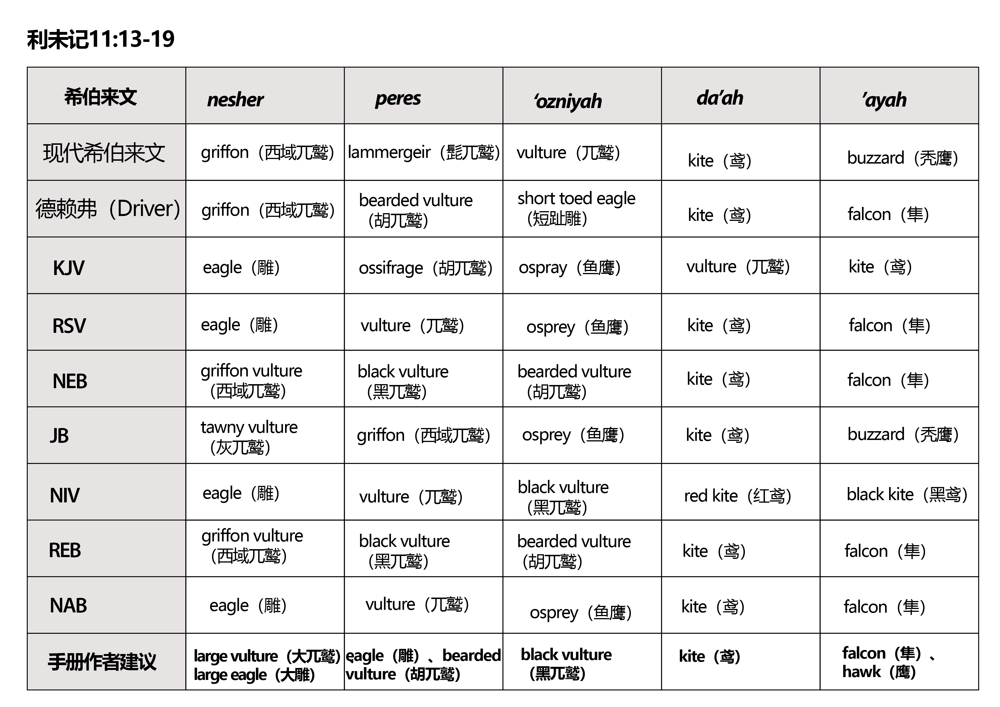
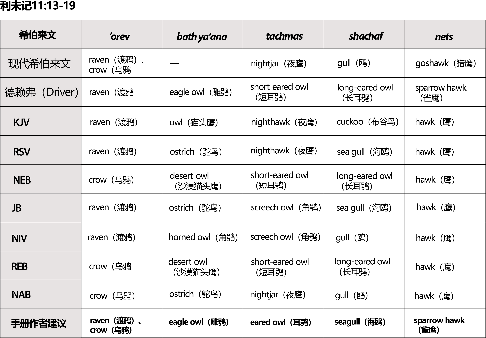
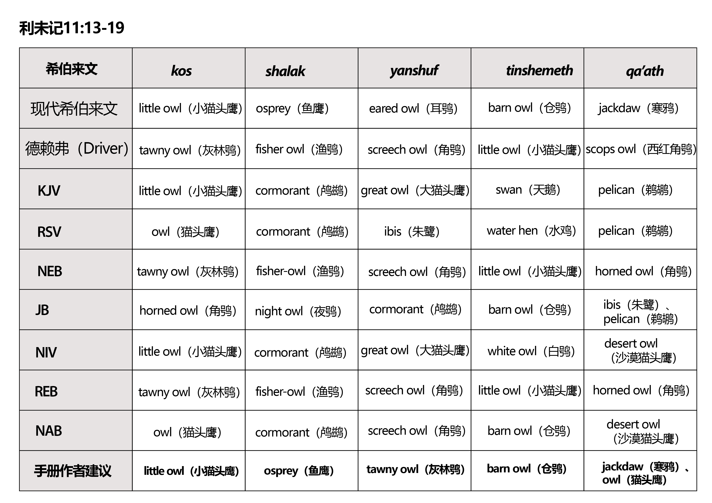
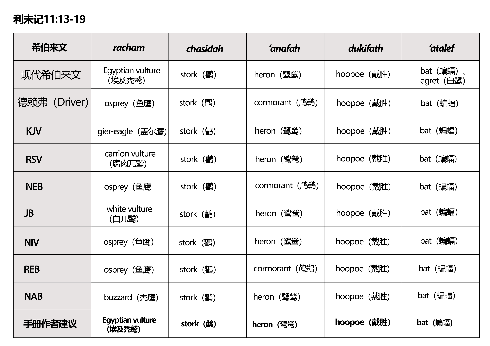
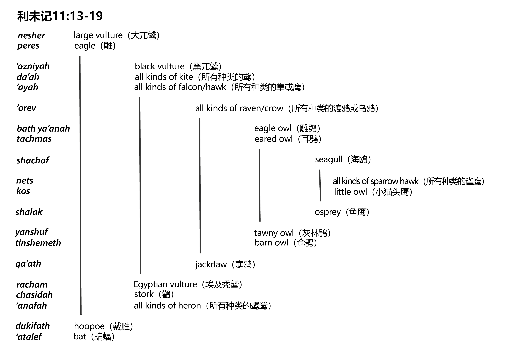
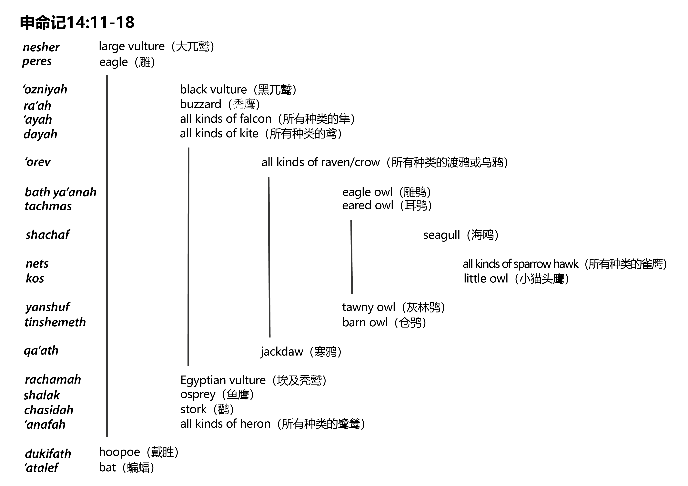
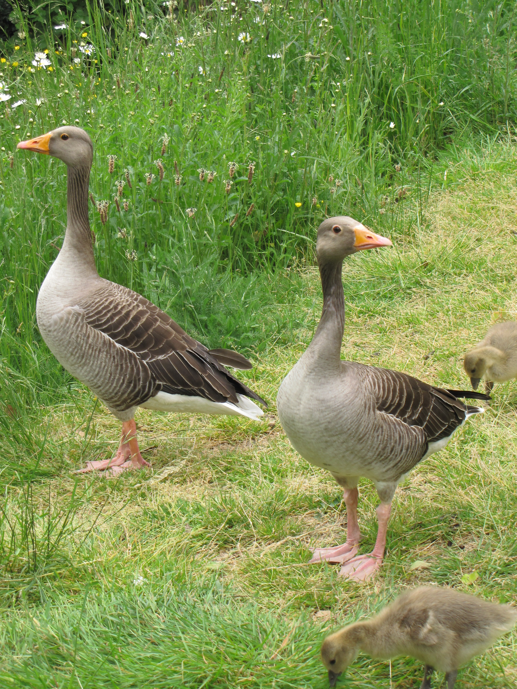
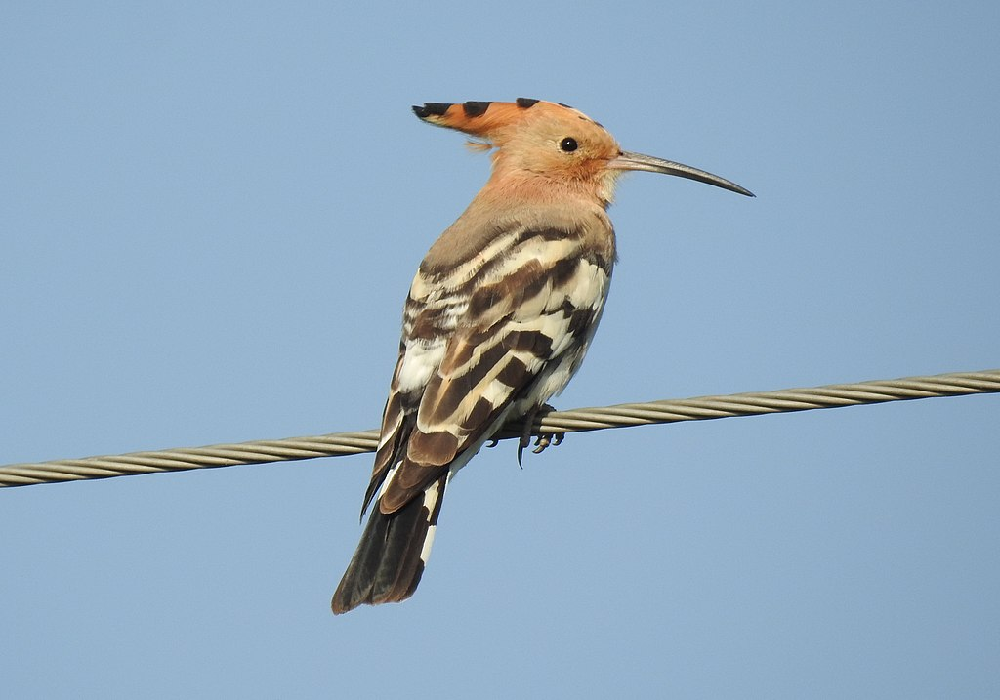
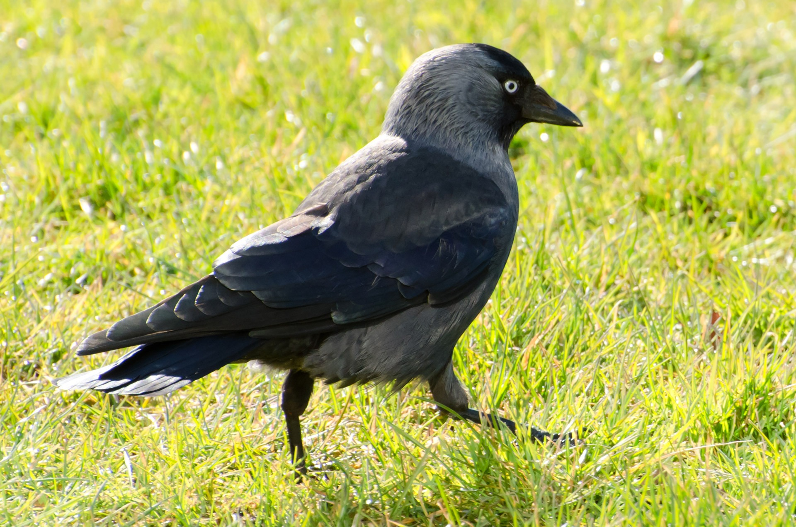
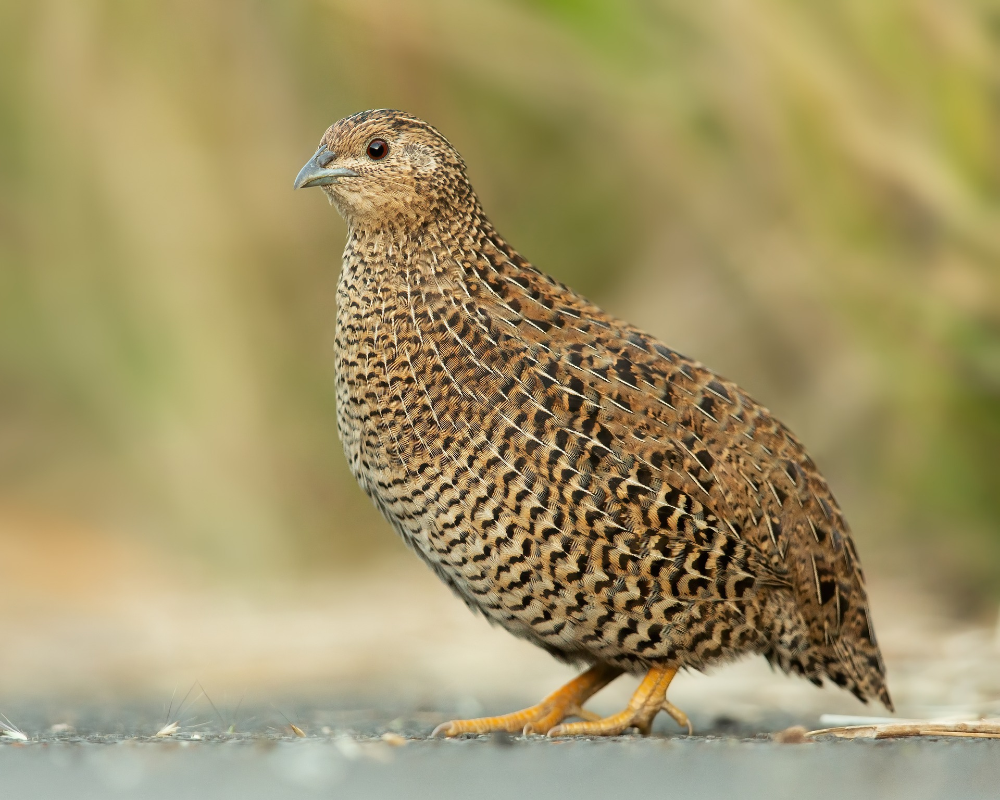

# Animals in the Bible

## License Information

Animals in the Bible © United Bible Societies, 2025. Adapted from: <cite>All Creatures Great and Small: Living Things in the Bible</cite>, by Edward R. Hope © 2005 United Bible Societies. This work is licensed under Creative Commons Attribution-ShareAlike 4.0 International (<a href="https://creativecommons.org/licenses/by-sa/4.0/">https://creativecommons.org/licenses/by-sa/4.0/</a>).

--------------------------------

## 标题：鸟 (id: FAUNA:3)

3 标题：鸟
======

* [3\.1 鸟类概述（birds, generic）](#FAUNA:3.1)
* [3\.2 礼仪上洁净的鸟和不洁净的鸟（birds, clean and unclean）](#FAUNA:3.2)
* [3\.3 鸡、公鸡、母鸡（chicken, rooster, hen）](#FAUNA:3.3)
* [3\.4 鸬鹚（cormorant）](#FAUNA:3.4)
* [3\.5 鹤（crane）](#FAUNA:3.5)
* [3\.6 乌鸦、渡鸦（crow, raven）](#FAUNA:3.6)
* [3\.7 斑鸠、鸽子（dove, pigeon）](#FAUNA:3.7)
* [3\.8 雕、兀鹫（eagle, vulture）](#FAUNA:3.8)
* [3\.9 鹅（goose）](#FAUNA:3.9)
* [3\.10 鹰、隼（hawk, falcon）](#FAUNA:3.10)
* [3\.11 鹭鸶（heron）](#FAUNA:3.11)
* [3\.12 戴胜、戴鵀（hoopoe）](#FAUNA:3.12)
* [3\.13 寒鸦（jackdaw）](#FAUNA:3.13)
* [3\.14 鸢（kite）](#FAUNA:3.14)
* [3\.15 鱼鹰（osprey）](#FAUNA:3.15)
* [3\.16 鸵鸟（ostrich）](#FAUNA:3.16)
* [3\.17 猫头鹰、鸮（owl）](#FAUNA:3.17)
* [3\.18 鹧鸪（partridge）](#FAUNA:3.18)
* [3\.19 鹌鹑（quail）](#FAUNA:3.19)
* [3\.20 海鸥（seagull）](#FAUNA:3.20)
* [3\.21 麻雀、雀鸟（sparrow）](#FAUNA:3.21)
* [3\.22 鹳（stork）](#FAUNA:3.22)
* [3\.23 燕子、雨燕（swallow, swift）](#FAUNA:3.23)

## 标题：鸟类概述（birds, generic） (id: FAUNA:3.1)

3\.1 标题：鸟类概述（birds, generic）
============================

经文出处
----

Hebrew 来：בַּעַל כָּנָף (音译：ba‘al kanaf)

[PRO 1:17](https://ref.ly/Prov1:17), [ECC 10:20](https://ref.ly/Eccl10:20)

Hebrew 来：עוֹף (音译：‘of)

[GEN 1:20](https://ref.ly/Gen1:20), [GEN 1:21](https://ref.ly/Gen1:21), [GEN 1:22](https://ref.ly/Gen1:22), [GEN 1:26](https://ref.ly/Gen1:26), [GEN 1:28](https://ref.ly/Gen1:28), [GEN 1:30](https://ref.ly/Gen1:30), [GEN 2:19](https://ref.ly/Gen2:19), [GEN 2:20](https://ref.ly/Gen2:20), [GEN 6:7](https://ref.ly/Gen6:7), [GEN 6:20](https://ref.ly/Gen6:20), [GEN 7:3](https://ref.ly/Gen7:3), [GEN 7:8](https://ref.ly/Gen7:8), [GEN 7:14](https://ref.ly/Gen7:14), [GEN 7:21](https://ref.ly/Gen7:21), [GEN 7:23](https://ref.ly/Gen7:23), [GEN 8:17](https://ref.ly/Gen8:17), [GEN 8:19](https://ref.ly/Gen8:19), [GEN 8:20](https://ref.ly/Gen8:20), [GEN 9:2](https://ref.ly/Gen9:2), [GEN 9:10](https://ref.ly/Gen9:10), [GEN 40:17](https://ref.ly/Gen40:17), [GEN 40:19](https://ref.ly/Gen40:19), [LEV 1:14](https://ref.ly/Lev1:14), [LEV 7:26](https://ref.ly/Lev7:26), [LEV 11:13](https://ref.ly/Lev11:13), [LEV 11:20](https://ref.ly/Lev11:20), [LEV 11:21](https://ref.ly/Lev11:21), [LEV 11:23](https://ref.ly/Lev11:23), [LEV 11:46](https://ref.ly/Lev11:46), [LEV 17:13](https://ref.ly/Lev17:13), [LEV 20:25](https://ref.ly/Lev20:25), [LEV 20:25](https://ref.ly/Lev20:25), [DEU 14:19](https://ref.ly/Deut14:19), [DEU 14:20](https://ref.ly/Deut14:20), [DEU 28:26](https://ref.ly/Deut28:26), [1SA 17:44](https://ref.ly/1Sam17:44), [1SA 17:46](https://ref.ly/1Sam17:46), [2SA 21:10](https://ref.ly/2Sam21:10), [1KI 5:13](https://ref.ly/1Kgs5:13), [1KI 14:11](https://ref.ly/1Kgs14:11), [1KI 16:4](https://ref.ly/1Kgs16:4), [1KI 21:24](https://ref.ly/1Kgs21:24), [JOB 12:7](https://ref.ly/Job12:7), [JOB 28:21](https://ref.ly/Job28:21), [JOB 35:11](https://ref.ly/Job35:11), [PSA 50:11](https://ref.ly/Ps50:11), [PSA 78:27](https://ref.ly/Ps78:27), [PSA 79:2](https://ref.ly/Ps79:2), [PSA 104:12](https://ref.ly/Ps104:12), [ECC 10:20](https://ref.ly/Eccl10:20), [ISA 16:2](https://ref.ly/Isa16:2), [JER 4:25](https://ref.ly/Jer4:25), [JER 5:27](https://ref.ly/Jer5:27), [JER 7:33](https://ref.ly/Jer7:33), [JER 9:9](https://ref.ly/Jer9:9), [JER 12:4](https://ref.ly/Jer12:4), [JER 15:3](https://ref.ly/Jer15:3), [JER 16:4](https://ref.ly/Jer16:4), [JER 19:7](https://ref.ly/Jer19:7), [JER 34:20](https://ref.ly/Jer34:20), [EZK 29:5](https://ref.ly/Ezek29:5), [EZK 31:6](https://ref.ly/Ezek31:6), [EZK 31:13](https://ref.ly/Ezek31:13), [EZK 32:4](https://ref.ly/Ezek32:4), [EZK 38:20](https://ref.ly/Ezek38:20), [EZK 44:31](https://ref.ly/Ezek44:31), [HOS 2:20](https://ref.ly/Hos2:20), [HOS 4:3](https://ref.ly/Hos4:3), [HOS 7:12](https://ref.ly/Hos7:12), [HOS 9:11](https://ref.ly/Hos9:11), [ZEP 1:3](https://ref.ly/Zeph1:3)

Hebrew 来：עַיִט (音译：‘ayit)

[GEN 15:11](https://ref.ly/Gen15:11), [JOB 28:7](https://ref.ly/Job28:7), [ISA 18:6](https://ref.ly/Isa18:6), [ISA 18:6](https://ref.ly/Isa18:6), [ISA 46:11](https://ref.ly/Isa46:11), [JER 12:9](https://ref.ly/Jer12:9), [JER 12:9](https://ref.ly/Jer12:9), [EZK 39:4](https://ref.ly/Ezek39:4)

Hebrew 来：צִפּוֹר, צִפַּר (音译：tsippor, tsippar)

[GEN 7:14](https://ref.ly/Gen7:14), [GEN 15:10](https://ref.ly/Gen15:10), [LEV 14:4](https://ref.ly/Lev14:4), [LEV 14:5](https://ref.ly/Lev14:5), [LEV 14:6](https://ref.ly/Lev14:6), [LEV 14:6](https://ref.ly/Lev14:6), [LEV 14:6](https://ref.ly/Lev14:6), [LEV 14:7](https://ref.ly/Lev14:7), [LEV 14:49](https://ref.ly/Lev14:49), [LEV 14:50](https://ref.ly/Lev14:50), [LEV 14:51](https://ref.ly/Lev14:51), [LEV 14:51](https://ref.ly/Lev14:51), [LEV 14:52](https://ref.ly/Lev14:52), [LEV 14:52](https://ref.ly/Lev14:52), [LEV 14:53](https://ref.ly/Lev14:53), [DEU 4:17](https://ref.ly/Deut4:17), [DEU 14:11](https://ref.ly/Deut14:11), [DEU 22:6](https://ref.ly/Deut22:6), [NEH 5:18](https://ref.ly/Neh5:18), [JOB 40:29](https://ref.ly/Job40:29), [PSA 8:9](https://ref.ly/Ps8:9), [PSA 11:1](https://ref.ly/Ps11:1), [PSA 102:8](https://ref.ly/Ps102:8), [PSA 104:17](https://ref.ly/Ps104:17), [PSA 124:7](https://ref.ly/Ps124:7), [PSA 148:10](https://ref.ly/Ps148:10), [PRO 6:5](https://ref.ly/Prov6:5), [PRO 7:23](https://ref.ly/Prov7:23), [PRO 27:8](https://ref.ly/Prov27:8), [ECC 9:12](https://ref.ly/Eccl9:12), [ISA 31:5](https://ref.ly/Isa31:5), [LAM 3:52](https://ref.ly/Lam3:52), [EZK 17:23](https://ref.ly/Ezek17:23), [EZK 39:4](https://ref.ly/Ezek39:4), [EZK 39:17](https://ref.ly/Ezek39:17), [DAN 4:9](https://ref.ly/Dan4:9), [DAN 4:11](https://ref.ly/Dan4:11), [DAN 4:18](https://ref.ly/Dan4:18), [DAN 4:30](https://ref.ly/Dan4:30), [HOS 11:11](https://ref.ly/Hos11:11), [AMO 3:5](https://ref.ly/Amos3:5)

Greek 希：ὄρνεον (音译：orneon)

[REV 18:2](https://ref.ly/Jude18:2), [REV 19:17](https://ref.ly/Jude19:17), [REV 19:21](https://ref.ly/Jude19:21), [WIS 5:11](https://ref.ly/EsthGr5:11), [WIS 17:18](https://ref.ly/EsthGr17:18), [WIS 19:11](https://ref.ly/EsthGr19:11), [BAR 3:17](https://ref.ly/Sir3:17), [LJE 1:22](https://ref.ly/Bar1:22), [LJE 1:71](https://ref.ly/Bar1:71), [2MA 15:33](https://ref.ly/1Macc15:33)

Greek 希：πετεινός (音译：peteinon)

[MAT 6:26](https://ref.ly/Matt6:26), [MAT 8:20](https://ref.ly/Matt8:20), [MAT 13:4](https://ref.ly/Matt13:4), [MAT 13:32](https://ref.ly/Matt13:32), [MRK 4:4](https://ref.ly/Matt4:4), [MRK 4:32](https://ref.ly/Matt4:32), [LUK 8:5](https://ref.ly/Mark8:5), [LUK 9:58](https://ref.ly/Mark9:58), [LUK 12:24](https://ref.ly/Mark12:24), [LUK 13:19](https://ref.ly/Mark13:19), [ACT 10:12](https://ref.ly/John10:12), [ACT 11:6](https://ref.ly/John11:6), [ROM 1:23](https://ref.ly/Acts1:23), [JAS 3:7](https://ref.ly/Heb3:7), [JDT 11:7](https://ref.ly/Tob11:7), [ESG 16:24](https://ref.ly/Jdt16:24), [SIR 11:3](https://ref.ly/Wis11:3), [SIR 17:4](https://ref.ly/Wis17:4), [SIR 22:20](https://ref.ly/Wis22:20), [SIR 27:9](https://ref.ly/Wis27:9), [SIR 27:19](https://ref.ly/Wis27:19), [SIR 43:14](https://ref.ly/Wis43:14), [SIR 43:17](https://ref.ly/Wis43:17), [S3Y 1:58](https://ref.ly/EpJer1:58)

Greek 希：πτηνόν (音译：ptēnon)

[1CO 15:39](https://ref.ly/Rom15:39)

Greek 希：οἰωνόβρωτος (音译：oiōnobrōtos)

[2MA 9:15](https://ref.ly/1Macc9:15), [3MA 6:34](https://ref.ly/2Macc6:34)

Latin 拉：volatilis

[2ES 5:6](https://ref.ly/1Esd5:6), [2ES 5:26](https://ref.ly/1Esd5:26), [2ES 6:47](https://ref.ly/1Esd6:47)

讨论
--

希伯来文*tsippor* 一词通常是指麻雀大小的小型鸟类，而*‘ayit* 在指鸟类而非动物时，泛指鸷鸟或大型食肉鸟类。在新约中，希腊文**orneon** 一词指的是鸷鸟，但在次经书卷中，这个词泛指鸟类。在《次经•马加比传》（《思》《玛加伯传》），表示鸷鸟的词是*oiōnobrōtos* 。上述清单中的其他希伯来文和希腊文词语都泛指鸟类，如果鸟的大小或种类很重要，则通过具体的上下文来指明具体种类。拉丁文*volatilis* 也是所有鸟类的统称。

特殊意义或象征意义
---------

在圣经中，鸟类经常（但并非总是）用作不洁净或灾难的象征，特别是鸷鸟。这似乎与下述事实有关：在战争中，没有掩埋的尸体经常成为兀鹫、雕和乌鸦的食物。

翻译
--

在有些语言中，指称鸷鸟的词可能与指称可食用鸟类的词截然不同，可食用鸟类包括鹧鸪、野鸡、鸡、原鸡、鸭、鹅等；另外，指称这些可食用鸟类的词，与指称那些通常不食用的小鸟所用的词可能也不一样。如果目标语言存在这种区分，翻译者需要特别注意每个上下文，确保使用最合适的译词。

* **Associated Passages:** 箴言 1:17; 传道书 10:20; 创世记 1:20; 创世记 1:21; 创世记 1:22; 创世记 1:26; 创世记 1:28; 创世记 1:30; 创世记 2:19; 创世记 2:20; 创世记 6:7; 创世记 6:20; 创世记 7:3; 创世记 7:8; 创世记 7:14; 创世记 7:21; 创世记 7:23; 创世记 8:17; 创世记 8:19; 创世记 8:20; 创世记 9:2; 创世记 9:10; 创世记 40:17; 创世记 40:19; 利未记 1:14; 利未记 7:26; 利未记 11:13; 利未记 11:20; 利未记 11:21; 利未记 11:23; 利未记 11:46; 利未记 17:13; 利未记 20:25; 申命记 14:19; 申命记 14:20; 申命记 28:26; 撒母耳记上 17:44; 撒母耳记上 17:46; 撒母耳记下 21:10; 列王纪上 5:13; 列王纪上 14:11; 列王纪上 16:4; 列王纪上 21:24; 约伯记 12:7; 约伯记 28:21; 约伯记 35:11; 诗篇 50:11; 诗篇 78:27; 诗篇 79:2; 诗篇 104:12; 以赛亚书 16:2; 耶利米书 4:25; 耶利米书 5:27; 耶利米书 7:33; 耶利米书 9:9; 耶利米书 12:4; 耶利米书 15:3; 耶利米书 16:4; 耶利米书 19:7; 耶利米书 34:20; 以西结书 29:5; 以西结书 31:6; 以西结书 31:13; 以西结书 32:4; 以西结书 38:20; 以西结书 44:31; 何西阿书 2:20; 何西阿书 4:3; 何西阿书 7:12; 何西阿书 9:11; 西番雅书 1:3; 创世记 15:11; 约伯记 28:7; 以赛亚书 18:6; 以赛亚书 46:11; 耶利米书 12:9; 以西结书 39:4; 创世记 15:10; 利未记 14:4; 利未记 14:5; 利未记 14:6; 利未记 14:7; 利未记 14:49; 利未记 14:50; 利未记 14:51; 利未记 14:52; 利未记 14:53; 申命记 4:17; 申命记 14:11; 申命记 22:6; 尼希米记 5:18; 约伯记 40:29; 诗篇 8:9; 诗篇 11:1; 诗篇 102:8; 诗篇 104:17; 诗篇 124:7; 诗篇 148:10; 箴言 6:5; 箴言 7:23; 箴言 27:8; 传道书 9:12; 以赛亚书 31:5; 耶利米哀歌 3:52; 以西结书 17:23; 以西结书 39:17; 但以理书 4:9; 但以理书 4:11; 但以理书 4:18; 但以理书 4:30; 何西阿书 11:11; 阿摩司书 3:5; 启示录 18:2; 启示录 19:17; 启示录 19:21; 智慧篇 5:11; 智慧篇 17:18; 智慧篇 19:11; 巴路克 3:17; 耶利米书信 1:22; 耶利米书信 1:71; 玛加伯下 15:33; 马太福音 6:26; 马太福音 8:20; 马太福音 13:4; 马太福音 13:32; 马可福音 4:4; 马可福音 4:32; 路加福音 8:5; 路加福音 9:58; 路加福音 12:24; 路加福音 13:19; 使徒行传 10:12; 使徒行传 11:6; 罗马书 1:23; 雅各书 3:7; 友弟德传 11:7; 以斯帖记补篇 16:24; 德训篇 11:3; 德训篇 17:4; 德训篇 22:20; 德训篇 27:9; 德训篇 27:19; 德训篇 43:14; 德训篇 43:17; 三童歌 1:58; 哥林多前书 15:39; 玛加伯下 9:15; 玛加伯三书 6:34; 厄斯德拉下 5:6; 厄斯德拉下 5:26; 厄斯德拉下 6:47

## 标题：礼仪上洁净的鸟和不洁净的鸟（birds, clean and unclean） (id: FAUNA:3.2)

3\.2 标题：礼仪上洁净的鸟和不洁净的鸟（birds, clean and unclean）
===============================================

区分走兽和鸟类在礼仪上洁净与否的基本原则是：如果它们吃不洁净的食物，就为不洁净。如果对它们吃什么东西存有疑问，也为不洁净。因此，如果某种鸟吃血或吃带血的肉、垃圾、不洁净的水中生物或不洁净的昆虫，这种鸟就是不洁净的。此外，任何与埃及或迦南神明相关联的鸟类，或者形态习性似乎有些"不自然的"鸟也是不洁净的。

因此，在礼仪上不洁净的鸟类清单中，我们看到有雕、兀鹫，以及所有其他食肉大鸟，如鵟鹰、隼和鹰，以及乌鸦、鸢、海鸥、猫头鹰、鹳、鹭鸶和翠鸟等食腐鸟类，尤其是那些以青蛙、蜥蜴和蛇为食的鸷鸟更在此列。由于朱鹭与埃及神明相关联，并以蠕虫和蝌蚪为食，因此也应属于不洁浄的鸟类。猫头鹰也与一个埃及神明相关联，所以猫头鹰是在双重意义上不洁净。此外，我们知道古代以色列人虽然把蝙蝠归为鸟类，但他们认为蝙蝠是鸟类和老鼠的不自然的后代，所以蝙蝠也应该是不洁净的。

然而，那些吃种子或植物的鸟类不会被视为不洁净，除非它们与异教神明有关联。

遗憾的是，在圣经所列清单中，有许多希伯来文词语的含义颇具争议。除了几个词之外，其他的词我们只是讨论"可能的"意思，而不是讨论其确定的含义。下面的表格比较了不同译本中的用词清单，其中省略了TEV (Today's English Version (Good News Bible)) ，该译本用15个英文单词总结了20个希伯来文单词。每个表格中的第一行是用现代希伯来文表示的词语含义。最后一行（ERH）是本手册作者的建议，这些建议的依据是各个英文译本的对比、鸟类目录、注释书，以及其他讨论鸟类名称语源的文献。在讨论具体鸟类的相关章节中，作者详细说明了每种建议译法的合理之处。

在辨识这些鸟类时，一个重要的指导因素是清单的结构编排。这些清单显然是要人记忆的，并且很可能是按着方便人记忆的方式来编排的。德赖弗（G. R. Driver）在研究这些清单时，就使用了类似的方法，按照体型由大到小排序，这样在每一种类别中，先提到体型较大的鸟，然后是体型比较小的鸟。他认为，清单是由十五种陆鸟、三种水鸟和两种杂鸟这三个部分组成。因此在清单的每一个部分，当面临选择时，德赖弗会选择比前面的种类更小的鸟。然而，这种方法所得到的结果有时颇有争议，特别是因为这些结果假定当时的以色列人已经熟知不同猫头鹰之间的微小差异。

从以色列地区的鸟类学角度来看，本手册建议的清单（如下文所示）同样很有道理。这份清单清楚呈现出一个整齐的结构，即希伯来文献中常见的"首尾呼应结构"。

名称翻译表格后面提供了几个图表，说明了这种首尾呼应结构，并进行了讨论。

**利未记11:13–19**
---------------

---

**利未记11:13–19**

| 希伯来文 | *nesher* | *peres* | *‘ozniyah* | *da’ah* | *’ayah* |
| --- | --- | --- | --- | --- | --- |
| 现代希伯来文 | griffon（西域兀鹫） | lammergeir（髭兀鹫） | vulture（兀鹫） | kite（鸢） | buzzard（秃鹰） |
| 德赖弗（Driver） | griffon（西域兀鹫） | bearded vulture（胡兀鹫） | short toed eagle（短趾雕） | kite（鸢） | falcon（隼） |
| KJV (King James Version (1611)) | eagle（雕） | ossifrage（胡兀鹫） | ospray（鱼鹰） | vulture（兀鹫） | kite（鸢） |
| RSV (Revised Standard Version (1952)) | eagle（雕） | vulture（兀鹫） | osprey（鱼鹰） | kite（鸢） | falcon（隼） |
| NEB (New English Bible (1970)) | griffon vulture（西域兀鹫） | black vulture（黑兀鹫） | bearded vulture（胡兀鹫） | kite（鸢） | falcon（隼） |
| JB (Jerusalem Bible (1966)) | tawny vulture（灰兀鹫） | griffon（西域兀鹫） | osprey（鱼鹰） | kite（鸢） | buzzard（秃鹰） |
| NIV (New International Version (1984)) | eagle（雕） | vulture（兀鹫） | black vulture（黑兀鹫） | red kite（红鸢） | black kite（黑鸢） |
| REB (Revised English Bible (1989)) | griffon vulture（西域兀鹫） | black vulture（黑兀鹫） | bearded vulture（胡兀鹫） | kite（鸢） | falcon（隼） |
| NAB (New American Bible (1970)) | eagle（雕） | vulture（兀鹫） | osprey（鱼鹰） | kite（鸢） | falcon（隼） |
| 手册作者建议 | **large vulture（大兀鹫）、large eagle（大雕）** | **eagle（雕）、bearded vulture（胡兀鹫）** | **black vulture（黑兀鹫）** | **kite（鸢）** | **falcon（隼）、hawk（鹰）** |

---

| 希伯来文 | *‘orev* | *bath ya‘anah* | *tachmas* | *shachaf* | *nets* |
| --- | --- | --- | --- | --- | --- |
| 现代希伯来文 | raven（渡鸦）、crow（乌鸦） | —— | nightjar（夜鹰） | gull（鸥） | goshawk（猎鹰） |
| 德赖弗（Driver） | raven（渡鸦） | eagle owl（雕鸮） | short\-eared owl（短耳鸮） | long\-eared owl（长耳鸮） | sparrow hawk（雀鹰） |
| KJV (King James Version (1611)) | raven（渡鸦） | owl（猫头鹰） | nighthawk（夜鹰） | cuckoo（布谷鸟） | hawk（鹰） |
| RSV (Revised Standard Version (1952)) | raven（渡鸦） | ostrich（鸵鸟） | nighthawk（夜鹰） | sea gull（海鸥） | hawk（鹰） |
| NEB (New English Bible (1970)) | crow（乌鸦） | desert\-owl（沙漠猫头鹰） | short\-eared owl（短耳鸮） | long\-eared owl（长耳鸮） | hawk（鹰） |
| JB (Jerusalem Bible (1966)) | raven（渡鸦） | ostrich（鸵鸟） | screech owl（角鸮） | sea gull（海鸥） | hawk（鹰） |
| NIV (New International Version (1984)) | raven（渡鸦） | horned owl（角鸮） | screech owl（角鸮） | gull（鸥） | hawk（鹰） |
| REB (Revised English Bible (1989)) | crow（乌鸦） | desert\-owl（沙漠猫头鹰） | short\-eared owl（短耳鸮） | long\-eared owl（长耳鸮） | hawk（鹰） |
| NAB (New American Bible (1970)) | crow（乌鸦） | ostrich（鸵鸟） | nightjar（夜鹰） | gull（鸥） | hawk（鹰） |
| 手册作者建议 | **raven（渡鸦）、crow（乌鸦）** | **eagle owl（雕鸮）** | **eared owl（耳鸮）** | **seagull（海鸥）** | **sparrow hawk（雀鹰）** |

---

| 希伯来文 | *kos* | *shalak* | *yanshuf* | *tinshemeth* | *qa’ath* |
| --- | --- | --- | --- | --- | --- |
| 现代希伯来文 | little owl（小猫头鹰） | osprey（鱼鹰） | eared owl（耳鸮） | barn owl（仓鸮） | jackdaw（寒鸦） |
| 德赖弗（Driver） | tawny owl（灰林鸮） | fisher owl（渔鸮） | screech owl（角鸮） | little owl（小猫头鹰） | scops owl（西红角鸮） |
| KJV (King James Version (1611)) | little owl（小猫头鹰） | cormorant（鸬鹚） | great owl（大猫头鹰） | swan（天鹅） | pelican（鹈鹕） |
| RSV (Revised Standard Version (1952)) | owl（猫头鹰） | cormorant（鸬鹚） | ibis（朱鹭） | water hen（水鸡） | pelican（鹈鹕） |
| NEB (New English Bible (1970)) | tawny owl（灰林鸮） | fisher\-owl（渔鸮） | screech owl（角鸮） | little owl（小猫头鹰） | horned owl（角鸮） |
| JB (Jerusalem Bible (1966)) | horned owl（角鸮） | night owl（夜鸮） | cormorant（鸬鹚） | barn owl（仓鸮） | ibis（朱鹭）、pelican（鹈鹕） |
| NIV (New International Version (1984)) | little owl（小猫头鹰） | cormorant（鸬鹚） | great owl（大猫头鹰） | white owl（白鸮）\-\- desert owl（沙漠猫头鹰） |
| REB (Revised English Bible (1989)) | tawny owl（灰林鸮） | fisher\-owl（渔鸮） | screech owl（角鸮） | little owl（小猫头鹰） | horned owl（角鸮） |
| NAB (New American Bible (1970)) | owl（猫头鹰） | cormorant（鸬鹚） | screech owl（角鸮） | barn owl（仓鸮） | desert owl（沙漠猫头鹰） |
| 手册作者建议 | **little owl（小猫头鹰）** | **osprey（鱼鹰）** | **tawny owl（灰林鸮）** | **barn owl（仓鸮）** | **jackdaw（寒鸦）、owl（猫头鹰）** |

---

| 希伯来文 | *racham* | *chasidah* | *’anafah* | *dukifath* | *‘atalef* |
| --- | --- | --- | --- | --- | --- |
| 现代希伯来文 | Egyptian vulture（埃及秃鹫） | stork（鹳） | heron（鹭鸶） | hoopoe（戴胜） | bat（蝙蝠）、egret（白鹭） |
| 德赖弗（Driver） | osprey（鱼鹰） | stork（鹳） | cormorant（鸬鹚） | hoopoe（戴胜） | bat（蝙蝠） |
| KJV (King James Version (1611)) | gier\-eagle（盖尔鹰） | stork（鹳） | heron（鹭鸶） | lapwing（麦鸡） | bat（蝙蝠） |
| RSV (Revised Standard Version (1952)) | carrion vulture（腐肉兀鹫） | stork（鹳） | heron（鹭鸶） | hoopoe（戴胜） | bat（蝙蝠） |
| NEB (New English Bible (1970)) | osprey（鱼鹰） | stork（鹳） | cormorant（鸬鹚） | hoopoe（戴胜） | bat（蝙蝠） |
| JB (Jerusalem Bible (1966)) | white vulture（白兀鹫） | stork（鹳） | heron（鹭鸶） | hoopoe（戴胜） | bat（蝙蝠） |
| NIV (New International Version (1984)) | osprey（鱼鹰） | stork（鹳） | heron（鹭鸶） | hoopoe（戴胜） | bat（蝙蝠） |
| REB (Revised English Bible (1989)) | osprey（鱼鹰） | stork（鹳） | cormorant（鸬鹚） | hoopoe（戴胜） | bat（蝙蝠） |
| NAB (New American Bible (1970)) | buzzard（鹰） | stork（鹳） | heron（鹭鸶） | hoopoe（戴胜） | bat（蝙蝠） |
| 手册作者建议 | **Egyptian vulture（埃及秃鹫）** | **stork（鹳）** | **heron（鹭鸶）** | **hoopoe（戴胜）** | **bat（蝙蝠）** |

---

如上所述，我们建议的清单具有希伯来文献中常见的"首尾呼应结构"，可能就是为了帮助人记忆。在首尾呼应结构中，作者依次引入一些要素直至中间点，然后按照相反的顺序提出一些类似的要素。中间点两侧的对应项目之间具有某种相似性。以下图表显示了这种结构：

清单中的每个名称可能是指某种特定的鸟，作为一组相似鸟类的代表。清单以两种最大的猛禽兀鹫和雕开始。然后是由三种猛禽组成的一组，每种猛禽都比清单上的前一种鸟要小，即更小的胡兀鹫、鸢，以及所有种类的隼或鹰。然后是各种渡鸦或乌鸦自成一组，标志着清单从猛禽过渡到了猫头鹰。

下一组包含两种猫头鹰，首先是最大的雕鸮，其次是略小的耳鸮。然后是海鸥自成一组，标志着清单过渡到了中间点。

中间点是由两种鸟构成的一组，即各种（雀）鹰和小猫头鹰。这两种鸟代表了最小的猛禽和最小的猫头鹰。

然后是鱼鹰自成一组，在清单首尾呼应结构中与海鸥配对，标志着过渡回到另外一组的猫头鹰，即灰林鸮和仓鸮。这一组对应前一组的两种猫头鹰。然而，这一次首先提到的是体型较小的猫头鹰种类，对于中间点的这一侧，这样安排是合理的。

然后是寒鸦（或鹈鹕或其他猫头鹰）自成一组，对应同样自成一组的乌鸦。如果认为现代希伯来文*qa’ak* （寒鸦）相当于圣经中的*qa’at* （因为这个名称模仿这种鸟发出的声音，这是一个有力的论据），而不是"鹈鹕"或"猫头鹰"，那么*qa’ak* 与"乌鸦"的对应就更加明显。这种配对也见于[ISA 34:11](https://ref.ly/Isa34:11) 和[ZEP 2:14](https://ref.ly/Zeph2:14) 。"寒鸦"标志着向水鸟类的过渡，正如乌鸦也标志着一个过渡。

水鸟这一组由三种鸟组成，对应上面提到的三种猛禽。同样，首先提到的是体型最小的水鸟。埃及秃鹫虽然是一种猛禽，但也会在海滩上吃腐肉，也吃许多水鸟产的蛋。它的喙和许多大型海鸟的喙一样，如信天翁、鹱、贼鸥和鲣鸟。它站立时的姿势也非常像海鸥，远看就像是一只大海鸥。这个名称可能代表所有黑白相间的水鸟，因为*racham* 似乎源于一个意为"黑白相间"的希伯来文词根。

鹭鸶的类群可能代表所有长着大喙的大型水鸟，包括朱鹭和鸬鹚，因为*’anafah* 这个词似乎源于一个意为"鼻子"的希伯来文词根。

最后一组是由戴胜（或"戴鵀"）和蝙蝠混杂而成，这里蝙蝠被归为鸟类。

有些译本的清单中包含了鸵鸟，但鸵鸟被列在清单中是极不可能的，因为鸵鸟素食，被归类为礼仪上洁净的鸟。鸵鸟从巴勒斯坦消失的直接原因是被人大量捕食。

[DEU 14:11–DEU 14:18](https://ref.ly/Deut14:11-Deut14:18) ：在《希伯来圣经》中，这个清单基本上与《利未记》中的清单相同，除了增加一个名为*ra’ah* 的鸟，以及两个词的拼法略有不同（*da’ah* 变为*dayah* ，*racham* 变为*rachamah* ）。在NEB (New English Bible (1970)) 、JB (Jerusalem Bible (1966)) 、NAB (New American Bible (1970)) 和REB (Revised English Bible (1989)) 中，这个添加被视为抄写错误，因为希伯来文*ra’ah* 和*da’ah* 看起来非常相似，很容易混淆。KJV (King James Version (1611)) 将*ra’ah* 译为"glede"（"鸢"），RSV (Revised Standard Version (1952)) 译为"buzzard"（"鵟鹰"），NIV (New International Version (1984)) 译为"falcon"（"隼"）。

在希伯来文本中，《申命记》中的清单编排与《利未记》中的清单不同；差异似乎是由那个额外添加的鸟名引起的。在《申命记》中，这种鸟位列第一组中型猛禽，使得该组的鸟类数量从三种增加到四种。这组的四种鸟对应四种水鸟。鱼鹰（*shalak* ）这个词位列水鸟这一组。然而，这里的清单并不像《利未记》中的清单那样呈对称结构，因为没有了对应海鸥的词语。最后，鸢和隼的顺序互换了，如下面的图表所示：

如果我们接受多数人的意见，认为*ra’ah* 是一个抄写错误，因此将其从清单中删去，那么似乎最好也把清单变回《利未记》所示最初的结构，一些主要的译本就是这样做的。如果保留*ra’ah* ，那么只能从这个词在清单中的位置来猜测其含义；"鵟鹰"似乎是一个合理的猜想。

翻译
--

在世界上的一些地区，清单中的大多数鸟类都有对应的当地鸟类，像在非洲的许多地方一样，建议翻译者尽量找到与清单中的每种鸟相对应的鸟类。在其他地区，最好找到包含清单中所有鸟类的概括性表达，如TEV (Today's English Version (Good News Bible)) 的做法。因此，如果对应的鸟类不足，可以采用如下所示的概括性清单：

"各个种类、不同大小的兀鹫、雕、鹰、鸢和乌鸦；各个种类、不同大小的猫头鹰；各个种类、不同大小的鹭鸶；所有其他吃不洁净东西的鸟；以及所有蝙蝠。"

* **Associated Passages:** 以赛亚书 34:11; 西番雅书 2:14; 申命记 14:11; 申命记 14:18

## 标题：鸡、公鸡、母鸡（chicken, rooster, hen） (id: FAUNA:3.3)

3\.3 标题：鸡、公鸡、母鸡（chicken, rooster, hen）
======================================

经文出处
----

Hebrew 来：זַרְזִיר (音译：zarzir)

[PRO 30:31](https://ref.ly/Prov30:31)

Hebrew 来：שֶׂכְוִי (音译：sekwi)

[JOB 38:36](https://ref.ly/Job38:36)

Greek 希：ἀλεκτρυών (音译：alektruōn)

[3MA 5:23](https://ref.ly/2Macc5:23)

Greek 希：ἀλέκτωρ (音译：alektōr)

[MAT 26:34](https://ref.ly/Matt26:34), [MAT 26:74](https://ref.ly/Matt26:74), [MAT 26:75](https://ref.ly/Matt26:75), [MRK 14:30](https://ref.ly/Matt14:30), [MRK 14:68](https://ref.ly/Matt14:68), [MRK 14:72](https://ref.ly/Matt14:72), [MRK 14:72](https://ref.ly/Matt14:72), [LUK 22:34](https://ref.ly/Mark22:34), [LUK 22:60](https://ref.ly/Mark22:60), [LUK 22:61](https://ref.ly/Mark22:61), [JHN 13:38](https://ref.ly/Luke13:38), [JHN 18:27](https://ref.ly/Luke18:27)

Greek 希：νοσσίον, νοσσιά (音译：nossion, nossia)

[MAT 23:37](https://ref.ly/Matt23:37), [LUK 13:34](https://ref.ly/Mark13:34)

Greek 希：ὄρνις (音译：ornis)

[MAT 23:37](https://ref.ly/Matt23:37), [LUK 13:34](https://ref.ly/Mark13:34)

Latin 拉：gallina

[2ES 1:30](https://ref.ly/1Esd1:30)

讨论
--

希伯来文*sekwi* 一词的含义存在相当大的疑问。然而，《武加大译本》、《他尔根译本》的一个版本和大多数注释书都支持"公鸡"这种译法。[JOB 38:36](https://ref.ly/Job38:36) 的上下文似乎是指，朱鹭能够宣告尼罗河水泛滥，而公鸡能够宣告黎明到来（比较JB (Jerusalem Bible (1966)) 和TEV (Today's English Version (Good News Bible)) ）。埃及文献经常提到这两种能力。

希伯来文*zarzir* 很可能与一个意为"细腰"的词有关，但大多数注释书和译本都解作公鸡。

希腊文*ornis* 和拉丁文*gallina* 意为"母鸡"，希腊文*nossia* 和*nossion* 意为"小鸡"，即雏鸡。

所有现代的鸡都起源于印度、东南亚和中国的原鸡。在这些地区，原鸡很早就被驯化，几乎就在人们开始种植稻米和其他谷物的时候。《他勒目》（Talmud）记载，耶路撒冷禁止饲养家禽，但古希伯来印章有证据表明，早在主前600年，鸡就已经为当地人所知。在耶稣被钉十字架的那个晚上，经文提到公鸡啼叫；这个事实表明，即使鸡不在耶路撒冷城里饲养，也在附近饲养。

描述
--

古时的家养鸡应该看起来仍然非常像其祖先，即原鸡（学名*Gallus gallus* ）。雄原鸡为深棕红色，脖子为橙红色，头顶长着一个微红色肉冠，喙下方的两边有红色肉垂；背上有一个白色斑点，靠近光泽的、黑绿相间的长尾根部。雌鸡则是浅棕红色，没有白点或长尾，头上肉冠较小。另参[3\.9 鹅 (goose)](#FAUNA:3.9) 。

特殊意义或象征意义
---------

对于埃及人和波斯人来说，家禽具有生育能力的涵义。后来，这种涵义似乎也被犹太教采纳，因为在婚礼上，新娘和新郎的前面通常会有人拿着一只公鸡和一只母鸡。然而，它们在圣经中的意义似乎是：早晨公鸡很早就会啼叫，所以在人知晓之前，就已经宣告了黎明即将来到。

翻译
--

除了一些苔原地区之外，家禽现在已经遍布世界各地，为人熟知。

*Sekwi* 、*zarzir* 、*alektruōn* 和*alektōr* 等词可能最好译为"公鸡"；*ornis* 译为"母鸡"（只在上面列出的经文中）；*nossion* 和*nossia* 译为"鸡"。有些语言一般不区分公鸡和母鸡，在这种情况下，翻译者不必在福音书中进行区分，因为动词"啼叫"通常足以表明意思。然而，对于《乔布记》和《箴言》中的经文，有些语言仍然需要采用"公鸡"或"雄鸡"等表述。

* **Associated Passages:** 箴言 30:31; 约伯记 38:36; 玛加伯三书 5:23; 马太福音 26:34; 马太福音 26:74; 马太福音 26:75; 马可福音 14:30; 马可福音 14:68; 马可福音 14:72; 路加福音 22:34; 路加福音 22:60; 路加福音 22:61; 约翰福音 13:38; 约翰福音 18:27; 马太福音 23:37; 路加福音 13:34; 厄斯德拉下 1:30

## 标题：鸬鹚（cormorant） (id: FAUNA:3.4)

3\.4 标题：鸬鹚（cormorant）
=====================

经文出处
----

Hebrew 来：שָׁלָךְ (音译：shalak)

[LEV 11:17](https://ref.ly/Lev11:17), [DEU 14:17](https://ref.ly/Deut14:17)

讨论
--

虽然*shalak* 译为"鸬鹚"的传统可追溯到17世纪，但是这种译法一直都有相当大的疑问。一方面，*shalak* 这个词的词根意思是"投掷"，表明叫这个名字的鸟是把自己"投掷"到猎物上，这不是鸬鹚的习性。鸬鹚是浮在水上，潜入水下捕获猎物。这使得已故的德赖弗（G. R. Driver）建议将这个词译为"渔鸮"，NEB (New English Bible (1970)) 和REB (Revised English Bible (1989)) 就采用了这种译法。但是，这个建议也有问题，因为渔鸮，或者更确切地说，褐渔鸮（学名*Scotopelia ceylonensis* ），不太可能为人熟知，渔民只能在有月光的夜晚看到它捕鱼，而且这种情况很少见。在出埃及时期，以色列人还不是一个捕鱼的民族。

在现代希伯来文中，*shalak* 是鹗或鱼鹰（学名*Pandion haliaetus* ）的名称，这是一种鱼雕，从高处俯冲进水中并用爪子抓鱼。有些以色列学者认为*shalak* 可能是白胸翡翠（学名*Halcyon smyrnensis* ）或鲣鸟（学名*Sula bassana* ）在古时的名字，它们都是从高处俯冲到猎物上，在水下用喙叼住猎物。

对这种鸟的辨识存在很多疑问，并且将其译为"鱼鹰"似乎与译成"鸬鹚"有同样多的理由，甚至更合理。

另参[3\.15 鱼鹰 (osprey)](#FAUNA:3.15) 。

描述
--

白颈鸬鹚或普通鸬鹚（学名*Phalacrocorax carbo* ）是中东地区最常见的一种鸬鹚。这种大型水鸟的身体细长，长喙的尖端为钩状。成年白颈鸬鹚通体黑色，在喉和喙的相接处有一个黄色小囊。这种鸬鹚的面部也为黄色；它们生活在海岸和湖岸、较大的河流沿岸和沼泽地区；脚蹼和鸭子相像，可以在水中游泳，但大部分身体都在水下；能潜水，可以长距离潜水捕鱼。

像所有鸬鹚一样，白颈鸬鹚的羽毛不防水，因此它能够轻松地在水下游泳。然而，这也意味着在潜水或游泳一段时间后，鸬鹚必须从水中出来，晾干翅膀。因此，经常可以看到鸬鹚栖息在木头或岩石上，展开翅膀晾着。

白天，鸬鹚通常只是以四五只的小群活动，但当晚上它们在树上栖息时，会大群聚集在一起，十分聒噪。在成群的小鱼贴近水面游动的季节，经常可以看到大群黑色鸬鹚贴着水面快速飞行，一只接一只排成长队，寻找鱼群。找到后，它们就会一起落在水面上，非常兴奋地捕食。

特殊意义或象征意义
---------

除了被列在不洁净的鸟类清单中，*shalak* 这种鸟在圣经中没有其他的重要意义。

翻译
--

如果翻译者决定将*shalak* 译为"鸬鹚"，那么找到当地的某种鸬鹚应该并不困难，因为鸬鹚分布在世界各地的大型水域附近。事实上，白颈鸬鹚不仅分布在以色列，而且遍布欧洲、亚洲、澳大拉西亚、非洲和北美洲东半部的海岸、湖岸、大型河流和沼泽地附近。非洲南部有一种形态略有不同的白颈鸬鹚，称为白胸鸬鹚，它的胸部和喉咙处为白色，喉囊较小，但学名相同。其他地方会有当地的鸬鹚种类，可以通过它们栖息时张开翅膀晾干的习性来识别。

* **Associated Passages:** 利未记 11:17; 申命记 14:17

## 标题：鹤（crane） (id: FAUNA:3.5)

3\.5 标题：鹤（crane）
================

经文出处
----

Hebrew 来：עָגוּר (音译：‘agur)

[ISA 38:14](https://ref.ly/Isa38:14), [JER 8:7](https://ref.ly/Jer8:7)

讨论
--

在[ISA 38:14](https://ref.ly/Isa38:14) 中，这个词语有些疑问，出现在短语*sus ‘agur* 中。短语似乎是一个名词后面跟着一个限定名词，所以这是一种鸟（一种雨燕）而非两种鸟的名字。因此，NEB (New English Bible (1970)) 、JB (Jerusalem Bible (1966)) 、REB (Revised English Bible (1989)) 和NAB (New American Bible (1970)) 把这个短语翻译为"swallow"（"燕子"）；而KJV (King James Version (1611)) 、RSV (Revised Standard Version (1952)) 和NIV (New International Version (1984)) 则将其译为两种鸟，即"燕子或鹤"。KJV (King James Version (1611)) 的翻译者似乎颠倒了两种鸟的顺序，译作"鹤或燕子"。但是，在[JER 8:7](https://ref.ly/Jer8:7) 中，所有译本都将该词视为一个普通名词，尽管解释不同。

在《耶利米书》的这节经文中，将*‘agur* 译为"鹤"是非常合理的。首先，鹤是迁徙经过以色列的候鸟之一，每年都有成千上万只鹤从欧洲和亚洲迁徙到非洲度过夏天，并在第二年的3月返回。它们只在以色列地停留几天，然后继续前行，大声叫着从天空中飞过。其次，译为"鹤"整齐地保留了希伯来诗歌的结构和意象。这种结构就是所称的"交叉平行结构"。在这个经节的"交叉平行结构"中提到了四种鸟，第一种和最后一种形成一对，中间两种也形成一对：鹳、鸽子、雨燕、鹤。这是希伯来诗歌常见的特征。这里的"鹳"和"鹤"配对，因为两者都是经过以色列的候鸟，都有长颈和长腿，并且大小相近，所以这样配对是很自然的。最后，*‘agur* 在现代希伯来文中是鹤，不过这点也许不太重要。有些希伯来文学者将这个词与动词*ga‘ar* （意为"叫"）联系起来，指鹤响亮的叫声。

将*‘agur* 译为"画眉鸟"（"thrush"；NIV (New International Version (1984)) 、TEV (Today's English Version (Good News Bible)) ）或"歪脖鸟"（"wryneck"；NEB (New English Bible (1970)) 、REB (Revised English Bible (1989)) ；一种啄木鸟），破坏了这节经文的诗歌结构。此外，虽然这两种小鸟都是候鸟，但人们很难注意到它们来到了以色列地，因为它们只是三三两两地迁徙，而非成群结队。歪脖鸟是旅鸟，在以色列地停留的时间很短。有些人认为画眉鸟的啼声足以宣布它的到来，但应该记住，这种画眉鸟大多在春天啼叫，但在秋末才来到以色列。

描述
--

鹤是长着长腿、长颈的大型鸟类，以其优雅的舞蹈表演闻名，特别是在繁殖季节。但是在其他时候，一小群鹤也会开始"跳舞"，身体上下蹲伏，跳跃，转圈。[JER 8:7](https://ref.ly/Jer8:7) 中提到的鹤很可能是欧亚鹤或灰鹤（学名*Grus grus* ）。这是一种灰色的大鸟，头顶有一丝红色，面颊微白，翼展超过2米（6英尺），有长长的脖子和长长的裸腿。灰鹤的行为非常像鹳，大部分时间都在地上寻找青蛙、蜥蜴、蚱蜢和其他昆虫为食。

欧歌鸫（学名*Turdus philomelos* ）是一种浅褐色的鸟，胸部有斑点。和大多数画眉鸟一样，欧歌鸫很多时间都在地上寻找昆虫和蚂蚁。这种鸟独自或成对生活在树木繁茂的地区；叫声非常动听、复杂，由清晰的哨音、颤音和唧唧声组合而成。

歪脖鸟（学名*Jinx torquilla* ）的外形与小啄木鸟相似，呈杂色，胸部为红色；以蚂蚁为食，大部分时间都在地上或者树枝、树干上寻找蚂蚁；生活在树林和果园里。

特殊意义或象征意义
---------

这种鸟是圣经中提到的具有迁徙习性的鸟类之一。

翻译
--

在[ISA 38:14](https://ref.ly/Isa38:14) 中，最好将短语*sus ‘agur* 译为一种鸟，即雨燕。参[3\.23 燕子、雨燕 (swallow, swift)](#FAUNA:3.23) 。

除了南美洲、新西兰和一些小岛屿地区，世界各地都可见到鹤的身影。因此在世界的大部分地区，不难找到一个表示某种当地鹤的词语。然而，在世界上大多数地区，当地的鹤并不是候鸟，而是留鸟。在这些情况下，最好附加一个脚注，说明在以色列这个地方，鹤在春季和秋季大群迁徙经过该地，从欧洲和亚洲迁徙到非洲，然后再返回。此外，在已知有两种迁徙鹳鸟的地方，如非洲中部、东部和南部的许多地方，可以用其中一种鹳鸟的名称来翻译[JER 8:7](https://ref.ly/Jer8:7) 中的*‘agur* 。

非洲鹤包括蓝蓑羽鹤（学名*Anthropoides paradisea* ）、肉垂鹤（学名*Grus carunculata* ）和凤头鹤（又名冕鹤；学名*Balearica regulorum* ）。澳大利亚鹤包括澳洲鹤（学名*Grus rubicunda* ）和赤颈鹤（学名*Grus antigone* ）。

在亚洲鹤中，有一种红头西伯利亚鹤，在西伯利亚筑巢，并会迁徙到伊朗、巴基斯坦、印度和中国。

在埃及、苏丹、埃塞俄比亚和东南欧，应该可以找到一个当地词语来表示灰鹤（学名*Grus grus* ）。

在其他地方，最好的译法是从英文、西班牙文或葡萄牙文借用表示鹤的词汇，或者直接音译学名*Grus* 。

除新西兰和大洋洲之外，全世界各地都发现有画眉鸟（鸫）。如果将*‘agur* 解作"画眉鸟"，那么不难找到一个当地的对等词。在其他地方，可以使用外来语或音译。

将*‘agur* 译成"歪脖鸟"问题较大。歪脖鸟只有两种，一种在欧洲东南部，会迁徙到埃及，另一种生活在非洲西部、东部和南部的部分地区。这不是一种很常见的鸟。从翻译和解经的角度来看，译成"鹤"更为可取。

* **Associated Passages:** 以赛亚书 38:14; 耶利米书 8:7

## 标题：乌鸦、渡鸦（crow, raven） (id: FAUNA:3.6)

3\.6 标题：乌鸦、渡鸦（crow, raven）
==========================

经文出处
----

Hebrew 来：עוֹרֵב (音译：‘orev)

[GEN 8:7](https://ref.ly/Gen8:7), [LEV 11:15](https://ref.ly/Lev11:15), [DEU 14:14](https://ref.ly/Deut14:14), [1KI 17:4](https://ref.ly/1Kgs17:4), [1KI 17:6](https://ref.ly/1Kgs17:6), [JOB 38:41](https://ref.ly/Job38:41), [PSA 147:9](https://ref.ly/Ps147:9), [PRO 30:17](https://ref.ly/Prov30:17), [SNG 5:11](https://ref.ly/Song5:11), [ISA 34:11](https://ref.ly/Isa34:11)

Greek 希：κόραξ (音译：korax)

[LUK 12:24](https://ref.ly/Mark12:24)

Greek 希：κορώνη (音译：korōnē)

[LJE 1:54](https://ref.ly/Bar1:54)

讨论
--

学者对于这些词语的含义意见一致。希伯来文*‘orev* 和两个希腊文词语是鸦科鸟类的通称，这包括在以色列发现的三种渡鸦、两种乌鸦和秃鼻乌鸦。其中褐颈渡鸦（学名*Corvus ruficolllis* ）、扇尾渡鸦（学名*Corvus rhipidurus* ）和冕鸦（学名*Corvus corone cornix* ）是常见的留鸟。坎斯代尔（G. S. Cansdale）称扇尾渡鸦是"所有这些乌鸦中最罕见的"，这与大多数鸟类观察者的经验和大多数以色列鸟类一览表中的官方看法相反。渡鸦（学名*Corvus corax* ）是留鸟，但在今天的以色列已经不像在古代那样常见。在以色列发现的其他乌鸦种类只是迁徙时经过，停留时间并不长。

描述
--

乌鸦和渡鸦是大型的黑色鸟类，喙粗壮，腿较短。它们非常聪明，似乎很喜欢飞行。通常，如果有合适的热气流，它们就会乘风盘旋翱翔，并发出叫声。有些种类的乌鸦会在这些热气流中群集，一起在空中盘旋。在阳光明媚的风天，它们有时乘风展翅，但并不去什么地方；有时甚至会用一只脚挂在树梢，以稳住身体。它们几乎什么都吃，包括谷物、水果、昆虫、蜥蜴、青蛙、蛋、雏鸟和动物的死尸等。在[PRO 30:17](https://ref.ly/Prov30:17) 中，NEB (New English Bible (1970)) 将*‘orev* 译为"magpie"（"喜鹊"）令人费解，因为乌鸦和渡鸦啄食已死或垂死的动物的眼睛十分常见。挪亚放出的乌鸦没有返回方舟，这表明有些地面已经从洪水中露出来，乌鸦已经找到了食物，可能是在洪水中淹死的人类和动物的尸体。

乌鸦也经常出现在刚播撒种子的田地里，有些国家的农民会制作人形的"稻草人"，有时候做成鹰和雕的形状。这些稻草人是旧麻袋塞上稻草制成的，目的是吓跑乌鸦。

乌鸦和渡鸦用树枝和草在树杈或悬崖上筑巢，鸟巢非常大，而且零乱不整。乌鸦一般会待在多石的山上。在靠近加利利、犹太地的旷野、死海海岸、尼革夫等地方，以及毗邻阿拉瓦裂谷的悬崖上，都有它们的身影。

特殊意义或象征意义
---------

乌鸦属于礼仪上不洁净的鸟类，在圣经文化中与死亡联系在一起。因此，它们象征着战争造成的破坏。另外，它们的食物是由上帝预备的（[JOB 38:41](https://ref.ly/Job38:41) ）。即使乌鸦不洁净，并且有一些可怕的习性，上帝也没有忘记它们。因此，它们也象征着上帝的仁慈。最后，对于以色列民来说，没有比乌鸦更黑的东西；实际上，乌鸦不仅黑，而且通常很有光泽。

翻译
--

乌鸦和渡鸦在世界各地非常普遍。有些种类并非全身黑色，而是黑白相间、黑灰相间，或黑棕相间。世界各地总共有一百多种乌鸦，通常生活在山区或城镇附近，但很少在茂密的雨林中。在撒哈拉以南的非洲，最常见的种类是非洲白颈鸦（学名*Corvus albus* ）；但在非洲东部和南部的山区，还生活着体型更大的非洲渡鸦（学名*Corvus albicollis* ）。澳洲渡鸦（学名*Corvus coronoides* ）分布在澳大利亚的大部分地区，与中东冠鸦有亲缘关系。原产印度的家鸦（学名*Corvus splendens* ），现在已经远布澳大利亚和南非等国家。

因此，除了那些没有城镇的雨林地区之外，世界大部分地区都有乌鸦和渡鸦。

[1KI 17:4](https://ref.ly/1Kgs17:4) ：有些解经家认为希伯来文*‘orvim* 指一个沙漠部落，因为这个希伯来文词语与"阿拉伯人"一词具有相同的辅音。然而，几乎所有圣经译本都保留了"乌鸦"这个传统译法。

[ZEP 2:14](https://ref.ly/Zeph2:14) ：在这节经文中，大多数现代译本遵循的是古代译本而非希伯来文本；希伯来文本读作*‘orev* （"乌鸦"）而不是*chorev* （"荒凉、毁坏"）。

* **Associated Passages:** 创世记 8:7; 利未记 11:15; 申命记 14:14; 列王纪上 17:4; 列王纪上 17:6; 约伯记 38:41; 诗篇 147:9; 箴言 30:17; 雅歌 5:11; 以赛亚书 34:11; 路加福音 12:24; 耶利米书信 1:54; 西番雅书 2:14

## 标题：斑鸠、鸽子（dove, pigeon） (id: FAUNA:3.7)

3\.7 标题：斑鸠、鸽子（dove, pigeon）
===========================

经文出处
----

Hebrew 来：יוֹנָה (音译：yonah)

[GEN 8:8](https://ref.ly/Gen8:8), [GEN 8:9](https://ref.ly/Gen8:9), [GEN 8:10](https://ref.ly/Gen8:10), [GEN 8:11](https://ref.ly/Gen8:11), [GEN 8:12](https://ref.ly/Gen8:12), [LEV 1:14](https://ref.ly/Lev1:14), [LEV 5:7](https://ref.ly/Lev5:7), [LEV 5:11](https://ref.ly/Lev5:11), [LEV 12:6](https://ref.ly/Lev12:6), [LEV 12:8](https://ref.ly/Lev12:8), [LEV 14:22](https://ref.ly/Lev14:22), [LEV 14:30](https://ref.ly/Lev14:30), [LEV 15:14](https://ref.ly/Lev15:14), [LEV 15:29](https://ref.ly/Lev15:29), [NUM 6:10](https://ref.ly/Num6:10), [2KI 6:25](https://ref.ly/2Kgs6:25), [PSA 55:7](https://ref.ly/Ps55:7), [PSA 56:1](https://ref.ly/Ps56:1), [PSA 68:14](https://ref.ly/Ps68:14), [SNG 1:15](https://ref.ly/Song1:15), [SNG 2:14](https://ref.ly/Song2:14), [SNG 4:1](https://ref.ly/Song4:1), [SNG 5:2](https://ref.ly/Song5:2), [SNG 5:12](https://ref.ly/Song5:12), [SNG 6:9](https://ref.ly/Song6:9), [ISA 38:14](https://ref.ly/Isa38:14), [ISA 59:11](https://ref.ly/Isa59:11), [ISA 60:8](https://ref.ly/Isa60:8), [JER 48:28](https://ref.ly/Jer48:28), [EZK 7:16](https://ref.ly/Ezek7:16), [HOS 7:11](https://ref.ly/Hos7:11), [HOS 11:11](https://ref.ly/Hos11:11), [NAM 2:8](https://ref.ly/Nah2:8)

Hebrew 来：תּוֹר (音译：tor)

[GEN 15:9](https://ref.ly/Gen15:9), [LEV 1:14](https://ref.ly/Lev1:14), [LEV 5:7](https://ref.ly/Lev5:7), [LEV 5:11](https://ref.ly/Lev5:11), [LEV 12:6](https://ref.ly/Lev12:6), [LEV 12:8](https://ref.ly/Lev12:8), [LEV 14:22](https://ref.ly/Lev14:22), [LEV 14:30](https://ref.ly/Lev14:30), [LEV 15:14](https://ref.ly/Lev15:14), [LEV 15:29](https://ref.ly/Lev15:29), [NUM 6:10](https://ref.ly/Num6:10), [PSA 74:19](https://ref.ly/Ps74:19), [SNG 2:12](https://ref.ly/Song2:12), [JER 8:7](https://ref.ly/Jer8:7)

Greek 希：περιστερά (音译：peristera)

[MAT 3:16](https://ref.ly/Matt3:16), [MAT 10:16](https://ref.ly/Matt10:16), [MAT 21:12](https://ref.ly/Matt21:12), [MRK 1:10](https://ref.ly/Matt1:10), [MRK 11:15](https://ref.ly/Matt11:15), [LUK 2:24](https://ref.ly/Mark2:24), [LUK 3:22](https://ref.ly/Mark3:22), [JHN 1:32](https://ref.ly/Luke1:32), [JHN 2:14](https://ref.ly/Luke2:14), [JHN 2:16](https://ref.ly/Luke2:16)

Greek 希：τρυγών (音译：trugōn)

[LUK 2:24](https://ref.ly/Mark2:24)

Latin 拉：columba

[2ES 2:15](https://ref.ly/1Esd2:15), [2ES 5:26](https://ref.ly/1Esd5:26)

讨论
--

在15世纪的英文中，"pigeon"指的是幼鸽，而"dove"专指成年的鸽子。在现代英文中，这两个词几乎可以互换。一般来说，"pigeon"用来指家养的鸽子，以及更多种类的野鸽，而"dove"主要用来指野鸽。但是，这个一般规则也有很多例外。例如，为家鸽建造的鸽房称为"dovecotes"，用野鸽肉做的馅饼称为"pigeon pies"。

家鸽和野鸽都属于鸠鸽科（学名*Colombidae* ），该科包含200多个物种。人们在以色列和中东地区发现了真正的鸠鸽科鸟类，它们与欧斑鸠（学名*Streptopelia* ）很好区分。

在中东，最常见的真正的鸠鸽科鸟类是亚洲原鸽（学名*Columba livia* ）。主前4500年左右，这种鸟在美索不达米亚开始被驯化。到主前2500年，它们在埃及被驯养为家鸟。到主前1200年，有证据表明它的归巢能力已经众所周知。这种鸽子是家养信鸽的祖先，一些信鸽已经逃离家养，变成野生，生活在世界各地的城市街道。现代建筑的窗台代替了它们原来筑巢的岩崖，成为理想的筑巢场所。迦南人和以色列人很可能是将这些鸟类当作食物和祭物来饲养的。这种鸟在《希伯来圣经》中被称为*yonah* ，在希腊文新约中被称为peristera 。

另外，以色列地还发现了三种斑鸠，其中两种是留鸟；第三种是候鸟，春天来到以色列，度过夏季然后离去。欧斑鸠（学名*Streptopelia turtur* ）这种候鸟，以及现在的留鸟灰斑鸠（学名*Streptopelia decaocto* ），就是圣经作者所称的*tor* （希伯来文）和*trugōn* （希腊文）。（希伯来文和希腊文名称都是根据斑鸠的叫声得来的。）

在圣经希伯来文中，*gozal* 一词通常指的是任何鸟类的雏鸟。在[GEN 15:9](https://ref.ly/Gen15:9) 中，这个词显然特指幼鸽。犹太人过去从岩崖上捕捉岩鸽的幼鸟。他们用笼子和鸽房来饲养鸽子和斑鸠，用网来捕获野鸽和野斑鸠。这样，犹太人就可以有充足的储备用来献祭。

描述
--

岩鸽身体为蓝灰色，颈部羽毛呈粉红色且有光泽，尾巴尖端为黑色；叫声是重复的呻吟声*oom* （希伯来文*yonah* 与一个意为"呻吟"的动词有关），或者是一种快速的咕咕音*coo\-ROO\-coo\-coo* ，通常重复两三次。这种叫声是在鸽喙闭合时发出的，由胸腔发声。求偶时，雄性岩鸽以拍打翅膀开始，然后落在雌鸽旁边，不停点头并转动身体，胸部鼓胀，尾巴展开。

岩鸽通常大群生活。当一队鸽子飞行时，它们会作为一个整体行进，通常翅膀保持V形，做短距离的滑翔。

欧斑鸠是一种体型较小的蓝灰色小鸟，胸部呈粉红色。这种鸟于4月到达以色列，在阳光明媚的时候，到处都可以听到它们有节奏的*yoo\-ROO\-coo, yoo\-ROO\-coo, yoo\-ROO\-coo* 叫声，一次要叫两三分钟。

鸽子吃种子的事实在关于洪水的叙事中可能十分重要。食腐肉的乌鸦因为找到了食物没有回到方舟。鸽子一开始返回了方舟，但后来没有再返回，这表明它找到了一些可以吃的种子，大地已经干了。

特殊意义或象征意义
---------

鸽子和斑鸠以种子为食，被犹太人视为礼仪上洁净的鸟类。在有些圣经语境中，它们因为发行迅捷而成为速度的象征，特别是在《诗篇》中。另外，这些鸟在一年中多次求偶、交配和筑巢，因而成为古埃及、迦南和希伯来文化中的情爱、性和生育的象征。这种象征意义在《雅歌》中十分重要。

在很早的时候，人们相信鸽子没有胆汁，因此没有愤怒，这使其成为和平及温柔的象征。（事实上，斑鸠和鸽子都很有攻击性，经常攻击其他鸟类，特别是在争夺食物的时候。）

鸽子的名称*yonah* 与人在痛苦或悲伤中发出呻吟联系在一起。这通常是鸽子在预言诗歌中的象征意义。

翻译
--

除了一些常年积雪的地区和一些偏远岛屿之外，鸽子和斑鸠遍布世界各地。在鸽子栖居的几乎所有地方，它们的种类都不止一种，并且几乎所有的地方都有家鸽。一般来说，在翻译时应当尽量使用指称体型较小的野鸽的词语；但是，在提到鸽子和斑鸠用于献祭的经文中，表示家鸽的词和表示野鸽的词都可以使用。

[2KI 6:25](https://ref.ly/2Kgs6:25) 中有一个希伯来文表述，字面意思是"鸽子的粪便"，似乎是指人在应急时才吃的某种食物。学者对其所指意见不一："鹰嘴豆"（"chickpeas"；外形有点像鸽子的粪便）、"刺槐豆"（"locust\-beans"；NEB (New English Bible (1970)) 、REB (Revised English Bible (1989)) ）、"野葱"（"wild onions"；JB (Jerusalem Bible (1966)) 、TEV (Today's English Version (Good News Bible)) 脚注、NAB (New American Bible (1970)) ），以及某些野花的根。考虑到这词的含义不确定，最好直译为"鸽子粪"，并在脚注中说明，"这很可能是人在应急时才吃的某种野生食物。"

* **Associated Passages:** 创世记 8:8; 创世记 8:9; 创世记 8:10; 创世记 8:11; 创世记 8:12; 利未记 1:14; 利未记 5:7; 利未记 5:11; 利未记 12:6; 利未记 12:8; 利未记 14:22; 利未记 14:30; 利未记 15:14; 利未记 15:29; 民数记 6:10; 列王纪下 6:25; 诗篇 55:7; 诗篇 56:1; 诗篇 68:14; 雅歌 1:15; 雅歌 2:14; 雅歌 4:1; 雅歌 5:2; 雅歌 5:12; 雅歌 6:9; 以赛亚书 38:14; 以赛亚书 59:11; 以赛亚书 60:8; 耶利米书 48:28; 以西结书 7:16; 何西阿书 7:11; 何西阿书 11:11; 那鸿书 2:8; 创世记 15:9; 诗篇 74:19; 雅歌 2:12; 耶利米书 8:7; 马太福音 3:16; 马太福音 10:16; 马太福音 21:12; 马可福音 1:10; 马可福音 11:15; 路加福音 2:24; 路加福音 3:22; 约翰福音 1:32; 约翰福音 2:14; 约翰福音 2:16; 厄斯德拉下 2:15; 厄斯德拉下 5:26

## 标题：雕、兀鹫（eagle, vulture） (id: FAUNA:3.8)

3\.8 标题：雕、兀鹫（eagle, vulture）
============================

经文出处
----

Hebrew 来：נֶשֶׁר (音译：nesher)

[EXO 19:4](https://ref.ly/Exod19:4), [LEV 11:13](https://ref.ly/Lev11:13), [DEU 14:12](https://ref.ly/Deut14:12), [DEU 28:49](https://ref.ly/Deut28:49), [DEU 32:11](https://ref.ly/Deut32:11), [2SA 1:23](https://ref.ly/2Sam1:23), [JOB 9:26](https://ref.ly/Job9:26), [JOB 39:27](https://ref.ly/Job39:27), [PSA 103:5](https://ref.ly/Ps103:5), [PRO 23:5](https://ref.ly/Prov23:5), [PRO 30:17](https://ref.ly/Prov30:17), [PRO 30:19](https://ref.ly/Prov30:19), [ISA 40:31](https://ref.ly/Isa40:31), [JER 4:13](https://ref.ly/Jer4:13), [JER 48:40](https://ref.ly/Jer48:40), [JER 49:16](https://ref.ly/Jer49:16), [JER 49:22](https://ref.ly/Jer49:22), [LAM 4:19](https://ref.ly/Lam4:19), [EZK 1:10](https://ref.ly/Ezek1:10), [EZK 10:14](https://ref.ly/Ezek10:14), [EZK 17:3](https://ref.ly/Ezek17:3), [EZK 17:7](https://ref.ly/Ezek17:7), [HOS 8:1](https://ref.ly/Hos8:1), [OBA 1:4](https://ref.ly/Obad1:4), [MIC 1:16](https://ref.ly/Mic1:16), [HAB 1:8](https://ref.ly/Hab1:8)

Hebrew 来：עָזְנִיָּה (音译：‘ozniyah)

[LEV 11:13](https://ref.ly/Lev11:13), [DEU 14:12](https://ref.ly/Deut14:12)

Hebrew 来：עַיִט (音译：‘ayit)

[GEN 15:11](https://ref.ly/Gen15:11), [JOB 28:7](https://ref.ly/Job28:7), [ISA 18:6](https://ref.ly/Isa18:6), [ISA 18:6](https://ref.ly/Isa18:6), [ISA 46:11](https://ref.ly/Isa46:11), [JER 12:9](https://ref.ly/Jer12:9), [JER 12:9](https://ref.ly/Jer12:9), [EZK 39:4](https://ref.ly/Ezek39:4)

Hebrew 来：פֶּרֶס (音译：peres)

[LEV 11:13](https://ref.ly/Lev11:13), [DEU 14:12](https://ref.ly/Deut14:12)

Hebrew 来：רָחָם, רָחָמָה (音译：racham, rachamah)

[LEV 11:18](https://ref.ly/Lev11:18), [DEU 14:17](https://ref.ly/Deut14:17)

Greek 希：ἀετός (音译：aetos)

[MAT 24:28](https://ref.ly/Matt24:28), [LUK 17:37](https://ref.ly/Mark17:37), [REV 4:7](https://ref.ly/Jude4:7), [REV 8:13](https://ref.ly/Jude8:13), [REV 12:14](https://ref.ly/Jude12:14)

Latin 拉：aquila

[2ES 11:1](https://ref.ly/1Esd11:1), [2ES 14:18](https://ref.ly/1Esd14:18)

讨论
--

兀鹫和雕在古代比现在更为常见。事实上，自1945年第二次世界大战结束以来，全球兀鹫和雕的数量减少了60％以上。这主要是由于：（1）食用含有高浓度杀虫剂滴滴涕（DDT）的动物，导致缺钙，（2）食用中毒的老鼠，（3）现代步枪的发明使得野生动物消失，以及现代垃圾处理系统的出现，都导致腐肉量减少。

*Nesher* ：与许多希伯来文鸟名一样，*nesher* 这个词既特指一种鸟，也泛指一类鸟。*Nesher* 很有可能特指以色列地最大的猛禽，即兀鹫（学名*Gyps fulvus* ）；但是，因为这个词也指大型猛禽，可以泛指所有种类或其中任何一种，因此这种大型猛禽可能还包括肉垂秃鹫（学名*Torgos tracheliotus negevensis* ；现在相当罕见，但以前数量颇多）、金雕（学名*Aquila chrysaetos* ）、白肩雕（学名*Aquila heliaca* ）、草原雕（学名*Aquila nipalensis* ），也许还有黑雕（学名*Aquila verreauxii* ）。最后提到的这种黑雕只在过去的35年中才在以色列饲养，但是一些鸟类学家相信这种鸟也生活在古代的以色列，因为黑雕总是与它最爱的猎物蹄兔联系在一起。卡农•特里斯特拉姆（Canon Tristram）没有提到黑雕。

*‘Ozniyah* ：学者对这个词的含义有相当大的疑问，其含义基本上是根据这种鸟在不洁净鸟类清单中的位置来确定的；根据位置，这很可能是一种兀鹫而非鱼鹰。由于黑兀鹫（学名*Aegypius monachus* ）略小于肉垂秃鹫和胡兀鹫，所以这个词指黑兀鹫的可能性似乎最大。这个词很可能代表与黑兀鹫大小相近的雕和鵟鹰，即上面提到的一些雕。在现代希伯来文中，*‘ozniyah* 是肉垂秃鹫和黑兀鹫的名称。

*‘Ayit* ：学者普遍认为，*‘ayit* 一词在圣经中涵盖了雕和兀鹫这两种鸟。然而，这个词可能并不涵盖体型较小的猛禽，如鹰、雀鹰或体型较小的隼。这个词所在的上下文明显指的是食腐肉的鸷鸟，而不是指所有的食肉鸟类。因此，"birds of prey"（"食肉鸟类"）这个英文表述含义太广，但是JB (Jerusalem Bible (1966)) 和NIV (New International Version (1984)) 在某些经文中采用的术语"carrion birds"（"食腐鸟"）可能更为准确。

一般认为，希伯来文*‘ayit* 一词源自一个意为"尖叫"的词根，因此这个词的意思是"尖叫者"；在[GEN 15:11](https://ref.ly/Gen15:11) 和其他经文中，显然是指一种鸟。然而，也有学者认为*‘ayit* 与另一个意为"贪婪地攻击"的词根有关。

在17世纪的英文中，"fowls"一词用来指大型或成年鸟类，"birds"用来指较小的鸟类或鸡。动词"raven"的意思是将尸体上的肉撕扯下来，因此KJV (King James Version (1611)) 中的短语"ravenous birds"（[ISA 46:11](https://ref.ly/Isa46:11) ；[EZK 39:4](https://ref.ly/Ezek39:4) ；《和修》分别译作"鸷鸟"和"攫食的飞鸟"）并不是指"饥饿的鸟"，而是指"将尸体上的肉撕扯下来的鸟"。

希伯来文*peres* 一词源于一个意为"撕裂"或"打破"的词根，可能是指外形酷似雕的胡兀鹫或髭兀鹫（学名*Gypaëtus barbatus* ）。这个词可能代表一组比前文*nesher* 所指的兀鹫和雕略小的鹫和雕，包括黑胸蛇雕（又名短趾雕或黑胸鹞；学名*Circaetus gallicus* 或*Circaetus pectoralus* ）和靴雕（学名*Hieraaetus pennatus* ），以及一两种其他种类的雕。

希伯来文*racham* 指黑白相间的东西。从这个词在不洁净鸟类清单中的位置来看，这应该是一种水鸟，因此可能的鸟类减少到两种，即埃及秃鹫（学名*Neophron percnopterus* ）或鱼鹰（学名*Pandion haliatus* ）。在现代希伯来文中，*racham* 是埃及秃鹫的名称，这似乎就是在JB (Jerusalem Bible (1966)) 中被译作"white vulture"（"白兀鹫"）的鸟。KJV (King James Version (1611)) 中的"geir\-eagle"是过去指称兀鹫的词语。

埃及秃鹫比上文提到的其他兀鹫小，颈部和头部长着凌乱的浅橙棕色长羽毛，面部黄色、无毛，黄色的喙比大多数兀鹫的喙更长，钩也较小。身体的其余部分和翅膀呈白色，翼尖为黑色。在飞行时，身体和翅膀的前半部分呈白色，翅膀的末端和后半部分为黑色。

这种兀鹫也吃腐肉，但通常是吃体型更大的兀鹫剩下的零碎，因为它的喙不够强健，无法轻松撕裂皮肉。它通常是在海滩上和垃圾堆里捡食零碎，也吃鸻、鹬、杓鹬等在地面上筑巢的水鸟的蛋，它会叼起石块把蛋砸破。

*Aetos* ：这是通常泛指雕的希腊文词语。

*Aquila* ：这是通常泛指雕的拉丁文词语。

描述
--

真正的雕在腿的下部有羽毛，但是兀鹫、蛇雕、鹰和其他种类的猛禽通常没有这样的羽毛。兀鹫的喙和颈比雕长，头部和颈部通常是秃的，或是有稀疏的绒羽，而没有真正的羽毛。

**西域兀鹫** ：这是兀鹫（学名*Gyps* ）中最大的一种，翼展约2\.5米（8英尺），体重达10公斤（22磅），长着一个粗壮的黑色钩状喙，头部和颈部覆盖着细细的绒羽，看起来好像总是皱着眉头。在后背两肩之间有一簇羽毛。头部、颈部和胸部呈灰色和浅驼色，背部呈深褐色，翅膀边缘的羽毛颜色较深。在空中翱翔时，身体和翅膀的前缘为浅棕色，在翅膀的后缘有一条较宽的暗色带。和所有真正的兀鹫一样，西域兀鹫的腿部没有羽毛。

西域兀鹫以相当大的规模群居，在高高的岩崖上栖息和筑巢。像大多数其他大型兀鹫一样，它们要等到上午九十点钟，有暖气流从地面上升的时候，才能够飞起来。然后它们就会盘旋翱翔，越飞越高。

这种兀鹫的眼睛非常特殊，可以看到很远的地方。《他勒目》（Talmud）中引用的一句谚语说："巴比伦的一只兀鹫看到了以色列的一具尸体。"它们时刻在搜寻死去或垂死的动物，同时留心在附近飞翔的其他兀鹫。它们翱翔的速度很慢，也不煽动翅膀。但当一只西域兀鹫停止盘旋并俯冲向猎物时，它会以小角度俯冲来迅速加速，尽管仍不拍打翅膀，却往往会达到很高的速度。希伯来文*nesher* 可能反映了它快速飞行时翅膀发出的嗖嗖声。其他兀鹫会注意到这一动作，并且紧随其后。

在生活着西域兀鹫和肉垂秃鹫的非洲国家，西域兀鹫通常会大群来到尸体旁，而肉垂秃鹫则成对到来。通常情况下，一头死牛会吸引二十只或更多的兀鹫，也许还有四只肉垂秃鹫。在古代以色列可能也是这个比例。

西域兀鹫先从尸体的肚子和其他柔软部位下嘴，它们会把头伸进尸体内，吃掉肝脏和其他柔软的器官，然后再吃较软的肉，这是"从里向外"吃。它们吃得很快，大约两分钟就可以吃掉1公斤（2磅）的肉。在饱食之后，它们很难起飞，需要在地上助跑并起跳，然后才能升空飞行。如果没有明显的危险，它们吃饱后更喜欢待在原地，或是在附近的木头或树上歇息。

**肉垂秃鹫** ：这种兀鹫的身高和翼展与西域兀鹫相差无几，但是身体更轻。它们在以色列的尼革夫地区独自或成对生活，在金合欢等平顶树的树端筑巢。肉垂秃鹫的喙呈微黄色，比西域兀鹫的喙更厚更坚硬，因而能吃皮、筋和韧肉。头部、面部和颈部的皮肤为红色，没有羽毛，头部和颈部有厚褶皱，身体的其余部分呈深棕色或黑色，腿的上部和肩部为白色。在翱翔时，翅膀前缘的白色细纹，以及白色的腿部（通常被鸟类观察者称为"白裤子"）清晰可见，除此之外，整个身体都呈现均匀的黑色。

肉垂秃鹫"从外向里"吃食动物的尸体，先撕开皮，吃掉皮，然后才开始吃肉。这种兀鹫非常具有攻击性，在与西域兀鹫分享尸体时占据上风。虽然腐肉是其主要食物，但它们有时也会自己捕猎，猎物主要是小型哺乳动物，如幼羚和野兔等。

**黑兀鹫** ：顾名思义，这种兀鹫是黑色的，只有裸露的头部和颈部为浅蓝灰色。从下方看时，它完全为黑色。

**大雕** ：前文提到的金雕、白肩雕和黑雕都非常大，翼展至少2米（6英尺）。这些雕总的来说不是食腐动物，但有时可能会与兀鹫一起吃死尸。它们的猎物一般是小型哺乳动物，如小瞪羚、羊羔、蹄兔、野兔、野山羊羔等，偶尔还有鹧鸪和鸽子等野禽。

**胡兀鹫** ：又名髭兀鹫，这种鸟在兀鹫中独一无二，因为它像雕一样，腿部披覆羽毛。它比上面提到的兀鹫小，头、颈和身体都呈橙棕色，从头部后面经过眼睛到喙，有一条黑色条纹，在喙两侧的短黑髭处终止。背部和翅膀是深褐色。在它飞翔时，通过毛色和硕大的菱形尾巴可以很容易识别。通常，这种兀鹫在其他兀鹫吃完后进食，并且有一个特别的习惯，就是把骨头携到高空，然后扔到大岩石上摔碎，再吃掉骨髓和碎骨。这种鸟会很多年使用同一块岩石来弄碎骨头，因此KJV (King James Version (1611)) 的翻译者根据拉丁文杜撰了"ossifrage"一词来称呼它，这个词的意思是"破骨者"。另参[3\.2 礼仪上洁净的鸟和不洁净的鸟 (birds, clean and unclean)](#FAUNA:3.2) 和[3\.15 鱼鹰 (osprey)](#FAUNA:3.15) 。

特殊意义或象征意义
---------

雕和兀鹫的体型及力量都很大。特别重要的是，它们甚至能够在不拍动双翅的情况下作长距离高速飞行。由于埃及和亚述的神明都以雕或兀鹫为象征，以及这些鸟吃腐肉的习性，它们对犹太人来说是"不洁净的"。在年轻的埃及王图坦卡蒙（Tutankhamen）的木乃伊上面，有一个由黄金和彩色玻璃做成的大项圈，装饰着他的脖子和肩膀，样子是一只飞行的兀鹫，代表女神奈赫贝特（Nekhbet）。圣经中的雕也象征着保护，在《申命记》中，雕（中文译本多译为"鹰"）暗喻上帝。

雕和兀鹫是吃腐肉的猛禽，象征着战死，因为在战场上的尸体通常没有得到埋葬。这些鸟被列为礼仪上不洁净的鸟类。

兀鹫或雕是健康长寿的象征。事实上，这些鸟可以活很多年。奥地利的一份相当可靠的报告提到一只被关了104年的雕。希伯来文化将雕和长寿联想在一起，有些学者认为这与古代阿拉伯关于凤凰的神话有关；凤凰通常被描绘成某种雕，每五百年向太阳飞去，被太阳的火焰吞噬，并从自己的灰烬中重生。

到新约时期，除了上面提到的象征意义之外，雕也成为罗马帝国力量的象征。

翻译
--

上下文通常会表明圣经作者指的是兀鹫还是雕。当提到速度和俯冲捕获猎物时，指的就是雕；但是当提到吃尸体时，指的就是兀鹫。当圣经文本谈到高高飞翔或者在悬崖上安全地筑巢时，那么雕和兀鹫都适合。

有三种可能出现的语言情境：（1）用同一个词来指称兀鹫和雕，例如傈僳语、拉胡语和其他藏缅语言。这里没有必要区分两者，除非两个希伯来文词语一起出现。（2）没有表示兀鹫或雕的统称，但每个亚种都有自己的名称（例如非洲东南部的许多班图语言）。在这些情况下，最好选择体型最大的兀鹫或雕的名称来翻译*nesher* ，选择略小的兀鹫或雕的名称来翻译*peres* 。（3）有两个统称分别指兀鹫和雕（如英文）。在这种情况下，可以根据上下文来确定译词。

当经文提到巢穴是在悬崖的高处，翻译时就应该小心，因为一些兀鹫和雕的巢是在树上。在这些情况下，应选择在悬崖上筑巢的猛禽名称，即使体型较小。

希伯来文*‘ozniyah* 一词可能是表示黑兀鹫或者一种中等大小的雕。可能最好采用"小兀鹫"这样的表达方式。

在翻译不洁浄鸟类清单中的*‘ozniyah* 时，可以选择与黑兀鹫体型相当的另一种雕或兀鹫的名称；或者与*peres* 一起，采用一个表示体型较大的兀鹫和雕的一般性表述。

*‘Ayit* ：如果目标语言没有一个涵盖雕和兀鹫的词语，但当地有这两种猛禽，例如在非洲和中东，那么最好使用一个意为"雕和兀鹫"的短语；也可以使用短语"食腐猛禽"，或者直接译作"兀鹫"。

美洲和澳大拉西亚没有真正的兀鹫，但是可以用"鵟鹰"来替代"兀鹫"；如果是在美洲，还可以译成"神鹫"。在其他地方，可以使用"吃死物的雕"之类的短语或者借用外来语。

[JER 12:9](https://ref.ly/Jer12:9) ：有些学者认为，这节经文中的短语*‘ayit tsavu‘a* 意思是"有斑点的鸷鸟"。还有学者认为*tsavu‘a* 是指"鬣狗"（认为*‘ayit* 源于一个意为"贪婪地攻击"的词根），他们把*‘ayit tsavu‘a* 的意思解作"贪婪的／食腐的鬣狗"、"鬣狗的猎物"，或者"鬣狗的腐肉"。在这节经文中，后面的这些解释比"有斑点的鸷鸟"更合理。参[2\.19 鬣狗 (hyena)](#FAUNA:2.19) 。

有些时候，翻译者需要注意当地的文化。在有些文化中，兀鹫和雕在人们的观念中具有截然不同的象征意义；在一个文化里被认为是讨厌的、肮脏的，通常是负面的东西，而在另一个文化里则是权力和高贵的象征。后一种象征意义出现在圣经中，但通常与*nesher* 相关联，而*nesher* 一般是指兀鹫而不是雕。因此，有人可能会翻译成"我如兀鹫将你们背在翅膀上"（见下面的讨论）。然而，这会让大多数西方读者产生错误的认识。对于具有这种象征意义的经文，如果上下文允许，最好译成"雕"（或"鹰"）。

*Peres* ：胡兀鹫生活在欧洲南部、中亚和南亚，以及非洲东部和南部的山区。中型短趾雕遍布东欧、中东和非洲。靴雕分布在欧洲、亚洲和非洲各地。在其他地区，可用表示中型兀鹫或雕的名称来翻译*peres* 。

在非洲，有许多与西域兀鹫亲缘很近的兀鹫，并且肉垂秃鹫在非洲大陆的大部分地区都很常见。非洲的兀鹫包括在树上筑巢的白背兀鹫（学名*Gyps africanus* 或*Gyps bengalensis* ）、南非兀鹫（学名*Gyps coprotheres* ），以及鲁佩尔兀鹫（学名*Gyps ruppelli* ）。在提到兀鹫的经文中，任何表示这些兀鹫的当地词语都是合宜的对等词。

西域兀鹫也出现在欧洲中部和东部，以及印度次大陆。在拉丁美洲和加利福尼亚，神鹫可能是当地的对等物。在澳大利亚，楔尾雕（学名*Aquila audax* ）可能是当地的对等物。

在西欧的大部分地区以及以色列，都可以看到金雕和白肩雕。

金雕和白肩雕在非洲的对等物是黑雕（学名*Aquila verreauxii* ）和猛雕（学名*Polemaetus bellicosus* ）。

草原雕（学名*Aquila nipalensis* ）的分布范围经以色列，一直到南非的北部地区。这种雕也分布在东欧、哈萨克斯坦、中亚和南亚。

在北美洲，白头海雕（学名*Haliaeetus leucocephalus* ）在有些经文中可以作希伯来文*nesher* 的对等译词。

[EXO 19:4](https://ref.ly/Exod19:4) ："我带着你们，你们在雕的翅膀上"（NIV (New International Version (1984)) 直译）这句话包含一个比喻，在许多语言中，读者会按照字面意思来理解。然而，这里的经文意思不是大雕将以色列人背到西奈山。事实上，这个比喻指的是上帝的保护、速度和力量，经文的意思是："我把你们带到这里，好像我是大雕背着你们过来一样。"

有些注释书引用了一个经常被人提到但未经证实的说法，大意是说以色列人认为雕把幼雕背在翅膀上。有些注释书甚至声称，博物学家确实观察到了雕的这种行为。除了两处经文之外（[EXO 19:4](https://ref.ly/Exod19:4) 是一处），没有其他证据可以证明以色列人有这种观念，并且专门观察雕的博物学家也没有报告过雕有这样的行为。实际上，这些注释书误解了"在翅膀上"这个希伯来文谚语，它的意思不是"在翅膀的上面"，而是"在飞行"。

[DEU 28:49](https://ref.ly/Deut28:49) ：上下文清楚表明这节经文中的*nesher* 正在攻击悖逆的以色列民，而不是吞吃这死亡的国民，因此这个词应该解作大雕（如RSV (Revised Standard Version (1952)) 、JB (Jerusalem Bible (1966)) 、NIV (New International Version (1984)) 、TEV (Today's English Version (Good News Bible)) 、NAB (New American Bible (1970)) ），而不是兀鹫（如NEB (New English Bible (1970)) 、REB (Revised English Bible (1989)) ）。

[DEU 32:10](https://ref.ly/Deut32:10); [DEU 32:11](https://ref.ly/Deut32:11); [DEU 32:12](https://ref.ly/Deut32:12) ：第11节存在几个问题。在希伯来文诗句中，第10节和第11节紧密相连，因此第11节继续第10节的思路。第10节最后三个动词是"环绕他，看顾他，保护他"。在这里的上下文中，把第11节译成"搅动巢窝"（如RSV (Revised Standard Version (1952)) 、NIV (New International Version (1984)) ）是不大可能的。"在它的巢穴之上看护"（如NEB (New English Bible (1970)) 、JB (Jerusalem Bible (1966)) 、REB (Revised English Bible (1989)) ）是更好的解释，但这个动词在其他地方经常被译为"鼓励"，所以这里也完全可能是"鼓励它的雏鸟"的意思（参NAB (New American Bible (1970)) ）。

所有英文译本都错误地将这处经文曲解为大雕如何教导幼雕飞翔，可能是因为接受了上面提到的错误想象，即大雕将幼雕背在翅膀之上。

实际情形是：大雕向幼雕展示如何在起风时将翅膀展开，同时用爪子紧紧抓住巢的边缘。幼雕最终掌握了这个本领之后，就会松开爪子，乘风飞离巢窝。在这个阶段，大雕通常在巢窝的上方不远处盘旋。

如果不采纳前述想象，那么此处的希伯来文本可以有一种非常不同的、与实际情形一致的解释。这种解释得到了一些学者的支持，但还没有任何注释书或译本提到过。这种解释将第11节中的最后一个动词解作"升高自己"而不是"被升高"。下面是这种解释的译经示例：

10耶和华在旷野之地，

在空旷、野兽吼叫之荒地遇见他，

就环绕他，看顾他，

保护他，如同保护眼中的瞳人。

11如同大雕鼓励雏雕，

在雏雕上面飞翔，

展开双翅教导雏雕，

直到雏雕用它强健的翅膀飞升，

12耶和华也照样独自引导他，

并无外邦神明与他同在。

第11节有两个表示"翅膀"的词语，第二个词是一个诗歌用语，源于一个意为"强大的"希伯来文词根。

[DAN 4:30](https://ref.ly/Dan4:30) （《和》4:33）：这里描述尼布甲尼撒的头发"像鹰的羽毛一样长"（"鹰"或译"雕"），可能读来奇怪，因为以色列当地的雕的头部都很光洁，而大兀鹫的头部或是长着短绒羽，或是秃顶。因此，这里比喻的对象可能是小型埃及秃鹫，这种兀鹫的头部和颈部长着非常凌乱的长羽毛，或者也可能是长冠鹰雕（学名*Lophaetus occipitalis* ），这种雕广泛分布在整个非洲东部和南部，向北一直到埃塞俄比亚和苏丹。

在埃及秃鹫或长冠鹰雕生活的非洲地区，这两个名称都适合这节经文。在其他地区，"他的头发像雕的羽毛一样长"可能是最好的表达。

[MIC 1:16](https://ref.ly/Mic1:16) ：这里可能指的是肉垂秃鹫。

* **Associated Passages:** 出埃及记 19:4; 利未记 11:13; 申命记 14:12; 申命记 28:49; 申命记 32:11; 撒母耳记下 1:23; 约伯记 9:26; 约伯记 39:27; 诗篇 103:5; 箴言 23:5; 箴言 30:17; 箴言 30:19; 以赛亚书 40:31; 耶利米书 4:13; 耶利米书 48:40; 耶利米书 49:16; 耶利米书 49:22; 耶利米哀歌 4:19; 以西结书 1:10; 以西结书 10:14; 以西结书 17:3; 以西结书 17:7; 何西阿书 8:1; 俄巴底亚书 1:4; 弥迦书 1:16; 哈巴谷书 1:8; 创世记 15:11; 约伯记 28:7; 以赛亚书 18:6; 以赛亚书 46:11; 耶利米书 12:9; 以西结书 39:4; 利未记 11:18; 申命记 14:17; 马太福音 24:28; 路加福音 17:37; 启示录 4:7; 启示录 8:13; 启示录 12:14; 厄斯德拉下 11:1; 厄斯德拉下 14:18; 申命记 32:10; 申命记 32:12; 但以理书 4:30

## 标题：鹅（goose） (id: FAUNA:3.9)

3\.9 标题：鹅（goose）
================

经文出处
----

Hebrew 来：בַּרְבּוּר (音译：barbur)

[1KI 5:3](https://ref.ly/1Kgs5:3)

讨论
--

虽然主要的英文译本都将*barbur* 一词解作"fowl"（"家禽"），即"domestic chickens"（"家鸡"），但许多注释书都认为这个词的意思是"鹅"。在欧洲、中东和埃及，在从印度引进家鸡几百年之前，灰雁就已被驯化，因此这些解经家认为所罗门餐桌上摆设的是鹅。

一幅主前2500年左右的埃及图画显示，鹅被人强制喂食谷物，好使鹅快速长肥，并使肝脏长得很大——鹅肝是一种美味。所罗门餐桌上的鹅可能就是用这种方法养肥的。

然而，在阿拉伯文中，*birbir* 是家鸡的名称，因此一些解经家认为希伯来文*barbur* 意指家鸡。反对这种意见的一个事实是：*barbur* 源于一个意为"纯白色"的词根，而白色的家鸡品种是直到新近才出现的。古时，所有的鸡都是红棕色的。

JB (Jerusalem Bible (1966)) 把这个词译为"cuckoos"（"杜鹃"或"布谷鸟"）不足取信，因为它是源于下述事实，即在所罗门时期的几百年之后，有一种杜鹃被古罗马人认为是美味。在所罗门的食物清单上，其他都是普通食物，而不是异国的奇味美食，并且没有理由认为*barburim* 有任何不同。

有一两本注释书提出，*barbur* 是指天鹅，就像在现代希伯来文中那样。然而，天鹅很少到访以色列，并且没有证据表明它们在圣经时期就已被驯养，更不要说为人熟知了。

描述
--

鹅、鸭和天鹅隶属同一个鸟科，都有便于游泳的蹼足。鹅比鸭大，比天鹅小，并且在岸上的时间最多。鸭和天鹅主要吃水下的植物，但鹅却是在岸上吃草。

灰雁（学名*Anser anser* ）是一种体型较大的灰色大雁，腹部长着柔软的白色绒羽。自古以来，人们就收集这种绒羽来填充枕头和垫子。灰雁的喙不像鸭子那样又长又扁。它的警惕性很高，当怀疑有危险或是看到有陌生人接近时，会先把喙向上抬起；然后如果确定有危险，就会发出一连串响亮的鸣叫。这使灰雁成为很受人欢迎的看守者，晚上会警告家主有盗贼靠近。在主前390年的一个晚上，灰雁发出警报，使罗马城内的人知道外敌高卢人正在接近，从而拯救了这座城市。

除了灰雁之外，以色列人对埃及雁（学名*Alopochen aegypticus* ）也非常熟悉，这种雁的身体呈浅棕色，背部和翅膀为深褐色，胸部有棕色斑块，双眼周围有棕色的圆圈。以色列人还应该熟知白额雁（学名*Anser albifrons* ），这种雁很像灰雁。然而，埃及雁和白额雁的肉都不太可口。

翻译
--

如果目标语言有表示鹅或大鸭子的词语，则可以采用。在撒哈拉以南的非洲，表示大型距翅雁（学名*Plectropterus gambensis* ）的词语是最接近的对等词。北美洲的加拿大雁，以及新几内亚和澳大利亚的鹊雁（学名*Anseranas semipalmata* ）是当地的对应鸟类。否则，可以采用"肥大的鸟"或"肥禽"这种比较一般性的表达方式。在有些语言中，可以采用字面意思为"肉鸟"的短语。

因为这个词的确切含义尚存疑问，所以采用"家禽"，甚至"鸡"等统称，都是完全可以接受的。

* **Associated Passages:** 列王纪上 5:3

## 标题：鹰、隼（hawk, falcon） (id: FAUNA:3.10)

3\.10 标题：鹰、隼（hawk, falcon）
==========================

经文出处
----

Hebrew 来：אַיָּה (音译：’ayah)

[LEV 11:14](https://ref.ly/Lev11:14), [DEU 14:13](https://ref.ly/Deut14:13), [JOB 28:7](https://ref.ly/Job28:7)

Hebrew 来：נֵץ (音译：nets)

[LEV 11:16](https://ref.ly/Lev11:16), [DEU 14:15](https://ref.ly/Deut14:15), [JOB 39:26](https://ref.ly/Job39:26)

讨论
--

[LEV 11:0](https://ref.ly/Lev11:0) 中的表述"*’ayah* 的类群"说明*’ayah* 指类似鸟类的集合。这里可能是指体型较大的隼和鹰，可能还包括较大的鹞、红隼、猎鹰等。在以色列，这个类群可能包括十几个物种，其中有沼泽鹞（学名*Circus aeroginosus* ）、游隼（学名*Falco peregrinus* ）、地中海隼（学名*Falco biarmicus* ），以及燕隼（学名*Falco subbuteo* ），但是体型更大的、飞行缓慢的鸢很可能不在其列。

从*nets* 一词在不洁净鸟类清单中的位置来看，这似乎是指最小的鹰类，可能包括雀鹰，如东雀鹰（学名*Accipiter brevipes* ），以及体型较小的隼，如烟色隼（学名*Falco concolor* ）和红隼（学名*Falco tinnunculus* ）。[JOB 39:26](https://ref.ly/Job39:26) 提到这种鸟向南迁徙，证实了这种鸟即最小的鹰类，因为上面提到的所有小型鹰类都是候鸟。

描述
--

希伯来文*’ayah* 所指鹰类的体型小于雕和鸢，通常飞行速度很快，但是也可以盘旋。它们在觅食时飞得很低，找到之后会回身向上飞，然后翅膀半收，疾速"俯冲"下来。猎物通常是田鼠、家鼠和其他鸟类。隼通常在猎物的上空盘旋，然后直接俯冲下来。隼还会在飞行时追逐其他鸟类，并用爪子进行攻击。

希伯来文*nets* 一词指小型鹰类，这种鹰类的翅膀又长又窄，飞行速度很快，猎物主要是小型鸟类和老鼠，但也捕食飞虫。

特殊意义或象征意义
---------

这些鸟被列为礼仪上不洁净的鸟类。隼是埃及女神霍里斯（Horus）的象征。[JOB 28:7](https://ref.ly/Job28:7) 提到这种鸟具有敏锐的视力。

翻译
--

鹰、大型和小型隼以及雀鹰在世界各地分布广泛，找到当地的对应鸟类并不困难。可以将*’ayah* 译作当地体型较大的一种鹰或隼；将*nets* 译作当地体型较小的一种隼或雀鹰。另外，也可以用"大隼"或"大鹰"等短语来表示*’ayah* ，用"小隼"或"小鹰"来表示*nets* 。

* **Associated Passages:** 利未记 11:14; 申命记 14:13; 约伯记 28:7; 利未记 11:16; 申命记 14:15; 约伯记 39:26; 利未记 11:0

## 标题：鹭鸶（heron） (id: FAUNA:3.11)

3\.11 标题：鹭鸶（heron）
==================

经文出处
----

Hebrew 来：אֲנָפָה (音译：’anafah)

[LEV 11:19](https://ref.ly/Lev11:19), [DEU 14:18](https://ref.ly/Deut14:18)

讨论
--

毫无疑问，*’anafah* 泛指以色列地任何一种鹭鸶，如苍鹭（学名*Ardea cinerea* ）、紫鹭（学名*Ardea purpurea* ）、白翅黄池鹭（学名*Ardeola ralloides* ），以及夜鹭（学名*Nycticorax nycticorax* ）。然而，由于这个名称源自一个意为"鼻子"的希伯来文词根，所以有许多学者认为这个词最初用来泛指任何长着非常显眼的喙的水鸟。这不仅包括鹭鸶，还包括朱鹭、白鹭，也许还包括苇鳽和琵鹭。

描述
--

鹭鸶的体型很大，长颈、长喙，腿通常也很长；常常站立在河流、水坝、池塘或湖泊的浅水中，在其中缓步行走，寻找小鱼，它们会猛然将头伸入水中将鱼叼住。鹭鸶飞行时翅膀拍动缓慢。

特殊意义或象征意义
---------

这种鸟被列为礼仪上不洁净的鸟类。

翻译
--

鹭鸶和白鹭分布在世界各地，找到一个当地的对等词应该没有问题。上文提到的所有鹭鸶在撒哈拉以南的非洲地区皆有分布。

* **Associated Passages:** 利未记 11:19; 申命记 14:18

## 标题：戴胜、戴鵀（hoopoe） (id: FAUNA:3.12)

3\.12 标题：戴胜、戴鵀（hoopoe）
======================

经文出处
----

Hebrew 来：דּוּכִיפַת (音译：dukifat)

[LEV 11:19](https://ref.ly/Lev11:19), [DEU 14:18](https://ref.ly/Deut14:18)

讨论
--

这个词的含义现今不存在任何异议。KJV (King James Version (1611)) 译作"lapwing"（"麦鸡"），但这只是因为翻译者不知道这种鸟。

描述
--

戴胜（英文Hoopoe；学名*Upupa epops* ）以其类似*hoop\-hoop, poop\-poop* 的叫声得名。甚至在一些非洲语言中，这种鸟的名称也相似，例如绍纳语的*mupupu* 和茨瓦讷语的*pupupu* 。这种鸟的大小和鸽子差不多，头部和身体均呈姜色，翅膀和尾巴有黑白条纹。戴胜的喙细长，略微弯曲，头部的长羽冠可以耸立成扇形。

戴胜的翅膀比较柔软松垂，飞行时一起一伏。落地后会耸一下扇形羽冠。这种鸟用很多时间在地上搜寻食物；在任何合适的树洞或地洞中筑巢，并且可以在一季中养育两到三窝后代。与大多数其他鸟类不同，戴胜不会清除巢中雏鸟的粪便，因此窝里面很难闻。戴胜吃昆虫及其幼虫、白蚁、蠕虫、小青蛙和甲虫等。

特殊意义或象征意义
---------

这种鸟被列为礼仪上不洁净的鸟类。

翻译
--

戴胜遍布非洲大陆、马达加斯加、中东；以及亚洲热带的大草原，但热带雨林地区并没有；在日本和欧洲南部也有这种鸟。在这些地区，不难找到这种鸟的当地名称。在其他地方，通常可以使用与其叫声相似的名称，例如"呼哱鸟"、"扑扑鸟"等。

* **Associated Passages:** 利未记 11:19; 申命记 14:18

## 标题：寒鸦（jackdaw） (id: FAUNA:3.13)

3\.13 标题：寒鸦（jackdaw）
====================

经文出处
----

Hebrew 来：קָאָת (音译：qa’ath)

[LEV 11:18](https://ref.ly/Lev11:18), [DEU 14:17](https://ref.ly/Deut14:17), [PSA 102:7](https://ref.ly/Ps102:7), [ISA 34:11](https://ref.ly/Isa34:11), [ZEP 2:14](https://ref.ly/Zeph2:14)

讨论
--

关于这个词所指的是哪一种鸟，学者们并没有一致的意见。这个词出现了五次，根据上下文可以肯定的是：

（1）这是一种不洁净的鸟（意即不吃种子）；

（2）与犹太旷野相关联；

（3）与毁灭相关联。

还有一点经常被人忽视：这五节经文中有四节的语言结构表明，圣经作者将这种鸟与乌鸦配对。因此，这种鸟很可能是食腐鸟，并且可能是黑色的。

这些上下文排除了"鹈鹕"的解法。[PSA 102:7](https://ref.ly/Ps102:7) （《和》102:6）可能被解作鹈鹕在旷野中遭受巨大的痛苦。然而，这种看法是不太站得住脚的；因为，如果[ISA 34:11](https://ref.ly/Isa34:11) 讲到"鹈鹕……要住在其间"，那就表明以东将成为一个有温泉且荒凉之地，而这几乎是荒谬的。白鹈鹕（学名*Pelecanus onocrotalus* ）是以色列地最常见的鹈鹕，生活在大的河流、湖泊、潟湖和海洋中。它们是经停以色列的候鸟，只在秋天逗留几个星期。在从黑海、多瑙河三角洲和里海迁往非洲的旅途中，它们会在胡列和埃拉特地区短暂停留。整个中东地区没有一个地方可以称为"鹈鹕的栖息地"。如果这样称一个地方，就说明该地已成为湿地，或是成为一个鱼类充足的多湖泊地方。

更有可能的是，这个词是指某种猫头鹰。在这一点上，大多数现代英文译本都遵循德赖弗（G. R. Driver）的建议。NEB (New English Bible (1970)) 和REB (Revised English Bible (1989)) 译为"horned owl"（"角鸮"或"雕鸮"）。这并不是一种猫头鹰，而是一个涵盖更广的类别，指的是耳毛突出的猫头鹰科。NIV (New International Version (1984)) 和NAB (New American Bible (1970)) 采用了一个更加宽泛的术语，"desert owl"（"沙漠猫头鹰"）。其实并没有这个猫头鹰科或种，这个短语只是指在沙漠中发现的猫头鹰。

然而，有人提出了另一个很好的建议，即寒鸦。除了符合所有的语境之外，这种动物还在[LEV 11:18](https://ref.ly/Lev11:18) 、[DEU 14:17](https://ref.ly/Deut14:17) 、[ISA 34:11](https://ref.ly/Isa34:11) 和[ZEP 2:14](https://ref.ly/Zeph2:14) 中与乌鸦配对。按照这个提议，在后两节经文中提到的鸟类便是寒鸦、两种猫头鹰和乌鸦，这在开头和结尾的鸟类之间，以及中间的两种鸟类之间，形成了典型的希伯来式对应关系。在[LEV 11:13–LEV 11:19](https://ref.ly/Lev11:13-Lev11:19) ，以及[DEU 14:11–DEU 14:18](https://ref.ly/Deut14:11-Deut14:18) 这些章节中所述的不洁净鸟类清单的结构，会在专门处理这些清单的部分进行讨论（参[3\.2 礼仪上洁净的鸟和不洁净的鸟 (birds, clean and unclean)](#FAUNA:3.2) ）。在现代希伯来文中，寒鸦称为*qa’ak* ，可能是圣经中*qa’ath* 这个词经略微修改而来。学者一致同意这个名称与鸟的叫声有关联，这当然正是寒鸦叫声的形象模拟。

描述
--

由于鹈鹕不太可能是这个名称的正确翻译，因此这里不再赘述。关于以色列当地猫头鹰的描述，参[3\.17 猫头鹰、鸮 (owl)](#FAUNA:3.17) 。

寒鸦（学名*Corvus monedula* ）与渡鸦和乌鸦属于同一个科，但体型较小，浑身为黑色。参[3\.6 乌鸦、渡鸦 (crow, raven)](#FAUNA:3.6) 中的插图。

特殊意义或象征意义
---------

这种鸟象征不洁净、荒凉，也可能象征死亡。

翻译
--

寒鸦在中东、南亚和欧洲都有发现。在大多数其他地方，表示小型乌鸦的名称是最好的选择。也可以采用"小乌鸦和大乌鸦"等类短语来翻译寒鸦和乌鸦。

如果将*qa’ath* 解作猫头鹰，那么最好采用猫头鹰的统称，比采用一个指称猫头鹰亚种的词语要好。但要注意，不要采用与巫术有关的词语，因为希伯来原文没有此意。

* **Associated Passages:** 利未记 11:18; 申命记 14:17; 诗篇 102:7; 以赛亚书 34:11; 西番雅书 2:14; 利未记 11:13; 利未记 11:19; 申命记 14:11; 申命记 14:18

## 标题：鸢（kite） (id: FAUNA:3.14)

3\.14 标题：鸢（kite）
================

经文出处
----

Hebrew 来：דָּאָה, דַּיָּה (音译：da’ah, dayah)

[LEV 11:14](https://ref.ly/Lev11:14), [DEU 14:13](https://ref.ly/Deut14:13), [ISA 34:15](https://ref.ly/Isa34:15)

讨论
--

这个词显然指的是中东和埃及的各种鸢，尤其是黑鸢（学名*Milvus migrans* ），这种鸢在这些地区十分常见。红鸢（学名*Milvus milvus* ）是从以色列地区经过的候鸟，通常每年只在那里停留几天。

描述
--

根据鸢的飞行方式，可以将其与鹰、雕和其他鸟类区别开来。鸢飞得相当低而且缓慢，非常明显地使用尾部控制方向。当它们转弯时，尾巴会扭动，这使其能够极其精确地绕着很小的圆圈转弯，并且经常能够用短爪抓住正在飞行的昆虫。

黑鸢的头为浅灰色，身体其余部分呈相当均匀的深棕色；尾巴很长，为三角形，当鸢操控两支外羽时，尾巴看起来像一个V字。

黑鸢以昆虫、青蛙、蜥蜴和人的残羹剩饭为食，另外也沿着海洋、湖泊和河流的岸边觅食死鱼和贝类。另外，黑鸢还会啄食动物尸体中的小肉块，经常可以看到它们飞扑到道路上，抓起被车辆轧死的老鼠、鸟类和其他动物。它们经常用一只脚抓住猎物，然后边飞边吃。大多数种类的鸢非常温顺，通常可以在房屋周围看到，并且会抓食人类扔给它们的残余食物。当有大量的飞虫出现，或是在迁徙时，鸢会聚成大群。

特殊意义或象征意义
---------

这些鸟被列为礼仪上不洁净的鸟类。

翻译
--

黑鸢在欧洲东南部、非洲大部分地区、南亚和东南亚、澳大利亚和巴布亚新几内亚都有发现。在非洲的一些地区，它们的近亲黄嘴鸢（学名*Milvus migrans parasitus* ）比较常见。另一种非常相似的鸢是栗鸢（学名*Haliastur Indus* ），在南亚和东南亚十分常见。在其他知道鹞鹰的地方，可以把"鹞鹰"用在《以赛亚书》的这节经文中，另外在不洁净鸟类的清单中，可以使用像"各种鹰"这样的集合性短语，而不必尝试区分清单中的每个物种。

* **Associated Passages:** 利未记 11:14; 申命记 14:13; 以赛亚书 34:15

## 标题：鱼鹰（osprey） (id: FAUNA:3.15)

3\.15 标题：鱼鹰（osprey）
===================

经文出处
----

Hebrew 来：עָזְנִיָּה (音译：‘ozniyah)

[LEV 11:13](https://ref.ly/Lev11:13), [DEU 14:12](https://ref.ly/Deut14:12)

Hebrew 来：שָׁלָךְ (音译：shalak)

[LEV 11:17](https://ref.ly/Lev11:17), [DEU 14:17](https://ref.ly/Deut14:17)

讨论
--

希伯来文*‘ozniyah* 一词的含义也有很大的疑问，并且基本上是根据这种鸟在不洁净鸟类清单中的位置来确定的；根据位置，该词比较可能指一种兀鹫而非鱼鹰。由于黑兀鹫（学名*Aegypius monachus* ）的体型略小于肉垂秃鹫，但略大于胡兀鹫，所以这种鸟似乎是最有可能的选择。这个词也很可能指一类与黑兀鹫大小相同的雕和鵟鹰。在现代希伯来文中，*‘ozniyah* 是肉垂秃鹫和黑鹞鹰的名称。参[3\.8 雕、兀鹫 (eagle, vulture)](#FAUNA:3.8) 中的初步讨论。

虽然*shalak* 译为"鸬鹚"的传统可追溯到17世纪，但是这种译法一直都有相当大的疑问。一方面，*shalak* 这个词的词根意思是"投掷"，表明这个名称所指的鸟是把自己"投掷"到猎物上，这不是鸬鹚的习性。鸬鹚是在水中游泳，并潜入水下捕获猎物。

这使得已故的德赖弗（G. R. Driver）建议将这个词译为"渔鸮"（"fisher owl"），NEB (New English Bible (1970)) 和REB (Revised English Bible (1989)) 就采用了这种译法。但是，这个建议也有问题，因为渔鸮，或者更确切地说，褐渔鸮（学名*Scotopelia ceylonensis* ），不太可能是一种众所周知的鸟类，它的捕鱼习惯只能在有月光的夜晚被渔民看到，而且这种情况很少见。

在现代希伯来文中，*shalak* 是鱼鹰或鹗（学名*Pandion haliaetus* ）的名称，这是一种从高处冲入水中并用爪捕鱼的捕鱼鹰。有些以色列学者提出，这个词也可能是白胸翡翠（学名*Halcyon smyrnensis* ）或鲣鸟（学名*Sula bassana* ）在古时候的名称，这两种鸟都是从高处冲向猎物，在水下将猎物叼在喙里。

对这种鸟的辨识存在很多疑问，并且将其译为"鱼鹰"似乎与译成"鸬鹚"有同样多的理由，甚至更合理。另参[3\.4 鸬鹚 (cormorant)](#FAUNA:3.4) 。

描述
--

鱼鹰（学名*Pandion haliaetus* ）是一种以鱼为食的像鹰的鸟；头部、胸部和腹部为白色，背部和翅膀为深棕色；从喙的边缘经过眼睛到颈后有一条深色条纹，胸部有一条浅淡的条纹。在飞行时，鱼鹰看起来基本是白色，翼尖为深棕色。在飞羽和尾巴上可以看到浅淡的褐色条纹。

鱼鹰生活在海岸、湖泊和大河附近；大部分时间栖息在水边的桩子、原木或岩石上，并周期性地缓慢低飞过水面觅食。看到鱼后，鱼鹰会短暂盘旋，然后以翅膀几乎竖直的角度直冲而下。鱼鹰经常潜入水下，然后浮出水面，拍动翅膀，用爪子抓着鱼飞腾而去。在非洲，鱼鹰的猎物经常会被体型更大、飞行速度更快的非洲海雕在半空中夺去。

特殊意义或象征意义
---------

这种鸟被列为礼仪上不洁净的鸟类。

翻译
--

鱼鹰几乎遍布世界各地，但在非洲部分地区并不常见，因为那里有更加著名的非洲海雕（学名*Haliaetus vocifer* ），长着白色的头和尾，并且叫声非常响亮。在非洲的这些地区，可以使用这种更为人所知的鸟类名称来翻译。在没有鱼鹰的语言中，通常可以使用"捕鱼的鹰"或"捕鱼的雕"这样的短语。

* **Associated Passages:** 利未记 11:13; 申命记 14:12; 利未记 11:17; 申命记 14:17

## 标题：鸵鸟（ostrich） (id: FAUNA:3.16)

3\.16 标题：鸵鸟（ostrich）
====================

经文出处
----

Hebrew 来：יָעֵן (音译：ya‘en)

[LAM 4:3](https://ref.ly/Lam4:3)

Hebrew 来：רְנָנִים (音译：renanim)

[JOB 39:13](https://ref.ly/Job39:13)

讨论
--

这两个词都指的是鸵鸟，有些学者认为它们实际上是同一个词的单数和复数形式，由于抄写人的拼写错误而略有不同。在古希伯来文中，这两个词的外形非常相似。

希伯来文*renanim* 一词可能与意为"大声叫"的动词词根有关，这是指雄性鸵鸟洪亮的叫声。

描述
--

鸵鸟（学名*Struthio camelus* ）是地球上现存最大的鸟，翅膀不够发达，因此不会飞；长着一个长长的脖子和一双长腿，身高约2米（6英尺）；头部和颈部几乎光秃，有短毛覆盖。雄性鸵鸟的身体为黑色，翅膀上有长长的白色羽毛，尾巴为白色、灰色或浅棕色。雌性鸵鸟呈均匀的灰褐色。

鸵鸟主要以种子、落果和嫩芽为食，偶尔吃蜥蜴或青蛙，还会吞下小石子以帮助消化。鸵鸟以大约二十只的规模群居生活，其中四五只是雄性。它们具有不同寻常的筑巢习惯，其巢穴只不过是在沙地里刮出来的一个大浅坑，并且可能会有多达十只雌性在同一个窝中产蛋。然而，只有一只雌性和一只雄性来孵化这些蛋，白天由雌性孵化，而雄性则在下午晚些时候接手。这可能是因为黑色的雄性在晚上有更好的伪装。因为鸵鸟在一年中的任何时候都可以繁殖，所以通常一群鸵鸟会有三到四个巢。

白天，孵蛋的雌性鸵鸟会离开巢穴吃食。如果有任何危险临近，它也会离开鸟蛋，并试图引诱有威胁的动物或人类远离巢穴。由于鸟蛋会在热沙中保持温度，因此雌性可以较长时间离开巢穴。小鸵鸟孵化出来之后，会跟随孵化它们的雌性一段时间；但是，带着小鸵鸟的雌性在它们自己之间也会争斗，直到所有小鸵鸟都被一个占统治地位的雌性接管。一旦出现任何危险迹象，小鸵鸟就会躺在灌木丛下一动不动，而"母亲"则会竭力把危险引离鸵鸟群。

雄性鸵鸟会发出一连串低沉有力的叫声，在很远的地方就可以听到，并且经常被误认为是狮子的吼叫。（《圣经中的动物和植物》［*Fauna and Flora of the Bible* ］提到鸵鸟在夜间发出"嘶哑、哀怨的叫声"，这种说法会产生误导。）

特殊意义或象征意义
---------

虽然圣经中只有两次确定无疑地指称鸵鸟，但都提到了这种鸟的残忍无情。这可能是指以下事实：（1）大多数雌性产卵之后就对蛋再没有兴趣，交给别的鸵鸟孵化，（2）正在孵化的雌性可能会长时间离开巢穴，（3）不管是哪个雌性生蛋或孵化，孵出的小鸵鸟都被留给一只雌性照顾。总的来说，这似乎与所有"天然的母性本能"相悖。

翻译
--

在非洲大草原，鸵鸟广为人知，找到当地的对等词并不困难。在澳大拉西亚，鸸鹋和鹤鸵是接近的对等译词，但可能需要增加一个脚注，特别是在译成鹤鸵的情况下，以说明鸵鸟的筑巢习性是不同的，另外因为鸵鸟生活在开阔的大草原中，所以奔跑比鹤鸵快得多。在其他地方，可能需要借用当地主要语言的一个词语来翻译这种鸟。

[JOB 39:13](https://ref.ly/Job39:13) ：这节经文的希伯来文非常难解。解经家的普遍共识是，经文的大致意思是"鸵鸟的翅膀欢然（或快速）拍动，但是当然与鹳的翎毛和羽毛无法相比。"只有KJV (King James Version (1611)) 才将*renanim* 译为"peacock"（"孔雀"）。

[JOB 39:13](https://ref.ly/Job39:13) 提到鸵鸟嘲笑马和骑手，这是指出鸵鸟可以跑过马的事实。在有些文化中，可能需要增加一个脚注予以解释。

* **Associated Passages:** 耶利米哀歌 4:3; 约伯记 39:13

## 标题：猫头鹰、鸮（owl） (id: FAUNA:3.17)

3\.17 标题：猫头鹰、鸮（owl）
===================

除了南极和一些岛屿之外，世界各地都有猫头鹰。猫头鹰在夜间十分活跃，特点是面部平坦，有短钩状的喙，可以张得很开。猫头鹰会将猎物整个吞下，然后将未消化的部分以小球状反刍吐出。猫头鹰还可以把头扭转180度。

猫头鹰有两个科，在以色列地区都有。一个是草鸮科（学名*Tytonidae* ），包括仓鸮和草鸮。它们的白色面盘为心形，脸型轮廓通常以深色线勾勒出来，另外还长着黑色的小眼睛。另一个是鸱鸮科（学名*Strigidae* ），这是典型的猫头鹰。该科包含许多个物种，所有物种都长着大眼睛，颜色从浅棕色到橙色到黄色不一。这个科包括耳猫头鹰，相当罕见的渔鸮，以及大小不一的各种猫头鹰，从侏儒角鸮（小于20厘米或8英寸）一直到巨型雕鸮（超过70厘米或28英寸）。

以色列地有八种猫头鹰比较常见，大多数很少被人看到，但是因其独特的叫声而广为人知。在圣经时期，夜晚比现代大多数地方的晚上要安静得多，而且夜晚的奇怪声音肯定会引起人们的兴趣，对于声音的来源产生许多猜测。因此，即使人们未曾见过它们，不同的猫头鹰也可能有不同的名字。事实上，当时的人不太可能将大多数叫声与看到的猫头鹰对应起来。（记住，那时没有手电筒。）另参[3\.2 礼仪上洁净的鸟和不洁净的鸟 (birds, clean and unclean)](#FAUNA:3.2) 和[3\.13 寒鸦 (jackdaw)](#FAUNA:3.13) 。

## 标题：Bath ya‘anah（希伯来文） (id: FAUNA:3.17.1)

3\.17\.1 标题：Bath ya‘anah（希伯来文）
==============================

经文出处
----

Hebrew 来：בַּת יַעֲנָה (音译：bath ya‘anah)

[LEV 11:16](https://ref.ly/Lev11:16), [DEU 14:15](https://ref.ly/Deut14:15), [JOB 30:29](https://ref.ly/Job30:29), [ISA 13:21](https://ref.ly/Isa13:21), [ISA 34:13](https://ref.ly/Isa34:13), [ISA 43:20](https://ref.ly/Isa43:20), [JER 50:39](https://ref.ly/Jer50:39), [MIC 1:8](https://ref.ly/Mic1:8)

讨论
--

有些学者将*bath ya‘anah* 与*ya‘en* （鸵鸟）联系起来。然而，考虑到这个词出现的上下文，这种解释似乎不大可能。在圣经的背景下，可以看到*bath ya‘anah* 与野狗、废墟和哀号相关联。另外，这种鸟似乎傍水生活（比较[ISA 43:20](https://ref.ly/Isa43:20) ）。这些都不太符合鸵鸟的情形。此外，虽然有些鸟根据其食物或者与外邦神明之间的联系，很容易看出它们为什么被视为不洁净，但却很难看出为什么鸵鸟也被列入不洁净鸟类的清单。鸵鸟和家禽一样，基本上素食。唯一可能的原因是，因为鸵鸟不能飞行，所以就如蝙蝠一样，被认为有些"不自然"。

也有学者认为该名称源于一个意为"沙漠"的阿拉伯文词语，还有一些学者认为来自一个意为"贪婪"的亚兰文词语。德赖弗（G. R. Driver）在《哈斯丁圣经辞典》（*Hasting’s Dictionary of the Bible* ）中提出建议，这个词指的是雕鸮；根据这种鸟在不洁净的鸟类清单中的位置，这似乎是非常可能的。（参[3\.2 礼仪上洁净的鸟和不洁净的鸟 (birds, clean and unclean)](#FAUNA:3.2) 。）NEB (New English Bible (1970)) 和REB (Revised English Bible (1989)) 中译成的"desert\-owl"（"沙漠猫头鹰"）不是一个具体的物种，而是指栖息地远离城镇的猫头鹰的统称。

描述
--

雕鸮是鸱鸮科中的大块头。欧洲雕鸮（学名*Bubo bubo* ）是中东地区体型最大的猫头鹰，身高超过75厘米（30英寸）。以色列地区相对应的猫头鹰呈浅黄褐色，带斑点，有耳羽簇，最为人所知的是它在夜间发出低沉的呜呜叫声。白天在金合欢树、洞穴、墓地和残垣破壁的阴凉处歇息。以小型哺乳动物为食，包括野兔、小瞪羚、羔羊、田鼠和家鼠，以及大型栖息鸟类，尤其是野生和家养的鸭子。当这种猫头鹰在白天栖息，或者在洞穴或古墓中受到干扰时，有时可以见到它们，但在夜间却很少见到；在现代，有时会在夜晚的道路上看到它们。

特殊意义或象征意义
---------

在圣经中，猫头鹰与死亡、哀悼和毁灭相关联，并被列为礼仪上不洁净的鸟类。

翻译
--

在欧洲的南部和东部，以及整个非洲、南亚和东南亚，都发现有某种雕鸮。在澳大拉西亚，发现了一种略有不同的大型猫头鹰。两种最常见的非洲雕鸮是斑雕鸮（学名*Bubo africanus* ）和巨雕鸮（学名*Bubo lacteus* ；在东非称为黑雕鸮）。亚洲雕鸮（学名*Bubo indicus* ）生活在远离城镇的多树山村。最大的澳大利亚猫头鹰是猛鹰鸮（学名*Ninox strenua* ）。任何指称这些猫头鹰的词语，或者意为"巨型猫头鹰"的短语，都可以用来翻译不洁净鸟类名单中的对应鸟类。在其他上下文中，采用"大型猫头鹰"之类的短语就足够了。

* **Associated Passages:** 利未记 11:16; 申命记 14:15; 约伯记 30:29; 以赛亚书 13:21; 以赛亚书 34:13; 以赛亚书 43:20; 耶利米书 50:39; 弥迦书 1:8

## 标题：Yanshuf（希伯来文） (id: FAUNA:3.17.2)

3\.17\.2 标题：Yanshuf（希伯来文）
=========================

经文出处
----

Hebrew 来：יַנְשׁוֹף (音译：Yanshuf)

[LEV 11:17](https://ref.ly/Lev11:17), [DEU 14:16](https://ref.ly/Deut14:16), [ISA 34:11](https://ref.ly/Isa34:11)

讨论
--

与大多数猫头鹰一样，各圣经译本对这个词的译法并不完全一致。最早时候，*yanshuf* 译作"角鸮"得到有力的支持。但是，这种译法极具误导性。在[LEV 11:18](https://ref.ly/Lev11:18) 和[DEU 13:16](https://ref.ly/Deut13:16) 的不洁净鸟类清单中，下一个希伯来文名称是*tinshemeth* ，NIV (New International Version (1984)) 将这个词译为"white owl"（"白鸮"），NAB (New American Bible (1970)) 译为"barn owl"（"仓鸮"）。事实上，白鸮和仓鸮只是耳鸮的别称，并且这两个译本已经在清单的前面提到了耳鸮。因此，这两个译本实际上列出了同一种猫头鹰两次。在犹太学者中，将*tinshemet* 译为仓鸮由来已久，在现代希伯来文中，这是仓鸮的名称。（参[3\.17\.8 Tinshemeth（希伯来文）](#FAUNA:3.17.8) 关于*tinshemet* 的进一步讨论）。因此，最好以其他方式来翻译*yanshuf* 。

有两种可选译法。如果翻译者把清单前面的*tachmas* 译成"耳鸮"，那么可把*yanshuf* 译为"灰林鸮"。如果翻译者决定遵循现代希伯来文用法，将*tachmas* 译为"夜鹰"（或"鸱"），那么最好将*yanshuf* 译为"耳鸮"，这也符合现代希伯来文的用法。

描述
--

在以色列地，灰林鸮（学名*Strix aluco* ）是一种相当罕见的鸟类，但是只要在它栖息的地方，它的叫声肯定不会被人错认。雄性发出一连串*HOO\-hoo\-hoo，hoo\-HOO\-hoo* 的叫声，而雌性则用音调更高的单声*HOO* 来回应。它的眼睛周围有灰白色的圆圈，看起来好像戴着眼镜。顾名思义，这种鸟呈斑驳的灰褐色。灰林鸮比较喜欢树木繁茂的地区或果园，以及靠近树干的栖息地。

特殊意义或象征意义
---------

这种鸟被列为礼仪上不洁净的鸟类。

翻译
--

灰林鸮与林鸮（学名*Strigidae* ）属于同一个科，并且世界上的许多地方都有和灰林鸮非常相像的猫头鹰。在撒哈拉以南的非洲地区，非洲林鸮（学名*Strix woodfordii* ）与灰林鸮非常相似，而在澳大利亚，斑布克鹰鸮（学名*Ninox novaseelandiae* ）是个很合适的对等词。在其他地方，可以采用中型林鸮的名称或者"黄褐色猫头鹰"等短语来翻译这种猫头鹰。

* **Associated Passages:** 利未记 11:17; 申命记 14:16; 以赛亚书 34:11; 利未记 11:18; 申命记 13:16

## 标题：Kos（希伯来文） (id: FAUNA:3.17.3)

3\.17\.3 标题：Kos（希伯来文）
=====================

经文出处
----

Hebrew 来：כּוֹס (音译：kos)

[LEV 11:17](https://ref.ly/Lev11:17), [DEU 14:16](https://ref.ly/Deut14:16), [PSA 102:7](https://ref.ly/Ps102:7)

讨论
--

传统上，*kos* 被译为"小猫头鹰"（鸮鸟），这是该词在现代希伯来文中的含义。这种译法是最有可能的，虽然并不是毫无质疑。如果我们接受这种辨识，那么不洁净鸟类清单的结构就非常整齐，这种最小的猫头鹰与最小的猛禽*nets* 配对。

描述
--

顾名思义，小猫头鹰（又名"纵纹腹小鸮"；学名*Athene noctua* ）是一种体型较小的猫头鹰，主要在夜间觅食昆虫和雏鸟。长约25厘米（10英寸），短尾巴，没有耳羽簇，以河岸的洞或白蚁丘为巢穴。小猫头鹰常在白天被人看到，通常是被一群小鸟追逐着。

特殊意义或象征意义
---------

这种鸟被列为礼仪上不洁净的鸟类。

翻译
--

小猫头鹰（纵纹腹小鸮）分布在欧洲东南部、中东和非洲东北部。在其他地方，翻译者可以使用一种小型猫头鹰的名称或短语"小猫头鹰"来指称这种猫头鹰。

* **Associated Passages:** 利未记 11:17; 申命记 14:16; 诗篇 102:7

## 标题：Lilith（希伯来文） (id: FAUNA:3.17.4)

3\.17\.4 标题：Lilith（希伯来文）
========================

经文出处
----

Hebrew 来：לִילִית (音译：lilith)

[ISA 34:14](https://ref.ly/Isa34:14)

讨论
--

有些解经家将这个词与巴比伦传说中提到的雌性鬼怪联系起来，因此RSV (Revised Standard Version (1952)) 、JB (Jerusalem Bible (1966)) 、TEV (Today's English Version (Good News Bible)) 和NAB (New American Bible (1970)) 都是这样翻译。然而，即使这种意见被人接受，该鬼怪也很可能与某种夜鸟有关。在许多中东文化中，恶魔和怪物被认定等同于猫头鹰，这可能是因为它们在夜间发出奇怪的声音。

在现代希伯来文中，*lilith* 是灰林鸮的名称。有些贝都因人说，另一种猫头鹰西红角鸮（学名*Otus scops* ；以色列最常见的猫头鹰之一）发出的颤动的叫声，是一个雌性恶魔窃喜她找到猎物而发出的怪叫。这个名称的词根与希伯来文中的"夜"字相似，但实际上这是一个巴比伦文词语。它也与一些现代巴勒斯坦人描述的猫头鹰叫声相似。

描述
--

上文描述了灰林鸮，参[3\.17\.2 Yanshuf（希伯来文）](#FAUNA:3.17.2) 。西红角鸮是一种体型很小的耳鸮，身体呈斑驳的灰色，白天靠近树干栖息，其斑驳的体色与树皮浑然一体，看起来就像一根残枝。西红角鸮的叫声柔和抖颤。

特殊意义或象征意义
---------

这种鸟与厄运、毁灭和恶魔联系在一起。

翻译
--

诸如"猫头鹰恶魔"或"猫头鹰女巫"之类短语可能是最好的表达方式。在撒哈拉以南的非洲地区，人们熟知西红角鸮，可以使用其当地的名称加上"恶魔"或"女巫"来翻译。

* **Associated Passages:** 以赛亚书 34:14

## 标题：Qipod（希伯来文） (id: FAUNA:3.17.5)

3\.17\.5 标题：Qipod（希伯来文）
=======================

经文出处
----

Hebrew 来：קִפֹּד (音译：qipod)

[ISA 14:23](https://ref.ly/Isa14:23), [ISA 34:11](https://ref.ly/Isa34:11), [ZEP 2:14](https://ref.ly/Zeph2:14)

讨论
--

RSV (Revised Standard Version (1952)) 将这个词翻译成"hedgehog"（"刺猬"）或"porcupine"（"豪猪"），这是非常不可能的，因为在同一段落中一起提到的其他生物都是鸟类。从这个词出现的三处经文的上下文来看，似乎是指一种与沼泽地、旷野和废墟有关的鸟。译为"苇鳽"和"鹭鸶"符合沼泽地的背景，但不适合与以东相关的荒地背景。在[ZEP 2:14](https://ref.ly/Zeph2:14) 中，"苇鳽"的可能性更小，那里说到这种鸟在城里的柱顶筑巢。苇鳽是在茂密的草丛或芦苇丛中筑巢，几乎是在地面上。（然而，这节经文的希伯来文本有很大的问题。）NEB (New English Bible (1970)) 和REB (Revised English Bible (1989)) 采纳德赖弗（G. R. Driver）的建议译为"bustard"（"鸨"），但这只符合以东的荒地背景，而不适合其他上下文。鸨栖息在半沙漠地区，并且在地面上筑巢。

近期提出了其他一些建议，认为这种鸟实际上是白琵鹭（学名*Platalea leucorodia* ），现代希伯来文称为*kapan* （可能是*qipod* 的一种形式），或者可能是寒鸦，因为在出现这个词的两处经文中，同一个句子里面也提到了乌鸦。琵鹭不符合荒地背景，所以目前这一建议几乎没有被接受。寒鸦符合所有的上下文，但*qa’ath* 一词更有可能是指这种鸟。

因此，这里有可能是指某种猫头鹰，猫头鹰适合所有的语境，得到大多数解经家的支持。然而，确定地辨识这种鸟是不可能的。

描述
--

参前文[3\.17 猫头鹰、鸮 (owl)](#FAUNA:3.17) 关于猫头鹰的描述。

特殊意义或象征意义
---------

这种动物与厄运和毁灭联系在一起。

翻译
--

在大多数情况下，泛指猫头鹰的词语可能是最好的选择。因此，[ZEP 2:14](https://ref.ly/Zeph2:14) 可以这样翻译："群畜和各类的走兽必躺卧在其中，寒鸦和猫头鹰要在柱顶筑巢……。"

* **Associated Passages:** 以赛亚书 14:23; 以赛亚书 34:11; 西番雅书 2:14

## 标题：Qipoz（希伯来文） (id: FAUNA:3.17.6)

3\.17\.6 标题：Qipoz（希伯来文）
=======================

经文出处
----

Hebrew 来：קִפּוֹז (音译：qipoz)

[ISA 34:15](https://ref.ly/Isa34:15)

讨论
--

JB (Jerusalem Bible (1966)) 认为*Qipoz* 的意思是"箭头蛇"，这是一种毒蛇，因此将其译作"viper"（"毒蛇"）。然而，在希伯来诗歌中，这个词与"鹞鹰"平行，因此更大可能是指某种猛禽。这也排除了"沙鹑"为正确译法的可能性。某种猫头鹰当然也符合这里的上下文。*Qipoz* 和*qipod* 有可能是同一个词的两种形式。

描述
--

参[3\.17 猫头鹰、鸮 (owl)](#FAUNA:3.17) 关于猫头鹰的描述。

特殊意义或象征意义
---------

这种鸟与厄运和毁灭联系在一起。

翻译
--

参[3\.17\.5 Qipod（希伯来文）](#FAUNA:3.17.5) 中的建议。

* **Associated Passages:** 以赛亚书 34:15

## 标题：Tachmas（希伯来文） (id: FAUNA:3.17.7)

3\.17\.7 标题：Tachmas（希伯来文）
=========================

经文出处
----

Hebrew 来：תַּחְמָס (音译：tachmas)

[LEV 11:16](https://ref.ly/Lev11:16), [DEU 14:15](https://ref.ly/Deut14:15)

讨论
--

从各种英文译本的译法可以明显看出，除了确定这是一种夜间活动的鸟类之外，人们对这个词的意思没有达成共识。

如果这种鸟是猫头鹰的一种，根据它在不洁净鸟类清单中的位置，可以认为它的大小介于雕鸮和小猫头鹰之间。换句话说，可能是一种中等大小的猫头鹰。

有四种可能：短耳鸮（学名*Asio flammeus* ），长耳鸮（学名*Asio otus* ），仓鸮（学名*Tyto alba* ；又名角鸮或白鸮）和灰林鸮（学名*Strix aluco* ；又名林鸮）。以色列人不太可能熟知长耳鸮，这是一种安静的过境候鸟，生活在森林地区。即使他们知道长耳鸮的存在，也不会意识到长耳鸮与更加常见的短耳鸮之间的区别：即使是配备手电筒和双筒望远镜的现代鸟类观察者，也难以区分它们。很有可能的是，如果以色列人对这些猫头鹰取了名字，也会是一个名字，而非两个。这将*tachmas* 的可能解释减少到三个，其中短耳鸮最有可能。

但是，NAB (New American Bible (1970)) 把这个词译为"nightjar"（"夜鹰"或"鸱"）并不能认为有错。KJV (King James Version (1611)) 和RSV (Revised Standard Version (1952)) 将这个词译为"nighthawk"（"夜鹰"）。在现代希伯来文中，夜鹰（nightjar）被称为*tachmas* ，而耳鸮则称为*yanshuf* （参上文[3\.17\.2 Yanshuf（希伯来文）](#FAUNA:3.17.2) 关于这个名称的讨论）。

描述
--

与耳鸮属（学名*Asio* ）的许多其他猫头鹰一样，短耳鸮是一种中等大小的棕色猫头鹰，面部颜色较浅，耳羽簇也不是很突出。短耳鸮生活在草原和半沙漠地区，会发出一种奇怪的声音，像动物或人的鼾声。

夜鹰是夜间活跃的飞鸟，以飞虫为食，长着短喙，并且喙可以张得很开。白天，它们栖息在地上或茂密的树枝里面，不发出声音且伪装得很好，所以很少被人看到。然而，根据它们在晚上的叫声，就可以知道它们在那里。以色列地区有两种夜鹰最为常见，分别是努比亚夜鹰（学名*Caprimulgus nubicus* ）和欧洲夜鹰（学名*Caprimulgus europaeus* ）。这些鸟长约15厘米（6英寸），呈褐色，满布点斑。晚上经常可以听到它们的叫声，特别是在繁殖季节。夜鹰的叫声由四个双音节声音组成，中间没有停顿，都在同一个音调，第一个和最后一个双音节比其他音节更轻一些，像是*tuka\-TUKA\-TUKA\-tuka* 。

特殊意义或象征意义
---------

这种鸟被列为礼仪上不洁净的鸟类。

翻译
--

短耳鸮遍布地中海地区，而沼泽耳鸮（学名*Asio capensis* ）等类似的耳鸮则遍布整个非洲。在这些地区，找到非常接近的对等词应该并不困难。在其他地方，可以使用当地中型猫头鹰的名称，或者使用"有耳的猫头鹰"等短语。

欧洲夜鹰遍布欧洲和非洲。在非洲、亚洲和澳大拉西亚发现了许多其他种类的夜鹰，如果翻译者决定将*tachmas* 译为"夜鹰"，通常可以采用当地指称这个物种的词语。

* **Associated Passages:** 利未记 11:16; 申命记 14:15

## 标题：Tinshemeth（希伯来文） (id: FAUNA:3.17.8)

3\.17\.8 标题：Tinshemeth（希伯来文）
============================

经文出处
----

Hebrew 来：תִּנְשֶׁמֶת (音译：tinshemeth)

[LEV 11:18](https://ref.ly/Lev11:18), [DEU 14:16](https://ref.ly/Deut14:16)

讨论
--

如上所述，仓鸮、角鸮和白鸮等术语是同一种猫头鹰的别称。犹太和基督徒学者将*tinshemeth* 译为"仓鸮"（"barn owl"，NAB (New American Bible (1970)) ；NIV (New International Version (1984)) 译为"white owl"，"白鸮"）具有悠久的传统。NEB (New English Bible (1970)) 和REB (Revised English Bible (1989)) 按照德赖弗（G. R. Driver）的建议译为"little owl"（"小猫头鹰"），但这并没有像译为"仓鸮"那样在学者中得到广泛的支持，这也是 *tinshemeth* 的现代希伯来文含义。KJV (King James Version (1611)) 和RSV (Revised Standard Version (1952)) 将其分别译为"swan"（"天鹅"）和"water hen"（"水鸡"），这种意见可以置之不理。天鹅在以色列地极其罕见，"水鸡"这个词太过模糊。

希伯来文*tinshemeth* 一词实际上在圣经中出现过三次。其中两次可能是指仓鸮，但还有一次是指一种蜥蜴或变色龙。（参[4\.3 变色龙 (chameleon)](#FAUNA:4.3) 。）

描述
--

仓鸮（学名*Tyto alba* ）是世界上分布最广的猫头鹰之一，除了北极和南极地区以及偏远的岛屿外，几乎无处不在。身体灰白色，翅膀和背部是浅黄褐色或灰色，在胸部和翅膀下方几乎全为白色。眼睛很小，头部很大，还有一个非常引人注目的心形白色面盘，边缘是棕色线条。圆形面庞长着短鬃毛般的羽毛，可以帮助猫头鹰感受微小的声音。仓鸮经常栖息在谷仓、废弃的房屋、洞穴和墓地中，会发出多种奇怪的声音，从众所周知的抽搐颤抖的尖叫声到各种嘶嘶声、唧喳声和鼾声。雌性比雄性更大，叫声更响亮。这些猫头鹰主要以田鼠、家鼠和其他小型夜行动物为食。

特殊意义或象征意义
---------

这种鸟被列为礼仪上不洁净的鸟类，与坟墓和死亡联系在一起。

翻译
--

对于这种猫头鹰，在当地找到对应的种类应该没有多大问题。如果所有名称都不合适，那么可以使用"白脸猫头鹰"这个短语，尽管严格来说，还有一种与仓鸮没有密切关系并且更小的猫头鹰被称为"白脸猫头鹰"。

* **Associated Passages:** 利未记 11:18; 申命记 14:16

## 标题：鹧鸪（partridge） (id: FAUNA:3.18)

3\.18 标题：鹧鸪（partridge）
======================

经文出处
----

Hebrew 来：קֹרֵא (音译：qore’)

[1SA 26:20](https://ref.ly/1Sam26:20), [JER 17:11](https://ref.ly/Jer17:11)

Greek 希：κάρταλλος (音译：kartallos)

[SIR 11:30](https://ref.ly/Wis11:30)

讨论
--

鹧鸪被人猎捕已有几千年之久。在以色列地区，今天仍然有三种常见的鹧鸪：欧石鸡（学名*Alectoris graeca* ；在中东也称为石鸡，学名*Alectoris chukar* ）、黑鹧鸪（学名*Francolinus francolinus* ）和沙鹑（学名*Ammoperdix heyi* ）。在现代希伯来文中，沙鹑仍称为*qore’* ，但在圣经时期，所有三种鹧鸪都可以用这个名称来指称。这个名称的意思是"呼叫者"，指的是雄性鸣叫的声音，通常是站在岩石上面的时候发出来的。

人们用石头、投石器，以及投掷棍子的方式猎杀鹧鸪，有时也用网来捕捉。在[1SA 26:20](https://ref.ly/1Sam26:20) ，大卫把自己比作被猎捕的鹧鸪。这是一个非常恰当的比喻，因为他一直是从一个藏身处逃到另一个藏身处，就像鹧鸪在被追逐时，在短距离内不住地从一个躲避处飞到另一个躲避处。另外，大卫也一直躲在隐基底附近有鹧鸪栖息的多石山丘中。

在[SIR 11:30](https://ref.ly/Wis11:30) 中提到"被诱进樊笼里的鹧鸪"。这是在世界许多地方仍然普遍采用的做法，就是捕获一只雄性鹧鸪并关在笼子里，然后将其放在有鹧鸪出没的区域。或者是将其从笼子中取出，把腿系在灌木上，周围撒上谷物，并安置滑动套索。在日落时分，被牢笼的鹧鸪开始鸣叫，这会吸引其他鹧鸪过来，开始吃食谷物，然后就被捕获。另参《他们手的工作》（WTH ），[1\.4\.3 笼子（cage）](#REALIA:1.4.3) 。

鹧鸪蛋也是古代人类食物的重要组成部分，许多贝都因人部落仍然定期采收这些鹧鸪蛋。一直到20世纪，这三种鹧鸪在整个巴勒斯坦都有很多。今天仍然还有，但数量要少得多。

描述
--

上文所述三种鹧鸪的栖息地略有不同。顾名思义，石鸡经常光顾多岩石的丘陵地区。这种鸟遍布以色列各地，充分利用起伏的地形来隐藏。黑鹧鸪喜欢生活在植被比较茂盛的河谷中。这些鹧鸪通常是因为叫声才为人知晓，而非人亲眼所见。沙鹑经常光顾犹太旷野，今天仍然可以看到它们在沿着死海的干河谷里面的水池中喝水。

尽管所有三种鹧鸪的标记各有不同，并且沙鹑比其他两种鹧鸪都小，但这三种鹧鸪是雉科的代表。它们成小群居住，产蛋很多，并且喜欢在危险时奔跑，只在必要时才飞行。即使如此，它们也只是飞行一小段距离后再次落到地面上。另外，它们还能绝对安静地蹲伏，几乎处于恍惚状态，再加上其天然的伪装，通常人们即使在附近走过，也看不到它们。

石鸡的体长约为35厘米（14英寸），长着醒目的白色面颊，有一条黑色条纹从眉毛开始，经过眼睛，沿着颈部向下弯曲绕过胸部。侧腹还有醒目的黑色和栗色条纹，背部和翅膀是灰色的；喙和腿为红色。雌雄相似。

黑鹧鸪差不多同样大小，但尾巴略短。雄性的胸部和侧腹为黑色，雌性为带斑点的棕色。

沙鹑是当地沙子的颜色，约有其他两种鹧鸪的一半大小。

特殊意义或象征意义
---------

参阅下文翻译 部分的说明。

翻译
--

鹧鸪或其近亲三趾鹑和野鸡在世界各地都有，找到当地的同类物种并不难。在亚洲，竹鸡（学名*Alectoris orientalis* ）从巴基斯坦到中国直至东南亚地区都可以看到。在澳大利亚，褐鹌鹑（学名*Coturnix australis* ）和澳洲鹌鹑（学名*Coturnix pectoralis* ）可能是最接近的同类，而不是眼斑冢雉或冢雉，后两种鸟会建造土墩，是非常特殊的鸟类。

鹧鸪遍布非洲各地，任何一种鹧鸪都是合适的对等译词。

[JER 17:11](https://ref.ly/Jer17:11) ：这节经文前半部分的解释存在许多问题，从以下英文译本可以看出这一点：

"好像鹧鸪把不是自己生的蛋聚拢在巢里"（NEB (New English Bible (1970)) 直译）；

"如同鹧鸪坐在蛋上，却没有把蛋孵化"（KJV (King James Version (1611)) 直译）；

"好像鹧鸪孵不是自己生的蛋"（NIV (New International Version (1984)) 直译；比较JB (Jerusalem Bible (1966)) 、REB (Revised English Bible (1989)) 、TEV (Today's English Version (Good News Bible)) ）；

"就如鹧鸪聚拢不是它自己孵化的幼鸟"（RSV (Revised Standard Version (1952)) 直译；比较NAB (New American Bible (1970)) ）。

要很好地解释这节经文，有两个希伯来文词语至关重要：*dagar* 和*yalad* 。

希伯来文*dagar* 这个词在圣经中仅出现过两次，就是这里的[JER 17:11](https://ref.ly/Jer17:11) 和[ISA 34:15](https://ref.ly/Isa34:15) 。由于这个词不是一个常见的词，因此只有这两节经文的上下文为其含义提供线索。《以赛亚书》的经文提供了最多的语境线索，但即使在那里，也有一些词语的含义非常模糊。大多数的注释书和译本对前面的两个动词意见一致，但对这节经文的其他内容却没有共识。如果我们直译而非意译《以赛亚书》的希伯来文本，那么前半节的字面翻译就是：

有个*qipoz* 将在那里筑巢，产卵，破开，并且*dagrah* 将在它的影子之下。

所有的英文译本都将*bak‘ah* （"break open"，"破开"）译为"hatch them"（"孵化它们"），这使得一些人将*dagrah* 译为"聚集它的一窝幼鸟"。但是应该指出，这种解释需要把隐含的宾语"蛋"改为"雏鸟"或"一窝幼鸟"。

如果保持*dagar* 的翻译一致，那么《耶利米书》中的经文将会这样翻译：

（1）就如鹧鸪关心／聚集它没有孵化的幼鸟……。

实际上，只有RSV (Revised Standard Version (1952)) 、NAB (New American Bible (1970)) 和NEB (New English Bible (1970)) 是这样译的。大多数其他译本的翻译如下：

（2）就像坐在不是自己所生之蛋上的鹧鸪……（"坐在……蛋上"在NIV (New International Version (1984)) 、TEV (Today's English Version (Good News Bible)) 和JB (Jerusalem Bible (1966)) 作"孵化"）。

因此，即使两段经文的上下文看起来非常相似，大多数译本仍是以两种不同的方式来翻译*dagar* 。

希伯来文*yalad* 是一个更加常见的词，在其他上下文中，这个词的意思是"生出"或"带来"。这个动词与鸟配合使用的唯一一处经文是[JER 17:11](https://ref.ly/Jer17:11) 。这似乎表明这节经文中的动词有两种可能的翻译，第一种是"产蛋"，由此得出上面的解释（2），以及在基本相同的上下文中，对*dagar* 有两种非常不同的解释。然而，当用于鸟类的时候，名词形式*yeled* 不是指鸟蛋，而是指幼鸟（比较[JOB 38:41](https://ref.ly/Job38:41) ），这就得到第二种可能的翻译，即"孵化小鸟"。

解释（2）得到犹太米大示传统以及大多数注释书和圣经辞典的支持。这些信息来源通常含有"一种流行但不正确的信念，即鹧鸪偷取其他鸟类的蛋"。然而，在为编撰本手册进行研究的过程中，发现这种假设令人怀疑。现在，许多学者质疑其正确性。传统解释的主要问题是：这种"流行但错误的信念"唯一的支持证据是[JER 17:11](https://ref.ly/Jer17:11) 的这一种可能翻译。因此，这里是一个循环论证：[JER 17:11](https://ref.ly/Jer17:11) 必须根据一个传说来解释；传说的来源是[JER 17:11](https://ref.ly/Jer17:11) 。

在试图为"流行但错误的信念"提供某种假设的依据时，有人会提到这样一个事实，即以色列地的大多数鹧鸪一次会生十二个蛋或更多，这可能使人误以为鹧鸪会收集其他鹧鸪的蛋。然而如上所述，这种信念根本就没有独立的证据。无论过去和现在，鹧鸪和鹧鸪蛋始终是一种固定和重要的人类食物来源，很难相信古时的先知会不知道那些蛋来自何处。

[JER 17:11](https://ref.ly/Jer17:11) 有三种可能的解释，其中没有一个符合上面的解释（2）。

第一种可能的解释源于将*dagar* 解作"坐着抱窝"。这是亚伯拉罕•埃文绍尚（Abraham Even\-Shoshan）在所著《新编旧约经文汇编》（*A New Concordance of the Old Testament* ）中给出的意思。*Yalad* 解作"生蛋"。那么，这节经文就可以译为：

（3）"好像鹧鸪孵化不是自己生的蛋……。"

因此，我们可以理解为这是指鹧鸪在阴凉处坐着不动的习惯，或者这是它们的一种防御手段。在面临雕或鹰带来的危险时，鹧鸪会利用它们绝妙的伪装，并在近乎恍惚的情况下长时间静伏。当鹧鸪这样安静趴卧时，人可以走到离它几尺远而不被察觉。这个比喻的主旨是：通过不公正的手段致富的人就像是一只鹧鸪，只是"看起来"在做有成效的事。据我所知，没有一个解经家提出这种可能的解释，可能是因为很难将此与这节经文的后半部分联系起来，后半部分的字面意思是"在生命的中途，财富必离开他。"

因此，[ISA 34:15](https://ref.ly/Isa34:15) 中的最后一个短语要译为"在阴凉处坐着孵蛋"。如果采纳这个建议，希伯来文*betseyha* 应读成"它的蛋"而不是*betsilah* "在它的荫凉处"，许多学者已经指出，若是这样，那么由此而来的动词顺序就是不可能的。现存的文本作"筑巢……产……孵化……坐着孵它的蛋。

第二种可能的解释对*dagar* 有同样的理解，但是*yalad* 被解作"孵化小鸟"：

（4）"就像一只坐着孵蛋的鹧鸪，但却没有孵出小鸟来……。"

这是指下述事实，即在鹧鸪所生的许多个蛋中，有很大一部分被人取走，或是被其他动物偷走，例如豺和猫鼬等走兽，乌鸦等鸟类，或是巨蜥。有趣的是，卡农•特里斯特拉姆曾说有人找到过一个有28个蛋的鹧鸪巢，他还提到，和他有联系的一个贝都因人营地在一个繁殖季节就收获了八百多个鹧鸪蛋。[ISA 10:14](https://ref.ly/Isa10:14) 提到人拾取鸟蛋，而鹧鸪蛋可能是最常见和最容易找到的鸟蛋。

解释（4）被KJV (King James Version (1611)) 采用。所做的比较似乎是要说明：通过不诚实的手段致富，就像鹧鸪生蛋却被偷走一样徒劳无益。那么推论似乎是：不义之财会被掌权者或被上帝取走。这是越来越多的学者所倾向的解释，与这节经文的后半部分有非常合理的联系。

第三种可能的解释是RSV (Revised Standard Version (1952)) 和NAB (New American Bible (1970)) 所采取的译法。这需要将*dagar* 解释为"像母鸡一样聚集或养育小鸡"，并且将*yalad* 解释为"孵化小鸡"：

（5）"就像鹧鸪聚集不是它孵化的雏鸟……。"

按照这种解释，这里是在指出下述事实，即一群石鸡中的雌性不会区分自己的雏鸟和其他雌性石鸡的雏鸟。（其他一些种类的鹧鸪不是这种情况。）有时，雌性石鸡会同时照顾多达50只小雏鸟。随着雏鸟长大，它们与雌性石鸡的依赖关系大大减弱。当数目不断膨胀的鸟群分成较小的鸟群时，小鸟往往会离开。因此，这种解释将[JER 17:11](https://ref.ly/Jer17:11) 中的比喻贯穿整节经文，并且"在生命的中途，财富必离开他"这个分句非常恰当。

这样，[ISA 34:15](https://ref.ly/Isa34:15) 可以前后一致地解作，"*qipoz* 要在那里做窝，下蛋，孵蛋，并将它的雏鸟聚集在它的遮蔽之下。"在这些选项中，（5）似乎是最好的，不仅符合上下文，还使两次出现的*dagar* 译法一致。然而，为了表明经文的推论，似乎有必要用脚注来解释雌性石鸡的行为。

在[JDG 15:19](https://ref.ly/Judg15:19) ，隐‧哈歌利（En\-Haqore；Hakkore）这个地名应该解作"呼求者的水泉"而非"鹧鸪的水泉"，因为这个名称是为了纪念参孙向上帝呼求帮助。

* **Associated Passages:** 撒母耳记上 26:20; 耶利米书 17:11; 德训篇 11:30; 以赛亚书 34:15; 约伯记 38:41; 以赛亚书 10:14; 士师记 15:19

## 标题：鹌鹑（quail） (id: FAUNA:3.19)

3\.19 标题：鹌鹑（quail）
==================

经文出处
----

Hebrew 来：שְׂלָו (音译：selav)

[EXO 16:13](https://ref.ly/Exod16:13), [NUM 11:31](https://ref.ly/Num11:31), [NUM 11:32](https://ref.ly/Num11:32), [PSA 105:40](https://ref.ly/Ps105:40)

Greek 希：ὀρτυγομήτρα (音译：ortugomētra)

[WIS 16:2](https://ref.ly/EsthGr16:2), [WIS 19:12](https://ref.ly/EsthGr19:12)

Latin 拉：coturnix

[2ES 1:15](https://ref.ly/1Esd1:15)

讨论
--

各圣经译本和解经家一致同意这个词是指西鹌鹑（学名*Coturnix coturnix* ）。几百年以来，这种鸟在埃及有数百万只，一直到20世纪初期都是这样。人们用网大量捕捉这种鸟，在阳光下晒干并出口。埃及鹌鹑的迁徙路线相当固定，穿过埃及东部到西奈半岛，然后向南进入苏丹。其他从南欧迁徙到非洲的鹌鹑也穿过西奈。在这些迁徙的过程中，鸟儿会在距离地面只有几英尺的空中飞行，此时就被人用网捕获。

描述
--

西鹌鹑是一种棕色的小鸟，身上有白色条纹，是最小的猎鸟。外形看起来像一只迷你鹧鸪，喙下面有一个白色小斑点，眼睛上方有一条白色条纹，绕着脖子还有一条白色条纹。雄性在胸部有一块栗色斑，上方有一条黑色的胸纹。

特殊意义或象征意义
---------

在以色列人出埃及之后的旷野漂流期间，仁慈的上帝赐下鹌鹑给他们作食物。

翻译
--

西鹌鹑遍布非洲、南欧、东南欧和中东。后来，在横贯亚洲大陆到日本的不连续地带中也发现有它们的存在。其他非常相似的物种，花脸鹌鹑（学名*Coturnix delegorguei* ）和中国鹌鹑（又称"蓝胸鹑"；学名*Coturnix chinensis* ），在非洲和亚洲同样很常见。蓝胸鹑在澳大利亚也有，被称为王鹌鹑。在北美洲，加州鹌鹑（又称"珠颈斑鹑"）广为人知。在其他不知道真正鹌鹑的地区，可以使用"小鹧鸪"之类的短语来表示这种鸟。[NUM 11:31](https://ref.ly/Num11:31) 中经文的字面意思是"离地面约有二肘"，应该解作"它们在距离地面约一米的高度飞行。"下一节经文应该解作"他们把鹌鹑铺开放在地上"，意即在阳光下晒干。

* **Associated Passages:** 出埃及记 16:13; 民数记 11:31; 民数记 11:32; 诗篇 105:40; 智慧篇 16:2; 智慧篇 19:12; 厄斯德拉下 1:15

## 标题：海鸥（seagull） (id: FAUNA:3.20)

3\.20 标题：海鸥（seagull）
====================

经文出处
----

Hebrew 来：שַׁחַף (音译：shachaf)

[LEV 11:16](https://ref.ly/Lev11:16), [DEU 14:15](https://ref.ly/Deut14:15)

讨论
--

绝大多数现代英文译本都将*shachaf* 译为"seagull"（"海鸥"）或"gull"（"鸥"），这反映出绝大多数学者的共识，另外这也是该词在现代希伯来文中的意思。燕鸥（海鸥的近缘物种）被称为*shechafit* （"小鸥"）。但是，NEB (New English Bible (1970)) 和REB (Revised English Bible (1989)) 没有这样翻译，而是采纳了德赖弗（G. R. Driver）的建议。

在圣经时期，这个词很可能是指所有长着窄长翅膀的海鸟，包括海鸥、燕鸥、贼鸥、走鸻、鹱和其他海鸟。在以色列的沿海地区和加利利海，发现了至少十二种常见的类似海鸟，其中最常见的是黑头鸥（学名*Larus ridibundus* ）、银鸥（学名*Larus argentatus* ）、燕鸥（学名*Sterna hirundo* ）和白额燕鸥（学名*Sterna albifrons* ）。

描述
--

顾名思义，海鸥是一种海鸟，生活在海洋和湖泊的岸上。它们的一些近缘物种，如燕鸥和剪嘴鸥，还生活在世界各地的大河区域，如亚马逊河、尼罗河、赞比西河、恒河、雅鲁藏布江、湄公河、墨累河和密西西比河。有些鸟类甚至在较小的河流和池塘附近也能发现。海鸥比燕鸥大，并且长着粗壮的喙，有些物种的喙尖明显带钩。

这个科中的大多数鸟均呈白色，背部和上翼面为灰色或黑色，翅膀长而柔韧，以鱼类或浮游生物为食，并且通常是落在水面上进食。有些会潜入水下寻找食物，许多还是海岸清道夫，吃死了的鱼、螃蟹和贝类。它们经常跟随着渔船，吃残羹剩饭或被丢弃的鱼。

特殊意义或象征意义
---------

这些鸟被列为礼仪上不洁净的鸟类。

翻译
--

世界各地的海边或任何其他重要水域都可以找到海鸥和燕鸥，因此在这些地区不难找到对等译词。上面提到的两种燕鸥在世界各地都可见到，它们会从一个半球迁徙到另一个半球。黑头鸥在欧洲和非洲都有发现。在世界上比较干旱或者多山的内陆地区，如果看不到海鸥或燕鸥，那么可以使用"海鸟"之类的词语。

* **Associated Passages:** 利未记 11:16; 申命记 14:15

## 标题：麻雀、雀鸟（sparrow） (id: FAUNA:3.21)

3\.21 标题：麻雀、雀鸟（sparrow）
=======================

经文出处
----

Hebrew 来：צִפּוֹר (音译：tsippor)

[GEN 7:14](https://ref.ly/Gen7:14), [GEN 15:10](https://ref.ly/Gen15:10), [LEV 14:4](https://ref.ly/Lev14:4), [LEV 14:5](https://ref.ly/Lev14:5), [LEV 14:6](https://ref.ly/Lev14:6), [LEV 14:6](https://ref.ly/Lev14:6), [LEV 14:6](https://ref.ly/Lev14:6), [LEV 14:7](https://ref.ly/Lev14:7), [LEV 14:49](https://ref.ly/Lev14:49), [LEV 14:50](https://ref.ly/Lev14:50), [LEV 14:51](https://ref.ly/Lev14:51), [LEV 14:51](https://ref.ly/Lev14:51), [LEV 14:52](https://ref.ly/Lev14:52), [LEV 14:52](https://ref.ly/Lev14:52), [LEV 14:53](https://ref.ly/Lev14:53), [DEU 14:11](https://ref.ly/Deut14:11), [DEU 22:6](https://ref.ly/Deut22:6), [JOB 40:29](https://ref.ly/Job40:29), [PSA 11:1](https://ref.ly/Ps11:1), [PSA 84:4](https://ref.ly/Ps84:4), [PSA 102:8](https://ref.ly/Ps102:8), [PSA 104:17](https://ref.ly/Ps104:17), [PSA 124:7](https://ref.ly/Ps124:7), [PRO 6:5](https://ref.ly/Prov6:5), [PRO 7:23](https://ref.ly/Prov7:23), [PRO 26:2](https://ref.ly/Prov26:2), [PRO 27:8](https://ref.ly/Prov27:8), [ECC 9:12](https://ref.ly/Eccl9:12), [ECC 12:4](https://ref.ly/Eccl12:4), [ISA 31:5](https://ref.ly/Isa31:5), [LAM 3:52](https://ref.ly/Lam3:52), [HOS 11:11](https://ref.ly/Hos11:11), [AMO 3:5](https://ref.ly/Amos3:5)

Greek 希：στρουθίον (音译：strouthion)

[MAT 10:29](https://ref.ly/Matt10:29), [MAT 10:31](https://ref.ly/Matt10:31), [LUK 12:6](https://ref.ly/Mark12:6), [LUK 12:7](https://ref.ly/Mark12:7), [TOB 2:10](https://ref.ly/Rev2:10)

讨论
--

希腊文*strouthion* 肯定是指麻雀，然而希伯来文*tippor* 实际上是一个集合名词，指与麻雀大小相仿的各种鸟类。人们用网和陷阱捕捉这些小鸟，特别是麻雀，这是穷人饮食的重要组成部分。

描述
--

在以色列地有三种常见的麻雀，家麻雀（学名*Passer domesticus* ）、西班牙麻雀（又称"黑胸麻雀"；学名*Passer hispaniolensis* ）和死海麻雀（学名*Passer moabiticus* ）。这三种都是长着小斑点的棕色鸟。在城镇和居民点周围，栖息着许多属于鹀科、雀科和莺科的其他小型鸟类。特别地，麻雀通常大群生活，也在一起筑巢。所有这些鸟都吃种子，主要是草籽和谷物。

特殊意义或象征意义
---------

麻雀被视为礼仪上洁净的鸟类，与穷人关系比较密切。

翻译
--

世界各地都有麻雀或类似麻雀的小鸟，找到一个当地的对等词通常并不困难。[PSA 102:8](https://ref.ly/Ps102:8) （《和》102:7）中提到"房顶上孤单的雀鸟"，如果是指麻雀，这句话就还有言外之意，因为麻雀很少被人单独看到；这就表明，诗人因为与亲朋好友分离而感到孤独。

* **Associated Passages:** 创世记 7:14; 创世记 15:10; 利未记 14:4; 利未记 14:5; 利未记 14:6; 利未记 14:7; 利未记 14:49; 利未记 14:50; 利未记 14:51; 利未记 14:52; 利未记 14:53; 申命记 14:11; 申命记 22:6; 约伯记 40:29; 诗篇 11:1; 诗篇 84:4; 诗篇 102:8; 诗篇 104:17; 诗篇 124:7; 箴言 6:5; 箴言 7:23; 箴言 26:2; 箴言 27:8; 传道书 9:12; 传道书 12:4; 以赛亚书 31:5; 耶利米哀歌 3:52; 何西阿书 11:11; 阿摩司书 3:5; 马太福音 10:29; 马太福音 10:31; 路加福音 12:6; 路加福音 12:7; 多俾亚传 2:10

## 标题：鹳（stork） (id: FAUNA:3.22)

3\.22 标题：鹳（stork）
=================

经文出处
----

Hebrew 来：חֲסִידָה (音译：chasidah)

[LEV 11:19](https://ref.ly/Lev11:19), [DEU 14:18](https://ref.ly/Deut14:18), [JOB 39:13](https://ref.ly/Job39:13), [PSA 104:17](https://ref.ly/Ps104:17), [JER 8:7](https://ref.ly/Jer8:7), [ZEC 5:9](https://ref.ly/Zech5:9)

讨论
--

希伯来文*chasidah* 是指鹳，学者对此几乎没有异议。有两种鹳会经过以色列，即白鹳（学名*Ciconia ciconia* ）和黑鹳（学名*Ciconia nigra* ）。它们在欧洲和非洲之间迁徙，中途会在以色列逗留几天。

描述
--

白鹳和黑鹳都是腿长、脖子长的大型鸟类，比大多数鹤及鹭鸶重。白鹳的身体呈白色，翅膀为黑色，喙和腿为红色。黑鹳是一种很有光泽的棕黑色的鸟，腹部为白色，喙和腿也是红色。这些鹳从中欧和东欧迁徙到东非和中非，偶尔会在雨季到达津巴布韦和南非部分地区。在大部分时间里，这两种鹳都在地上或浅水中觅食。白鹳主要吃蝗虫、蚂蚱等昆虫，以及青蛙、蜥蜴，也吃在地上筑巢的鸟类的雏鸟。黑鹳喜欢吃鱼和青蛙，但是也吃白鹳所吃的东西。

当鹳要到另一个地方觅食时，通常会在上升的热气流中盘旋，飞腾到很高的高度，然后沿着选定的方向翱翔而去，它们只是偶尔扇动翅膀以节省体力。

特殊意义或象征意义
---------

希伯来文*chasidah* 这个名称可能源自*chesed* （意为"仁慈"或"忠诚"），也许是指它们在筑巢时特别关心幼鸟这个事实。

翻译
--

世界上大多数地区都有多种鹳鸟，其中许多都有迁徙的习性。有些鹳从欧洲迁徙到印度和远东，有些从东南亚迁徙到澳大利亚，还有一种是白腹鹳（学名*Ciconia abdimii* ），这种鹳从埃塞俄比亚迁徙到津巴布韦和博茨瓦纳。无论它们到哪里，都标记着雨季的到来。

在少数不知道鹳的地方，可以使用外来语或音译，另外还可以添加脚注，说明这是一种长距离迁徙经过以色列的大鸟。

[JOB 39:13](https://ref.ly/Job39:13) ：这节经文的希伯来文本很难解释。大多数注释书支持的文本是："鸵鸟的翅膀快速（或欢然）拍动，但是当然与鹳的翅膀无法相比。"然而，有些学者认为*chasidah* 应该校订为*chaserah* （在希伯来文中，这两个词的外形非常相似）；修改之后，这节经文的意思作："鸵鸟的翅膀快速拍动，但它们没有飞羽。"无论在文本中采用哪种解释，都应在脚注中指出另一种可能的解释。

* **Associated Passages:** 利未记 11:19; 申命记 14:18; 约伯记 39:13; 诗篇 104:17; 耶利米书 8:7; 撒迦利亚书 5:9

## 标题：燕子、雨燕（swallow, swift） (id: FAUNA:3.23)

3\.23 标题：燕子、雨燕（swallow, swift）
==============================

经文出处
----

Hebrew 来：דְּרוֹר (音译：deror)

[PSA 84:4](https://ref.ly/Ps84:4), [PRO 26:2](https://ref.ly/Prov26:2)

Hebrew 来：סוּס, סִיס (音译：sus, sis)

[ISA 38:14](https://ref.ly/Isa38:14), [JER 8:7](https://ref.ly/Jer8:7)

Greek 希：χελιδών (音译：chelidōn)

[LJE 1:22](https://ref.ly/Bar1:22)

讨论
--

燕子、岩燕和雨燕在外形和习性上都非常相似，并且在许多发现它们的地方，它们就只用一个名字，在中文里面也是这样，因为除了专业的鸟类观察者之外，一般人会把所有三种鸟通称为"燕子"。在鸟类学上，燕子和岩燕有亲缘关系，但雨燕属于完全不同的科。

大多数英文译本都把所有三个希伯来文词语译为"燕子"（"swallow"），这反映出一般人的用法。但是严格地说，*deror* 可能是指燕子和岩燕，而*sus* 和*sis* （同一个词的不同发音形式）指雨燕。在现代希伯来文中，*sis* 是雨燕的名称，而*deror* 是麻雀而不是燕子。

希腊文*chelidōn* 指燕子或雨燕。

以色列常见的有四种雨燕、三种岩燕和两种燕子。雨燕（学名*Apus apus* ）、苍雨燕（学名*Apus pallidus* ）、高山雨燕（学名*Apus melba* ）和小雨燕（学名*Apus affinis* ）都是候鸟，在以色列度过整个夏天。还有一种燕子，即金腰燕（学名*Hirundo daurica* ），以及岩燕白腹毛脚燕（学名*Delichon urbica* ），也是这样。另一种岩燕灰喉燕（学名*Hirundo obsolete* ）则是当地的留鸟。其余种类的岩燕和燕子都是候鸟，只在以色列逗留几天；个别燕子可能会在整个夏天都留在以色列，但大多数都会继续向前飞。

描述
--

燕子、岩燕和雨燕都是小鸟，翅膀细长，腿短。它们通常以相当大的群体规模，以极快的速度持续飞行很长的时间，旋转着，翻滚着。它们会边飞边捉空中的昆虫。希伯来文*deror* 来自一个意为"自由"的词根，大概是指这种鸟能够快速而自如地飞翔、俯冲和转弯，而不需要停下来休息。*Sus* 或*sis* 这个名称模仿了雨燕在空中快速飞行所产生的嗖嗖声。

在许多鸟类书籍中，普通雨燕的叫声被描述为一种"高音调的尖叫"，特别是在繁殖季节，但它也几乎不停地发出叽叽喳喳的嘈杂声音，特别是在栖息地附近。这也是一些其他种类的雨燕和许多岩燕的共同特征。

雨燕、白腹毛脚燕、欧洲燕子、金腰燕和灰喉燕，都会在峭壁的悬岩下、洞穴里或人类的建筑物中（如房屋和桥梁下面）筑巢。[PSA 84:4](https://ref.ly/Ps84:4) （《和》84:3）提到*deror* 在圣殿里筑巢。雨燕用唾液将草和叶子粘在一起来筑巢（中国人采集这种燕窝来制作著名的燕窝汤）。燕子和岩燕把小块湿泥与草混合做成巢穴。这两种巢都是粘到岩石或墙壁上，通常靠近屋顶等悬伸物。

燕子和雨燕是令人惊叹的候鸟。有些种类从中非迁徙到远东和中国西南的部分地区，其他种类则从俄罗斯北部和斯堪的纳维亚半岛迁徙至南非。曾有一群燕子在35天内飞越了超过12,000公里（7,500英里）。当这些鸟聚集迁徙，或者途中短暂停留时，经常可以看到由数十万只鸟组成的鸟群。有一天晚上，曼谷的大学生数点了将近200万只迁徙的燕子在城市的电话线和电线上栖息，并且第二天就离开了。

特殊意义或象征意义
---------

上面列出的参考经文都是诗歌体。从经文可见，人们注意到这些鸟类（1）定期迁徙，（2）不停飞行，（3）在人类住宅中筑巢，（4）雨燕无休止的、也许是悲伤的叫声。

翻译
--

世界各地都有雨燕、燕子和岩燕。如果当地语言区分了雨燕和燕子，那么*deror* 应翻译为"燕子"，*sus* 和*sis* 应翻译为"雨燕"。然而在大多数语言中，这两个科都是同一个名称，因此只用一个词来翻译三个希伯来文词语。

[PRO 26:2](https://ref.ly/Prov26:2) 提到燕子可以整天飞行而一次不停的事实。

* **Associated Passages:** 诗篇 84:4; 箴言 26:2; 以赛亚书 38:14; 耶利米书 8:7; 耶利米书信 1:22

