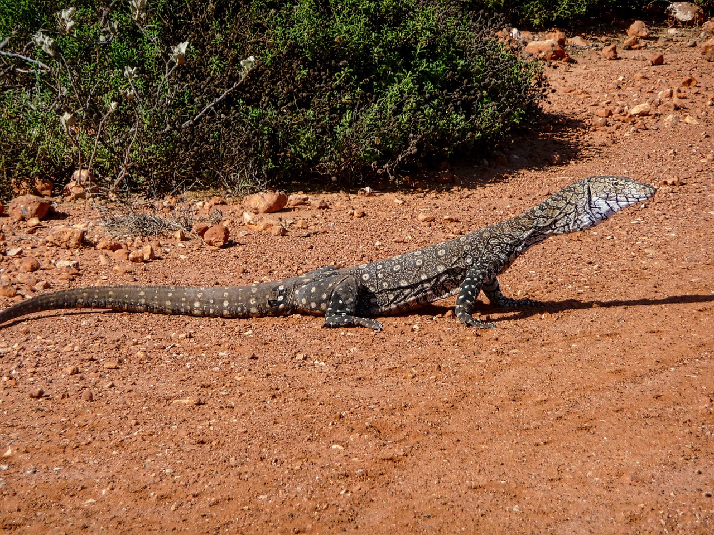

# Animals in the Bible

## License Information

Animals in the Bible © United Bible Societies, 2025. Adapted from: <cite>All Creatures Great and Small: Living Things in the Bible</cite>, by Edward R. Hope © 2005 United Bible Societies. This work is licensed under Creative Commons Attribution-ShareAlike 4.0 International (<a href="https://creativecommons.org/licenses/by-sa/4.0/">https://creativecommons.org/licenses/by-sa/4.0/</a>).

--------------------------------

## 标题：巨蜥（monitor） (id: FAUNA:4.7)

4\.7 标题：巨蜥（monitor）
===================

经文出处
----

Hebrew 来：כֹּחַ (音译：koach)

[LEV 11:30](https://ref.ly/Lev11:30)

讨论
--

*鬣蜥 (Pixabay)*

英文译本有多种译法，比如KJV (King James Version (1611)) "chameleon"（"变色龙"）、RSV (Revised Standard Version (1952)) "land crocodile"（"陆地鳄鱼"）、NEB (New English Bible (1970)) "sand\-gecko"（"沙壁虎"）、JB (Jerusalem Bible (1966)) "koach"（"小爬行动物"）、NIV (New International Version (1984)) "monitor lizard"（"巨蜥"）、REB (Revised English Bible (1989)) "sand\-gecko"（"沙壁虎"）、NAB (New American Bible (1970)) "chameleon"（"变色龙"）等，这反映出一个事实，就是我们无法确定这是哪一种蜥蜴。RSV (Revised Standard Version (1952)) 的"陆地鳄鱼"和NIV (New International Version (1984)) 的"巨蜥"是同一种蜥蜴。这个建议得到大部分现代学者的支持。这个名称的希伯来文和一个意为"力量"的词根有关，并且这个词根很可能适用于沙漠巨蜥（学名*Varanus griseus* ）和尼罗河巨蜥（学名*Varanus niloticus* ）。以色列境内没有发现尼罗河巨蜥，不过以色列人可能从埃及人那里得知这种蜥蜴。这两种巨蜥都是鬣蜥的近缘物种。

如果这个词的意思是"变色龙"，那么可能指的是变色龙的抓握力量。变色龙的爪子可以握住树枝，一侧的三个趾对着另一侧的两个趾，因此能够牢牢地抓握。然而，这种解释不如"巨蜥"的可能性大。

描述
--

*沙漠巨蜥 (© Knockout mouse (Wikimedia Commons))*

沙漠巨蜥是世界上最大的蜥蜴之一，以色列沙漠巨蜥的身体总长接近1\.2米（4英尺），其他国家的沙漠巨蜥甚至更长。这些蜥蜴的力气很大，但通常行动缓慢，只有在逃离危险的时候才会快速爬行。沙漠巨蜥是肉食动物，捕猎的食物种类很广，包括昆虫、老鼠、蛇、蜥蜴、鸟蛋、雏鸟和动物的腐肉。沙漠巨蜥的身体呈灰褐色，生活在沙漠和大草原的半沙漠地区。

尼罗河巨蜥或圆鼻巨蜥（俗称"水巨蜥"）的样子和沙漠巨蜥非常相似，但是它生活在河流附近和比较茂密的草木里面。尼罗河巨蜥的食物还包括乌龟蛋和鳄鱼蛋。

特殊意义或象征意义
---------

巨蜥被列为礼仪上不洁净的动物。

翻译
--

在各大洲温暖地带的许多国家，以及澳大利亚，都有巨蜥或鬣蜥栖息；在澳大利亚称为goanna（澳洲巨蜥）。在这些地区的当地语言中，找到一个合适的译词并不困难。否则，可以采用"巨大的蜥蜴"这样的短语。

* **Associated Passages:** 利未记 11:30

