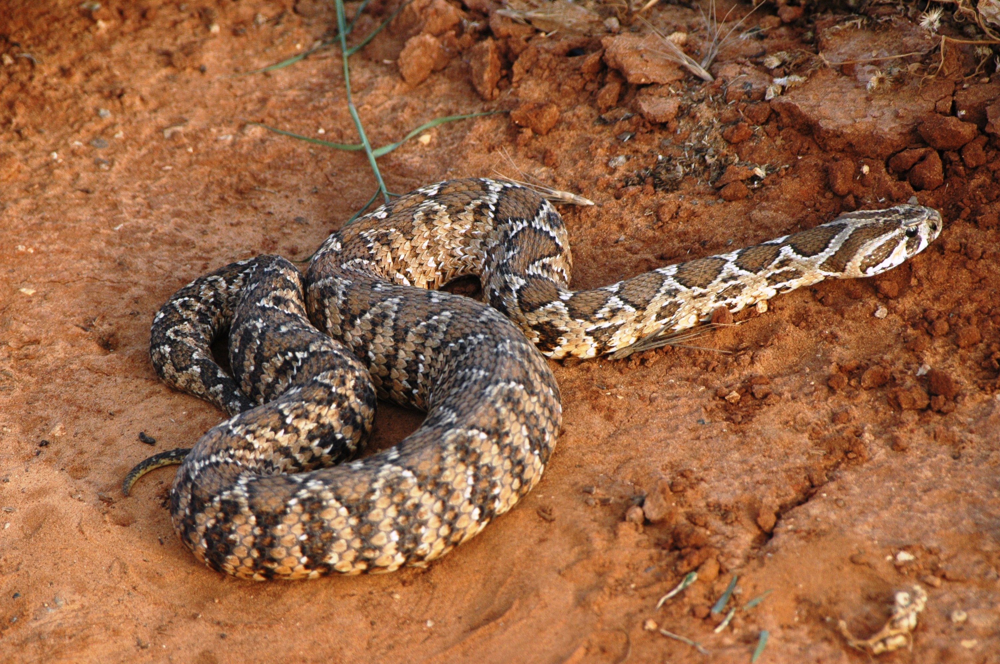

# Animals in the Bible

## License Information

Animals in the Bible © United Bible Societies, 2025. Adapted from: <cite>All Creatures Great and Small: Living Things in the Bible</cite>, by Edward R. Hope © 2005 United Bible Societies. This work is licensed under Creative Commons Attribution-ShareAlike 4.0 International (<a href="https://creativecommons.org/licenses/by-sa/4.0/">https://creativecommons.org/licenses/by-sa/4.0/</a>).

--------------------------------

## 标题：蝰蛇（viper） (id: FAUNA:4.10)

4\.10 标题：蝰蛇（viper）
==================

经文出处
----

Hebrew 来：אֶפְעֶה (音译：’ef‘eh)

[JOB 20:16](https://ref.ly/Job20:16), [ISA 30:6](https://ref.ly/Isa30:6), [ISA 59:5](https://ref.ly/Isa59:5)

Hebrew 来：שָׂרָף (音译：saraf)

[NUM 21:6](https://ref.ly/Num21:6), [NUM 21:8](https://ref.ly/Num21:8), [DEU 8:15](https://ref.ly/Deut8:15), [ISA 14:29](https://ref.ly/Isa14:29), [ISA 30:6](https://ref.ly/Isa30:6)

Hebrew 来：שְׁפִיפֹן (音译：shefifon)

[GEN 49:17](https://ref.ly/Gen49:17)

Greek 希：ἔχιδνα, ἔχις (音译：echidna, echis)

[MAT 3:7](https://ref.ly/Matt3:7), [MAT 12:34](https://ref.ly/Matt12:34), [MAT 23:33](https://ref.ly/Matt23:33), [LUK 3:7](https://ref.ly/Luke3:7), [ACT 28:3](https://ref.ly/Acts28:3), [SIR 39:30](https://ref.ly/Sir39:30)

讨论
--

以色列的很多蛇类都属于蝰蛇科。根据上下文，我们可以在一两处经文识别出具体的蛇类。另外，不同的希伯来文词语也可能是指同一种特定的蛇类。尽管将不同的词语对应同一种蛇类是基于谨慎的推理，但很大程度上仍属猜测。

以色列最常见的蝰蛇是巴勒斯坦蝰蛇（学名*Vipera palaestina* ）、地毯纹蝰蛇（学名*Echis coloratus* ）、沙蝰蛇（学名*Cerastes vipera* ）和角蝰蛇（学名*Cerastes cerastes* ）。巴勒斯坦蝰蛇是这些蝰蛇中体型最大的，它们生活在各式各样的栖息地，从北部的森林到南部旷野边缘都有它们的踪迹。由于这些地区人口最稠密，因此这种蛇咬伤人的可能性比其他蛇类都大。其他三种蝰蛇生活在旷野地区，但栖息地略有不同。沙蝰蛇和角蝰蛇生活在沙地，而地毯纹蝰蛇生活在碎石地带和岩石之间。这种蛇经常伪装在干枯的树叶中。

沙漠蝰蛇在沙地爬行时，无法按正常的方式移动，所以采取一种称为"侧行"（sidewinding）的运动方式；即把盘曲的身子侧移到头部前方的位置，再将头和身体前部尽可能向前抛远，然后落回到沙子上，如此反复。沙漠蝰蛇重复完成这个动作的速度很快，因此它在沙子上作对角移动的速度颇为惊人，尽管比不上正常爬行的速度。沙漠蝰蛇在沙子上留下的平行、细长的S形痕迹似乎是断开的，看起来就像是一连串的跳跃。一般认为，正是因着这种运动方式，圣经作者把这些蛇称为"会飞的"蛇。

描述
--

蝰蛇和其他蛇类的区别，主要在于它们会直接生出小蛇。雌蛇会把卵先保存在体内一个特殊的囊内，当卵孵化时，小蛇就会从母蛇的体内出来。较大的蝰蛇一次产出的幼蛇多达60条，较小的沙蝰蛇一次生产的数目较少，约12到15条。这就是施洗约翰所说的"毒蛇的孽种"。

蝰蛇的长尖牙长在口腔前部。这些尖牙在嘴闭合时会向后折叠。蝰蛇在攻击时，必须把嘴张得很大，才能把毒牙咬进目标位置。

在圣经时期的以色列和周围的大部分地区（从西非到南亚和中亚的一条宽阔地带），地毯纹蝰蛇（也称为锯鳞蝰蛇）非常多。这种蛇很可能就是*saraf* ，名称源于一个意为"燃烧某物"的谓语动词，指人被它的毒牙咬伤后产生的灼烧感。

地毯纹蝰蛇有两种，但差异很小。在以色列和西奈半岛，比较常见的是一种红棕色的蛇，腹部呈灰白色。这种蛇的背部有一排白色的斑点，成对缀连排列，一直延伸到身体后部，形成极好的伪装。体长可以达到80厘米（32英寸），与大多数典型的蝰蛇相比，这种蛇的头较小，躯干也比较细。地毯纹蝰蛇很容易被激怒，攻击性很强。它主要在白天活动，因为相比于很多其他蛇类，它能够承受更高的温度。地毯纹蝰蛇生活在沙漠和草原地区，以跳鼠、老鼠和鼹鼠为食。像大多数蝰蛇一样，它的毒液有剧毒，会同时作用于血管和血球，但毒性发作较慢。

在坚实的表面上，地毯纹蝰蛇像其他蛇类一样蜿蜒爬行，但在沙地上，则以侧行的方式移动。

角蝰蛇是以色列和西奈半岛两种常见的沙蝰蛇之一。顾名思义，这些蝰蛇生活在沙地。凭借鳞片的排布，角蝰蛇可以通过小幅侧行动作把自己埋在沙子里，只露出眼睛和鼻孔，以此姿态潜伏着等待猎物，猎物主要是跳鼠和其他小型啮齿动物。当沙子太热的时候，角蝰蛇会把自己埋得更深些，或者躲到石头的阴影处。

角蝰蛇的两只眼睛上方各有一片格外细长的鳞片，也就是"角"。角蝰蛇呈斑驳的浅棕色，以侧行的方式移动。头部宽阔，成年蛇的体长约75厘米（30英寸）。

沙蝰蛇的习性和角蝰蛇相似，但体型略小，以色列的沙蝰蛇体长仅35厘米（14英寸）左右。沙蝰蛇看起来很粗壮，脖子和尾巴很细，但躯干很粗，呈均匀的浅沙色。

巴勒斯坦蝰蛇比中东的其他蝰蛇要大得多。成年蛇的体长约1\.25米（4英尺），粗约100毫米（4英寸）。这种蛇花纹美丽，大体上呈浅棕色，背部中间有一条带白边的深棕色锯齿状条纹。锯齿状条纹的两侧还有带白边的深棕色斑点。头部有条纹。

巴勒斯坦蝰蛇以老鼠、蟾蜍和青蛙为食，常见于人类居住地附近，生活在石头下或草丛里。前文曾提到，这种蛇咬人最多。希腊文*echidna* 指的可能就是这种蛇。

特殊意义或象征意义
---------

在圣经中，蝰蛇和其他蛇类的基本含意相同（参上文）。除此之外，雌蝰蛇会把幼蛇带在体内，然后一次生出大量成型的幼蛇，因此人们把蝰蛇和生育能力联系在一起。这也是蝰蛇在埃及和迦南宗教体系中的象征意义。

翻译
--

尽管蝰蛇广泛分布在世界各地，但不是所有的语言都将蝰蛇和其他蛇类作了区分。如前文所述，地毯纹蝰蛇分布在非洲中部的西海岸到东海岸，以及中亚和南亚。在这些地区，这种蛇的名称可以用在所有提到蝰蛇的经文里。在非洲南部，鼓腹咝蝰（学名*Bitis arietans* ）可能是最佳翻译。

为了保留希伯来文*saraf* 和动词"燃烧某物"之间的关联，翻译者常会试着采用"烧人的毒蛇"或"火蛇"这样的表述。然而，只有当表示"烧"的词语的意思是"用灼热的东西造成伤口"时，才可以这样翻译。翻译者不应传达"使人着火的毒蛇"或"燃烧着的毒蛇"这样的意思。在多数情况下，最好的译法就是"有毒的蛇"。

[GEN 49:17](https://ref.ly/Gen49:17) ：有些注释认为该蛇是一种沙蝰蛇，因为沙蝰蛇善于隐藏，马看不到它，所以马蹄就会被咬伤。然而，沙蝰蛇生活在沙地，不太可能伏在"道旁"。因此，这里更可能是具有完美伪装的地毯纹蝰蛇。

[JOB 20:16](https://ref.ly/Job20:16) ：短语"毒蛇的舌头"，表明希伯来人相信，蛇的毒液是由舌头产生的。在翻译时，应该尽量体现希伯来人的这种观念。从上下文可以清楚地看出，以邪恶手段获取的利益被比作蛇的毒汁，因此可以考虑如下措辞：

他吸饮的是眼镜蛇的毒汁，

他所得的必像蝰蛇的毒舌毁灭他。

[ISA 59:5](https://ref.ly/Isa59:5) ：这是一节难解的经文，解经家的解释也各不相同。希伯来文本直译作：

他们孵眼镜蛇蛋，结蜘蛛网，

凡吃这蛋的必死，

一旦被打破，就孵出蝰蛇来。

解经的关键是在第一个被动分句的主语上。被压碎、挤压或打破的对象是谁，或是什么东西呢？许多解经家认为主语是"蛋"，但也有一些人认为是"恶人"（比较NAB (New American Bible (1970)) ，英文意为："如果它们中的一个被压碎，就孵出蝰蛇来"）。如果按照第一种解释，这句诗文读作：

他们孵眼镜蛇蛋，结蜘蛛网。

凡吃这蛋的必死。

蛋一压碎，就孵出蝰蛇来。

然而，许多解经家指出，蝰蛇从眼镜蛇蛋里孵出的说法是没有道理的。这句诗也就根本没有提出任何新的要点。然而，按照第二种解释，经文将读作：

他们孵眼镜蛇蛋，结蜘蛛网；

凡吃这蛋的必死；

他们被挤压，就孵出蝰蛇来。

换句话说，你若在他们恶行的结果上有份就必死；但是如果抵挡他们，你也会有危险。第二种译法的画面是：人挤压一只将要下仔的雌蛇，它体内的幼蛇就会出来。有一句古老的阿拉伯谚语说："挤压母蛇的，必被它的七个儿子咬。"这句希伯来诗文可能与这句阿拉伯谚语有着共同的起源。

* **Associated Passages:** 约伯记 20:16; 以赛亚书 30:6; 以赛亚书 59:5; 民数记 21:6; 民数记 21:8; 申命记 8:15; 以赛亚书 14:29; 创世记 49:17; 马太福音 3:7; 马太福音 12:34; 马太福音 23:33; 路加福音 3:7; 使徒行传 28:3; 德训篇 39:30

