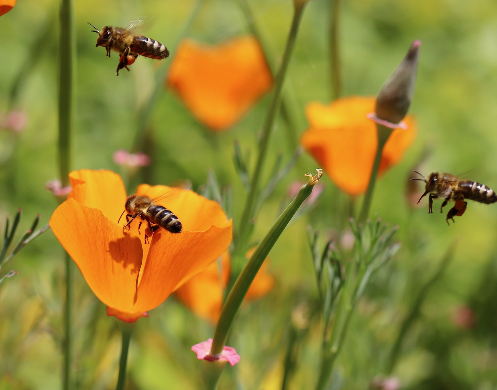

# Animals in the Bible

## License Information

Animals in the Bible © United Bible Societies, 2025. Adapted from: <cite>All Creatures Great and Small: Living Things in the Bible</cite>, by Edward R. Hope © 2005 United Bible Societies. This work is licensed under Creative Commons Attribution-ShareAlike 4.0 International (<a href="https://creativecommons.org/licenses/by-sa/4.0/">https://creativecommons.org/licenses/by-sa/4.0/</a>).

--------------------------------

## 标题：蜜蜂（bee） (id: FAUNA:6.2)

6\.2 标题：蜜蜂（bee）
===============

经文出处
----

Hebrew 来：דְּבוֹרָה (音译：devorah)

[DEU 1:44](https://ref.ly/Deut1:44), [JDG 14:8](https://ref.ly/Judg14:8), [PSA 118:12](https://ref.ly/Ps118:12), [ISA 7:18](https://ref.ly/Isa7:18)

Greek 希：μέλισσα (音译：melissa)

[SIR 11:3](https://ref.ly/Sir11:3)

讨论
--

*蜜蜂 (Pixabay)*

圣经时期，在以色列地生存的蜜蜂显然非常凶悍，因为大多数提到蜜蜂的经文都描述它们成群地移动，并且会攻击人。现今在蜂场饲养的蜜蜂都是通过特别挑选蜂王进行繁殖的，已经相当驯服，但是以前的蜜蜂很可能要凶猛得多。大多数圣经经文都是指"野蜂"，即天然蜂窝中的蜜蜂，而不是指养在人造蜂箱中的蜜蜂。然而，当时的以色列可能也有饲养蜜蜂的蜂场，因为在很早的时候，埃及、希腊和罗马等地的人就经常养蜂。

希伯来文*devash* 指蜂蜜，也指从无花果、枣椰、葡萄或某些种类的棕榈树提取出来的糖浆。"流奶与蜜之地"这个短语指的是一片肥沃的土地，因此有丰富的牧草、水果、谷物，以及可供蜜蜂酿蜜的花。

描述
--

*蜜蜂 (Annette Meyer (Pixabay))*

蜜蜂是一种会飞的昆虫，采集各种花蜜，然后将其转化为蜂蜜。蜜蜂群聚生活，每个蜂群通常有几千只蜜蜂，在空心原木、岩石缝隙、地底下的洞穴、白蚁弃置的蚁穴，或者其他地方筑窝。在蜂窝里面，蜜蜂用蜂蜡建造蜂巢。蜂巢中有很多小房间（蜂房），蜂王在最靠近蜂窝中心的蜂房产卵，幼蜂便在蜂房里长大，蜂蜜则储存在较靠外边的蜂房。蜜蜂会螫人，当它们感到自己的蜂窝受到威胁时就会采取行动。当一只蜜蜂螫刺后，发出的气味会使蜂窝中其他的蜜蜂也变得有攻击性。

翻译
--

由于全世界都有蜜蜂，因此翻译时通常没有什么问题。在翻译[JDG 14:8](https://ref.ly/Judg14:8) 时，如果目标语言没有表示"蜂"的统称，那么可以使用表示"蜜蜂"的特定名称，或是能酿造可食用蜂蜜的蜂类名称。但在圣经其他所有提到蜂的地方，都应该使用群聚飞行，并且会螫刺入侵者的蜂类名称。

备注：NEB (New English Bible (1970)) 英文意为"他们包围我，就像蜜蜂围着蜜一样"，这肯定是错误的。这里的意思不是蜜蜂围绕着蜜，而是蜜蜂群集，准备攻击。

* **Associated Passages:** 申命记 1:44; 士师记 14:8; 诗篇 118:12; 以赛亚书 7:18; 德训篇 11:3

